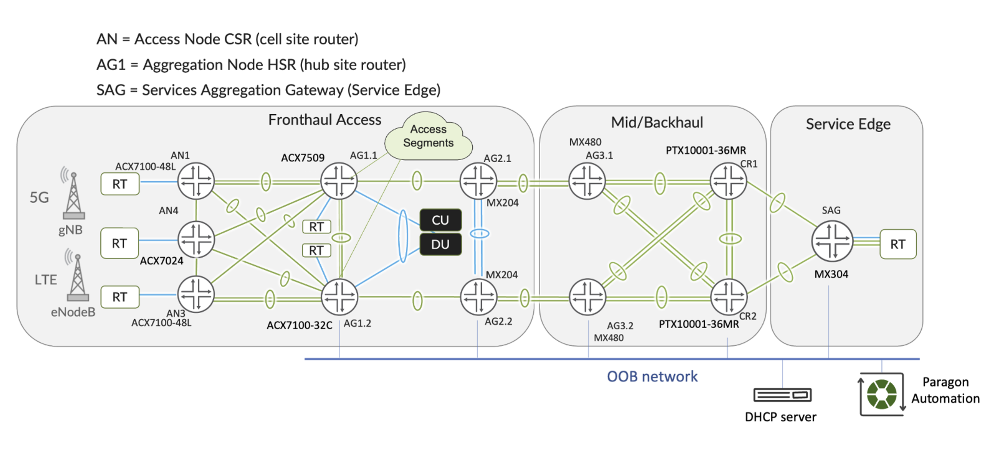

# Configurations

Here you can find the configurations related to:

- AN: Access nodes
- AG: Aggregation nodes
- Core: Core nodes
- SAG: Services Aggregation Gateway

related to the Automation JVD topology used. (Coming from 5G Fronthaul JVD solution ([JVD-5G-FH-COS-LLQ-02-04](https://www.juniper.net/documentation/us/en/software/jvd/jvd-5g-fh-cos-llq-02-04/5g_xhaul_low_latency_class_of_service_juniper_validated_design_jvd.html)))

## Access Nodes

For these particular nodes, there is a distinction between onboarding configuration and services configuration.

- onboarding: Configuration coming from DHCP server when ZTP.
- services: Final configuration being provisioned by a Configuration Template while onboarding.

## Aggregation Nodes

Configurations of nodes:

- AG1.1
- AG1.2
- AG2.1
- AG3.1
- AG3.2
- CU_DU

## Core

Configuration of nodes:

- CR1
- CR2