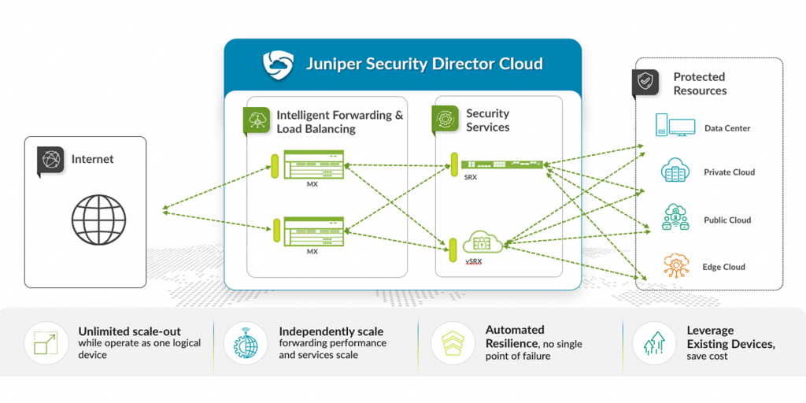
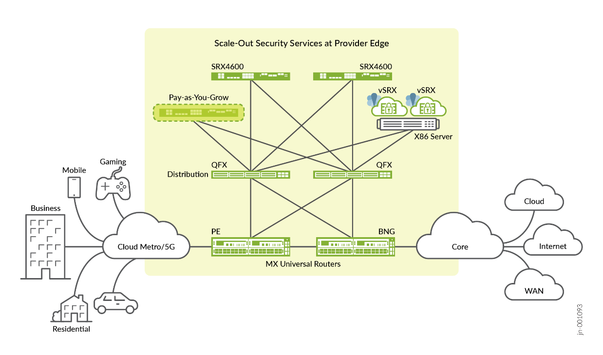
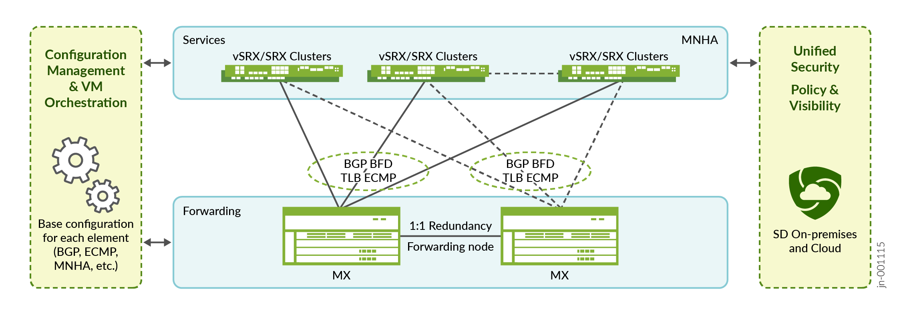
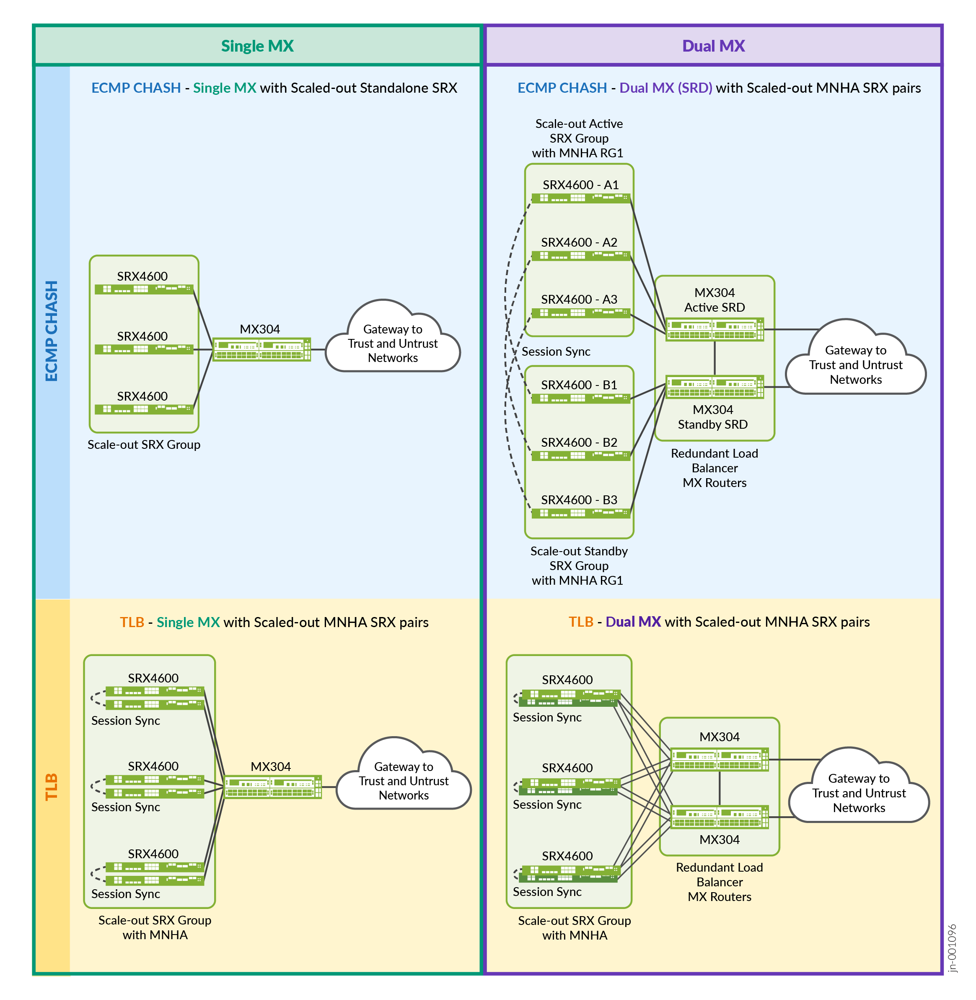

# Connected Security Distributed Services (CSDS)

## SCALEOUT – the technical architecture used by CSDS

---

## 📄 Public Documents

- [CSDS Experience First Page](https://www.juniper.net/documentation/product/us/en/connected-security-distributed-services/)
- [CSDS Release Notes](https://www.juniper.net/documentation/us/en/software/connected-security-distributed-services/csds-release-notes/index.html)
- [CSDS Deployment Guide](https://www.juniper.net/documentation/us/en/software/connected-security-distributed-services/csds-deploy/index.html)
- [RE-Based Health Check CLI](https://www.juniper.net/documentation/us/en/software/junos/cli-reference/topics/ref/statement/routing-engine-mode-edit-services-traffic-load-balance.html)

---

## 📘 Juniper Validated Designs (JVDs)

Solution architectures are documented in multiple Juniper Validated Design documents:

- [All Public JVDs](https://www.juniper.net/documentation/validated-designs/)
  - [Service Provider](https://www.juniper.net/documentation/validated-designs/us/en/service-provider-edge/)
  - [Security](https://www.juniper.net/documentation/validated-designs/us/en/security/)
  - [Datacenter](https://www.juniper.net/documentation/validated-designs/us/en/data-center/)

---

## 📦 CSDS ScaleOut JVD Scenarios

A common general view for all CSDS ScaleOut scenarios:

> MX Series routers act as stateless load balancers for SRX-based stateful security services.

---

### 🚀 Service Provider JVD

- [Juniper Scale-Out Stateful Firewall and CGNAT for SP Edge](https://www.juniper.net/documentation/us/en/software/jvd/jvd-offbox-cgnat-01-01-sp/index.html)

---

### 🏢 Enterprise JVD

- [Juniper Scale-Out Stateful Firewall and Source NAT for Enterprise](https://www.juniper.net/documentation/us/en/software/jvd/jvd-mse-cgnat-offbox-ent-01-01/index.html)

---

## 🧩 Common Technical Architectures

These JVDs are all based on the same ScaleOut technical architecture, which has four deployment options:

- Single MX with multiple standalone SRX/vSRX
- Dual MX (using SRD) with multiple pairs of SRX/vSRX (MNHA)
- Single MX with multiple pairs of SRX/vSRX (MNHA)
- Dual MX with multiple pairs of SRX/vSRX (MNHA)

> Why four options?  
Some designs favor lightweight deployments with minimal redundancy. Others require added resiliency (via MNHA or SRD), or both ("belt and suspenders").

---

## 🔁 Traffic Load Balancing

Two methods are supported, each with shared fundamentals:

- **ECMP CHASH**  
  Load balances traffic across SRX devices using ECMP and consistent hashing. Relies on BGP and BFD to maintain path liveness.

- **TLB / TO**  
  Uses ECMP CHASH underneath, but adds service-level grouping and health checks to maintain per-service availability and load distribution.

---

## ⚙️ Configuration Notes

This folder contains configurations for the **TLB-based architecture** for Stateful Firewall and CGNAT services using both IPv4 and IPv6.

Other config examples for **ECMP CHASH** and **TLB** variants are included in the respective JVD documents.

---

## 🔤 Acronyms

| Acronym | Description |
|---------|-------------|
| **CSDS-TO / TLB** | CSDS Traffic Orchestrator (formerly Traffic Load Balancer) |
| **TLB** | Traffic Load Balancer (now also referred to as TO) |
| **ECMP** | Equal Cost Multi-Path |
| **CHASH** | ECMP Consistent Hashing mechanism |
| **SRD** | Service Redundancy Daemon (between two MX REs) |
| **MNHA** | Multi-Node High Availability for SRX (Active/Backup or Active/Active) |
| **CGNAT** | Carrier-Grade NAT with Port Block Allocation |
| **SFW** | Stateful Firewall |
| **IPSEC** | IP Security with IKE (v1/v2) and ESP encryption |

---

