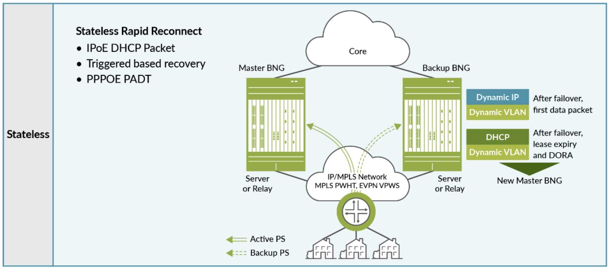
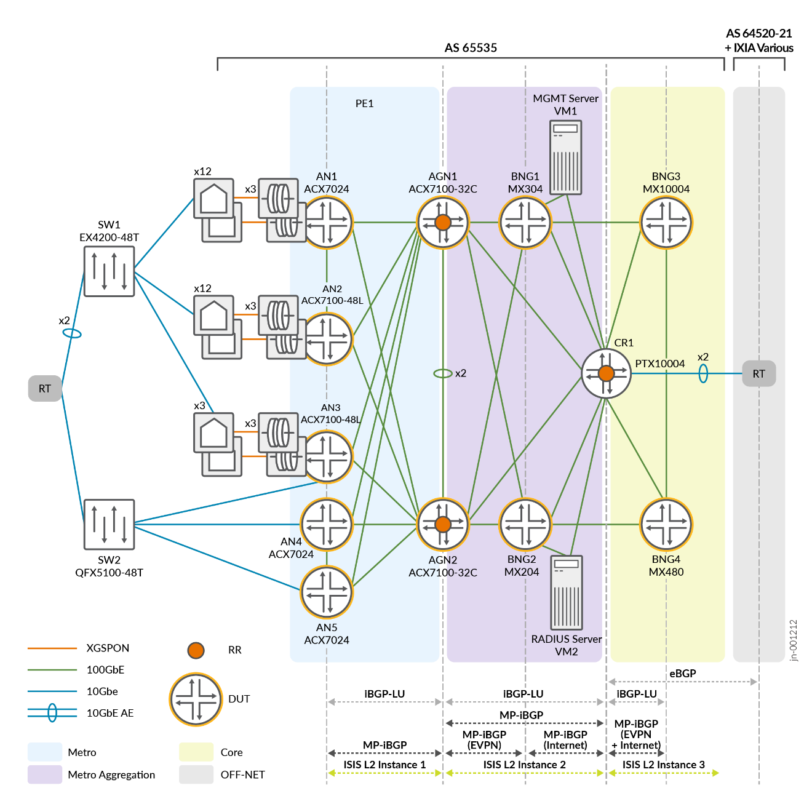

# Metro Fabric and Broadband Edge JVD

Use Cloud Metro fabric principles to stitch together access, aggregation, and BNG functions, simplifying deployment and reducing costs. This solution seamlessly integrates with Juniper's Scale-out Carrier Grade NAT (CGNAT) solution, enhancing network scalability and resilience while supporting dynamic expansion based on subscriber demand.

---

## 📄 Metro Fabric BBE JVD Documentation

- **JVD Document:**  
  [Broadband Edge JVD](https://www.juniper.net/documentation/us/en/software/jvd/jvd-metro-fabric-and-broadband-edge/index.html)

- **Solution Overview:**  
  [PDF Overview](https://www.juniper.net/documentation/us/en/software/jvd/solution-overview-metro-fabric-and-broadband-edge.pdf)

- **Test Report Brief:**  
  [PDF Test Brief](https://www.juniper.net/documentation/us/en/software/jvd/test-report-brief-metro-fabric-and-broadband-edge.pdf.pdf)

---

