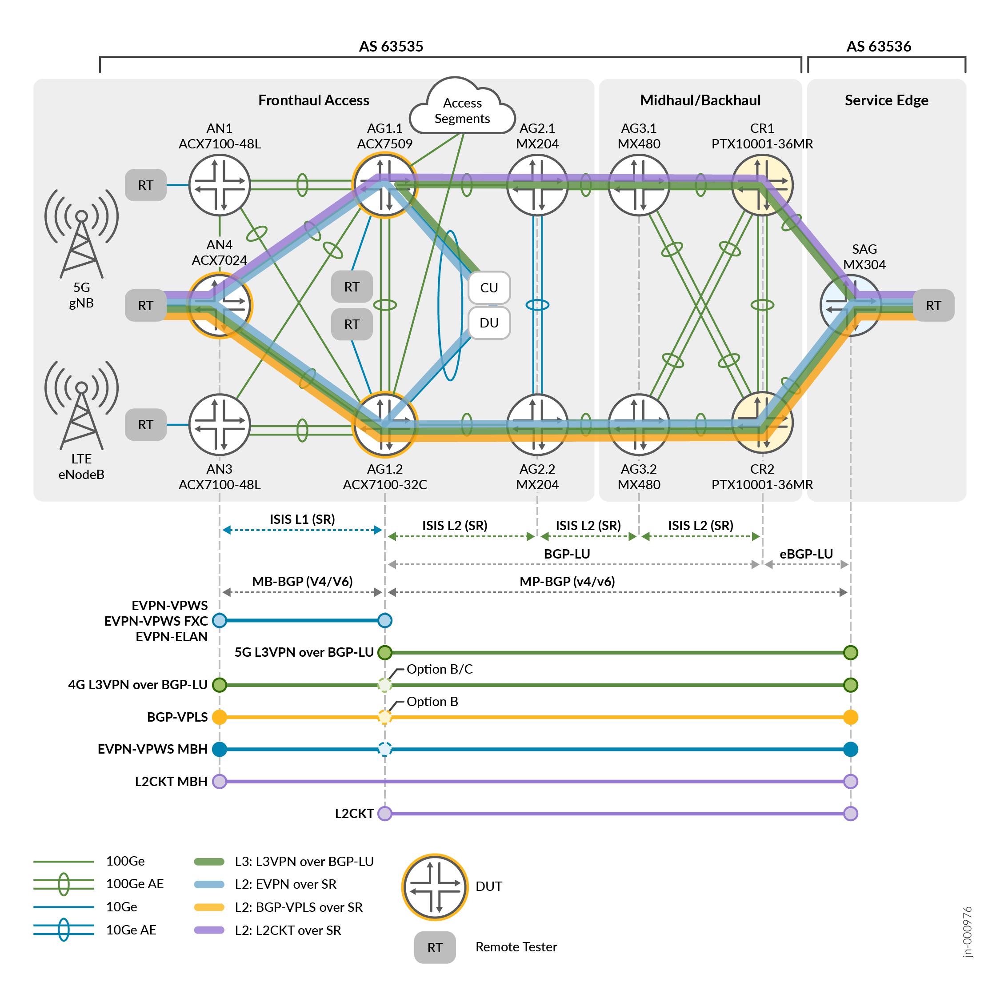
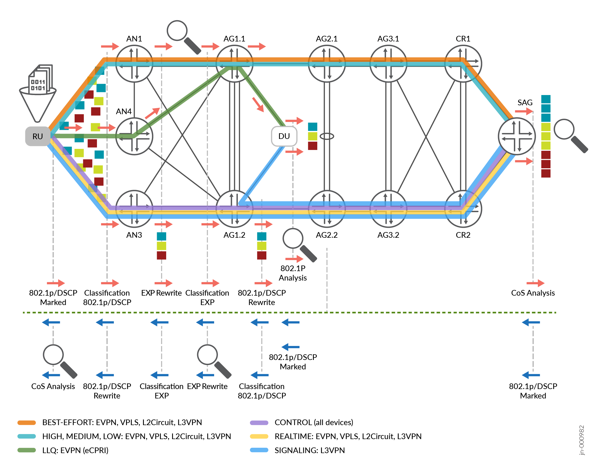

# Low Latency QoS Design for Metro & 5G – Juniper Validated Design (JVD)

Validated design for **low-latency Class of Service (CoS)** across **Metro and 5G xHaul**, including **LLQ behavior**, **classification/remarking**, and **measured latency performance** under congestion.

Unlock the full potential of 5G with our Low-Latency QoS solutions, ensuring unparalleled performance and reliability across diverse applications. Prioritize critical workloads, minimize transmission delays, and deliver an exceptional user experience. Our 5G architecture positions your network at the forefront of innovation and efficiency.

---

  
> Figure: Example 5G xHaul CoS/LLQ topology used for validation.

---

## 🧱 Solution Highlights

- **5G xHaul CoS model aligned to O-RAN multi-priority queuing**
  - Three CoS building blocks: **Low Latency Queues**, **Shaped Priority Queues**, and **Weighted Fair Queues (WFQ)**
  - An **eight-queue CoS model** supporting multi-level priority QoS across fronthaul, midhaul, and backhaul
 
- **Latency budget preservation for fronthaul**
  - Target: **≤10 µs per transit node** for priority flows (validated under congestion)

- **Traffic classification + rewrite validation (end-to-end)**
  - Classification at service edges using **Behavior Aggregate / Fixed / Multifield** methods
  - Marking + rewrite validation across L2/L3 services with SR-MPLS transport:
    - **802.1p / DSCP → MPLS EXP** (preservation/rewrite verified via counters and packet capture)

- **Validated services**
  - **Fronthaul:** EVPN-VPWS (primary), EVPN-FXC, EVPN-ELAN, L3VPN
  - **Midhaul / Mobile Backhaul (MBH):** L3VPN, BGP-VPLS, L2Circuit

- **Validated platforms (DUTs and extended roles)**
  - **ACX7024** (CSR role), **ACX7100-32C** and **ACX7509** (HSR roles)
  - Extended validation includes **MX304** as Services Aggregation Gateway (SAG) and **PTX10001-36MR** in the Core

---

## 🧪 Test Coverage & Validation

> Figure: CoS validation workflow (classification, remarking, congestion testing, and measurement).

- **Deterministic priority behavior under load**
  - LLQ serviced ahead of other strict/priority/WFQ classes as designed
  - Priority hierarchies remain honored even when multiple VPN services share common links

- **Measured low-latency performance (device and service topologies)**
  - Latency measured in microseconds across multiple lab topologies:
    - **Topology 1:** single-device DUT latency characterization (CSR/HSR roles)
    - **Topology 2:** point-to-point **EVPN-VPWS** fronthaul latency (2-hop service)
    - Additional topologies validate multihoming behaviors and operational conditions
- **Congestion resilience**
  - Congestion scenarios confirm critical low-latency flows remain protected and prioritized during contention and packet loss conditions

---

## 📄 Documentation

- **Design Center (Service Provider Metro/Edge):** [service-provider-edge](https://www.juniper.net/documentation/validated-designs/us/en/service-provider-edge/)
- **Solution Overview (PDF):** [sol-overview-5g-fh-cos-llq-02-04.pdf](https://www.juniper.net/documentation/us/en/software/jvd/sol-overview-5g-fh-cos-llq-02-04.pdf)
- **JVD Metro LLQ Design (HTML):** [jvd-5g-fh-cos-llq-02-04](https://www.juniper.net/documentation/us/en/software/jvd/jvd-5g-fh-cos-llq-02-04/index.html)
- **Results Summary & Analysis (HTML):** [results_summary_and_analysis](https://www.juniper.net/documentation/us/en/software/jvd/jvd-5g-fh-cos-llq-02-04/results_summary_and_analysis.html)
- **Test Report Brief (PDF):** [test-report-brief-5g-fh-cos-llq-02-04.pdf](https://www.juniper.net/documentation/us/en/software/jvd/test-report-brief-5g-fh-cos-llq-02-04.pdf)

---

#### Related JVDs (Prerequisites / Building Blocks)

- [**5G Mobile xHaul with Seamless MPLS Segment Routing (CSR / Seamless SR-MPLS)**](https://www.juniper.net/documentation/us/en/software/jvd/jvd-5g-fh-csr-02-03/index.html)

- [**5G Fronthaul Class of Service (baseline CoS model)**](https://www.juniper.net/documentation/us/en/software/jvd/jvd-5g-fh-cos-02-02/index.html)

---
