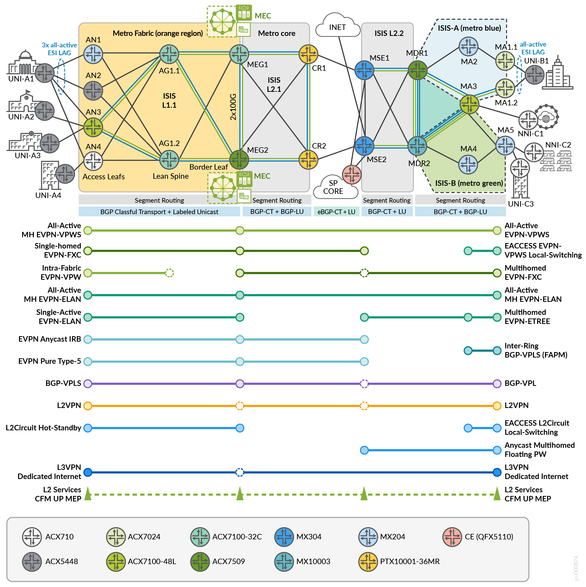

# Metro Ethernet Business Services – Juniper Validated Design (JVD)

The Metro Ethernet Business Services (Metro EBS) JVD defines a production-ready Cloud Metro architecture composed of a scalable Metro Fabric for access and aggregation, seamlessly integrated with a resilient multi-ring core. This validated design enables x-to-anything connectivity across MEF 3.0-compliant EVPN, VPLS, L2VPN, and L3VPN services. Leveraging Juniper ACX, MX, and PTX Series platforms, the solution supports interdomain color-aware transport, TI-LFA-based resiliency, and intent-based traffic steering for high-performance, future-ready metro deployments.

---

## 🧱 Solution Highlights

- **Metro Fabric + Multi-Ring Core**: Separation of access/aggregation and core domains with seamless interworking
- **Segment Routing (SR-MPLS)** transport with TI-LFA for sub-50ms convergence
- **MEF-compliant service overlays**, including:
  - **EVPN-VPWS**, **EVPN-FXC**, **EVPN-ELAN**, **EVPN-ETREE**
  - **Floating Pseudowires** with Anycast-SID and vESI for active-active L2 resiliency
  - **BGP-VPLS**, **L2VPN**, **L2Circuit**, **L3VPN**, and **EVPN ELAN Type 5**
- **End-to-end resiliency** with active/standby and active/active redundancy
- **Transport Classes** and **BGP Classful Transport (BGP-CT)** for traffic steering
- Validated on platforms including **ACX7024, ACX7100-32C,ACX7100-48L, ACX5448, ACX710, MX204, MX304, PTX10001-36Mr**

---

## 🧪 Test Coverage & Validation

The JVD includes over 1,400 tests across 20+ scenarios, validating:

- Control plane convergence and data plane resiliency
- EVPN service provisioning and interoperability
- TI-LFA fast reroute, BFD, and multipath traffic engineering
- L2/L3 service failover and scaling benchmarks
- Standards compliance with MEF 3.0 service definitions

---

## 📄 Documentation

- **JVD Document:**  
  [Metro EBS JVD](https://www.juniper.net/documentation/us/en/software/jvd/jvd-metro-ebs-03-01/index.html)

- **Solution Overview:**  
  [PDF Overview](https://www.juniper.net/documentation/us/en/software/jvd/sol-overview-metro-ebs-03-01.pdf)

- **Test Report Brief:**  
  [PDF Test Brief](https://www.juniper.net/documentation/us/en/software/jvd/test-report-brief-metro-ebs-03-01.pdf)

- **🎥 YouTube Overview:**  
  [Watch the video](https://www.youtube.com/watch?v=dh3qvZMIhXA)

---

## 📦 Extended Design: Metro as a Service (MaaS)

This solution is extended by the [Metro as a Service (MaaS) JVD](https://www.juniper.net/documentation/us/en/software/jvd/jvd-metro-ebs-mef-03-02/index.html), which builds upon Metro EBS by introducing a richer services portfolio and full end-to-end MEF 3.0 conformance over a Cloud Metro architecture.

- **MaaS Solution Overview:**  
  [PDF Overview](https://www.juniper.net/documentation/us/en/software/jvd/solution-overview-metro-ebs-mef-03-02.pdf)

- **Test Report Brief:**  
  [PDF Test Brief](https://www.juniper.net/documentation/us/en/software/jvd/test-report-brief-metro-ebs-mef-03-02.pdf)

- **GitHub Configurations:**  
  [Metro as a Service Configs](https://github.com/Juniper/jvd/tree/main/Service%20Provider/Metro%20as%20a%20Service)

---

