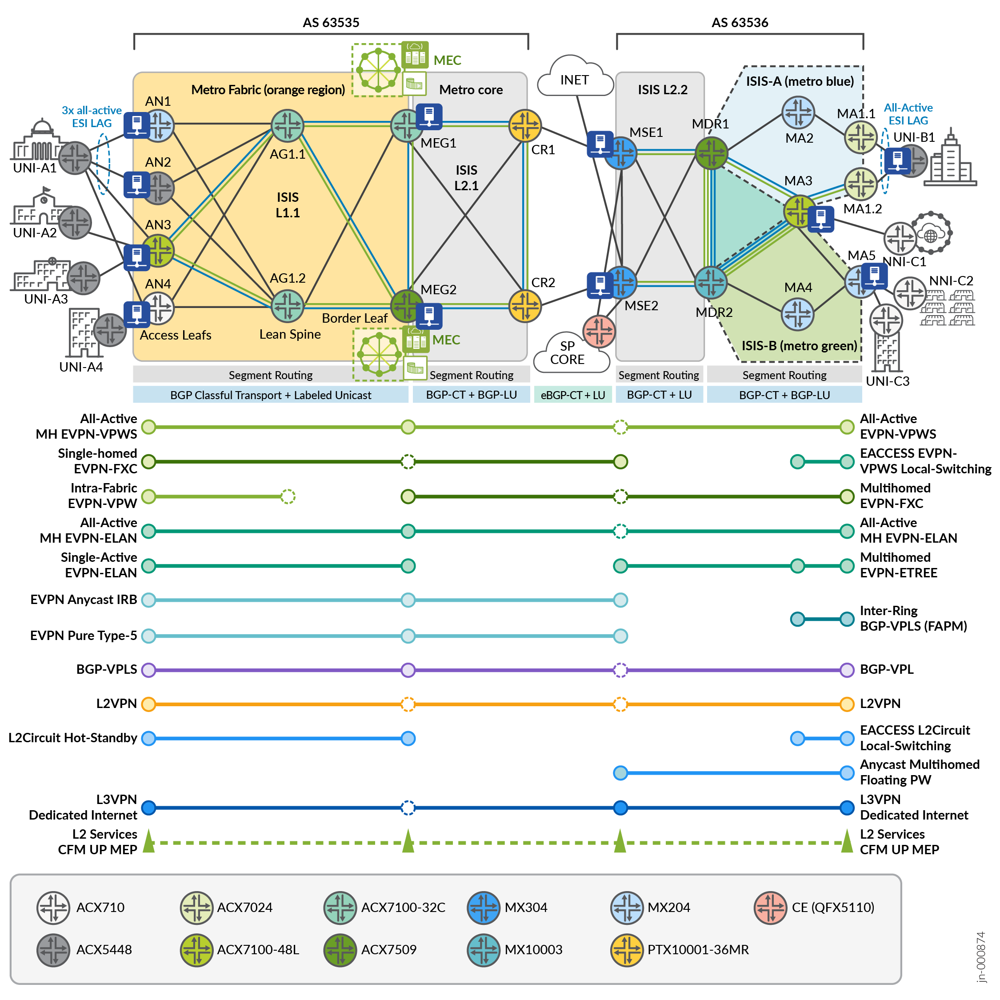

<<<<<<< HEAD
Metro as a Service (MaaS) sets a new industry benchmark with the first validated design to achieve full end-to-end MEF 3.0 compliance over a Cloud Metro architecture, featuring a dense services portfolio. With MaaS, operators can trust that Juniper solutions meet the most stringent performance, quality, reliability, and interoperability standards required for Carrier Ethernet service delivery.
=======
# Metro as a Service (MaaS) JVD

Metro as a Service (MaaS) sets a new industry benchmark with the first validated design to achieve full end-to-end **MEF 3.0 conformance** over a **Cloud Metro architecture**, featuring a dense services portfolio.

With MaaS, operators can trust that Juniper solutions meet the most stringent **performance**, **quality**, **reliability**, and **interoperability** standards required for Carrier Ethernet service delivery.

---

## 📄 MaaS JVD Documentation

- **JVD Document:**  
  [Metro as a Service JVD](https://www.juniper.net/documentation/us/en/software/jvd/jvd-metro-ebs-mef-03-02/index.html)

- **Solution Overview:**  
  [PDF Overview](https://www.juniper.net/documentation/us/en/software/jvd/solution-overview-metro-ebs-mef-03-02.pdf)

- **Test Report Brief:**  
  [PDF Test Brief](https://www.juniper.net/documentation/us/en/software/jvd/test-report-brief-metro-ebs-mef-03-02.pdf)

---

## 🧱 Metro Ethernet Business Services JVD Resources

The Metro as a Service JVD is built upon the Metro Ethernet Business Services (EBS) JVD architecture.

- **JVD Document:**  
  [Metro EBS JVD](https://www.juniper.net/documentation/us/en/software/jvd/jvd-metro-ebs-03-01/index.html)

- **Solution Overview:**  
  [PDF Overview](https://www.juniper.net/documentation/us/en/software/jvd/sol-overview-metro-ebs-03-01.pdf)

- **Test Report Brief:**  
  [PDF Test Brief](https://www.juniper.net/documentation/us/en/software/jvd/test-report-brief-metro-ebs-03-01.pdf)

- **Full GitHub Configurations:**  
  [View on GitHub](https://github.com/Juniper/jvd/tree/main/Service%20Provider/Metro%20Ethernet%20Business%20Services)

- **🎥 YouTube Overview:**  
  [Watch the video](https://www.youtube.com/watch?v=dh3qvZMIhXA)

---

>>>>>>> fce844f (update MaaS readme)
