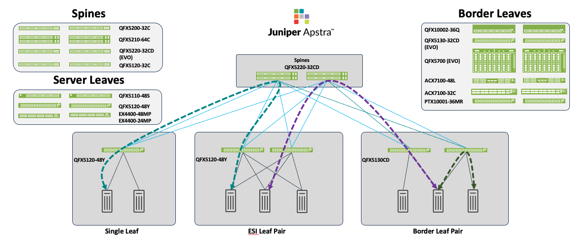

# 3-Stage EVPN/VXLAN Data Center Design

Validated configurations for the Juniper Validated Design *"3-Stage Data Center Design with Juniper Apstra."* This is the most common Juniper data center fabric architecture, built on EVPN/VXLAN with an **Edge-Routed Bridging (ERB)** overlay and a **lean spine** underlay.

* JVD landing page: <https://www.juniper.net/documentation/us/en/software/jvd/jvd-3-stage-datacenterdesign-with-juniper-apstra/index.html>

The JVD validates the design against multiple Juniper switching platforms in each role, so customers can choose the platform that best matches their density, scale, and budget requirements.

## Hardware

| Juniper Product | Role | Hostnames | Software |
|---|---|---|---|
| **QFX5220-32CD** | Spine | `dc1-spine1`, `dc1-spine2` | Junos OS Evolved 23.4R2-S3 |
| **QFX5120-48Y** | Server leaf | `dc1-single-001-leaf1` | Junos OS 23.4R2-S3 |
| **QFX5120-48Y** | ESI leaf pair | `dc1-esi-001-leaf1`, `dc1-esi-001-leaf2` | Junos OS 23.4R2-S3 |
| **QFX5130-32CD** | Border leaf pair *(canonical)* | `dc1-border-leaf1`, `dc1-border-leaf2` | Junos OS Evolved 23.4R2-S3 |
| ACX7100-48L | Border leaf pair *(alternative)* | — | Junos OS Evolved |
| PTX10001-36MR | Border leaf pair *(alternative)* | — | Junos OS Evolved |
| QFX5120-32C | Border leaf pair *(alternative)* | — | Junos OS |
| QFX5700 | Border leaf pair *(alternative)* | — | Junos OS Evolved |

## Configurations

Common to every variant:

| File | Role |
|---|---|
| [`spine1_qfx5220-32cd.conf`](configuration/conf/spine1_qfx5220-32cd.conf) | Spine 1 |
| [`spine2_qfx5220-32cd.conf`](configuration/conf/spine2_qfx5220-32cd.conf) | Spine 2 |
| [`esi-leaf1_qfx5120-48y.conf`](configuration/conf/esi-leaf1_qfx5120-48y.conf) | ESI leaf 1 |
| [`esi-leaf2_qfx5120-48y.conf`](configuration/conf/esi-leaf2_qfx5120-48y.conf) | ESI leaf 2 |
| [`server-leaf1_qfx5120-48y.conf`](configuration/conf/server-leaf1_qfx5120-48y.conf) | Single-homed server leaf |

Border-leaf pair, by validated platform:

| Platform | Border leaf 1 | Border leaf 2 |
|---|---|---|
| ACX7100-48L | [`borderleaf1_acx7100-48l.conf`](configuration/conf/borderleaf/borderleaf1_acx7100-48l.conf) | [`borderleaf2_acx7100-48l.conf`](configuration/conf/borderleaf/borderleaf2_acx7100-48l.conf) |
| PTX10001-36MR | [`borderleaf1_ptx10001-36mr.conf`](configuration/conf/borderleaf/borderleaf1_ptx10001-36mr.conf) | [`borderleaf2_ptx10001-36mr.conf`](configuration/conf/borderleaf/borderleaf2_ptx10001-36mr.conf) |
| QFX5120-32C | [`borderleaf1_qfx5120-32c.conf`](configuration/conf/borderleaf/borderleaf1_qfx5120-32c.conf) | [`borderleaf2_qfx5120-32c.conf`](configuration/conf/borderleaf/borderleaf2_qfx5120-32c.conf) |
| **QFX5130-32CD** *(canonical)* | [`borderleaf1_qfx5130-32cd.conf`](configuration/conf/borderleaf/borderleaf1_qfx5130-32cd.conf) | [`borderleaf2_qfx5130-32cd.conf`](configuration/conf/borderleaf/borderleaf2_qfx5130-32cd.conf) |
| QFX5700 | [`borderleaf1_qfx5700.conf`](configuration/conf/borderleaf/borderleaf1_qfx5700.conf) | [`borderleaf2_qfx5700.conf`](configuration/conf/borderleaf/borderleaf2_qfx5700.conf) |

> The spine configurations show borderleaf-facing port assignments wired to the **QFX5130-32CD** variant of the JVD lab. When deploying with a different border-leaf platform, only the spine's borderleaf-facing port number changes; the rest of the spine configuration is identical.
