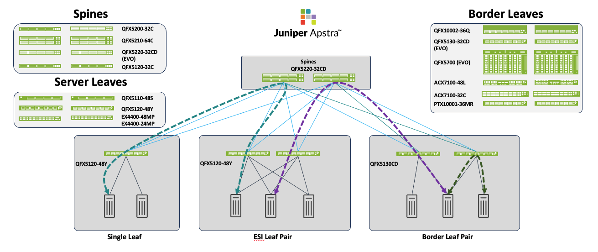

>
> Faithful markdown conversion of the published Juniper Validated Design
> "EVPN VXLAN 3-Stage IPv6 Data Center with Apstra"
> (JVD-DCFABRIC-3STAGE-IPV6-01-01). The design narrative, validated-functionality
> matrix, and validation results are reproduced here; the Apstra Configuration
> Walkthrough, the CLI Verification section, and the per-device Junos Configuration
> Overview are summarized and linked out to
> [`../configuration/conf/`](../configuration/conf/), which holds the complete
> validated configurations. This JVD extends the
> [3-Stage EVPN/VXLAN Fabric with Juniper Apstra](design-guide.md) (IPv4 underlay)
> with an IPv6 underlay.

# EVPN/VXLAN 3-Stage Data Center with an IPv6 Underlay — Juniper Validated Design (JVD)

Juniper Networks Validated Designs provide you with a comprehensive, end-to-end
blueprint for deploying Juniper solutions in your network. These designs are
created by Juniper's expert engineers and tested to ensure they meet your
requirements. Using a validated design, you can reduce the risk of costly mistakes,
save time and money, and ensure that your network is optimized for maximum
performance.

## About this Document

This document is an HPE Juniper Validated Design for a 3-stage data center ERB
architecture design with an IPv6 underlay. The document focuses on the
implementation of a 3-stage data center fabric with Juniper switches supporting
EVPN-VXLAN with an IPv6 underlay. It also touches upon deployment of the 3-stage
data center design using Apstra and the features that are configured. This document
is intended for an audience familiar with Juniper technologies such as the Junos OS,
QFX switches, and Juniper Apstra. A detailed configuration template for each switch
role is uploaded on GitHub for the 3-stage design.

> **NOTE:** Edge-routed bridging (ERB) is the Juniper terminology for a network
> architecture that is referred to elsewhere in the industry as distributed VXLAN
> routing with EVPN or the distributed gateways model.

## Solution Benefits

The 3-Stage Fabric with Juniper Apstra is designed to meet the needs of most of
Juniper's customers, has been extensively tested by Juniper, and is deployed by
customers across the globe. This JVD follows the existing 3-Stage EVPN/VXLAN Fabric
with Juniper Apstra JVD (which covers the IPv4 fabric solution); here the IPv6
underlay and overlay solution and features are covered along with the Apstra
implementation. The main drivers for IPv6 adoption are:

- Exponential growth of IoT devices and AI workloads, which demands IPv6's massive
  scalability.
- Government and public-sector mandates for the use of IPv6 in their networks.
- Major cloud provider support (AWS, Azure, Google Cloud) for IPv6 natively to meet
  scalability demands.

With its 128-bit addressing scheme, IPv6 offers massive scalability and incorporates
native IPsec support. Using IPv6 link-local addressing in the fabric reduces
operational overhead, eliminates the need to manage global IPv4 addresses on links,
and prevents address exhaustion. For this JVD, Juniper Apstra acts as an
Intent-Based Networking (IBN) platform that automates IP Address Management (IPAM)
and streamlines BGP neighbor discovery and configuration as part of its data center
fabric management.

### HPE Juniper Apstra

Juniper Validated Designs in the data center start with the Apstra software, a
multi-vendor, intent-based networking system (IBNS) that provides closed-loop
automation and assurance. The core benefits of Apstra are:

- **Intent-based networking** — Apstra automates configuration creation to realize
  the intent, deploys the configuration to appropriate devices, and continuously
  validates the operating state against the intended state.
- **Network Automation** — Apstra is a multi-vendor network automation platform that
  is continuously updated to work with the latest hardware and is extensively tested
  using modern DevOps practices.
- **Recoverability** — The built-in rollback capability of Apstra allows you to
  quickly restore the system to a known-working configuration if needed.
- **Day 2+ Management** — Apstra's rich data analysis capabilities, including Flow
  Data, reduce Mean Time to Resolution (MTTR).
- **Simplicity** — Apstra simplifies network deployment and management, for example
  by reducing the complexity of a Data Center Interconnection (DCI).

## Use Case and Reference Architecture

The design covered in this JVD focuses on the 3-stage ERB architecture already
covered in the 3-Stage EVPN/VXLAN Fabric with Juniper Apstra JVD (which provisions an
IPv4 underlay fabric with EVPN-VXLAN). The primary use case of this JVD is to
validate an EVPN-VXLAN fabric with an IPv6 underlay solution deployed using HPE
Juniper Apstra. The Juniper switches qualified in this JVD support EVPN-VXLAN with an
IPv6 underlay and are validated in the respective Spine and leaf roles.


*Figure 1: 3-Stage Architecture — Lean Spines, Server leaf Switches and Border Leaf Switches.*

## Solution Architecture

The 3-Stage Fabric with Juniper Apstra is an EVPN/VXLAN-based validated design based
upon the ERB network architecture. Each network switch participating in the design
must occupy one of three roles:

- **Server Leaf Switches** — The leaf switch focuses on learning and advertising the
  local MAC addresses to other remote switches through the BGP EVPN control plane, so
  leaf switches can discover all the "remote" hosts without flooding the overlay with
  ARP/ND requests.
- **Border Leaf Switches** — Although a border leaf can function as a server leaf
  switch, it can also act as a gateway to external networks and hence requires DCI
  features (connecting to network overlays such as VMware NSX-T, MACSEC, deep
  buffers, and so on).
- **Spine Switches** — The spine switch only performs IP forwarding and relaying of
  routes to all server and border leaf switches. As a result, spine switches in ERB
  network architectures are referred to as lean spines.

The ERB network architecture can be thought of as a distributed chassis: leaf
switches are roughly analogous to a "line card" in a traditional modular chassis,
while the lean spine means the network fabric is more flexible and resilient than a
single modular chassis switch. This JVD walks through the high-level steps required
to configure a 3-stage data center, with QFX5220-32CD switches in the spine role,
QFX5130-32CD switches in the border leaf role, and QFX5120-48Y switches in the server
leaf role. These switches in these roles are considered the baseline design of this
JVD, though other switches are qualified for these roles, as documented below.

### Juniper Hardware and Software Components

For this solution, the Juniper products and software versions are as below. The
design documented in this JVD is considered the baseline representation for the
validated solution.

#### Table 1: Supporting Devices for 3-stage EVPN/VXLAN Fabric (ERB)

| Server Leaf Switches | Border Leaf Switches | Spine |
|----------------------|----------------------|-------|
| QFX5120-48Y / QFX5120-48YM | QFX5130-32CD / QFX5130E-32CD, QFX5700 / QFX5700E | QFX5220-32CD |

> **NOTE:** The JVD assumes that the other model variations of the tested device in
> the hardware series should also work. For instance, QFX5120-48YM covers all the
> rest of the variations such as QFX5120-48Y since the same chipset is used. However,
> there are some exceptions such as QFX5130-48C and QFX5130-32CD. Please contact the
> Juniper account representative for more information.

For the purposes of this JVD document, the following switches are used for the
configuration walkthrough:

#### Table 2: Hardware for 3-Stage Data Center JVD Reference Design

| Juniper Products | Role | Software or Image Version |
|------------------|------|---------------------------|
| QFX5220-32CD | Spine | Junos OS Evolved Release 25.2X100-D30 |
| QFX5120-48Y | Server Leaf | Junos OS Release 25.2R2.6 |
| QFX5130-32CD | Border Leaf | Junos OS Evolved Release 25.2X100-D30 |

#### Table 3: Juniper Software and Version

| Juniper Products | Software or Image Version |
|------------------|---------------------------|
| Juniper Apstra | 6.2 |

### Validated Functionality

The 3-Stage Fabric is validated for the following baseline features (Apstra
Intent-Based DC Reference).

#### Table 4: Apstra Intent-Based DC Reference

| Category | Features |
|----------|----------|
| EVPN-VXLAN with IPv6 Underlay | IPv6 underlay (Apstra 6.1 provides IPv6 assignment and BGP configuration; hence BGP unnumbered is not included). |
| IRB type | Asymmetric IRB with IPv6 underlay. (At the time of writing, symmetric IRB parity across all Junos/EVO platforms is not available in 25.2 for IPv6 underlay.) |
| EVPN Instance Type (MAC-VRF) | MAC-VRF provides Layer 2 multitenancy per tenant; Apstra provisions MAC-VRF as VLAN-aware only. This JVD only qualifies MAC-VRF with VLAN-aware bundle service. |
| External Gateway Routing | Intra-subnet, Inter-subnet, Inter-VRF; configure external router and Inter-VRF routing. |
| Underlay EBGP | Underlay IPv6 eBGP peering session. |
| Overlay EBGP | Overlay IPv6 eBGP peering session. |
| Load Balancing | ECMP with eBGP session (BGP multipath). |
| Single Homing and Multi-homing | ESI-LAG for single- and multi-homed (Active-Active). |
| Bi-directional Forwarding Detection (BFD) | Apstra applies on the eBGP underlay a default BFD liveness detection with minimum-interval 1000 ms and multiplier 3 before declaring the BFD session down. |
| Type 2 / Type 5 coexistence | Type 2 and Type 5 routes for the same destination with a switch preference algorithm — remote routes use Type 5 and local routes are Type 2. |

#### Table 5: Apstra Configlets for customized configuration

| Category | Features |
|----------|----------|
| Fast Convergence | BFD underlay sub-second. |
| Security | Storm control and firewall filters for RE protection (see Appendix B). |
| DHCPv6 | DHCPv6 relay support. |

## Configuration Walkthrough, Verification, and Junos Configuration

> **NOTE:** The step-by-step Apstra Configuration Walkthrough, the command-line
> Verification section (`show` outputs confirming underlay/overlay eBGP, EVPN Type 2
> and Type 5 routes, IRB, and host reachability), and the per-device Junos
> Configuration Overview are not reproduced inline in this summary. They are
> reproduced in full in the published JVD and in the validated device configurations
> under [`../configuration/conf/`](../configuration/conf/). The Apstra provisioning
> steps mirror those of the base [3-Stage EVPN/VXLAN Fabric with Juniper Apstra](design-guide.md)
> design guide, with the underlay configured for IPv6.

## Validation Framework

### Test Bed

The test bed is the reference architecture of the 3-Stage Fabric with Juniper
Apstra. Please refer to the test report for more information on testing.

*Figure 36: 3-stage ERB Test Topology (see the published JVD).*

### Platforms / Devices Under Test (DUT)

#### Table 9: Devices Under Test (DUT)

| Solution | Server Leaf Switches | Border Leaf Switches | Spine |
|----------|----------------------|----------------------|-------|
| 3-stage EVPN/VXLAN (ERB) | QFX5120-48Y-8C, QFX5120-48YM-8C | QFX5130-32CD, QFX5700 | QFX5120-32CD |

#### Table 10: Tested Optics

| Part Number | Optics Name | Device Model | Device Role |
|-------------|-------------|--------------|-------------|
| 740-031980 | SFP+-10G-SR | QFX5120-48Y-8C | Server Leaf |
| 740-021308 | SFP+-10G-SR | QFX5120-48Y-8C | Server Leaf |
| 740-061405 | QSFP-100GBASE-SR4 | QFX5120-48Y-8C | Server Leaf |
| 740-061405 | QSFP-100GBASE-SR4 | QFX5700 | Border Leaf |
| 740-067443 | QSFP+-40G-SR4 | QFX5700 | Border Leaf |
| 740-058734 | QSFP-100GBASE-SR4 | QFX5700 | Border Leaf |
| 740-067442 | QSFP+-40G-SR4 | QFX5700 | Border Leaf |
| 740-030658 | SFP+-10G-USR | QFX5120-48YM-8C | Server Leaf |
| 740-031980 | SFP+-10G-SR | QFX5120-48YM-8C | Server Leaf |
| 740-061405 | QSFP-100GBASE-SR4 | QFX5120-48YM-8C | Server Leaf |
| 740-061405 | QSFP-100GBASE-SR4 | QFX5220-32CD | Spine |
| 740-058734 | QSFP-100GBASE-SR4 | QFX5220-32CD | Spine |

### Test Bed Configuration

Contact Juniper or your Juniper account representative to obtain the full archive of
the test bed configuration used for this JVD.

## Test Objectives

The primary objective of this JVD testing is the qualification testing of the
3-stage fabric with an IPv6 underlay using Juniper Apstra version 6.1. The design is
based on an ERB (Type 2 and Type 5) EVPN/VXLAN fabric with the spine, server leaf,
and border leaf switches. The qualification objectives include validation of
blueprint deployment, device upgrade, incremental configuration pushes/provisioning,
Telemetry/Analytics checking, failure mode analysis, and verification of host
traffic.

### Test Goals

- **Apstra Deployment Validation:**
  - Validate 3-stage EVPN/VXLAN Datacenter deployment using Juniper Apstra.
  - Validate IPv6 underlay in the fabric with Apstra 6.1.
  - Validate that the solution supports overlay and underlay eBGP built using Juniper
    Apstra. Apstra manages BGP peering and discovers IPv6 neighbors (the equivalent
    of using BGP unnumbered / auto-discovery).
- Initial design and blueprint deployment with IPv6 underlay using Apstra.
- Validation of fabric operation and monitoring through the Apstra analytics and
  telemetry dashboard.
- Validate that the Juniper devices in Table 9 (Devices Under Test) are supported by
  Apstra and are suitable for their respective roles.
- Validation of end-to-end traffic flow.
- System health, ARP, ND, MAC, BGP (route, next hop), interface traffic counters.
- Test for anomalies; scale testing (refer to the test report).
- In order to pass validation, the 3-stage fabric with Juniper Apstra must also pass
  the following scenarios: node reboot (simulated real-world switch outage); field
  scenarios like interface down/up and laser on/off; traffic recovery after all
  failure scenarios; and a node drain test using Apstra to ensure traffic is
  re-routed and configuration changes are applied correctly.

### Test Non-Goals

The following features are out of scope of this JVD and were not tested:

- Data Center Interconnectivity (DCI, covered in a separate JVD)
- IPv4 underlay and overlay
- NSX-T Integration

## Results Summary and Analysis

For a detailed test results report, including scale test numbers, refer to the Test
Report Brief for more information on the tests performed.

## Recommendations

The 3-Stage EVPN/VXLAN Fabric with Juniper Apstra JVD follows an industry-standard
ERB (Edge-Routed Bridging) design. This JVD serves as a base reference architecture
for provisioning a three-stage data center fabric with an IPv6 underlay. Although
there are minimal differences between IPv4 and IPv6 underlays in terms of
functionality and configuration, it is recommended to ensure that the switches used
in a three-stage data center fabric with an IPv6 underlay support the key features
and capabilities described in this JVD.

Apstra reduces network complexity by automating configuration deployment across the
fabric. IPv6 neighbor discovery (also known as BGP auto-discovery/unnumbered) is
handled automatically by Apstra without the need for any Junos configuration (as
described in Appendix A), enabling faster and more reliable data center fabric
deployments.

The recommended Junos OS versions for EVO and non-EVO are 25.2X100-D10 and 25.2R2
respectively, which are validated as part of this JVD. The Juniper hardware listed in
Table 9 (Devices Under Test) has been validated to support an IPv6 underlay with
EVPN-VXLAN in the roles specified in this JVD.

## Revision History

| Date | Version | Description |
|------|---------|-------------|
| February 2026 | JVD-DCFABRIC-3STAGE-IPV6-01-01 | 3-stage JVD with IPv6 underlay with Juniper Apstra. Initial Publish. |

## Appendix A – BGP unnumbered with IPv6

By using Apstra, the complexity of configuring IPv6 neighbor discovery and mapping it
to BGP peering is completely managed, allowing for faster deployment of data center
fabrics. However, in case Apstra is not used for provisioning, below is the
configuration reference for a BGP unnumbered config.

> **NOTE:** BGP unnumbered is out of scope of this JVD as Apstra is used to manage
> and auto-assign IPs. The AI/ML JVDs provide more details on configuring BGP
> unnumbered.

```junos
set protocols bgp group l3clos-inet6-auto-underlay family inet6 unicast
set protocols bgp group l3clos-inet6-auto-underlay export ( LEAF_TO_SPINE_FABRIC_OUT && BGP-AOS-Policy )
set protocols bgp group l3clos-inet6-auto-underlay local-as <<local ASN Number>>
/* Enable load balancing over multiple paths and multiple AS numbers */
set protocols bgp group l3clos-inet6-auto-underlay multipath multiple-as
set protocols bgp group l3clos-inet6-auto-underlay bfd-liveness-detection minimum-interval 3000
set protocols bgp group l3clos-inet6-auto-underlay bfd-liveness-detection multiplier 3
set protocols bgp group l3clos-inet6-auto-underlay dynamic-neighbor UNDERLAY peer-auto-discovery family inet6 ipv6-nd
/* AUTODISCOVERED PEER SPINE 1 */
set protocols bgp group l3clos-inet6-auto-underlay dynamic-neighbor UNDERLAY peer-auto-discovery interface et-0/0/30:0.0
/* AUTODISCOVERED PEER SPINE 2 */
set protocols bgp group l3clos-inet6-auto-underlay dynamic-neighbor UNDERLAY peer-auto-discovery interface et-0/0/33:0.0
/* A policy that specifies the list of BGP AS numbers you want to allow for dynamic BGP peering. */
set protocols bgp group l3clos-inet6-auto-underlay peer-as-list discovered-as-list
set policy-options as-list discovered-as-list members 101-104
```

## Appendix B – Loopback Firewall Filters to protect RE

Firewall filter configuration applied on the loopback 0 interface (excerpt — see the
published JVD and [`../configuration/conf/`](../configuration/conf/) for the full
filter):

```junos
set policy-options prefix-list ntp-sources 10.0.0.0/8
set policy-options prefix-list snmp-sources 10.0.0.0/8
set policy-options prefix-list ssh-sources 10.0.0.0/8
set firewall family inet filter cpp-filter-v1 term ssh from source-prefix-list ssh-sources
set firewall family inet filter cpp-filter-v1 term ssh from protocol tcp
set firewall family inet filter cpp-filter-v1 term ssh from port ssh
set firewall family inet filter cpp-filter-v1 term ssh then count cpp-ssh-accept
set firewall family inet filter cpp-filter-v1 term ssh then accept
set firewall family inet filter cpp-filter-v1 term icmp from protocol icmp
set firewall family inet filter cpp-filter-v1 term icmp from icmp-type echo-request
set firewall family inet filter cpp-filter-v1 term icmp then policer police-5mbps
```

---

## Sources

- Published JVD: EVPN VXLAN 3-Stage IPv6 Data Center with Apstra (JVD-DCFABRIC-3STAGE-IPV6-01-01)
- Base JVD: [3-Stage EVPN/VXLAN Fabric with Juniper Apstra](design-guide.md) (IPv4 underlay)
- Companion docs: [`solution-overview.md`](solution-overview.md), [`test-report-brief.md`](test-report-brief.md), [`datasheet.md`](datasheet.md)
- Configs: [`../configuration/conf/`](../configuration/conf/)
