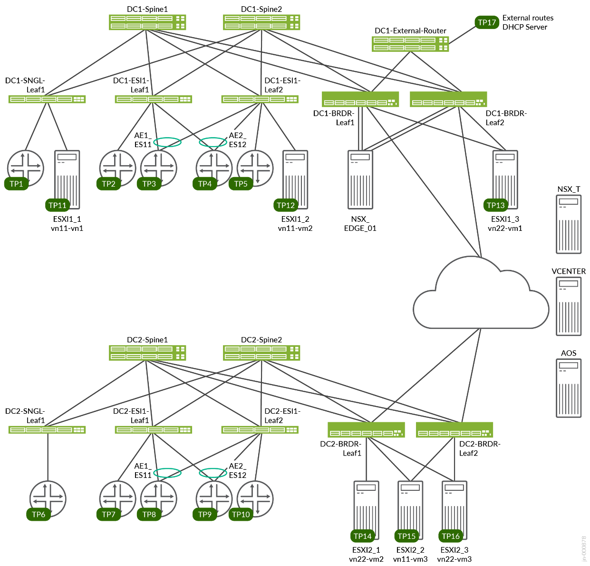

# Design Guide — 3-Stage Data Center Design with Juniper Apstra and VMware NSX-T (Inline Mode)

> **Juniper Validated Design Extension (JVDE)** · NSX-T Inline Mode · Published 2024-04-10
> Source: *3-Stage Data Center Design with Juniper Apstra and VMware NSX-T (Inline Mode) — JVDE* (juniper.net, 102 pp).
> Companion docs: [solution-overview-nsxt-integration.md](solution-overview-nsxt-integration.md) · [test-report-brief-nsxt-integration.md](test-report-brief-nsxt-integration.md) · [datasheet-nsxt-integration.md](datasheet-nsxt-integration.md)
> Base flavor: [design-guide.md](design-guide.md)

## About this document

This JVDE provides detailed instructions for deploying **VMware NSX-T in inline mode** for integration with Juniper Apstra. It extends the [3-Stage Data Center Design with Juniper Apstra JVD](design-guide.md) — the underlying fabric — and targets customers running data centers on the VMware platform (vSphere, ESXi, VMs). The audience is expected to be familiar with VMware NSX-T and vSphere, the 3-stage data center design, QFX Series switches, and Juniper Apstra.

> **Nomenclature:** *Edge-routed bridging (ERB)* = distributed VXLAN routing with EVPN (distributed-gateways model).

## Solution benefits

### JVDE benefits

- **Qualified deployments** — a prescriptive blueprint that extends a JVD fabric for a specific use case, making the JVDE a known quantity that deploys quickly and reliably.
- **Scale & platform flexibility** — designed to scale beyond the initial design and support different hardware platforms.
- **Risk mitigation** — each JVDE passes the **New Product Initiative (NPI)** testing framework.
- **Predictability** — NPI testing verifies all products work together with the explicitly defined hardware/software versions.

### Juniper Apstra + VMware integration benefits

Integrating Juniper Apstra with VMware NSX-T and vCenter simplifies data center network operations: it accelerates deployment of the fabric VLANs needed for NSX-T, connects the NSX-T overlay to the fabric underlay, and expedites troubleshooting of VLAN misconfiguration by automatically suggesting the correct fabric changes. The combination gives administrators visibility into the networking details of VMs and containers hosted by ESXi servers connected to Apstra-managed leaf switches.

## Use case and reference architecture

This JVDE uses an **ERB** architecture with lean spines (IP forwarding only; no VTEP termination). Leaf switches learn/advertise local MACs via the BGP EVPN control plane; **border-leaf switches serve as the gateway to external networks — and in this design the VMware NSX-T edge node terminates on the border-leaf switches.** The underlying fabric uses Juniper QFX, PTX, and ACX Series switches managed by Apstra.

### VRF characteristics

Same two tenant VRFs as the base flavor:

| VRF | VLANs | IRB | Placement |
|-----|-------|-----|-----------|
| **RED** | 400–649 | v4/v6 | Single leaf; ESI leaves (port + AE1/AE2); border leaves distribute routes to the external router |
| **BLUE** | 3500–3749 | v4/v6 | Single leaf; ESI leaves (port + AE1/AE2); border leaves distribute routes to the external router |

### Juniper hardware and software components

*Table 1 — Validated devices and positioning (\* = baseline):*

| Role | Devices |
|------|---------|
| Server Leaf | **QFX5120-48Y-8C\*** · QFX5110-48S |
| Border Leaf | **QFX5130-32CD\*** · QFX5700 · ACX7100-48L · ACX7100-32C · PTX10001-36MR · QFX10002-36Q |
| Spine | **QFX5220-32CD\*** · QFX5120-32C |

*Table 2 — Baseline devices:*

| Product | Role | Hostname | Software |
|---------|------|----------|----------|
| QFX5220-32CD | Spine | dc1-spine1 / dc1-spine2 | Junos OS Evolved 22.2R3-S3.13 |
| QFX5120-48Y | Server Leaf | dc1-single-001-leaf1 / dc1-esi-001-leaf1 / dc1-esi-001-leaf2 | Junos OS 22.2R3-S3.18 |
| QFX5130-32CD | Border Leaf | dc1-border-001-leaf1 / dc1-border-001-leaf2 | Junos OS Evolved 22.2R3-S3.13 |

All 3-stage qualified devices are validated against **Junos OS 22.2R3-S3**. Juniper Apstra **AOS 4.2.1-207**.

### VMware software components

| VMware product | Version |
|----------------|---------|
| NSX-T Edge | nsx-edge-3.2.1.0.0.19232403 |
| NSX-Manager | 3.2.0.1.0.19232396 |
| vSphere Client | 7.0.2 |
| ESXi | 7.0.2, 17630552 or later |

## Configuration walkthrough

The walkthrough (guide pp. 13–92) builds the base 3-stage fabric through Apstra and then layers the NSX-T integration. The base fabric build is identical to the [base design guide](design-guide.md#configuration-walkthrough); the **rendered per-device configs live in [`../configuration/conf/`](../configuration/conf/)**. The NSX-T-specific integration is summarized below.

**On NSX-T Manager / vSphere:**

- Add vSphere as a compute manager and configure NSX-T on the selected ESXi servers connected to the TOR switches.
- Configure left/right uplink VLANs and the overlay uplink; configure the VDS switch and associate it to those uplinks.
- Deploy the **Edge Node** as a VM on the ESXi host connected to the border leaf.
- Create logical segments for micro-segmenting VM networks (usable as vSphere network adapters for East-West VM communication).
- Create **T0** (with a loopback for BGP peering to the border leaves, plus left/right uplink interfaces) and **T1** gateways for North-South communication. **Geneve tunnels terminate on the border-leaf switches**, where packets are converted to EVPN-VXLAN.

**On Juniper Apstra:**

- Add vSphere and NSX-T Manager as **External Network Providers**, then add them as **Virtual Infra** in the blueprint.
- Create a **Routing Zone** for NSX-T traffic and associate it with the overlay VLAN L2 virtual network on all fabric leaves.
- Create **Connectivity Templates** for: IP links (routed interfaces on border leaves to the Edge Node VM); **BGP peering** between the NSX-T T0 and the border leaves (border-leaf-1 = left uplink, border-leaf-2 = right uplink, for resiliency); and static routes between the T0 and the border leaves.

## Validation framework & test objectives

The design is an ERB (Type-2 and Type-5) EVPN/VXLAN fabric with spine, server-leaf, border-leaf, and **NSX-T Edge Gateway** devices. The Juniper fabric is treated as an *external network* (not managed by NSX-T); the NSX overlay is linked to it through a **Tier-0 router / NSX Edge**.

**Test goals:** design/deploy NSX-T and vSphere components (Edge Node, ESXi, VDS, port groups); configure NSX-Manager with Edge/Transport nodes and T0/T1 gateways; connect to fabric border leaves via loopback and links; Apstra config for connectivity (Virtual Networks, Routing Zone/VRF, connectivity templates for IP link, BGP, static routes); validate end-to-end traffic; anomaly and VM/ARP/MAC collection from Apstra. To pass, the integration must validate **East-West** (fabric hosts ↔ NSX-managed hosts) and **North-South** (NSX Edge ↔ border leaf) connectivity.

**Test non-goals:** establishing fabric connectivity, fabric deployment/config (covered by the base JVD), and DCI interconnectivity.

## Results summary and analysis

Validation confirmed VMware NSX-T can be integrated with the data center fabric using Apstra, providing visibility into VMs and containers hosted by ESXi servers connected to Apstra-managed leaves. Configuration/integration tests created the NSX-T components (vSphere compute manager; uplink/overlay VLANs; VDS; Edge Node VM on the ESXi host at the border leaf; logical segments; T0/T1 gateways) and the corresponding Apstra config (External Network Providers → Virtual Infra; Routing Zone; connectivity templates for IP links, BGP peering, and static routes). Operational/trigger tests covered NSX intra-/inter-VLAN connectivity, overlay-transport MTU change (anomaly detection), border-leaf BGP flapping (resilient rerouting), and rebooting fabric switches (NSX tunnel-down detection), plus reboots, DHCP-binding reset, and BGP deactivation. Successfully validated on **Junos OS 22.2R3-S3** and **Apstra 4.2.1**.

## Recommendations

Juniper Apstra + NSX-T integration provides: inventory gathering via the NSX-T API (hosts, clusters, VMs, port groups, vDS/N-vDS, NICs); operator visibility into VMs, VM ports, and ToR connectivity; issue identification across fabric and virtual infrastructure; underlay/overlay correlation via **IBA analytics**; and accelerated NSX-T deployment (fabric ready in terms of LAG, MTU, and VLAN per NSX-T transport-node requirements). Use the software versions in the tables above; test any deviations thoroughly.

## Sources

- *3-Stage Data Center Design with Juniper Apstra and VMware NSX-T (Inline Mode) — JVDE*, published 2024-04-10 (juniper.net Validated Designs).
- Rendered configs: [`../configuration/conf/`](../configuration/conf/).
- Companion: [solution-overview-nsxt-integration.md](solution-overview-nsxt-integration.md), [test-report-brief-nsxt-integration.md](test-report-brief-nsxt-integration.md), [datasheet-nsxt-integration.md](datasheet-nsxt-integration.md). Base flavor: [design-guide.md](design-guide.md).
