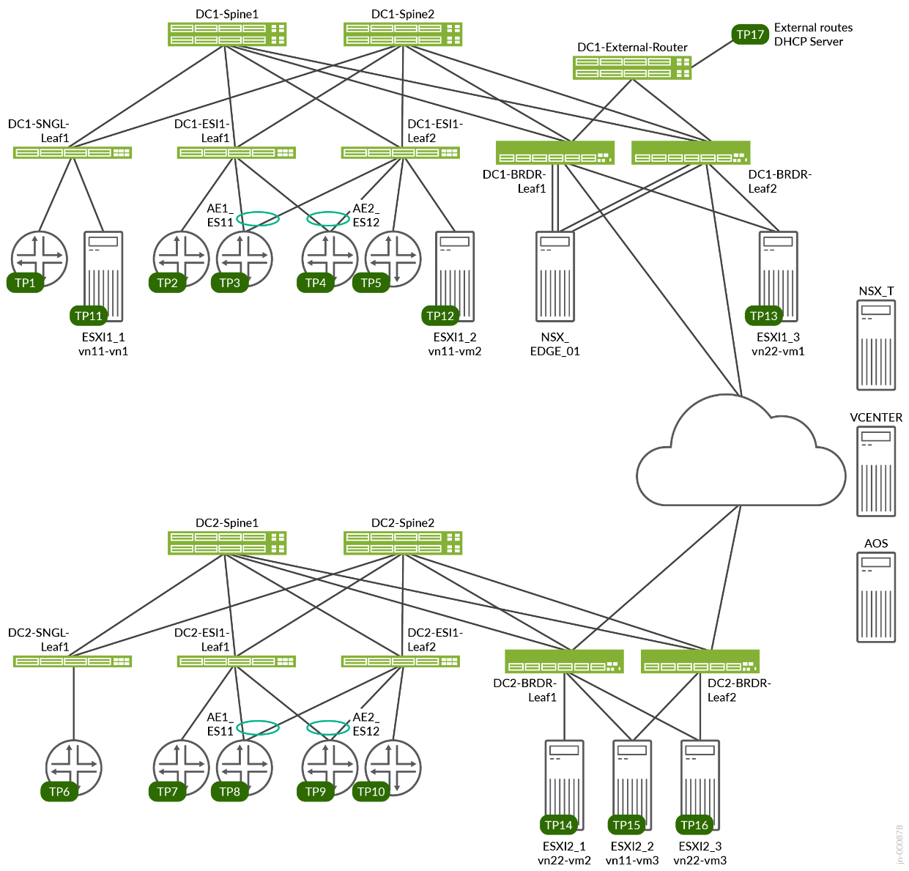

>
> Faithful markdown conversion of the published PDF:
> [3-Stage Data Center with Juniper Apstra and VMware NSX-T Integration — Juniper Validated Design Extension (JVDE)](https://www.juniper.net/documentation/us/en/software/jvd/3stage-apstra-nsxt-integration/index.html).
> The PDF on juniper.net is the source of truth. The Configuration Walkthrough is
> reproduced here as text (steps and NOTES); the VMware NSX-T / vSphere / Apstra UI
> screenshots are referred out to the published PDF by figure number and caption.
> This JVDE extends the [3-Stage EVPN/VXLAN Fabric with Juniper Apstra](design-guide.md).

# 3-Stage Data Center with Juniper Apstra and VMware NSX-T Integration — Juniper Validated Design Extension (JVDE)

Juniper Networks Validated Designs provide customers with a comprehensive,
end-to-end blueprint for deploying Juniper solutions in their network. These designs
are created by Juniper's expert engineers and tested to ensure they meet the
customer's requirements. Using a validated design, customers can reduce the risk of
costly mistakes, save time and money, and ensure that their network is optimized for
maximum performance.

## About this Document

This document is intended for an audience familiar with VMware technologies such as
VMware NSX-T and VMware vSphere. The audience is also expected to be proficient with
the 3-Stage data center design and Juniper products such as QFX Series Switches and
Juniper Apstra.

> **NOTE:** Edge-Routed Bridging (ERB) is the Juniper terminology for a network
> architecture that is referred to as Distributed VXLAN Routing with EVPN, or the
> distributed gateways model elsewhere in the industry.

## Solution Benefits

This Juniper Validated Design Extension (JVDE) document is an extension of the
3-Stage Data Center Design with Juniper Apstra JVD; for more information on deploying
a 3-stage data center fabric with Juniper Apstra, refer to that JVD. The document
provides detailed instructions for deploying VMware NSX-T in inline mode for
integration with Juniper Apstra. The solution is designed to meet the needs of
Juniper's customers who run data centers with the VMware platform with vSphere, ESXi
servers, and virtual machines.

### Juniper Validated Design Extensions Benefits

- **Qualified Deployments** — JVDEs are a prescriptive blueprint for building upon a
  JVD data center fabric to meet the requirements of a specific use case.
- JVDEs are designed to meet the needs of most of Juniper's data center customers and
  are based on customer feedback.
- **Risk Mitigation** — Each JVDE goes through the New Product Initiative (NPI)
  testing framework to achieve validation.
- JVDEs are verified by a suite of automated testing tools that validate the
  performance and reliability of Juniper solutions.
- **Predictability** — NPI testing verifies that all products in the JVDE work
  together as expected, using the explicitly defined versions of hardware and
  software documented therein.

### Juniper Apstra and VMware Integration Benefits

Integrating Juniper Apstra with VMware NSX-T and VMware vCenter simplifies data
center network operations. This integration accelerates the deployment of fabric
VLANs needed for deploying NSX-T in the data center and connects the NSX-T overlay
network with the fabric underlay. This, in turn, expedites troubleshooting and
remediation of VLAN misconfiguration by automatically suggesting the correct network
fabric changes.

Combining Juniper Apstra, VMware NSX-T, and VMware vCenter provides network
administrators with visibility into the networking details of virtual machines (VMs)
and containers hosted by ESXi servers, which are connected to leaf switches managed
by Juniper Apstra as part of the JVD data center network fabric.

## Use Case and Reference Architecture

This JVDE utilizes an edge-routed bridging (ERB) network architecture. ERB uses lean
spines that only perform IP forwarding and do not terminate VXLAN tunnel endpoints
(VTEPs). In an ERB architecture, leaf switches focus on learning and advertising the
local MAC addresses to other remote switches through the BGP EVPN control plane.
Border Leaf switches serve as the gateway to external networks; in this document, the
VMware NSX-T edge node terminates on the border leaf switches.

This JVDE is built upon the 3-Stage Data Center Design with Juniper Apstra JVD, which
is the underlying network fabric for the purposes of this document. Figure 1 depicts
the topology of the 3-Stage Data Center Design with Juniper Apstra JVD and is
referenced throughout this JVDE.

*Figure 1: 3-Stage Reference Design with VMware NSX-T.*

### VRF Characteristics

**RED VRF** — VLANs 400–649 with IRB v4/v6 (on DC1-SNGL-LEAF1 single access port; on
DC1-ESI-LEAF1 single access port, AE1 and AE2; on DC1-ESI1-LEAF2 single access port,
AE1 and AE2; on DC1-BRDR-LEAF1/LEAF2 to distribute routes to external-router); VLANs
400–649 on each test port with 10 unique MAC/IP per VLAN; DHCP client on TP3;
external DHCP server on TP17.

**Blue VRF** — VLANs 3500–3749 with IRB v4/v6 (same leaf placements as RED); VLANs
3500–3749 on each test port with 10 unique MAC/IP per VLAN; DHCP client on TP3, TP4,
TP5; external DHCP server on TP2.

### Juniper Hardware and Software Components

For this solution, the Juniper products and software versions are listed below. The
following switches are tested and validated to work with the 3-Stage Fabric with
Juniper Apstra JVD in the following roles:

#### Table 1: Validated Devices and Positioning

| Solution | Server Leaf Switches | Border Leaf Switches | Spine |
|----------|----------------------|----------------------|-------|
| 3-stage EVPN/VXLAN (ERB) | QFX5120-48Y-8C\*, QFX5110-48S | QFX5130-32CD\*, QFX5700, ACX7100-48L, ACX7100-32C, PTX10001-36MR, QFX10002-36Q | QFX5220-32CD\*, QFX5120-32C |

\* marked are baseline devices.

#### Table 2: Baseline Devices and Positioning

| Juniper Devices | Role | Hostname | Software or Image Version |
|-----------------|------|----------|---------------------------|
| QFX5220-32CD | Spine | dc1-spine1 and dc1-spine2 | Junos OS Evolved 22.2R3-S3.13 |
| QFX5120-48Y | Server Leaf | dc1-single-001-leaf1, dc1-esi-001-leaf1, dc1-esi-001-leaf2 | Junos OS 22.2R3-S3.18 |
| QFX5130-32CD | Border Leaf | dc1-border-001-leaf1, dc1-border-001-leaf2 | Junos OS Evolved 22.2R3-S3.13 |

> **NOTE:** The 3-stage qualified devices are validated against the Junos OS
> 22.2R3-S3 release; see the Feature list for more information.

#### Table 3: Juniper Software and Version

| Juniper Products | Software or Image version |
|------------------|---------------------------|
| Juniper Apstra | AOS 4.2.1-207 |

### VMware Software Components

For the purposes of this document, the VMware products and their software versions
are below.

#### Table 4: VMware Products and Software Version

| VMware Products | Software or Image Version |
|-----------------|---------------------------|
| NSX-T Edge | nsx-edge-3.2.1.0.0.19232403 |
| NSX-Manager | Version: 3.2.0.1.0.19232396 |
| vSphere Client | Version: 7.0.2 |
| ESXi | VMware ESXi, 7.0.2, 17630552 or later |

> **NOTE:** Installing and upgrading of VMware components are not within the scope of
> this document.

### Apstra Resources: ASN, Fabric, and Loopback IP Address

Apstra resources for this JVDE are listed below. Resource assignments are based on
the 3-Stage Data Center Design with Juniper Apstra JVD.

#### Table 5: Apstra Resources Used

| Resources | Range |
|-----------|-------|
| Fabric IP | 10.0.1.0/24 |
| Fabric Loopback IP | 192.168.255.0/24 |
| ASN | 64512 – 64999 |
| Routed Interface IP to NSX-T Edge Node (Border Leaf1 to Left Link) | 192.168.100.0/24 |
| Routed Interface IP to NSX-T Edge Node (Border Leaf2 – Right Link) | 192.168.200.0/24 |
| VLAN from Border Leaf1 to NSX-T Edge Node (Left) | 100 |
| VLAN from Border Leaf1 to NSX-T Edge Node (Right) | 200 |

### VMware NSX-T Manager Resources

#### Table 6: VMware Resources Configured

| Resources | Range | Notes |
|-----------|-------|-------|
| TEP Pool | 10.10.10.0/24 | Assigned by NSX-T manager to ESXi Host |
| vn11 | 10.9.11.0/24 | Assigned to VMs created in this document |
| vn22 | 10.9.22.0/24 | Assigned to VMs created in this document |
| ASN | 65000 | ASN for T0 Gateway |
| Loopback IP of T0 Gateway | 10.0.0.1/32 | Assigned while configuring T0 Gateway |
| Interface IP for T0 Interfaces to Border Leaf1 | 192.168.100.0/24 | Assigned while configuring T0 Gateway |
| Interface IP for T0 Interfaces to Border Leaf2 | 192.168.200.0/24 | Assigned while configuring T0 Gateway |
| Uplink1 segment VLAN | 100 | Uplink VLAN for Left |
| Uplink2 Segment VLAN | 200 | Uplink VLAN for Right |

## Configuration Walkthrough

> **NOTE:** This walkthrough is a step-by-step VMware NSX-T / vSphere / Juniper Apstra
> integration procedure. The published PDF illustrates each step with a UI screenshot
> (Figures 2–94). Those screenshots are not reproduced here; each is referred to
> inline by its figure number and caption so you can locate it in the
> [published PDF](https://www.juniper.net/documentation/us/en/software/jvd/3stage-apstra-nsxt-integration/index.html). All step text and NOTES are reproduced in full.

### VMware NSX-T and Juniper Apstra Integration Setup - Prerequisite Steps

- Ensure NSX-T Manager is installed, and the management address is assigned to access it through SSH
or User Interface (UI). For this solution, only one node cluster for NSX-T Manager is deployed.
However, in production deployment, adding more than one node is recommended based on the NSX-
T Data Center Installation Guide.

*Figure 6: Transport Node Networking (see the [published PDF](https://www.juniper.net/documentation/us/en/software/jvd/3stage-apstra-nsxt-integration/index.html)).*

- Add all requisite ESXi hosts in VMware vSphere. Note that only four ESXi hosts are required for this
use case, as shown in Figure 2 on page 10.

> **NOTE:** Configuring VMware vSphere and adding hosts to the vSphere Client is not in the scope of this guide.

For detailed information on VMware NSX-T, refer to the VMware NSX-T 3.2 Guide.

### VMware NSX-T Manager: Create Tunnel Endpoint Pools

Tunnel Endpoints (TEPs) are used in the header of the outer (external) IP encapsulation to uniquely
identify the hypervisor hosts originating and terminating the NSX-T encapsulation of overlay frames.

To create a TEP pool, log into VMware NSX-T Manager and navigate to Networking > IP Management >
IP Address Pools > IP Address Pools.

*Figure 7: Create TEP Pool in NSX-T (see the [published PDF](https://www.juniper.net/documentation/us/en/software/jvd/3stage-apstra-nsxt-integration/index.html)).*

### VMware NSX-T Manager: Add vSphere to NSX-T Manager

Next, add the vSphere server as a Compute manager to the NSX-T manager. The NSX-T manager gets
the inventory of ESXi hosts that will be used for Compute and Edge transport nodes.

To add the vSphere Server, log into NSX-T Manager and navigate to System > Fabric > Compute
Managers.

*Figure 8: Add vSphere Details as Compute Manager (see the [published PDF](https://www.juniper.net/documentation/us/en/software/jvd/3stage-apstra-nsxt-integration/index.html)).*

> **NOTE:** If adding the vSphere in the NSX-T Manager fails because of the Certificate of Compute Manager not valid error, then follow the VMware KB article to validate the vSphere certificate.

### VMware vSphere: Configure VDS On ESXi Host

A vSphere Distributed Switch (VDS) provides centralized management and monitoring of the networking
configuration of all hosts associated with the switch. For more information, please refer to the VMware
documentation.

In VMware vSphere, under Networking, right-click the data center and select Distributed Switch > New
Distributed Switch.

For this virtual distributed switch (VDS), create three Distributed Port Groups (DPGs) on the VDS.
Enable VLAN Trunking on all the nodes. The configuration should be as follows:

On the ESXi1_4 device (that hosts the NSX-T-Edge Node) that is connected to the border leaf switches,
the following VMNICs are configured in the lab:

1. Overlay VLAN: LAG1 (vmnic3+vmnic7). This is the aggregate Ethernet interface to border leaf
switches.

2. Left-uplink: vmnic2. This is the routed interface to border leaf1 et-0/0/0:0.

3. Right-uplink: vmnic6. This is the routed interface to border leaf2 et-0/0/0:0.

> **NOTE:** The above VMNICs can be different depending on the setup. Ensure to select the appropriate switch interface to VMNIC mapping.

*Figure 9: Physical Adapter Configured on ESXi Host (see the [published PDF](https://www.juniper.net/documentation/us/en/software/jvd/3stage-apstra-nsxt-integration/index.html)).*

1. Create a VDS

In VMware vSphere, navigate to Networking and perform the following: Create a VDS (named NSX-T-
Edge-VDS in this case) on the Edge Node Host and assign default uplinks. There are four default uplinks.

*Figure 10: Adding NSX-T-Edge VDS (see the [published PDF](https://www.juniper.net/documentation/us/en/software/jvd/3stage-apstra-nsxt-integration/index.html)).*

2. Configure LACP lag1

In VMware vSphere, navigate to Networking and perform the following:

Navigate to Networks > NSX-T-Edge-VDS > Configure > LACP to configure LACP lag1.

*Figure 11: Configuring LACP on NSX-T-EDGE VDS (see the [published PDF](https://www.juniper.net/documentation/us/en/software/jvd/3stage-apstra-nsxt-integration/index.html)).*

3. Assign VMNICs to Uplinks and LAG Ports

In VMware vSphere, perform the following:

On NSX-T-Edge-VDS actions, use Add and Manage Hosts to assign the VMNICs to the uplinks and LAG
ports.

Each host must be connected to the fabric as described in the "Solution Architecture" on page 9 section.

*Figure 12: Add Hosts to NSX-T-Edge-VDS Showing VMNICs Assigned (see the [published PDF](https://www.juniper.net/documentation/us/en/software/jvd/3stage-apstra-nsxt-integration/index.html)).*

*Figure 13: Add Hosts to NSX-T-Edge-VDS -Assign VMNIC to Uplinks (see the [published PDF](https://www.juniper.net/documentation/us/en/software/jvd/3stage-apstra-nsxt-integration/index.html)).*

4. Create Three Distributed Port Groups

In VMware vSphere, perform the following:

1. On the VDS, create the following:

- Port

- Distributed Port Group:

- Left-Uplink

- Overlay

- Right-Uplink

2. Enable VLAN Trunking on all the port groups.

*Figure 14: Adding Distributed Port Groups (see the [published PDF](https://www.juniper.net/documentation/us/en/software/jvd/3stage-apstra-nsxt-integration/index.html)).*

Below are the three Distributed Port Groups added to the NSX-T-Edge-VDS switch.

- Left-UplinkConnects to the Border Leaf1

*Figure 15: Adding Left-Uplink Distributed Port (see the [published PDF](https://www.juniper.net/documentation/us/en/software/jvd/3stage-apstra-nsxt-integration/index.html)).*

*Figure 16: Editing Left Uplink to Assign the Active Uplink (see the [published PDF](https://www.juniper.net/documentation/us/en/software/jvd/3stage-apstra-nsxt-integration/index.html)).*

- Right-Uplink Connects to the Border Leaf2

*Figure 17: Adding Right-Uplink Distributed Port Group (see the [published PDF](https://www.juniper.net/documentation/us/en/software/jvd/3stage-apstra-nsxt-integration/index.html)).*

*Figure 18: Assigning Uplink in Active to Unused Order (see the [published PDF](https://www.juniper.net/documentation/us/en/software/jvd/3stage-apstra-nsxt-integration/index.html)).*

- Overlay Link is Used for VLAN Transport Traffic.

*Figure 19: Adding Overlay Distributed Port Group (see the [published PDF](https://www.juniper.net/documentation/us/en/software/jvd/3stage-apstra-nsxt-integration/index.html)).*

*Figure 20: Assigning Uplink Failover Order for Overlay (see the [published PDF](https://www.juniper.net/documentation/us/en/software/jvd/3stage-apstra-nsxt-integration/index.html)).*

5. Review VDS

After configuring the NSXT-Edge-VDS switch, the switch should show the following port groups as
configured. The Edge switch VM is assigned to the relevant port groups. Also, the physical adapters on
the ESXi host are now allocated to the NSX-T-Edge-VDS.

*Figure 21: NSX-T Edge VM Created in vSphere (see the [published PDF](https://www.juniper.net/documentation/us/en/software/jvd/3stage-apstra-nsxt-integration/index.html)).*

*Figure 22: Physical Adapters on ESXi Host Assigned to NSX-T-Edge-VDS (see the [published PDF](https://www.juniper.net/documentation/us/en/software/jvd/3stage-apstra-nsxt-integration/index.html)).*

### VMware NSX-T: Create Overlay and VLAN Uplink Transport Zones

Three Transport Zones need to be created:

- Overlay-TZ—Used for GENEVE encapsulation of data packets.

- Uplink-TZ—Used for the NSX Edge uplink to connect to the switch fabric.

- Uplink-TZ-2.

Create Three Transport Zones

To create three Transport Zones:

1. In NSX-T Manager, navigate to System > Fabric > Transport Zones and then click +ADD ZONE.

2. Select Overlay traffic type for Overlay-TZ.

3. Select VLAN traffic type for Uplink-TZ.

4. Select VLAN traffic type for Uplink-TZ-2.

*Figure 23: Transport Zones in NSX-T (see the [published PDF](https://www.juniper.net/documentation/us/en/software/jvd/3stage-apstra-nsxt-integration/index.html)).*

VMware NSX-T: Configure the Uplink Profiles for the Host and Edge
Nodes

Now that the VDS is configured within vSphere, the uplink profiles must be created within NSX-T. The
profiles created correspond to the uplinks Overlay, Edge-Right, and Edge-Left.

> **NOTE:** NSX-T Edge-left connects to Border Leaf-1 and NSX-T Edge-right connects to Border Leaf-2 for uplink/BGP redundancy.

- Create Three Uplink Profiles

1. In NSX-T Manager, navigate to System > Fabric > Profiles > Uplink Profiles, and then click ADD.

2. Overlay-profile: VLAN 50 maps to lag1.

*Figure 24: Overlay Profile with VLAN 50 (see the [published PDF](https://www.juniper.net/documentation/us/en/software/jvd/3stage-apstra-nsxt-integration/index.html)).*

3. Edge-left-uplink profile: VLAN 100 maps to uplink1.

*Figure 25: Edge-Left-uplink Profile with VLAN 100 (see the [published PDF](https://www.juniper.net/documentation/us/en/software/jvd/3stage-apstra-nsxt-integration/index.html)).*

4. Edge-right-uplink profile: VLAN 200 maps to uplink2.

*Figure 26: Edge-Right-uplink Profile with VLAN 200 (see the [published PDF](https://www.juniper.net/documentation/us/en/software/jvd/3stage-apstra-nsxt-integration/index.html)).*

*Figure 27: Uplink Profiles for Overlay, Left and Right Uplink (see the [published PDF](https://www.juniper.net/documentation/us/en/software/jvd/3stage-apstra-nsxt-integration/index.html)).*

### VMware vSphere: Add Transport Node Hosts to VDS

For transport node hosts, VDS should be configured so that the hosts can connect to the overlay
transport network.

In VMware vSphere, under Networking, right-click the VDS created in the Juniper Apstra: Add the NSX-
Manager section and add all the hosts that form part of the transport node to the VDS. Assign the
respective VMNICs that will be used for overlay uplink (LAG link).

*Figure 28: Assign the Physical Adapters on All Hosts to the Uplink (see the [published PDF](https://www.juniper.net/documentation/us/en/software/jvd/3stage-apstra-nsxt-integration/index.html)).*

*Figure 29: Configure MTU on NSX-T-Edge-VDS (see the [published PDF](https://www.juniper.net/documentation/us/en/software/jvd/3stage-apstra-nsxt-integration/index.html)).*

### VMware NSX-T: Prepare the Compute Cluster

For an ESXi host to be part of the NSX-T overlay, it must first be added to the NSX-T fabric.

A fabric node is a node that is registered with the NSX-T management plane and has NSX-T modules
installed.

1. In NSX-T Manager, navigate to System > Fabric > Nodes > Host Transport Nodes. Select the
appropriate vSphere instance from the Managed by list under Host Transport Nodes.

*Figure 30: NSX-Manager Transport Nodes (see the [published PDF](https://www.juniper.net/documentation/us/en/software/jvd/3stage-apstra-nsxt-integration/index.html)).*

2. Select the ESXi host and then click Configure NSX.

*Figure 31: Configure NSX VDS on Transport Nodes (see the [published PDF](https://www.juniper.net/documentation/us/en/software/jvd/3stage-apstra-nsxt-integration/index.html)).*

*Figure 32: ESXi Configure NSX (see the [published PDF](https://www.juniper.net/documentation/us/en/software/jvd/3stage-apstra-nsxt-integration/index.html)).*

3. Click Finish.

4. Repeat steps 1 through 3 for all the ESXi hosts that need to be configured as Transport Nodes of the
NSX-T cluster.

### VMware NSX-T: Transport Nodes-Tunnel IPs

After NSX-T is configured on the nodes, the hosts should report the NSX configuration as “Success” and
the node status as “Up.” The NSX version will also be displayed.

Remember the TEP IP addresses as they will be required in the later steps. These are the IP addresses
assigned to each node. These IP addresses should be set from the TEP Address Pool that was configured
earlier.

*Figure 33: TEP Pools assigned to ESXi (see the [published PDF](https://www.juniper.net/documentation/us/en/software/jvd/3stage-apstra-nsxt-integration/index.html)).*

### VMware NSX-T: Deploy NSX Edge Node and Create Edge Cluster

Next, the NSX Edge VM must be created. This will be used for north-south communication and BGP
peering with the fabric.

- Create the Edge VM

1. Log on to NSX-T and navigate to System > Fabric > Edge transport Nodes.

2. Click +ADD EDGE NODE.

*Figure 34: NSX-T Edge Transport Node (see the [published PDF](https://www.juniper.net/documentation/us/en/software/jvd/3stage-apstra-nsxt-integration/index.html)).*

3. Name the Edge VM edge01.

*Figure 35: Adding Edge Node (see the [published PDF](https://www.juniper.net/documentation/us/en/software/jvd/3stage-apstra-nsxt-integration/index.html)).*

4. Enter the Credentials for the NSX Edge VM.
Note down the credentials to use them in the later steps.

*Figure 36: Adding Credentials for NSX Edge VM (see the [published PDF](https://www.juniper.net/documentation/us/en/software/jvd/3stage-apstra-nsxt-integration/index.html)).*

5. In the next step, Select the Compute Manager, Cluster, and Datastore to deploy the Edge VM.

6. Next, configure the Edge VM Network Settings, such as the management IP, default gateway IP, DNS,
and NTP server for the edge node.

- Within vSphere, a VDS was created With three Uplinks. Create one NSX-T VDS for each of the
uplinks in the vSphere VDS in NSX-T, Overlay, Edge-Right, and Edge-Left VDS.

- Name the first NSX-T VDS:

a. Name the first NSX-T VDS as nvds-overlay.

b. Set transport zone to Overlay-TZ.

c. Set the Uplink Profile to overlay-profile.

d. Select TEP-Pool for the IP Pool.

*Figure 37: NVDS Overlay for Edge Node (see the [published PDF](https://www.juniper.net/documentation/us/en/software/jvd/3stage-apstra-nsxt-integration/index.html)).*

- Name the Second NSX-T VDS:

a. Name the second NSX-T VDS as nvds-left.

b. Set the Transport Zone to Uplink-TZ.

c. Set the Uplink Profile to edge-left-uplink.

*Figure 38: NVDS Left for Edge Node (see the [published PDF](https://www.juniper.net/documentation/us/en/software/jvd/3stage-apstra-nsxt-integration/index.html)).*

- Name the Third NSX-T VDS:

a. Name the third NSX-T VDS as nvds-right.

b. Set the Transport Zone to Uplink-TZ.

c. Set the Uplink Profile to edge-right-uplink.

*Figure 39: NVDS Right for Edge Node (see the [published PDF](https://www.juniper.net/documentation/us/en/software/jvd/3stage-apstra-nsxt-integration/index.html)).*

- Verify NSX-T Edge Creation

A successful message is displayed once the NSX-T Edge is created. The TEP IP address must be assigned
from the previously configured TEP pool.

- Add Edge Cluster

1. In NSX-T Manager, navigate to System > Fabric > Nodes > Edge Clusters > ADD.

2. Name the cluster as edge-cluster1.

3. Select nsx-default-edge-high-availability-profile for the Edge Cluster Profile.

4. Select Edge Node for the Member Type edge01 in edge-cluster1.

*Figure 40: Edge01 Node Added to Edge-cluster1 (see the [published PDF](https://www.juniper.net/documentation/us/en/software/jvd/3stage-apstra-nsxt-integration/index.html)).*

*Figure 41: Edge01 Node Added to Edge-Cluster1 (see the [published PDF](https://www.juniper.net/documentation/us/en/software/jvd/3stage-apstra-nsxt-integration/index.html)).*

- Verify Edge Cluster

To verify that SSH connectivity exists, and the credentials are set up correctly, SSH to the edge node
and login.

*Figure 42: SSH connectivity to Edge Node (see the [published PDF](https://www.juniper.net/documentation/us/en/software/jvd/3stage-apstra-nsxt-integration/index.html)).*

### VMware NSX-T: Create a T-1 Gateway

A Tier-1 Gateway is a logical router that provides East-West communication between VMs in the NSX-T
domain.

Create a Tier-1 Gateway

In NSX-T Manager, navigate to Networking > Connectivity > Tier-1 Gateways > ADD TIER-1 GATEWAY
and then enter the gateway name as T1-1.

*Figure 43: NSX-T Tier-1 Gateway (see the [published PDF](https://www.juniper.net/documentation/us/en/software/jvd/3stage-apstra-nsxt-integration/index.html)).*

### VMware NSX-T: Create Logical Segments

Segments are virtual L2 networks, and VMs are launched in segments. Segments are connected to the
T1 Gateway to enable connectivity between the VMs.

1. In NSX-T Manager, navigate to Networking > Connectivity > Segments > Segments >
ADDSEGMENT.

2. Name the first segment as vn11.

3. Select T1-1 | Tier1 under Connected Gateway list to designate Tier 1 Gateway.

4. Select Overlay-TZ under Transport Zone to specify the transport zone for the overlay.

5. Enter the subnet to be used: 10.9.11.1/24.

*Figure 44: Create Logical Segments (see the [published PDF](https://www.juniper.net/documentation/us/en/software/jvd/3stage-apstra-nsxt-integration/index.html)).*

Add Another Segment

1. Name the second segment as vn22.

2. Select T1-1 | Tier1 under Connected Gateway to designate Tier 1 Gateway.

3. Select Overlay-TZ under Transport Zone to specify the transport zone for the overlay.

4. Enter the subnet to be used: 10.9.22.1/24.

*Figure 45: Create Logical Segments (see the [published PDF](https://www.juniper.net/documentation/us/en/software/jvd/3stage-apstra-nsxt-integration/index.html)).*

### VMware NSX-T: Create VLAN Backed Logical Segments

A VLAN-backed segment enables the Tier-0 gateway to establish BGP sessions with the fabric. The
VLAN-backed segment serves as the North-South data path of the VMs in NSX to/from the rest of the
Data Center Fabrics.

- Create One VLAN-Backed Segment for Each Uplink:

1. In NSX-T Manager, navigate to Networking > Connectivity > Segments > Segments > ADD
SEGMENT.

2. Name the first segment as uplink-seg-100.

3. Do not select a gateway under Connected Gateway.

4. Select Uplink-TZ under Transport Zone to specify the transport zone for the overlay.

5. Do not enter a subnet to be used.

6. Under VLAN, associate VLAN 100.

- Add Another VLAN Segment

1. Name the second segment as uplink-seg-200.

2. Do not select a gateway under Connected Gateway.

3. Select Uplink-TZ under Transport Zone to specify the transport zone for the overlay.

4. Do not enter a subnet to be used.

5. Under VLAN, associate VLAN 200.

*Figure 46: Create Uplink Segments for Left and Right Links to Border Leaf Switches (see the [published PDF](https://www.juniper.net/documentation/us/en/software/jvd/3stage-apstra-nsxt-integration/index.html)).*

*Figure 47: Uplink Segments for left and right links to Border Leaf Switches (see the [published PDF](https://www.juniper.net/documentation/us/en/software/jvd/3stage-apstra-nsxt-integration/index.html)).*

### VMware vSphere: Confirm the Creation of the Logical Segments

The Logical Segments created in the previous steps should be reflected in the vSphere client. Verify that
logical segments created in NSX-T are present in the vSphere client. In the vSphere Client, navigate to
Distributed vSwitch > Configure > Topology.

### VMware vSphere: Create VMs in the Segments

Create two test VMs on each of the Transport Nodes in the cluster:

1. Connect the first VM on each Transport Node to the vn11 logical segment on NSX-T-Edge-VDS,
which will allow testing of the vn11 overlay segment for that Transport Node.

2. Connect the second VM on each Transport Node to the vn22 logical segment on NSX-T-Edge-VDS,
which will allow testing of the vn22 overlay segment for that Transport Node.

For more information, refer to the VMware vSphere guide for creating a VM and setting up a network
adapter.

*Figure 48: Overlay Segments Created in NSX-T are Visible in vSphere (see the [published PDF](https://www.juniper.net/documentation/us/en/software/jvd/3stage-apstra-nsxt-integration/index.html)).*

*Figure 49: VMs Created with vn11 and vn22 Ports Connected (see the [published PDF](https://www.juniper.net/documentation/us/en/software/jvd/3stage-apstra-nsxt-integration/index.html)).*

### VMware NSX-T: Create Tier0 Gateways T0-1

A Tier-0 Gateway connects the NSX-T virtual fabric with the physical switch fabric. This is accomplished
by using BGP to communicate with the Top of Rack (ToR) switches. In this document, each Transport
Node is connected to a pair of QFX-5120 leaf switches, while the Edge VM host (Edge01) is connected
to a pair of QFX5130 border leaf switches.

To add a Tier-0 Gateway:

1. In NSX-T Manager, navigate to Networking > Connectivity > Tier-0 Gateways > ADD GATEWAY.

2. Name the Tier-0 Gateway as T0-1.

3. Set HA-Mode to Active-Active.

4. Set the Edge-cluster on T0-1 to edge-cluster1.

5. Save and proceed through the next steps to add interfaces, BGP, and route-redistribution.

*Figure 50: Create T0-1 Gateway and Connect to Edge-Cluster (see the [published PDF](https://www.juniper.net/documentation/us/en/software/jvd/3stage-apstra-nsxt-integration/index.html)).*

### VMware NSX-T: Configure the Interfaces on the T0 Gateway

Tier-0 Gateway (T0-1 gateway) requires one interface for each uplink segment.

1. In NSX-T Manager, navigate to Networking > Connectivity > Tier-0 Gateways > Edit T0-1.

2. To add two external tnterfaces for the fabric within the Tier-0 Gateway screen for the T0-1 Tier-0
Gateway created above:

a. Click Set.

b. Click ADD INTERFACE to add the first interface and configure the following:

i.     Name the interface as left-uplink.

ii.    Set type External.

iii.   Set the IP Address/Mask as 192.168.100.2/24.

iv.    Connect to segment as uplink-seg-100.

v.     Set the Edge Node as edge01.

c. Click ADD INTERFACE to add the second interface and configure the following:

i.     Name the interface as right-uplink.

ii.    Set type External.

iii.   Set the IP Address/Mask as 192.168.200.2/24.

iv.    Connect to segment as uplink-seg-200.

v.     Set the Edge Node as edge01.

*Figure 51: Add Two Interfaces for T0-1 for Left-Uplink and Right-Uplink (see the [published PDF](https://www.juniper.net/documentation/us/en/software/jvd/3stage-apstra-nsxt-integration/index.html)).*

### VMware NSX-T: Configure Loopback Interface on T0 Gateway

The loopback interface is used to create a BGP session with switch Fabric border leaf switches.

1. In NSX-T Manager, navigate to Networking > Connectivity > Tier-0 Gateways > Edit T0-1.

2. To add loopback interface towards the Fabric within the Tier-0 Gateway page for the T0-1 Tier-0
Gateway created above:

a. Click Set.

b. Click ADD INTERFACE to add loopback:

i.     Name the loopback interface as Loopback.

ii.    Set type Loopback.

iii.   Set the IP Address/Mask as 10.0.0.1/32.

*Figure 52: Configure Loopback Interface to Connect to the Border leaf switches (see the [published PDF](https://www.juniper.net/documentation/us/en/software/jvd/3stage-apstra-nsxt-integration/index.html)).*

### VMware NSX-T: Configure BGP on the T0 Gateway

In NSX-T Manager, navigate to Networking > Connectivity > Tier-0 Gateways > Edit T0-1

Configure BGP

1. Within the Tier-0 Gateway page for the T0-1 Tier-0 Gateway created above:

a. Click BGP.

b. Set Local AS to 65000.

c. Enable BGP.

d. Click Set next to BGP Neighbors.

e. Click ADD BGP NEIGHBOUR to add the first BGP neighbor.

Configure the Loopback IP Address of Border Leaf1

1. In the Juniper Apstra UI navigate to Blueprints > <blueprint-name> > Staged > Physical > Nodes.

a. Refer to column name Loopback IPv4.

b. In the following figures, the loopback IP Address from Juniper Apstra is 192.168.255.2, but this
can vary.

c. Set BFD to be Disabled.

Configure the Remote AS Number as Border Leaf1 ASN number

1. In the Juniper Apstra UI navigate to Blueprints > <blueprint-name> > Staged > Physical > Nodes.

a. Refer to column name ASN.

b. In the below figures the ASN from Juniper Apstra is 64514, but this can vary.

c. Set Route Filter to be 1 with IPV4 Route Filter enabled and Out filter as prefixlist-out-default.
Figure 55 Setting Route Prefix List

d. Set Allowas-in as Disabled.

e. Under Timers & Password, set Hold Down Time as 90 and Keep Alive Time as 30.

*Figure 53: Add Border Leaf1 Loopback as the Neighbor (see the [published PDF](https://www.juniper.net/documentation/us/en/software/jvd/3stage-apstra-nsxt-integration/index.html)).*

2. Click ADD BGP NEIGHBOUR to add the second BGP neighbor.

Configure the Loopback IP Address of Border Leaf2:

1. In the Juniper Apstra UI navigate to Blueprints > <blueprint-name> > Staged > Physical > Nodes.

2. In the following figures, the loopback IP Address from Juniper Apstra is 192.168.255.3, but this can
vary.

3. Set BFD to be Disabled.

Configure the Remote AS Number as Border Leaf2 ASN Number:

1. In the Juniper Apstra UI navigate to Blueprints > <blueprint-name> > Staged > Physical > Nodes.

2. Refer to column name ASN.

3. In the following figures, the ASN from Juniper Apstra is 64554, but this can vary.

4. Select 1 for Route Filter.

5. Enable IPV4 Route Filter.

6. Select prefixlist-out-default for Out Filter.

7. Set Allowas-in as Disabled.

8. Select Max Hop Limit as 10.

9. Set Hold Down Time as 90 and Keep Alive Time as 30 under Timers & Password:

> **NOTE:** BGP status for the two neighbors will be down until Apstra is configured.

*Figure 54: BGP neighbors on T0-1 are the Border Leaf loopbacks (see the [published PDF](https://www.juniper.net/documentation/us/en/software/jvd/3stage-apstra-nsxt-integration/index.html)).*

VMware NSX-T: Configure In-Line Mode and Route-Redistribution on the
T0 Gateway

1. In NSX-T Manager, navigate to Networking > Connectivity > Tier-0 Gateways > Edit T0-1.

2. Within the Tier-0 Gateway, screen for the T0-1 Tier-0 Gateway created above:

a. Select EVPN Mode as inline.

b. Click the three vertical dots and create a new VNI-Pool for the EVPN/VXLAN VNI-Pool.

*Figure 55: T0 Gateway EVPN VXLAN VNI Pool (see the [published PDF](https://www.juniper.net/documentation/us/en/software/jvd/3stage-apstra-nsxt-integration/index.html)).*

3. Click Set near EVPN Tunnel Endpoint and configure the following:

a. Name EVPN local tunnel endpoint as edge-vtep.

b. Edge-Node name: edge01 (created as per VMware NSX-T: Deploy NSX Edge Node and Create an
Edge Cluster on page 39).

c. Local Address: 10.0.0.1 (this is the loopback address of T0 Gateway as configured in VMware
NSX-T: Configure Loopback interface on T0 Gateway).

d. MTU: 9000.

e. Save changes to the Tier-0 Gateway.

*Figure 56: Configuring Local EVPN Tunnel Endpoint (see the [published PDF](https://www.juniper.net/documentation/us/en/software/jvd/3stage-apstra-nsxt-integration/index.html)).*

*Figure 57: T0-1 Tier-0 Gateway EVPN Inline Mode (see the [published PDF](https://www.juniper.net/documentation/us/en/software/jvd/3stage-apstra-nsxt-integration/index.html)).*

Within the Tier-0 Gateway screen for the T0-1 Tier-0 Gateway created above:

1. Expand and click Route Re-Distribution.

*Figure 58: Configure Route Re-distribution (see the [published PDF](https://www.juniper.net/documentation/us/en/software/jvd/3stage-apstra-nsxt-integration/index.html)).*

2. Under Advertised Tier-1 Subnets, check only the following sources:
a. Connected Interfaces & Segments

b. Service Interface Subnet

c. Static Routes

d. Connected Segment

Ensure no other boxes are checked.

*Figure 59: Set Route-Redistribution (see the [published PDF](https://www.juniper.net/documentation/us/en/software/jvd/3stage-apstra-nsxt-integration/index.html)).*

VMware NSX-T: Create a Static Route to Loopback on Border Leaf
Switches

A static route needs to be created for the reachability of the loopbacks on the border leaf switches.
These interfaces are used to establish BGP neighbors between NSX-T and the border leaf switches.

1. In NSX-T Manager, navigate to Networking > Tier-0 Gateways.

2. Select T0-1 Gateway and edit, then select Set.

3. Add Loopback 192.168.255.2/32 of Border Leaf1 and 192.168.255.3/32 of Border Leaf2 as static
routes.

> **NOTE:** Ensure to check Apstra for the correct loopbacks for the border leaf switches.

Static Route to Border Leaf1

*Figure 60: Static Route to Border Leaf1 (see the [published PDF](https://www.juniper.net/documentation/us/en/software/jvd/3stage-apstra-nsxt-integration/index.html)).*

Click SET NEXT HOPS and add 192.168.100.1 (IP of the border leaf1 switch interface).

*Figure 61: Next Hop as Border Leaf1 Interface IP (left Uplink) (see the [published PDF](https://www.juniper.net/documentation/us/en/software/jvd/3stage-apstra-nsxt-integration/index.html)).*

Static Route to Border Leaf2

For the static route to border leaf2, click SET NEXT HOPS and add 192.168.200.1 (IP of the border
leaf2 switch interface).

*Figure 62: Border Leaf2 Static Route (see the [published PDF](https://www.juniper.net/documentation/us/en/software/jvd/3stage-apstra-nsxt-integration/index.html)).*

*Figure 63: Next Hop as Border Leaf2 Interface IP (Right Uplink) (see the [published PDF](https://www.juniper.net/documentation/us/en/software/jvd/3stage-apstra-nsxt-integration/index.html)).*

*Figure 64: Static Routes Towards Border Leaf Switches (see the [published PDF](https://www.juniper.net/documentation/us/en/software/jvd/3stage-apstra-nsxt-integration/index.html)).*

### VMware NSX-T: Create IP Prefix lists on T0 Gateway

The IP Prefix list must be set up not to allow advertising of the fabric IPs.

Add the IP Prefixes as below:

1. In NSX-T Manager, navigate to Networking > Tier-0 Gateways.

2. Select T0-1 Gateway, expand Routing, and click on the number beside IP Prefix Lists to add or edit
the prefix list.
prefixlist-out-default is the prefix-list set on the T0 Gateway BGP, as mentioned in "VMware NSX-T:
Configure BGP on the T0 GW" on page 55.

*Figure 65: Adding Prefixes to prefixlist-out-default (see the [published PDF](https://www.juniper.net/documentation/us/en/software/jvd/3stage-apstra-nsxt-integration/index.html)).*

3. Click on 1 (or any number) under Prefixes to add prefixes.

4. Click Edit and add the following prefixes.

*Figure 66: VM Prefixes Permitted to be Advertised, Rest Denied (see the [published PDF](https://www.juniper.net/documentation/us/en/software/jvd/3stage-apstra-nsxt-integration/index.html)).*

### VMware NSX-T: Connect the T1 and T0 Gateways

Connecting the T1 and T0 Gateways enables east-west connectivity and north-south communication to
the VMs in the NSX-T Domain.

Connect the Gateways

1. In NSX-T Manager, navigate to Networking > Tier-1 Gateways.

2. Select T1-1 Gateway.

3. Under Linked Tier-0 Gateway, select T0-1.

4. Add the edge-cluster1 setup in VMware NSX-T: Deploy NSX Edge Node and Create an Edge Cluster
on page 39.

5. Select the following under the Route Advertisement:

- All Static Routes

- All LB VIP Routes

- All LB SNAT IP Routes

*Figure 67: Link T0-1 Gateway to T1-1 (see the [published PDF](https://www.juniper.net/documentation/us/en/software/jvd/3stage-apstra-nsxt-integration/index.html)).*

Juniper Apstra: Add the NSX-Manager

For Juniper Apstra to remediate inconsistencies between the virtual infrastructure and the physical IP
fabric, the NSX-T manager should be added in Juniper Apstra.

In the Juniper Apstra UI, navigate to External Systems > Virtual Infra Managers > Create Virtual Infra
Manager and add the NSX-T manager details and credentials.

*Figure 68: Adding NSX-T and Vsphere in Apstra (see the [published PDF](https://www.juniper.net/documentation/us/en/software/jvd/3stage-apstra-nsxt-integration/index.html)).*

Juniper Apstra: Create a Routing Policy for NSX-T in the Blueprint

Add a Routing policy for the NSX-T routing zone created in the next step.

In the Juniper Apstra UI, navigate to Blueprints > <blueprint-name> > Staged > Policies > Routing
Policies > Create Routing Policy.

*Figure 69: NSX-T Routing Policy (see the [published PDF](https://www.juniper.net/documentation/us/en/software/jvd/3stage-apstra-nsxt-integration/index.html)).*

Juniper Apstra: Create a Routing Zone in the Blueprint

Add a Routing Zone That Maps to a VRF in the Blueprint:

1. In the Juniper Apstra UI, navigate to Blueprints > <blueprint-name> > Staged > Virtual > Routing
Zones > Create Routing Zone and following details:

- VRF Name: NSX-T

- VLAN ID: 9

- VNI: 20000

- Route Target: 20000:1

- Routing Policies: NSX-T

*Figure 70: Routing Zone to Communicate with NSX-T (see the [published PDF](https://www.juniper.net/documentation/us/en/software/jvd/3stage-apstra-nsxt-integration/index.html)).*

Juniper Apstra: Assign the Loopback IPs to the Routing Zone

After creating the NSX-T routing zone, assign the loopback IPs for the routing zone. The loopback IP is
allocated from an IP Pool in Resources. In the following figures, the pool MUST-EVPN-Loopbacks DC1 is

already created under Resources. This is as per the section "Apstra Resources: ASN, Fabric, and
Loopback IP Address" on page 8.

The loopback IP is assigned to the routing instance and used to extend EVPN and the NSX-T overlay
VLAN between the leaf switches.

*Figure 71: IP Pool from Resources (see the [published PDF](https://www.juniper.net/documentation/us/en/software/jvd/3stage-apstra-nsxt-integration/index.html)).*

*Figure 72: Assign IP Pool for the Leaf switches in NSX-T Routing Zone (see the [published PDF](https://www.juniper.net/documentation/us/en/software/jvd/3stage-apstra-nsxt-integration/index.html)).*

Juniper Apstra: Add the NSX-Manager into the Blueprint

Add the NSX-Manager into the Blueprint that is managing the fabric:

1. In the Juniper Apstra UI navigate to Blueprints > <blueprint-name > > Staged > Virtual > Virtual Infra
> Add Virtual Infra.

2. From Virtual Infra Manager, select the vSphere added in Juniper Apstra: Add the NSX-Manager.

3. Set the VLAN Remediation Policy VN Type as VXLAN.

4. Set the Routing Zone as NSX-T.

*Figure 73: Add NSX-T Manager into Blueprint (see the [published PDF](https://www.juniper.net/documentation/us/en/software/jvd/3stage-apstra-nsxt-integration/index.html)).*

Juniper Apstra: Add the NSX-T-Overlay as a VN

For the GENEVE Tunnels to come up between the Transport Nodes in NSX-T, connectivity needs to be
established through Juniper Apstra Fabric. This is ensured by creating VXLAN Virtual Network in Apstra
and assigning correct port mapping in ToR leaf switches towards Transport Node. Ensure that VLAN ID
for Overlay VXLAN VN defined in Apstra match the one mapped in Overlay Profile in NSX-T for
Transport Nodes.

VLAN 50 is configured in NSX-T Managed for Overlay, which maps to the VNI 10050. Connectivity
Template Tagged should be selected while creating a virtual network. The virtual network is assigned to
all leaf switches. The IPv4 subnet (IRB) is disabled as NSX-T is already assigning the TEPs to the hosts in
NSX-T.

*Figure 74: NSX-T Overlay Profile Transport VLAN Configured 50 (see the [published PDF](https://www.juniper.net/documentation/us/en/software/jvd/3stage-apstra-nsxt-integration/index.html)).*

Juniper Apstra: Verify the Connectivity Templates

With the virtual network created, if you select Create Connectivity Templates, then a Connectivity
Template type Virtual Network[Single] is created.

Verify the Creation of a Virtual Network:

1. In the Juniper Apstra UI, navigate to Blueprints > <blueprint-name> > Staged > Connectivity
Templates.

2. Scroll to look for the connectivity template for the Virtual Network.

3. Click Edit to view the connectivity template.

*Figure 75: Apstra Connectivity Template Generated for Overlay Virtual Network (see the [published PDF](https://www.juniper.net/documentation/us/en/software/jvd/3stage-apstra-nsxt-integration/index.html)).*

Juniper Apstra: Assign Interface to the Connectivity Templates

The connectivity template is assigned to the aggregate Ethernet (AE) interfaces facing the ESXi hosts.

*Figure 76: AE Interfaces are assigned to Connectivity Template (see the [published PDF](https://www.juniper.net/documentation/us/en/software/jvd/3stage-apstra-nsxt-integration/index.html)).*

Juniper Apstra: Commit the Configuration

From Blueprint, navigate to Blueprints > <blueprint-name> > Uncommitted and commit the
configuration. This pushes the VN and routing zone to NSX-T to all the fabric devices.

### VMware NSX-T: GENEVE Tunnels

Once Juniper Apstra has pushed the configurations to the Junos OS devices, observe that the GENEVE
tunnels between the Transport Nodes and the Edge Nodes are up:

1. On the edge01 Edge-VM , view the Tunnel Endpoints and verify status is UP.

2. In NSX-T Manager, navigate to NSX-T Manager > System > Fabric > Nodes > Edge Transport Nodes.

3. Click edge01, then click Tunnels.

*Figure 77: NSX-T Edge Node Tunnels are Up (see the [published PDF](https://www.juniper.net/documentation/us/en/software/jvd/3stage-apstra-nsxt-integration/index.html)).*

Juniper Apstra: Add Connectivity Templates for Connectivity from Edge
Node to the Fabric

The connectivity templates specify the IP link for the connectivity from the Edge Node to the fabric and
the BGP peering session with a user-specified BGP neighbor-addressed peer.

1. In the Juniper Apstra UI, navigate to Blueprints > <blueprint-name> > Staged > Connectivity
Templates.

2. Click Add Template.

Juniper Apstra: Add IP Link, BGP Peering and Static Route

A Connectivity template is used to create the NSX-T uplinks towards NSX-T Edge Node edge01 for both
left and right uplinks.

Here, the default routing zone is selected to connect to the Edge Nodes as the NSX-T traffic within the
fabric is an overlay traffic. Once the traffic reaches NSX-T, it is an underlay traffic.

The peer ASN is the NSX-T T0-1 ASN 65000.

- Create Two IP Link Connectivity Templates for Left Uplink and Right Uplink

*Figure 78: IP Link Connectivity Template for Left and Right Uplinks (see the [published PDF](https://www.juniper.net/documentation/us/en/software/jvd/3stage-apstra-nsxt-integration/index.html)).*

- Create BGP Peering and Assign NSX-T Routing Policy

1. In the Juniper Apstra UI, navigate to Blueprints > <blueprint-name> > Staged > Connectivity
Templates.

2. Click Add Template.

3. Create Connectivity Templates for BGP peering and assign the NSX-T routing policy.

*Figure 79: Connectivity Template for Uplinks Towards Edge Node (see the [published PDF](https://www.juniper.net/documentation/us/en/software/jvd/3stage-apstra-nsxt-integration/index.html)).*

- Create Two Custom Static Route Connectivity Templates

The static route is created in a separate Connectivity Template as the primitive ‘Custom Static Route’
used here is generated at the system level (border-leaf level). The static route for the left uplink starts
from Border Leaf1 to the Edge Node and for the right uplink from Border Leaf2 to the Edge Node.

1. In the Juniper Apstra UI, navigate to Blueprints > <blueprint-name> > Staged >
ConnectivityTemplates.

2. Click Add Template. Repeat this process to create Connectivity Templates for the left and right
uplinks.

- Create Two Connectivity Templates for Static Route

- Left static route from the Border Leaf1 to the Edge Node.

- Right static route from the Border Leaf2 to the Edge Node.

*Figure 80: Connectivity Template for Left Uplink Static Route (see the [published PDF](https://www.juniper.net/documentation/us/en/software/jvd/3stage-apstra-nsxt-integration/index.html)).*

*Figure 81: Connectivity Template for Right Uplink Static Route (see the [published PDF](https://www.juniper.net/documentation/us/en/software/jvd/3stage-apstra-nsxt-integration/index.html)).*

Juniper Apstra: Renaming the Generic System and Adding Links from
Border Leaf switches

Once the connectivity template for IP_Link is created for the uplink from the Border leaf switches
towards the NSX-T-Edge device, Apstra adds a generic system node with the ASN (65000 is allocated to
T0 in the earlier steps).

1. In the Juniper Apstra UI, navigate to Blueprints > <blueprint-name> > Staged > Physical > Nodes.

2. Locate the generic system added as shown below. Click the pencil icon to change this name to NSXT-
Edge-01.

*Figure 82: Renaming Generic System Added after Adding the IP link Connectivity Template (see the [published PDF](https://www.juniper.net/documentation/us/en/software/jvd/3stage-apstra-nsxt-integration/index.html)).*

After changing the generic system name, create links from both border leaf switches towards ESXi for
the left and right uplink.

1. In the Juniper Apstra UI, navigate to Blueprints > <blueprint-name> > Staged > Physical > Topology.

2. Select Border leaf1, then select ‘Add links to a generic system’ and create a link from
dc1_border_leaf1.

3. For dc1_border_leaf2, the steps to create the right uplink link are similar.

*Figure 83: Add Interface Link for Left Uplink Towards NSXT-Edge (see the [published PDF](https://www.juniper.net/documentation/us/en/software/jvd/3stage-apstra-nsxt-integration/index.html)).*

Once both border leaf switches uplinks are created, the links are shown on the topology. After this,
interfaces can be assigned from the connectivity templates, as covered in the next steps.

Juniper Apstra: Assign the Interfaces to the Connectivity Template

Assign connectivity templates created in "Juniper Apstra: Add IP Link, BGP Peering and Static Route" on
page 75 section.

1. Assign Uplinks.

2. For Uplinks from the border leaf switches, assign the appropriate ethernet interface for
dc1_border_leaf1 and dc1_border_leaf2:

- Left uplink from dc1_border_leaf1

*Figure 84: Left Uplink Interface on Border Leaf1 (see the [published PDF](https://www.juniper.net/documentation/us/en/software/jvd/3stage-apstra-nsxt-integration/index.html)).*

- Right uplink from dc1_border_leaf2

*Figure 85: Right Uplink interface on Border Leaf2 (see the [published PDF](https://www.juniper.net/documentation/us/en/software/jvd/3stage-apstra-nsxt-integration/index.html)).*

3. Assign BGP.

4. For BGP peering, select dc1_border_leaf1 and dc1_border_leaf2 loopback Interfaces lo0.0.

*Figure 86: Assign BGP Peering to Both Border Leaf switches Default Loopback Interface for Left and Right Uplink (see the [published PDF](https://www.juniper.net/documentation/us/en/software/jvd/3stage-apstra-nsxt-integration/index.html)).*

5. Assign Static Routes

- Static route for left uplink to Border Leaf1

*Figure 87: Assign Static Route for Left Uplink to Border Leaf1 (see the [published PDF](https://www.juniper.net/documentation/us/en/software/jvd/3stage-apstra-nsxt-integration/index.html)).*

- Static route for right uplink to Border Leaf2

*Figure 88: Assign Static Route for Right Uplink to Border Leaf2 (see the [published PDF](https://www.juniper.net/documentation/us/en/software/jvd/3stage-apstra-nsxt-integration/index.html)).*

Juniper Apstra: Assign the IPs and VLAN IDs to the Interfaces

Now that a Connectivity Template has been created and physical interfaces are assigned, you must
assign IP addresses and VLAN IDs to the interfaces.

Edit the Interface connecting the Border Leaf and the Edge Node:

1. In the Juniper Apstra UI, navigate to Blueprints > <blueprint-name> > Staged > Virtual >
RoutingZones > DefaultRoutingZone > Interfaces > EditIPAddresses.

2. Enter the IP address for Border Leaf switches and the IP address of the Edge node interfaces on the
host.

*Figure 89: Assign IPs to the Interface connected to Edge Host (see the [published PDF](https://www.juniper.net/documentation/us/en/software/jvd/3stage-apstra-nsxt-integration/index.html)).*

Juniper Apstra: Commit the Configuration

Navigate to Blueprints > Uncommitted and commit the configuration. This pushes all the uplinks created
using connectivity templates to the devices.

Juniper Junos OS: Verify Configs

Log onto one of the Border Leaf switches and verify that the configuration is being pushed.

Verify Physical Fabric Configuration

SSH into one of the Border Leaf switches and run the following commands:

- show configuration interfaces et-0/0/0:0 | display set

- show configuration protocols bgp group l3rtr | match 10.0.0.1 | display set

- show configuration routing-options | display set

### VMware NSX-T: Verify BGP Session on Edge

On the Edge Node, verify that the BGP sessions are established, and the overlay routes exchanged.

### Verify NSX-T Configuration

SSH into the NSX-T edge01 Edge-VM and run the following commands:

1. Firstly, to determine the VRF (SR-T0-1), run the command, get logical-router and pick the one that
has the name “SR-T0-1”. (service router Tier0) The corresponding VRF number is in the VRF column.

10> get logical-routers
Fri Jan 26 2024 UTC 18:11:32.003
Logical Router
UUID                                   VRF   LR-ID   Name
Type                        Ports Neighbors
736a80e3-23f6-5a2d-81d6-bbefb2786666 0       0
TUNNEL                      3       6/5000
c9b6e428-86e8-457a-b961-574e4222d62b 1       17      DR-T0-1
DISTRIBUTED_ROUTER_TIER0    5       2/50000
5e7295b5-9370-4dcc-bfda-5c5d8c43a997 2       8193    SR-T0-1
SERVICE_ROUTER_TIER0        9       3/50000
3468dc14-32f1-423c-ac4c-ebf9835deffd 4       8199    SR-VRF-VRF-B
VRF_SERVICE_ROUTER_TIER0    5       0/50000
bb12844c-e93e-434c-a8a8-bc41f0a97559 5       2060    DR-VRF-VRF-B
VRF_DISTRIBUTED_ROUTER_TIER0 4       0/50000
dbbb8e77-02c2-496b-b9f7-d14b95c360cd 6       8198    SR-VRF-VRF-A
VRF_SERVICE_ROUTER_TIER0    6       0/50000
8f4fad8c-bb61-4b17-8772-7b1797f599eb 7       2058    DR-VRF-VRF-A
VRF_DISTRIBUTED_ROUTER_TIER0 3       0/50000
d686dc86-3101-493f-9e21-65f94e45f73b 8       16      DR-T1-1
DISTRIBUTED_ROUTER_TIER1    5       0/50000
9e796408-7732-4fdc-9de6-2d286572f89b 9       1025    SR-T1-1
SERVICE_ROUTER_TIER1        5       2/50000

2. get bgp neighbor summary

3. get route

### VMware NSX-T: Verify BGP Session on ToR

Juniper Apstra should detect the no BGP anomaly on the blueprint.

In the Juniper Apstra UI, navigate to Blueprints > <Blueprint-name> > Active.

*Figure 90: Juniper Apstra Detects No Anomaly (see the [published PDF](https://www.juniper.net/documentation/us/en/software/jvd/3stage-apstra-nsxt-integration/index.html)).*

Log onto one of the border leaf switches and verify that the BGP sessions are up, and the overlay routes
are exchanged.

Verify Physical Fabric Configuration

SSH into one of the border leaf switches and run the following commands:

- show bgp summary group l3rtr

- show route receive-protocol bgp 10.0.0.1 table inet.0

- show route advertising-protocol bgp 10.0.0.1 table inet.0

### VMware NSX-T: Verify Overlay Connectivity (East-West)

To test east-west traffic, run ping tests between the VMs across segments and between the Linux VMs
created in VMware vSphere: Create VMs in the Segments.

Following is the flow shown in Figure 91 on page 89:

1. The ping from VM11-1 (on ESXi1_2 host) traverses the Fabric from ESI leaf to reach Border Leaf1.

2. From border-leaf, it’s sent towards the Edge nodes hosted on ESXi1_4.

3. From Edge node the traffic is sent towards T1-GW which in turn sends the ping traffic using the TEP
port on ESXi1_4 to reach TEP port of ESXi1_3, which then reaches the VM22-1.

*Figure 91: VM to VM Traffic Flow (East-West) (see the [published PDF](https://www.juniper.net/documentation/us/en/software/jvd/3stage-apstra-nsxt-integration/index.html)).*

*Figure 92: VM11 Connected to vn11 Able to Ping VM22 Connected to vn22 Logical Segment (see the [published PDF](https://www.juniper.net/documentation/us/en/software/jvd/3stage-apstra-nsxt-integration/index.html)).*

*Figure 93: VM22 Connected to vn22 Logical Segment Pinging VM11 Connected to vn11 (see the [published PDF](https://www.juniper.net/documentation/us/en/software/jvd/3stage-apstra-nsxt-integration/index.html)).*

Traceroute to the overlay VMs from the Border Leaf Switches shows the path taken.

*Figure 94: Path towards VM11 from Border Leaf Switches (see the [published PDF](https://www.juniper.net/documentation/us/en/software/jvd/3stage-apstra-nsxt-integration/index.html)).*

(Optional) Juniper Apstra: Adding vSphere Server to Juniper Apstra

This step is optional, but the integration of vSphere provides an added layer of visibility into MACs,
VMs, and ARPs. It also enables you to view all underlying VMs and docker containers connected with
each fabric leaf device connected through the ESXi server.

Add the vSphere server into the blueprint that is managing the fabric:

1. In the Juniper Apstra UI, navigate to Blueprints > <blueprint-name> > Staged > Virtual > VirtualInfra
> AddVirtualInfra.

2. Set the VLAN Remediation Policy VN Type to VXLAN.

3. Set the Routing Zone to NSX-T.

4. Navigate to Blueprints > <blueprint-name> > Active > Query. All the VMs associated with the fabric
can be viewed here. For more information, refer to the Juniper Apstra 4.2 User Guide.

## Validation Framework

Extensive testing of best practice architectures is the key to the Juniper Validated
Design program. JVDs qualify and quantify these best practice architectures, allowing
you to know exactly what you're buying and to spend your time deploying and managing
your network instead of designing it.

JVDs employ a layered testing approach to deliver reliability and repeatability.
Individual features receive functional testing. Multifunction testing builds on this
functional testing to see if multiple features work together. Product delivery
testing builds upon multifunctional testing to validate that these features combined
perform as expected for tested use cases, and JVD testing builds upon product
delivery testing by testing multiple products together to ensure that all these
products combined make an industry-leading solution.

*Figure 95: Validation Framework (a generic JVD test-layering diagram — see the
[published PDF](https://www.juniper.net/documentation/us/en/software/jvd/3stage-apstra-nsxt-integration/index.html)).*

### Test Bed

The test bed environment consists of two 3-stage EVPN/VXLAN fabrics (DC1 and DC2)
with Juniper Apstra, with two ESI Server leaf switches, one single Server leaf
(non-ESI), and two border leaf switches connected to two spines. The JVDE steps
covered in this document refer to one of the DCs (DC1 blueprint) as an example; the
DC2 setup follows a similar NSX-T configuration but is not shown for document brevity.

VMware NSX-T manager is hosted on a VM ESXi managed by VMware vSphere. The VMware
NSX-T edge switch (NSX_EDGE_01) is hosted as a VM on the ESXi, connecting the two
border leaf switches for left uplink (to border leaf switch one), right uplink (to
border leaf switch two), and overlay (multi-homed). The second three-stage DC (DC2
Blueprint) is DCI-connected (using Layer 2 stretch) to DC1 to test that remote VMs on
separate Pods can be reached. The DCI connectivity is out of the scope of this JVDE.

*Figure 96: The 3-Stage Fabric with Juniper Apstra and NSX-T Test Environment (see
the [published PDF](https://www.juniper.net/documentation/us/en/software/jvd/3stage-apstra-nsxt-integration/index.html)).*

### VRF Characteristics

**RED VRF** — VLANs 400–649 with IRB v4/v6 (leaf placements as above); VLANs 400–649
on each test port with 10 unique MAC/IP per VLAN; DHCP client on TP3; external DHCP
server on TP17. **Blue VRF** — VLANs 3500–3749 with IRB v4/v6; VLANs 3500–3749 on
each test port with 10 unique MAC/IP per VLAN; DHCP client on TP3, TP4, TP5; external
DHCP server on TP2.

### Platforms / Devices Under Test (DUT)

#### Table 7: Devices Under Test (Validated Devices)

| Solution | Server Leaf Switches | Border Leaf Switches | Spine |
|----------|----------------------|----------------------|-------|
| 3-stage EVPN/VXLAN (ERB) | QFX5120-48Y-8C, QFX5110-48S | QFX5130-32CD, QFX5700, ACX7100-48L, ACX7100-32C, PTX10001-36MR, QFX10002-36Q | QFX5220-32CD, QFX5120-32C |

### Test Bed Configuration

Contact Juniper or your Juniper account representative to obtain the full archive of
the test bed configuration used for this JVD.

## Test Objectives

The primary objective of this JVDE testing is the qualification testing of the
3-Stage Data Center Reference Design with Juniper Apstra and VMware NSX-T. The design
is based on an ERB (Type 2 and Type 5) EVPN/VXLAN fabric with spine, server leaf,
border leaf, and NSX-T Edge Gateway devices. NSX-T Data Center works by implementing
three separate but integrated planes: management, control, and data. The Juniper data
center fabric is viewed as an external network; the NSX logical network or overlay
network can be linked to an external network through a Tier-0 router or NSX Edge.

### Test Goals

This JVDE for integration of NSX-T with the 3-Stage Fabric using Juniper Apstra
focuses on the following:

- Design and deployment of NSX-T and vSphere components such as NSX-T Edge Node, ESXi
  servers, VDS switch, and port groups.
- Configuring NSX-Manager with Edge Nodes, Transport Nodes, Tier-0 and Tier-1
  gateways.
- Connectivity with fabric border leaf switches using loopback and links.
- Apstra configuration for connectivity to NSX-Edge Nodes, using Virtual Networks,
  Routing-Zone (VRF), connectivity templates for IP link, BGP, and static routes.
- Validation of end-to-end traffic flow.
- Test for any anomalies; view the VM, ARP, and MAC collection from Juniper Apstra.

In order to pass validation, the 3-stage Fabric with Juniper Apstra and NSX-T
integration must also pass the following scenarios: **East-West connectivity** (host
connectivity between fabric-connected hosts created by Apstra towards NSX-managed
hosts) and **North-South connectivity** (connectivity between NSX Edge Node and
border leaf switches proving external connectivity).

### Test Non-Goals

Test non-goals for this JVD were to test the following:

- Establish fabric connectivity
- Deployment and configuration of the fabric
- DCI Interconnectivity between data centers

## Results Summary and Analysis

This JVDE focuses on the validation of the VMware NSX-T integration with the data
center fabric using Apstra provisioning. The validation shows how external systems
like VMware NSX-T can be integrated using Apstra, providing visibility into the
networking details of virtual machines (VMs) and containers hosted by ESXi servers,
which are connected to leaf switches managed by Juniper Apstra as part of the JVD
data center network fabric.

**Configuration and Integration Tests** involved creating the NSX-T components needed
for connectivity with the data center fabric: adding vSphere as a compute manager;
configuring left/right uplink VLANs and overlay uplink; configuring the VDS switch;
configuring the Edge Node as a VM on the ESXi host connected to the border leaf;
creating logical segments for microsegmenting VM networks; and creating/configuring
T0 (loopback interface to BGP peer with border leaf switches, left/right uplink
interfaces) and T1 gateways for north-south communication. The Apstra side adds
vSphere and NSX-T manager as External Network Providers and Virtual Infra in the
blueprint, creates a Routing Zone for NSX-T traffic, and creates Connectivity
Templates for IP links, BGP peering, and static routes.

**Operational and Trigger Tests** included verification of NSX-managed host
connectivity (intra-VLAN within NSX, inter-VLAN across NSX), changing the MTU of the
overlay transport node to test for configuration anomaly, BGP flapping on the border
leaf switch, and rebooting fabric switches one at a time to verify NSX-T detects the
tunnels going down for the affected DUT.

The JVDE validation successfully validated that the Juniper data center switches can
integrate with NSX-T using Apstra, using Junos OS release 22.2R3-S3 and Apstra 4.2.1.

## Recommendations

Juniper Apstra and NSX-T integration provides the following benefits:

1. Apstra software can connect to the NSX-T API to gather information about the
   inventory in terms of hosts, clusters, VMs, portgroups, vDS/N-vDS, and NICs within
   the NSX-T environment.
2. NSX-T integration with Apstra provides operator visibility into the VMs, VM ports,
   and their connectivity to the ToR switch.
3. NSX-T integration helps identify issues on the fabric and on the virtual
   infrastructure.
4. Apstra Virtual Infrastructure visibility helps provide underlay/overlay
   correlation visibility and uses IBA analytics for overlay/underlay.
5. By using Apstra, NSX-T deployments can be accelerated as the fabric is ready in
   terms of LAG, MTU, and VLAN configuration as per NSX-T transport node requirements.
6. Juniper hardware tested for the Junos release 22.2R3-S3 is listed in Table 7:
   Devices Under Test (Validated Devices).
7. In terms of software versions, all software versions listed in Table 3 and Table 4
   are recommended. Any deviations from these should be tested thoroughly.

---

## Sources

- Published document: [3-Stage Data Center with Juniper Apstra and VMware NSX-T Integration JVDE](https://www.juniper.net/documentation/us/en/software/jvd/3stage-apstra-nsxt-integration/index.html)
- Base JVD: [3-Stage EVPN/VXLAN Fabric with Juniper Apstra](design-guide.md)
- Companion docs: [`solution-overview.md`](solution-overview.md), [`test-report-brief.md`](test-report-brief.md), [`datasheet.md`](datasheet.md)
- Configs: [`../configuration/conf/`](../configuration/conf/)
