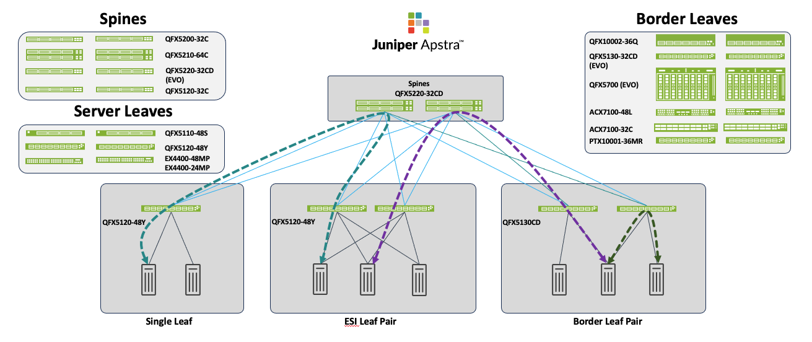
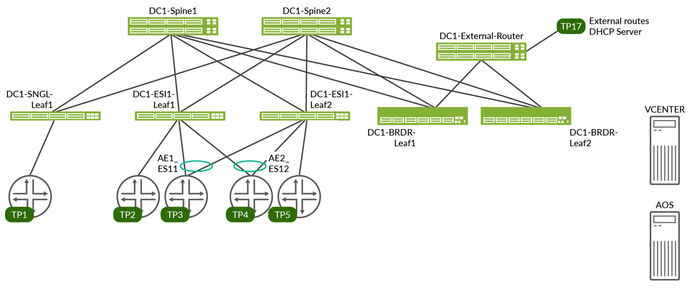

# Design Guide — 3-Stage EVPN/VXLAN Fabric with Juniper Apstra

> **JVD-DCFABRIC-3STAGE-02-01** · Juniper Validated Design · IPv4 underlay (baseline flavor) · Published 2025-05-23
> Source: *3-Stage EVPN/VXLAN Fabric with Juniper Apstra — Juniper Validated Design (JVD)* (juniper.net, 89 pp).
> Companion docs: [solution-overview.md](solution-overview.md) · [test-report-brief.md](test-report-brief.md) · [datasheet.md](datasheet.md)
> Variants: [design-guide-nsxt-integration.md](design-guide-nsxt-integration.md) · [design-guide-ipv6-underlay.md](design-guide-ipv6-underlay.md)

## About this document

This document details a Juniper Validated Design (JVD) to provision a **3-stage EVPN/VXLAN fabric with Juniper Apstra** using Apstra's Data Center Architecture design feature, consisting of **two spines, three server-leaf switches, and two border-leaf switches**. Validation used several combinations of device models (listed below). It assumes familiarity with Junos OS, QFX switches, and Juniper Apstra.

> **Nomenclature:** *Edge-routed bridging (ERB)* is Juniper's term for the architecture referred to elsewhere as distributed VXLAN routing with EVPN, or the distributed-gateways model.

## Solution benefits

### Juniper Validated Design benefits

JVDs are a prescriptive blueprint for building a data center fabric with well-documented capabilities and appropriate product selection, passing rigorous testing with real-world workloads. Core benefits: **Repeatability**, **Reliability** (layered testing with real traffic), **Accelerated Deployment**, **Accelerated Decision-Making**, and **Best-Practice Networks** with known characteristics and performance profiles.

### Juniper Apstra

Apstra is a multi-vendor, intent-based network fabric management solution providing closed-loop automation and assurance — translating business intent into device-specific configuration and continuously self-validating. Core benefits: **Intent-based networking**, **network automation** (multi-vendor), **recoverability** (built-in rollback), **Day-2+ management** (rich analytics / Flow Data, reducing MTTR), and **simplicity** (e.g. simplifying DCI while isolating failure domains).

## Use case and reference architecture

Modern data centers must support virtualization, span geographies, incorporate hybrid cloud, and provide infrastructure for AI workloads — growing ever more complex. The **ERB** architecture at the heart of the 3-Stage Fabric simplifies design by distributing the traditional network chassis into a switching fabric that is more resilient and flexible. ERB underlies all Juniper data center validated designs. Juniper Apstra — a multi-vendor Intent-Based Network System (IBNS) — orchestrates deployments and manages small-to-large data centers through Day-0 to Day-2 operations, and supports 3-stage, 5-stage, and collapsed-fabric designs.

## Solution architecture

The 3-Stage Fabric is an EVPN/VXLAN validated design based on the ERB architecture. ERB increases resilience by assigning specific functions to each device role and letting each role scale independently. Each switch occupies one of three roles:

- **Server-leaf switches** — learn and advertise local MAC addresses to remote switches through the BGP EVPN control plane, so leaves discover all remote hosts without flooding the overlay with ARP/ND requests.
- **Border-leaf switches** — can function as a server leaf and also act as a gateway to external networks, requiring DCI features (connecting to overlays such as VMware NSX-T, MACsec, deep buffers, and so on).
- **Spine switches** — perform only IP forwarding and route relaying to all server and border leaves; in ERB they are referred to as **lean spines**.

The ERB architecture behaves like a **distributed chassis**: leaf switches are roughly analogous to line cards, while lean spines make the fabric more flexible and resilient than a single modular chassis — scaling from a single rack up to an entire data center. The baseline walkthrough uses **QFX5220-32CD** spines, **QFX5130-32CD** border leaves, and **QFX5120-48Y** server leaves.

### VRF characteristics

Two tenant VRFs are validated:

| VRF | VLANs | IRB | Placement |
|-----|-------|-----|-----------|
| **RED** | 400–649 | v4/v6 | Single leaf (single access port); ESI leaves (single port + AE1/AE2); border leaves distribute routes to the external router |
| **BLUE** | 3500–3749 | v4/v6 | Single leaf (single access port); ESI leaves (single port + AE1/AE2); border leaves distribute routes to the external router |

Each VRF carries VLANs on every test port with 10 unique MAC/IP per VLAN, with DHCP client and external DHCP server flows exercised.

### Juniper hardware and software components

*Table 1 — Supported devices and positioning:*

| Role | Devices (\* = baseline) |
|------|--------------------------|
| Server Leaf | **QFX5120-48Y-8C\*** · QFX5110-48S · EX4400-24MP# |
| Border Leaf | **QFX5130-32CD\*** · QFX5700 · ACX7100-48L · ACX7100-32C · PTX10001-36MR · QFX10002-36Q |
| Spine | **QFX5220-32CD\*** · QFX5120-32C · QFX5210-64CD · QFX5200-32C |

> \# EX4400 has a fabric-wide scale limitation (validated on **22.4R3.25**, the version supporting MAC-VRF). Contact your Juniper account representative for EX4400 setup and scale.

*Table 2 — Reference-design hardware used in the walkthrough:*

| Product | Role | Hostname | Software |
|---------|------|----------|----------|
| QFX5220-32CD | Spine | dc1-spine1 / dc1-spine2 | Junos OS Evolved 23.4R2-S3 |
| QFX5120-48Y | Server Leaf | dc1-single-leaf1 / dc1-esi-001-leaf1 / dc1-esi-001-leaf2 | Junos OS 23.4R2-S3 |
| QFX5130-32CD | Border Leaf | dc1-border-leaf1 / dc1-border-leaf2 | Junos OS Evolved 23.4R2-S3 |

All devices are validated against **Junos OS Release 23.4R2-S3** (Junos OS Evolved 23.4R2-S3 for PTX10001-36MR, ACX7100-32C, ACX7100-48L). Juniper Apstra **4.2.1-207**.

### Validated functionality

- 3-stage CLOS with an ERB architecture using EVPN-VXLAN.
- Servers connected and tested both single-homed and multi-homed (ESI, with **LACP** between servers and leaves; **ESI on aggregated-Ethernet** interfaces for multi-homed devices).
- **ECMP** across the fabric to minimize traffic loss.
- Both overlay and underlay built using **eBGP**; **EVPN Type-2 and Type-5** routes learned/advertised.
- **BFD** on both underlay and overlay eBGP.
- **Asymmetric IRB** with anycast IP on L3-enabled leaves for inter-VLAN routing.
- Both IPv4 and IPv6 enabled — **IPv6 used only for loopback** in this (baseline) flavor.
- **Inter-VRF connectivity** via an external router for route leaking between VRFs, wired using Apstra connectivity templates.

### Additional functionality (validated, not described in this JVD)

- DCI between data centers.
- Interoperability with the NSX-T Edge Gateway.
- Host connectivity between Apstra-created fabric hosts and NSX-managed hosts.

## Configuration walkthrough

The full walkthrough (guide pp. 10–77) is an **Apstra GUI** procedure — it builds the fabric through Apstra's Data Center Reference Architecture feature rather than hand-written CLI, so the rendered per-device configuration is what Apstra deploys. Rather than reproduce the click-by-click screenshots, this section summarizes the deployment flow; the **complete rendered per-device configurations live in [`../configuration/conf/`](../configuration/conf/)** and the templated building blocks in [`../configuration/snips/`](../configuration/snips/).

High-level Apstra deployment flow:

1. **Onboard devices** — agent profiles, pristine configurations, acknowledge managed devices.
2. **Design** — logical devices, interface maps, and device profiles for leaf, spine, external router, and emulated servers.
3. **Racks & templates** — rack types (ESI leaf pair + 4 servers, single leaf, border leaf) and rack templates (single/ESI leaves, border leaves).
4. **Blueprint** — create from the template, assign resource pools, assign interface maps, check the cabling map, and commit.
5. **Overlay** — configure routing zones (VRFs), assign EVPN loopbacks, create virtual networks, and commit overlay updates with control-plane validation.
6. **External / inter-VRF** — connectivity templates from each VRF to the external router for inter-VRF route leaking and external reachability.

The resulting building blocks — MAC-VRF (VLAN-aware EVPN-VXLAN), EVPN Type-5 VRFs, anycast IRB gateways, ESI LAG access, eBGP underlay + eBGP EVPN overlay, fabric loop-prevention policies, and forwarding-table ECMP — are captured as reusable templates in the [snip library](../configuration/snips/) and are generatable via the [portal Config Generator](https://juniper.github.io/jvd/portal/#generator) or the [BYOAI assistant](../configuration/snips/byoai/README.md).

## Validation framework

The test bed is a 3-stage EVPN/VXLAN fabric managed by Apstra: **four ESI server leaves** (two redundant pairs), **one single (non-ESI) server leaf**, and **two redundant border leaves** connected to **two spines**, with an external router and a traffic generator on the external router's test ports and on the ESXi servers. To validate every platform in Table 1, **two data center topologies connected via DCI** were used, and border leaves were swapped (QFX5130-32CD, PTX10001-36MR, ACX7100-32C, and so on) with the tests repeated per combination.

## Test objectives

**Goals:** initial design and blueprint deployment through Apstra; validation of fabric operation and monitoring via Apstra analytics/telemetry; scale testing; end-to-end traffic-flow validation; system-health / ARP / ND / MAC / BGP / interface-counter checks; anomaly testing. To pass validation the fabric must also survive node reboot (simulated switch outage), field scenarios (interface down/up, laser on/off) with anomaly reporting in Apstra, and traffic recovery after every failure scenario.

**Non-goals (tested for non-baseline use):** QFX10002-36Q as a border leaf; DCI interconnectivity between data centers; interoperability with the NSX-T Edge Gateway; host connectivity between Apstra fabric hosts and NSX-managed hosts.

## Results summary and analysis

Comprehensive functional testing on Junos OS 23.4R2-S3 and Apstra 4.2.1 covered:

- **Baseline system test** — Apstra onboarding + pristine config, logical devices / interface maps, full 3-stage provisioning via the Data Center Reference Architecture (racks, templates, blueprints, interface-map/resource assignment, cabling), border-leaf swaps, commit/deploy, and overlay provisioning (virtual networks, routing zones, EVPN loopbacks, IRB).
- **Operational & trigger tests** — device upgrade to 23.4R2-S3; reboots; process restarts (l2ald, interface-control, rpd); MAC moves; BFD failover via BGP deactivation on ESI leaves; DHCP binding reset; 8-hour extended negative cycle.
- **Connectivity tests** — server-leaf link failure, multihomed link failure, leaf-to-spine link failure.
- **Resiliency tests** — intra-VLAN, inter-VLAN to every host, traffic to external routes, DHCP client/server flows.

*Table 5 — Multi-dimensional scale numbers tested:*

| Feature | Tested scale | With EX4400 ESI leaf pair |
|---------|--------------|----------------------------|
| VLANs | 500 | 500 |
| V4 host entries (MAC-IP) | 35,500 | 17,500 |
| V6 host entries (NDP) | 1,400 | 1,400 |
| VNI | 500 | 500 |
| VTEP | 6 | 6 |
| ESI | 4 | 4 |
| IRB | 500 | 500 |
| BGP routing table | 343,000 | 148,900 |
| EVPN table | 35,500 | 17,500 |

> Maximum VLANs per AE interface: **2,000** on QFX5120 (1,000 on EX). Exceeding this triggers a commit warning for too many VLAN IDs on an untagged interface.

Overall, validation testing detected no issues; all performance parameters were within threshold. Traffic on all server leaves for intra-VRF, inter-VRF, and external routes was **1000 pps** at **random 256–1024-byte** packet sizes.

## Recommendations

The JVD follows an industry-standard ERB design that simplifies data center provisioning and Day-0/1/2 operations (upgrades, device management, telemetry). As a multi-vendor management platform, Apstra also gives customers vendor choice. **Junos OS Release 23.4R2-S3 is the minimum recommended software version** for this JVD; the listed Juniper hardware is best-suited for the specified roles.

## Tested optics

A range of 10G/40G/100G optics and AOCs was used across the external router (MX204), spines (QFX5220-32CD), server leaves (QFX5120-48Y-8C, EX4400-24MP), and border leaves (QFX5130-32CD, QFX5700, ACX7100-48L, ACX7100-32C, PTX10001-36MR) — see the published guide's *Tested Optics* table for the full part-number list.

## Revision history

| Date | Version | Description |
|------|---------|-------------|
| December 2024 | JVD-DCFABRIC-3STAGE-02-01 | Recommended Junos version updated to 23.4R2-S3 from 22.2R3-S3 |

See [datasheet.md](datasheet.md#version-history) for the fuller version lineage (v1 2023-Q3 → v2 2024-Q1 → v2.1 2025-Q1) across the IPv4 flavor.

## Sources

- *3-Stage EVPN/VXLAN Fabric with Juniper Apstra — Juniper Validated Design (JVD)*, JVD-DCFABRIC-3STAGE-02-01, published 2025-05-23 (juniper.net Validated Designs).
- Rendered configs: [`../configuration/conf/`](../configuration/conf/) · Templated snips: [`../configuration/snips/`](../configuration/snips/).
- Companion: [solution-overview.md](solution-overview.md), [test-report-brief.md](test-report-brief.md), [datasheet.md](datasheet.md).
