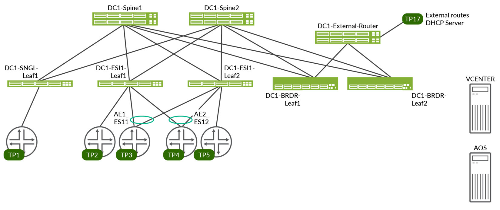

>
> Faithful markdown conversion of the published PDF:
> [3-Stage EVPN/VXLAN Fabric with Juniper Apstra — Juniper Validated Design (JVD)](https://www.juniper.net/documentation/us/en/software/jvd/3stage-evpn-vxlan-apstra/index.html).
> The PDF on juniper.net is the source of truth. The Configuration Walkthrough is
> reproduced here as text (steps, NOTES, and CLI verification); the Apstra UI
> screenshots are referred out to the published PDF by figure number and caption.
> The resulting device configurations are in
> [`../configuration/conf/`](../configuration/conf/).

# 3-Stage EVPN/VXLAN Fabric with Juniper Apstra — Juniper Validated Design (JVD)

Juniper Networks Validated Designs provide you with a comprehensive, end-to-end
blueprint for deploying Juniper solutions in your network. These designs are
created by Juniper's expert engineers and tested to ensure they meet your
requirements. Using a validated design, you can reduce the risk of costly
mistakes, save time and money, and ensure that your network is optimized for
maximum performance.

## About this Document

This document details a Juniper Validated Design (JVD) to provision a 3-stage
EVPN/VXLAN fabric with Juniper Apstra using Apstra's Data Center Architecture
design feature, consisting of two spines, three server leaf switches, and two
border leaf switches. The validation was done using several combinations of device
models, which are listed in the document. This document is intended for an audience
familiar with Juniper technologies such as the Junos OS, QFX switches, and Juniper
Apstra.

> **NOTE:** Edge-routed bridging (ERB) is the Juniper terminology for a network
> architecture that is referred to elsewhere in the industry as distributed VXLAN
> routing with EVPN or the distributed gateways model.

## Solution Benefits

This document offers comprehensive guidance on deploying a modern 3-stage fabric
with EVPN-VXLAN. The 3-Stage Fabric with Juniper Apstra is designed to meet the
needs of most of Juniper's customers, has been extensively tested by Juniper, and
is deployed by customers across the globe. Advanced JVD testing by Juniper combined
with widespread adoption simplifies troubleshooting and shortens the support cycle,
leading to a more stable data center fabric, reducing operational costs.

The 3-Stage Fabric with Juniper Apstra is Juniper's "standard candle" data center
network architecture. Like all Juniper data center JVDs it is based on best
practices as determined by Juniper's subject matter experts, and Juniper support
teams have extensive training and resources necessary to support networks based on
JVDs.

### Juniper Validated Design Benefits

JVDs are a prescriptive blueprint for building a data center fabric with
well-documented capabilities and appropriate product selection. JVDs must pass
rigorous testing with real-world workloads to achieve validation, verifying that
all products in the Building Blocks JVD work together as expected and mitigating the
risk faced while deploying a network. The core benefits of JVDs are:

- **Repeatability** — Unlock value with repeatable network designs. Because JVDs are
  prescriptive designs used by multiple customers, all JVD customers benefit from
  lessons learned through lab testing and real-world deployments.
- **Reliability** — Layered testing with real traffic. JVDs are quantified and
  integrated best practice designs based on carefully chosen hardware platforms and
  software versions and tested with real-world traffic.
- **Accelerated Deployment** — Ease installation with step-by-step guidance.
  Simplify deployment with guidance, automation, and prebuilt integrations.
- **Accelerated Decision-Making** — Leave behind costly bespoke networks. Bridge
  business and technology in designs that meet the needs of most customers.
- **Best Practice Networks** — Better outcomes for a better experience. Juniper
  Validated Designs have known characteristics and performance profiles to help you
  make informed decisions about your network.

### Juniper Apstra

Apstra is a multi-vendor, intent-based network fabric management solution that
provides closed-loop automation and assurance. Apstra translates business intent
and technical objectives to essential policy and device-specific configuration.
Apstra continuously self-validates and resolves issues to assure compliance. The
core benefits of Apstra are:

- **Intent-based networking** — Automates configuration generation and continuously
  validates operating state versus intent.
- **Network Automation** — Apstra is a multi-vendor network automation platform that
  is continuously updated to work with the latest hardware and exhaustively tested
  using modern DevOps practices.
- **Recoverability** — Built-in rollback capability restores known-working
  configuration in a fraction of the time.
- **Day 2+ Management** — Apstra's rich analytics capabilities, including Flow Data,
  reduce Mean Time to Resolution (MTTR).
- **Simplicity** — Apstra simplifies network management. For example, by reducing the
  complexity of data center interconnection (DCI), making it easy to unify multiple
  data centers while isolating failure domains for high availability and resilience.

## Use Case and Reference Architecture

Traditional data center designs required chassis-based switches, which were complex
to manage. As business demands change, data centers are changing — today's data
centers need to support virtualization, span multiple geographies, incorporate
hybrid cloud elements, and provide infrastructure for AI workloads. The Edge-Routed
Bridging (ERB) network architecture at the heart of the 3-Stage Fabric with Juniper
Apstra simplifies data center design by distributing the traditional network chassis
into a switching fabric that is far more resilient and flexible.

ERB is a distributed network architecture that can meet nearly any network
requirement. As a result, ERB underlies all Juniper data center-validated designs.
With Juniper data center switches running Junos OS and Juniper Apstra as an
orchestration platform, customers can provision, manage, and monitor data centers
using Juniper Apstra software, as shown in Figure 1. The ERB design is flexible, and
with Juniper Apstra adding or removing leaf switches is easier.

Juniper Apstra is a multi-vendor Intent-Based Network System (IBNS). Apstra
orchestrates data center deployments and manages small to large-scale data centers
through Day-0 to Day-2 operations. It supports provisioning 3-stage or 5-stage data
center designs, including collapsed fabric for even smaller data center designs.


*Figure 1: 3-Stage Architecture — Lean Spines, Server leaf Switches and DCI Capable Border Leaf Switches.*

## Solution Architecture

The 3-Stage Fabric with Juniper Apstra is an EVPN/VXLAN-based validated design based
upon the ERB network architecture. Using an ERB network architecture provides the
design increased resilience by assigning specific functions to each device role and
ensuring that each device role can be scaled independently of the others. Each
network switch participating in the design must occupy one of three roles:

- **Server Leaf Switches** — The leaf switch focuses on learning and advertising the
  local MAC addresses to other remote switches through the BGP EVPN control plane.
  This means leaf switches can discover all the "remote" hosts without flooding the
  overlay with ARP/ND requests.
- **Border Leaf Switches** — Although a border leaf can function as a server leaf
  switch, it can also act as a gateway to external networks and hence require DCI
  features. DCI features include connecting to network overlays such as VMware NSX-T,
  MACSEC, deep buffers, and so on.
- **Spine Switches** — The spine switch only performs IP forwarding and relaying of
  routes to all server and border leaf switches. As a result, spine switches in ERB
  network architectures are referred to as lean spines.

The use of an ERB network architecture and the associated switch roles not only
simplifies the data center design but also provides flexibility at the leaf layer so
that new leaf switches can be introduced as traffic throughput increases. The ERB
network architecture can be thought of as a distributed chassis: leaf switches are
roughly analogous to a "line card" in a traditional modular chassis, while the lean
spine means the network fabric is more flexible and resilient than a single modular
chassis switch — without requiring the purchase or maintenance of a modular
chassis-based switch for most enterprise data center scenarios.

This JVD walks through the high-level steps required to configure a 3-stage data
center, with QFX5220-32CD switches in the spine role, QFX5130-32CD switches in the
border leaf role, and QFX5120-48Y switches in the server leaf role. These switches
in these roles are considered the baseline design of this JVD, though other switches
are qualified for these roles, as documented below.


*Figure 2: 3-Stage Reference Design with Baseline Devices.*

### VRF Characteristics

**RED VRF**

- VLANs 400–649 with IRB v4/v6:
  - on DC1-SNGL-LEAF1 single access port
  - on DC1-ESI-LEAF1 single access port, AE1 and AE2
  - on DC1-ESI1-LEAF2 single access port, AE1 and AE2
  - on DC1-BRDR-LEAF1 to distribute routes to external-router
  - on DC1-BRDR-LEAF2 to distribute routes to external-router
- VLANs 400–649 on each test port with 10 unique MAC/IP per VLAN
- DHCP client on TP3
- External DHCP server on TP17

**Blue VRF**

- VLANs 3500–3749 with IRB v4/v6:
  - on DC1-SNGL-LEAF1 single access port
  - on DC1-ESI-LEAF1 single access port, AE1 and AE2
  - on DC1-ESI1-LEAF2 single access port, AE1 and AE2
  - on DC1-BRDR-LEAF1 to distribute routes to external-router
  - on DC1-BRDR-LEAF2 to distribute routes to external-router
- VLANs 3500–3749 on each test port with 10 unique MAC/IP per VLAN
- DHCP client on TP3, TP4, TP5
- External DHCP server on TP2

### Juniper Hardware and Software Components

For this solution, the Juniper products and software versions are as below. The
design documented in this JVD is considered the baseline representation for the
validated solution. As part of a complete solutions suite, we routinely swap
hardware devices with other models during iterative use case testing.

The following switches are tested and validated to work with the 3-Stage Fabric with
Juniper Apstra JVD in the following roles:

#### Table 1: Supported Devices and Positioning

| Solution | Server Leaf Switches | Border Leaf Switches | Spine |
|----------|----------------------|----------------------|-------|
| 3-stage EVPN/VXLAN (ERB) | QFX5120-48Y-8C\*, QFX5110-48S, EX4400-24MP# | QFX5130-32CD\*, QFX5700, ACX7100-48L, ACX7100-32C, PTX10001-36MR, QFX10002-36Q | QFX5220-32CD\*, QFX5120-32C, QFX5210-64CD, QFX5200-32C |

\* marked are baseline devices.

> **NOTE:** There is a scale limitation on EX4400 switches that affects the whole
> fabric. Refer to the Multi-dimensional Scale Numbers Tested (Table 5) for scale
> numbers with EX4400. The version used for validation for EX4400 was 22.4R3.25 as
> this version supports the MAC-VRF feature. Please contact your Juniper account
> representative for more information about EX4400 setup and scale.

For the purposes of this JVD document, the following switches are used for the
configuration walkthrough:

#### Table 2: Hardware for 3-Stage Data Center JVD Reference Design

| Juniper Products | Role | Hostname | Software or Image Version |
|------------------|------|----------|---------------------------|
| QFX5220-32CD | Spine | dc1-spine1 & dc1-spine2 | Junos OS Evolved Release 23.4R2-S3 |
| QFX5120-48Y | Server Leaf | dc1-single-leaf1, dc1-esi-001-leaf1, dc1-esi-001-leaf2 | Junos OS Release 23.4R2-S3 |
| QFX5130-32CD | Border Leaf | dc1-border-leaf1, dc1-border-leaf2 | Junos OS Evolved Release 23.4R2-S3 |

> **NOTE:** All devices listed in Supported Devices and Positioning (Table 1) are
> validated against Junos OS Release 23.4R2-S3. The validated Junos OS release for
> PTX10001-36MR is Junos OS Evolved Release 23.4R2-S3; for ACX7100-32C and
> ACX7100-48L it is Junos OS Evolved Release 23.4R2-S3.

#### Table 3: Juniper Software and Version

| Juniper Products | Software or Image Version |
|------------------|---------------------------|
| Juniper Apstra | 4.2.1-207 |

### Validated Functionality

The 3-Stage Fabric with Juniper Apstra was validated using the following parameters
in its configuration:

- This JVD consists of a 3-stage CLOS with an ERB network architecture using
  EVPN-VXLAN.
- Servers will be connected and tested both in single-homed and multi-homed
  configurations.
- In the case of multihomed ESI servers, LACP is enabled between the servers and the
  leaf switches.
- Configure ESI on aggregated ethernet interfaces for multi-homed devices.
- ECMP is configured across the fabric to minimize traffic loss.
- Both the overlay and underlay of the fabric are built using eBGP.
- Learn and advertise EVPN Type 2 and Type 5 routes.
- BFD is enabled for both underlay eBGP and overlay eBGP.
- Asymmetric IRB is enabled with anycast IP address on L3-enabled leaf switches for
  inter-VLAN routing. For more information on the IRB model for inter-subnet
  forwarding in EVPN, refer to the EVPN VXLAN Guide.
- Both IPv4 and IPv6 are enabled; however, IPv6 is only used for loopback.
- Inter-VRF connectivity is configured using an external router to allow route
  leaking between VRFs; to achieve this configuration Apstra Connectivity templates
  were used to connect to the external router.

### Additional Functionality

The below features are not considered part of, nor are described in, this JVD;
however, they are validated:

- DCI between data centers.
- Interoperability with NSX-T Edge Gateway.
- Host connectivity between fabric-connected hosts created by Apstra towards
  NSX-managed hosts.

## Configuration Walkthrough

> **NOTE:** This walkthrough is a step-by-step Apstra provisioning procedure. The
> published PDF illustrates each step with an Apstra UI screenshot (Figures 3–57).
> Those screenshots are not reproduced here; each is referred to inline by its
> figure number and caption so you can locate it in the
> [published PDF](https://www.juniper.net/documentation/us/en/software/jvd/3stage-evpn-vxlan-apstra/index.html). All step text, NOTES, and command-line verification
> output are reproduced in full.

This walkthrough summarizes the steps required to configure the 3-Stage Fabric with Juniper Apstra
JVD. For more detailed step-by-step configuration information, refer to the Juniper Apstra User Guide.
Additional guidance in this walkthrough is provided in the form of Notes.

This walkthrough details the configuration of the baseline design, as used during validation in the
Juniper data center validation test lab. The baseline design consists of QFX5220-32CD switches in the
spine role, QFX5130-32CD switches in the border leaf role, and QFX5120-48Y switches in the server
leaf role. The goal of JVD is to provide options so that any of these switch platforms can be replaced
with a validated switch platform for that role, as described in Supported Devices and Positioning Table 1
on page 7. In order to keep this walkthrough a manageable length, only the baseline design platforms
will be used for the purposes of this document.


### Apstra: Configure Apstra Server and Apstra ZTP Server

This document does not cover the installation of Apstra. For more information about installation, refer
to the Juniper Apstra User Guide.

The first step is to configuration of the Apstra server. A configuration wizard launches upon connecting
to the Apstra server VM for the first time. At this point, passwords for the Apstra server, Apstra UI, and
network configuration can be configured.


### Apstra: Management of Junos OS Device

There are two methods of adding Juniper devices into Apstra: manually or in bulk using ZTP:

To add devices manually (recommended):

In the Apstra UI navigate to Devices > Agents > Create Offbox Agents.

This requires minimum configuration of root password and management IP to be configured on the
devices.

To add devices through ZTP:

From the Apstra ZTP server, to add devices, refer to the Juniper Apstra User Guide for more information
on the ZTP of Juniper devices.

For this setup, a root password and management IPs were already configured on all switches prior to
adding the devices to Apstra. To add switches to Apstra, first log into the Apstra Web UI, choose a
method of device addition as per above, and provide the appropriate username and password
preconfigured for those devices.


> **NOTE:** Apstra pulls the configuration from Juniper devices called a pristine configuration. The Junos configuration ‘groups’ stanza is ignored when importing the pristine configuration, and Apstra will not validate any group configuration listed in the inheritance model, refer to the Use Configuration Groups to Quickly Configure Devices. However, it’s best practice to avoid setting loopbacks, interfaces (except management interface), routing-instances (except management- instance). Apstra will set the protocols LLDP and RSTP when device is successfully Acknowledged.


### Apstra Web UI: Create Agent Profile

For the purposes of this JVD lab, the root user and password are the same across all devices. Hence, an
agent profile is created as below. Note that this also obscures the password, which keeps it secure.

1. Navigate to Devices > Agent Profiles.

2. Click Create Agent Profile.


*Figure 3: Create Agent Profile in Apstra (see the [published PDF](https://www.juniper.net/documentation/us/en/software/jvd/3stage-evpn-vxlan-apstra/index.html)).*

Apstra Web UI: Enter IP Address or IP Address Range for Bulk Discovery
of Devices

An IP address range can be provided to bulk-add devices into Apstra.

1. Navigate to Devices > Agents.

2. Click Create Offbox Agents.


*Figure 4: Create Offbox Agent (see the [published PDF](https://www.juniper.net/documentation/us/en/software/jvd/3stage-evpn-vxlan-apstra/index.html)).*


### Apstra Web UI: Add Pristine Configuration and Upgrade Junos OS

From Devices > Managed Devices, add the pristine configuration by collecting from the device or
pushing from Apstra. The configuration applied as part of the pristine configuration should be the base
configuration or minimal configuration required to reach the devices with the addition of any users,
static routes to the management switch, and so on. This creates a backup of the base configuration in
Apstra and allows devices to be reverted to the pristine configuration in case of any issues.


*Figure 5: Add Pristine Configuration (see the [published PDF](https://www.juniper.net/documentation/us/en/software/jvd/3stage-evpn-vxlan-apstra/index.html)).*


> **NOTE:** If pristine configuration is updated using Apstra as shown in above Figure 5 on page 15 then ensure to run Revert to Pristine.Important: A maintenance window is required to perform any device upgrade as upgrades can be disruptive.Best practice recommendations for Upgrade:Upgrade devices using the Junos OS CLI as outlined in the Junos OS Software Installation and Upgrade Guide, along with the Junos OS version release notes, as Apstra currently only performs basic upgrade checks. However, this JVD summarizes Upgrade steps if Apstra is intended to be used for upgrades.In case if a device is added to Blueprint, then set the device to “undeploy” and unassign its serial number from blueprint and commit the changes, which reverts it back to pristine Configuration. Then proceed to upgrade. Once upgrade is complete, add the device back to Blueprint.

Apstra allows the upgrade of devices. However, Apstra performs basic checks and issues the upgrade
command. To upgrade the device from Apstra, refer to the following figure.


*Figure 6: Upgrade Device from Apstra (see the [published PDF](https://www.juniper.net/documentation/us/en/software/jvd/3stage-evpn-vxlan-apstra/index.html)).*

To register a Junos OS image on Apstra, either provide a link to the repository where all OS images are
stored or upload the OS image as shown below. In the Apstra UI, navigate to Devices > OS Images and
click Register OS Images.


*Figure 7: Upload OS Image (see the [published PDF](https://www.juniper.net/documentation/us/en/software/jvd/3stage-evpn-vxlan-apstra/index.html)).*


*Figure 8: Register OS Image by Uploading or Provide Image URL (see the [published PDF](https://www.juniper.net/documentation/us/en/software/jvd/3stage-evpn-vxlan-apstra/index.html)).*


### Apstra Fabric Provisioning

Check Discovered Devices and Acknowledge the Devices.

Devices > Managed Devices

Once the offbox agent has been added and the device information has been collected, click the
checkbox interface to select all the devices and then click acknowledge. This places the switch under the
management of the Apstra server.

Finally, ensure that the pristine configuration is collected once again as Apstra adds the configurations
for LLDP and RSTP.


*Figure 9: Acknowledge Devices to Manage in Apstra (see the [published PDF](https://www.juniper.net/documentation/us/en/software/jvd/3stage-evpn-vxlan-apstra/index.html)).*

Once a switch is acknowledged, the status icon under the “Acknowledged?” table header changes from a
red X to a green checkmark. Verify this change for all switches. If there are no changes, repeat the
procedure to acknowledge the switches again.


*Figure 10: Devices Managed by Apstra (see the [published PDF](https://www.juniper.net/documentation/us/en/software/jvd/3stage-evpn-vxlan-apstra/index.html)).*


> **NOTE:** After a device is managed by Apstra, all device configuration changes should be performed using Apstra. Do not perform configuration changes on devices outside of Apstra, as Apstra may revert those changes.

Apstra Web UI: Identify and Create Logical Devices, Interface Maps with

### Device Profiles

In the following steps, we define the 3-stage fabric with the Juniper Apstra baseline architecture and
devices. Before provisioning a blueprint, a replica of the topology is created. In the following steps, we
define the ERB data center reference architecture and devices:

- This involves selecting logical devices for spine, leaf, and border leaf switches. Logical devices are
abstractions of physical devices that specify common device form factors such as the amount, speed,
and roles of ports. Vendor-specific information is not included, which permits building the network
definition before selecting vendors and hardware device models. The Apstra software installation
includes many predefined logical devices that can be used to create any variation of the logical
device.

- Logical devices are then mapped to device profiles using interface maps. The ports mapped on the
interface maps match the device profile and the physical device connections. Again, the Apstra
software installation includes many predefined interface maps and device profiles.

- Finally, the racks and templates are defined using the configured logical devices and device profiles,
which are then used to create a blueprint.

The Juniper Apstra User Guide explains the device lifecycle, which must be understood when working
with Apstra blueprints and devices.


> **NOTE:** The 3-stage design provisioning steps use the Apstra Data Center Reference design.

Navigate to Design > Logical Devices, then review the devices listed based on the number of ports and
speed of ports. Select the device that most closely resembles the device that should be added, then
clone the logical device.


> **NOTE:** System added or default logical devices cannot be changed.

The following table shows the device roles, logical device types, ports, and connections created for the
3-Stage Fabric with Juniper Apstra JVD lab in this document. The Port Groups column depicts the
minimum connections required for this lab. This will vary from the actual port groups these switches can
provide.

#### Table 4: Logical Device Port Speeds and Connection for Each Fabric Device

| Device Role | Port Group Connections | Port Groups | Connected To |
|-------------|------------------------|-------------|--------------|
| Spine | Superspine/Spine/Leaf/Access/Generic | 5 × 100 Gbps (each spine) | 2 Border Leaf switches; 3 Server Leaf switches |
| Server Leaf (single) | Superspine/Spine/Leaf/Access/Generic | 2 × 100 Gbps; 5 × 10 Gbps | 2 Spine; 2 Servers (Generic) |

Server Leaf (single)           Superspine/Spine/Leaf/Access/             2 X 100 Gbps              2 Spine
Generic
5 x 10 Gbps               2 Servers (Generic)

Server Leaf switches (2        Superspine/Spine/Leaf/Access/             4 X 100 Gbps (both leaf   2 Spine
ESI leaf switches)             Generic                                   switches)
4 Servers (Generic)
5 X 10 Gbps

Border Leaf switches           Superspine/Spine/Leaf/Access/             6 X 10 Gbps               6 Servers
Generic
4 X 100 Gbps (both leaf   2 Spine
switches)

1 For port group connections, these can vary depending on the role and devices connected.

2 For port groups, the number of ports can vary depending on connections and speed.


### Device Profiles

For all devices covered in this document the device profiles (defined in Apstra found under Devices >
Device Profiles) were exactly matched by Apstra while adding devices into Apstra, as covered in "Apstra:
Management of Junos OS Device" on page 12. During the validation of the supported devices, there are
instances where device profiles had to be custom-made to suit the line card setup on the device, for
instance, QFX5700. For more information on device profiles, refer to the Apstra User Guide for Device
Profiles.


> **NOTE:** The device profiles covered in this JVD document are not modular chassis-based. For modular chassis-based devices such as QFX5700, the line card Profiles and Chassis Profile are available in Apstra and linked to the device profile. These cannot be edited; however, they can be cloned, and custom profiles can be created for line card, Chassis, and Device profile as shown below in Figure 11 on page 21 and Figure 12 on page 21.


*Figure 11: QFX5700 Device Profile Linked to Chassis Profile and Linecard Profile (see the [published PDF](https://www.juniper.net/documentation/us/en/software/jvd/3stage-evpn-vxlan-apstra/index.html)).*


*Figure 12: QFX5700 Device profile linked to Linecard Profile (see the [published PDF](https://www.juniper.net/documentation/us/en/software/jvd/3stage-evpn-vxlan-apstra/index.html)).*


### Spine Logical Device and Corresponding Interface Maps

The spine logical device is based on QFX5220-32CD (Junos OS). For the purposes of this solution, seven
100G links are used to connect to leaf switches. As shown in Figure 13 on page 22 12 ports of 100
Gbps are enough for five spine to leaf connections.


*Figure 13: Apstra Logical Device Spine Configuration (see the [published PDF](https://www.juniper.net/documentation/us/en/software/jvd/3stage-evpn-vxlan-apstra/index.html)).*

The spine logical device ports are mapped to the Device Profiles using the Interface map as shown
below. The ports mapped on the interface maps match the device profile and the physical device
connections.


*Figure 14: Spine Interface Map (see the [published PDF](https://www.juniper.net/documentation/us/en/software/jvd/3stage-evpn-vxlan-apstra/index.html)).*


### Server Leaf switches Logical Device and Interface Maps

For the purposes of this JVD, there are three QFX5120-48Y server leaf switches. Two of them are ESI-
supporting switches, and one of them is a non-ESI LAG switch. All three server leaf switches are
connected to each spine using 100 GB interfaces, and the 10 GB interfaces connect to the generic
servers.

For a single (non-redundant) leaf switch, no ESI is used, and only LACP (Active) is configured.


*Figure 15: Apstra Single Leaf Logical Device (see the [published PDF](https://www.juniper.net/documentation/us/en/software/jvd/3stage-evpn-vxlan-apstra/index.html)).*

For ESI (redundant) leaf switches, ESI Lag is used for multi-homing. ESI lag is configured under the Rack
in Design > Rack Types.


*Figure 16: Apstra Server Leaf Switches Logical Device (see the [published PDF](https://www.juniper.net/documentation/us/en/software/jvd/3stage-evpn-vxlan-apstra/index.html)).*

The server leaf logical device is mapped to the device profile as below.


*Figure 17: Single Server Leaf Switches Interface Map (see the [published PDF](https://www.juniper.net/documentation/us/en/software/jvd/3stage-evpn-vxlan-apstra/index.html)).*


*Figure 18: Server Leaf Switches Interface Map for ESI Leaf Switches (see the [published PDF](https://www.juniper.net/documentation/us/en/software/jvd/3stage-evpn-vxlan-apstra/index.html)).*


> **NOTE:** In this case, the single leaf and ESI server leaf pairs both have the same device profile, but due to differences in how the physical ports on the switches are connected towards the servers and the spine, two different logical devices were designed.


### Border Leaf Switches Logical Device and Interface Maps

The border leaf logical device is a representation of the QFX5130-32CD switches used in this design.
The physical cabling determines the ports allocated for the interface Maps.


*Figure 19: Border Leaf Switches Logical Device (see the [published PDF](https://www.juniper.net/documentation/us/en/software/jvd/3stage-evpn-vxlan-apstra/index.html)).*


*Figure 20: Border Leaf Switches Interface Map (see the [published PDF](https://www.juniper.net/documentation/us/en/software/jvd/3stage-evpn-vxlan-apstra/index.html)).*

The rest of the Logical Devices are described below. The interface maps are optional and can be
omitted.


### Generic Servers Logical Device

Generic servers define the network interface connections from the servers connected to the leaf
switches (border and single).

Logical devices for the servers used are already pre-defined within Apstra. A similar generic system can
be used for DCI; however, DCI will be covered in a separate JVD Extension document.


### External Routers

External routers are connected to the border leaf switches.

Apstra does not manage external routers such as MX Series devices; hence, the MX Series router is
classified as an external generic server with the relevant port and speed configuration.


> **NOTE:** A generic external system is added to the blueprint after a blueprint is created. An interface map is not needed for generic servers or external routers. The connectivity and features of external routers is beyond the scope of this document.


### Apstra Web UI: Racks, Templates, and Blueprints—Create Racks

After defining the logical devices and Interface maps, the next step is to create racks to place the logical
devices in rack formation. The default design for this solution is two spines, five server leaf switches,
and two border leaf switches. Any rack design can be created and used any number of times, so long as
the spine switches have enough ports to support it.

In Apstra, create racks under Design > Rack Types. For this solution, there are four racks. One rack for
border leaf switches and three racks for server leaf switches. For more information on creating racks,
refer to the Juniper Apstra User Guide.

For this design, the L3 Clos rack structure is as follows:

Server Leaf Switch (Single Leaf)


*Figure 21: Single Leaf Rack Without ESI (see the [published PDF](https://www.juniper.net/documentation/us/en/software/jvd/3stage-evpn-vxlan-apstra/index.html)).*

Server Leaf Switches (Two Leaf Switches)


*Figure 22: Server Leaf Switches with ESI Lag for Multihomed (see the [published PDF](https://www.juniper.net/documentation/us/en/software/jvd/3stage-evpn-vxlan-apstra/index.html)).*

Border Leaf Switches


*Figure 23: Border Leaf Switches Rack (see the [published PDF](https://www.juniper.net/documentation/us/en/software/jvd/3stage-evpn-vxlan-apstra/index.html)).*


> **NOTE:** Once the blueprint is created and functional, if you need to perform any changes to the racks follow this KB article: https://supportportal.juniper.net/s/article/Juniper-Apstra-How-to- change-Leaf-Access-Switch-of-existing-rack-after-Day2-operations?language=en_US. During validation, the border leaf rack was modified to validate all devices listed in Table 5.


### Create Templates

Templates define the structure and the intent of the network. After creating the racks, the spine links
need to be connected to each of the racks. In this design, the rack-based templates are used to define
the racks to connect as top-of-rack (ToR) switches (or pairs of ToR switches).

As described in the spine logical devices section, there are 100G links assigned to each server leaf and
border leaf. The spine logical device is assigned in the template. Since there are no super spines in this
design, this is left out of the templates. For more information on templates, refer to the Juniper Apstra
User Guide.


> **NOTE:** Templates are used as a base for creating the blueprints, which are covered in the next section. Templates are used only once in the lifetime of a blueprint. Hence changing the template doesn’t modify the blueprint.


*Figure 24: DC Rack-Based Template with Rack Assignment and Link Speed (see the [published PDF](https://www.juniper.net/documentation/us/en/software/jvd/3stage-evpn-vxlan-apstra/index.html)).*


*Figure 25: Figure Rack-Based Template Structure (see the [published PDF](https://www.juniper.net/documentation/us/en/software/jvd/3stage-evpn-vxlan-apstra/index.html)).*


### Blueprint

Each blueprint represents a data center. Templates are created under the Design > Templates section
and will be available in the global catalog for the blueprints. Once the template is defined, it can be used
to create a blueprint for the data center.

To create a blueprint, click on Blueprints > Create Blueprint. For more information on creating the
blueprint, see the Juniper Apstra User Guide.


*Figure 26: Create Blueprint with Dual Stack (see the [published PDF](https://www.juniper.net/documentation/us/en/software/jvd/3stage-evpn-vxlan-apstra/index.html)).*

Navigate to Blueprint > Staged. The topology shown can be expanded to view all connections. From
here, the blueprint can be provisioned under Staged.


*Figure 27: Blueprint Created and Not Provisioned (see the [published PDF](https://www.juniper.net/documentation/us/en/software/jvd/3stage-evpn-vxlan-apstra/index.html)).*

As shown above, the blueprint is created but not provisioned. The topology can be inspected for any
discrepancies, and if so, then the blueprint can be recreated after fixing the template or the rack.
Alternatively, navigate to Staged > Racks to edit the rack by following the steps mentioned in this article.


### Apstra Web UI: Provisioning and Defining the Network

Once the blueprint is created, it means that the blueprint is ready to be staged. Review the tabs under
the blueprint created.

To start provisioning, click on the Staged tab > Physical and then click Build from the right-hand side
panel. For more information, refer to the Juniper Apstra User Guide.


*Figure 28: Blueprint Assign Resources Under Build (see the [published PDF](https://www.juniper.net/documentation/us/en/software/jvd/3stage-evpn-vxlan-apstra/index.html)).*


### Assign Resources

The first step is assigning IPs created in this Resources section. For this design, below are the resource
values used:

1. Click Staged > Physical > Build > Resources and update as below:

a. DC1 ASNs—Spines & leaf switches: 64512 - 64999

b. Loopback IPs—Spines & Leaf switches: 192.168.255.0/24

c. Link IPs—Spines <> Leaf switches: MUST-FABRIC-Interface-IPs DC1-10.0.1.0/24


*Figure 29: ASN, Loopback IPs and Fabric Link IP Pools (see the [published PDF](https://www.juniper.net/documentation/us/en/software/jvd/3stage-evpn-vxlan-apstra/index.html)).*


*Figure 30: Resources Assigned (see the [published PDF](https://www.juniper.net/documentation/us/en/software/jvd/3stage-evpn-vxlan-apstra/index.html)).*


### Assign Interface Maps to Switches

From the blueprint, navigate to Staged > Physical > Build > Device Profiles.

Next, assign devices to interface maps created in the section "Apstra Web UI: Identify and Create Logical
Devices, Interface Maps with Device Profiles" on page 18 of this document.


*Figure 31: Blueprint Assign Interface Maps in Device Profiles Under Build (see the [published PDF](https://www.juniper.net/documentation/us/en/software/jvd/3stage-evpn-vxlan-apstra/index.html)).*


*Figure 32: Interface Maps Assigned (see the [published PDF](https://www.juniper.net/documentation/us/en/software/jvd/3stage-evpn-vxlan-apstra/index.html)).*


> **NOTE:** The assignment of interface maps to generic systems or servers is optional. The status of these parameters will be marked RED and they are also marked as optional.


### Assign the System IDs and the Correct Management IPs

From the blueprint, navigate to Staged > Physical > Build > Devices and click on Assigned System IDs.
The system IDs are the devices serial numbers.


*Figure 33: Blueprint Staged Assign System IDs Under Build (see the [published PDF](https://www.juniper.net/documentation/us/en/software/jvd/3stage-evpn-vxlan-apstra/index.html)).*


> **NOTE:** The device hostname and the display name (on Apstra) for each node or device is different these can be changed using Apstra.No system IDs are assigned to generic servers and external routers, as these are not managed by Apstra.

Ensure all the devices are added to Apstra under Devices > Managed Devices before assigning system
IDs (serial numbers of the devices).


### Review Cabling

Apstra automatically assigns cabling ports on devices that may not be the same as physical cabling.
However, the cabling assigned by Apstra can be overridden and changed to depict the actual cabling.
This can be achieved by accessing the blueprint, navigating to Staged > Physical > Links, and clicking the
Edit Cabling Map button. For more information, refer to the Juniper Apstra User Guide.


*Figure 34: Review and Edit Cabling (see the [published PDF](https://www.juniper.net/documentation/us/en/software/jvd/3stage-evpn-vxlan-apstra/index.html)).*

It is best practice to review the switch names, including the generic servers, to ensure the naming is
consistent. To review and modify the names of the devices, navigate to Staged > Physical > Nodes and
click on the name of any of the devices listed to present a screen with the topology and connections to
the device along with the panel on the right that shows the device properties, tags, and so on, as shown
in Figure 35 on page 40 .


*Figure 35: Review Device Links, Properties (see the [published PDF](https://www.juniper.net/documentation/us/en/software/jvd/3stage-evpn-vxlan-apstra/index.html)).*


### Configlet and Property Sets

Configlets are configuration templates defined in the global catalog under Design > Configlets.
Configlets are not managed by Apstra’s intent-based functionality, and these are to be managed
manually. For more information on when not to use configlet refer to the Juniper Apstra User Guide.
Configlets should not be used to replace reference design configurations. Configlets can be declared as a
Jinja template of the configuration snippet, such as Junos configuration JSON style or Junos set-based
configuration. For more information on designing a configlet, refer to the Apstra Configlets user guide.


> **NOTE:** Improperly configured configlets may not raise warnings or restrictions. It is recommended that configlets are tested and validated on a separate dedicated service to ensure that the configlet performs exactly as intended.Passwords and other secret keys are not encrypted in configlets.

Property sets are data sets that define device properties. They work in conjunction with configlets and
analytics probes. Property sets are defined in the global catalog under Design > Property Sets.


> **NOTE:** Configuration templates in Freeform blueprints also use property sets, but they're not related to property sets in the design catalog.

Configlets and property sets defined in the global catalogue need to be imported into the required
blueprint and if the configlet is modified then the same needs to be reimported into the blueprint, as is
the case with property sets too. The following figure shows configlets and property sets located on a
blueprint.


*Figure 36: Import Configlet into Blueprint (see the [published PDF](https://www.juniper.net/documentation/us/en/software/jvd/3stage-evpn-vxlan-apstra/index.html)).*


*Figure 37: Import Property Set into Blueprint (see the [published PDF](https://www.juniper.net/documentation/us/en/software/jvd/3stage-evpn-vxlan-apstra/index.html)).*

During 3-stage validation, several configlets were applied either as part of the general configuration for
setup and management purposes (such as nameservers, NTP, and so on).


### Fabric Setting

Fabric policy

This option allows for fabric-wide setting of various parameters such as MTU, IPv6 application support,
and route options. For this JVD, the following parameters were used: View and modify these settings
within the blueprint Staged > Fabric Settings > Fabric Policy within the Apstra UI.


*Figure 38: Fabric Policy Settings (see the [published PDF](https://www.juniper.net/documentation/us/en/software/jvd/3stage-evpn-vxlan-apstra/index.html)).*

1. To simulate moderate traffic in datacenter, traffic scale testing was performed refer Table 6 on page
84 for more details. The scale testing was performed on QFX5120-48Y switches.
The setting Junos EVPN Next-hop and Interface count maximums was also enabled, which allows
Apstra to apply the relevant configuration to optimize the maximum number of allowed EVPN
overlay next-hops and physical interfaces on leaf switches to an appropriate number for the data
center fabric. Along with this the configlet is also used to set a balanced memory allocation for Layer
2 and Layer 3 entries as shown in Figure 39 on page 44.

For more information on these features, refer to:

- https://www.juniper.net/documentation/us/en/software/junos/multicast-l2/topics/topic-map/
layer-2-forwarding-tables.html

- https://www.juniper.net/documentation/us/en/software/junos/evpn-vxlan/Other/interface-num-
edit-forwarding-options.html

- https://www.juniper.net/documentation/us/en/software/junos/cli-reference/topics/ref/
statement/next-hop-edit-forwarding-options-vxlan-routing.html

For QFX5120 leaf switches configuration:

{master:0}

```console
 root@dc1-esi-001-leaf1> show configuration forwarding-options | display set
 set forwarding-options vxlan-routing next-hop 45056
 set forwarding-options vxlan-routing interface-num 8192
 set forwarding-options vxlan-routing overlay-ecmp
 {master:0}
 root@dc1-esi-001-leaf1> show configuration chassis forwarding-options | display set
 set chassis forwarding-options l2-profile-three


```


*Figure 39: Configlet on Leaf Switches for Balanced Memory (see the [published PDF](https://www.juniper.net/documentation/us/en/software/jvd/3stage-evpn-vxlan-apstra/index.html)).*

2. For the non-EVO leaf switches, the setting Junos EVPN routing instance mode was also enabled, as
this is the default setting Apstra applies to all new blueprints from Apstra 4.2. For any blueprint
created prior to Apstra 4.2, post-Apstra upgrade of the default switch for non-EVO switches is
allowed. However, it is recommended that MAC-VRF normalize the configuration in a mixed setup of
Junos OS and Junos OS Evolved. A VLAN-aware routing instance ‘evpn-1’ for MAC-VRF is created
for only non-EVO Junos devices. This option doesn’t affect Junos OS Evolved devices as Junos OS
Evolved can only support MAC-VRF, and the same is already implemented by default.


> **NOTE:** If the blueprint is live and running in a production network, it is recommended to perform the above setting changes to MAC-VRF routing instance mode during a maintenance window as it is disruptive and requires a 'reboot’ of non-EVO Junos leaf switches, in this case the QFX5120s.

For QFX5120 Leaf switches configuration:

{master:0}

```console
  root@dc1-esi-001-leaf1> show configuration forwarding-options | display set
  set forwarding-options evpn-vxlan shared-tunnels
  {master:0}
  root@dc1-esi-001-leaf1> show configuration routing-instances evpn-1 | display set
  set routing-instances evpn-1 instance-type mac-vrf
  set routing-instances evpn-1 protocols evpn encapsulation vxlan
  set routing-instances evpn-1 protocols evpn default-gateway do-not-advertise
  set routing-instances evpn-1 protocols evpn duplicate-mac-detection auto-recovery-time 9
  set routing-instances evpn-1 protocols evpn extended-vni-list all
  set routing-instances evpn-1 protocols evpn vni-options vni 10050 vrf-target target:10050:1
  set routing-instances evpn-1 protocols evpn vni-options vni 10108 vrf-target target:10108:1
  set routing-instances evpn-1 protocols evpn vni-options vni 10400 vrf-target target:10400:1


```

Anomalies for “Device reboot required” will be raised for non-EVO leaf switches when the MAC-VRF
routing instance mode is enabled. To fix these anomalies, reboot the leaf switches affected by the above
change from the CLI.

Figure : Anomalies Raised by Apstra for QFX5120 Device Reboot After Change to MAC-VRF


### Commit the Configuration

Once the cabling has been verified, the fabric is ready to be committed. This means that the control
plane is set up, and all the leaf switches are able to advertise routes through BGP. Review changes and
commit by navigating from the blueprint to Blueprint > <Blueprint-name> Uncommitted.

As of Apstra 4.2, a new feature is to perform a commit check before committing, which is introduced to
check for semantic errors or omissions, especially if any configlets are involved.

Note that if there are build errors, those need to be fixed. Otherwise, Apstra will not commit any
changes until the errors are resolved.

For more information, refer to the Juniper Apstra User Guide.


*Figure 40: Blueprint Committed (see the [published PDF](https://www.juniper.net/documentation/us/en/software/jvd/3stage-evpn-vxlan-apstra/index.html)).*


### Apstra Fabric Configuration Verification

After reviewing the changes and committing them to the devices, a functional fabric should be created.


*Figure 41: Blueprint Nodes Deployed and IPv4 and IPv6 Loopback Assigned by Apstra (see the [published PDF](https://www.juniper.net/documentation/us/en/software/jvd/3stage-evpn-vxlan-apstra/index.html)).*

The blueprint for the data center should indicate that no anomalies are present to show that everything
is working. To view any anomalies with respect to blueprint deployment, navigate to Blueprint >
<Blueprint-name> > Active to view anomalies raised with respect to BGP, cabling, interface down
events, routes missing, and so on. For more information, refer to the Apstra User Guide.


*Figure 42: Blueprint Deployed Shows the Active Tab with No Anomalies (see the [published PDF](https://www.juniper.net/documentation/us/en/software/jvd/3stage-evpn-vxlan-apstra/index.html)).*


*Figure 43: Data Center Blueprint Summary (see the [published PDF](https://www.juniper.net/documentation/us/en/software/jvd/3stage-evpn-vxlan-apstra/index.html)).*

To verify that the fabric is functional and the changes are configured, log into the console or CLI of each
of the spine switches. From the shell of each of the spine switches, enter the following Junos OS CLI
command:

show bgp summary | no-more

The output of this command should resemble the output below. It shows that BGP is established from
each spine to each of the seven leaf switches for loopback and fabric link IPs.

On Spine 1:


```console
  root@dc1-spine1> show bgp summary | no-more
  Warning: License key missing; requires 'bgp' license
  Threading mode: BGP I/O
  Default eBGP mode: advertise - accept, receive - accept
  Groups: 2 Peers: 14 Down peers: 0
  Table          Tot Paths Act Paths Suppressed     History Damp State    Pending
  inet.0
                         49        42          0          0          0          0
  bgp.evpn.0
                       8263      8263          0          0          0          0
  Peer                      AS     InPkt     OutPkt    OutQ Flaps Last Up/Dwn State|#Active/
  Received/Accepted/Damped...
  10.0.1.5               64520    100256      98745       0      12 4w3d 15:44:08 Establ
    inet.0: 2/3/3/0
  10.0.1.7               64518    100736      99371       0      31 4w3d 19:24:11 Establ
    inet.0: 2/3/3/0
  10.0.1.9               64514     17957      17900       0      73 5d 18:19:16 Establ
    inet.0: 16/17/17/0
  10.0.1.11              64515     17943      17889       0      34 5d 18:13:02 Establ
    inet.0: 16/17/17/0
  10.0.1.13              64516    100735      99370       0      30 4w3d 19:23:45 Establ
    inet.0: 2/3/3/0
  10.0.1.15              64517    100736      99373       0      34 4w3d 19:24:21 Establ
    inet.0: 2/3/3/0
  10.0.1.27              64519    100255      98745       0      18 4w3d 15:44:09 Establ
    inet.0: 2/3/3/0
  192.168.255.2          64514     21707      40706       0      92 5d 18:18:25 Establ
    bgp.evpn.0: 1149/1149/1149/0
  192.168.255.3          64515     18907      43483       0      31 5d 18:12:36 Establ
    bgp.evpn.0: 1147/1147/1147/0
  192.168.255.4          64516    124001     244758       0      30 4w3d 19:23:43 Establ


   bgp.evpn.0: 1216/1216/1216/0
 192.168.255.5         64517      238893   138433       0      34 4w3d 19:24:20 Establ
   bgp.evpn.0: 1216/1216/1216/0
 192.168.255.6         64518      102398   265528       0      31 4w3d 19:23:58 Establ
   bgp.evpn.0: 1137/1137/1137/0
 192.168.255.7         64519      101447   217804       0      16 4w3d 15:43:55 Establ
   bgp.evpn.0: 1199/1199/1199/0
 192.168.255.8         64520      101419   217814       0      12 4w3d 15:44:00 Establ
   bgp.evpn.0: 1199/1199/1199/0


```

On Spine 2:


```console
 root@dc1-spine2> show bgp summary | no-more
 Warning: License key missing; requires 'bgp' license
 Threading mode: BGP I/O
 Default eBGP mode: advertise - accept, receive - accept
 Groups: 3 Peers: 14 Down peers: 0
 Table          Tot Paths Act Paths Suppressed      History Damp State    Pending
 inet.0
                        49         42          0          0          0          0
 bgp.evpn.0
                      8263      8263           0          0          0          0
 Peer                      AS      InPkt     OutPkt    OutQ Flaps Last Up/Dwn State|#Active/
 Received/Accepted/Damped...
 10.0.1.1               64520    100269       98778       0      15 4w3d 15:49:41 Establ
   inet.0: 2/3/3/0
 10.0.1.3               64519    100267       98778       0      20 4w3d 15:49:40 Establ
   inet.0: 2/3/3/0
 10.0.1.17              64518    100749       99375       0      35 4w3d 19:29:47 Establ
   inet.0: 2/3/3/0
 10.0.1.19              64514      17968      17915       0      92 5d 18:24:04 Establ
   inet.0: 16/17/17/0
 10.0.1.21              64515      17953      17903       0      36 5d 18:17:34 Establ
   inet.0: 16/17/17/0
 10.0.1.23              64516    100748       99374       0      36 4w3d 19:29:25 Establ
   inet.0: 2/3/3/0
 10.0.1.25              64517    100749       99378       0      40 4w3d 19:29:58 Establ
   inet.0: 2/3/3/0
 192.168.255.2          64514      21711      40714       0      93 5d 18:23:41 Establ
   bgp.evpn.0: 1149/1149/1149/0
 192.168.255.3          64515      18902      43498       0      28 5d 18:16:29 Establ
   bgp.evpn.0: 1147/1147/1147/0


  192.168.255.4         64516      124014     243943       0      35 4w3d 19:29:20 Establ
    bgp.evpn.0: 1216/1216/1216/0
  192.168.255.5         64517      238899     137577       0      39 4w3d 19:29:53 Establ
    bgp.evpn.0: 1216/1216/1216/0
  192.168.255.6         64518      102416     264691       0      34 4w3d 19:29:44 Establ
    bgp.evpn.0: 1137/1137/1137/0
  192.168.255.7         64519      101454     217761       0      21 4w3d 15:49:28 Establ
    bgp.evpn.0: 1199/1199/1199/0
  192.168.255.8         64520      101424     217769       0      13 4w3d 15:49:32 Establ
    bgp.evpn.0: 1199/1199/1199/0


```

If the output of the show bgp summary | no-more command resembles the screenshot above, a bare-
bones network fabric is now complete. However, it is not yet ready for production use as the overlay
network with VRFs, VLANs, and VNIs still must be applied.

If the output of the show bgp summary | no-more command does not resemble the screenshot, it is
essential to remedy any configuration errors before proceeding further.


### Configure Overlay Network

Configure Routing Zone (VRF) for Red and Blue Tenants, and Specify a Virtual Network Identifier (VNI)

1. From Blueprints > Staged -> Virtual > Routing Zones.

2. Click Create Routing Zone and provide the following information:

a. VRF Name: blue

b. VLAN ID: 3

c. VNI: 20002

d. Routing Policies: Default immutable

3. Create another routing zone with the following information:

a. VRF Name: red

b. VLAN ID:2

c. VNI: 20001

d. Routing Policies: Default immutable


*Figure 44: Red and Blue Routing Zone (see the [published PDF](https://www.juniper.net/documentation/us/en/software/jvd/3stage-evpn-vxlan-apstra/index.html)).*

Assign EVPN Loopback to Routing

After creating the routing zones, assign the EVPN loopback below to both the Red and Blue routing
zones. Navigate to Blueprint > Staged > Routing Zone and assign resources from the right-hand side
panel.

Resources                                          Range

MUST-EVPN-Loopbacks-DC1                            192.168.11.0/24

Figure : Red and Blue Loopback Assigned


### Create Virtual Networks in Red and Blue Routing Zones

Virtual networks should be associated with routing zones (VRF). Create the virtual networks (VNIs) and
associate these Virtual Networks with the routing zone (VRF) created earlier. Optionally, create any
additional routing zones and virtual networks for production environments based on individual
requirements.

Below are the networks created and assigned to appropriate leaf switches in the fabric. The input fields
are as follows:

For Blue Network:

1. Click Create Virtual Networks.

2. Set type of network VXLAN.

3. Provide name: dc1_vn1_blue and dc1_vn2_blue.

4. Select the Blue security zone for both networks:

5. Provide VNI:

a. 12001 for dc1_vn1_blue.

b. 12002 for dc1_vn2_blue.

6. IPv4 Connectivity – set enabled.

7. Create Connectivity Template for: Tagged.

8. Provide IPv4 Subnet and Virtual IP Gateway:

a. 10.12.1.0/24, 10.12.1.1 for dc1_vn1_blue

b. 10.12.2.0/24, 10.12.2.1 for dc1_vn2_blue

9. Assign to leaf switches.

For Red Network:

1. Click Create Virtual Networks.

2. Set type of network VXLAN.

3. Provide name: dc1_vn1_red and dc1_vn2_red.

4. Select the Red security zone for both networks:

5. Provide VNI:

a. 11001 for dc1_vn1_red

b. 11002 for dc1_vn2_red

6. IPv4 Connectivity – set enabled.

7. Create Connectivity Template for: Tagged.

8. Provide IPv4 Subnet and Virtual IP Gateway:

a. 10.11.1.0/24, 10.11.1.1 for dc1_vn1_red

b. 10.11.2.0/24, 10.11.2.1 for dc1_vn2_red

9. Assign to leaf switches.


*Figure 45: Virtual Networks Created (see the [published PDF](https://www.juniper.net/documentation/us/en/software/jvd/3stage-evpn-vxlan-apstra/index.html)).*

IRB Network is created, and a connectivity template is added and assigned to leaf switches as shown in
Figure 47 on page 56. For more information on connectivity templates, see the Juniper Apstra User
Guide.

While creating a virtual network, if the create connectivity template is selected above as tagged, Apstra
creates a connectivity template, which is generated automatically for the virtual network.

Navigate to Blueprint > Staged > Connectivity Templates to view the templates and assign them to leaf
switches. When assigned to leaf switches, a tagged aggregated ethernet interface is created connecting
the servers.


*Figure 46: Apstra Generated Connectivity Templates (see the [published PDF](https://www.juniper.net/documentation/us/en/software/jvd/3stage-evpn-vxlan-apstra/index.html)).*


*Figure 47: Assign Connectivity Template for Each Network to Leaf Switches (see the [published PDF](https://www.juniper.net/documentation/us/en/software/jvd/3stage-evpn-vxlan-apstra/index.html)).*

Then, navigate to Blueprint > Uncommitted to review the uncommitted changes and commit the overlay
configuration. Alternatively, also review the configuration generated for each leaf switch to which the
overlay network is created by navigating to Blueprint > Staged > Physical > Nodes and check the
configuration.


### Verify Overlay Connectivity for Blue and Red Network

Having committed changes in the Apstra UI, these changes are now applied to the switches.

To begin verifying the fabric’s configuration, log in to the console of each of the leaf switches.

From the CLI of the leaf switches, enter the following commands:

!
//begin QFX leaf switch commands//
show interfaces irb terse
show vlans instance evpn-1 vn1101
show vlans instance evpn-1 vn1102
show vlans instance evpn-1 vn1201
show vlans instance evpn-1 vn1202
!

This output displays multiple IRB interfaces and the configured routing instances for the Blue and Red
networks.

Red Network IRB on one of the leaf switches:

{master:0}

```console
  root@dc1-esi-001-leaf1> show interfaces irb terse | match 10.11.*.1/24


  irb.1101                up    up   inet       10.11.1.1/24
  irb.1102                up    up   inet       10.11.2.1/24


```

Blue Network IRB on one of the leaf switches:

{master:0}

```console
  root@dc1-esi-001-leaf1> show interfaces irb terse | match 10.12.*.1/24
  irb.1201                up    up inet       10.12.1.1/24
  irb.1202                up    up inet       10.12.2.1/24


```

Since Apstra now, by default, uses MAC-VRF routing mode, the same can be seen from the below
command output for all the Red and Blue network VLANs.

{master:0}

```console
  root@dc1-esi-001-leaf1> show vlans instance evpn-1 vn1101
  Routing instance        VLAN name             Tag         Interfaces
  evpn-1                  vn1101                1101
                                                            vtep-15.32772*
                                                            xe-0/0/50:0.0*
  {master:0}
  root@dc1-esi-001-leaf1> show vlans instance evpn-1 vn1102
  Routing instance        VLAN name             Tag         Interfaces
  evpn-1                  vn1102                1102
                                                            vtep-15.32772*
  {master:0}
  root@dc1-esi-001-leaf1> show vlans instance evpn-1 vn1201
  Routing instance        VLAN name             Tag         Interfaces
  evpn-1                  vn1201                1201
                                                            ae1.0
                                                            ae3.0*
                                                            et-0/0/52.0*
                                                            et-0/0/53.0*
                                                            vtep-15.32771*
                                                            vtep-15.32772*
                                                            vtep-15.32776*
                                                            vtep-15.32777*
                                                            xe-0/0/50:0.0*
  {master:0}
  root@dc1-esi-001-leaf1> show vlans instance evpn-1 vn1202
  Routing instance        VLAN name             Tag         Interfaces
  evpn-1                  vn1202                1202


                                                               ae2.0*
                                                               et-0/0/52.0*
                                                               et-0/0/53.0*
                                                               vtep-15.32771*
                                                               vtep-15.32772*
                                                               vtep-15.32776*
                                                               vtep-15.32777*


```


### Verify that ERB is Configured on Leaf Switches

Within the CLI of the leaf switches, enter the following commands:

!
//begin QFX CLI commands//
show evpn database | match irb.110
show evpn database | match irb.120

!

The output of this command displays the distributed gateways on all switches.

The gateways display 10.11.1.1, 10.11.2.1 for the Red network, and 10.12.1.1, 10.12.2.1 for the Blue
network. These IRB configurations apply only to devices assigned in the connectivity templates. No
other fabric switches have this IRB configured unless assigned through the connectivity template.

{master:0}

```console
  root@dc1-esi-001-leaf1> show evpn database | match irb.110
       11001      00:1c:73:00:00:01 irb.1101                         Feb 28 11:33:36 10.11.1.1
       11002      00:1c:73:00:00:01 irb.1102                         Feb 28 11:33:36 10.11.2.1
  {master:0}
  root@dc1-esi-001-leaf1> show evpn database | match irb.120
       12001      00:1c:73:00:00:01 irb.1201                         Feb 28 11:33:22 10.12.1.1
       12002      00:1c:73:00:00:01 irb.1202                         Feb 28 11:33:22 10.12.2.1


```


### Verify the Leaf Switch Routing Table

Within the CLI of the leaf switches, enter the following commands:

!
//begin QFX CLI commands//
show route table red.inet.0 10.11.1.0/24
show route table red.inet.0 10.11.2.0/24
show route table blue.inet.0 10.12.1.0/24
show route table blue.inet.0 10.12.2.0/24

!

The output of this command displays the routes for the VRFs Red network for one of the leaf switches.

{master:0}

```console
  root@dc1-esi-001-leaf1> show route table red.inet.0 10.11.1.0/24
  red.inet.0: 1811 destinations, 3372 routes (1811 active, 0 holddown, 0 hidden)
  @ = Routing Use Only, # = Forwarding Use Only
  + = Active Route, - = Last Active, * = Both
  10.11.1.0/24       *[Direct/0] 06:21:33
                      > via irb.1101
                      [EVPN/170] 06:14:27
                      > to 10.0.1.12 via et-0/0/48.0
                         to 10.0.1.22 via et-0/0/49.0
                      [EVPN/170] 00:15:18
                      > to 10.0.1.12 via et-0/0/48.0
                         to 10.0.1.22 via et-0/0/49.0
                      [EVPN/170] 00:17:59
                      > to 10.0.1.12 via et-0/0/48.0
                         to 10.0.1.22 via et-0/0/49.0
  10.11.1.1/32       *[Local/0] 06:21:33
                         Local via irb.1101
  {master:0}
  root@dc1-esi-001-leaf1> show route table red.inet.0 10.11.2.0/24
  red.inet.0: 3061 destinations, 4622 routes (3061 active, 0 holddown, 0 hidden)
  @ = Routing Use Only, # = Forwarding Use Only
  + = Active Route, - = Last Active, * = Both
  10.11.2.0/24       *[Direct/0] 06:23:38
                      > via irb.1102
                      [EVPN/170] 06:16:32


                      > to 10.0.1.12 via et-0/0/48.0
                         to 10.0.1.22 via et-0/0/49.0
                      [EVPN/170] 00:17:43
                      > to 10.0.1.12 via et-0/0/48.0
                         to 10.0.1.22 via et-0/0/49.0
                      [EVPN/170] 00:19:44
                      > to 10.0.1.12 via et-0/0/48.0
                         to 10.0.1.22 via et-0/0/49.0
  10.11.2.1/32       *[Local/0] 06:23:38
                         Local via irb.1102


```

The output of this command displays the routes for the VRFs Blue network for one of the leaf switches.

{master:0}

```console
  root@dc1-esi-001-leaf1> show route table blue.inet.0 10.12.1.0/24
  blue.inet.0: 3087 destinations, 4650 routes (3087 active, 0 holddown, 0 hidden)
  @ = Routing Use Only, # = Forwarding Use Only
  + = Active Route, - = Last Active, * = Both
  10.12.1.0/24       *[Direct/0] 06:26:21
                      > via irb.1201
                      [EVPN/170] 06:26:02
                      > to 10.0.1.12 via et-0/0/48.0
                         to 10.0.1.22 via et-0/0/49.0
                      [EVPN/170] 06:26:04
                      > to 10.0.1.12 via et-0/0/48.0
                         to 10.0.1.22 via et-0/0/49.0
                      [EVPN/170] 06:19:10
                      > to 10.0.1.12 via et-0/0/48.0
                         to 10.0.1.22 via et-0/0/49.0
                      [EVPN/170] 05:58:16
                      > to 10.0.1.12 via et-0/0/48.0
                         to 10.0.1.22 via et-0/0/49.0
                      [EVPN/170] 00:19:51
                      > to 10.0.1.12 via et-0/0/48.0
                         to 10.0.1.22 via et-0/0/49.0
                      [EVPN/170] 00:22:32
                      > to 10.0.1.12 via et-0/0/48.0
                         to 10.0.1.22 via et-0/0/49.0
  10.12.1.1/32       *[Local/0] 06:26:21
                         Local via irb.1201
  {master:0}
  root@dc1-esi-001-leaf1> show route table blue.inet.0 10.12.2.0/24


  blue.inet.0: 3087 destinations, 4650 routes (3087 active, 0 holddown, 0 hidden)
  @ = Routing Use Only, # = Forwarding Use Only
  + = Active Route, - = Last Active, * = Both
  10.12.2.0/24       *[Direct/0] 06:26:26
                      > via irb.1202
                      [EVPN/170] 06:26:07
                      > to 10.0.1.12 via et-0/0/48.0
                         to 10.0.1.22 via et-0/0/49.0
                      [EVPN/170] 06:26:09
                      > to 10.0.1.12 via et-0/0/48.0
                         to 10.0.1.22 via et-0/0/49.0
                      [EVPN/170] 06:19:15
                      > to 10.0.1.12 via et-0/0/48.0
                         to 10.0.1.22 via et-0/0/49.0
                      [EVPN/170] 06:20:38
                      > to 10.0.1.12 via et-0/0/48.0
                         to 10.0.1.22 via et-0/0/49.0
                      [EVPN/170] 00:20:16
                      > to 10.0.1.12 via et-0/0/48.0
                         to 10.0.1.22 via et-0/0/49.0
                      [EVPN/170] 00:22:17
                      > to 10.0.1.12 via et-0/0/48.0
                         to 10.0.1.22 via et-0/0/49.0
  10.12.2.1/32       *[Local/0] 06:26:26
                         Local via irb.1202


```

The following command shows the ESI leaf switches overlay. It shows that the remote leaf VNIs are
exchanged between the ESI leaf switches.

{master:0}

```console
  root@dc1-esi-001-leaf1> show ethernet-switching vxlan-tunnel-end-point remote
  Logical System Name       Id SVTEP-IP          IFL L3-Idx      SVTEP-Mode     ELP-SVTEP-IP
  <default>                 0 192.168.255.4      lo0.0    0

```

RVTEP-IP        L2-RTT                    IFL-Idx   Interface    NH-Id    RVTEP-Mode ELP-
IP        Flags
192.168.255.5   evpn-1                    671088642 vtep-15.32772 7000   RNVE
VNID         MC-Group-IP
11001         0.0.0.0
11002         0.0.0.0
12001         0.0.0.0
12002         0.0.0.0

{master:0}

```console
  root@dc1-esi-001-leaf2> show ethernet-switching vxlan-tunnel-end-point remote
  Logical System Name        Id SVTEP-IP         IFL L3-Idx      SVTEP-Mode     ELP-SVTEP-IP
  <default>                  0 192.168.255.5     lo0.0    0
   RVTEP-IP      IFL-Idx      Interface   NH-Id RVTEP-Mode ELP-IP           Flags
   192.168.254.2 1388         vtep.32771 4989     RNVE
   192.168.255.2 1391         vtep.32774 4995     RNVE
   192.168.254.3 1389         vtep.32772 4991     RNVE
   192.168.255.3 1390         vtep.32773 4994     RNVE
   192.168.255.4 1393         vtep.32776 5392     RNVE
   192.168.255.6 1392         vtep.32775 4996     RNVE
   192.168.255.7 1381         vtep.32777 5811     RNVE
   192.168.255.8 1394         vtep.32770 5845     RNVE
  L2-RTT                    IFL-Idx Interface     NH-Id RVTEP-Mode ELP-IP            Flags
   192.168.255.4    evpn-1                   671088646 vtep-15.32776 5392 RNVE
      VNID          MC-Group-IP
      12002         0.0.0.0
      11002         0.0.0.0
      11001         0.0.0.0
      12001         0.0.0.0


```


### Configure External Router and Inter-VRF Routing

For this JVD, an MX204 router is used as an external router to perform external routing and also for
inter-VRF route leaking between the Red and Blue networks. Configuring an external router is similar to
adding a generic server. The MX204 router is connected to the border leaf switches, which act as an
external gateway to the data center fabric.

To add the MX router as an external router, navigate to Apstra UI, Blueprint > Staged > Topology, and
click on the border leaf switch to add an external generic system and the connections to the external
generic system, as shown in Figure 50 on page 63.

On the following graphic, select the interface for border leaf1 and the MX204 device and its interface
and click Add Link.


*Figure 48: Adding MX204 as External Generic System (see the [published PDF](https://www.juniper.net/documentation/us/en/software/jvd/3stage-evpn-vxlan-apstra/index.html)).*

Next navigate to Stage > Policies > Routing Policies and create an external routing policy to export the
route to the external router. This policy is then applied to the connectivity template to allow for
exporting Red and Blue network routes as is covered in the next steps.


*Figure 49: External Router Policy (see the [published PDF](https://www.juniper.net/documentation/us/en/software/jvd/3stage-evpn-vxlan-apstra/index.html)).*

Next, navigate to the connectivity template on the blueprint and add the below connectivity template to
add IP links, BGP peering, and routing policy with MX204 (external router). In the case of this JVD, the
Red and Blue networks are routed towards the MX204, where inter-VRF routing is performed. VLAN
299 is used for the Red network and VLAN 399 for the Blue network.

Figure : IP Links for Red and Blue VRF

Figure : BGP Peering to MX for Red and Blue VRF

Figure : Routing Policy for Red and Blue VRF

Then navigate to Staged > Virtual > Routing Zone, click on Red VRF Network, and scroll below to add IP
interface links from both border leaf switches. The same is performed for Blue VRF networks.


*Figure 50: Adding IP Interface Links for Red Network (see the [published PDF](https://www.juniper.net/documentation/us/en/software/jvd/3stage-evpn-vxlan-apstra/index.html)).*


*Figure 51: Adding IP Interface Links for Blue Network (see the [published PDF](https://www.juniper.net/documentation/us/en/software/jvd/3stage-evpn-vxlan-apstra/index.html)).*

Commit the blueprint to push configs to the two border leaf switches. Note that the external router
needs to be configured manually, as Apstra does not manage the MX204. For the configuration MX204
router, the interfaces are configured using the IPs used above in Figure 50 on page 69 and Figure 56 on
page 69.

MX204 configuration snippet for the Red and Blue networks:

xe-0/0/2:0 {
vlan-tagging;
unit 0 {
vlan-id 0;
family inet;
}
unit 299 {
vlan-id 299;
family inet {
address 10.200.0.5/31;
}
family inet6 {
address 2001:db8:dc1:10:200::5/127;
}
}
unit 399 {
vlan-id 399;
family inet {
address 10.200.0.9/31;
}
family inet6 {
address 2001:db8:dc1:10:200::9/127;
}
}
}
xe-0/0/2:1 {
vlan-tagging;
unit 0 {
vlan-id 0;
family inet;
}
unit 299 {
vlan-id 299;
family inet {
address 10.200.0.7/31;
}
family inet6 {
address 2001:db8:dc1:10:200::7/127;
}
}

unit 399 {
vlan-id 399;
family inet {
address 10.200.0.11/31;
}
family inet6 {
address 2001:db8:dc1:10:200::b/127;
}
}
}

For inter-VRF routing, a policy is configured on the MX as below to enable inter-VRF routing between
the Red and Blue VRF networks. Both VRFs are configured on the border leaf switches to BGP peer with
the MX204 (external router). The MX204 uses a BGP routing policy to exchange inter-VRF routes.


> **NOTE:** Apstra can also configure inter-VRF routing between the Red and Blue networks without needing an external router. Refer to the Apstra guide for more information. It is recommended that any changes made to any settings be thoroughly tested. For this JVD, the “Route Target Overlaps Allow internal route-target policies” setting was not used. If this setting is set to ‘No Warning’, then each of the routing zones, such as Red and Blue, can be changed to allow for route target exchange using import and export route target policies within Apstra.

MX204 configuration snippet for inter-VRF:


```console
 root@must-mx204-1> show configuration policy-options policy-statement RoutesToFabric
 term 1 {
     from interface lo0.0;
     then accept;
 }
 term 2 {
     from {
          protocol [ static bgp ];
         route-filter 0.0.0.0/0 exact;
     }
     then accept;
 }
 term 3 {
     from {
          protocol [ static bgp ];
         rib inet6.0;
         route-filter::/0 exact;


    }
    then accept;
}
term 4 {
    then reject;
}
root@must-mx204-1> show configuration protocols bgp
group fabric {
    type external;
    multihop {
         ttl 1;
    }
    multipath {
         multiple-as;
    }
    neighbor 10.200.0.4 {
         export RoutesToFabric;
         peer-as 64514;
    }
    neighbor 2001:db8:dc1:10:200::4 {
         export RoutesToFabric;
         peer-as 64514;
    }
    neighbor 10.200.0.8 {
         export RoutesToFabric;
         peer-as 64514;
    }
    neighbor 2001:db8:dc1:10:200::8 {
         export RoutesToFabric;
         peer-as 64514;
    }
    neighbor 10.200.0.6 {
         export RoutesToFabric;
         peer-as 64515;
    }
    neighbor 2001:db8:dc1:10:200::6 {
        export RoutesToFabric;
        peer-as 64515;
    }
    neighbor 10.200.0.10 {
        export RoutesToFabric;
        peer-as 64515;
    }


        neighbor 2001:db8:dc1:10:200::a {
            export RoutesToFabric;
            peer-as 64515;
        }
  }


```


### Apstra UI: Blueprint Dashboard, Analytics, probes, Anomalies

The managed switches generate vast amounts of data about switch health and network health. To
analyze these with respect to the data center network, Apstra uses Intent-Based Analytics that
combines the intent from the graph1 with switch-generated data to provide the data center network
view using the Apstra Dashboard.


> **NOTE:** Apstra uses a graph model to represent data center infrastructure, policies, and so on. All information about the network is modeled as nodes and relationships between them. The graph model can be queried for data and used for analysis and automation. For more information on Apstra graph model and queries refer to the Apstra user Guide.


### Analytics Dashboard, Anomalies, Probes and Reports

Apstra also provides predefined dashboards that collect data from devices. With the help of IBA probes,
Apstra combines intent with data to provide real-time insight into the network, which can be inspected
using Apstra GUI or Rest API. The IBA probes can be configured to raise anomalies based on the
thresholds. It recommended to analyze the amount of data generated by probes to ensure the disk space
of Apstra server is able accommodate IBA operation. By adjusting the log rotation setting, the disk usage
can be reduced.

Apstra allows the creation of custom dashboards; refer to the Apstra User Guide for more information.
From the blueprint, navigate to Analytics > Dashboards to view the analytics dashboard.


*Figure 52: Analytics Dashboard (see the [published PDF](https://www.juniper.net/documentation/us/en/software/jvd/3stage-evpn-vxlan-apstra/index.html)).*

The analytics dashboard displays the status of all device health statuses. In case of anomalies, click on
the anomalies tab to view anomalies. The blueprint anomalies tab displays a “No Anomalies!” message in
case no anomalies are detected by the IBA probes. For more information, refer to the Apstra User Guide.


*Figure 53: Blueprint Anomalies (see the [published PDF](https://www.juniper.net/documentation/us/en/software/jvd/3stage-evpn-vxlan-apstra/index.html)).*

To view the probes configured, navigate to Blueprint > Analytics > Probes. Here, actions can be
performed to edit, clone, or delete probes. For instance, if a probe anomaly needs to be suppressed, the
same can be performed by editing the probe.


*Figure 54: Apstra Predefined Probes (see the [published PDF](https://www.juniper.net/documentation/us/en/software/jvd/3stage-evpn-vxlan-apstra/index.html)).*

To raise or suppress an anomaly, mark or unmark the Raise Anomaly check box.

Figure : Configure Probe Anomaly

To generate reports, navigate to Blueprints > Analytics > Reports. Here, reports can be downloaded to
analyze health, device traffic, and so on.


*Figure 55: Generate Health Report (see the [published PDF](https://www.juniper.net/documentation/us/en/software/jvd/3stage-evpn-vxlan-apstra/index.html)).*

Root Cause Identification (RCI) is a technology integrated into Apstra software that automatically
determines the root causes of complex network issues. RCI leverages the Apstra datastore for real-time
network status and automatically correlates telemetry with each active blueprint intent. Root cause use
cases include, for instance, link down, link miscabled, Interface down, link disconnect, and so on.


*Figure 56: Enable Root Cause Analysis (see the [published PDF](https://www.juniper.net/documentation/us/en/software/jvd/3stage-evpn-vxlan-apstra/index.html)).*


*Figure 57: Root Cause Enabled for Connectivity (see the [published PDF](https://www.juniper.net/documentation/us/en/software/jvd/3stage-evpn-vxlan-apstra/index.html)).*


## Validation Framework

Extensive testing of best practice architectures is key to the Juniper Validated
Design (JVD) program. JVDs qualify and quantify these best practice architectures,
allowing you to know exactly what you're buying and to spend your time deploying and
managing your network instead of designing it.

JVDs employ a layered testing approach to deliver reliability and repeatability.
Individual features receive functional testing. Multifunction testing builds on this
functional testing to see if multiple features work together. Product delivery
testing builds upon multifunctional testing to validate that these features combined
perform as expected for tested use cases, and JVD testing builds upon product
delivery testing by testing multiple products together (including third-party
integrations where appropriate) to ensure that all these products combined make an
industry-leading solution.

*Figure 58: Validation Framework (a generic JVD test-layering diagram — see the
[published PDF](https://www.juniper.net/documentation/us/en/software/jvd/3stage-evpn-vxlan-apstra/index.html)).*

### Test Bed

The test bed environment consists of a 3-stage EVPN/VXLAN fabric managed by Juniper
Apstra, with four ESI server leaf switches configured as two redundant pairs, one
single (non-redundant) server leaf (non-ESI), and two redundant border leaf switches
connected to two spines. An external router is also connected to the border leaf
switches. A traffic generator is connected to the test ports on the external router
and the ESXi servers.

To ensure all the platforms specified in the Supported Devices and Positioning
(Table 1) are validated, two data center topologies connected using DCI were used.
Since there were multiple devices for each role, the devices were swapped, and the
tests were repeated with each combination. For instance, border leaf switches were
swapped with QFX5130-32CD, PTX10001-36MR, ACX7100-32CD, and so on.


*Figure 59: 3-Stage Lab Topology.*

### VRF Characteristics

**RED VRF** — VLANs 400–649 with IRB v4/v6 (on DC1-SNGL-LEAF1 single access port; on
DC1-ESI-LEAF1 single access port, AE1 and AE2; on DC1-ESI1-LEAF2 single access port,
AE1 and AE2; on DC1-BRDR-LEAF1/LEAF2 to distribute routes to external-router); VLANs
400–649 on each test port with 10 unique MAC/IP per VLAN; DHCP client on TP3;
external DHCP server on TP17.

**Blue VRF** — VLANs 3500–3749 with IRB v4/v6 (same leaf placements as RED); VLANs
3500–3749 on each test port with 10 unique MAC/IP per VLAN; DHCP client on TP3, TP4,
TP5; external DHCP server on TP2.

### Platforms / Devices Under Test (DUT)

To review the software versions and platforms on which this JVD was validated by
Juniper Networks, please see the Validated Platforms and Software section in this
document.

### Test Bed Configuration

Contact your Juniper Networks representative to obtain the full archive of the test
bed configuration used for this JVD.

## Test Objectives

The primary objective of this JVD testing is the qualification testing of the
3-stage fabric with Juniper Apstra. The design is based on an ERB (Type 2 and Type 5)
EVPN/VXLAN fabric with the spine, server leaf, and border leaf switches. The goal is
to ensure the design is well-documented and will produce a reliable, predictable
deployment for the customer. The qualification objectives include validation of
blueprint deployment, device upgrade, incremental configuration pushes/provisioning,
Telemetry/Analytics checking, failure mode analysis, and verification of host
traffic.

### Test Goals

The 3-Stage Fabric with Juniper Apstra JVD testing uses the following flow:

- Initial design and blueprint deployment through Apstra
- Validation of fabric operation and monitoring through Apstra analytics and
  telemetry dashboard
- Scale testing
- Validation of end-to-end traffic flow
- System health, ARP, ND, MAC, BGP (route, next hop), interface traffic counters,
  and so on
- Test for anomalies
- In order to pass validation, the 3-stage fabric with Juniper Apstra must also pass
  the following scenarios:
  - Node Reboot - simulated real-world switch outage.
  - Field scenarios like interface down/up and Laser on/off impact to the fabric and
    check anomalies reporting in Apstra.
  - Traffic recovery was validated after all failure scenarios.

Refer to the test report for more information.

### Test Non-Goals

Test non-goals for this JVD were to test the following switches for non-baseline use
in the following roles:

- QFX10002-36Q as a border leaf

Other features tested:

- DCI Interconnectivity between data centers
- Interoperability with NSX-T Edge Gateway
- Host connectivity between fabric-connected hosts created by Apstra towards
  NSX-managed hosts

## Results Summary and Analysis

For the 3-stage JVD, comprehensive functional testing was performed on the validated
devices to validate the Junos OS Release 23.4R2-S3 and Apstra 4.2.1:

- **Baseline System Test:**
  - Enabling devices for Apstra, applying pristine configuration, and designing
    logical devices and interface maps.
  - Apstra Provisioning of the entire 3-stage using the Data Center Reference
    Architecture feature of Apstra, involving racks, Templates, and blueprints,
    assigning interface maps and resources to switches, and cabling switches.
  - Modifying Apstra blueprints to swap border leaf switches during testing.
  - Apstra commits to deploy configurations to devices.
  - Provisioning virtual networks and routing zones, assigning EVPN loopbacks for
    VRFs, and IRB interfaces through Apstra.
- **Operational and Trigger Tests:**
  - Operational testing of switches: device upgrade to 23.4R2-S3; reboot devices
    cause no issues on boot; process restarts (l2ald, interface-control, rpd) with
    minimal packet loss and full control/data plane restoration; move 4 MAC hosts
    from one port to another without connectivity issues; BFD failover tests by
    deactivating BGP on leaf switches with ESI configured; reset DHCP bindings; and
    extended negative tests (process restart, deactivate BGP, link failures) in an
    8-hour cycle.
  - Connectivity tests: service leaf link failure; multihomed link failure;
    leaf-to-spine link failure.
  - Resiliency tests for overlay connectivity: intra-VLAN; inter-VLAN to every host;
    traffic to external route; DHCP client/server flows.

Scale testing numbers are as follows:

#### Table 5: Multi-dimensional Scale Numbers Tested

| Features | Tested Scale Numbers | Tested Scale Numbers with EX4400\* ESI Leaf Pair |
|----------|---------------------:|--------------------------------------------------:|
| VLANs | 500 | 500 |
| V4 host entries (MAC-IP) | 35500 | 17500 |
| V6 host entries (NDP) | 1400 | 1400 |
| VNI | 500 | 500 |
| VTEP | 6 | 6 |
| ESI | 4 | 4 |
| IRB | 500 | 500 |
| BGP Routing Table | 343000 | 148900 |
| EVPN Table | 35500 | 17500 |

The scale numbers above are not device maximums; they only reference the scale at
which these multidimensional test cases are performed.

> **NOTE:** The maximum VLANs per aggregated Ethernet (AE) interface is 2,000 on the
> QFX5120 and 1,000 on the EX. Attempting to define more VLANs than this on these
> platforms will cause a commit warning of too many VLAN IDs on an untagged
> interface.

Overall, the JVD validation testing didn't detect any issues, and all performance
parameters were within the threshold and performed as expected. Traffic profiles
tested on all server leaf switches for intra-VRF, inter-VRF, and external routes were
1000 pps with a random packet size of 256–1024 bytes.

## Recommendations

The 3-Stage EVPN/VXLAN Fabric with Juniper Apstra JVD follows an industry-standard
ERB design. It simplifies the data center provisioning process. Not only does it help
in managing the data center for Day-0 and Day-1 operations, but it also simplifies
Day-2 operations by enabling customers to upgrade devices, manage devices, and
monitor device telemetry. As an inherently multi-vendor management platform, Apstra
also provides customers the ability to choose vendors, something that is especially
valuable today, as data center technology is evolving rapidly with the advent of AI
technology.

Junos OS Release 23.4R2-S3 is the minimum recommended software version for this JVD.

The Juniper hardware listed in the Devices Under Test (validated devices) are the
best-suited switch platforms in terms of features, performance, and the roles that
are specified in this JVD.

## Tested Optics

### Table 7: Optics used during testing

| Part number | Optics Name | Device Role | Device Model |
|-------------|-------------|-------------|--------------|
| 740-032986 | QSFP+-40G-SR4 | External Router | MX204 |
| 740-070749 | JPSU-650W-AC-AO | External Router | MX204 |
| 740-061405 | QSFP-100GBASE-SR4 | Spine | QFX5220-32CD |
| 740-065630 | QSFP28-100G-AOC-1M | Spine | QFX5220-32CD |
| 740-065631 | QSFP28-100G-AOC-3M | Spine | QFX5220-32CD |
| 740-032986 | QSFP+-40G-SR4 | Spine | QFX5220-32CD |
| 740-065632 | QSFP28-100G-AOC-5M | Spine | QFX5220-32CD |
| 740-065463 | SFP+-10G-AOC3M | Server Leaf | QFX5120-48Y-8C |
| 740-021308 | SFP+-10G-SR | Server Leaf | QFX5120-48Y-8C |
| 740-038624 | QSFP+-40G-CU3M | Server Leaf | QFX5120-48Y-8C |
| 740-061405 | QSFP-100GBASE-SR4 | Server Leaf | QFX5120-48Y-8C |
| 740-031980 | SFP+-10G-SR | Server Leaf | QFX5120-48Y-8C |
| 740-054053 | QSFP+-4X10G-SR | Server Leaf | QFX5120-48Y-8C |
| 740-032986 | QSFP+-40G-SR4 | Server Leaf | QFX5120-48Y-8C |
| 650-114386 | 2x100G QSFP28 | Server Leaf | EX4400-24MP |
| 740-065631 | QSFP28-100G-AOC-3M | Server Leaf | EX4400-24MP |
| 740-021308 | SFP+-10G-SR | Server Leaf | EX4400-24MP |
| 740-031980 | SFP+-10G-SR | Server Leaf | EX4400-24MP |
| 740-065630 | QSFP28-100G-AOC-1M | Border Leaf | QFX5130-32CD |
| 740-032986 | QSFP+-40G-SR4 | Border Leaf | QFX5130-32CD |
| 740-065632 | QSFP28-100G-AOC-5M | Border Leaf | QFX5130-32CD |
| 740-032986 | QSFP+-40G-SR4 | Border Leaf | QFX5700 |
| 740-065631 | QSFP28-100G-AOC-3M | Border Leaf | QFX5700 |
| 740-021308 | SFP+-10G-SR | Border Leaf | QFX5700 |
| 740-061405 | QSFP-100GBASE-SR4 | Border Leaf | QFX5700 |
| 740-031980 | SFP+-10G-SR | Border Leaf | QFX5700 |
| 740-030658 | SFP+-10G-USR | Border Leaf | QFX5700 |
| 740-021308 | SFP+-10G-SR | Border Leaf | ACX7100-48L |
| 740-030658 | SFP+-10G-USR | Border Leaf | ACX7100-48L |
| 740-031980 | SFP+-10G-SR | Border Leaf | ACX7100-48L |
| 740-065463 | SFP+-10G-AOC3M | Border Leaf | ACX7100-48L |
| 740-030076 | SFP+-10G-CU1M | Border Leaf | ACX7100-48L |
| 740-061405 | QSFP-100GBASE-SR4 | Border Leaf | ACX7100-48L |
| 740-065631 | QSFP28-100G-AOC-3M | Border Leaf | ACX7100-48L |
| 740-065630 | QSFP28-100G-AOC-1M | Border Leaf | ACX7100-48L |
| 740-058734 | QSFP-100GBASE-SR4 | Border Leaf | ACX7100-32C |
| 740-061405 | QSFP-100GBASE-SR4 | Border Leaf | ACX7100-32C |
| 740-032986 | QSFP+-40G-SR4 | Border Leaf | ACX7100-32C |
| 740-065632 | QSFP28-100G-AOC-5M | Border Leaf | ACX7100-32C |
| 740-065630 | QSFP28-100G-AOC-1M | Border Leaf | PTX10001-36MR |
| 740-061405 | QSFP-100GBASE-SR4-T2 | Border Leaf | PTX10001-36MR |
| 740-032986 | QSFP+-40G-SR4 | Border Leaf | PTX10001-36MR |

## Revision History

| Date | Version | Description |
|------|---------|-------------|
| — | JVD-DCFABRIC-3STAGE | Initial publish (see the published PDF for the full revision history). |

---

## Sources

- Published document: [3-Stage EVPN/VXLAN Fabric with Juniper Apstra JVD](https://www.juniper.net/documentation/us/en/software/jvd/3stage-evpn-vxlan-apstra/index.html)
- Related: [NSX-T integration](design-guide-nsxt-integration.md) · [IPv6 underlay](design-guide-ipv6-underlay.md)
- Companion docs: [`solution-overview.md`](solution-overview.md), [`test-report-brief.md`](test-report-brief.md), [`datasheet.md`](datasheet.md)
- Configs: [`../configuration/conf/`](../configuration/conf/)
