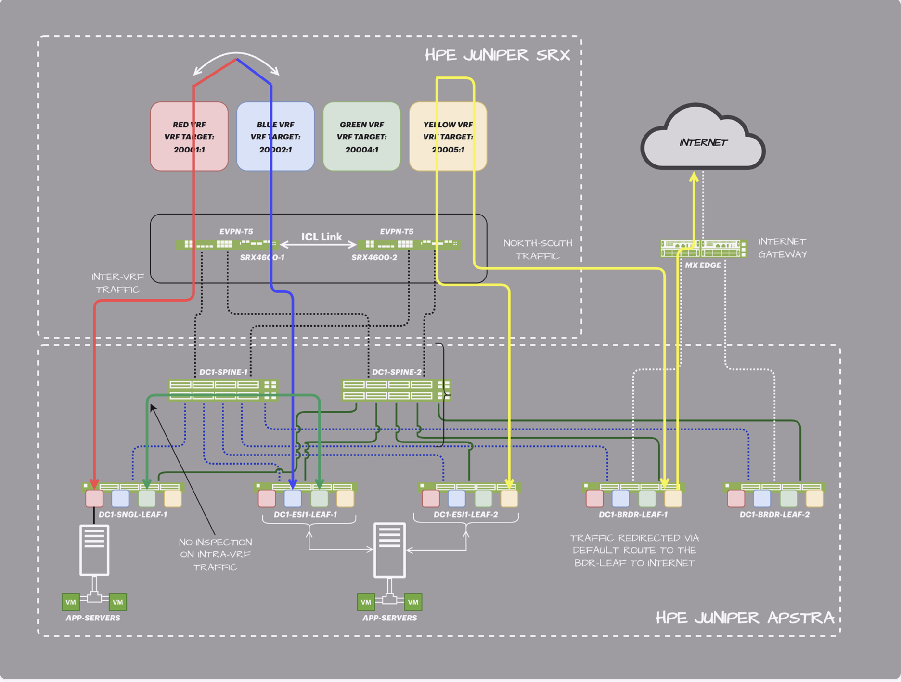

# 3-Stage Data Center Connected Security

Validated configurations for the Juniper Validated Design *"Secure Data Center Fabric with Juniper SRX."* This JVD extends the [3-stage data center design](../3stage_dc/) by integrating Juniper **SRX firewalls in a Multinode High Availability (MNHA) cluster** into the EVPN/VXLAN fabric, so security policy can be applied without breaking VXLAN encapsulation across the fabric.

* JVD landing page: <https://www.juniper.net/documentation/us/en/software/jvd/jvde-secure-data-center-fabric-srx-series-firewall/index.html>

The SRX devices participate in EVPN signaling and learn Type-5 routes by peering with the spines, which lets network and firewall teams operate independently. Two primary use cases:

* **Inter-VRF traffic** — leaf forwards inter-VRF flows to the SRX (via spine); the SRX applies policy to the inner VXLAN payload and routes the traffic to its destination while preserving VXLAN encapsulation. No ACLs needed on the fabric switches.
* **North-south traffic** — the SRX inspects every north-south flow and injects a default route into the EVPN/VXLAN fabric so perimeter-bound traffic is steered consistently.

## Hardware

| Juniper Product | Role | Hostnames | Software |
|---|---|---|---|
| **QFX5220-32CD** | Spine | `spine1`, `spine2` | Junos OS Evolved 23.4R2 |
| **QFX5120-48Y-8C** | DC server leaf | `dc1-single-001-leaf1` | Junos OS 23.4R2 |
| **QFX5120-48YM-8C** | DC ESI leaf pair | `dc1-esi-001-leaf1`, `dc1-esi-001-leaf2` | Junos OS 23.4R2 |
| **QFX5130-32CD** | DC border leaf pair | `dc1-borderleaf-001-leaf1`, `dc1-borderleaf-001-leaf2` | Junos OS Evolved 23.4R2 |
| **SRX4600** *(SRX4700 also validated)* | External firewall MNHA pair | — | Junos OS 23.4R2 |
| **MX series** | External gateway router | — | Junos OS |
| Juniper Apstra | Fabric management | — | Apstra 6.0 |

## Configurations

| File | Role |
|---|---|
| [`spine1_qfx5220-32cd.conf`](configuration/conf/spine1_qfx5220-32cd.conf) | Spine 1 |
| [`spine2_qfx5220-32cd.conf`](configuration/conf/spine2_qfx5220-32cd.conf) | Spine 2 |
| [`borderleaf1_qfx5130-32cd.conf`](configuration/conf/borderleaf1_qfx5130-32cd.conf) | Border leaf 1 |
| [`borderleaf2_qfx5130-32cd.conf`](configuration/conf/borderleaf2_qfx5130-32cd.conf) | Border leaf 2 |
| [`server-leaf1_qfx5120-48y-8c.conf`](configuration/conf/server-leaf1_qfx5120-48y-8c.conf) | Single-homed server leaf |
| [`esi-leaf1_qfx5120-48ym-8c.conf`](configuration/conf/esi-leaf1_qfx5120-48ym-8c.conf) | ESI leaf 1 |
| [`esi-leaf2_qfx5120-48ym-8c.conf`](configuration/conf/esi-leaf2_qfx5120-48ym-8c.conf) | ESI leaf 2 |
| [`firewall1_srx4600.conf`](configuration/conf/firewall1_srx4600.conf) | SRX MNHA peer 1 |
| [`firewall2_srx4600.conf`](configuration/conf/firewall2_srx4600.conf) | SRX MNHA peer 2 |
| [`mx_external_gw.conf`](configuration/conf/mx_external_gw.conf) | External gateway router (MX series) |

## Apstra blueprint

The fabric was deployed and managed via Juniper Apstra. The exported blueprint is included for reference:

* [`configuration/apstra/3stage_csec-blueprint.json`](configuration/apstra/3stage_csec-blueprint.json)
