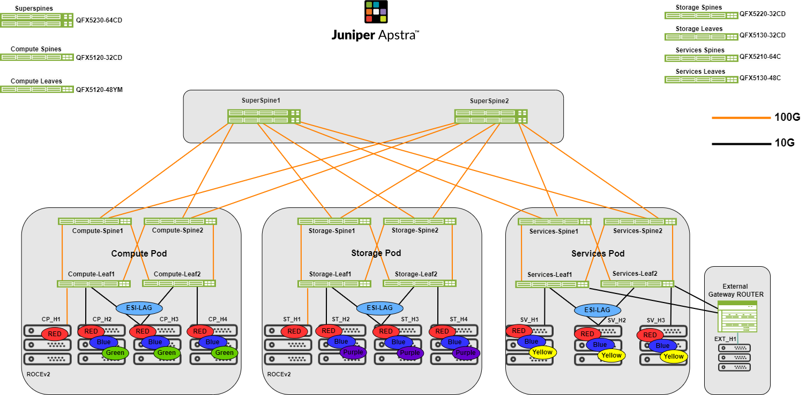

# 5-Stage EVPN-VXLAN Data Center

Validated configurations for the Juniper Validated Design *"5-Stage EVPN/VXLAN Data Center Fabric (ERB)."* This design extends the [3-stage data center](../3stage_dc/) to web-scale by introducing **lean super spines** above multiple PODs, each POD itself a 3-stage EVPN/VXLAN fabric. Super spines and POD spines forward IP only and relay routes — they do not run VXLAN encapsulation.

* JVD landing page: <https://www.juniper.net/documentation/us/en/software/jvd/jvd-dcfabric-5-stage/>

The 5-stage fabric targets large data centers where compute and storage scale beyond a single POD, and where workloads such as RoCEv2 and multicast must traverse PODs deterministically. This JVD validates three POD types — **Compute**, **Storage**, and **Services** — interconnected by a pair of super spines, with an external gateway router providing north-south connectivity.

## Hardware

| Juniper Product | Role | Hostnames | Software |
|---|---|---|---|
| **QFX5230-64CD** | Super spine pair | `sspine001-1`, `sspine001-2` | Junos OS Evolved 23.4R2-S3 |
| **QFX5210-64C** | Compute POD spine pair | `spine001-001-1`, `spine001-001-2` | Junos OS 23.4R2-S3 |
| **QFX5120-48YM** | Compute POD leaf pair | `leaf001-001-1`, `leaf001-001-2` | Junos OS 23.4R2-S3 |
| **QFX5220-32CD** | Storage POD spine pair | `spine002-001-1`, `spine002-001-2` | Junos OS Evolved 23.4R2-S3 |
| **QFX5130-32CD** | Storage POD leaf pair | `leaf002-001-1`, `leaf002-001-2` | Junos OS Evolved 23.4R2-S3 |
| **QFX5210-64C** | Services POD spine pair | `spine003-001-1`, `spine003-001-2` | Junos OS 23.4R2-S3 |
| **QFX5130-48C** | Services POD leaf pair (border leaf) | `leaf003-001-1`, `leaf003-001-2` | Junos OS Evolved 23.4R2-S3 |
| **MX series** | External gateway router | — | Junos OS 22.2R3 |
| Juniper Apstra | Fabric management | — | Apstra 5.0.0-64 |

The JVD also validates **QFX5120-32C** as an alternate spine option — those configurations are not included in this folder.

## Configurations

### Super spines

| File | Role |
|---|---|
| [`superspine1_qfx5230-64cd.conf`](configuration/conf/superspine1_qfx5230-64cd.conf) | Super spine 1 |
| [`superspine2_qfx5230-64cd.conf`](configuration/conf/superspine2_qfx5230-64cd.conf) | Super spine 2 |

### Compute POD

| File | Role |
|---|---|
| [`compute-spine1_qfx5210-64c.conf`](configuration/conf/compute-spine1_qfx5210-64c.conf) | Compute POD spine 1 |
| [`compute-spine2_qfx5210-64c.conf`](configuration/conf/compute-spine2_qfx5210-64c.conf) | Compute POD spine 2 |
| [`compute-leaf1_qfx5120-48ym.conf`](configuration/conf/compute-leaf1_qfx5120-48ym.conf) | Compute POD leaf 1 |
| [`compute-leaf2_qfx5120-48ym.conf`](configuration/conf/compute-leaf2_qfx5120-48ym.conf) | Compute POD leaf 2 |

### Storage POD

| File | Role |
|---|---|
| [`storage-spine1_qfx5220-32cd.conf`](configuration/conf/storage-spine1_qfx5220-32cd.conf) | Storage POD spine 1 |
| [`storage-spine2_qfx5220-32cd.conf`](configuration/conf/storage-spine2_qfx5220-32cd.conf) | Storage POD spine 2 |
| [`storage-leaf1_qfx5130-32cd.conf`](configuration/conf/storage-leaf1_qfx5130-32cd.conf) | Storage POD leaf 1 |
| [`storage-leaf2_qfx5130-32cd.conf`](configuration/conf/storage-leaf2_qfx5130-32cd.conf) | Storage POD leaf 2 |

### Services POD

| File | Role |
|---|---|
| [`services-spine1_qfx5210-64c.conf`](configuration/conf/services-spine1_qfx5210-64c.conf) | Services POD spine 1 |
| [`services-spine2_qfx5210-64c.conf`](configuration/conf/services-spine2_qfx5210-64c.conf) | Services POD spine 2 |
| [`services-leaf1_qfx5130-48c.conf`](configuration/conf/services-leaf1_qfx5130-48c.conf) | Services POD border leaf 1 |
| [`services-leaf2_qfx5130-48c.conf`](configuration/conf/services-leaf2_qfx5130-48c.conf) | Services POD border leaf 2 |

### External

| File | Role |
|---|---|
| [`external-gw_mx.conf`](configuration/conf/external-gw_mx.conf) | External gateway router (MX series) |
