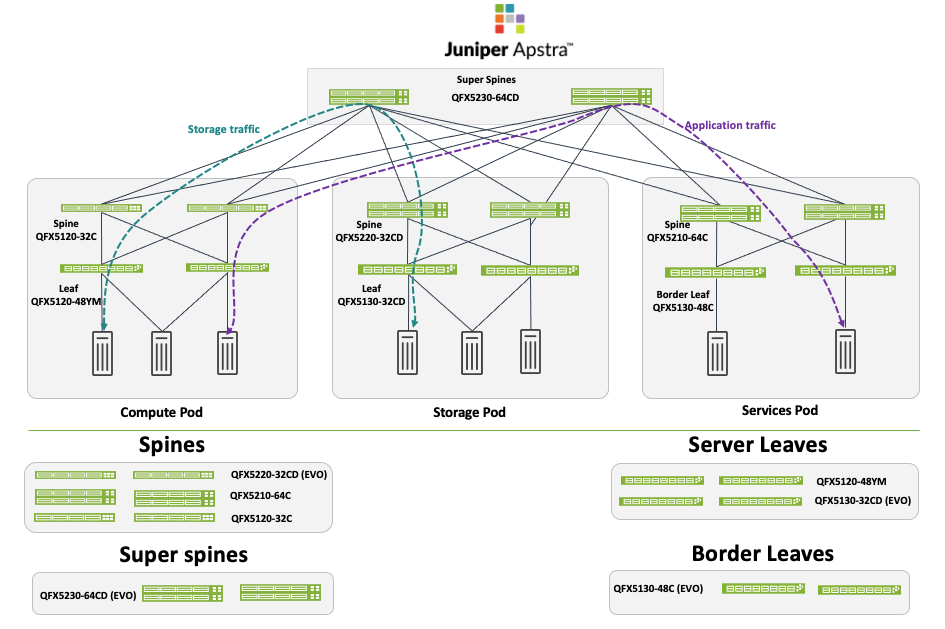
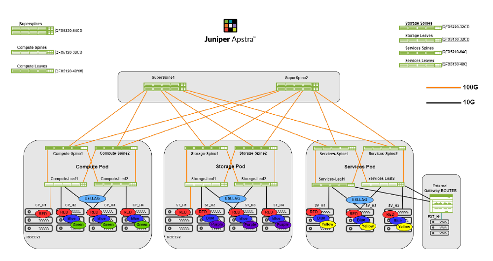

>
> Faithful markdown conversion of the published PDF:
> [5-Stage EVPN-VXLAN Data Center — Juniper Validated Design (JVD)](https://www.juniper.net/documentation/us/en/software/jvd/5stage-evpn-vxlan-dc-apstra/index.html).
> The PDF on juniper.net is the source of truth. The Configuration Walkthrough is
> reproduced here as text; the Apstra UI screenshots are referred out to the
> published PDF by figure number and caption. The resulting device configurations
> are in [`../configuration/conf/`](../configuration/conf/).

# 5-Stage EVPN-VXLAN Data Center — Juniper Validated Design (JVD)

Juniper Networks Validated Designs provide you with a comprehensive, end-to-end
blueprint for deploying Juniper solutions in your network. These designs are
created by Juniper's expert engineers and tested to ensure they meet your
requirements. Using a validated design, you can reduce the risk of costly
mistakes, save time and money, and ensure that your network is optimized for
maximum performance.

## About this Document

This document details a Juniper Validated Design (JVD) to provision a 5-stage
EVPN/VXLAN fabric with Juniper Apstra using Apstra's Data Center Architecture
design feature, consisting of two Superspines, and PODs with spines, server leaf
switches, and border leaf switches. The validation was done using several
combinations of device models, which are listed in the document. This document is
intended for an audience familiar with Juniper technologies such as Junos OS, QFX
switches, and Juniper Apstra. Note that this JVD contains references to the
3-Stage Data Center Design with Juniper Apstra.

## Solution Benefits

This document offers comprehensive guidance on deploying a 5-stage fabric with
Juniper Apstra. It is designed to meet the needs of most of Juniper's customers,
has been extensively tested by Juniper, and is deployed by customers across the
globe. Advanced JVD testing by Juniper combined with widespread adoption
simplifies troubleshooting and shortens the support cycle, leading to a more
stable data center fabric, reducing operational costs.

Like all Juniper data center JVDs it is based on best practices as determined by
Juniper's subject matter experts. Juniper support teams have the extensive
training and resources necessary to support networks based on JVDs.

### Juniper Validated Design Benefits

JVDs are a prescriptive blueprint for building a data center fabric with
well-documented capabilities and appropriate product selection. JVDs must pass
rigorous testing with real-world workloads to achieve validation, verifying that
all products in the Building Blocks JVD work together as expected and mitigating
the risk faced while deploying a network. The core benefits of JVDs are:

- **Repeatability** — Unlock value with repeatable network designs. Because JVDs
  are prescriptive designs used by multiple customers. All JVD customers benefit
  from lessons learned through lab testing and real-world deployments.
- **Reliability** — Layered testing with real traffic. JVDs are quantified and
  integrate the best practice designs based on carefully chosen hardware platforms
  and software versions and are tested with real-world traffic.
- **Accelerated Deployment** — Ease installation with step-by-step guidance.
  Simplify deployment with guidance, automation, and prebuilt integrations.
- **Accelerated Decision-Making** — Leave behind costly bespoke networks. Bridge
  business and technology in designs that meet the needs of most customers and
  consider how features behave and operate in real-world applications and
  conditions.
- **Best Practice Networks** — Better outcomes for a better experience. Juniper
  Validated Designs have known characteristics and performance profiles to help
  you make informed decisions about deploying a network.

### Juniper Apstra Benefits

Juniper Validated Designs in the data center start with the Apstra software.
Apstra is a multi-vendor, intent-based networking system (IBNS) that provides
closed-loop automation and assurance. Apstra translates vendor-agnostic business
intent and technical objectives to essential policy and device-specific
configurations. The system also validates user intent, as part of the initial
deployment and continuously thereafter. This ensures that the network state does
not deviate from the intended state. Any anomaly or deviation can be flagged, and
remediation actions can be taken directly from Apstra.

The core benefits of Apstra are:

- **Intent-based networking** — Automates configuration generation and
  continuously validates operating state versus intent.
- **Network Automation** — Apstra is a multi-vendor network automation platform
  that is continuously updated to work with the latest hardware and exhaustively
  tested using modern DevOps practices.
- **Recoverability** — Built-in rollback capability restores known-working
  configuration in a fraction of the time.
- **Day 2+ Management** — Apstra's rich analytics capabilities, including Flow
  Data, reduce Mean Time to Resolution (MTTR).
- **Simplicity** — Apstra simplifies network management. For example, by reducing
  the complexity of data center interconnection (DCI), making it easy to unify
  multiple data centers while isolating failure domains for high availability and
  resilience.

## Use Case and Reference Architecture

The 5-stage Datacenter design is similar to the 3-stage datacenter design with
the exception of a Super spine layer. This allows for scaling large scale
datacenter design with requirements for large datastores and the compute nodes
that need to connect to the data storage.

> **NOTE:** In rare cases, customers have deployed 5-stage design where
> datacenters are located closer together. This allows one Blueprint in Apstra to
> manage datacenters. This design can work in the above-mentioned scenario or in
> some cases where dark fiber is used as an interconnect. Paying close attention
> to performance and latency, it's recommended that the 5-stage design should be
> used cautiously to interconnect datacenters. Please contact your Juniper account
> representative for more information. This JVD document validates the 5-stage
> datacenter design where racks are located in the same lab location. The scaling
> and performance tests are based on this design.

In Figure 1, each Super spine is connected to each spine in a POD. Hence there can
be multiple Pods connected to the Super spines. A POD consists of Spine and Leaf
layers and is the equivalent of a 3-stage Fabric. The term 5-stage refers to the
number of network devices that traffic sent from one host to another must traverse
to reach its destination. For the purposes of brevity, there are only three pods
shown. There can also be multiple Super spines depending on the amount of traffic
and ports needed.

*Figure 1: 5-Stage Datacenter Architecture with Apstra.*

## Solution Architecture

The 5-stage Fabric with Juniper Apstra is an EVPN-VXLAN based validated design
that is based on ERB network architecture. It consists of a superspine connected
to the Pods. The superspine only performs IP forwarding and relaying of routes
just as the spines in the Pods do. Hence the superspines and spines in 5-stage
Fabric are called Lean superspines and lean spines.

As mentioned in this JVD, 5-stage Fabric is adopted for large scale datacenter
designs that have requirement for large datastores with connecting compute nodes.
This JVD validates key features such as RDMA over Converged Ethernet version 2
(RoCEv2), Multicast, and other base features in the 5-stage fabric.

This JVD will walk through the high-level steps required to configure a 5-stage
Data center. Refer to Figure 1 for the reference architecture and hardware used to
validate the 5-stage Fabric. The switches are considered the baseline design of
this JVD, though other switches are qualified for these roles, as documented below.

The provisioning of this datacenter was done using Juniper Apstra's Datacenter
Reference design that provisions native config. Apstra uses pre-defined Intent
Based Analytics to provide real-time insight into the network.

> **NOTE:** The pods hosting the border leaves can be directly connected to the
> superspine. The border leaves will then need to be manually configured, as this
> is not yet supported in Apstra Datacenter Reference design architecture.

Below is the lab setup network design for validating 5-stage Fabric. Refer to
Figure 2 (and Test Bed Configuration) for more details about this test bed.

*Figure 2: 5-Stage Datacenter Lab Network.*

### Juniper Hardware and Software Components

For this solution, the Juniper products and software versions are as below.

The design documented in this JVD is considered the baseline representation for
the validated solution. As part of a complete solutions suite, we routinely swap
hardware devices with other models during iterative use case testing. Each switch
platform validated in this document goes through the same rigorous role-based
testing using specified versions of Junos OS and Apstra management software.

### Juniper Hardware Components

The following switches are tested and validated to work with the 5-Stage Fabric
with Juniper Apstra JVD in the following roles:

#### Table 1: Platform Positioning and Roles

| Solution | Server Leaf Switches | Border Leaf Switches | Spine | Super Spine |
|----------|----------------------|----------------------|-------|-------------|
| 5-stage EVPN/VXLAN Datacenter design (ERB) | QFX5120-48YM, QFX5130-32CD (EVO) | QFX5130-48C (EVO) | QFX5220-32CD (EVO), QFX5210-64C, QFX5120-32C | QFX5230-64CD (EVO) |

> **NOTE:** The JVD assumes that the other model variations of the tested device
> in the hardware series should also work. For instance, QFX5120-48YM covers all
> the rest of the variations such as QFX5120-48Y since the same chipset is used.
> However, there are some exceptions such as QFX5130-48C and QFX5130-32CD. Please
> contact the Juniper account representative for more information.

#### Table 2: Juniper Software and Version

| Juniper Products | Software or Image Version |
|------------------|---------------------------|
| Juniper Apstra | 5.0.0-64 |
| Junos OS | 23.4R2-S3 |

> **NOTE:** The Junos OS Release 23.4R2-S3 is used for testing. Some of the
> decisions with respect to multicast influenced the choice of leaf switch.
> **Important Note:** During JVD testing, Apstra generated several incremental
> "Check gRPC_Reset count" anomalies. The workaround is to disable gRPC_telemetry.
> The workaround for this issue is to disable gRPC_enabled flag (gRPC_enabled = 0)
> in /etc/aos/aos.conf. Then restart Apstra service from cli using command
> "service aos restart" as root user. This would mean that telemetry will still be
> collected however it will be collected using Netconf. The 5-stage JVD testing
> using Apstra 5.0 was carried out after implementing this workaround.

### Validated Functionality

The 5-stage Fabric with Juniper Apstra was validated using the following
parameters in its configuration:

- This JVD consists of a 5-stage CLOS with an ERB network architecture using
  EVPN-VXLAN.
- Servers will be connected and tested both in single-homed and multi-homed
  configurations.
- In the case of multihomed ESI servers, LACP is enabled between the servers and
  the leaf switches.
- Configure ESI on aggregated ethernet interfaces for multi-homed devices.
- ECMP is configured across the fabric to minimize traffic loss.
- Both the overlay and underlay of the fabric are built using eBGP.
- Learn and advertise EVPN Type 2 and Type 5 routes.
- BFD is enabled for both underlay eBGP and overlay eBGP.
- Symmetric IRB is enabled with anycast IP address on L3-enabled leaf switches for
  inter-VLAN routing. For more information on the IRB model for inter-subnet
  forwarding in EVPN, refer to the EVPN VXLAN Guide.
- Both IPv4 and IPv6 are enabled.
- OISM multicast Bridge Domain Not Everywhere (BDNE) configured on leaf switches
  in pods for routing and forwarding traffic within Fabric and externally using
  border leaf switches to exchange multicast traffic with external source and
  receivers. For more information on juniper OISM configuration refer juniper OISM.
- ECN and PCF QOS configuration profiles for supporting RoCEv2.
- DHCP, loopback firewall filter and Duplicate MAC detection.
- Inter-VRF connectivity is configured using external router to allow route
  leaking between VRFs, however, to achieve this configuration Apstra Connectivity
  templates were used to connect to the external router.

The features below are not considered part of this JVD and are not described.
However, the features have been validated:

- DCI
- SNMP
- Management VRF
- Apply pristine configs to devices

## Configuration Walkthrough

> **NOTE:** This walkthrough is a step-by-step Apstra provisioning procedure. The
> published PDF illustrates each step with an Apstra UI screenshot (Figures 3–29).
> Those screenshots are not reproduced here; each is referred to inline by its
> figure number and caption so you can locate it in the
> [published PDF](https://www.juniper.net/documentation/us/en/software/jvd/5stage-evpn-vxlan-dc-apstra/index.html). All step text and NOTES are reproduced in full.

This walkthrough summarizes the steps required to configure the 5-Stage Fabric with Juniper Apstra
JVD.

This document covers the steps for a 5-Stage services POD which consists of Spine and Border leaf. All
the other pods, compute and storage pods, can be created using similar steps. The blueprint for the
racks and templates in all these pods is discussed later in this document.

For more detailed information on the installation and step-by-step configuration, refer to the Juniper
Apstra User Guide. Additional guidance in this walkthrough is provided in the form of notes.

### Apstra: Configure Apstra Server and Apstra ZTP Server

A configuration wizard launches upon connecting to the Apstra server VM for the first time. At this
point, passwords for the Apstra server, Apstra UI, and network configuration can be configured. For
more information about installation, refer to the Juniper Apstra User Guide.

Apstra: Onboard the devices into Apstra

There are two methods for adding Juniper devices into Apstra for management: manually or in bulk
using ZTP.

To add devices manually (recommended):

- In the Apstra UI navigate to Devices > Agents > Create Offbox Agents.

This requires that the devices are preconfigured with a root password, a management-instance [edit
system], management IP, and proper static routing if needed, as well as ssh Netconf, so that they can be
accessed and configured by Apstra.

To add devices via ZTP:

- From the Apstra ZTP server, follow the ZTP steps described in the Juniper Apstra User Guide.

For this 5-stage JVD setup, a root password and management IPs were already configured on all
switches prior to adding the devices to Apstra. To add switches to Apstra, first log into the Apstra Web
UI, choose a method of device addition as per above, and provide the appropriate username and
password preconfigured for those devices.

> **NOTE:** Apstra imports the configuration from the devices into a baseline configuration called pristine configuration, which is a clean, minimal configuration, and is free of any pre-existing settings that could interfere with the intended network design managed by Apstra. Apstra ignores the Junos configuration ‘groups’ stanza and does not validate any group configuration listed in the inheritance model, refer to the configuration groups usage guide.

It is best practice to avoid setting loopbacks, interfaces (except management interface), routing-
instances (except management-instance) or any other settings as part of this baseline
configuration.Apstra sets the protocols LLDP and RSTP when the device is successfully
Acknowledged.

To onboard the devices, follow these steps:

1) Apstra Web UI: Create Agent Profile

For the purposes of this JVD, the same username and password are used across all devices. Thus, only
one Apstra Agent Profile is needed to onboard all the devices, making the process more efficient.

To create an Agent Profile, navigate to Devices > Agent Profiles and then click on Create Agent Profile.

*Figure 3: Create Agent Profile*

2) Apstra Web UI: Add Range of IP Addresses for Onboarding Devices

An IP address range can be provided to bulk onboard devices in Apstra. The ranges shown in the
example below are shown for demonstration purposes only.

To onboard devices, navigate to Devices > Managed Devices and then click on Create Offbox Agents
(for Junos OS devices only)

For onboarding Junos OS Evolved devices click Create Onbox agent.

*Figure 4: Adding a Range of IP Addresses in Apstra for offbox*

*Figure 5: Adding range of IP addresses for onbox*

3) Apstra Web UI: Acknowledge Managed Devices for Use in Apstra Blueprints

Once the offbox and onbox agents have been added and the device information has been collected,
select the checkbox interface to select all the devices and then click Acknowledge. This places the
switch under the management of the Apstra server.

Finally, ensure that the pristine configuration is collected once again as Apstra adds the configurations
for LLDP and RSTP.

The device state moves from OOS-QUARANTINE to OOS-READY.

*Figure 6: Acknowledged Devices*

> **NOTE:** Once a device is managed by Apstra, all device configuration changes should be performed using Apstra. Do not perform configuration changes on devices outside of Apstra, as Apstra may revert those changes.

### Apstra Fabric Provisioning

In the following steps, the 5-stage fabric is deployed with the Juniper Apstra. Before provisioning a
blueprint, a replica of the topology is created. Before datacenter Blueprint is deployed, a replica of the
devices known as Logical devices and Interface Maps should be created. Logical devices are abstractions
of physical devices that specify common device form factors such as the amount, speed, and roles of
ports without vendor specific information. Logical devices are then mapped to the device profiles using
interface maps. The ports mapped on the interface maps match the device profile and the physical
device connections.

Logical devices are then used to create Racks in Apstra. Once the Racks are created the template is
created for each pod which is then used to create Blueprint. For more information refer the Juniper
Apstra guide to understand the terminology and device configuration lifecycle.

To create the logical devices in Apstra navigate to Design > Logical Devices

To create the Interface maps Apstra navigate to Design > Interface Maps

Apstra Web UI: Create Logical Devices, Interface Maps with Device
Profiles

For the purposes of this JVD lab, logical devices and interface maps are created for all devices in Figure:
5-Stage Datacenter Architecture with Apstra on page 4.

### Compute Pod logical devices and Interface maps

The logical devices and interface maps for QFX5120-48YM leaf switches in compute pod are shown in
Figure: Logical Device for QFX5120-48YM on page 14 and Figure: Interface Maps for QFX5120-48YM
on page 15, the port speeds and number of ports is dependent on the setup required. The 100G ports
are connections to the spine switches and the rest of the ports connect to the servers:

*Figure 7: Logical Device for QFX5120-48YM*

*Figure 8: Interface Maps for QFX5120-48YM*

The logical devices and interface maps for QFX5120-32C Spine switches in compute pod are as below.

*Figure 9: Logical Device for QFX5120-32C*

*Figure 10: Interface Map for QFX5120-32C*

### Storage Pod logical devices and Interface maps

Similar to compute pod, the logical devices and interface maps for QFX5130-32CD leaf switches in
storage pod are shown in Figure: Logical Device for QFX5130-32CD on page 15 and Figure: Interface
Map for QFX5130-32C on page 16. The 100G ports are connections to the spine switches and the rest
of the ports connect to the servers.

*Figure 11: Logical device for QFX5130-32CD*

*Figure 12: Interface Maps for QFX5130-32CD*

The logical devices and interface maps for QFX5220-32CD Spine switches in compute pod are as below.

*Figure 13: Interface Map for QFX5220-32CD*

### Services Pod logical devices and Interface maps

Lastly, The logical devices and interface maps for QFX5230-62CD border leaf switches in services pod
are shown in Figure: Logical Device for QFX5130-48C on page 19 and Figure: Interface Maps for
QFX5130-48C. The 100G ports are connections to the spine switches and the rest of the ports connect
to the servers.

*Figure 14: Logical device for QFX5130-48C*

*Figure 15: Interface Maps for QFX5130-48C*

The logical device and Interface maps for the Services Pod Spine switches QFX5210-64C are as shown
below.

*Figure 16: Logical device for QFX5210-64C*

*Figure 17: Interface maps for QFX5210-64C*

### Superspine

The two superspine QFX5230-64CD connect to all the pods at the spines with 100G connection. The
logical device and interface maps are shown as below in Figure: Logical device for QFX5230-64CD on
page 22 and Figure: Interface maps for QFX5230-64CD on page 23.

*Figure 18: Logical device for QFX5230-64CD*

*Figure 19: Interface maps for QFX5230-64CD*

### Generic servers

Apart from the above logical devices and interface maps, generic server interface maps are also required
to depict the servers connected to the server leaf switches. Apstra does not manage the servers.
However, generic servers define the network interface connections from the servers to the Leaf
switches in respective pods.

External routers that are connected to the border leaf switches also require logical device for generic
servers and corresponding interface maps. External routers used for PIM gateway and for DHCP relay
from external source.

### Apstra Web UI: Racks, Templates, and Blueprints—Create Racks

Once the Logical Devices and Interface Maps are created, create the necessary rack types for the 5-
stage pods. For each pod a separate pod is defined as shown below.

To create Rack in Apstra, create racks under Design > Rack Types. For more information on creating
racks, refer to the Juniper Apstra User Guide.

### Compute Pod Rack

For the compute pod, the rack definition requires the logical device of the leaf switches as input.
Generic systems define the servers and the connectivity. Along with count of systems, logical device for
the servers, single-homed or dual-homed is also defined.

*Figure 20: Compute Pod Rack*

The services and storage pods racks are created in the same way as is created for the compute pod rack.

### Templates

Once all the racks are created, a corresponding rack-based template is created in Apstra by navigating to
Design > Templates > Create Template. The template defines the structure and the intent of the
network. It is used to define connectivity between the ToR switches and the spine switches in the pods.
This pod template is similar to 3-stage fabric datacenter design template as it consists of spine and leaf
switches.

Below is screenshot of rack-based compute pod template, similar templates are created for storage and
service pods. For each template the rack created in the previous step "Apstra Web UI: Racks, Templates,
and Blueprints—Create Racks" on page 23 Spine logical devices is needed along with the number count
of spine switches. The connectivity to superspine should be added, as this is 5-stage rack based
template, along with a count of the number of links on each superspine.

For 5-stage rack based template, choose Single ASN Allocation Schema as shown in the Figure:
Compute Pod template on page 25.. All spine devices in each pod are assigned the same ASN, and all
superspine devices are assigned another ASN.

And for the EVPN-VXLAN Fabric type the MP-EBGP-EVPN radio button is selected for Overlay Control
Protocol.

*Figure 21: Compute Pod template*

After creating rack-based templates for each of the pods, create a pod-based template for the 5-stage
Fabric. This brings all the pods together connecting them to the superspines.

*Figure 22: 5-Stage EVPN-VXLAN Fabric pod based Template*

### Apstra Web UI: Create a Blueprint for 5-stage Fabric

The pod-based template created in previous step above Figure: 5-Stage EVPN-VXLAN Fabric pod based
Template on page 26 is used as input to create Blueprint for 5-stage EVPN-VXLAN Datacenter.

To create a blueprint, click on Blueprints > Create Blueprint. For more information on creating the
blueprint, see the Juniper Apstra User Guide.

It is important to select the Reference design as Datacenter and the pod-based template that was
created above Figure: 5-Stage EVPN-VXLAN Fabric pod based Template on page 26 IPv4 and IPv6 dual
stack is selected for fabric underlay and overlay links.

*Figure 23: 5-stage Fabric Blueprint*

Once the blueprint is created, it’s ready for assigning resources, mapping interface maps, and assigning
devices to the fabric switch roles. The blueprint is created as shown below.

*Figure 24: 5-Stage Blueprint created but not provisioned*

### Assign Resources

In this step, the resources are allocated using the pools created in Apstra under Resources. Resources
such as ASN, Loopback IP, Fabric Link IPs can be created and used and assigned to superspines, spines,
leaf switches.

*Figure 25: Assign Resources*

### Assign Interface Maps and devices

The next step is to assign Interface maps for each switch’s role. This allows Apstra to map the interfaces
on devices (using device profile) with the actual device once the devices are assigned to their roles.

*Figure 26: Assign Interface Maps*

*Figure 27: Assign Devices to role*

> **NOTE:** While assigning devices to the role, in case a device serial number is not visible then navigate to Devices > Managed Devices and verify that the device that was being assigned has the right device profile and corresponding Interface map.

### Review Cabling

Apstra automatically assigns cabling ports on devices that may not be the same as the physical cabling.
However, the cabling assigned by Apstra can be overridden and changed to depict the actual cabling.
This can be achieved by accessing the blueprint, navigating to Staged > Physical > Links, and clicking the
Edit Cabling Map button or use the Fetch discovered LLDP data. For more information, refer to the
Juniper Apstra User Guide.

### Apstra Web UI: Creating Configlets in Apstra

Configlets are configuration templates defined in the global catalog under Design > Configlets.
Configlets are not managed by Apstra’s intent-based functionality, and should be managed manually. For

more information on when not to use configlet refer to the Juniper Apstra User Guide. Configlets should
not be used to replace reference design configurations. Configlets can be declared as a Jinja template of
the configuration snippet, such as Junos configuration JSON style or Junos set-based configuration.

> **NOTE:** Improperly configured configlets may not raise warnings or restrictions. It is recommended that configlets are tested and validated on a separate dedicated service to ensure that the configlet performs exactly as intended. Passwords and other secret keys are not encrypted in configlets.

Property sets are data sets that define device properties. They work in conjunction with configlets and
analytics probes. Property sets are defined in the global catalog under Design > Property Sets.

Configlets and property sets defined in the global catalogue need to be imported into the required
blueprint and if the configlet is modified then the same needs to be reimported into the blueprint, as is
the case with property sets too. The following figure shows configlets and property sets located on a
blueprint.

During 5-stage validation, several configlets were applied either as part of the general configuration for
setup and management purposes (such as nameservers, NTP, and so on). Since Apstra 5.0 doesn’t
support OISM, ECN and PFC configuration using QOS, loopback firewall policies and firewall policies,
configlets are used to configure those settings. This will be covered separately.

### Fabric Setting

This option allows for fabric-wide setting of various parameters such as MTU, IPv6 application support,
and route options. For this JVD, the following parameters were used: View and modify these settings
within the blueprint Staged > Fabric Settings > Fabric Policy within the Apstra UI.

*Figure 28: Fabric setting*

To simulate moderate traffic in datacenter, traffic scale testing was performed. Refer to Table: Scaling
Numbers Tested on page 46 for more details. The scale testing was performed on switches.

The setting Junos EVPN Next-hop and Interface count maximums was also enabled. This allows Apstra
to apply the relevant configuration to optimize the maximum number of allowed EVPN overlay next-
hops and physical interfaces on leaf switches to an appropriate number for the data center fabric.

For more information on these features, refer to:

https://www.juniper.net/documentation/us/en/software/junos/multicast-l2/topics/topic-map/layer-2-
forwarding-tables.html

https://www.juniper.net/documentation/us/en/software/junos/cli-reference/topics/ref/statement/next-
hop-edit-forwarding-options-vxlan-routing.html

For the Junos EVO devices, following host-profile setting was configured on the Junos EVO switches to
allocate memory based on higher mac scale.

set system packet-forwarding-options forwarding-profile host-profile

### Commit Configuration

Once all the above steps are completed, the fabric is ready to be committed. This means that the control
plane is set up, and all the leaf switches are able to advertise routes through BGP. Review changes and
commit by navigating from the blueprint to Blueprint > <Blueprint-name> Uncommitted.

Starting with Apstra 4.2, a new feature to perform a commit check before committing, was introduced to
check for semantic errors or omissions, especially if any configlets are involved.

Note that if there are build errors, those need to be fixed. Otherwise, Apstra will not commit any
changes until the errors are resolved.

For more information, refer to the Juniper Apstra User Guide.

*Figure 29: Fabric committed*

The blueprint for the data center should indicate that no anomalies are present to show that everything
is working. To view any anomalies with respect to blueprint deployment, navigate to Blueprint >
<Blueprint-name> > Active to view the anomalies raised with respect to BGP, cabling, interface down
events, routes missing, and so on. For more information, refer to the Apstra User Guide.

Overlay network with Virtual Network and Routing Zone can now be provisioned. For more information
on provisioning overlay network refer the Juniper Apstra User guide.

### Configuring Optimized Intersubnet Multicast (OISM)

Optimized intersubnet multicast (OISM) is a multicast traffic optimization feature that operates at L2
and L3 in EVPN-VXLAN edge-routed bridging (ERB) overlay fabrics. OISM uses the concept called
Supplemental Bridge Domain (SBD) to optimize scaling in the fabric. The SBD is configured on leaf
devices and hence the remote tenant bridge domains are reachable via SBD. This simplifies the
implementation of OISM in an ERB architecture datacenter design. OISM employs an SBD inside the
fabric as follows:

- The SBD has a different VLAN ID from any of the revenue VLANs.

- Border leaf devices use the SBD to carry the traffic from external sources toward receivers within the
EVPN fabric.

- In enhanced OISM mode, server leaf devices use the SBD to carry traffic from internal sources to
other server leaf devices in the EVPN fabric that are not multihoming peers.

In EVPN ERB overlay fabric designs, the leaf switches in the fabric route traffic between tenant bridge
domains. When OISM is enabled, the leaf devices selectively forward traffic to leaf devices with
interested receivers. This improves traffic performance within the EVPN fabric. ERB overlay fabrics can
efficiently and effectively support multicast traffic flow between devices inside and outside the EVPN
fabric. OISM optimizes the number of next-hop flooding only to the leaf switches.

OISM also supports other protocols such as Internet Group Management Protocol (IGMP) snooping and
Multicast Listener Discovery (MLD) snooping. These protocols constrain multicast traffic in a broadcast
domain to interested receivers and multicast devices, therefore preserving bandwidth. For external
sources and receivers, PIM gateways at border leaves enable the exchange of Multicast traffic between
internal sources and receivers and external sources and receivers.

The border leaves can connect to the external PIM router using any of the methods provided below to
exchange multicast traffic:

- M-VLAN IRB method: A dedicated VLAN called M-VLAN and IRB interface is used to only exchange
traffic flow to and from the external PIM domain. The M-VLAN IRB interfaces is used to extend in
the EVPN instance.

> **NOTE:** M-VLAN method is not supported on enhanced OISM.

- Classic L3 interface method: Classic physical L3 interfaces on OISM border leaf devices connect
individually to the external PIM domain on different subnets. There is no VLAN associated with these
interfaces.

- Non-EVPN IRB method: A unique extra VLAN ID and subnet for the associated IRB interface is
assigned to IRB interfaces on border leaves. This IRB interface is not extended in the EVPN instance.

For more information on OISM refer this OISM guide.

For the purposes of this JVD, OISM with Bridge Domain Not Everywhere (BDNE) (also known as
enhanced OISM) is configured across all the leaf switches mentioned in Table: Devices under Test
connecting to sources and receivers. This means that the revenue bridge domains need not be
configured on all the leaf switches.

Configuration for enhanced OISM:

In enhanced OISM (BDNE), enhanced-OISM statement is configured across all leaf switches including
border leaf switches under [edit forwarding-options multicast-replication evpn irb].

Since OISM is not supported in Apstra version 5.0, configlets are used to configure the server leaf
switches and border leaf switches. OISM requires OSPF to exchange traffic routes. For enhanced OISM,
OSPF is configured on all leaf switches on the SBD IRB interface in each tenant VRF instance.

#### Server leaf switch config

#### Compute leaf switches

The enhanced-oism option is enabled. The supplemental bridge domain is configured with VLAN 3500
as shown in config snippet. The server leaf device is configured to accept multicast traffic from the SBD
IRB interface as the source interface using the accept-remote-source statement at the [edit routing-
instances name protocols pim interface irb-interface-name] hierarchy level. PIM protocol is also
configured as passive on all leaf switches. IGMP is also configured to exchange multicast traffic to
interested receivers. OSPF is configured at [edit routing-instances name protocols OSPF] hierarchy
level . The SBD IRB interface (irb.3500) and loopback interface are configured as active mode. All other
interfaces are configured as passive mode.

> **NOTE:** Ensure the MTU on the SBD IRB interface is lower than the IRB MTUset protocols igmp interface all

set forwarding-options multicast-replication evpn irb enhanced-oism
set routing-instances evpn-1 protocols igmp-snooping vlan all proxy
set routing-instances blue protocols evpn oism supplemental-bridge-domain-irb irb.3500
set routing-instances blue protocols pim passive
set routing-instances blue protocols pim interface all
set routing-instances blue protocols pim interface irb.3500 accept-remote-source
set routing-instances blue protocols ospf area 0 interface lo0.3
set routing-instances blue protocols ospf area 0 interface irb.3500
set routing-instances blue protocols ospf area 0 interface all passive

#### Storage Leaf switches

The conserve-mcast-routes-in-pfe option is required to be configured for QFX5130-32CD if used as
server leaf or border leaf. With this option, the QFX5130-32CD switches conserve PFE table space by
installing only the L3 multicast routes and avoid installing L2 multicast snooping routes. This option is
set in all OISM-enabled MAC-VRF EVPN routing instances on the device.

The rest of the configuration is same as compute pod leaf switches.

set protocols igmp interface all
set forwarding-options multicast-replication evpn irb enhanced-oism
set routing-instances evpn-1 protocols igmp-snooping vlan all proxy
set routing-instances evpn-1 multicast-snooping-options oism conserve-mcast-routes-in-pfe
set routing-instances blue protocols evpn oism supplemental-bridge-domain-irb irb.3500
set routing-instances blue protocols pim passive
set routing-instances blue protocols pim interface all
set routing-instances blue protocols pim interface irb.3500 accept-remote-source
set routing-instances blue protocols ospf area 0 interface lo0.3
set routing-instances blue protocols ospf area 0 interface irb.3500
set routing-instances blue protocols ospf area 0 interface all passive

> **NOTE:** The conserve-mcast-routes-in-pfe should be deleted if OISM is disabled.

Border Leaf switches

The border leaf switches act as PIM EVPN gateway (PEG) interconnecting the EVPN fabric to multicast
devices (sources and receivers) outside the fabric in an external PIM domain. In this case, the border leaf
switches connect to the external PIM router using Classic L3 method.

The configuration option pim-evpn-gateway is configured under [edit routing-instances blue protocols
evpn oism].

The revenue bridge domain 1400 and 1401 are configured as distributed-DR and the SBD 3500 is
configured as standard mode at the [edit routing-instances name protocols pim interface irb-interface-
name] hierarchy level.

The connectivity between border leaf switches and the external PIM router is using Classic L3 method.
The PIM router acts as PIM rendezvous point (RP). Lastly OSPF is configured at [edit routing-instances
name protocols OSPF] hierarchy level to learn routes to multicast sources to forward traffic from
external sources toward internal receivers, and from internal sources toward external receivers. The SBD
IRB interface and the external multicast L3 interface are configured as PIM active mode. All other
interfaces are configured as passive mode.

set protocols igmp interface all
set forwarding-options multicast-replication evpn irb enhanced-oism
set routing-instances evpn-1 protocols igmp-snooping vlan all
set routing-instances evpn-1 multicast-snooping-options oism conserve-mcast-routes-in-pfe
set routing-instances blue protocols evpn oism supplemental-bridge-domain-irb irb.3500
set routing-instances blue protocols evpn oism pim-evpn-gateway
set routing-instances blue protocols pim rp static address 100.100.100.100
set routing-instances blue protocols pim interface irb.1400 distributed-dr
set routing-instances blue protocols pim interface irb.1401 distributed-dr
set routing-instances blue protocols pim interface irb.3500

#### Connection to external PIM router

set routing-instances blue protocols pim interface lo0.3
set routing-instances blue protocols pim interface et-0/0/7.299
set routing-instances blue protocols ospf area 0 interface lo0.3
set routing-instances blue protocols ospf area 0 interface irb.3500
set routing-instances blue protocols ospf area 0 interface all passive
set routing-instances blue protocols ospf area 0 interface et-0/0/7.299

> **NOTE:** Apstra does not support OSPF natively. Hence it is recommended to use the custom telemetry, collector and probes as discussed in "Apstra UI: Blueprint Dashboard, Analytics, probes, Anomalies" on page 38.

### Apstra UI: Blueprint Dashboard, Analytics, probes, Anomalies

Apstra provides predefined dashboards that collect data from devices. With the help of Intent-Based
Analytics (IBA) probes, Apstra combines intent with data to provide real-time insight into the network,
which can be inspected using Apstra GUI or Rest API. The IBA probes can be configured to raise
anomalies based on the thresholds.

#### Custom Telemetry and Probes

From Apstra 4.2 onwards, custom telemetry collectors can be created to monitor data which Apstra can
use for analyzing. With the custom telemetry collection, the following can be achieved:

- Run Junos CLI show commands that provides data for analyzing.

- Identify the specific key and value to extract from the show command based on its XML output.

- Create a telemetry collector definition.

- Create an IBA probe that utilizes the data from the telemetry collector.

The Apstra guide walks through the steps for setting up custom telemetry collector and custom probes.

Apstra also provides some example custom collector and probes which can be customized as is required.
The GitHub link is as below.

https://github.com/Juniper-SE/Apstra_IBA_Probes.git

### Congestion Management with RDMA Over Converged Ethernet v2

(ROCEv2)

The 5-stage datacenter design is based on a compute, storage and services (web) pod design which
means the fabric should be able to handle moderate to very high amount of storage traffic reliably
within the fabric.

Data Center Quantized Congestion Notification (DCQCN), has become the industry-standard for end-
to-end congestion control for RDMA over Converged Ethernet (RoCEv2) traffic. DCQCN congestion
control methods offer techniques to strike a balance between reducing traffic rates and stopping traffic
all together to alleviate congestion, without resorting to packet drops.

DCQCN combines two different mechanisms for flow and congestion control:

- Priority-Based Flow Control (PFC), and

- Explicit Congestion Notification (ECN).

Priority-Based Flow Control (PFC) helps relieve congestion by halting traffic flow for individual traffic
priorities (IEEE 802.1p or DSCP markings) that are mapped to specific queues or ports. The goal of PFC
is to stop a neighbor from sending traffic for a period of time (PAUSE time), or until the congestion
clears. This process consists of sending PAUSE control frames upstream requesting the sender to halt
transmission of all traffic for a specific class or priority while congestion is ongoing. The sender
completely stops sending traffic to the requesting device for the specific priority.

While PFC mitigates data loss and allows the receiver to catch up processing packets already in the
queue, it impacts performance of applications using the assigned queues during the congestion period.
Additionally, resuming traffic transmission post-congestion often triggers a surge, potentially
exacerbating or reinstating the congestion scenario.

Explicit Congestion Notification (ECN), on the other hand, curtails transmit rates during congestion
while enabling traffic to persist, albeit at reduced rates, until congestion subsides. The goal of ECN is to
reduce packet loss and delay by making the traffic source decrease the transmission rate until the
congestion clears. This process entails marking packets with ECN bits at congestion points by setting the
ECN bits to 11 in the IP header. The presence of this ECN marking prompts receivers to generate
Congestion Notification Packets (CNPs) sent back to source, which signal the source to throttle traffic
rates.

Combining PFC and ECN offers the most effective congestion relief in a lossless fabric supporting
RoCEv2, while safeguarding against packet loss. To achieve this, when implementing PFC and ECN
together, their parameters should be carefully selected so that ECN is triggered before PFC. The fill level
and the drop-probability are the most important parameters to manage traffic during congestion. Here is
a sample config for setting these parameters.

> **NOTE:** Note that these may vary for each datacentre, so its recommended to test this before implementing.

set class-of-service drop-profiles dp0 interpolate fill-level 10

set class-of-service drop-profiles dp0 interpolate fill-level 50

set class-of-service drop-profiles dp0 interpolate drop-probability 0

set class-of-service drop-profiles dp0 interpolate drop-probability 20

set class-of-service drop-profiles dp1 interpolate fill-level 1

set class-of-service drop-profiles dp1 interpolate fill-level 2

set class-of-service drop-profiles dp1 interpolate drop-probability 0

set class-of-service drop-profiles dp1 interpolate drop-probability 100

For more information on the congestion management, refer the document for Congestion management
in Juniper AI/ML Networks

In this 5-stage JVD, the leaf switches were configured with class of service using configlet. The configs
can be viewed on github link.

## Validation Framework

Extensive testing of best practice architectures is key to the Juniper Validated
Design (JVD) program. JVDs qualify and quantify these best practice architectures,
providing customers knowledge about the products and how solution can be deployed.

JVDs employ a layered testing approach to deliver reliability and repeatability.
Individual features receive functional testing. Multifunction testing builds on
this functional testing to see if multiple features work together. Product
delivery testing builds upon multifunctional testing to validate that these
features combined perform as expected for tested use cases, and JVD testing builds
upon product delivery testing by testing multiple products together (including
third-party integrations where appropriate) to ensure that all these products
combined make an industry-leading solution.

*Figure 30: Validation Framework (a generic JVD test-layering diagram — see the
[published PDF](https://www.juniper.net/documentation/us/en/software/jvd/5stage-evpn-vxlan-dc-apstra/index.html)).*

Testing with real-world applications and traffic provides more accurate data
regarding performance and response to different configurations. The standardized
nature of JVDs ensures the same network architecture is deployed in multiple
testing environments, and the use of JVDs by multiple customers allows for any
lessons learned in production deployments to rapidly benefit all JVD customers.
The more JVDs that are deployed worldwide, the greater the value they provide to
all.

### Test Bed

The test bed environment consists of a 5-stage EVPN/VXLAN fabric managed by
Juniper Apstra, with three pods — compute, storage and service pod. An external
router is also connected to the border leaf switches. A traffic generator (IXIA)
is connected to the test ports connected to the leaves in each pod.

### Platforms / Devices Under Test (DUT)

To review the software versions and platforms on which this JVD was validated by
Juniper Networks, please see the Validated Platforms and Software section in this
document.

The following optics were used on the Devices under Test.

#### Table 3: 100G Optics used on Devices under Test

| Part number | Optics Name | Device Role | Device Model |
|-------------|-------------|-------------|--------------|
| 740-061405 | QSFP-100GBASE-SR4 | Border Leaf | QFX5130-48C |
| 740-061405 | QSFP-100GBASE-SR4 | Border Leaf | QFX5130-32CD |
| 740-058734 | QSFP-100GBASE-SR4 | Border Leaf | QFX5130-48C |
| 740-061405 | QSFP-100GBASE-SR4 | Compute Leaf | QFX5120-48YM-8C |
| 740-061405 | QSFP-100GBASE-SR4 | Superspine | QFX5230-64CD |
| 740-058734 | QSFP-100GBASE-SR4 | Superspine | QFX5230-64CD |
| 740-061405 | QSFP-100GBASE-SR4 | Spine | QFX5120-32C |
| 740-061405 | QSFP-100GBASE-SR4 | Spine | QFX5220-32CD |
| 740-061405 | QSFP-100GBASE-SR4 | Spine | QFX5210-64C |

#### Table 4: 10G Optics used on Devices under Test

| Part number | Optics Name | Device Role | Device Model |
|-------------|-------------|-------------|--------------|
| 740-030658 | SFP+-10G-USR | Border Leaf | QFX5130-48C |
| 740-021308 | SFP+-10G-SR | Border Leaf | QFX5130-48C |
| 740-031980 | SFP+-10G-SR | Border Leaf | QFX5130-48C |
| 740-021308 | SFP+-10G-SR | Compute Leaf | QFX5120-48YM-8C |
| 740-031980 | SFP+-10G-SR | Compute Leaf | QFX5120-48YM-8C |
| 740-067442 | QSFP+ 40GBase-SR4 | Compute Leaf | QFX5120-48YM-8C |
| 740-067442 | QSFP+ 40GBase-SR4 | Storage Leaf | QFX5130-32CD |
| 740-067443 | QSFP+-40G-SR4 | Storage Leaf | QFX5130-32CD |

### Test Bed Configuration

Contact your Juniper representative to obtain the full archive of the test bed
configuration used for this JVD.

## Test Objectives

The primary objective of this JVD testing is the qualification testing of the
5-stage fabric with Juniper Apstra. The design is based on ERB (Type2 and Type5)
EVPN-VXLAN Fabric with pods and superspines connecting the pods. The goal is to
ensure the design is well-documented and will produce a reliable, predictable
deployment for the customer. The qualification objectives include validation of
blueprint deployment, device upgrade, incremental configuration
pushes/provisioning, Telemetry/Analytics checking, failure mode analysis, and
verification of host traffic.

### Test Goals

The focus of the testing of 5-Stage Fabric with Juniper Apstra JVD testing as
follows:

- Design and provision Datacenter blueprint deployment through Apstra
- Build OISM (BDNE) with internal and exteral source and receivers
- Design and build configurations for OISM (BDNE) and Class of service for ROCEv2
  using configlet in Apstra.
- Congestion Management with PFC and ECN, including failure scenarios
- Build and validate overlay configuration Routing zones (VRFs) and Virtual
  Network and corresponding connectivity templates in Apstra.
- Build and validate DHCP bindings
- Overlay BFD sub-second (introduced as feature as part of 23.4R2)
- Duplicate MAC detection
- Validation of fabric operation and monitoring through Apstra analytics and
  telemetry dashboard
- Software operation verification (no anomalies, or issues found)
- Validation of end-to-end traffic flow
- System health, ARP, ND, MAC, BGP (route, next hop), interface traffic counters,
  and so on
- In order to pass validation, the 5-stage fabric with Juniper Apstra must also
  pass the following scenarios:
- Node Reboot - simulated real-world switch outage.
- Field scenarios like interface down/up and Laser on/off impact to the fabric and
  check anomalies reporting in Apstra.
- Traffic recovery was validated after all failure scenarios.
- Longevity tests with traffic flow for 3 hours and monitoring Apstra.

Other features tested:

- DHCP Bindings
- Routing-Engine Protection filter
- Multicast state (PIM JOIN and IGMP JOIN active state)
- MAC Move
- Storm Control

Refer to the test report for more information.

### Test Non-Goals

Below are some of the test non-goals:

- LLDP
- Management VRF
- Apply pristine configs to devices
- Comparison of Symmetric IRB to Asymmetric IRB

## Results Summary and Analysis

For the 5-stage JVD, comprehensive functional testing was performed on devices
listed in Platforms / Devices Under Test (DUT) to validate the Junos OS Release
23.4-R2-S3 and Apstra 5.0. During testing the "Check gRPC Reset Count" anomalies
were noticed on Apstra Blueprint, which was due to an issue in Apstra 5.0 and so a
workaround was suggested to disable gRPC telemetry collection as is described in
the Important Note found in the Juniper Hardware and Software Components section.

*Figure 31: Check gRPC Reset Count Anomaly (Apstra UI screenshot — see the
[published PDF](https://www.juniper.net/documentation/us/en/software/jvd/5stage-evpn-vxlan-dc-apstra/index.html)).*

These scale numbers are generated for asymmetric IRB. However, the difference in
scale numbers is minimal and the L3 overlay next-hop limit of 28000 on QFX5130 is
reached before any other scale limitation.

#### Table 5: Scaling Numbers Tested

| Platform | Device | VLANs/VNIs with IRB | MAC_IPs/VN/port | VTEP | ESI | Global_MAC | Global_MAC_IP | Global_NDP_hosts | BGP Total Paths | BGP Active Paths |
|----------|--------|--------------------:|----------------:|-----:|----:|-----------:|--------------:|-----------------:|----------------:|-----------------:|
| **Scale Scenario 1** | | | | | | | | | | |
| Compute Leaf1 | qfx5120-48YM-8C | 50 | 10 | 5 | 1 | 2717 | 5710 | 1800 | 49412 | 24760 |
| Storage Leaf1 | qfx5130-32cd | 50 | 10 | 5 | 1 | 2716 | 5709 | 1800 | 48898 | 24503 |
| Border Leaf1 | qfx5130-48c | 50 | 10 | 5 | 1 | 2716 | 5709 | 1800 | 48858 | 24483 |
| **Scale Scenario 2** | | | | | | | | | | |
| Compute Leaf1 | qfx5120-48YM-8C | 500 | 5 | 5 | 1 | 13527 | 27649 | 9000 | 243650 | 121879 |
| Storage Leaf1 | qfx5130-32cd | 500 | 5 | 5 | 1 | 13516 | 27647 | 9000 | 243200 | 121654 |
| Border Leaf1 | qfx5130-48c | 500 | 5 | 5 | 1 | 13516 | 27647 | 9000 | 241002 | 120555 |
| **Scale Scenario 3** | | | | | | | | | | |
| Compute Leaf1 | qfx5120-48YM-8C | 1000 | 2 | 5 | 1 | 10827 | 22907 | 3600 | 239058 | 119583 |
| Storage Leaf1 | qfx5130-32cd | 1000 | 2 | 5 | 1 | 10816 | 22901 | 3600 | 237764 | 118936 |
| Border Leaf1 | qfx5130-48c | 1000 | 2 | 5 | 1 | 10816 | 22901 | 3600 | 236060 | 118084 |

The scale numbers above are not device maximums; they only reference the scale at
which these multidimensional test cases are performed.

Overall, the JVD validation testing didn't detect any issues, and all performance
parameters were within the threshold and performed as expected.

## Recommendations

The 5-Stage EVPN/VXLAN Fabric with Juniper Apstra JVD follows an industry-standard
ERB design. This JVD provides tips and recommendations at several points in this
JVD.

Junos OS Release 23.4R2-S3 is the minimum recommended software version for this
JVD.

Extending EVPN networks across multiple pods within the same Apstra blueprint adds
the following value:

- **Scaling:** provide any-to-any connectivity for applications distributed across
  multiple pods.
- **Redistributing Workloads:** To load-balance applications, you can migrate a
  group of applications from one pod to another pod while preserving application IP
  and MAC addresses.
- **Performing pod maintenance:** Migrate all applications from one pod to another,
  while preserving the application IP and MAC addresses.
- **Active / Standby applications across sites / pods:** Deploy A/S applications
  across multiple pods to provide high availability at pod level, or as part of
  application migration tasks.
- Facilitate external connectivity for a virtual network from a remote pod without
  external connectivity.

One of the important feature of Apstra 5.0 is the introduction of custom telemetry
combined with Probes to monitor any non-native configuration deployed using
configlets. For example, OSPF in case of OISM.

This document validates the architecture. The hardware selected in Table 1
(Platform Positioning and Roles) are the best-suited switch platforms in terms of
features, performance, and the roles that are specified in this JVD.

## Revision History

| Date | Version | Description |
|------|---------|-------------|
| January 2025 | JVD-DCFABRIC-5STAGE-01-01 | Initial publish |

---

## Sources

- Published document: [5-Stage EVPN-VXLAN Data Center JVD](https://www.juniper.net/documentation/us/en/software/jvd/5stage-evpn-vxlan-dc-apstra/index.html)
- Companion docs: [`solution-overview.md`](solution-overview.md), [`test-report-brief.md`](test-report-brief.md), [`datasheet.md`](datasheet.md)
- Configs: [`../configuration/conf/`](../configuration/conf/)
