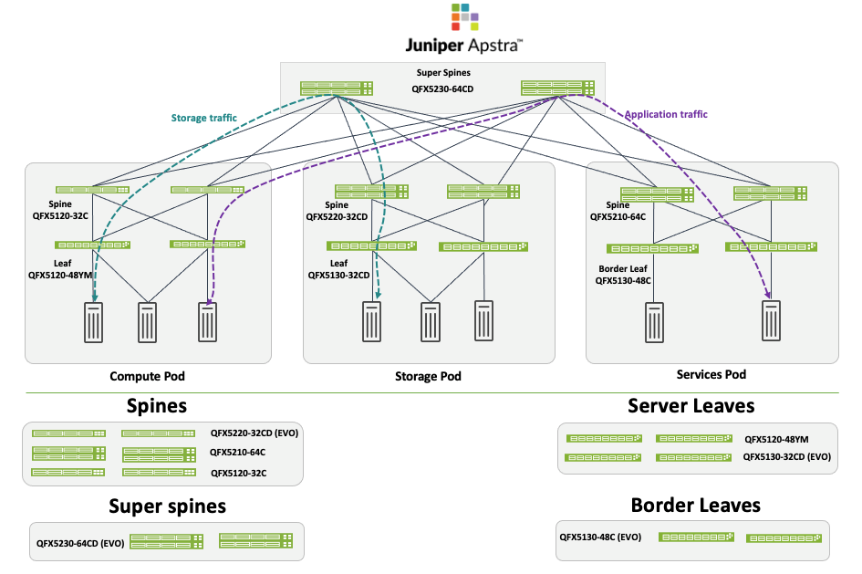

# Solution Overview — 5-Stage EVPN-VXLAN Data Center

> **JVD-DCFABRIC-5STAGE-01-01** · Juniper Validated Design · web-scale multi-POD data center fabric
> Source: *JVD Solution Overview: 5-Stage EVPN-VXLAN Data Center* (juniper.net, V1.0/250130).
> Companion docs: [design-guide.md](design-guide.md) · [test-report-brief.md](test-report-brief.md) · [datasheet.md](datasheet.md)

## Executive summary

Data center operators must deliver and maintain a reliable network infrastructure while managing complexity and meeting scalability needs. Data centers host increasingly varied workloads with a growing diversity of networking requirements, and meeting those needs with bespoke designs introduces a unique troubleshooting burden on networking teams.

The **5-Stage Data Center Design with Juniper Apstra** is a Juniper Validated Design (JVD) that provides organizations with a data center network that is fast, adaptable to change, scalable, and reliable.

## Solution overview

The 5-stage fabric with Juniper Apstra is an EVPN-VXLAN validated design built on an **Edge-Routed Bridging (ERB)** architecture. It consists of a **super spine** layer connecting to multiple **PODs**; the super spines only perform IP forwarding and route relaying — just as the spines within each POD do. For this reason the super spines and POD spines are called **lean super spines** and **lean spines** (no VXLAN encapsulation).

*Figure 1. 5-Stage Data Center architecture — lean super spines above Compute, Storage, and Services PODs.*

The 5-stage fabric is adopted for large-scale data center designs, especially where there is a requirement for large datastores and compute nodes that connect to that storage. This JVD validates key features such as **RoCEv2** and **multicast** alongside the base features for deploying a 5-stage fabric. A POD consists of spine and leaf layers and is the equivalent of a 3-stage fabric; the term "5-stage" refers to the number of devices traffic traverses from one host to another.

Juniper Apstra automation and network management fully support this design. As with all Juniper data center JVDs, the solution follows best practices as determined by Juniper's subject matter experts, and is the result of extensive consultation and testing to balance capability, performance, and cost efficiency for scalable data center deployments.

## Benefits

- **Repeatability** — prescriptive designs where all JVD customers benefit from lessons learned in worldwide deployments.
- **Reliability** — layered testing with real-world traffic on carefully chosen hardware and software versions.
- **Accelerated deployment** — step-by-step guidance, automation, and prebuilt integrations.
- **Web-scale** — multiple PODs (Compute, Storage, Services) interconnected by lean super spines, scaling beyond a single POD.
- **Workload mobility** — any-to-any connectivity, workload redistribution, and pod maintenance while preserving application IP/MAC.

## Solution components

| Component | Software / version |
|-----------|--------------------|
| Juniper Apstra | 5.0.0-64 |
| Junos OS / Junos OS Evolved | 23.4R2-S3 |

The design is an ERB-based EVPN-VXLAN architecture with spine, leaf, and border-leaf switches in a high-availability configuration. All hardware components and software versions are tested extensively with simulated and real-world traffic.

## About Juniper Validated Designs

JVDs represent a cross-functional collaboration between Juniper's top subject matter experts, including product teams, solutions architects, support, development, and testing. A JVD is a prescriptive, well-characterized blueprint that reduces the complexity and support burden of networking teams.

## Sources

- *JVD Solution Overview: 5-Stage EVPN-VXLAN Data Center* — JVD-DCFABRIC-5STAGE-01-01 (juniper.net Validated Designs).
- Companion: [design-guide.md](design-guide.md), [test-report-brief.md](test-report-brief.md), [datasheet.md](datasheet.md).
