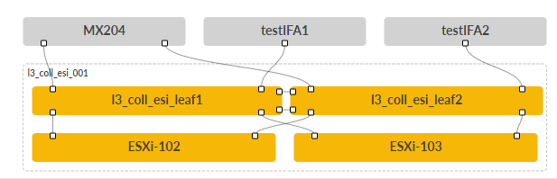
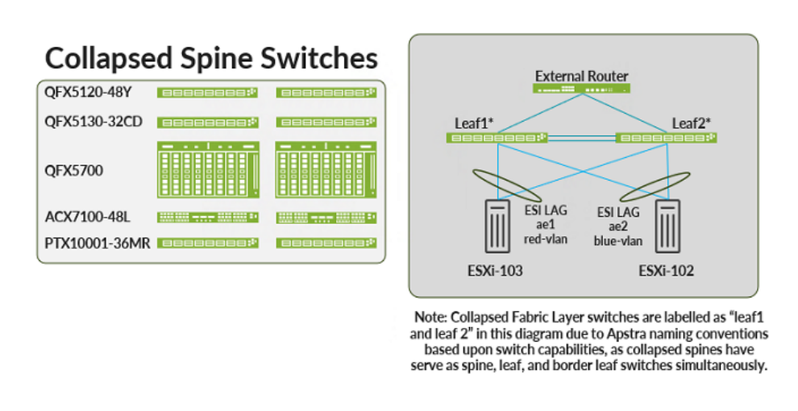

>
> Faithful markdown conversion of the published PDF:
> [Collapsed Data Center Fabric with Juniper Apstra — Juniper Validated Design (JVD)](https://www.juniper.net/documentation/us/en/software/jvd/collapsed-dc-fabric-apstra/index.html).
> The PDF on juniper.net is the source of truth. The Configuration Walkthrough is
> reproduced here as text (steps, NOTES, and CLI verification); the Apstra UI
> screenshots are referred out to the published PDF by figure number and caption.
> The resulting device configurations are in
> [`../configuration/conf/`](../configuration/conf/).

# Collapsed Data Center Fabric with Juniper Apstra — Juniper Validated Design (JVD)

Juniper Networks Validated Designs provide you with a comprehensive, end-to-end
blueprint for deploying Juniper solutions in your network. These designs are
created by Juniper's expert engineers and tested to ensure they meet your
requirements.

Using a validated design, you can reduce the risk of costly mistakes, save time
and money, and ensure that your network is optimized for maximum performance.

## About this Document

This document provides an overview of steps to provision Collapsed Data Center
Fabric with Juniper Apstra JVD, consisting of two switches in a collapsed spine
architecture. The device models validated are listed further in the document.
This document is intended for an audience familiar with Juniper technologies such
as the Junos OS, QFX Series, and Juniper Apstra.

## Solution Benefits

Juniper Validated Designs (JVDs) are network building blocks that help you
successfully architect, deploy, manage, and integrate data center technologies
according to best practices. Adopting validated designs allows you to address
technical debt by deploying well-characterized architectures that simplify
support.

The Collapsed Data Center Fabric with Juniper Astra JVD is designed for scenarios
where a 3-stage data center network would be an unreasonably large investment.
Collapsed fabric use cases include:

- Remote sites and branch office data center networks
- Extend current L2 domains to remote sites through EVPN
- Single-rack pods within a larger data center
- Deployments where low budget, space, or power constraints are a primary
  consideration
- Small data center networks needing high availability

### Juniper Validated Design Benefits

JVDs are a prescriptive blueprint for building a data center fabric with
well-documented capabilities and appropriate product selection. JVDs must pass
rigorous testing with real-world workloads to achieve validation, verifying that
all products in the Building Blocks JVD work together as expected and mitigating
the risk faced while deploying a network. The core benefits of JVDs are:

- **Repeatability** — Unlock value with repeatable network designs. Because JVDs
  are prescriptive designs used by multiple customers all JVD customers benefit
  from lessons learned through both lab testing and real world deployments.
- **Reliability** — Layered testing with real traffic. JVDs are quantified and
  integrated best practice designs, based on carefully chosen hardware platforms
  and software versions, and tested with real world traffic.
- **Accelerated Deployment** — Ease installation with step-by-step guidance.
  Simplify deployment with guidance, automation, and prebuilt integrations.
- **Accelerated Decision-Making** — Leave behind costly bespoke networks. Bridge
  business and technology in designs that meet the needs of most customers and
  consider how features behave and operate in real-world applications and
  conditions.
- **Best Practice Networks** — Better outcomes for a better experience. JVDs have
  known characteristics and performance profiles to help you make informed
  decisions about your network.

### Juniper Apstra

Apstra is a multi-vendor, intent-based network fabric management solution that
provides closed-loop automation and assurance. Apstra translates business intent
and technical objectives to essential policy and device-specific configuration.
Apstra continuously self-validates and resolves issues to assure compliance. The
core benefits of Apstra are:

- **Intent-based networking** — Automates configuration generation and
  continuously validates operating state versus intent.
- **Network Automation** — Apstra is a multi-vendor network automation platform
  that is continuously updated to work with the latest hardware and exhaustively
  tested using modern DevOps practices.
- **Recoverability** — Built-in rollback capability restores known-working
  configuration in a fraction of the time.
- **Day 2+ Management** — Apstra's rich analytics capabilities reduce Mean Time to
  Resolution (MTTR).
- **Simplicity** — Apstra simplifies network management. For example, by reducing
  the complexity of Data Center Interconnection (DCI), making it easy to unify
  multiple data centers while isolating failure domains for high availability and
  resilience.

## Use Case and Reference Architecture

The Collapsed Data Center Fabric with Juniper Apstra JVD topology is created in
Juniper Apstra.


*Figure 1: The Collapsed Data Center Fabric with Juniper Apstra JVD Topology.*

The Collapsed Data Center Fabric with Juniper Apstra JVD is a two-switch network
fabric designed for small network deployments. Switches in a collapsed fabric
perform the roles of spine, leaf, and border leaf switches. This allows for high
availability network deployments with a minimum of switch hardware; however,
resource constraints limit the real-world expandability of this design.

For customers seeking to amplify the number of ports available in this design
beyond what can be provided by two switches in a collapsed fabric configuration,
we recommend the Collapsed Fabric with Apstra and Access Switches JVD Extension
(JVDE). For customers who need more fabric ports than can be provided by two
switches in a collapsed fabric configuration, we recommend the 3-Stage Data
Center Design with Juniper Apstra JVD.

The Collapsed Data Center Fabric with Juniper Apstra JVD uses EVPN-VXLAN for the
control plane and eBGP for both underlay and overlay signaling. This means leaf
switches can discover all the "remote" hosts without flooding the overlay with
ARP/ND requests. Because the switches in the Collapsed Data Center Fabric with
Juniper Apstra JVD serve all fabric roles, including border leaf, the collapsed
fabric switches are tested to serve as anycast gateways as well as gateways to
external networks, which require Data Center Interconnect (DCI) features.

### Prerequisites

This JVD assumes that the Apstra server virtual machine (VM) and Apstra ZTP
server VM are already deployed, and you know how to access the console of these
VMs in order to configure them. For the purposes of this document, the virtual
network of both VMs needs to be on the same subnet as the physical management
network interface of the switches.

This JVD assumes that you have a basic knowledge of Apstra terminology and
processes and is familiar with provisioning a data center reference architecture
with a blueprint. For more information, see Juniper Apstra User Guide.

### Juniper Hardware and Software Components

For this solution, the Juniper products and software versions are listed below.
The listed architecture is the recommended base representation for the validated
solution. As part of a complete solutions suite, we routinely swap hardware
devices with other models during iterative use case testing. Each platform also
goes through the same tests for each specified version of Junos OS.

### Juniper Hardware Components

The following switches are tested and validated to work with the Collapsed Data
Center Fabric with Juniper Apstra JVD:

- QFX5130-32CD
- QFX5120-48Y
- QFX5700
- ACX7100-48L
- PTX10001-36MR

For the purposes of this document, the following switch is used in the
configuration walkthrough:

**Juniper Hardware**

| Platform | Role | Hostname | Junos OS Release |
|----------|------|----------|------------------|
| QFX5120-48Y | Collapsed Spine | dc1-spine1 and dc1-spine2 | 23.4R2-S3 |

**Juniper Software**

| Product | Version |
|---------|---------|
| Juniper Apstra | 4.1.2 |

### Juniper Apstra Overview

Juniper Apstra is a multivendor intent-based network software (IBNS) solution
that orchestrates data center deployments and manages small to large-scale data
centers through Day-0 to Day-2 operations. It is an ideal tool for building data
centers for AI clusters, providing invaluable Day-2 insights through monitoring
and telemetry services.

Deploying a data center fabric through Juniper Apstra is a modular function that
leverages various building blocks to instantiate a fabric. These basic building
blocks are as follows:

- A **logical device** is a logical representation of a switch's port density,
  speed, and possible breakout combinations. Since this is a logical
  representation, any hardware specifics are abstracted.
- **Device profiles** provide hardware specifications of a switch that describe
  the hardware (such as CPU, RAM, type of ASIC, and so on) and port organization.
  Juniper Apstra has several pre-defined device profiles that exist for common
  data center switches from different vendors.
- **Interface maps** bind together a logical device and a device profile,
  generating a port schema that is applied to the specific hardware and network
  operating system, which is represented by the device profile. By default,
  Juniper Apstra provides several pre-defined interface maps with the ability to
  create user-defined interface maps as needed.
- **Rack types** define logical racks in Juniper Apstra, the same way a physical
  rack in a data center is constructed. However, in Juniper Apstra, this is an
  abstracted view of it, with links to logical devices that are used as leaf
  switches, the kind and number of systems connected to each leaf, any redundancy
  requirements (such as MLAG or ESI LAG), and how many links, per spine, for each
  leaf.
- **Templates** take one or more rack types as inputs and define the overall
  schema/design of the fabric. You can choose between a 3-stage Clos fabric, a
  5-stage Clos fabric, or a collapsed spine design. You can also choose to build
  an IP fabric (with static VXLAN endpoints, if needed) or a BGP EVPN-based fabric
  (with BGP EVPN as the control plane).
- The **blueprint** instantiates the fabric, taking a template as its only input.
  A blueprint requires additional user input to bring the fabric to life,
  including resources such as IP pools, ASN pools, and interface maps. Additional
  virtual configuration is done, such as defining new virtual networks
  (VLANs/VNIs), building new VRFs, defining connectivity to systems such as hosts
  or WAN devices, and so on.

## Configuration Walkthrough

> **NOTE:** This walkthrough is a step-by-step Apstra provisioning procedure. The
> published PDF illustrates each step with an Apstra UI screenshot (Figures 2–62).
> Those screenshots are not reproduced here; each is referred to inline by its
> figure number and caption so you can locate it in the
> [published PDF](https://www.juniper.net/documentation/us/en/software/jvd/collapsed-dc-fabric-apstra/index.html). All step text, NOTES, and command-line verification
> output are reproduced in full.

This walkthrough summarizes the steps required to configure the Collapsed Data Center Fabric with
Juniper Apstra JVD. For more detailed step-by-step configuration information, see Juniper Apstra User
Guide . Notes provide additional guidance in this walkthrough.

This walkthrough details the configuration of the baseline design, as used during validation in the
Juniper data center validation test lab. The baseline design consists of two QFX5120-48Y switches in
the collapsed spine role. The goal of JVD is to provide options so that the baseline switch platform can
be replaced with any validated switch platform for that role, as described in the " Juniper Hardware
Components " on page 5 section. To keep this walkthrough a manageable length, only the baseline
design platform is used for the purposes of this document.


### Apstra: Configure Apstra Server and Add Switches

This document does not cover the installation of Apstra. For more information about installation, see
Juniper Apstra User Guide .

The first step is to configure the Apstra Server. Upon connecting to the Apstra Server VM for the first
time, a configuration wizard launches. Here, passwords for the Apstra server, Apstra UI, and network
configuration can be configured.


### Apstra: Management of Junos OS Device

There are two methods of adding Juniper devices into Apstra: manually or in bulk using ZTP:

To add devices manually (recommended):

- In the Apstra UI, navigate to Devices > Agents > Create Offbox Agents. This requires the devices to
be configured with a minimum of the root password and management IP.

To add devices through ZTP:

- To add devices from the Apstra ZTP server and more information on the ZTP of Juniper devices, see
Juniper Apstra User Guide .

For the purposes of this setup, a root password and management IPs were already configured on all
switches prior to adding the devices to Apstra. To add switches to Apstra, first log on to Apstra Web UI,
choose a method of device addition as per above and provide the appropriate username and password
that is preconfigured for those devices.


> **NOTE:** Apstra pulls the configuration from Juniper devices called pristine config. The Junos OS configuration ‘groups’ stanza is ignored when importing the pristine configuration, and Apstra will not validate any group configuration listed in the inheritance model, see Use Configuration Groups to Quickly Configure Devices . However, it’s best practice to avoid setting loopbacks, interfaces (except management interface), routing-instances (except management-instance). Apstra will set the protocols LLDP and RSTP when device is successfully Acknowledged.


### Create Agent Profile

For the purposes of this JVD lab, the root user and password are the same across all devices; hence, an
agent profile is created, as shown below; note that this also obscures the password, which keeps it
secure.

1. Navigate to Devices > Agent Profiles.

2. Click Create Agent Profile.

3. Create an agent profile named root with the platform set to Junos.

4. Add the username and password used to log into your switches.


*Figure 2: Create Agent Profile in Apstra*


### Create Offbox Agent

An IP address range can be provided to bulk-add devices into Apstra.

1. Navigate to Devices > Managed Devices.

2. Click on Create Offbox Agents.

*Figure 3: Devices Menu, with Managed Devices Highlighted*

3. Add the management addresses of the switches, separated by a comma, in the Create Offbox Agents
pop-up. You might enter an IP range instead if you prefer.

4. Select Junos as the platform and full control as the operation mode.

*Figure 4: Create Offbox Agents Pop-up with the Platform Option Selecting Junos*

5. Select the agent profile root created in the previous step.

*Figure 5: Create Offbox Agents Pop-up with the Agent Profile Option Selecting Root*

6. Press Create and wait for the systems to populate in the Managed Devices table.


*Figure 6: Managed Devices Table Showing the Entries Created After Cicking Create in the Previous Step*


### Add Pristine Configuration

Click on each of the newly created systems in the Devices > Managed Devices table, and then add the
pristine configuration by collecting from the device or pushing from Apstra. The configuration applied as
part of the pristine configuration should be the base configuration or minimal configuration required to
reach the devices with the addition of any users, static routes to the management switch, and so on.
This creates a backup of the base configuration in Apstra and allows devices to be reverted to the
pristine configuration in case of any issues.


*Figure 7: Add Pristine Config*


> **NOTE:** If the pristine configuration is updated using Apstra as shown in the above figure, then run Revert to Pristine.


### Upgrade Junos OS

If your switches are not running the operating system release recommended by this JVD, you should
upgrade them to the recommended version. For the purposes of this JVD, the recommended Junos OS
version is 23.4R2-S3.


> **NOTE:** Important: A maintenance window is required to perform any device upgrade, as upgrades can be disruptive.Best practice recommendations for upgrade: Upgrade devices using the Junos OS CLI as outlined in the Junos OS Software Installation and Upgrade Guide , along with the Junos OS version release notes, as Apstra currently only performs basic upgrade checks. However, this JVD summarizes the steps to upgrade if Apstra is intended to be used for upgrades.If a device is added to the blueprint, set it to undeploy, unassign its serial number from the blueprint, and commit the changes, which reverts it back to Pristine Config. Then, proceed to upgrade. Once the upgrade is complete, add the device back to the blueprint.

Apstra allows devices upgrade. However, the current best practice recommendation is to upgrade
devices using the Junos OS CLI as outlined in the Junos OS Software Installation and Upgrade Guide ,
along with the Junos OS version release notes. This is because Apstra currently only performs basic
upgrade checks. If you want to upgrade the device within Apstra, here is how you do it:


*Figure 8: Upgrade Device from Apstra*

To register a Junos OS image on Apstra, either provide a link to the repository where all OS images are
stored or upload the OS image as shown below. In the Apstra UI, navigate to Devices > OS Images and
click Register OS Image.


*Figure 9: Upload OS Image*


*Figure 10: Register OS Image by Uploading or Provide Image URL*


### Fabric Provisioning

1. Navigate to Devices > Managed Devices.

2. Check Discovered Devices and Acknowledge the Devices.

3. Click the checkbox interface to select all the devices once the offbox agent is added and the device
information is collected.

4. Click Acknowledge.
This places the switch under the management of the Apstra server.


*Figure 11: Managed Devices Table Control Panel with the Acknowledge Selected Systems Highlighted*

5. Once a switch is acknowledged, the status icon under the Acknowledged? table header changes from
a red no entry symbol to a green checkmark. Verify this change for all switches. If there are no
changes, repeat the procedure to acknowledge the switches again.


*Figure 12: Managed Devices Table Showing the Switches Successfully Under Apstra Management*


> **NOTE:** After a device is managed by Apstra, all device configuration changes should be performed using Apstra. Do not perform configuration changes on devices outside of Apstra, as Apstra might revert those changes.

Once the devices are successfully acknowledged, perform the collect pristine config step detailed above
once again, as Apstra adds LLDP and RSTP protocols to the switch configurations.


### Identify and Create Logical Devices, Interface Maps with Device Profiles


> **NOTE:** The device profiles covered in this JVD document are not modular chassis-based. For modular chassis-based devices such as QFX5700 the linecard profiles, chassis profile are available in Apstra and linked to the device profile. These cannot be edited; however, they can be cloned, and custom profiles can be created for linecard, chassis and device profile as shown below in Figure 11 and Figure 12.

The following steps define the Collapsed Data Center Fabric with Juniper Apstra JVD baseline
architecture and devices. Before provisioning a blueprint, a replica of the topology is created. We define
the ERB data center reference architecture and devices in the following steps.

This involves selecting logical devices for the collapsed spine switches. Logical devices are abstractions
of physical devices that specify common device form factors such as the amount, speed, and roles of
ports. Vendor-specific information is not included, which permits building the network definition before
selecting vendors and hardware device models. The Apstra software installation includes many
predefined logical devices that can be used to create any variation of the logical device.

- Logical devices are then mapped to device profiles using interface maps. The ports mapped to the
interface maps match the device profile and physical connections. Again, the Apstra software
installation includes many predefined interface maps and device profiles.

- Finally, the racks and templates are defined using the configured logical devices and device profiles,
which are then used to create a blueprint.

The Juniper Apstra User Guide explains the device lifecycle, which must be understood when working
with Apstra blueprints and devices.


### Create Device Profile

For all devices covered in this document, the device profiles (defined in Apstra and found under Devices
> Device Profiles) were exactly matched by Apstra when adding devices into Apstra, as covered in
"Apstra: Management of Junos OS Device" on page 8 . During the validation of supported devices, there
are instances where device profiles had to be custom-made to suit the linecard setup on the device, for
instance, QFX5700. For more information on device profiles, see Apstra User Guide for Device Profiles .

1. Navigate to Devices > Device Profiles, then review the devices listed based on the number and speed
of ports.

2. Select the device that most closely resembles the switch for which you want to create a device
profile.

*Figure 12: Devices Menu with the Device Profiles Button Highlighted*

3. Press the Clone button once you are confident that the device profile you selected most closely
resembles your switch.

*Figure 13: Device Profile Page with the Clone Button Pointed Out*


> **NOTE:** System already added, or default logical devices cannot be changed.

4. Name the cloned profile that you will use for this blueprint.

*Figure 14: Clone Device Profile Pop-Up*

5. Click Ports to verify that the port selection matches your device. If it does not, modify the port
layout, then press Clone.


*Figure 14: Clone Device Profile Pop-up*


### Create Logical Device

1. Navigate to Design > Logical Devices and then select the Create Logical Device button in the upper-
right corner.


*Figure 15: Design Menu with the Logical Device Button Highlighted*

2. Create a logical device with the name JVD_QFX5120-48-y-8c.

*Figure 16: The Create Logical Device Page*


*Figure 17: Create Logical Devices Page with the Access Ports Highlighted 48 10 Gbps Ports Assigned for Access and Generic Devices*

3. Assign eight 100 Gbps ports for spine, leaf, peer, and generic connections.


*Figure 18: Create Logical Devices Page with the Uplink Ports Highlighted*


### Create Interface Map

1. Navigate to Design > Logical Devices and then select the Create Interface Map button in the upper-
right corner.

*Figure 19: Design Menus with the Interface Maps Button Highlighted*

2. Name the interface map JVD_QFX5120-48y-8c_IM.

3. Select the logical device and device profile created earlier.

4. Click Select with all interfaces assigned interfaces text in the Device profile interfaces column, and
then assign all 48x10 Gbps ports and 8x100 Gbps ports as appropriate.


*Figure 20: Create Interface Map Pop-up Showing the Interface Map Preview*


### Create Rack Type

1. Navigate to Design > Rack Types.

*Figure 21: Design Menu with the Rack Types Button Highlighted*

2. Select Create In Builder in the upper-right corner.


*Figure 22: The Rack Types Page with the Create in Builder Button Highlighted*

3. Create a rack with the name JVD_CF_Rack1 and select L3 collapsed.

*Figure 23: Rack Type Creation in Builder with L3 Collapsed Highlighted*

4. Under Leafs, select ESI as the redundancy protocol.

*Figure 24: Rack Type Creation in Builder with ESI Under Leafs Highlighted*

5. Under Generic Systems, click Add new generic system group, and then select AOS-2x10-1 as the
logical device. This action connects the leafs to the generic systems, such as servers in high
availability mode.

*Figure 25: Rack Type Creation in Builder with Generic Systems Selected*

6. While still under Generic Systems, click Add logical link and create two logical links: link1 and link2.
Both will be dual-homed from server1 and server2 with LACP and have 10 Gbps speeds.

7. Click Create when done.


*Figure 26: Rack Type Creation in Builder Showing Only the Logical Links Being Created*


### Create Templates

1. Navigate to Design > Templates and then select the Create Template button in the upper-right
corner.

*Figure 27: The Design Menu with the Templates Button Highlighted*

2. Name the template JVD_CF_Template1_SM, with Type Collapsed, and select MP-BGP-EVPN as the
overlay control protocol.

*Figure 28: Create Template Pop-up with MP-EBGP-EVPN for the Overlay Control Protocol Selected*

3. Select the rack created earlier (JVD_CF_Rack_SM), choose two mesh links, set the mesh link speed to
100 Gbps, and click Create.


*Figure 29: Create Template Pop-up with Mesh Links Information Filled In*


### Create ASN POOL

1. Navigate to Resources > ASN Pools and then select the Create ASN Pool button in the upper-right
corner.

*Figure 30: Resources Menu with the ASN Pools Button Highlighted*

2. Create an ASN pool with the name JVD_CF_ASN1 for internal ASNs. This guide uses 64512-65534
for this ASN Pool.

*Figure 31: Create ASN Pool Pop-up Showing the Creation of the ASN Pool JVD_CF_ASN1*

3. Create a second ASN pool named MX-External-ASN for external ASNs. This guide uses the single AS
4200000051 for this ASN Pool.


*Figure 32: Create ASN Pool Pop-up Showing the Creation of the ASN Pool MX-External-ASN*


### Create IP and Loopback Pool

1. Navigate to Resources > ASN Pools and then select the Create IP Pool button in the upper-right
corner

*Figure 33: Resources Menu with the ASN Pools Button Highlighted*

2. Create an IP pool named CF_JVD_IP_POOL1 with a subnet of 192.168.201.0/24 and click Create.

*Figure 34: Create IP Pool Pop-up Showing the Creation of the CF_JVD_IP_POOL1 IP Pool*

3. Create a second IP pool named CF_JVD_IP_Loopback1 with a subnet of 172.16.32.0/24 and click
Create.


*Figure 35: Create IP Pool Pop-up Showing the Creation of the CF_JVD_IP_Loopback1 IP Pool*


### Create IP and Loopback Pool

1. Navigate to Blueprints and then select the Create Blueprint button in the upper-right corner.

*Figure 36: Blueprints Button on the Main Menu Highlighted*

2. Name the blueprint JVD_CF_without-Access_BluePrint_SM.

3. Select Datacenter for the Reference Design.

4. For Filter Templates, select COLLAPSED.

5. Select the template created earlier (JVD_CF_Template1_SM) and choose IPv4 for the links.


*Figure 37: Create Blueprint Pop-up with Inputs Populated for this JVD*


*Figure 38: Create Blueprint Pop-up Showing the Topology Preview*


### Configure Blueprint

1. Navigate to Blueprints and then select the blueprint that was just created.

2. Go to Staged > Topology and click on the icon beside the words ASNs – Leafs in the panel on the
right side of the screen.

3. Select the ASN previously created for internal use (JVD_CF_ASN).

*Figure 39: Staged Tab in the JVD_CF_Without-Access_BluePrint_SM Blueprint Showing ASN Assignment Options*

4. Next, assign the loopback IP pool that was created earlier.

*Figure 40: Staged Tab in the JVD_CF_Without-Access_BluePrint_SM Blueprint Showing Loopback IP Assignment Options*

5. Select the link IP pool created earlier.

*Figure 41: Staged Tab in the JVD_CF_Without-Access_BluePrint_SM Blueprint Showing Link IP Assignment Options*

6. Deploy the systems by assigning system IDs to the switches.


*Figure 42: Staged Tab in the JVD_CF_Without-Access_BluePrint_SM Blueprint Showing System ID Assignment Tab*


*Figure 43: Assign Systems Pop-up in the JVD_CF_Without-Access_BluePrint_SM BluePrint*


### Create VRFs

1. From within the JVD_CF_without-Access_BluePrint_SM blueprint, navigate to Staged > Virtual >
Routing-Zone and then select the Create Routing Zone button in the upper-right corner of the main
content frame.

2. Create two VRFs: Blue and Red.


*Figure 44: Create Routing Zone Pop-up in the JVD_CF_Without-Access_BluePrint_SM Blueprint*


### Create Virtual Networks

1. From within the JVD_CF_without-Access_BluePrint_SM blueprint, navigate to Staged > Virtual >
Virtual Networks and then select the Create Virtual Networks button in the upper-right corner of the
main content frame.

2. Create VXLANs for the Blue and Red VLANs.

3. Create the VXLANs with the following parameters:

First VXLAN Options        First VXLAN Values     Second VXLAN Options          Second VXLAN
Values

Name                       red-vlan               Name                          blue-vlan

Routing Zone               Red                    Routing Zone                  Blue

VNI                        13100                  VNI                           13200

(Continued)

First VXLAN Options        First VXLAN Values     Second VXLAN Options            Second VXLAN
Values

VLAN ID                    3100                   VLAN ID                         3200

DHCP Service               Disabled               DHCP Service                    Disabled

IPv4 Connectivity          Enabled                IPv4 Connectivity               Enabled

IPv4 Subnet                10.31.0.0/24           IPv4 Subnet                     10.32.0.0/24

Virtual Gateway IPv4       Yes                    Virtual Gateway IPv4 Enabled    Yes
Enabled

Virtual Gateway IPv4       10.31.0.99             Virtual Gateway IPv4            10.32.0.99

Create Connectivity        Tagged                 Create Connectivity Templates   Tagged
Templates For                                     For


*Figure 45: Upper Part of the Create Virtual Network Pop-up in the JVD_CF_Without- Access_BluePrint_SM Blueprint*

4. Before you click Create, ensure you enable both switches.


*Figure 46: Upper Part of the Create Virtual Network Pop-up in the JVD_CF_Without- Access_BluePrint_SM Blueprint*


### Assign Virtual Networking Resources

1. From within the JVD_CF_without-Access_BluePrint_SM blueprint, navigate to Staged > Virtual >
Routing Zones, and then update the leaf loopback IPs for the Blue and Red routing zones by selecting
the icon next to the words Leaf Loopback IPs in the Resource Allocation panel on the right-hand side
of the screen.

2. Click the edit icon to open the Update Pool Assignments pop-up. Assign JVD_CF_Loopback1 to both
routing zones.

*Figure 47: Staged Tab in the JVD_CF_Without-Access_BluePrint_SM Blueprint Showing Link IP Assignment Options*

3. Click Update when you are done.


*Figure 48: Update Pool Assignments Pop-up in the JVD_CF_Without-Access_BluePrint_SM Blueprint*


*Figure 49: Resource Allocation Panel Showing the EVPN L3 VNIs Section Expanded*

4.
In the Resource Allocation panel on the right side of the screen, click the icon next to the words
EVPN L3 VNIs.

5. Click the edit button, select the default VNI from the list, and click save.

6. While still within the JVD_CF_without-Access_BluePrint_SM blueprint, navigate to Staged >
Connectivity Templates and assign the Tagged VxLAN ‘Blue-vlan’ to ae2 and the Tagged VxLAN ‘Red-
vlan’ to ae1. To do this, click the check box next to each Tagged VxLAN, and then click the Assign
icon (it looks like two links in a chain), which appears when you make that selection.


*Figure 50: Tagged VXLAN Connectivity Templates and the Control Panel to Assign Them*


*Figure 51: Assign Connectivity Template Pop-up Showing the Tagged VXLAN ‘Blue-vlan’*


*Figure 52: Assign Connectivity Template Pop-up Showing the Tagged VXLAN ‘red-vlan’*


### Add External Router

1.   From within the JVD_CF_without-Access_BluePrint_SM blueprint, navigate to Staged > Physical
and click on Leaf-1 in the topology.

2.   Select the checkbox on Leaf-1 and select Add internal/external generic system. When complete,
you should see a new link on the graphic.

*Figure 53: Leaf-1 Pop-up Showing the Ability to Add an External Generic System*

3.   Create the external system, name it MX204 and select a logical device with 4x10 Gbps ports, and
then click Next.

*Figure 54: First Part of the Assign Internal External Pop-up in the JVD_CF_Without- Access_BluePrint_SM Blueprint*

4.   Create links for the new system to both Leaf-1 and Leaf-2. This is done by selecting an interface,
then selecting a port speed.

5.   Click Add Link. Do this for both switches.

6.   Click Create once you’re done.

*Figure 55: Second Part of the Assign Internal External Pop-up in the JVD_CF_Without- Access_BluePrint_SM Blueprint*

Now that the router has been added, a connectivity template must be created for it.

7.   Navigate to Staged > Connectivity Templates.

8.   Click the Add Template button in the upper-right corner.

9.   Name the template CF-to-MX_Blue.

*Figure 56: Create Connectivity Template Pop-up in the JVD_CF_Without-Access_BluePrint_SM Blueprint*

10. Click on the Primitives tab and then select the primitives IP Link, BGP Peering (Generic System),
and Routing Policy.


*Figure 57: Primitives Tab in the Create Connectivity Template Pop-up in the JVD_CF_without- Access_BluePrint_SM Blueprint*

11. Click Parameters and expand the IP Link section.

12. Choose the routing zone Blue.

13. Set the interface type to Tagged and enter VLAN ID of 501.

14. Set IPv4 Addressing Type to Numbered, and IPv6 Addressing Type to None.

*Figure 58: Expanded IP Link Section of the Parameters Tab*

15. Expand BGP Peering (Generic System) and configured.

16. Set the IPv4 AFI to ON, and the IPv6 AFI to OFF.

17. Configure a TTL of 2, and do not enable BFD.

18. Set the IPv4 Addressing Type to Addressed, leaving the IPv6 Addressing Type to None.

19. Leave the Local ASN Type unconfigured.

20. Set the Neighbor ASN Type to Static.

*Figure 59: Expanded IP Link Section of the Parameters Tab*

21. Expand and configure the Routing Policy section and set it to Default_immutable.

22. Click Create.

*Figure 60: Expanded Routing Policy Section in the Parameters Tab*

Finally, the connectivity template CF-to-MX_Blue needs to be assigned to the Leaf-1 and Leaf-2
interfaces, which are connected to the external router (MX204).

23. Click the Assign icon in line with the CF-to-MX_Blue connectivity template.

24. Click the checkboxes to assign the connectivity template to the interfaces connected to the
external router and click Assign.

*Figure 61: CF-to-MX_Blue Connectivity Template Listing, with the Assign Button Highlighted*


*Figure 62: Assign-CF-to-MX_Blue Pop-up*

Finally, IP addresses are assigned to interfaces on Leaf-1 and Leaf-2, which are connected to the
external router for the Blue VRF. To create IP pools.

25. Navigate to Resources > IP Pool from the Create IP and Loopback Pool section above. These IP
pools will be named MX_Leaf2-blue-ip and MX_Leaf1-blue-ip.

26. Assign the IP pools by navigating to Staged > Routing Zones inside the blueprint.

27. Click on the icon next to Blue: To Generic Link IPs in the Routing Zones panel on the right-hand
side of the screen to assign the IP pools you just created.


*Figure 63: Blue: To Generic Link IPs Section of the Routing Zones Panel is Shown Expanded*


> **NOTE:** The MX204 referenced above is a stand-in for a generic router, and not considered a key component of this JVD. Similar steps can be taken to connect any router. The MX interface

configuration is provided below in order to provide an example of how routing on a router is set
up to interface with the network described in this JVD.

Below is the MX interface config towards the Leaf-1 and Leaf-2 switches.


```console
  set interfaces xe-0/0/3:2 vlan-tagging


  set interfaces xe-0/0/3:2 unit 501 description to.blue-DC3-Leaf-1-Cf


  set interfaces xe-0/0/3:2 unit 501 vlan-id 501


  set interfaces xe-0/0/3:2 unit 501 family inet address 10.202.1.4/31


  set interfaces xe-0/0/3:2 unit 502 description to.red-DC3-Leaf-1-Cf


  set interfaces xe-0/0/3:2 unit 502 vlan-id 502


  set interfaces xe-0/0/3:2 unit 502 family inet address 10.202.1.8/31


  set interfaces xe-0/0/3:3 vlan-tagging


  set interfaces xe-0/0/3:3 unit 500 family inet address 10.202.1.2/31


  set interfaces xe-0/0/3:3 unit 501 description to.blue-DC3-Leaf-2-Cf


  set interfaces xe-0/0/3:3 unit 501 vlan-id 501


  set interfaces xe-0/0/3:3 unit 501 family inet address 10.202.1.6/31


  set interfaces xe-0/0/3:3 unit 502 description to.red-DC3-Leaf-2-Cf

  set interfaces xe-0/0/3:3 unit 502 vlan-id 502


  set interfaces xe-0/0/3:3 unit 502 family inet address 10.202.1.10/31


```


### Verification

Below is the output from the switches which verify configuration success.


**Output from Leaf-1:**


```console
  root@Leaf-1> show lacp interfaces
  Aggregated interface: ae1
      LACP state:       Role Exp Def Dist Col Syn Aggr Timeout Activity
        xe-0/0/13      Actor     No     No Yes Yes Yes Yes         Fast    Active
        xe-0/0/13    Partner     No     No Yes Yes Yes Yes         Fast    Active
      LACP protocol:         Receive State Transmit State          Mux State
        xe-0/0/13                   Current Fast periodic Collecting distributing
  Aggregated interface: ae2
      LACP state:       Role Exp Def Dist Col Syn Aggr Timeout Activity
        xe-0/0/12      Actor     No     No Yes Yes Yes Yes         Fast    Active
        xe-0/0/12    Partner     No     No Yes Yes Yes Yes         Fast    Active
      LACP protocol:         Receive State Transmit State          Mux State
        xe-0/0/12                   Current Fast periodic Collecting distributing
  {master:0}
  root@Leaf-1> show vlans
  Routing instance        VLAN name             Tag          Interfaces
  default-switch          default               1


  evpn-1                  vn3100                3100
                                                              ae1.0*
                                                              vtep.32769*
  evpn-1                  vn3200                3200
                                                              ae2.0*
                                                               vtep.32769*
  {master:0}
  root@Leaf-1> show arp vpn Blue
  MAC Address       Address         Name         Interface            Flags
  00:50:56:8e:c9:1d 10.32.0.105     10.32.0.105 irb.3200 [ae2.0]       permanent remote
  {master:0}
  root@Leaf-1> show arp vpn Red
  MAC Address       Address         Name           Interface        Flags
  00:50:56:8e:b6:03 10.31.0.106     10.31.0.106    irb.3100 [ae1.0] permanent remote
  {master:0}
  root@Leaf-1> show ethernet-switching table
  MAC flags (S-static MAC, D- dynamic MAC, L-locally learned, P-Persistent static
             SE-statistics enabled, NM-non configured MAC, R-remote PE MAC, O-ovsdb MAC)


Ethernet switching table : 2 entries, 2 learned
Routing instance : evpn-1
Vlan         MAC                 MAC     GBP   Logical     SVLBNH/      Active
name         address             flags tag     interface VENH Index source
vn3100       00:50:56:8e:b6:03 DLR             ae1.0
vn3200       00:50:56:8e:c9:1d DL              ae2.0
{master:0}
root@Leaf-1> show evpn database
Instance: evpn-1
VLAN DomainId MAC address Active source                      Timestamp         IP address
13100       00:1c:73:00:00:01 irb.3100                       Mar 14 18:01:36 10.31.0.99
13100       00:50:56:8e:b6:03 00:02:00:00:00:00:01:00:00:01 Mar 18 07:35:19 10.31.0.106
13200       00:1c:73:00:00:01 irb.3200                       Mar 14 18:01:36 10.32.0.99
13200       00:50:56:8e:c9:1d 00:02:00:00:00:00:02:00:00:02 Mar 14 18:02:40 10.32.0.105
{master:0}
root@Leaf-1> show interfaces terse | match in
Interface                Admin Link Proto    Local                  Remote
pfe-0/0/0.16383          up    up inet
                                     inet6
pfh-0/0/0.16383          up    up inet
pfh-0/0/0.16384          up    up inet
xe-0/0/0.501             up    up inet       10.202.1.6/31
xe-0/0/0.502             up    up inet       10.202.1.10/31
xe-0/0/3.0               up    down inet
xe-0/0/4.0               up    up inet
xe-0/0/5.0               up    up inet
xe-0/0/6.0               up    up inet
xe-0/0/7.0               up    up inet
xe-0/0/8.0               up    up inet
xe-0/0/9.0               up    up inet
xe-0/0/11.0              up    up inet
xe-0/0/22.0              up    down inet
xe-0/0/23.0              up    down inet
et-0/0/48.0              up    up inet
et-0/0/49.0              up    up inet
et-0/0/50.0             up    up inet
et-0/0/54.0             up    up inet        192.168.201.0/31
et-0/0/55.0             up    up inet        192.168.201.2/31
bme0.0                  up    up inet        128.0.0.1/2
em0.0                   up    up inet        10.6.1.41/26
em2.32768               up    up inet        192.168.1.2/24
irb.0                   up    down inet
irb.3100                up    up inet        10.31.0.99/24


 irb.3200                up    up   inet     10.32.0.99/24
 jsrv.1                  up    up   inet     128.0.0.127/2
 lo0.0                   up    up   inet     172.16.32.0          --> 0/0
 lo0.2                   up    up   inet     172.16.32.4          --> 0/0
 lo0.3                   up    up   inet     172.16.32.2          --> 0/0
 lo0.16384               up    up   inet     127.0.0.1            --> 0/0
 lo0.16385               up    up   inet


```


**Output from Leaf-2:**

{master:0}

```console
 root@Leaf-2> show lacp interfaces
 Aggregated interface: ae1
     LACP state:       Role Exp Def Dist Col Syn Aggr Timeout Activity
       xe-0/0/13      Actor     No     No Yes Yes Yes Yes         Fast    Active
       xe-0/0/13    Partner     No     No Yes Yes Yes Yes         Fast    Active
     LACP protocol:         Receive State Transmit State          Mux State
       xe-0/0/13                   Current Fast periodic Collecting distributing
 Aggregated interface: ae2
     LACP state:       Role Exp Def Dist Col Syn Aggr Timeout Activity
       xe-0/0/12      Actor     No Yes     No No No Yes           Fast    Active
       xe-0/0/12    Partner     No Yes     No No No Yes           Fast Passive
     LACP protocol:         Receive State Transmit State          Mux State
       xe-0/0/12                Defaulted Fast periodic            Detached
 {master:0}
 root@Leaf-2> show vlans
 Routing instance        VLAN name             Tag          Interfaces
 default-switch          default               1


 evpn-1                  vn3100                3100
                                                             ae1.0*
                                                             esi.1816*
                                                             vtep.32769*
 evpn-1                  vn3200                3200
                                                             ae2.0
                                                             esi.1815*
                                                             vtep.32769*
 {master:0}
 root@Leaf-2> show arp vpn Blue
 MAC Address       Address      Name          Interface                Flags
 00:50:56:8e:c9:1d 10.32.0.105 10.32.0.105    irb.3200 [.local..15]    permanent remote
 {master:0}


root@Leaf-2> show arp vpn Red
MAC Address        Address      Name            Interface               Flags
00:50:56:8e:b6:03 10.31.0.106 10.31.0.106       irb.3100 [ae1.0]        permanent remote
{master:0}
root@Leaf-2> show ethernet-switching table
MAC flags (S-static MAC, D-dynamic MAC, L-locally learned, P-Persistent static SE-statistics
enabled, NM-non configured MAC, R-remote PE MAC, O-ovsdb MAC)
Ethernet switching table : 2 entries, 2 learned
Routing instance : evpn-1
Vlan    MAC                 MAC GBP Logical SVLBNH/          Active
name    address             flags tag interface VENH Index source
vn3100 00:50:56:8e:b6:03 DLR           ae1.0
vn3200 00:50:56:8e:c9:1d DR            esi.1815 1807        00:02:00:00:00:00:02:00:00:02
{master:0}
root@Leaf-2> show evpn database
Instance: evpn-1
VLAN DomainId MAC address Active source                      Timestamp        IP address
13100      00:1c:73:00:00:01 irb.3100                        Mar 14 18:02:00 10.31.0.99
13100      00:50:56:8e:b6:03 00:02:00:00:00:00:01:00:00:01 Mar 18 07:35:43 10.31.0.106
13200      00:1c:73:00:00:01 irb.3200                        Mar 14 18:02:00 10.32.0.99
13200      00:50:56:8e:c9:1d 00:02:00:00:00:00:02:00:00:02 Mar 14 18:03:04 10.32.0.105
{master:0}
root@Leaf-2> show interfaces terse | match in
Interface                Admin Link Proto     Local                 Remote
pfe-0/0/0.16383          up    up inet
                                     inet6
pfh-0/0/0.16383          up    up inet
pfh-0/0/0.16384          up    up inet
xe-0/0/0.501             up    up inet        10.202.1.4/31
xe-0/0/0.502             up    up inet        10.202.1.8/31
xe-0/0/1.0               up    down inet
xe-0/0/2.0               up    down inet
xe-0/0/3.0               up    down inet
xe-0/0/4.0               up    up inet
xe-0/0/5.0               up    up inet
xe-0/0/6.0              up    down inet
xe-0/0/7.0              up    up inet
xe-0/0/9.0              up    up inet
xe-0/0/11.0             up    up inet
et-0/0/48.0             up    up inet
et-0/0/49.0             up    up inet
et-0/0/50.0             up    up inet
et-0/0/54.0             up    up inet       192.168.201.1/31


  et-0/0/55.0              up    up inet         192.168.201.3/31
  bme0.0                   up    up inet         128.0.0.1/2
  em0.0                    up    up inet         10.6.1.49/26
  em2.32768                up    up inet         192.168.1.2/24
  irb.0                    up    down inet
  irb.3100                 up    up inet         10.31.0.99/24
  irb.3200                 up    up inet         10.32.0.99/24
  jsrv.1                   up    up inet         128.0.0.127/2
  lo0.0                    up    up inet         172.16.32.1        --> 0/0
  lo0.2                    up    up inet         172.16.32.5        --> 0/0
  lo0.3                    up    up inet         172.16.32.3        --> 0/0
  lo0.16384                up    up inet         127.0.0.1          --> 0/0
  lo0.16385                up    up inet


```


**PING from Host-2 (Red VRF) 10.31.0.106 to Host-1 (Blue VRF) 10.32.0.105:**


```console
  must@cf-test-2:~$ ping 10.32.0.105
  PING 10.32.0.105 (10.32.0.105) 56(84) bytes of data.
  64 bytes from 10.32.0.105: icmp_seq=1 ttl=54 time=47.5 ms
  64 bytes from 10.32.0.105: icmp_seq=2 ttl=54 time=47.6 ms
  64 bytes from 10.32.0.105: icmp_seq=3 ttl=54 time=48.9 ms
  ^C
  --- 10.32.0.105 ping statistics ---
  3 packets transmitted, 3 received, 0% packet loss, time 2003ms rtt min/avg/max/mdev =
  47.542/47.994/48.884/0.629 ms


```


## Validation Framework

The key to the JVD program is extensive testing of best practice architectures.
JVDs qualify and quantify these best practice architectures, allowing you to know
exactly what you're buying and to spend your time deploying and managing your
network instead of designing it.

JVDs employ a layered testing approach to deliver reliability and repeatability.
Individual features receive functional testing. Multifunction testing builds on
this functional testing to see if multiple features work together. Product
delivery testing builds upon multifunctional testing to validate that these
features combined perform as expected for tested use cases. JVD testing builds
upon product delivery testing by testing multiple products together (including
third-party integrations where appropriate) to ensure that all these products
combined make an industry-leading solution.

*Figure 63: The JVD testing overview diagram (a generic JVD test-layering
diagram — see the [published PDF](https://www.juniper.net/documentation/us/en/software/jvd/collapsed-dc-fabric-apstra/index.html)).*

Testing with real-world applications and traffic provides more accurate data
regarding performance and response to different configurations. The standardized
nature of JVDs ensures the same network architecture is deployed in multiple
testing environments. Using JVDs by multiple customers allows for any lessons
learned in production deployments to rapidly benefit all JVD customers. The more
JVDs that are deployed worldwide, the greater the value they provide to all.

### Test Bed

The test bed environment consists of a Collapsed Data Center Fabric with Juniper
Apstra JVD with two ESXi servers (labeled "ESX1-102" and "ESXi-103" in the
diagram below) connected to the collapsed fabric switches (labeled
"DC3-Collapsed-Spine1" and "DC3-Collapsed-Spine2" in the diagram below). An
external router is connected to the collapsed fabric switches as well. A traffic
generator is connected to the test ports on the external router, the collapsed
fabric switches, and the ESXi servers.


*Figure 64: Collapsed Data Center Fabric with Juniper Apstra JVD Test Environment.*

### Platforms / Devices Under Test (DUT)

To review the software versions and platforms on which this JVD was validated by
Juniper Networks, see the Validated Platforms and Software section in this
document.

### Test Bed Configuration

Contact your Juniper Networks representative to obtain the full archive of the
test bed configuration used for this JVD.

## Test Objectives

The JVD test plan for this JVD's primary objective is to qualify the Collapsed
Data Center Fabric with Juniper Apstra. The qualification includes validation of
Apstra blueprint deployment, incremental configuration pushes through Apstra,
Apstra Telemetry/Analytics checking, and verification of traffic flow through the
fabric.

JVD features:

- The JVD will be deployed with a collapsed spine architecture and EVPN VXLAN
  fabric.
- Servers are connected and tested as single-homed and multihomed using the EVPN
  ESI technique.
- In the case of multihomed ESI servers, LACP is enabled between the servers and
  the collapsed fabric switches.
- Both the overlay and underlay of the Collapsed Data Center Fabric with Juniper
  Apstra are built using eBGP.
- EVPN routes are shared through overlay eBGP sessions.
- IP ECMP is enabled in the fabric to enable multi-path collapsed spine to
  collapsed spine reachability.
- BFD is enabled for underlay eBGP and overlay eBGP for better convergence.
- L3 interface IRB is associated with switching instances for routing.
- IRBs are enabled with an anycast model to save IP address space for the servers.
- IPv4/IPv6 servers are verified in this JVD.

### Test Goals

Collapsed Data Center Fabric with Juniper Apstra JVD testing uses the following
flow:

- Initial design and blueprint deployment through Apstra
- Validation of fabric operation and monitoring through Apstra Analytics/Telemetry
  Dashboard
- Validation of end-to-end traffic flow
- System health, ARP, ND, MAC, BGP (route, next hop), interface traffic counters,
  and so on.
- Test for anomalies

In order to pass validation, the Collapsed Data Center Fabric with Juniper Apstra
must pass the following scenarios:

Event Testing:

- Node Reboot — simulated real-world switch outage.
- Field scenarios like interface down/up and laser on/off impact to the fabric
  and check anomalies reporting in Apstra.
- Traffic recovery was validated after all failure scenarios.
- Maintenance situations such as Junos OS image change (performed and tested).
- Field error condition handling, including restarting the RPD and BGP neighbor.

### Test Non-Goals

There were no test non-goals for this JVD.

## Results Summary and Analysis

For the Collapsed Data Center Fabric with Juniper Apstra, comprehensive functional
testing was performed on all validated switch platforms using the Junos OS Release
23.4R2-S3 and Apstra management software release of 4.2.1:

Baseline system test:

1. Enabling devices for Apstra, applying pristine configuration, and designing
   logical devices and interface maps.
   - Provisioning of the Collapsed Data Center Fabric with Juniper Apstra JVD
     architecture using Apstra.
   - Create racks, templates, and blueprints.
2. Assign interface and cabling maps and resources to all devices, including the
   fabric switches and external routers.
3. Modifying Apstra blueprints to swap and test each validated switch platform.
4. Apstra commits to deploy configurations to devices.
5. Provisioning:
   - Virtual networks
   - Routing zones
   - Assign EVPN loopbacks for VRFs
   - Create IRBs through Apstra.

Operational and Trigger Tests:

1. Operational testing of switches was carried out for the following:
   - Junos OS control plane functionality and fabric connectivity checks.
   - Tenant addition and removal.
   - Device upgrade to 23.4R2-S3 release.
   - Rebooting devices cause no issues when devices boot up.
   - Process restarts with the aim of minimal packet loss and full restoration of
     both control and data planes (L2 Address Learning Daemon, Interface-control,
     RPD).
   - Move four MAC hosts from one port to another without connectivity issues.
   - BFD failover tests by deactivating BGP on leaf switches with ESI configured
     to allow for traffic convergence.
   - Reset DHCP bindings to ensure fabric forwards DHCP requests and address
     assignment is released and reassigned.
   - Extended negative tests in an 8-hour cycle to ensure switches restore to
     baseline state and resume normal traffic forwarding (process restart,
     deactivate BGP, link failures).
2. Connectivity tests for the following were carried out:
   - Link failure
   - Multihomed link failure
3. Resiliency tests for overlay connectivity testing for the following scenarios:
   - Intra-VLAN
   - Inter-VLAN to every host
   - Traffic to external routes
   - DHCP client/server flows

Scale testing numbers are as follows:

| Features | Scale Numbers |
|----------|---------------|
| VLANs | 2000 |
| V4 host entries (MAC-IP) | 10000 |
| VNI | 2000 |
| VTEP | 2 |
| ESI | 4 |
| IRB | 2000 |
| BGP Routing Table | 168000 |
| EVPN Table | 10000 |

Performance numbers are as follows:

| Features | Scale Numbers |
|----------|---------------|
| Singlehomed Access Link Failure | Traffic recovery time < 50msec |
| Multihomed Access Link Failure | Traffic recovery time < 50msec |
| Dual homed collapsed spine node reboot | Traffic recovery time < 500msec |
| BGP protocol flap | Traffic recovery time < 500msec |
| Global MAC initialization time for 20k entries | < 10sec |

> **NOTE:** The maximum VLANs per aggregated Ethernet (AE) interface is 2,000 on
> the QFX5120. Attempting to define more VLANs than this will cause a commit
> warning too many VLAN-IDs on an untagged interface. The other validated
> platforms for this JVD do not have this limitation.

Overall, the JVD validation testing didn't detect any issues and all performance
parameters were within the threshold and performed as expected.

## Recommendations

The Collapsed Data Center Fabric with Juniper Apstra simplifies the data center
provisioning process. Not only does it help in managing the data center for Day 0
and Day 1 operations, but it simplifies Day 2 operations by enabling customers to
upgrade devices, manage devices, and monitor device telemetry. As an inherently
multi-vendor management platform, Apstra also provides customers the ability to
choose vendors, something that is especially valuable today, as data center
technology is evolving rapidly with the advent of the AI technology.

Junos OS Release 23.4R2-S3 is the minimum recommended software version for this
JVD.

The Juniper hardware and software listed in this JVD are the best suited in terms
of features and performance and for the roles specified in this JVD.

## Revision History

| Date | Version | Description |
|------|---------|-------------|
| January 2025 | JVD-DCFABRIC-COLLAPSED-01-01 | Initial publish |

---

## Sources

- Published document: [Collapsed Data Center Fabric with Juniper Apstra JVD](https://www.juniper.net/documentation/us/en/software/jvd/collapsed-dc-fabric-apstra/index.html)
- Companion docs: [`solution-overview.md`](solution-overview.md), [`test-report-brief.md`](test-report-brief.md), [`datasheet.md`](datasheet.md)
- Configs: [`../configuration/conf/`](../configuration/conf/)
