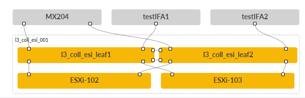

# Solution Overview — Collapsed Data Center Fabric

> **JVD-DCFABRIC-COLLAPSED-01-02** · Juniper Validated Design · small-DC collapsed-spine fabric
> Source: *JVD Solution Overview: Collapsed Data Center Fabric with Juniper Apstra* (juniper.net).
> Companion docs: [design-guide.md](design-guide.md) · [test-report-brief.md](test-report-brief.md) · [datasheet.md](datasheet.md)

## Executive summary

Data center operators must deliver and maintain network infrastructures across a range of scales. Small data center networks in particular are often bespoke designs optimized for cost efficiency, which introduces a unique troubleshooting burden on networking teams. The **Collapsed Data Center Fabric with Juniper Apstra** is a Juniper Validated Design (JVD) that provides organizations with a widely deployed small data center network that is reliable, cost-effective, and reuses the skills networking teams have built with larger-scale Juniper data center JVDs.

## Solution overview

The Collapsed Data Center Fabric is Juniper's best-practice architecture for **small networks** — a modern collapsed fabric (also known as collapsed spine) with EVPN-VXLAN. The JVD consists of only **two switches** that perform the roles of spine, leaf, and border leaf simultaneously; there are **five switch platforms** to choose from depending on need.

*Figure 1. Collapsed Data Center Fabric — two collapsed-spine leaves peering directly over EVPN-VXLAN, with an external gateway and multihomed hosts.*

This JVD is particularly well suited to **edge deployments, remote office / branch office (ROBO), test labs, and single-rack fabrics**, and makes a great starter network for teams discovering the benefits of Juniper Apstra. It uses an **ERB-based** architecture with spine, leaf, and border-leaf roles collapsed into a two-switch, high-availability configuration.

## Benefits

- **Repeatability** — prescriptive designs where all JVD customers benefit from lessons learned in worldwide deployments.
- **Reliability** — integrated best-practice designs tested with real-world traffic and described with measured results.
- **Velocity** — streamlined deployment with step-by-step guidance, automation, and prebuilt integrations.
- **Cost efficiency** — small-footprint, high-availability fabric for scenarios where a full 3-stage fabric is too much network for the job.

## Solution components

**Supported switch platforms** (choose one for the collapsed-spine role):

- QFX5130-32CD
- QFX5120-48Y
- QFX5700
- ACX7100-48L
- PTX10001-36MR

The Collapsed Data Center Fabric is a two-switch fabric that can provide up to **30 high-availability ports of 400GbE** while retaining expected functionality.

| Component | Software / version |
|-----------|--------------------|
| Juniper Apstra | 4.2.1 |
| Junos OS | 23.4R2-S3 |

## About Juniper Validated Designs

JVDs represent a cross-functional collaboration between Juniper's top subject matter experts, including product teams, solutions architects, support, development, and testing. Juniper data center JVDs are customer-driven — network designs in frequent use are identified, undergo use-case and best-practice analysis, and are fully characterized in the Juniper JVD test labs.

## Sources

- *JVD Solution Overview: Collapsed Data Center Fabric with Juniper Apstra* — JVD-DCFABRIC-COLLAPSED-01-02 (juniper.net Validated Designs).
- Companion: [design-guide.md](design-guide.md), [test-report-brief.md](test-report-brief.md), [datasheet.md](datasheet.md).
