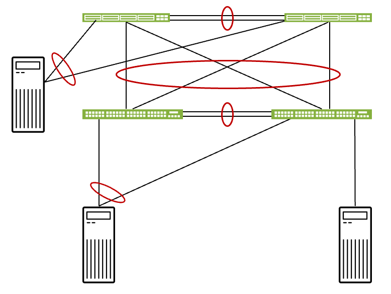
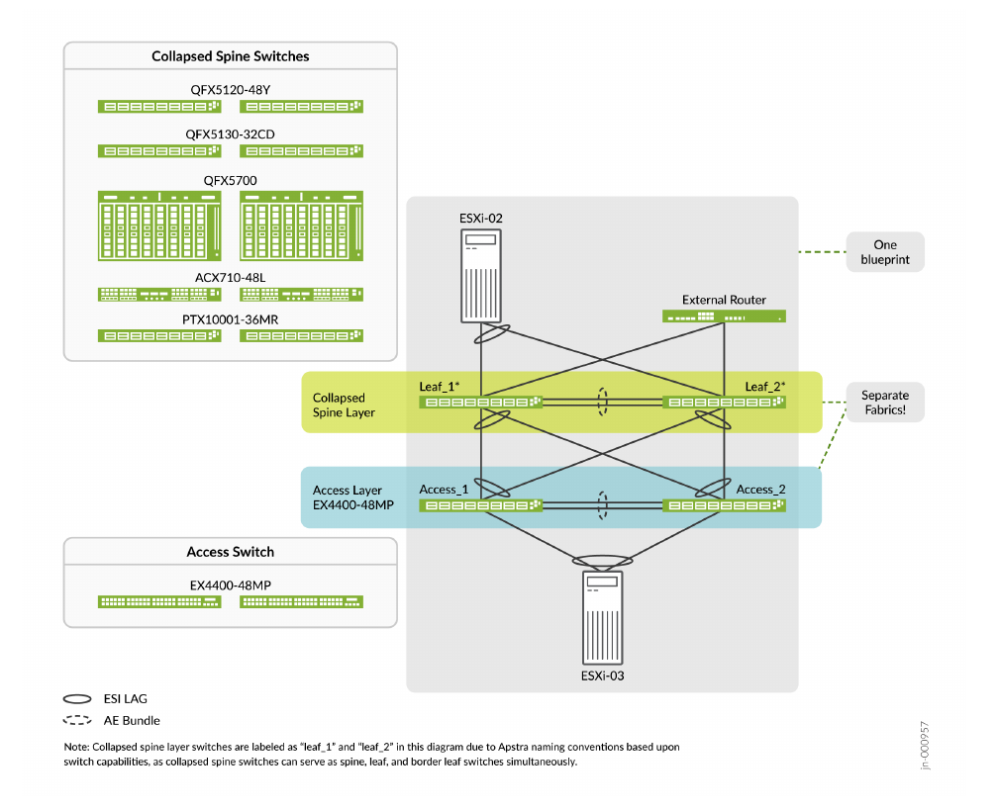

>
> Faithful markdown conversion of the published PDF:
> [Collapsed Data Center Fabric with Juniper Apstra and Access Switches — Juniper Validated Design Extension (JVDE)](https://www.juniper.net/documentation/us/en/software/jvd/collapsed-dc-fabric-apstra-access/index.html).
> The PDF on juniper.net is the source of truth. The Configuration Walkthrough is
> reproduced here as text (steps, NOTES, and CLI verification); the Apstra UI
> screenshots are referred out to the published PDF by figure number and caption.
> The resulting device configurations are in
> [`../configuration/conf/`](../configuration/conf/).

# Collapsed Data Center Fabric with Juniper Apstra and Access Switches — Juniper Validated Design Extension (JVDE)

Juniper Networks Validated Designs provide you with a comprehensive, end-to-end
blueprint for deploying Juniper solutions in your network. These designs are
created by Juniper's expert engineers and tested to ensure they meet your
requirements. Using a validated design, you can reduce the risk of costly
mistakes, save time and money, and ensure that your network is optimized for
maximum performance.

## About this Document

This document provides an overview of steps to provision the Collapsed Fabric
with Access Switches and Juniper Apstra JVDE. The Collapsed Fabric with Access
Switches and Juniper Apstra JVDE extends the functionality in the base Collapsed
Fabric with Access Switches JVD by providing the same network topology with an
additional layer of access switches. You would use this JVDE when you want to use
the collapsed fabric topology from the base JVD but need more access switch
interfaces in your network.

This JVDE provides a network topology that consists of two switches in a
collapsed spine architecture, with two additional switches attached to this
collapsed spine as access layer switches. The device models validated in the
topology are provided further in the document.

This document is intended for an audience familiar with the Junos OS, QFX and EX
Series switches, and Juniper Apstra. To explore other Juniper data center JVDs
and JVDEs, see Juniper Data Center Validated Designs.

## Solution Benefits

Juniper Validated Designs (JVDs) are network building blocks that help you
successfully architect, deploy, manage, and integrate data center technologies
according to best practices. Adopting validated designs allows you to address
technical debt by deploying well-characterized architectures that simplify
support.

Juniper Validated Design Extensions (JVDEs) build upon JVDs to extend them with
additional functionality. For this JVDE, the additional functionality is the
addition of an access switch layer to provide port expansion. This JVDE includes
information required to configure both the original collapsed fabric JVD and the
access switch functionality introduced in this JVDE.

The Collapsed Data Center Fabric with Juniper Astra JVD, upon which this JVDE is
based, is designed for scenarios where a 3-stage data center network would be an
unreasonably large investment. For information on the 3-stage data center network
JVD, see the 3-Stage EVPN/VXLAN Fabric with Juniper Apstra JVD.

Collapsed fabric use cases include:

- Remote sites and branch office data center networks
- Extend current L2 domains to remote sites through EVPN
- Single-rack pods within a larger data center
- Deployments where low budget, space, or power constraints are a primary
  consideration
- Small data center networks needing high availability

### Juniper Validated Design Benefits

JVDs are a prescriptive blueprint for building a data center fabric with
well-documented capabilities and appropriate product selection. JVDs must pass
rigorous testing with real-world workloads to achieve validation, verifying that
all products in the Building Blocks JVD work together as expected and mitigating
the risk faced while deploying a network.

The core benefits of JVDs are:

- **Repeatability** — Unlock value with repeatable network designs. Because JVDs
  are prescriptive designs used by multiple customers all JVD customers benefit
  from lessons learned through both lab testing and real world deployments.
- **Reliability** — Layered testing with real traffic. JVDs are quantified and
  integrated best practice designs, based on carefully chosen hardware platforms
  and software versions, and tested with real world traffic.
- **Accelerated Deployment** — Ease installation with step-by-step guidance.
  Simplify deployment with guidance, automation, and prebuilt integrations.
- **Accelerated Decision-Making** — Leave behind costly bespoke networks. Bridge
  business and technology in designs that meet the needs of most customers and
  consider how features behave and operate in real-world applications and
  conditions.
- **Best Practice Networks** — Better outcomes for a better experience. JVDs have
  known characteristics and performance profiles to help you make informed
  decisions about your network.

### Juniper Apstra

Apstra is a multi-vendor, intent-based network fabric management solution that
provides closed-loop automation, advanced telemetry and analytics, and network
assurance all in a single pane of glass management interface. Apstra translates
business intent and technical objectives to essential policy and device-specific
configuration. Apstra continuously self-validates and resolves issues to assure
compliance.

The core benefits of Apstra:

- **Intent-based networking** — Automates configuration generation and
  continuously validates operating state versus intent.
- **Network Automation** — Apstra is a multi-vendor network automation platform
  that is continuously updated to work with the latest hardware and exhaustively
  tested using modern DevOps practices.
- **Recoverability** — Built-in rollback capability restores known-working
  configuration in a fraction of the time.
- **Day 2+ Management** — Apstra has rich analytics capabilities that reduce Mean
  Time to Resolution (MTTR).
- **Management Simplicity** — Apstra simplifies network management. You can, for
  example, unify multiple data centers while isolating failure domains for high
  availability and resilience by reducing the complexity of Data Center
  Interconnection (DCI) connections using Apstra.

## Use Case and Reference Architecture

The Collapsed Fabric with Access Switches and Juniper Apstra JVDE topology is
ERB-based and created using Juniper Apstra.


*Figure 1: The Collapsed Fabric with Access Switches and Juniper Apstra JVD Topology.*

This Collapsed Fabric with Access Switches and Juniper Apstra JVDE is the
Collapsed Data Center Fabric with Juniper Astra JVD with the addition of an
access switch layer. The Collapsed Data Center Fabric with Juniper Astra JVD is a
two-switch network fabric designed for small network deployments. Switches in a
collapsed fabric perform the roles of spine, leaf, and border leaf switches. This
topology allows for high availability network deployments with a minimum of
switch hardware; however, resource constraints limit the real-world expandability
of this design. The addition of access switches provides the ability to add
additional ports, especially 1 gigabit ethernet ports.

For the purposes of this JVDE, only the EX4400-48MP switch platform was tested
and validated for use as an access switch. While it is technically possible to
use any number of different switch platforms in an access switch role, the choice
of restricting validation to the EX4400-48MP is deliberate. The EX4400-48MP is a
budget-conscious choice for adding 1 gigabit ethernet ports. For customers
seeking to add additional 10 gigabit or larger ports, Juniper Networks recommends
using a collapsed fabric with switches that have a higher port count or using a
3-stage design such as 3-Stage Data Center Design with Juniper Apstra JVD instead.

Switches ranging from the QFX5120-48Y to the QFX 5700 are validated for use in
the collapsed spine layer within the collapsed fabric data center JVDs. These
switches provide connectivity options ranging from 1 gigabit SFP ports all the
way to 400 gigabit QSFP56-DD ports.

This JVDE expands the topology in the Collapsed Data Center Fabric with Juniper
Astra JVD by providing an access switch layer that allows you to add a modest
number of 1 gigabit or 2.5 gigabit ports to your topology. Juniper recommends the
3-Stage Data Center Design with Juniper Apstra JVD for customers that require more
10 gigabit or higher-speed ports than can be provided by this validated collapsed
fabric design. The 3-Stage Data Center Design with Juniper Apstra JVD is
validated to handle the higher resource demands that come with an expanded number
of high-throughput ports.

The Collapsed Fabric with Access Switches and Juniper Apstra JVDE uses EVPN for
the control plane, VXLAN for the data plane, and eBGP for both underlay and
overlay signaling. This means leaf switches can discover all the "remote" hosts
without flooding the overlay with ARP/ND requests. Because the switches in the
Collapsed Fabric with Access Switches and Juniper Apstra JVDE serve all fabric
roles, including the border leaf role, the collapsed fabric switches are tested to
serve as anycast gateways as well as gateways to external networks. These anycast
and external network gateways require Data Center Interconnect (DCI) features.

This JVDE demonstrates the addition of one high-availability pair of switches in
the access switch role, although multiple pairs of access switches can be
connected to the collapsed fabric. Each pair of access switches operates as an
independent layer 2 EVPN-VXLAN collapsed fabric connected to the Layer 3
EVPN-VXLAN collapsed fabric using an Ethernet Segment Identifier Link Aggregation
Group (ESI LAG). For more details on how Juniper Apstra handles access switches,
see the Access Switch section of the Juniper Apstra User Guide.

In this design two generic systems are created to represent servers. Another
generic system is created to represent an external router which is outside of the
collapsed fabric. Neither the servers nor the router are directly managed by
Apstra. Apstra, however, has to be aware of the servers and the router to assign
the right virtual networks, routing groups, and other related configuration to
the appropriate switch interfaces. This design connects one generic server to the
collapsed fabric layer and another generic server to the access switch layer.
These server connections to switches in multiple layers connections are
configured intentionally to demonstrate that devices can be connected to either
layer as needed.

In the Apstra collapsed fabric design used in this JVDE, the collapsed spine
switches operate with a layer 3 VXLAN while access switches operate with a layer 2
VXLAN. As a result, the collapsed spine switches have IRB interfaces while the
access switches do not have IRB interfaces. Therefore, all inter-VLAN routing
happens at the collapsed spine layer and no inter-VLAN routing happens at the
access switch layer. Individual access switch ports can be configured in either
trunk or access mode, allowing devices connected to the access switches to
connect to different VLANs; however, routing between those VLANs will always
happen on the collapsed spine switches and not on the access switches.

### Prerequisites

This JVD assumes that the Apstra server virtual machine (VM) and Apstra ZTP
server VM are already deployed with the appropriate version, and you know how to
access the console of these VMs. To implement the topology provided in this JVDE,
the virtual network of both VMs must be on the same subnet as the physical
management network interface of the switches. For additional information on
deploying the Apstra server and ZTP VMs, see the Juniper Apstra Installation and
Upgrade Guide.

This JVD assumes that you have a basic knowledge of Apstra terminology and
processes and that you are familiar with provisioning a data center reference
architecture with a blueprint. For more information on Juniper Apstra, see the
Juniper Apstra User Guide on the Juniper Apstra Techlibrary homepage.

### Juniper Hardware and Software Components

For this JVDE, the Juniper products and software versions are listed below. The
listed architecture is the recommended base representation for the validated
design. As part of a complete solutions suite, we routinely swap hardware devices
with other models during iterative use case testing. Each platform also goes
through the same tests for each specified version of Junos OS.

To verify the platforms and software versions validated by Juniper Networks for
this JVD, see the Validated Platforms and Software section in this document.

### Juniper Hardware Components

The following switches are tested and validated to work with this Collapsed
Fabric with Access Switches and Juniper Apstra JVDE, and are the same ones
included in its parent JVD.

Collapsed Spine role:

- QFX5130-32CD
- QFX5120-48Y
- QFX5700
- ACX7100-48L
- PTX10001-36MR

Access Switch Role:

- EX4400-48MP

For the purposes of this document, the following switches are used in the
configuration walkthrough:

#### Table 1: Juniper Hardware

| Platform | Role | Hostname | Junos OS Release |
|----------|------|----------|------------------|
| QFX5120-48Y | Collapsed Spine | DC3-LEAF-1 and DC3-LEAF-2 | 22.2R3-S2 |
| EX4400-48MP | Access Switch | DC3-ACCESS-1-1 and DC3-ACCESS-1-2 | 22.2R3-S2 |

#### Table 2: Juniper Software

| Product | Role |
|---------|------|
| QFX5120-48Y | Collapsed Spine |
| EX4400-48MP | Access Switch |

### Juniper Apstra Overview

Juniper Apstra is a multivendor, intent-based network software (IBNS) solution
that orchestrates data center deployments and manages small to large-scale data
centers through Day-0 to Day-2 operations. It is an ideal tool for building data
centers for AI clusters, providing invaluable Day-2 insights through monitoring
and telemetry services.

Provisioning a data center fabric through Juniper Apstra is a modular function
that leverages various building blocks to instantiate a fabric. These basic
building blocks are as follows:

- A **logical device** is a logical representation of a switch's port density,
  speed, and possible breakout combinations. Since this is a logical
  representation, any hardware specifics are abstracted.
- **Device profiles** provide hardware specifications of a switch that describe
  the hardware (such as CPU, RAM, type of ASIC, and so on) and port organization.
  Juniper Apstra has several pre-defined device profiles that exist for common
  data center switches from different vendors.
- **Interface maps** bind together a logical device and a device profile,
  generating a port schema that is applied to the specific hardware and network
  operating system, which is represented by the device profile. By default,
  Juniper Apstra provides several pre-defined interface maps with the ability to
  create user-defined interface maps as needed.
- **Rack types** define logical racks in Juniper Apstra, the same way a physical
  rack in a data center is constructed. However, in Juniper Apstra, this is an
  abstracted view of it, with links to logical devices that are used as leaf
  switches, the kind and number of systems connected to each leaf, any redundancy
  requirements (such as MLAG or ESI LAG), and how many links, per spine, for each
  leaf.
- **Templates** take one or more rack types as inputs and define the overall
  schema/design of the fabric. You can choose between a 3-stage Clos fabric, a
  5-stage Clos fabric, or a collapsed spine design. You can also choose to build
  an IP fabric (with static VXLAN endpoints, if needed) or a BGP EVPN-based fabric
  (with BGP EVPN as the control plane).
- The **blueprint** instantiates the fabric, taking a template as its only input.
  A blueprint requires additional user input to bring the fabric to life,
  including resources such as IP pools, ASN pools, and interface maps. Additional
  virtual configuration is done, such as defining new virtual networks
  (VLANs/VNIs), building new VRFs, defining connectivity to systems such as hosts
  or WAN devices, and so on.

## Configuration Walkthrough

> **NOTE:** This walkthrough is a step-by-step Apstra provisioning procedure. The
> published PDF illustrates each step with an Apstra UI screenshot (Figures 2–108).
> Those screenshots are not reproduced here; each is referred to inline by its
> figure number and caption so you can locate it in the
> [published PDF](https://www.juniper.net/documentation/us/en/software/jvd/collapsed-dc-fabric-apstra-access/index.html).
> All step text, NOTES, and command-line verification output are reproduced in full.

This walkthrough provides the steps required to configure the Collapsed Fabric with Access Switches
and Juniper Apstra JVDE. For more detailed step-by-step configuration information for any procedure,
see the Juniper Apstra User Guide. This walkthrough includes notes that provide the configuration steps
as well as additional configuration guidance.

This walkthrough details the configuration of the baseline design, as used during validation in the
Juniper data center validation test lab. The baseline design consists of two QFX5120-48Y switches in
the collapsed spine role, and two EX4400-48MP switches in the access switch role. The goal of this
JVDE is to provide options so that the baseline switch platform can be replaced with any validated
switch platform for that role, as described in the " Juniper Hardware Components " on page 7section. To
provide this JVDE configuration while keeping this walkthrough a manageable length, only the baseline
design platform is used during this configuration walkthrough.

Throughout this guide you will note that several objects within Apstra are prepended with “DC3”. This
nomenclature is simply an artefact of our test environment. There is no requirement for you to use
identical nomenclature in your deployment. Juniper Apstra can manage multiple networks from a single
instance by using multiple blueprints. The network design references in this document simply happen to
be the third in the set of network designs we maintain for regular testing.


### Apstra: Configure Apstra Server and Add Switches

This document does not cover the installation of Juniper Apstra. For more information about Juniper
Apstra installation, see the Juniper Apstra Installation and Upgrade Guide or the Installing Juniper Apstra
Quick Start Guide .

The first step for installing Juniper Apstra is to configure the Apstra Server VM. After setting up this VM
and establishing a connection to it, a configuration wizard launches. You configure the Apstra server
password, the Apstra UI password, and other network configuration parameters using this wizard.


### Apstra: Management of Junos OS Device

There are two methods of adding Juniper devices into Apstra:

To add devices manually (recommended):

- In the Apstra UI, navigate to Devices > Agents > Create Offbox Agents. This requires the devices to
be configured with a minimum of the root password and management IP.

To add devices through ZTP:

- To add devices from the Apstra ZTP server or for more information on adding devices to Apstra using
ZTP, see the Apstra ZTP section of the Juniper Apstra User Guide .

For the purposes of this JVDE setup, a root password and management IPs were already configured on
all switches prior to adding the devices to Apstra. To add switches to Apstra, first log on to Apstra Web
UI, choose a method of device addition as described above, and provide the appropriate username and
password that you have preconfigured for those devices when you initially unboxed them and set them
up.


> **NOTE:** Apstra pulls the configuration from Juniper devices called pristine config. The Junos OS configuration ‘groups’ stanza is ignored when importing the pristine configuration, and Apstra will not validate any group configuration listed in the inheritance model, see Use Configuration Groups to Quickly Configure Devices . However, it’s best practice to avoid setting loopbacks, interfaces (except management interface), routing-instances (except management-instance). Apstra will set the protocols LLDP and RSTP when device is successfully Acknowledged.


### Create Agent Profile

For the purposes of this JVDE, the root user and password are the same across all devices; hence, an
agent profile is created, as shown below. Note that this password is obscured, which keeps it secure.

1. Navigate to Devices > Agent Profiles.

2. Click Create Agent Profile.

3. Create an agent profile named root with the platform set to Junos.

4. Add the username and password used to log into your switches.


*Figure 2: Create Agent Profile in Apstra*


### Create Offbox Agent

For switches that do not support the provisioning of an Apstra management agent onto the switches
themselves, offbox agents are required to manage those switches. An IP address range can be provided
to bulk-add devices into Apstra. This will create the requisite offbox agents to manage those devices.

1. Navigate to Devices > Managed Devices.

2. Click on Create Offbox Agents.


*Figure 3: Devices Menu, with Managed Devices Highlighted*

3. Add the management addresses of the switches, separated by a comma, in the Create Offbox Agents
pop-up. You might enter an IP range instead if you prefer.

4. Select Junos as the platform and full control as the operation mode.


*Figure 4: Create Offbox Agents Pop-up with the Platform Option Selecting Junos*

5. Select the agent profile root created in the previous step.


*Figure 5: Create Offbox Agents Pop-up with the Agent Profile Option Selecting Root*

6. Press Create and wait for the systems to populate in the Managed Devices table.


*Figure 6: Managed Devices Table Showing the Entries Created After Cicking Create in the Previous Step*


### Add Pristine Config

Pristine configurations are collected from devices during provisioning in order to have a baseline
configuration of the device. This is useful in order to have something to compare the Apstra-generated
configuration against. Click on each of the newly created systems in the Devices > Managed Devices
table, and then add a pristine configuration by either collecting it from the device or by pushing it from
Apstra.

The configuration applied as part of the pristine configuration should be the base configuration or
minimal configuration required to reach the devices with the addition of any users, static routes to the
management switch, and possible other essential connectivity configuration. The pristine config creates
a backup of the base configuration in Apstra and allows devices to be reverted to the pristine
configuration when issues are experienced.


*Figure 7: Add Pristine Config*


> **NOTE:** If the pristine configuration is updated using Apstra as shown in the above figure, then run Revert to Pristine.


### Upgrade Junos OS

If your switches are not running the operating system release recommended by this JVD, you should
upgrade them to the recommended version. For this JVDE, the recommended Junos OS version is
22.2R3-S3.


> **NOTE:** Important: A maintenance window is required to perform any device upgrade, as upgrades can be disruptive.Best practice recommendations for upgrade:

- Upgrade devices using the Junos OS CLI as outlined in the Junos OS Software Installation and
Upgrade Guide , along with the Junos OS version release notes, as Apstra currently only
performs basic upgrade checks. However, this JVD summarizes the steps to upgrade if Apstra
is intended to be used for upgrades.

- If a device is added to the blueprint, set it to undeploy, unassign its serial number from the
blueprint, and commit the changes, which reverts it back to Pristine Config. Then, proceed to
upgrade. Once the upgrade is complete, add the device back to the blueprint.

Apstra allows device upgrades. However, our current best practice recommendation is to upgrade
devices using the Junos OS CLI as outlined in the Junos OS Software Installation and Upgrade Guide or
in the Junos OS release notes. We recommend upgrading Junos OS outside Juniper Apstra because the
Juniper Apstra upgrade process only performs basic upgrade checks.

If you want to upgrade the device within Apstra, here is how you do it:


*Figure 8: Upgrade Device from Apstra*

First, you need to register an image with Apstra so that it can deploy that image to devices. To register a
Junos OS image on Apstra, either provide a link to the corporate repository where all OS images are
stored or upload the OS image as shown below.

In the Apstra UI, navigate to Devices > OS Images and click Register OS Image.


*Figure 9: Upload OS Image*


*Figure 10: Register OS Image by Uploading or Provide Image URL*


### Acknowledge Devices

1. Navigate to Devices > Managed Devices.

2. Check Discovered Devices and Acknowledge the Devices.

3. Click the checkbox interface to select all the devices once the offbox agent is added and the device
information is collected.

4. Click Acknowledge.
The switch is now under the management of Juniper Apstra.


*Figure 11: Managed Devices Table Control Panel with the Acknowledge Selected Systems Highlighted*

5. Once a switch is acknowledged, the status icon under the Acknowledged? table header changes from
a red “no entry” symbol to a green checkmark. Verify this change for all switches. If there are no
changes, repeat the procedure to acknowledge the switches again.


*Figure 12: Managed Devices Table Showing the Switches Successfully Under Apstra Management*


> **NOTE:** After a device is managed by Apstra, all device configuration changes should be performed using Apstra. Do not perform configuration changes on devices outside of Apstra, as Apstra might revert those changes.Note: The device profiles covered in this JVD document are not modular chassis-based. For modular chassis-based devices such as QFX5700 the linecard profiles, chassis profile are available in Apstra and linked to the device profile. These cannot be edited; however, they can be cloned, and custom profiles can be created for linecard, chassis and device profile as shown below in Figure 14 on page 20 and Figure 15 on page 21.

Once the devices are successfully acknowledged, perform the collect pristine config step detailed above
to ensure the LLDP and RSTP protocol configurations are added to the pristine switch configurations.


### Fabric Provisioning

Fabric provisioning in Juniper Apstra involves the creation of a number of logical abstractions which
represent the desired network fabric configuration to the software. Once the logical fabric is created,
Apstra then provisions the switches with the desired configuration to the devices added to the software
in the preceding portion of this walkthrough. The major concepts of fabric provisioning are outlined in
the "Juniper Apstra Overview" on page 8 section earlier in this document. You are expected to be
familiar with these Apstra concepts to complete this walkthrough.


### Identify and Create Logical Devices, Interface Maps with Device Profiles

The following steps define the Collapsed Fabric with Access Switches and Juniper Apstra JVDE baseline
architecture and devices.

Before provisioning a blueprint, a replica of the topology is created. We define the data center reference
architecture and devices in the following steps.

This setup process involves selecting logical devices for both the collapsed spine and the access
switches. Generic devices are also created to represent two servers and a router. One server is
connected to the collapsed spine layer and the other server is connected to the access switch layer. The
servers connected to multiple switch layers is done intentionally in this topology to demonstrate that
devices can be connected to each switch layer based upon need.

Logical devices are abstractions of physical devices that specify common device form factors such as the
amount, speed, and roles of ports. Vendor-specific device information is not included in the logical
device definitions, which permits building the network definition before selecting vendors and hardware
device models.

- The Apstra software installation includes many predefined logical devices that can be used to create
any variation of a logical device. After initial creation, logical devices are then mapped to device
profiles using interface maps. The ports mapped to the interface maps match the device profile and
physical connections. In the final configuration step, the racks and templates are defined using the
configured logical devices and device profiles. These logical devices and device profiles are then used
to create a blueprint.

The Device Configuration Lifecycle section of the Juniper Apstra User Guide explains the device
lifecycle, which must be understood when working with Apstra blueprints and devices.


### Create Device Profile

For all devices covered in this document, the device profiles (defined in Apstra and found under Devices
> Device Profiles) were exactly matched by Apstra when adding devices into Apstra, as covered in
"Apstra: Management of Junos OS Device" on page 11 .

During the validation of supported devices, some device profiles had to be custom-made to suit the
linecard setup on the device. For example, the setup of the EX4400-48MP includes the setup of
multiple “panels” within a given switch, representing the configuration of different port groups for that
device. This panel creation process is similar to how line cards are setup for a device. For more
information on device profiles, see Apstra User Guide for Device Profiles .

To create the device profiles:

1.   Navigate to Devices > Device Profiles. Review the devices listed based on the number and speed of
ports.

2.   Select the device that most closely resembles the switch for which you want to create a device
profile.


*Figure 13: Devices Menu with the Device Profiles Button Highlighted*

3.   Press the Clone button once you are confident that the device profile you selected most closely
resembles your switch. Do this first for the switch model you have selected for use in the collapsed
spine role. For the purposes of this document, this is the QFX5120-48Y.


*Figure 14: Device Profile Page for the QFX5120-48Y with the Clone Button Pointed Out*


> **NOTE:** Default logical devices, and devices which have already been added to the system, cannot be changed.

4.   Name the cloned profile that you will use for this blueprint.


*Figure 15: Clone Device Profile Pop-Up*

5.   Click Ports to verify that the port selection matches your device. Apstra 4.1.2 comes preloaded
with a device profile for the 5120-48Y that is an appropriate device profile setup starting point in
most implementations of this topology. This device profile has 48 1/10/25 gigabit ports, and 8x
100 gigabit ports all in a single panel. How to modify or add a panel will be reviewed below when
detailing the EX4400-48MP configuration.


> **NOTE:** It may be advisable for your switch to be broken out into multiple panels based on functionality, location, or whether or not they are part of a line card. In this case, add and populate panels as appropriate. For this document all ports for the QFX5120-48Y will be added to a single panel, as they are both physically contiguous, and no ports support PoE.


*Figure 16: Clone Device Profile Pop-up showing the port map for the 5120-48Y*

6.   Once you are satisfied that the logical device accurately reflects the physical device you have
chosen, press Clone.

7.   Repeat the cloning process for the access switches, which should be based off of the device profile
for the EX4400-48MP switch.


*Figure 17: Device Profile Page for the EX4400-48MP with the clone button showing on the right*


*Figure 18: Clone Device Profile Popup*

8.   For the purposes of this document, we are going to assume the EX4400-48MP has the optional 4x
10 gigabit line card installed. Apstra comes preloaded with an EX4400-48MP device profile,
however, this device profile does not include the 4x 10 gigabit card configured in the device profile.
We will thus be adding a panel to our clone of the default config, showing how panels can be
configured and set up.

The default EX4400-48MP has 12x100M/1/2.5/5/10 gigabit ports, 36x100M/1/2.5 gigabit PoE
ports, and 2x100 gigabit ports, each configured in 3 different panels. The reason these ports are
separated into different panels by default is that the 10 gigabit ports do not support PoE and the
100 gigabit ports are in a different physical location on the switch. We will be configuring an
additional panel to represent the 4x10 gigabit card.

To add this panel click on the Ports tab under Summary, scroll to the bottom of the interaction
window and click Add Panel.


> **NOTE:** The recommended configuration for the EX4400-48MP in the role of access switch is to use a 10 gigabit ports to provide connectivity between the two access switches, and to use the 100 gigabit uplink ports on the back of the switches to provide connectivity to the collapsed spine layer.

9.   Modify the port layout by clicking on the right-angle icon on the lower right corner of the port map.
Drag the icon until the interface map represents the number of ports on your switch.


*Figure 19: An additional panel, shoing the port map with the right-andle icon used to modify the port count*

10. Since we are adding a panel representing the 4x 10 Gigabit add-in card, drag the right-angle icon
until the panel shows 4 ports.


*Figure 20: An additional panel, modified to have 4 ports*

11. Select one port by clicking on it. Drag the icon until the appropriate number representing a single
group of ports with identical capabilities is selected. As you drag the icon the Clone Device Profile
popup will expand, allowing you to configure the port speed and interface type.


*Figure 21: Device Profile Page for the EX4400-48MP with the ports of the 4th panel selected for configuration*

12. Select SFP+ under Connector Type.

13. Click Add New Transformation.

14. Set Number of Interfaces to 4 and Speed to 10 Gbps.


*Figure 22: Device Profile Page showing the add new transformation option having been selected*

15. Click the Add Transformation button.


*Figure 23: Device Profile Page for the EX4400-48MP with the 4th panel added and configured*

16. Click Clone.


### Create Logical Devices

Logical devices must be created to provide Apstra with a software abstraction of the physical hardware
devices. Where device profiles describe the physical device’s capabilities (such as the physical
capabilities of a port), logical devices describe how those physical capabilities will actually be used (such
as the speed of devices connected to that port).

1.   Navigate to Design > Logical Devices. Select the Create Logical Device button in the upper-right
corner.


*Figure 24: Design Menu with the Logical Device Button Highlighted*

2.   Create and name the logical device for the QFX 5120-48Y. This document uses the name
JVD_QFX5120-48Y_48x10_8x100_CF_JVD_v1.


*Figure 25: The Create Logical Device popup*

3.   Expand the number of ports by clicking and dragging the right-angle icon on the bottom right of the
logical port panel.

4.   Enter 48 in the box labelled Number of ports, set Speed to 10 Gbps, and ensure that only Access
and Generic are selected among the Connected to options. These ports will be used to connect
devices directly to the collapsed spine.


*Figure 26: The Create Logical Device popup showing the panel expanded to 56 ports, with the first 48 ports selected and configured*

5.   Click Create Port Group. The interface will then switch to defining the second group of ports.

6.   For this second group of ports set Number of ports to 8, Speed to 100 Gbps, and select the
checkboxes Spine, Leaf, Peer, and Generic as Connected to options.

7.   Click Create Port Group.


*Figure 27: The Create Logical Device popup showing the second port group for the 5120-48Y*

8.   Click Create. You have now created a logical device that represents the 5120-48Y switch.

9.   Create a logical device for the EX4400-48MP switch. This document uses the name DC3-
EX4400-48MP-EM_36x1_12x10_4x10_2x100 for this logical device.


*Figure 28: The Create Logical Device popup showing the initial setup for the EX4400-48MP*

10. This logical device will have four panels. Configure the first panel with 36x 1 Gbps ports set for
Access, Peer, Unused, and Generic. Click Create Port Group.


*Figure 29: The Create Logical Device popup showing the first panel for the EX4400-48MP*

11. Click Add Panel. Configure the second panel with 12x 10Gbps ports set for Access, Peer, Unused,
and Generic.

Click Create Port Group.


*Figure 30: The Create Logical Device popup showing the first and second panels for the EX4400-48MP*

12. Click Add Panel, configure the third panel with 2x 100 Gbps ports set for Superspine, Spine, Leaf,
Access, Peer, Unused, and Generic.

Click Create Port Group.

13. Click add panel, configure the fourth panel with 4x 10 Gbps ports set for Access, Peer, Unused, and
Generic.

Click Create Port Group.


*Figure 31: The Create Logical Device popup showing the third and fourth panels for the EX4400-48MP*

14. Click Create.


### Create Interface Map

Interface maps bind logical devices to device profiles.

1. Navigate to Design > Logical Devices.

Select the Create Interface Map button in the upper-right corner.


*Figure 32: Design Menus with the Interface Maps Button Highlighted*

2. Name the interface map DC3-QFX-5120-48Y_48x10_8x100_CF_JVD_v1.

3. Select the logical device and the device profiles for the QFX-5120-48Y switch that were created in
the earlier procedures.


*Figure 33: Create Interface Map Pop-up Showing the Interface Map Preview*

4. Under the Device profile interfaces column, click Select Interfaces. Assign all 48x10 Gbps ports and
8x100 Gbps ports as appropriate by selecting one port and dragging it until you have selected all
ports of that type.


*Figure 34: Create Interface Map Pop-up Showing the Interface Map Preview for the QFX5120-48Y*

5. Click Create.

6. Create a new interface map for the EX4400-48MP switch. Name the interface map DC3-
EX4400-48MP-EM_36x1_12x10_4x10_2x100.

7. Assign interfaces to this interface map as shown in this figure:


*Figure 35: Create Interface Map Pop-up Showing the Interface Map Preview for the EX4400-MP*

8. Click Create.


### Create Rack Type

Rack types define logical racks in Juniper Apstra, which are an abstracted representation of physical
racks. Rack types define the links between logical devices.

1.    Navigate to Design > Rack Types.


*Figure 36: Design Menu with the Rack Types Button Highlighted*

2.    Select Create In Builder in the upper-right corner.


*Figure 37: The Rack Types Page with the Create in Builder Button Highlighted*

3.   Create a rack with the name dc3_2leaf_2acc and select L3 collapsed.


*Figure 38: Rack Type Creation in Builder with L3 Collapsed Highlighted*

4.   Scroll down in the pop-up box.

Set the following attributes under Leaf:

- **Name:** DC3-Leaf,

Leaf Logical Device: select the logical device created earlier for the QFX-5120-48Y

- **Redundancy Protocol:** ESI


> **NOTE:** Juniper Apstra refers to the collapsed spine layer as “leaf” switches. This underlies our nomenclature choices in this guide.


*Figure 39: Rack Type Creation in Builder with ESI Under Leafs Highlighted*

5.   Click Access Switches.


*Figure 40: Create Rack Type Pop-up Showing the Access Switches tab*

6.   Enter the following information:

- **Name:** DC3-Access

- **Access Switch Count:** 1

- **Logical Device:** select the logical device created earlier for the EX4400-48MP

- **Redundancy Protocol:** ESI


*Figure 41: Create Rack Type Pop-up showing the Access Switches tab with the first part filled out*

7.   Scroll down and enter the following information:

- **L3 Peer Links:** 2

- **Link speed:** 10Gbps

- **L3 Peer Port Channel ID Min:** 0, Max: 0


*Figure 42: Create Rack Type Pop-up showing additional configuration options on the Access Switches tab*

8.   Click Add a logical link. Add a logical link with the following information

- **Name:** uplink

- **Leaf:** DC3-Leaf

- **Attachment Type:** Dual-Homed

- **Physical Link count per individual switch:** 1

- **Link speed:** 100Gbps


*Figure 43: Create Rack Type Pop-up showing the Logical Link configuration options in the Access Switches tab*

9.   Under Generic Systems, click Add new generic system group. Name the generic system group
esxi-02 and select an appropriate logical device that represents your server.
In this document, we are choosing the AOS-4x10-1 as the logical device because the ESXi servers
in our data center JVD test lab have 4x 10 gigabit NIC ports. Creating generic systems connects the
leaf switches to the generic systems, such as servers in high availability mode.

The Generic System Group should end up with the following configuration:

- **Name:** esxi-02

- **Generic system count:** 1

- **Port Channel ID Min:** 0, Max: 0

- **Logical Device:** AOS-4x10-1


*Figure 44: Rack Type Creation in Builder with Generic Systems Selected*

10. While still under Generic Systems, click Add logical link to create a logical link.
This logical link will be dual-homed from esxi-02 to the DC3-LEAF switch layers switches. The
DC3-LEAF switch layer is the collapsed spine layer in our topology, not the access switches. This
configuration demonstrates the ability to connect servers directly to switches in the collapsed
fabric layer.

Create the Logical Link with the following parameters:

- **Name:** esxi-02_link1

- **Switch:** DC3-Leaf

- **Attachment Type:** Dual-Homed

- **LAG Mode:** LACP (Active)

- **Physical link count per individual switch:** 1

- **Link Speed:** 10 Gbps


*Figure 45: Create Rack Type Pop-up showing the Logical Link options under the Generic Systems tab*

11. Click Add new generic system group.


*Figure 46: The Add new generic system group button under the Generic Systems tab in the Create Rack Type Pop-up*

12. Create a Generic System Group with the following parameters:

- **Name:** esxi-03

- **Generic system count:** 1

- **Port Channel ID Min:** 0, Max: 0

- **Logical Device:** AOS-4x10-1


*Figure 47: Create Rack Type Pop-up showing the Logical Link configuration options in the Access Switches tab*

13. While still under Generic Systems, click Add logical link to create a logical link. This logical link will
be dual-homed from esxi-03 to the DC3-ACCESS switch layer, which is the access switches. This
topology demonstrates the ability to connect servers to the access switches. Please note that while
we are connecting this server to the access switches using a 10Gbps link, the EX4400 access
switches have a limited number of 10Gbps ports.These EX4400 access switches are recommended
to be used predominantly to attach 1Gbps devices to the collapsed fabric. The Logical Link should
end up with the following parameters: Name: esxi-03_link1

- **Switch:** DC3-Access

- **Attachment Type:** Dual-Homed

- **LAG Mode:** LACP (Active)

- **Physical link count per individual switch:** 1

- **Link Speed:** 10 Gbps


*Figure 48: Create Rack Type Pop-up showing the Logical Link options under the Generic Systems tab*

14. Click Create. You will know you have successfully created your rack when the topology preview
looks like the one in the image below:


*Figure 49: The Topology preview in the Create Rack Type pop-up*


### Create Templates

Templates combine one or more Rack Types to create a logical representation of the entire fabric. They
will be used to create a blueprint.

1. Navigate to Design > Templates. Select Create Template in the upper-right corner.


*Figure 50: The Design Menu with the Templates Button Highlighted*

2. Name the template JVD_CF_Access. Set Type to Collapsed and select MP-BGP-EVPN as the overlay
control protocol.


*Figure 51: Create Template Pop-up with the COLLAPSED type selected*

3. Select the Rack Type,dc3_2leaf_2acc, that was created earlier in this procedure. Set Mesh Links
- **Count:** 2 and Mesh Link Speed: 100 Gbps.


*Figure 52: Create Template Pop-up with Mesh Links Information Filled In*

Click Create.


### Create ASN POOL

Create a pool of ASNs for automatic assignation of ASNs later in the walkthrough.

1. Navigate to Resources > ASN Pools. Select Create ASN Pool in the upper-right corner.


*Figure 53: Resources Menu with the ASN Pools Button Highlighted*

2. Create an ASN pool with Name: JVD_CF_ASN1 for internal ASNs. This guide uses the
Range4200000000-4200000050 for this ASN Pool. These ASNs are from the block of 32-bit ASNs
reserved by IANA for private use.


*Figure 54: Create ASN Pool Pop-up Showing the Creation of the ASN Pool DC3*

3. Create a second ASN pool for the external ASN. Set Name: MX-External-ASN and a Range of
4200000051-4200000051 to define the single external ASN.


*Figure 55: Create ASN Pool Pop-up Showing the Creation of the ASN Pool MX-External-ASN*


### Create IP and Loopback Pool

Create IP pools for automatic assignation of IP addresses later in the walkthrough.

1. Navigate to Resources > ASN Pools and then select the Create IP Pool button in the upper-right
corner.


*Figure 56: Resources Menu with the ASN Pools Button Highlighted*

2. Create an IP Pool named MUST-FABRIC-Loopbacks DC3 with a subnet of 192.168.253.0/24.


*Figure 57: Create IP Pool Pop-up Showing the Creation of the MUST-FABRIC-Loopbacks DC3 IP Pool*

Click Create.

3. Create a second IP Pool named MUST-EVPN-Loopbacks DC3 with a subnet of 192.168.13.0/24.


*Figure 58: Create IP Pool Pop-up Showing the Creation of the MUST-EVPN-Loopbacks DC3 IP Pool*

Click Create.

4. Create a third IP Pool named MUST-FABRIC-Interface-IPs DC3 with a subnet of 10.0.3.0/24.


*Figure 59: Create IP Pool Pop-up Showing the Creation of the MUST-FABRIC-Interface-IPs DC3 IP Pool*

Click Create.

5. Create a fourth IP Pool named MUST-Blue-IPs DC3 with a subnet of 10.0.132.0/24.


*Figure 60: Create IP Pool Pop-up Showing the Creation of the MUST-Blue-IPs DC3 IP Pool*

Click Create.

6. Create a fifth IP Pool named MUST-Red-IPs DC3 with a subnet of 10.0.135.0/24.


*Figure 61: Create IP Pool Pop-up Showing the Creation of the MUST-Red-IPs DC3 IP Pool*

Click Create.


### Create VNI Pool

Create a pool of VNIs for automatic assignation of VNIs later in the walkthrough.

1. Navigate to Resources > VNI Pools. Select the Create VNI Pool button in the upper-right corner.


*Figure 62: VNI Pools button under the Resources menu*

2. Create a VNI Pool named CF_WA_JVD_VNI_POOL with a range of 30002-39999.


*Figure 63: Create VNI Pool Pop-up Showing the Creation of the CF_WA_JVD_VNI_POOL VNI Pool*

Click Create.


### Create Blueprint

Once configured and deployed, this blueprint will be the primary means of interacting with the fabric for
administrative purposes.

1. Navigate to Blueprints. Select the Create Blueprint button in the upper-right corner.


*Figure 64: Blueprints Button on the Main Menu Highlighted*

2. Name the Blueprint JVD_CF_Access_DC3.

3. Select Datacenter for the Reference Design.

4. Filter Templates, select COLLAPSED.

5. Select the JVD_CF_Access template that was created earlier in this JVDE and choose IPv4 for the
links.


*Figure 65: Create Blueprint Pop-up with Inputs Populated for this JVD*

6. Scroll down in the Create Blueprint pop-up and verify that the topology preview matches the one
seen during the Create Rack steps earlier in this document.


*Figure 66: Create Blueprint Pop-up Showing the Topology Preview*


### Configure Blueprint

Now that all the logical abstractions necessary to define the basic structure of your fabric have been
created, it is time to configure the blueprint with the details of your network environment.

1.    Navigate to Blueprints. Select the blueprint that was just created.

2.    Go to Staged > Topology. Click on the icon beside the words ASNs – Leafs in the panel on the right
side of the screen.

3.    Select the ASN, DC3, that was previously created for internal use.


*Figure 67: Staged Tab in the JVD_CF_Access_DC3 Blueprint Showing ASN - Leafs assignment options*

4.   Click the Save icon:


*Figure 68: Close up of the Save icon in the Staged Tab in the JVD_CF_Access_DC3 Blueprint*

5.   Click the icon beside ASNs – Access switches. Assign the DC3 ASN to the access switches.


*Figure 69: Staged Tab in the JVD_CF_Access_DC3 Blueprint Showing ASN – Access Switches assignment options*

6.   Click the icon beside Loopback IPs – Leafs. Assign the MUST-FABRIC-Loopbacks DC3 IP Pool.


*Figure 70: Staged Tab in the JVD_CF_Access_DC3 Blueprint Showing Loopback IPs – Leafs assignment options*

7.   Click the icon beside Loopback IPs – Access switches. Assign the MUST-FABRIC-Loopbacks DC3 IP
Pool.


*Figure 71: Staged Tab in the JVD_CF_Access_DC3 Blueprint Showing Loopback IPs – Access switches assignment options*

8.   Click the icon next to Links IPs – Leafs


*Figure 72: Staged Tab in the JVD_CF_Access_DC3 Blueprint Showing Links IPs – Leafs to Leafs assignment options*

9.   Click the icon next to Links IPs – Access L3 Peer Links. Assign the MUST-FABRIC-Interface-IPs-
DC3 IP Pool.


*Figure 73: Staged Tab in the JVD_CF_Access_DC3 Blueprint Showing Links IPs – Access L3 Peer Links assignment options*

10. Deploy the systems by assigning system IDs to the switches. Click the Device icon, which looks like
three stacked switches. Click the Edit icon under Assigned System IDs – Managed Nodes.


*Figure 74: Staged Tab in the JVD_CF_Access_DC3 Blueprint Showing System IDs – Managed Nodes assignment tab*


*Figure 75: Assign Systems Pop-up in the JVD_CF_Access_DC3 BluePrint*


### Create Routing Zones

Define the routing zones where the virtual networks will operate.

1. From within the JVD_CF_Access_DC3 blueprint, navigate to Staged > Virtual > Routing Zones. Select
Create Routing Zone in the upper-right corner of the main content frame.

2. Create four VRFs: Blue, External,Green, and Red. To create a routing zone, enter the VRF Name and
click Create. Repeat the process until all four routing zones are created.


*Figure 76: Create Routing Zone Pop-up in the JVD_CF_Access_DC3 Blueprint*

3. The Routing Zone table should include the four new routing zones and the default routing zone:


*Figure 77: Routing Zones table in the JVD_CF_Access_DC3 Blueprint*


### Create Virtual Networks

Define the virtual networks that will be a part of this fabric.

1. From within the JVD_CF_Access_DC3 blueprint, navigate to Staged > Virtual > Virtual Networks.
Select Create Virtual Networks in the upper-right corner of the main content frame.

2. Create Virtual Networks according to the parameters in the following table and figures. Do not click
Create until you have reached and read step 3 of this section.

VXLAN Options          Blue routing zone   External routing   Green routing zone   Red routing zone
zone

VRF Name               dc3_vn1_blue        dc3_vn1_external   dc3_vn1_green        dc3_vn1_red

VNI                    32001               33001              34001                35001

VLAN ID                3201                3301               3401                 3501

DHCP Service           Disabled            Disabled           Disabled             Disabled

IPv4 Connectivity      Enabled             Enabled            Enabled              Enabled

IPv4 Subnet            10.32.0.0/24        10.33.0.0/24       10.34.0.0/24         10.35.0.0/24

Virtual Gateway IPv4   Yes                 Yes                Yes                  Yes
Enabled

Virtual Gateway IPv4   10.32.0.1           10.33.0.1          10.34.0.1            10.35.0.1

Create Connectivity    Tagged              Tagged             Tagged               Tagged
Templates For


*Figure 78: Upper Part of the Create Virtual Network Pop-up*

3. Before you click Create to create the virtual networks, you must assign virtual networks to the
relevant switches. Scroll down in the open pop-up, assign to all switches, and then click Create.


*Figure 79: Lower Part of the Create Virtual Network Pop-up*

4. Repeat this process for each routing zone in the table. Verify the results in the Virtual Networks
table.


*Figure 80: The Virtual Networks table on the Virtual Networks tab*


### Assign Routing Group resources

Assign resources such as IPs and VNIs to the routing groups created above. Because we defined these
resources in the resource pools earlier in this procedure, we can simply add the relevant resource pools
and Apstra will automatically assign resources as needed.

1. From within the JVD_CF_Access_DC3 blueprint, navigate to Staged > Virtual > Routing Zones. Select
the Create Routing Zone button in the upper-right corner of the main content frame.

2. In the Resource Allocation configuration box on the right of the Routing Zones tab, click the icon
next to Leaf loopback IPs.


*Figure 81: Resource Allocation configuration box in the Routing Zones tab showing the Leaf Loopback IPs section open and unconfigured*

3. Click the Edit icon next to Leaf Loopback IPs to open the Update Pool Assignments pop-up box.

4. Select all Routing Zones by clicking the empty box in the upper left corner of the table. Click the
Assign Selected button.


*Figure 82: The Update Pool Assignments pop-up box showing all routing zones having been selected with the Assign Selected button moused over*

5. Verify that all Routing Zones have been assigned a Loopback IP Pool.


*Figure 83: The Update Pool Assignments pop-up box showing all routing zones having been assigned a Loopback IP Pool*

Click Update.

6. From within the Resource Allocation box, click the red box next to EVPN L3 VNIs. Select the Update
assignments button.


*Figure 84: The Update assignments button for EVPN L3 VNIs under Resource Groups highlighed*

7. Select the previously created CF_WA_JVD_VNI_POOL.

Click the Save icon.


*Figure 85: The Save icon highlighted for EVPN L3 VNIs under Resource Groups showing the CF_WA_JVD_VNI_POOL having been selected*

8. Verify that L3 VNIs have been assigned by examining the Routing Zones table. You should see the
automatically assigned Route Targets and VNIs.


*Figure 86: The Routing Zones table under the Routing Zones tab*


### Add External Router

You can add an external router to the fabric to configure network connectivity beyond the fabric itself.
For the purposes of this document, an MX204 router is used as the external router. All routers are
treated as generic systems by Apstra, making the specific router interchangeable. The router itself (and
its configuration) is not considered part of this JVDE.

1. From within the JVD_CF_Access_DC3 blueprint, navigate to Staged > Physical.

Click on DC3-Leaf-1 in the topology.

2. Click the checkbox on DC3-Leaf-1 and select Add internal/external generic system.


*Figure 87: DC3-Leaf-1 Pop-up Showing the ability to add an External Generic System*

3. Create an external system. Name it MX204 and select a logical device with 2x10 Gbps ports.


> **NOTE:** The 2x10 Gbps logical device does not accurately reflect the MX204, however, as an External Generic System the MX204 is not directly managed by Juniper Apstra. Apstra only needs to know how many of what kind of interface the fabric will be connecting to.


*Figure 88: First Part of the Assign Internal External Generic System pop-up*

Click Next.

4. Create links for the new system to both DC3-Leaf-1 and DC3-Leaf-2. You create these links by first
selecting an interface and then selecting a port speed from the list that becomes available when you
click the port.


*Figure 89: Second Part of the Assign Internal/External Generic System pop-up*

5. Click Add Link. Repeat this step for both switches.

6. Click Create in the bottom right corner once you’re done.


*Figure 90: Second Part of the Assign Internal/External Generic System*

7. When complete, you should see a new link on the graphic.


*Figure 91: DC3-Leaf-1 Neighbors map*


> **NOTE:** The MX204 referenced above is a stand-in for a generic router, and not considered a key component of this JVD. Similar steps can be taken to connect any router. The MX interface configuration is provided below in order to provide an example of how routing on a router is set up to interface with the network described in this JVD.


### Assign External Router Connectivity Templates

Connectivity Templates must be created to connect Virtual Networks to the newly-created router. We
created four routing zones earlier in the document, but we will only be assigning two Connectivity
Templates—one each for the Blue and Red Routing Zones—in this procedure. The Connectivity
Templates created for the external router will be used along with the Connectivity Templates created for
the corresponding Virtual Networks in the next section to connect the two Generic Systems, the ESXi
servers, to the topology.

1.    Navigate to Staged > Connectivity Templates.

2.    Click the Add Template button in the upper-right corner.

3.   Name the template MX204 Connections Blue VRF 501.


*Figure 92: Create Connectivity Template Pop-up in the JVD_CF_Access_DC3 Blueprint*

4.   Click on the Primitives tab. Select the primitives IP Link, BGP Peering (Generic System), and Routing
Policy. When you click the Primitives button, the primitives you need to select will appear as text
links in the box on the left of the popup, under the Primitives tab. You will have to scroll through
that section of the popup to find all three primitives to select. When you are done selecting all
three primitives, the result should look like the image below.


*Figure 93: Primitives Tab in the Create Connectivity Template Pop-up in the JVD_CF_Access_DC3 Blueprint*

5.   Click the Parameters tab on the left of the popup box and expand the IP Link section by clicking on
the text labelled IP Link.

6.   Choose the routing zone Blue.

7.   Set the interface type to Tagged and enter a VLAN ID of 501.

8.   Set the IPv4 Addressing Type to Numbered and the IPv6 Addressing Type to None.


*Figure 94: Expanded IP Link Section of the Parameters Tab*

9.   Expand BGP Peering (Generic System) by clicking on the labelled BGP Peering (Generic System).

10. Set the IPv4 AFI to ONand the IPv6 AFI to OFF.

11. Configure a TTL of 2. Do not enable BFD.

12. Set the IPv4 Addressing Type to Addressed and leave the IPv6 Addressing Type as None.

13. Leave the Local ASN Type set to unconfigured.

14. Set the Neighbor ASN Type to Static.

15. Set the Peer From option to Interface.

16. Set the Peer To option to Interface/IP Endpoint.


*Figure 95: Expanded IP Link Section of the Parameters Tab*

17. Expand and configure the Routing Policy section. Set the Routing Policy to Default_immutable.

18. Click Create.


*Figure 96: Expanded Routing Policy Section in the Parameters Tab*

19. Repeat the above steps to create a connectivity template for MX204 Connections Red VRF 502.
This connectivity template will connect to the Red routing group and use 502 as its VLAN ID.

20. The connectivity templates that were created need to be assigned to the DC3-Leaf-1 and DC3-
Leaf-2 interfaces, which are connected to the external router (MX204). Select the Connectivity
Templates in the table and click the Assign icon under the Actions column of the Connectivity
Templates table.


*Figure 97: CF-to-MX_Blue Connectivity Template Listing, with the Assign Button Highlighted*

21. Click the checkboxes to assign the connectivity template to the interfaces connected to the
external router. Click Assign.


*Figure 98: Assign-CF-to-MX_Blue Pop-up*

22. Repeat the process for the MX204 Connections Red VRF 502 Connectivity Template


### Assign Virtual Network Connectivity Templates

When the virtual networks were created earlier in this document, basic Connectivity Templates would
have been created for each virtual network. These Connectivity Templates need to be assigned to
appropriate interfaces. We will be assigning the two Connectivity Templates created for the
dc3_vn1_blue and dc3_vn1_red Virtual Networks, which are connected respectively to the Blue and Red
Routing Zones. These Virtual Networks will be connected to the two Generic Systems (the ESXi servers)
created earlier in the document, providing the systems access to the router.

1. While still within the JVD_CF_Access_DC3 blueprint, navigate to Staged > Connectivity Templates.
Click the check box next to Tagged VxLAN ‘dc3_vn1_blue’ and Tagged VxLAN ‘dc3_vn1_red’. Click
the Assign icon (it looks like two links in a chain), which appears when you make that selection.


*Figure 99: The Assign icon*


*Figure 100: Tagged VXLAN Connectivity Templates and the Control Panel to Assign Them*

2. Assign the Tagged VxLAN ‘dc3_vn1_blue’ to the Esxi-03 server and the Tagged VxLAN ‘dc3_vn1_red’
to the Esxi-02 server.


*Figure 101: Assign Connectivity Template Pop-up Showing the Tagged VxLAN assignment options*

When you are finished, click Assign.

3. The result is a Connectivity Templates table that looks like the Figure below.


*Figure 102: Assign Connectivity Template table after assigning templates to the appropriate interfaces*


### Assign IP Address Pools to Connected Routing Zones

The final step is to assign IP addresses to the interfaces on DC3-Leaf-1 and DC3-Leaf-2, which are
connected to the external router for the Blue VRF.

To create IP address pools:

1. Navigate to Staged > Routing Zones inside the blueprint. You will see that there are new options
available under Resource Allocation.

2. Click on the icon next to Blue: To Generic Link IPs in the Resource Allocation panel and assign the IP
Pool MUST-Blue-IPs-DC3 address pool that was created earlier in the document. To complete this
step, select the checkmark next to the appropriate IP Pool and click the Save button.


*Figure 103: Blue: To Generic Link IPs Section of the Routing Zones Panel is Shown Expanded*

3. Repeat the above, assigning the MUST-Red-IPs DC3 IP Pool to the Red: Generic Link IPs section.


*Figure 104: Red: To Generic Link IPs Section of the Routing Zones Panel is Shown Expanded*

4. When you are finished assigning the IP address pool, all of the red icons should turn green. You are
now ready to deploy.


*Figure 105: All boxes now in the green*


### Commit Changes

If you have followed this document to this point, you should now be ready to commit the changes you
have made to the switches and bring your network online.

1. Navigate to the Uncommitted tab inside the blueprint. Click the Commit button in the upper right.


*Figure 106: The Commit button in the Uncomitted tab*

2. When you click Commit a verification pop-up will appear. Enter a description of your changes that is
meaningful for you.

Click Commit.


*Figure 107: The Commit changes from Staged to Active? pop-up*


### Verify Connectivity from the switch command line.

Now that you have committed your changes to the switches, you should verify connectivity from the
Junos operating system command line on your switches.

1. Log in to each switch and run the following commands:


**Output from Leaf-1:**


```console
  root@DC3-LEAF-1> show lacp interfaces
  Aggregated interface: ae1
      LACP state:       Role Exp Def Dist Col Syn Aggr Timeout Activity
        et-0/0/48      Actor     No     No Yes Yes Yes Yes         Fast    Active
        et-0/0/48    Partner     No     No Yes Yes Yes Yes         Fast    Active
        et-0/0/49      Actor     No     No Yes Yes Yes Yes         Fast    Active
        et-0/0/49    Partner     No     No Yes Yes Yes Yes         Fast    Active
      LACP protocol:         Receive State Transmit State          Mux State
        et-0/0/48                   Current Fast periodic Collecting distributing
        et-0/0/49                   Current Fast periodic Collecting distributing
  Aggregated interface: ae2


    LACP state:        Role Exp Def Dist Col Syn Aggr Timeout Activity
       xe-0/0/13      Actor     No     No Yes Yes Yes Yes           Fast    Active
       xe-0/0/13    Partner     No     No Yes Yes Yes Yes           Fast    Active
    LACP protocol:          Receive State Transmit State            Mux State
       xe-0/0/13                   Current Fast periodic Collecting distributing
root@DC3-LEAF-1> show vlans
Routing instance         VLAN name              Tag          Interfaces
default-switch           default                1
evpn-1                   vn3201                 3201
                                                             ae1.0*
                                                             ae2.0*
                                                             esi.1936*
                                                             esi.1937*
                                                             vtep-14.32770*
evpn-1                   vn3301                 3301
                                                             ae1.0*
                                                             esi.1936*
                                                             vtep-14.32770*
evpn-1                   vn3401                 3401
                                                             ae1.0*
                                                             esi.1936*
                                                             vtep-14.32770*
evpn-1                   vn3501                 3501
                                                             ae1.0*
                                                             esi.1936*
                                                             vtep-14.32770*
{master:0}
root@DC3-LEAF-1> show arp vpn Blue
MAC Address        Address           Name                Interface                 Flags
cc:e1:94:6b:a8:71 10.0.132.1         10.0.132.1          xe-0/0/0.501              none
{master:0}
root@DC3-LEAF-1> show arp vpn Red
MAC Address        Address           Name                Interface                 Flags
cc:e1:94:6b:a8:71 10.0.135.1         10.0.135.1          xe-0/0/0.502              none
{master:0}
root@DC3-LEAF-1> show ethernet-switching table
MAC flags (S - static MAC, D - dynamic MAC, L - locally learned, P - Persistent static
           SE - statistics enabled, NM - non configured MAC, R - remote PE MAC, O - ovsdb MAC,
           B - Blocked MAC)
Ethernet switching table : 0 entries, 0 learned
Routing instance : evpn-1
{master:0}
root@DC3-LEAF-1> show evpn database


Instance: evpn-1
VLAN DomainId MAC address           Active source                Timestamp         IP address
      32001      00:1c:73:00:00:01 irb.3201                      May 14 15:28:42   10.32.0.1
      33001      00:1c:73:00:00:01 irb.3301                      May 14 15:28:42   10.33.0.1
      34001      00:1c:73:00:00:01 irb.3401                      May 14 15:28:42   10.34.0.1
      35001      00:1c:73:00:00:01 irb.3501                      May 14 15:28:42   10.35.0.1
{master:0}
root@DC3-LEAF-1> show interfaces terse | match in
Interface                Admin Link Proto    Local               Remote
pfe-0/0/0.16383          up    up inet
                                    inet6
pfh-0/0/0.16383          up    up inet
pfh-0/0/0.16384          up    up inet
xe-0/0/0.500             up    up inet       10.202.1.1/31
xe-0/0/0.501             up    up inet       10.0.132.0/31
xe-0/0/0.502             up    up inet       10.0.135.0/31
xe-0/0/3.0               up    down inet
xe-0/0/4.0               up    up inet
xe-0/0/5.0               up    up inet
xe-0/0/6.0               up    up inet
xe-0/0/7.0               up    up inet
xe-0/0/8.0               up    up inet
xe-0/0/9.0               up    up inet
xe-0/0/11.0              up    up inet
xe-0/0/12.0              up    up inet
xe-0/0/22.0              up    down inet
xe-0/0/23.0              up    down inet
et-0/0/50.0              up    up inet
et-0/0/54.0              up    up inet       192.168.13.0/31
et-0/0/55.0              up    up inet       192.168.13.2/31
bme0.0                   up    up inet       128.0.0.1/2
em0.0                    up    up inet       10.6.1.41/26
em2.32768                up    up inet       192.168.1.2/24
irb.0                    up    down inet
irb.3201                 up    up inet       10.32.0.1/24
irb.3301                up    up   inet     10.33.0.1/24
irb.3401                up    up   inet     10.34.0.1/24
irb.3501                up    up   inet     10.35.0.1/24
jsrv.1                  up    up   inet     128.0.0.127/2
lo0.0                   up    up   inet     192.168.253.0      --> 0/0
lo0.2                   up    up   inet     192.168.253.13     --> 0/0
lo0.3                   up    up   inet     192.168.253.17     --> 0/0
lo0.4                   up    up   inet     192.168.253.19     --> 0/0


 lo0.5                   up    up   inet     192.168.253.15      --> 0/0
 lo0.16384               up    up   inet     127.0.0.1           --> 0/0
 lo0.16385               up    up   inet
 {master:0}


```


**Output from Leaf-2:**


```console
 root@dc3-leaf-2> show lacp interfaces
 Aggregated interface: ae1
     LACP state:       Role Exp Def Dist Col Syn Aggr Timeout Activity
        et-0/0/48     Actor     No     No Yes Yes Yes Yes          Fast    Active
        et-0/0/48   Partner     No     No Yes Yes Yes Yes          Fast    Active
        et-0/0/49     Actor     No     No Yes Yes Yes Yes          Fast    Active
        et-0/0/49   Partner     No     No Yes Yes Yes Yes          Fast    Active
     LACP protocol:         Receive State Transmit State           Mux State
        et-0/0/48                  Current Fast periodic Collecting distributing
        et-0/0/49                  Current Fast periodic Collecting distributing
 Aggregated interface: ae2
     LACP state:       Role Exp Def Dist Col Syn Aggr Timeout Activity
        xe-0/0/13     Actor     No     No Yes Yes Yes Yes          Fast    Active
        xe-0/0/13   Partner     No     No Yes Yes Yes Yes          Fast    Active
     LACP protocol:         Receive State Transmit State           Mux State
        xe-0/0/13                  Current Fast periodic Collecting distributing
 {master:0}
 root@dc3-leaf-2> show vlans
 Routing instance        VLAN name             Tag          Interfaces
 default-switch          default               1
 evpn-1                  vn3201                3201
                                                            ae1.0*
                                                            ae2.0*
                                                            esi.1936*
                                                            esi.1937*
                                                            vtep-14.32770*
 evpn-1                  vn3301                3301
                                                            ae1.0*
                                                            esi.1936*
                                                            vtep-14.32770*
 evpn-1                  vn3401                3401
                                                            ae1.0*
                                                            esi.1936*
                                                            vtep-14.32770*
 evpn-1                  vn3501                3501


                                                            ae1.0*
                                                            esi.1936*
                                                            vtep-14.32770*
root@dc3-leaf-2> show arp vpn Blue
MAC Address        Address         Name                      Interface               Flags
cc:e1:94:6b:a8:72 10.0.132.3       10.0.132.3                xe-0/0/0.501            none
{master:0}
root@dc3-leaf-2> show arp vpn Red
MAC Address        Address         Name                      Interface               Flags
cc:e1:94:6b:a8:72 10.0.135.3       10.0.135.3                xe-0/0/0.502            none
{master:0}
root@dc3-leaf-2> show ethernet-switching table
MAC flags (S - static MAC, D - dynamic MAC, L - locally learned, P - Persistent static
            SE - statistics enabled, NM - non configured MAC, R - remote PE MAC, O - ovsdb MAC,
            B - Blocked MAC)
Ethernet switching table : 0 entries, 0 learned
Routing instance : evpn-1
{master:0}
root@dc3-leaf-2> show evpn database
Instance: evpn-1
VLAN DomainId MAC address           Active source                  Timestamp        IP address
     32001       00:1c:73:00:00:01 irb.3201                        May 14 15:29:08 10.32.0.1
     33001       00:1c:73:00:00:01 irb.3301                        May 14 15:29:08 10.33.0.1
     34001       00:1c:73:00:00:01 irb.3401                        May 14 15:29:08 10.34.0.1
     35001       00:1c:73:00:00:01 irb.3501                        May 14 15:29:08 10.35.0.1
{master:0}
root@dc3-leaf-2>
root@dc3-leaf-2> show interfaces terse | match in
Interface                Admin Link Proto     Local                Remote
pfe-0/0/0.16383          up    up inet
                                    inet6
pfh-0/0/0.16383          up    up inet
pfh-0/0/0.16384          up    up inet
xe-0/0/0.500             up    up inet        10.202.1.3/31
xe-0/0/0.501             up    up inet        10.0.132.2/31
xe-0/0/0.502            up    up inet       10.0.135.2/31
xe-0/0/1.0              up    down inet
xe-0/0/2.0              up    down inet
xe-0/0/3.0              up    down inet
xe-0/0/4.0              up    up inet
xe-0/0/5.0              up    up inet
xe-0/0/6.0              up    down inet
xe-0/0/7.0              up    up inet


 xe-0/0/9.0              up    up inet
 xe-0/0/11.0             up    up inet
 xe-0/0/12.0             up    up inet
 et-0/0/50.0             up    up inet
 et-0/0/54.0             up    up inet       192.168.13.1/31
 et-0/0/55.0             up    up inet       192.168.13.3/31
 bme0.0                  up    up inet       128.0.0.1/2
 em0.0                   up    up inet       10.6.1.49/26
 em2.32768               up    up inet       192.168.1.2/24
 irb.0                   up    down inet
 irb.3201                up    up inet       10.32.0.1/24
 irb.3301                up    up inet       10.33.0.1/24
 irb.3401                up    up inet       10.34.0.1/24
 irb.3501                up    up inet       10.35.0.1/24
 jsrv.1                  up    up inet       128.0.0.127/2
 lo0.0                   up    up inet       192.168.253.1       --> 0/0
 lo0.2                   up    up inet       192.168.253.14      --> 0/0
 lo0.3                   up    up inet       192.168.253.18      --> 0/0
 lo0.4                   up    up inet       192.168.253.20      --> 0/0
 lo0.5                   up    up inet       192.168.253.16      --> 0/0
 lo0.16384               up    up inet       127.0.0.1           --> 0/0
 lo0.16385               up    up inet
 {master:0}


```


**Output from Access-1:**


```console
 root@dc3-access-1-1> show lacp interfaces
 Aggregated interface: ae1
     LACP state:       Role Exp Def Dist Col Syn Aggr Timeout Activity
       et-0/1/0       Actor     No     No Yes Yes Yes Yes         Fast    Active
       et-0/1/0     Partner     No     No Yes Yes Yes Yes         Fast    Active
       et-0/1/1       Actor     No     No Yes Yes Yes Yes         Fast    Active
       et-0/1/1     Partner     No     No Yes Yes Yes Yes         Fast    Active
     LACP protocol:         Receive State Transmit State          Mux State
       et-0/1/0                    Current Fast periodic Collecting distributing
       et-0/1/1                  Current   Fast periodic Collecting distributing
 Aggregated interface: ae3
     LACP state:       Role   Exp   Def Dist Col Syn Aggr Timeout Activity
       xe-0/2/2       Actor    No    No Yes Yes Yes Yes      Fast   Active
       xe-0/2/2     Partner    No    No Yes Yes Yes Yes      Fast   Active
       xe-0/2/3       Actor    No    No Yes Yes Yes Yes      Fast   Active
       xe-0/2/3     Partner    No    No Yes Yes Yes Yes      Fast   Active


      LACP protocol:         Receive State Transmit State           Mux State
         xe-0/2/2                   Current Fast periodic Collecting distributing
         xe-0/2/3                   Current Fast periodic Collecting distributing
  Aggregated interface: ae2
      LACP state:       Role Exp Def Dist Col Syn Aggr Timeout Activity
         xe-0/2/0      Actor     No     No Yes Yes Yes Yes          Fast    Active
         xe-0/2/0    Partner     No     No Yes Yes Yes Yes          Fast    Active
      LACP protocol:         Receive State Transmit State           Mux State
         xe-0/2/0                   Current Fast periodic Collecting distributing
  {master:0}
  root@dc3-access-1-1> show vlans
  Routing instance        VLAN name             Tag          Interfaces
  default-switch          default               1
  evpn-1                  vn3201                3201
                                                             ae1.0*
                                                             esi.1764*
                                                             vtep-8.32770*
  evpn-1                  vn3301                3301
                                                             ae1.0*
                                                             esi.1764*
                                                             vtep-8.32770*
  evpn-1                  vn3401                3401
                                                             ae1.0*
                                                             esi.1764*
                                                             vtep-8.32770*
  evpn-1                  vn3501                3501
                                                             ae1.0*
                                                             ae2.0*
                                                             esi.1764*
                                                             esi.1765*
                                                             vtep-8.32770*
  {master:0}


```

Because of differences in the access switches (L2 VxLAN) versus the collapsed spine switches (L3
VxLAN), the access switches do not see nodes within the virtual networks themselves. As you will note
later on in the tests, however, the two hosts can ping one another, despite being on different virtual
networks, with one host connected to the access switches and another to the collapsed spines.


```console
  root@dc3-access-1-1> show arp vpn Blue
  error: Named Route table not found.
  {master:0}
  root@dc3-access-1-1> show arp vpn Red


error: Named Route table not found.
{master:0}
root@dc3-access-1-1> show ethernet-switching table
MAC flags (S - static MAC, D - dynamic MAC, L - locally learned, P - Persistent static
            SE - statistics enabled, NM - non configured MAC, R - remote PE MAC, O - ovsdb MAC,
            B - Blocked MAC)
Ethernet switching table : 0 entries, 0 learned
Routing instance : evpn-1
{master:0}
root@dc3-access-1-1> show evpn database
{master:0}
root@dc3-access-1-1> show interfaces terse | match in
Interface                Admin Link Proto    Local                 Remote
mge-0/0/0.0              up    down inet
pfe-0/0/0.16383          up    up inet
                                    inet6
pfh-0/0/0.16383          up    up inet
pfh-0/0/0.16384          up    up inet
mge-0/0/1.0              up    down inet
mge-0/0/2.0              up    down inet
mge-0/0/3.0              up    down inet
mge-0/0/4.0              up    down inet
mge-0/0/5.0              up    down inet
mge-0/0/6.0              up    down inet
mge-0/0/7.0              up    down inet
mge-0/0/8.0              up    down inet
mge-0/0/9.0              up    down inet
mge-0/0/10.0             up    down inet
mge-0/0/11.0             up    down inet
mge-0/0/12.0             up    down inet
mge-0/0/13.0             up    down inet
mge-0/0/14.0             up    down inet
mge-0/0/15.0             up    down inet
mge-0/0/16.0             up    down inet
mge-0/0/17.0             up    down inet
mge-0/0/18.0            up    down inet
mge-0/0/19.0            up    down inet
mge-0/0/20.0            up    down inet
mge-0/0/21.0            up    down inet
mge-0/0/22.0            up    down inet
mge-0/0/23.0            up    down inet
mge-0/0/24.0            up    down inet
mge-0/0/25.0            up    down inet


 mge-0/0/26.0           up   down inet
 mge-0/0/27.0           up   down inet
 mge-0/0/28.0           up   down inet
 mge-0/0/29.0           up   down inet
 mge-0/0/30.0           up   down inet
 mge-0/0/31.0           up   down inet
 mge-0/0/32.0           up   down inet
 mge-0/0/33.0           up   down inet
 mge-0/0/34.0           up   down inet
 mge-0/0/35.0           up   down inet
 mge-0/0/36.0           up   down inet
 mge-0/0/37.0           up   up inet
 mge-0/0/38.0           up   up inet
 mge-0/0/39.0           up   down inet
 mge-0/0/40.0           up   down inet
 mge-0/0/41.0           up   down inet
 mge-0/0/42.0           up   down inet
 mge-0/0/43.0           up   down inet
 mge-0/0/44.0           up   down inet
 mge-0/0/45.0           up   down inet
 mge-0/0/46.0           up   up inet
 mge-0/0/47.0           up   down inet
 xe-0/2/1.0             up   up inet
 ae3.0                  up   up inet     10.0.3.1/31
 bme0.0                 up   up inet     128.0.0.1/2
 jsrv.1                 up   up inet     128.0.0.127/2
 lo0.0                  up   up inet     192.168.253.2    --> 0/0
 lo0.16384              up   up inet     127.0.0.1        --> 0/0
 lo0.16385              up   up inet
 me0.0                  up   up inet     10.92.70.60/23
 {master:0}


```


**Output from Access-2:**


```console
 root@dc3-access-1-2> show lacp interfaces
 Aggregated interface: ae1
     LACP state:       Role Exp Def Dist Col Syn Aggr Timeout Activity
       et-0/1/0       Actor     No    No Yes Yes Yes Yes Fast    Active
       et-0/1/0     Partner     No    No Yes Yes Yes Yes Fast    Active
       et-0/1/1       Actor     No    No Yes Yes Yes Yes Fast    Active
       et-0/1/1     Partner     No    No Yes Yes Yes Yes Fast    Active
     LACP protocol:         Receive State Transmit State Mux State


       et-0/1/0                   Current Fast periodic Collecting distributing
       et-0/1/1                   Current Fast periodic Collecting distributing
Aggregated interface: ae3
    LACP state:       Role Exp Def Dist Col Syn Aggr Timeout Activity
       xe-0/2/2      Actor     No     No Yes Yes Yes Yes          Fast    Active
       xe-0/2/2    Partner     No     No Yes Yes Yes Yes          Fast    Active
       xe-0/2/3      Actor     No     No Yes Yes Yes Yes          Fast    Active
       xe-0/2/3    Partner     No     No Yes Yes Yes Yes          Fast    Active
    LACP protocol:         Receive State Transmit State           Mux State
       xe-0/2/2                   Current Fast periodic Collecting distributing
       xe-0/2/3                   Current Fast periodic Collecting distributing
Aggregated interface: ae2
    LACP state:       Role Exp Def Dist Col Syn Aggr Timeout Activity
       xe-0/2/0      Actor     No     No Yes Yes Yes Yes          Fast    Active
       xe-0/2/0    Partner     No     No Yes Yes Yes Yes          Fast    Active
    LACP protocol:         Receive State Transmit State           Mux State
       xe-0/2/0                   Current Fast periodic Collecting distributing
{master:0}
root@dc3-access-1-2> show vlans
Routing instance        VLAN name             Tag          Interfaces
default-switch          default               1
evpn-1                  vn3201                3201
                                                           ae1.0*
                                                           esi.1764*
                                                           vtep-8.32770*
evpn-1                  vn3301                3301
                                                           ae1.0*
                                                           esi.1764*
                                                           vtep-8.32770*
evpn-1                  vn3401                3401
                                                           ae1.0*
                                                           esi.1764*
                                                           vtep-8.32770*
evpn-1                  vn3501                3501
                                                           ae1.0*
                                                           ae2.0*
                                                           esi.1764*
                                                           esi.1765*
                                                           vtep-8.32770*
{master:0}
root@dc3-access-1-2> show arp vpn Blue
error: Named Route table not found.
{master:0}


root@dc3-access-1-2> show arp vpn Red
error: Named Route table not found.
{master:0}
root@dc3-access-1-2> show ethernet-switching table
MAC flags (S - static MAC, D - dynamic MAC, L - locally learned, P - Persistent static
            SE - statistics enabled, NM - non configured MAC, R - remote PE MAC, O - ovsdb MAC,
            B - Blocked MAC)
Ethernet switching table : 0 entries, 0 learned
Routing instance : evpn-1
{master:0}
root@dc3-access-1-2> show evpn database
{master:0}
root@dc3-access-1-2> show interfaces terse | match in
Interface                Admin Link Proto    Local                 Remote
mge-0/0/0.0              up    down inet
pfe-0/0/0.16383          up    up inet
                                    inet6
pfh-0/0/0.16383          up    up inet
pfh-0/0/0.16384          up    up inet
mge-0/0/1.0              up    down inet
mge-0/0/2.0              up    down inet
mge-0/0/3.0              up    down inet
mge-0/0/4.0              up    down inet
mge-0/0/5.0              up    down inet
mge-0/0/6.0              up    down inet
mge-0/0/7.0              up    down inet
mge-0/0/8.0              up    down inet
mge-0/0/9.0              up    down inet
mge-0/0/10.0             up    down inet
mge-0/0/11.0             up    down inet
mge-0/0/12.0             up    down inet
mge-0/0/13.0             up    down inet
mge-0/0/14.0             up    down inet
mge-0/0/15.0             up    down inet
mge-0/0/16.0             up    down inet
mge-0/0/17.0            up    down inet
mge-0/0/18.0            up    down inet
mge-0/0/19.0            up    down inet
mge-0/0/20.0            up    down inet
mge-0/0/21.0            up    down inet
mge-0/0/22.0            up    down inet
mge-0/0/23.0            up    down inet
mge-0/0/24.0            up    down inet


 mge-0/0/25.0            up   down inet
 mge-0/0/26.0            up   down inet
 mge-0/0/27.0            up   down inet
 mge-0/0/28.0            up   down inet
 mge-0/0/29.0            up   down inet
 mge-0/0/30.0            up   down inet
 mge-0/0/31.0            up   down inet
 mge-0/0/32.0            up   down inet
 mge-0/0/33.0            up   down inet
 mge-0/0/34.0            up   down inet
 mge-0/0/35.0            up   down inet
 mge-0/0/36.0            up   down inet
 mge-0/0/37.0            up   up inet
 mge-0/0/38.0            up   down inet
 mge-0/0/39.0            up   down inet
 mge-0/0/40.0            up   down inet
 mge-0/0/41.0            up   down inet
 mge-0/0/42.0            up   down inet
 mge-0/0/43.0            up   down inet
 mge-0/0/44.0            up   down inet
 mge-0/0/45.0            up   down inet
 mge-0/0/46.0            up   up inet
 mge-0/0/47.0            up   up inet
 xe-0/2/1.0              up   up inet
 ae3.0                   up   up inet       10.0.3.0/31
 bme0.0                  up   up inet       128.0.0.1/2
 jsrv.1                  up   up inet       128.0.0.127/2
 lo0.0                   up   up inet       192.168.253.3       --> 0/0
 lo0.16384               up   up inet       127.0.0.1           --> 0/0
 lo0.16385               up   up inet
 me0.0                   up   up inet       10.92.76.123/23
 {master:0}
 root@dc3-access-1-2>


```


**PING from Host-2 (Red VRF) 10.35.0.102 to Host-1 (Blue VRF) 10.32.0.103:**


```console
 must@redubuntutest:~$ ip a
 1: lo: <LOOPBACK,UP,LOWER_UP> mtu 65536 qdisc noqueue state UNKNOWN group default qlen 1000
     link/loopback 00:00:00:00:00:00 brd 00:00:00:00:00:00
     inet 127.0.0.1/8 scope host lo
        valid_lft forever preferred_lft forever
     inet6 ::1/128 scope host noprefixroute


         valid_lft forever preferred_lft forever
  2: ens192: <BROADCAST,MULTICAST,UP,LOWER_UP> mtu 1500 qdisc mq state UP group default qlen 1000
      link/ether 00:50:56:8e:f8:ed brd ff:ff:ff:ff:ff:ff
      altname enp11s0
      inet 10.35.0.102/24 brd 10.35.0.255 scope global ens192
         valid_lft forever preferred_lft forever
      inet6 fe80::250:56ff:fe8e:f8ed/64 scope link
         valid_lft forever preferred_lft forever
  must@redubuntutest:~$ ping 10.32.0.103
  PING 10.32.0.103 (10.32.0.103) 56(84) bytes of data.
  64 bytes from 10.32.0.103: icmp_seq=1 ttl=61 time=1.16 ms
  64 bytes from 10.32.0.103: icmp_seq=2 ttl=61 time=1.14 ms
  64 bytes from 10.32.0.103: icmp_seq=3 ttl=61 time=1.11 ms
  64 bytes from 10.32.0.103: icmp_seq=4 ttl=61 time=1.33 ms
  ^C
  --- 10.32.0.103 ping statistics ---
  4 packets transmitted, 4 received, 0% packet loss, time 3004ms
  rtt min/avg/max/mdev = 1.106/1.181/1.325/0.084 ms
  must@redubuntutest:~$


```

The interface configuration from the Junos OS CLI towards the Leaf-1 and Leaf-2 switches.


```console
  set interfaces xe-0/0/3:2 description to.DC3-Leaf-1
  set interfaces xe-0/0/3:2 vlan-tagging
  set interfaces xe-0/0/3:2 unit 500 vlan-id 500
  set interfaces xe-0/0/3:2 unit 500 family inet address 10.202.1.0/31
  set interfaces xe-0/0/3:2 unit 501 description to.blue-DC3-Leaf-1-Cf
  set interfaces xe-0/0/3:2 unit 501 vlan-id 501
  set interfaces xe-0/0/3:2 unit 501 family inet address 10.0.132.1/31
  set interfaces xe-0/0/3:2 unit 502 description to.red-DC3-Leaf-1-Cf
  set interfaces xe-0/0/3:2 unit 502 vlan-id 502
  set interfaces xe-0/0/3:2 unit 502 family inet address 10.0.135.1/31
  set interfaces xe-0/0/3:3 description to.DC3-Leaf-2
  set interfaces xe-0/0/3:3 vlan-tagging
  set interfaces xe-0/0/3:3 unit 500 description to.DC3-Leaf-2-CF
  set interfaces xe-0/0/3:3 unit 500 vlan-id 500
  set interfaces xe-0/0/3:3 unit 500 family inet address 10.202.1.2/31
  set interfaces xe-0/0/3:3 unit 501 description to.blue-DC3-Leaf-2-Cf
  set interfaces xe-0/0/3:3 unit 501 vlan-id 501
  set interfaces xe-0/0/3:3 unit 501 family inet address 10.0.132.3/31
  set interfaces xe-0/0/3:3 unit 502 description to.red-DC3-Leaf-2-Cf


   set interfaces xe-0/0/3:3 unit 502 vlan-id 502
   set interfaces xe-0/0/3:3 unit 502 family inet address 10.0.135.3/31


```


## Validation Framework

The key to the JVD program is extensive testing of best practice architectures.
JVDs qualify and quantify these best practice architectures, allowing you to know
exactly what you're buying and to spend your time deploying and managing your
network instead of designing it.

JVDs and JVDEs employ a layered testing approach to deliver reliability and
repeatability. Individual features receive functional testing. Multifunction
testing builds on this functional testing to see if multiple features work
together. Product delivery testing builds upon multifunctional testing to
validate that these features combined perform as expected for tested use cases.
JVD testing builds upon product delivery testing by testing multiple products
together (including third-party integrations where appropriate) to ensure that
all these products combined make an industry-leading solution. JVDEs go through
all the same testing as the JVDs they extend, while also receiving the same level
of testing for the additional functionality they provide.

*Figure 108: The JVD testing overview diagram (a generic JVD test-layering
diagram — see the [published PDF](https://www.juniper.net/documentation/us/en/software/jvd/collapsed-dc-fabric-apstra-access/index.html)).*

Testing with real-world applications and traffic provides more accurate data
regarding performance and response to different configurations. The standardized
nature of JVDs ensures the same network architecture is deployed in multiple
testing environments. Using JVDs by multiple customers allows for any lessons
learned in production deployments to rapidly benefit all JVD customers. The more
JVDs that are deployed worldwide, the greater the value they provide to all.

### Test Bed

The test bed environment consists of a Collapsed Fabric with Access Switches and
Juniper Apstra JVD with two ESXi servers (labeled "ESXi-02" and "ESXi-03" in the
diagram below) connected to the collapsed fabric switches (labeled "Leaf_1" and
"Leaf_2" in the diagram below). An external router is connected to the collapsed
fabric switches as well. A traffic generator is connected to the test ports on
the external router, the collapsed fabric switches, and the ESXi servers.


*Figure 109: Collapsed Fabric with Access Switches and Juniper Apstra JVD Test Environment.*

### Platforms / Devices Under Test (DUT)

To review the software versions and platforms on which this JVD was validated by
Juniper Networks, see the Validated Platforms and Software section in this
document.

### Test Bed Configuration

Contact your Juniper Networks representative to obtain the full archive of the
test bed configuration used for this JVD.

## Test Objectives

The JVD test plan for this JVD's primary objective is to qualify the Collapsed
Fabric with Access Switches and Juniper Apstra. The qualification testing
includes validation of the Juniper Apstra blueprint deployment and incremental
configuration pushes using Apstra, Apstra Telemetry and Analytics checking as
well as verification of traffic flow through the fabric are also validated during
JVD testing.

JVD features:

- The JVD will be deployed with a collapsed spine architecture and EVPN-VXLAN
  fabric.
- Servers are connected and tested as single-homed and multihomed using the EVPN
  ESI technique.
- In the case of multihomed ESI servers, LACP is enabled between the servers and
  the switches.
- Both the overlay and underlay of the Collapsed Fabric with Access Switches and
  Juniper Apstra are built using eBGP.
- EVPN routes are shared through overlay eBGP sessions.
- IP ECMP is enabled in the fabric to enable multi-path reachability.
- BFD is enabled for underlay eBGP and overlay eBGP for better convergence.
- Layer 3 interface IRB is associated with switching instances for routing.
- IRBs are enabled with an anycast model to save IP address space for the servers.
- IPv4 and IPv6 servers are verified in this JVD.

### Test Goals

Collapsed Fabric with Access Switches and Juniper Apstra JVD testing uses the
following flow:

- Initial design and blueprint deployment through Apstra
- Validation of fabric operation and monitoring through Apstra Analytics/Telemetry
  Dashboard
- Validation of end-to-end traffic flow
- System health, ARP, ND, MAC, BGP (route, next hop), interface traffic counters,
  and so on.
- Test for anomalies

In order to pass validation, the Collapsed Fabric with Access Switches and
Juniper Apstra must pass the following scenarios:

Event Testing:

- Node Reboot — simulated real-world switch outage.
- Field scenarios like interface down/up and laser on/off impact to the fabric
  and check anomalies reporting in Apstra.
- Traffic recovery was validated after all failure scenarios.
- Maintenance situations such as Junos OS image change (performed and tested).
- Field error condition handling, including restarting the RPD and BGP neighbor.

## Results Summary and Analysis

For the Collapsed Fabric with Access Switches and Juniper Apstra, comprehensive
functional testing was performed on all validated switch platforms using the
Junos OS Release 22.2R3-S3 and Apstra management software release of 4.2.1:

Baseline system test:

1. Enabling devices for Apstra, applying pristine configuration, and designing
   logical devices and interface maps.
   - Provisioning of the Collapsed Fabric with Access Switches and Juniper Apstra
     JVD architecture using Apstra.
   - Create racks, templates, and blueprints.
2. Assign interface and cabling maps and resources to all devices, including the
   fabric switches and external routers.
3. Modifying Apstra blueprints to swap and test each validated switch platform.
4. Apstra commits to deploy configurations to devices.
5. Provisioning:
   - Virtual networks
   - Routing zones
   - Assign EVPN loopbacks for VRFs
   - Create IRBs through Apstra.

Operational and Trigger Tests:

1. Operational testing of switches was carried out for the following:
   - Junos OS control plane functionality and fabric connectivity checks.
   - Tenant addition and removal.
   - Device upgrade to 22.2R3-S3 release.
   - Rebooting devices cause no issues when devices boot up.
   - Process restarts with the aim of minimal packet loss and full restoration of
     both control and data planes (L2 Address Learning Daemon, Interface-control,
     RPD).
   - Move four MAC hosts from one port to another without connectivity issues.
   - BFD failover tests by deactivating BGP on leaf switches with ESI configured
     to allow for traffic convergence.
   - Reset DHCP bindings to ensure fabric forwards DHCP requests and address
     assignment is released and reassigned.
   - Extended negative tests in an 8-hour cycle to ensure switches restore to
     baseline state and resume normal traffic forwarding (process restart,
     deactivate BGP, link failures).
2. Connectivity tests for the following were carried out:
   - Link failure
   - Multihomed link failure
3. Resiliency tests for overlay connectivity testing for the following scenarios:
   - Intra-VLAN
   - Inter-VLAN to every host
   - Traffic to external routes
   - DHCP client/server flows

Scale testing numbers are as follows:

| Features | Scale Numbers |
|----------|---------------|
| VLANs | 2000 |
| V4 host entries (MAC-IP) | 10000 |
| VNI | 2000 |
| VTEP | 2 |
| ESI | 4 |
| IRB | 2000 |
| BGP Routing Table | 168000 |
| EVPN Table | 10000 |

Performance numbers are as follows:

| Features | Scale Numbers |
|----------|---------------|
| Singlehomed Access Link Failure | Traffic recovery time < 50msec |
| Multihomed Access Link Failure | Traffic recovery time < 50msec |
| Dual homed collapsed spine node reboot | Traffic recovery time < 500msec |
| BGP protocol flap | Traffic recovery time < 500msec |
| Global MAC initialization time for 20k entries | < 10sec |

> **NOTE:** The maximum VLANs per aggregated Ethernet (AE) interface is 2,000 on
> the QFX5120. Attempting to define more VLANs than this will cause a commit
> warning too many VLAN-IDs on an untagged interface. The other validated
> platforms for this JVD do not have this limitation.

Overall, the JVD validation testing didn't detect any issues and all performance
parameters were within the threshold and performed as expected.

## Recommendations

The Collapsed Fabric with Access Switches and Juniper Apstra simplifies the data
center provisioning process while providing more usable revenue ports than the
basic Collapsed Fabric. Not only does it help in managing the data center for Day
0 and Day 1 operations, but it simplifies Day 2 operations by enabling customers
to upgrade devices, manage devices, and monitor device telemetry. As an
inherently multi-vendor management platform, Apstra also provides customers the
ability to choose vendors, something that is especially valuable today, as data
center technology is evolving rapidly with the advent of AI technology.

Junos OS Release 22.2R3-S3 is the minimum recommended software version for this
JVD.

The Juniper hardware and software listed in this JVD are the best suited in terms
of features and performance and for the roles specified in this JVD.

---

## Sources

- Published document: [Collapsed Data Center Fabric with Juniper Apstra and Access Switches JVDE](https://www.juniper.net/documentation/us/en/software/jvd/collapsed-dc-fabric-apstra-access/index.html)
- Companion docs: [`solution-overview.md`](solution-overview.md), [`test-report-brief.md`](test-report-brief.md), [`datasheet.md`](datasheet.md)
- Configs: [`../configuration/conf/`](../configuration/conf/)
