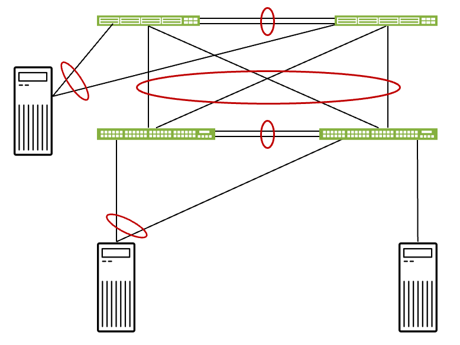

# Solution Overview — Collapsed Data Center Fabric with Access Switches

> **Juniper Validated Design Extension (JVDE)** · collapsed fabric + EX4400 access layer
> Source: *JVD Solution Overview: Collapsed Data Center Fabric with Juniper Apstra and Access Switches* (juniper.net).
> Companion docs: [design-guide.md](design-guide.md) · [test-report-brief.md](test-report-brief.md) · [datasheet.md](datasheet.md)

## Executive summary

Data center operators must deliver and maintain network infrastructures at various scale sizes. What do you do when you need a network smaller than the prescribed "small network" design but don't need a full 3-stage design? The **Collapsed Data Center Fabric with Juniper Apstra and Access Switches** is a Juniper Validated Design **Extension (JVDE)** that builds upon the [Collapsed Data Center Fabric with Juniper Apstra JVD](../../collapsed_dc_fabric/) to add access switches and multiply the port count — providing port counts rivalling a 3-stage network where performance can be traded for cost efficiency.

## Solution overview

This JVDE extends a collapsed fabric by about one rack of usable, high-availability ports. The base collapsed fabric combines the spine, leaf, and border-leaf functionality into just two switches; this extension provides step-by-step guidance on deploying added **access switches** to support as many access switch pairs as there are high-availability ports in the base collapsed fabric.

*Figure 1. Collapsed fabric (top pair) with an EX4400 access-switch pair (below), ESI-LAG multihomed to the collapsed leaves; servers attach to the access layer.*

The underlying JVD is an **ERB-based** architecture with spine, leaf, and border-leaf switches collapsed into a two-switch, high-availability configuration, managed by Juniper Apstra. The access layer expands the number of servers a collapsed fabric can support.

## Benefits

- **Repeatability** — prescriptive designs where all JVD customers benefit from lessons learned in worldwide deployments.
- **Reliability** — integrated best-practice designs tested with real-world traffic and described with measured results.
- **Velocity** — streamlined deployment with step-by-step guidance, automation, and prebuilt integrations.
- **Cost-efficient port expansion** — add a modest number of 1GbE / 2.5GbE ports with budget-conscious EX4400-48MP access switches, without moving to a full 3-stage design.

## Solution components

This JVDE deploys **EX4400-48MP** switches as an access layer connected to a Collapsed Data Center Fabric with Juniper Apstra deployment. Only the EX4400-48MP was validated for the access-switch role (a deliberate, budget-conscious choice for adding 1GbE ports); for more 10GbE+ ports, use a higher-port-count collapsed fabric or the [3-Stage Data Center Design](../../3stage_dc/).

| Component | Software / version |
|-----------|--------------------|
| Juniper Apstra | 4.2.1 |
| Junos OS (collapsed spine) | 22.2R3-S3 |
| Junos OS (EX4400 access) | 22.4R3 |

## About Juniper Validated Designs

JVDs represent a cross-functional collaboration between Juniper's top subject matter experts. **JVDEs** build upon JVDs to extend them with additional functionality — here, the addition of an access-switch layer for port expansion. This JVDE includes the information required to configure both the original collapsed fabric JVD and the access-switch functionality it introduces.

## Sources

- *JVD Solution Overview: Collapsed Data Center Fabric with Juniper Apstra and Access Switches* (juniper.net Validated Designs).
- Companion: [design-guide.md](design-guide.md), [test-report-brief.md](test-report-brief.md), [datasheet.md](datasheet.md).
