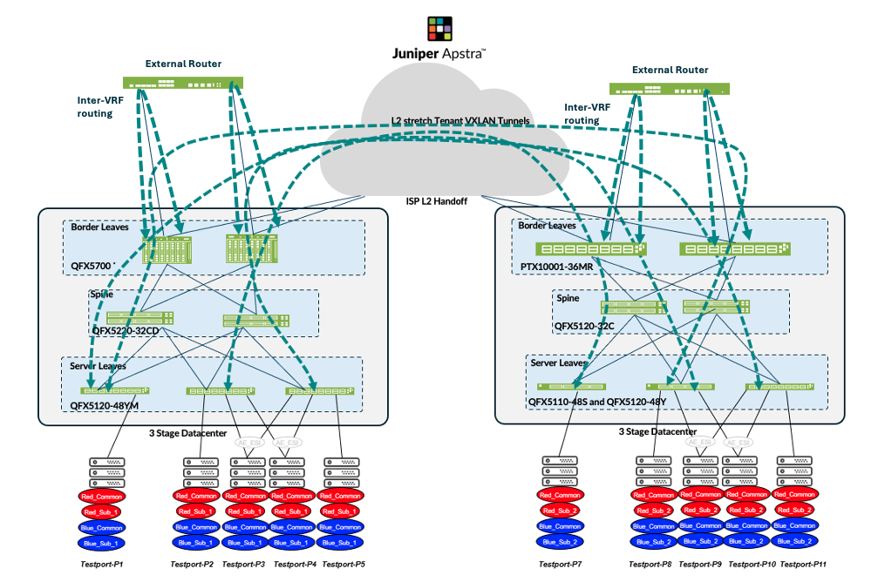
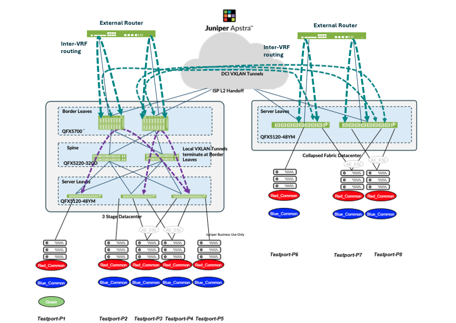
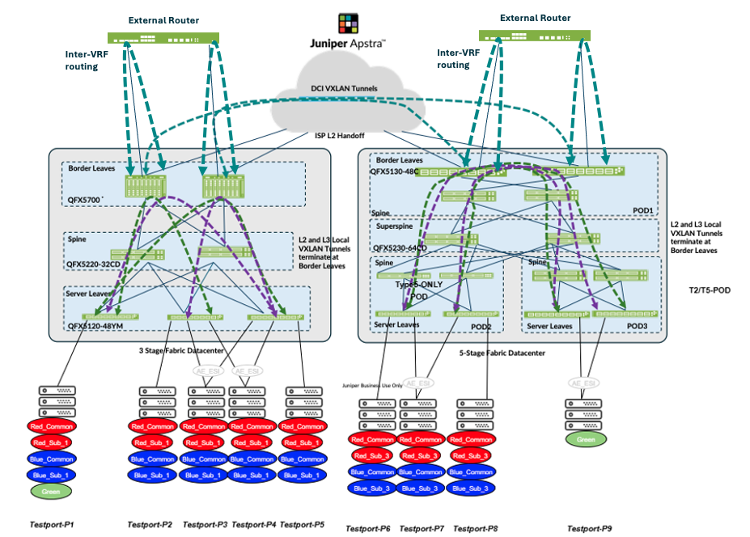
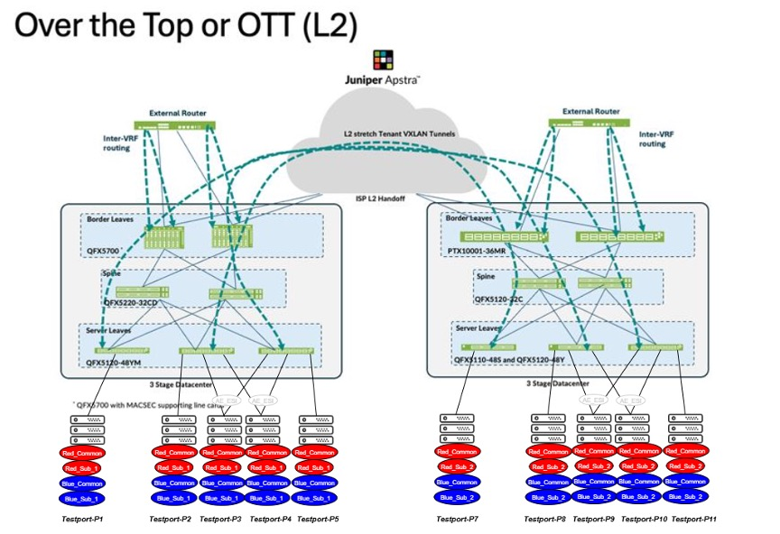
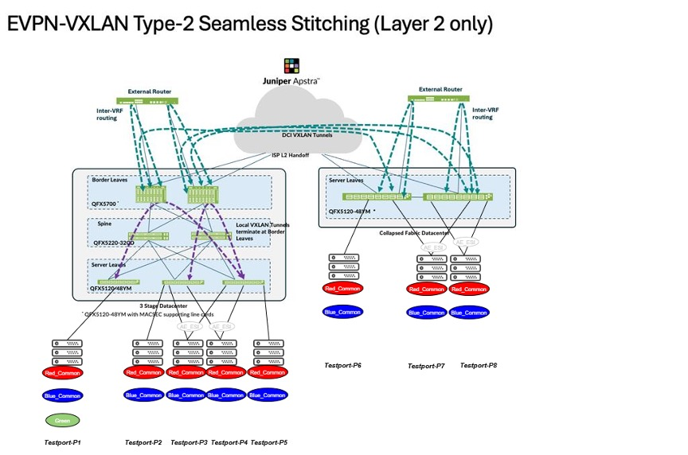
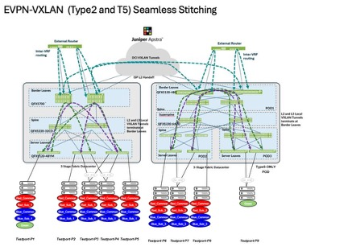

# EVPN-VXLAN Data Center Interconnect (DCI)

Validated configurations for the Juniper Validated Design *"EVPN-VXLAN Data Center Interconnect."* This JVD demonstrates three distinct techniques for stretching an EVPN/VXLAN fabric across multiple data centers, all built on the [3-stage data center](../3stage_dc/) and [5-stage EVPN-VXLAN](../5stage_evpn_vxlan/) baseline designs.

* JVD landing page: <https://www.juniper.net/documentation/validated-designs/us/en/data-center/>

The DCI design covers three interconnect techniques, each captured as a separate, fully-rendered fabric configuration set in this folder:

### 1. Over-the-Top (OTT) — DC1 ↔ DC2

VXLAN tunnels are formed across **all** leaf devices spanning the two data centers. Because the number of tunnels grows with VXLAN/VNI count and tenant count, OTT is best suited to smaller, relatively static data centers. MACSEC encryption is applied between border-leaf gateways.

### 2. Type 2 Seamless Stitching — DC1 ↔ DC3

Only a **subset** of VLAN/VNIs are selectively stretched between data centers. VXLAN tunnels are not formed automatically each time a leaf is added (unlike OTT), which improves scale and simplifies the L2-extension configuration. MACSEC encryption is applied between border-leaf gateways.

### 3. Type 2 + Type 5 Seamless Stitching — DC1 ↔ DC4

Extends Type 2 stitching by also stretching the **Layer 3 context** across data centers. DC4 in this scenario is itself a 5-stage fabric (super spines, compute POD, storage POD, services POD), demonstrating DCI between a 3-stage and a 5-stage design.

> The configurations in this folder include only the additional configuration required for each DCI technique. Operational essentials such as root password, DNS, FTP, and other site-specific settings are intentionally omitted and must be added per data center deployment.

## Hardware

| Juniper Product | Role | Software |
|---|---|---|
| **QFX5220-32CD** | DC1 spine pair (all scenarios) | Junos OS Evolved 23.4R2-S4 |
| **QFX5120-48Y** | DC1 server / ESI leaves, DC2 leaves, DC3 leaves | Junos OS 23.4R2-S4 |
| **QFX5120-48Y-8C** | DC2 spine pair (OTT) | Junos OS 23.4R2-S4 |
| **QFX5130-32CD** | DC1 border leaves (all scenarios), DC4 storage leaves | Junos OS Evolved 23.4R2-S4 |
| **QFX5700** | DC2 border leaves (OTT) | Junos OS Evolved 23.4R2-S4 |
| **QFX5230-64CD** | DC4 super spines (Type 2+5) | Junos OS Evolved 23.4R2-S4 |
| **QFX5210-64C** | DC4 compute and services POD spines (Type 2+5) | Junos OS 23.4R2-S4 |
| **QFX5120-48YM** | DC4 compute POD leaves (Type 2+5) | Junos OS 23.4R2-S4 |
| **QFX5220-32CD** | DC4 storage POD spines (Type 2+5) | Junos OS Evolved 23.4R2-S4 |
| **QFX5130-48C** | DC4 services POD border leaves (Type 2+5) | Junos OS Evolved 23.4R2-S4 |

DC1 is the common 3-stage fabric across all three scenarios, configured differently in each one to demonstrate the relevant DCI technique.

## Configurations

### Scenario 1 — DC1 ↔ DC2 Over-the-Top with MACSEC

| File | Role |
|---|---|
| [`dc1_spine1_qfx5220-32cd.conf`](configuration/conf/dc1-dc2_ott/dc1_spine1_qfx5220-32cd.conf) | DC1 spine 1 |
| [`dc1_spine2_qfx5220-32cd.conf`](configuration/conf/dc1-dc2_ott/dc1_spine2_qfx5220-32cd.conf) | DC1 spine 2 |
| [`dc1_server-leaf1_qfx5120-48y.conf`](configuration/conf/dc1-dc2_ott/dc1_server-leaf1_qfx5120-48y.conf) | DC1 single server leaf |
| [`dc1_esi-leaf1_qfx5120-48y.conf`](configuration/conf/dc1-dc2_ott/dc1_esi-leaf1_qfx5120-48y.conf) | DC1 ESI leaf 1 |
| [`dc1_esi-leaf2_qfx5120-48y.conf`](configuration/conf/dc1-dc2_ott/dc1_esi-leaf2_qfx5120-48y.conf) | DC1 ESI leaf 2 |
| [`dc1_borderleaf1_qfx5130-32cd.conf`](configuration/conf/dc1-dc2_ott/dc1_borderleaf1_qfx5130-32cd.conf) | DC1 border leaf 1 (MACSEC gateway) |
| [`dc1_borderleaf2_qfx5130-32cd.conf`](configuration/conf/dc1-dc2_ott/dc1_borderleaf2_qfx5130-32cd.conf) | DC1 border leaf 2 (MACSEC gateway) |
| [`dc2_spine1_qfx5120-48y-8c.conf`](configuration/conf/dc1-dc2_ott/dc2_spine1_qfx5120-48y-8c.conf) | DC2 spine 1 |
| [`dc2_spine2_qfx5120-48y-8c.conf`](configuration/conf/dc1-dc2_ott/dc2_spine2_qfx5120-48y-8c.conf) | DC2 spine 2 |
| [`dc2_server-leaf1_qfx5120-48y.conf`](configuration/conf/dc1-dc2_ott/dc2_server-leaf1_qfx5120-48y.conf) | DC2 single server leaf |
| [`dc2_esi-leaf1_qfx5120-48y.conf`](configuration/conf/dc1-dc2_ott/dc2_esi-leaf1_qfx5120-48y.conf) | DC2 ESI leaf 1 |
| [`dc2_esi-leaf2_qfx5120-48y.conf`](configuration/conf/dc1-dc2_ott/dc2_esi-leaf2_qfx5120-48y.conf) | DC2 ESI leaf 2 |
| [`dc2_borderleaf1_qfx5700.conf`](configuration/conf/dc1-dc2_ott/dc2_borderleaf1_qfx5700.conf) | DC2 border leaf 1 (MACSEC gateway) |
| [`dc2_borderleaf2_qfx5700.conf`](configuration/conf/dc1-dc2_ott/dc2_borderleaf2_qfx5700.conf) | DC2 border leaf 2 (MACSEC gateway) |

### Scenario 2 — DC1 ↔ DC3 Type 2 Seamless Stitching with MACSEC

| File | Role |
|---|---|
| [`dc1_spine1_qfx5220-32cd.conf`](configuration/conf/dc1-dc3_type2_seamless/dc1_spine1_qfx5220-32cd.conf) | DC1 spine 1 |
| [`dc1_spine2_qfx5220-32cd.conf`](configuration/conf/dc1-dc3_type2_seamless/dc1_spine2_qfx5220-32cd.conf) | DC1 spine 2 |
| [`dc1_leaf1_qfx5120-48y.conf`](configuration/conf/dc1-dc3_type2_seamless/dc1_leaf1_qfx5120-48y.conf) | DC1 leaf 1 |
| [`dc1_leaf2_qfx5120-48y.conf`](configuration/conf/dc1-dc3_type2_seamless/dc1_leaf2_qfx5120-48y.conf) | DC1 leaf 2 |
| [`dc1_leaf3_qfx5120-48y.conf`](configuration/conf/dc1-dc3_type2_seamless/dc1_leaf3_qfx5120-48y.conf) | DC1 leaf 3 |
| [`dc1_borderleaf1_qfx5130-32cd.conf`](configuration/conf/dc1-dc3_type2_seamless/dc1_borderleaf1_qfx5130-32cd.conf) | DC1 border leaf 1 (MACSEC gateway) |
| [`dc1_borderleaf2_qfx5130-32cd.conf`](configuration/conf/dc1-dc3_type2_seamless/dc1_borderleaf2_qfx5130-32cd.conf) | DC1 border leaf 2 (MACSEC gateway) |
| [`dc3_leaf1_qfx5120-48y.conf`](configuration/conf/dc1-dc3_type2_seamless/dc3_leaf1_qfx5120-48y.conf) | DC3 leaf 1 |
| [`dc3_leaf2_qfx5120-48y.conf`](configuration/conf/dc1-dc3_type2_seamless/dc3_leaf2_qfx5120-48y.conf) | DC3 leaf 2 |

### Scenario 3 — DC1 ↔ DC4 Type 2 + Type 5 Seamless Stitching

DC4 in this scenario is a 5-stage EVPN-VXLAN fabric (super spines + Compute / Storage / Services PODs).

#### DC1 (3-stage fabric)

| File | Role |
|---|---|
| [`dc1_spine1_qfx5220-32cd.conf`](configuration/conf/dc1-dc4_type2_type5_seamless/dc1_spine1_qfx5220-32cd.conf) | DC1 spine 1 |
| [`dc1_spine2_qfx5220-32cd.conf`](configuration/conf/dc1-dc4_type2_type5_seamless/dc1_spine2_qfx5220-32cd.conf) | DC1 spine 2 |
| [`dc1_leaf1_qfx5120-48y.conf`](configuration/conf/dc1-dc4_type2_type5_seamless/dc1_leaf1_qfx5120-48y.conf) | DC1 leaf 1 |
| [`dc1_leaf2_qfx5120-48y.conf`](configuration/conf/dc1-dc4_type2_type5_seamless/dc1_leaf2_qfx5120-48y.conf) | DC1 leaf 2 |
| [`dc1_leaf3_qfx5120-48y.conf`](configuration/conf/dc1-dc4_type2_type5_seamless/dc1_leaf3_qfx5120-48y.conf) | DC1 leaf 3 |
| [`dc1_borderleaf1_qfx5130-32cd.conf`](configuration/conf/dc1-dc4_type2_type5_seamless/dc1_borderleaf1_qfx5130-32cd.conf) | DC1 border leaf 1 |
| [`dc1_borderleaf2_qfx5130-32cd.conf`](configuration/conf/dc1-dc4_type2_type5_seamless/dc1_borderleaf2_qfx5130-32cd.conf) | DC1 border leaf 2 |

#### DC4 (5-stage fabric)

| File | Role |
|---|---|
| [`dc4_superspine1_qfx5230-64cd.conf`](configuration/conf/dc1-dc4_type2_type5_seamless/dc4_superspine1_qfx5230-64cd.conf) | DC4 super spine 1 |
| [`dc4_superspine2_qfx5230-64cd.conf`](configuration/conf/dc1-dc4_type2_type5_seamless/dc4_superspine2_qfx5230-64cd.conf) | DC4 super spine 2 |
| [`dc4_compute-spine1_qfx5210-64c.conf`](configuration/conf/dc1-dc4_type2_type5_seamless/dc4_compute-spine1_qfx5210-64c.conf) | DC4 compute POD spine 1 |
| [`dc4_compute-spine2_qfx5210-64c.conf`](configuration/conf/dc1-dc4_type2_type5_seamless/dc4_compute-spine2_qfx5210-64c.conf) | DC4 compute POD spine 2 |
| [`dc4_compute-leaf1_qfx5120-48ym.conf`](configuration/conf/dc1-dc4_type2_type5_seamless/dc4_compute-leaf1_qfx5120-48ym.conf) | DC4 compute POD leaf 1 |
| [`dc4_compute-leaf2_qfx5120-48ym.conf`](configuration/conf/dc1-dc4_type2_type5_seamless/dc4_compute-leaf2_qfx5120-48ym.conf) | DC4 compute POD leaf 2 |
| [`dc4_storage-spine1_qfx5220-32cd.conf`](configuration/conf/dc1-dc4_type2_type5_seamless/dc4_storage-spine1_qfx5220-32cd.conf) | DC4 storage POD spine 1 |
| [`dc4_storage-spine2_qfx5220-32cd.conf`](configuration/conf/dc1-dc4_type2_type5_seamless/dc4_storage-spine2_qfx5220-32cd.conf) | DC4 storage POD spine 2 |
| [`dc4_storage-leaf1_qfx5130-32cd.conf`](configuration/conf/dc1-dc4_type2_type5_seamless/dc4_storage-leaf1_qfx5130-32cd.conf) | DC4 storage POD leaf 1 |
| [`dc4_storage-leaf2_qfx5130-32cd.conf`](configuration/conf/dc1-dc4_type2_type5_seamless/dc4_storage-leaf2_qfx5130-32cd.conf) | DC4 storage POD leaf 2 |
| [`dc4_services-spine1_qfx5210-64c.conf`](configuration/conf/dc1-dc4_type2_type5_seamless/dc4_services-spine1_qfx5210-64c.conf) | DC4 services POD spine 1 |
| [`dc4_services-spine2_qfx5210-64c.conf`](configuration/conf/dc1-dc4_type2_type5_seamless/dc4_services-spine2_qfx5210-64c.conf) | DC4 services POD spine 2 |
| [`dc4_services-leaf1_qfx5130-48c.conf`](configuration/conf/dc1-dc4_type2_type5_seamless/dc4_services-leaf1_qfx5130-48c.conf) | DC4 services POD border leaf 1 |
| [`dc4_services-leaf2_qfx5130-48c.conf`](configuration/conf/dc1-dc4_type2_type5_seamless/dc4_services-leaf2_qfx5130-48c.conf) | DC4 services POD border leaf 2 |
