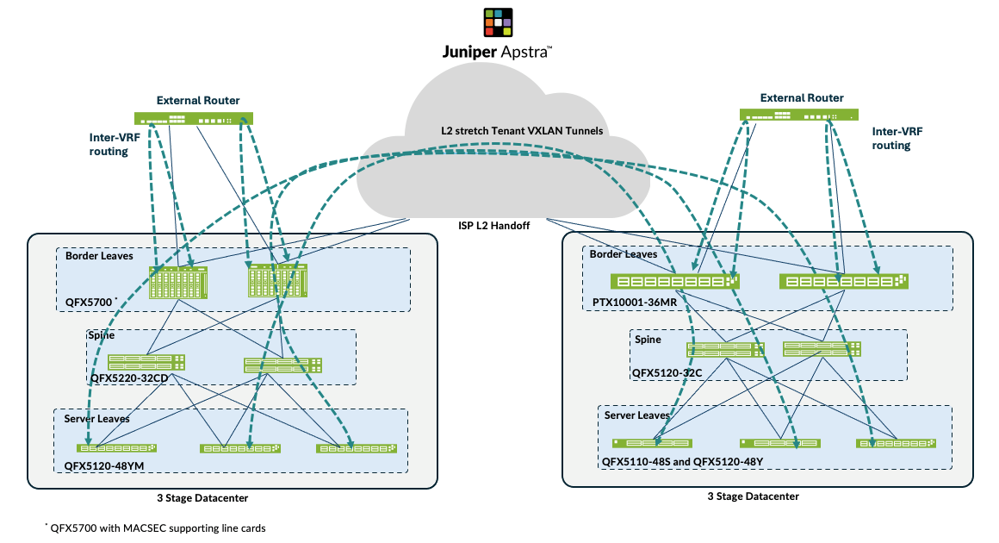
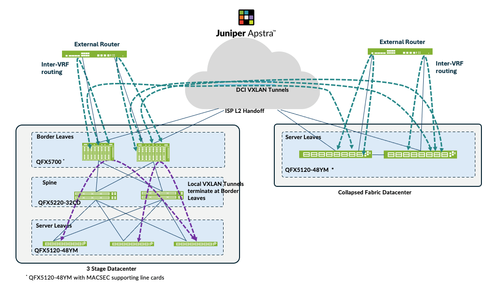
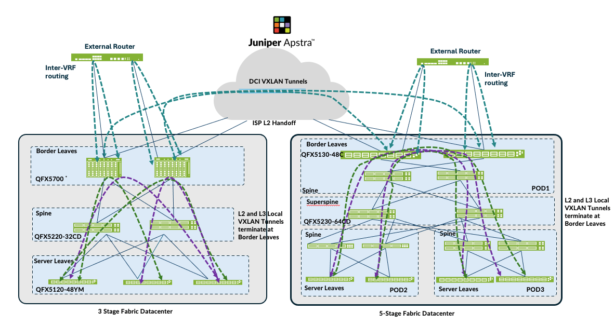

>
> Faithful markdown conversion of the published PDF:
> [EVPN-VXLAN Data Center Interconnect Design with Juniper Apstra — Juniper Validated Design Extension (JVDE)](https://www.juniper.net/documentation/us/en/software/jvd/evpn-vxlan-dci-apstra/index.html).
> The PDF on juniper.net is the source of truth. Apstra UI screenshots are referred
> out to the published PDF by figure number and caption; the CLI flow-verification
> output is reproduced in full. The resulting device configurations are in
> [`../configuration/conf/`](../configuration/conf/).

# EVPN-VXLAN Data Center Interconnect Design with Juniper Apstra — Juniper Validated Design Extension (JVDE)

Juniper Networks Validated Designs provide you with a comprehensive, end-to-end
blueprint for deploying Juniper solutions in your network. These designs are
created by Juniper's expert engineers and tested to ensure they meet your
requirements. Using a validated design, you can reduce the risk of costly
mistakes, save time and money, and ensure that your network is optimized for
maximum performance.

## About this Document

This document details a Juniper Validated Design Extension (JVDE) to provision
EVPN-VXLAN Data Center Interconnect (DCI) for Data Center fabric with Juniper
Apstra. The validation was done using several combinations of device models,
which are listed in the document. This document is intended for an audience
familiar with Juniper technologies such as the Junos OS, QFX Series switches, and
Juniper Apstra. This JVDE is an extension of the 3-stage, 5-stage and Collapsed
Fabric JVD. For more information refer to the published JVDs.

## Solution Benefits

This Juniper Validated Design Extension (JVDE) document is an extension of the
3-stage, 5-stage and collapsed fabric data center design with Juniper Apstra JVD.
For more information about deploying data center fabrics with Juniper Apstra, refer
to the respective JVD. The document provides detailed instructions for deploying
Data Center Interconnect (DCI) between data centers using Juniper Apstra. The
solution is designed to meet the needs of Juniper's customers who run data centers
with the Juniper Switches.

It is based on best practices as determined by Juniper's subject matter experts,
and Juniper support teams have extensive training and resources necessary to
support networks based on JVDEs.

### Juniper Validated Design Extension Benefits

JVDE benefits are as follows:

- **Qualified Deployments** — JVDEs are a prescriptive blueprint for building upon
  a JVD data center fabric to meet the requirements of a specific use case. This
  approach makes building blocks JVDEs "known quantities" that can be deployed
  quickly, simply, and reliably.
- JVDEs are designed to meet the needs of most of Juniper's data center customers
  and are based on customer feedback. It is designed to scale beyond the initial
  design and support the adoption of different hardware platforms based on customer
  requirements.
- **Risk Mitigation** — Each JVDE goes through the New Product Initiative (NPI)
  testing framework to achieve validation. JVDEs contain the configuration
  necessary to extend a JVD data center network fabric with new functionality
  based on best practices and common use cases.
- JVDEs are verified by a suite of automated testing tools that can be used to
  validate the performance and reliability of Juniper solutions.
- **Predictability** — NPI testing verifies that all products in the JVDE work
  together as expected, using the explicitly defined versions of hardware and
  software documented therein. Common use cases are tested to determine the
  capabilities and limitations of the JVDE's constituent products when working
  together.

The underlying JVD data center network fabric, as well as any products and
services listed in the JVDE, is tested for end-to-end functionality. This ensures
that the specific combination of hardware, software, and features function as
expected with the prescribed Junos OS releases.

### Juniper Apstra Benefits

Juniper Validated Designs in the data center start with the Apstra software, a
multi-vendor, intent-based networking system (IBNS) that provides closed-loop
automation and assurance. Apstra translates vendor-agnostic business intent and
technical objectives to essential policy and device-specific configurations. The
system also validates user intent, as part of the initial deployment and
continuously thereafter, to ensure that the network state does not deviate from
the intended state. Any anomaly or deviation can be flagged, and remediation
actions can be taken directly from Apstra.

The core benefits of Apstra are:

- **Intent-based networking** — Automates configuration generation and
  continuously validates operating state versus intent.
- **Network Automation** — Apstra is a multi-vendor network automation platform
  that is continuously updated to work with the latest hardware and exhaustively
  tested using modern DevOps practices.
- **Recoverability** — Built-in rollback capability restores known-working
  configuration in a fraction of the time.
- **Day 2+ Management** — Apstra's rich analytics capabilities, including Flow
  Data, reduce Mean Time to Resolution (MTTR).
- **Simplicity** — Apstra simplifies network management. For example, by reducing
  the complexity of data center interconnection (DCI), making it easy to unify
  multiple data center while isolating failure domains for high availability and
  resilience.

## Use Case and Reference Architecture

The DCI JVDE is an extension design document that covers multiple data center
designs (using Juniper switches) and interconnects them. The data center designs
that will be included are 3-Stage, Collapsed Fabric and 5-Stage Data Center
design.

There are several ways Data Center Interconnect (DCI) can be achieved but this
JVDE focuses on some key designs. The key focus of these uses cases is on the DCI
solution and configuration of below DCI methods between data centers using
recommended Juniper Border leaf switches.

### Over-the-Top (OTT) (with MACSEC)

In the over-the-top Interconnect design, the two data centers as shown below in
Figure 1 are connected using a layer 2 switch and forms a layer 2 stretch for the
tenants provisioned with VPN routing and forwarding (VRF). The VXLAN/VNI tunnels
are formed between all the Leaf devices in both data centers and the Layer 2
switches are merely switching packets between data center. In the OTT design,
tunnels are formed across all leaf devices spanning the two data centers and can
increase depending on the VXLAN/VNIs and the tenants. Hence this solution is
better suited for smaller data centers that are not prone to change.


*Figure 1: Over-the-top Interconnect Design.*

### EVPN-VXLAN Type 2 Seamless Stitching (with MACSEC)

In contrast to the OTT design, the Layer 2 Seamless stitching design tunnels are
not formed across all leaf devices in both data centers and hence only a subset of
VLAN/VNI stretching between sites can be enabled in a selective manner. The local
VLAN/VXLAN tunnels also get terminated at the border leaf switches, as is depicted
below in Figure 2 and new DCI VXLAN tunnels are formed between the data centers.
Due to this, VXLAN tunnels are not formed automatically each time a new leaf switch
is added (as is the case with OTT). This increases the scale performance and
simplifies the configurations needed to achieve the Layer 2 extensions.

In this design QFX5700 and QFX5120-48YM is used so as to facilitate MACSEC
functionality between the two data centers.

In the below Figure 2, one of the data center design is collapsed fabric data
center.


*Figure 2: EVPN-VXLAN Type 2 Seamless Stitching.*

### EVPN-VXLAN (Type 2 and Type 5) Seamless Stitching

The VXLAN-to-VXLAN Type 5 stitching is merely an extension of the Type 2 Seamless
Stitching. As discussed above, the Layer 3 context is stretched across the data
centers. For this design option, as an example the 3-stage and 5-stage data
centers are used to form this DCI design.


*Figure 3: VXLAN (T5) to VXLAN (T5) design with Layer 2 VLAN/VNI Stretch.*

## Solution Architecture

For the purposes of this JVDE, the 3-stage, 5-stage and Collapsed Fabric Data
Center designs have been used for Data Center Interconnect (DCI) design. Hence the
JVDE focusses on provisioning of the types of DCI using Apstra with Juniper
Switches as discussed in the Use Case and Reference Architecture section above.

For the purposes of this JVDE, the hardware components discussed in Juniper
Hardware and Software Components required for the DCI functionality focuses on the
Border Leaf switches. The interconnect switches used for connecting data centers
can be any switch/router so long as they support the interconnect functionality.
For the lab validation purposes, QFX10002-36Q are used, although configuration of
these switches is out of scope of this document, configuration statement
references have been provided where necessary.

> **NOTE:** Each of the DCI designs were configured and tested in isolation. For
> instance, the over-the-top (OTT) design was configured and validated first. The
> OTT design is a mutually exclusive design as all of the VXLAN tunnels are formed
> and stretched across data centers and cannot be mixed with seamless stitching.
> Apstra also prevents mixing OTT with other Interconnect DCI design for the same
> reason. However, the Type 2 and Type 5 traffic can be configured and mixed as
> would be discussed later.

### Juniper Hardware and Software Components

For this solution, the Juniper products and software versions are as below.

The design documented in this JVD is considered the baseline representation for
the validated solution. As part of a complete solutions suite, we routinely swap
hardware devices with other models during iterative use case testing. Each switch
platform validated in this document goes through the same rigorous role-based
testing using specified versions of Junos OS and Apstra management software.

### Juniper Hardware Components

The focus in this JVDE is on the border leaf switch models that were used to
interconnect each of these data center fabrics. The table below shows device
models and their roles that were used for each of the Fabric Solution:

#### Table 1: Platform Positioning and Roles

| Solution | Server Leaf Switches | Border Leaf Switches | Spine | Super Spine |
|----------|----------------------|----------------------|-------|-------------|
| 3-stage EVPN/VXLAN Data Center design (ERB) | QFX5120-48Y-8C, QFX5110-48S | QFX5700 (EVO), PTX10001-36MR | QFX5220-32CD (EVO), QFX5120-32C | |
| Collapsed Fabric Data Center design* | QFX5120-48YM | | | |
| 5-stage EVPN/VXLAN Data Center design (ERB) | QFX5120-48YM, QFX5130-32CD (EVO) | QFX5130-48C (EVO) | QFX5220-32CD (EVO), QFX5210-64C, QFX5120-32C | QFX5230-64CD (EVO) |

\* Switches in a collapsed fabric perform the roles of spine, leaf, and border leaf switches.

> **NOTE:** If one of the devices in the hardware series is tested then all the
> rest of the variations should work. For instance, QFX5120-48YM covers all the
> rest of the variations such as QFX5120-48Y as the chipset used is same, however
> there are some exceptions such as QFX5130-48C and QFX5130-32CD. Contact your
> Juniper representative for more information.

#### Table 2: Juniper Software and Version

| Juniper Products | Software or Image Version |
|------------------|---------------------------|
| Juniper Apstra | 5.0.0-64 |
| Junos OS | 23.4R2-S4 |

### Validated Functionality

This DCI JVDE was validated for below features and functionalities:

- Deployment of DCI methods using Apstra:
  1. 3-stage Fabric to 3-stage Fabric data center OTT DCI design.
  2. 3-stage to Collapsed Fabric data center VXLAN-to-VXLAN Seamless Transition
     design.
  3. 3-stage to 5-Stage Fabric data center VXLAN Type 5 to VXLAN Type 5 Seamless
     transition.
- Provisioning L2/L3 switches required to interconnect data centers.
- The hardware and software listed in Table 1 support the features required for
  DCI EVPN/VXLAN deployment.
- Equal-Cost Multipath (ECMP) feature Type 2 and Type 5 Route Peering.
- EVPN route propagation using overlay eBGP sessions and all remote leaves can get
  to the routes in remote data center PODs/leaves. For instance, the servers in DC1
  3-stage can reach the servers deployed in DC2.
- Both IPV4 and IPV6 are enabled for routing between the data centers.
- BFD is enabled for overlay DCI using configlet.
- IRB enabled within PODs and across data center PODs/leaves for inter-subnet
  forwarding.
- Inter VRF route leaking configured to reach routes in DCI connected data center
  PODs/leaves.
- Configure MACSEC (using configlets in Apstra) between 3-stage data center with
  QFX5700 as border leaves and collapsed fabric with QFX5120-48YM as leaves.

## Configuration Walkthrough

> **NOTE:** This walkthrough is a step-by-step Apstra provisioning procedure. The
> published PDF illustrates each step with an Apstra UI screenshot (Figures 4–40).
> Those screenshots are not reproduced here; each is referred to inline by its
> figure number and caption so you can locate it in the
> [published PDF](https://www.juniper.net/documentation/us/en/software/jvd/evpn-vxlan-dci-apstra/index.html). All step text, NOTES, and CLI output are reproduced
> in full.

This walkthrough summarizes the steps required to configure the Data Center Interconnectivity using
Juniper Apstra.

As discussed in "Use Case and Reference Architecture" on page 3, this JVD will only cover three DCI use
cases using different fabric design and Juniper Devices. This JVD will also include Media Access Control
security (MACSEC) between DCI, however the configuration is provisioned as configlet as Apstra 5.0 is
unable to support.


### Prerequisite

Provision the 3-stage Data Center, Collapsed Fabric Data Center and 5-stage EVPN VXLAN Data Center
as has been discussed in the respective data center design JVD.


### Over-the-Top Design (with MACSEC)

For the DCI OTT design, two 3-stage data centers are interconnected using Layer 2 switches
(QFX10002-36Q) or any ISP switches that support Layer 2 switching cross connect configuration as
shown in below diagram. For QFX10002-36Q switches, licenses are needed for MPLS and L2-circuit.
For more information on Layer 2 switching cross connect refer Juniper guide on Layer 2 circuit cross-
connect (CCC) configuration. This JVD will briefly cover the configuration on these two switches as this
can vary for different DCI implementation and hence is outside the scope of this JVD.

For the sake of clarity, the two data centers are referred to as DC1 and DC2 as shown below in Figure 4
on page 11.


*Figure 4: OTT Design Connecting Two DCs (see the [published PDF](https://www.juniper.net/documentation/us/en/software/jvd/evpn-vxlan-dci-apstra/index.html)).*

Ensure to physically cable the border leaf switches in both data centers as shown in Figure 4 on page 11
to the Interconnect (ISP) switches, before proceeding to configure DCI in Apstra. To provision Data
Center Interconnectivity using Apstra, here are the steps.

1. Logon to Apstra UI and navigate to the blueprint of the first 3-stage data center (hereinafter referred
to as DC1). Configure the links to the Interconnect ISP switches as shown below for both border
leaves. Ensure the cabling is also updated reflecting the interface connecting the ISP switches on
each of the border leaves. For more information on creating an external generic server refer the
Apstra guide for adding links to existing Blueprint.


*Figure 5: Links from Border Leaves to ISP Switch 1 (see the [published PDF](https://www.juniper.net/documentation/us/en/software/jvd/evpn-vxlan-dci-apstra/index.html)).*


*Figure 6: Border Leaf 2 Connectivity with ISP Switch 2 (see the [published PDF](https://www.juniper.net/documentation/us/en/software/jvd/evpn-vxlan-dci-apstra/index.html)).*

2. Create the routing policy to allow the loopback IP of the border leaf switches of remote data center,
in this case DC2. Navigate to Blueprint > Staged > Policies > Routing Policies and create or modify
the relevant policy to permit the import routes of Loopback IPs of data center (DC2) border leaf
switches.


*Figure 7: Add Import Routes for DC2 Border Leaf Switches (see the [published PDF](https://www.juniper.net/documentation/us/en/software/jvd/evpn-vxlan-dci-apstra/index.html)).*

3. Next create Connectivity Templates to connect border leaf switches in current blueprint (DC1) to
remote data center blueprint (DC2). This step creates the underlay connectivity between the two
data centers which is VLAN tagged. The routing policy defined in previous step is assigned for routes
import. An underlay eBGP is also created between the Border leaf switch1 of both data centers.
Similarly configure the underlay connectivity, eBGP between the Border Leaf switch2 of both data
centers. There should be two connectivity templates created for each border leaf connectivity. See
Figure 4 on page 11 to review the connectivity.


*Figure 8: Border Leaf Switch1 Connectivity Template (see the [published PDF](https://www.juniper.net/documentation/us/en/software/jvd/evpn-vxlan-dci-apstra/index.html)).*


*Figure 9: Border Leaf Switch2 Connectivity Template (see the [published PDF](https://www.juniper.net/documentation/us/en/software/jvd/evpn-vxlan-dci-apstra/index.html)).*

Once the Connectivity templates are created, assign them to the border leaf switches as shown
below. For more information on Apstra connectivity templates, refer Juniper Apstra Guide.


*Figure 10: Assign Connectivity Template to Border Leaf Switch1 (see the [published PDF](https://www.juniper.net/documentation/us/en/software/jvd/evpn-vxlan-dci-apstra/index.html)).*


*Figure 11: Assign Connectivity Template to Border Leaf Switch 2 (see the [published PDF](https://www.juniper.net/documentation/us/en/software/jvd/evpn-vxlan-dci-apstra/index.html)).*

4. After assigning the connectivity template, navigate to Blueprint > Staged > Virtual > Routing zone
and click on the default routing zone to allocate IPV4 and IPV6 IP addresses to create the border leaf
connectivity between the two data centers.


*Figure 12: Assign IP Addresses to Create IP Link between Border Leaf Switches of Both Data Centers (see the [published PDF](https://www.juniper.net/documentation/us/en/software/jvd/evpn-vxlan-dci-apstra/index.html)).*

To create the overlay connectivity, Navigate to Blueprint > Staged > DCI and select the Over the Top
or External Gateway and enter the details of the remote border leaf switches of the remote data
center. This step should be carried out for both border leaf switches as both use different
Interconnect switch to connect to the remote data center border leaves.


*Figure 13: Create Over the Top or External Gateway between DC1 Border Leaf1 and DC2 Border Leaf1 (see the [published PDF](https://www.juniper.net/documentation/us/en/software/jvd/evpn-vxlan-dci-apstra/index.html)).*


*Figure 14: Create Over the Top or External Gateway between DC1 Border Leaf2 and DC2 Border Leaf2 (see the [published PDF](https://www.juniper.net/documentation/us/en/software/jvd/evpn-vxlan-dci-apstra/index.html)).*

5. Then ensure the ASN, Loopback IPs on the ISP switches reflects that of remote data center’s border
leaf switches, i.e. DC2’s border leaf switch ASN and loopback IPs as shown below. Navigate to
Blueprint > Staged > Physical > Topology then click on generic server representation of ISP switches
then on next screen right hand side navigate to properties as shown below and update the ASN and
loopback IP. Repeat the same step for generic server ISP switch 2 as well.


*Figure 15: ASN and Loopback Update of Remote Data Center for eBGP (see the [published PDF](https://www.juniper.net/documentation/us/en/software/jvd/evpn-vxlan-dci-apstra/index.html)).*

6. Navigate to DC1’s Blueprint > Uncommitted and commit all the changes. Note that the connectivity
will not be up at this point as the ISP switches and the remote data center (DC2 in this instance)
blueprint are not setup with DCI connectivity. This will be discussed in next step.

7. Repeat all of the above steps for the remote data center, for instance DC2. And then proceed to
create the configuration on the ISP Switches, see "Configuring Interconnect ISP switches" on page
23.

> **NOTE:** For the purposes of this lab, the configuration on the ISP switches were applied manually.

8. MACSEC configuration was also applied to border leaf switches to encrypt traffic between the DC1
and DC2 data centers. Since Apstra doesn’t support MACSEC, it was applied using configlet, refer to
section "1" on page 38 for more information.

9. Once configuration on ISP Switches and the remote data center (DC2) is committed, the connectivity
should be up and Apstra should show no Anomalies related to the DCI connectivity. If Apstra shows
anomalies for BGP, Interface etc, analyze and troubleshoot these.


*Figure 16: DC1 Border Leaf Switch1 BGP Established with DC2 Border Leaf Switch1 (see the [published PDF](https://www.juniper.net/documentation/us/en/software/jvd/evpn-vxlan-dci-apstra/index.html)).*


*Figure 17: DC1 Border Leaf Switch2 BGP Established with DC2 Border Leaf Switch2 (see the [published PDF](https://www.juniper.net/documentation/us/en/software/jvd/evpn-vxlan-dci-apstra/index.html)).*


*Figure 18: DC2 Border Leaf Switch1 BGP Established with DC1 Border Leaf Switch1 (see the [published PDF](https://www.juniper.net/documentation/us/en/software/jvd/evpn-vxlan-dci-apstra/index.html)).*


*Figure 19: DC2 Border Leaf Switch2 BGP Established with DC1 Border Leaf Switch2 (see the [published PDF](https://www.juniper.net/documentation/us/en/software/jvd/evpn-vxlan-dci-apstra/index.html)).*


### Configuring Interconnect ISP Switches

For the DCI connectivity, the choice of connectivity between data centers depends on factors such as
latency, convergence times during link or node failures, transport type (Layer 2/Layer 3) and hardware
used to provide interconnectivity.


> **NOTE:** This JVD does not recommend the type of connectivity between two data centers. For simplicity, interface-level switching (CCC) is used for implementation which is covered as part of this JVDE so as to provide information about Lab setup. However, for production environment this could vary.

For the purposes of this lab, two QFX10002-36Q are used and the border leaves connect using 10G
links. MPLS and L2-circuit are used to configure the Layer 2 cross connect. The configuration snippets

```console
show necessary configuration applied on one of the ISP switches to provide connectivity. Licenses for
MPLS and L2-circuit were also applied. For more information on interface-switch cross connect refer the
Layer2 cross-connect guide.

```

1. The interfaces are created with circuit cross connect (CCC) encapsulation as ethernet-ccc (configured
the whole physical interface, [set interfaces <interface_name> encapsulation ethernet-ccc]. For the circuit
to work logical interface (unit 0) should also be configured with family ccc [edit interfaces
<interface_name> unit 0 family ccc] for interfaces connecting to the border leaves on both data centers.

2. Besides that, circuit cross connect switch [edit protocols connections] is configured using the interfaces

```console
   set up as CCC in step 1.

```

3. Lastly for Layer 2 switching cross-connects to work, MPLS protocol should be enabled.


```console
     root@must-qfx10k-2> show configuration interfaces xe-0/0/18:0
     description "OTT:DC1-BL1 to DC2-BL1";
     mtu 9216;
     encapsulation ethernet-ccc;
     unit 0 {
         family ccc;
     }

     {master:0}
     root@must-qfx10k-2> show configuration interfaces xe-0/0/18:2
     description "OTT:DC1-BL1 to DC2-BL1";
     mtu 9216;
     encapsulation ethernet-ccc;
     unit 0 {
         family ccc;
     }


     {master:0}
     root@must-qfx10k-2> show configuration protocols
     connections {
          interface-switch DC1-DC2 {
              interface xe-0/0/18:0.0;
              interface xe-0/0/18:2.0;
          }
     }
     mpls {
          interface all;
     }
       lldp {
          interface all;
     }


```

EVPN-VXLAN Type 2 Seamless Stitching (Layer 2 only with MACSEC)
Design

For the Type 2 seamless stitching DCI design, only a subset of VLAN/VNI stretching between sites is
configured. In this design MACSEC is also used for encrypting traffic between the two data centers. For
this design, a 3-stage data center and a collapsed fabric data center are interconnected using layer 2
switches (QFX10002-36Q) as is described in "Over-the-Top (OTT) (with MACSEC)" on page 4.


> **NOTE:** Since MACSEC is used for encrypting traffic and a valid MACSEC license is needed to allow MACSEC traffic on both data center Border leaves. Also, the MACSEC config is applied using configlets from Apstra. QFX5700 and QFX5120-48YM support MACSEC and hence been used for this DCI design.


*Figure 20: Type 2 Seamless Stitching Connectivity between Data Centers (see the [published PDF](https://www.juniper.net/documentation/us/en/software/jvd/evpn-vxlan-dci-apstra/index.html)).*

For the sake of clarity, the two data centers are referred to as DC1 and DC3 as is shown in Figure 20 on
page 25. Ensure both data centers are physically cabled to the Interconnect ISP switches.

The configuration steps in this case are similar to the OTT Design. For this both 3-stage (DC1) and
Collapsed Fabric (DC3) blueprint should be up and running before proceeding. The steps for Type 2 DCI
and for setting up MACSEC is as follows:

1.   Navigate to the blueprint of the first 3-stage Data Center (hereinafter referred to as DC1).
Configure the links to the Interconnect ISP switches as shown below for both border leaves. Ensure
the Link is also updated. For more information on creating an external generic server refer the
Apstra guide for adding links to existing Blueprint. Below is an example of Border Leaf switch1
showing connectivity. Repeat same steps for Border Leaf switch2.


*Figure 21: Border Leaf Switch 1 Connectivity (see the [published PDF](https://www.juniper.net/documentation/us/en/software/jvd/evpn-vxlan-dci-apstra/index.html)).*

2.   Create Routing policy and allow the Loopback IP of the border leaf switches of remote data center,
in this case DC3. Navigate to Blueprint > Staged > Policies > Routing Policies and create or modify
relevant Policy and permit the import routes of Loopback IPs of remote data center (DC3) border
leaf switches.


*Figure 22: Routing Policy Allowing Routes Import from DC3 (see the [published PDF](https://www.juniper.net/documentation/us/en/software/jvd/evpn-vxlan-dci-apstra/index.html)).*

3.   Create Connectivity Templates to connect border leaf switches in the current blueprint (DC1) to
remote data center blueprint (DC3). This step creates the underlay connectivity between the two
data center which is VLAN tagged. The routing policy defined in previous step is assigned for routes
import. An underlay eBGP is also created between the border leaf switch1 of both data centers.
Similarly, configure the underlay connectivity, eBGP between the border Leaf switch2 of both data
centers. There should be two connectivity templates created for each border leaf switch.


*Figure 23: Connectivity Template Created for Border Leaf1 (see the [published PDF](https://www.juniper.net/documentation/us/en/software/jvd/evpn-vxlan-dci-apstra/index.html)).*


*Figure 24: Connectivity Template Created for Border Leaf Switch2 (see the [published PDF](https://www.juniper.net/documentation/us/en/software/jvd/evpn-vxlan-dci-apstra/index.html)).*

4.   Once the Connectivity templates are created, assign them to the border leaf switches as shown
below. For more information on Apstra connectivity templates, refer Juniper Apstra Guide.


*Figure 25: Border Leaf Switch1 Assigned to Connectivity Template (see the [published PDF](https://www.juniper.net/documentation/us/en/software/jvd/evpn-vxlan-dci-apstra/index.html)).*


*Figure 26: Border Leaf switch2 Assigned to Connectivity Template (see the [published PDF](https://www.juniper.net/documentation/us/en/software/jvd/evpn-vxlan-dci-apstra/index.html)).*

5.   To create the overlay connectivity, Navigate to Blueprint > Staged > DCI and select the Integrated
Interconnect to create the Interconnect domain. This ensures the Interconnect ESI is different in
both data centers (DC1 and DC3).
Important Note: For seamless stitching, it is mandatory to select both remote border leaves to
create logical full mesh overlay connectivity (as shown in Figure 29: Create Remote and Local
Gateway for both Border Leaf Switches on page 31). In case of a link or node failure of the
primary Border leaf switch, say in DC1, the Designated Forwarder role moves to the secondary
border leaf switch. If the DC1 secondary Border leaf switch sends traffic to the remote Border leaf
switch, which is not the Designated Forwarder, the routes will not be shared with the Primary
Border leaf switch in the remote DC. Therefore, implementing a logical full mesh is both
recommended and mandatory.


*Figure 27: Create Interconnect Domain (see the [published PDF](https://www.juniper.net/documentation/us/en/software/jvd/evpn-vxlan-dci-apstra/index.html)).*

Then click on the “Local and Remote Gateway” to fill in the remote gateway i.e. DC3 border leaf
switch information such as ASN, loopback etc as shown in Figure 28 on page 31 and Figure 29 on
page 31.


*Figure 28: Local and Remote Gateway (see the [published PDF](https://www.juniper.net/documentation/us/en/software/jvd/evpn-vxlan-dci-apstra/index.html)).*


*Figure 29: Create Remote and Local Gateway for both Border Leaf Switches (see the [published PDF](https://www.juniper.net/documentation/us/en/software/jvd/evpn-vxlan-dci-apstra/index.html)).*

6.   Before proceeding to associate the VXLAN/VNI to stretch across the DCI, navigate to Blueprint >
Staged > Virtual Network and create Virtual Network. Refer Apstra guide for creating Virtual
Network. The same Virtual Networks should be created in the remote data center blueprint for
seamless stretching to work.

Then navigate back to Blueprint > Staged > DCI > Integrated Interconnect and select connection
type and select the virtual networks listed and enable Layer 2 (EVPN Type 2). If necessary,
translation VNI can also be configured. If translation VNI is configured, then the switch translates
the VNI while it is forwarding traffic to a common VNI configured across the data center. The
border leaf switch translates the VNI only if the translated VNI is included in the interconnected
VNI list, which Apstra includes under [edit routing-instance evpn-1 protocols evpn interconnect
interconnected-vni-list] as shown below in rendered configuration of border leaf switch1 .


*Figure 30: Border Leaf1 Switch Apstra Rendered Config Snippet (see the [published PDF](https://www.juniper.net/documentation/us/en/software/jvd/evpn-vxlan-dci-apstra/index.html)).*


*Figure 31: Selecting Virtual Network to Stretch and Apply Translation VNI (see the [published PDF](https://www.juniper.net/documentation/us/en/software/jvd/evpn-vxlan-dci-apstra/index.html)).*

7.   At this point the data center interconnectivity configuration should be ready. And if committed the
connectivity between the two data centers should be established and the traffic between the data
centers will be unencrypted. For this JVD design, MACSEC is set up between the two DCs which
have been configured using configlet as Apstra does not natively support MACSEC, refer to section
"1" on page 38 for applying MACSEC using configlet.

8.   Then ensure the ASN, loopback IPs on the ISP switches reflect that of remote data center’s border
leaf switches, i.e. DC3’s border leaf switch ASN and loopback IPs as shown below. Navigate to
Blueprint > Staged > Physical > Topology then click on border leaf switch1 and as shown in then on
next screen right hand side. Navigate to properties as shown below and update the ASN and
loopback IP. Repeat the same step for generic server ISP switch 2 as well.


*Figure 32: Configuring ASN, Loopback of Remote Data Center Border leaf switch (see the [published PDF](https://www.juniper.net/documentation/us/en/software/jvd/evpn-vxlan-dci-apstra/index.html)).*

9.   Navigate to DC1’s Blueprint > Uncommitted and commit all the changes. Note that the connectivity
will not be up as at this point the ISP switches and the remote data center (DC3 in this instance)
blueprint are not setup with DCI connectivity. This will be discussed in the next step.

10. Repeat all of the above steps for the remote data center, for instance DC3. And then proceed to
create configuration on the ISP Switches as discussed in section "Configuring Interconnect ISP
switches" on page 23.

11. Once configuration on ISP Switches and the remote data center (DC3) is committed, the
connectivity should be up and Apstra should show no anomalies related to the DCI connectivity. If
Apstra shows anomalies for BGP, cabling, Interface etc, analyze and troubleshoot these issues.


*Figure 33: Apstra showing BGP and Interfaces all Green for DC1 Border Leaf Switch 1 (see the [published PDF](https://www.juniper.net/documentation/us/en/software/jvd/evpn-vxlan-dci-apstra/index.html)).*


*Figure 34: Apstra showing BGP and interfaces all Green for DC1 Border Leaf Switch 2 (see the [published PDF](https://www.juniper.net/documentation/us/en/software/jvd/evpn-vxlan-dci-apstra/index.html)).*


*Figure 35: BGP and Interfaces all Green on DC3 Leaf Switches (see the [published PDF](https://www.juniper.net/documentation/us/en/software/jvd/evpn-vxlan-dci-apstra/index.html)).*

During validation of the VXLAN Type 2 stitching, it was noticed that Apstra omitted applying the DCI
overlay EVPN BGP policy configuration on the collapsed fabric leaf switches to stop advertising overlay
routes between collapsed leaf switches. However, the same was applied on 3-stage fabric spine
switches to stop advertising overlay routes. Below configuration was applied using configlet on
collapsed fabric leaf switches on existing EVPN eBGP configuration.

protocols {
bgp {
group l3clos-l-evpn {
neighbor 192.168.253.1 export ( LEAF_TO_LEAF_EVPN_OUT && EVPN_EXPORT );
}
}
}

policy-options {
policy-statement LEAF_TO_LEAF_EVPN_OUT {
term LEAF_TO_LEAF_EVPN_OUT-10 {
from {
community FABRIC_EVI_TARGET;

protocol bgp;
protocol evpn;
}
then accept;
}
term LEAF_TO_LEAF_EVPN_OUT-20 {
from {
community EVPN_DCI_L2_TARGET;
community EVPN_DCI_L3_TARGET_blue;
community EVPN_DCI_L3_TARGET_red;
protocol bgp;
protocol evpn;
}
then reject;
}
term LEAF_TO_LEAF_EVPN_OUT-30 {
then accept;
}
}
}


### EVPN-VXLAN Type 2 and Type 5 Seamless Stitching Design

This design and configuration is similar to "EVPN-VXLAN Type 2 Seamless Stitching (Layer 2 only with
MACSEC) design" on page 24, with the exception that it involves Type 2 and Type 5 stitching design.
However, while selecting the Virtual Networks for stretching, both Type 2 (Layer 2) and Type 5 (Layer 3)
are enabled. When enabling Layer 3 for Virtual Networks to stretch across the data centers, the VRFs on
the Layer-3 Policy tab in Apstra must also be enabled and a routing-policy must be associated with the
VRF. Refer to the Apstra guide for more information.


*Figure 36: Selecting Virtual Network to stretch Type 2 and Type 5 (see the [published PDF](https://www.juniper.net/documentation/us/en/software/jvd/evpn-vxlan-dci-apstra/index.html)).*


*Figure 37: Configure Layer-3 Policy for VRF (see the [published PDF](https://www.juniper.net/documentation/us/en/software/jvd/evpn-vxlan-dci-apstra/index.html)).*

By enabling the Type 5 route for the VRF, Apstra applies below configuration to stitch the EVPN routes
between data centers. The same Interconnect route target should be applied in the remote data center
for seamless stitching to work.

evpn {
interconnect {
vrf-target target:65655L:22222;
route-distinguisher 192.168.255.2:65530;
}


### Additional Configurations Applied

1. MACSEC
For this JVD design, MACSEC is setup between the two DCs which has been configured using
configlet as Apstra does not natively support MACSEC, refer more information on setting MACSEC in
the Day One Guide.


> **NOTE:** For some platforms, such as QFX5700, logical interface (IFL) level MACSEC is unsupported. Therefore, QFX5700 (border gateways) are configured with physical interface (IFD).

Property set for the OTT and Type2 Seamless stitching is imported into the Blueprint using Blueprint
> Catalogue > Property set.


*Figure 38: Property Set for MACSEC Configlet (see the [published PDF](https://www.juniper.net/documentation/us/en/software/jvd/evpn-vxlan-dci-apstra/index.html)).*

Configlet for MACSEC uses property set as shown in Figure 38 on page 38 . The same configlet is
used for both OTT and Type2 Seamless Stitching.


*Figure 39: MACSEC Configlet in Apstra (see the [published PDF](https://www.juniper.net/documentation/us/en/software/jvd/evpn-vxlan-dci-apstra/index.html)).*

Below is the rendered configuration applied on both Border leaf switch1 and Border leaf switch2 in
both data centers.

security {
macsec {
connectivity-association dci_macsec {
cipher-suite gcm-aes-xpn-128;
security-mode static-cak;
pre-shared-key {
ckn 1234abcd1234abcd1234abcd1234abcd1234abcd1234abcd1234abcd1234abcd;
cak "$9$g2oaUiHmTQnwYP5zF/9KMW8-Vws4JZjlKLNdVY25Qz6tuIEcyrv5QnCApRE-
VbYaZjHq5z3-Vs4ZGq.Tz36tuBIEyev1I";
}

}
interfaces {
et-0/0/0:0 {
connectivity-association dci_macsec;
}
}
}
}

2. EVPN Type 5 routes host specific routes
For host specific routes in Apstra Fabric setting, enable EVPN Type 5 routes as shown below. This
will increase routes depending on the number of hosts in the fabric. The default setting for EVPN
Type 5 routes is disabled. For the DCI Type 2 and Type 5 seamless stitching, navigate to Blueprint >
Staged > Fabric Settings. If this setting is disabled, then the routes shared will be the subnet prefix
that is configured on the Virtual Network IP Subnet.


*Figure 40: Fabric Setting to Enable Host Specific IP Routes (see the [published PDF](https://www.juniper.net/documentation/us/en/software/jvd/evpn-vxlan-dci-apstra/index.html)).*

3. BFD for better convergence times during node failures

To improve convergence time during link and node failures BFD was applied to the DCI overlay BGP
session. Apstra does not apply BFD for DCI overlay BGP session. Hence the configlet was used to set up

BFD to the DCI overlay BGP session. For the BFD overlay session, the connectivity template was used
to apply BFD.


```console
   set protocols bgp group evpn-gw bfd-liveness-detection minimum-interval 3000 multiplier 3


```


## DCI Verification

For the DCI verification, the Inter-VLAN, Intra-VLAN and Inter-VRF flows are discussed here, so we can
understand the path taken for the scenarios. For more information on VLAN Grouping used for test
setup refer to Table 3 on page 62.


### Type 2 – Type 5 Seamless Stitching: Intra-VLAN Route Verification

(3-stage single leaf1--> 5-stage compute leaf1)

Below is a flow walkthrough for the Intra-VLAN. The route chosen is Type2. As an example, the VLAN
and the host IPs from DC1 and DC4 are provided here.

Blue VRF, vlan 1400 source 10.10.0.10 (DC1), vlan 1400 destination 10.10.0.85 (DC4)

1. MAC-IP route for 10.10.0.85 is present in ethernet-switching table for the evpn-1 mac-vrf instance,
in DC1.


```console
     regress@dc1-single-001-leaf1> show ethernet-switching mac-ip-table instance evpn-1 vlan-name
     vn1400 | match 10.10.0.85
        10.10.0.85                   00:10:94:0a:00:55    DR,K,RTS
     esi.4584           00:02:ff:00:00:00:01:00:00:01


```

2. The bgp.evpn route table Type2 route received from each 3stage border leaf switches (below shows
loopback IP of both border leaf switches, VNI11400.


```console
     regress@dc1-single-001-leaf1> show route table evpn-1.evpn.0 | match
     10.10.0.85


     2:192.168.255.2:65534::11400::00:10:94:0a:00:55::10.10.0.85/304 MAC/IP


     2:192.168.255.3:65534::11400::00:10:94:0a:00:55::10.10.0.85/304 MAC/IP


```

3. On 3-stage Borderleaf 1, the translation vni is configured for 11400.


```console
     regress@dc1-borderleaf-001-leaf1-re0> show configuration | display set | match 41400
     set routing-instances evpn-1 protocols evpn interconnect interconnected-vni-list 41400
     set routing-instances evpn-1 vlans vn1400 vxlan translation-vni 41400


```

4. Border leaf switch learns about host IP 10.10.0.85 from the 5-stage border leaf switch via the DCI
overlay (note the translation VNI 41400).


```console
     regress@dc1-borderleaf-001-leaf1-re0> show route table evpn-1.evpn.0 | match
     10.10.0.85
     2:192.168.252.8:65533::41400::00:10:94:0a:00:55::10.10.0.85/304 MAC/IP
     regress@dc1-borderleaf-001-leaf1-re0> show route table evpn-1.evpn.0 match-prefix
     2:192.168.252.8:65533::41400::00:10:94:0a:00:55::10.10.0.85 detail
     evpn-1.evpn.0: 21747 destinations, 31920 routes (21747 active, 0 holddown, 0 hidden)
     Restart Complete
     2:192.168.252.8:65533::41400::00:10:94:0a:00:55::10.10.0.85/304 MAC/IP (1 entry, 1 announced)


             *BGP    Preference: 170/-101
                     Route Distinguisher: 192.168.252.8:65533
                     Next hop type: Indirect, Next hop index: 0


```

- **Address:** 0x55dfe0bb153c
- **Next-hop reference count:** 130
- **Kernel Table Id:** 0
- **Source:** 192.168.252.8 <<<< Loopback IP of DC4 border leaf switch1
- **Protocol next hop:** 192.168.252.8
- **Label operation:** Push 41400
- **Label TTL action:** prop-ttl
- **Load balance label:** Label 41400: None;
- **Indirect next hop:** 0x2 no-forward INH Session ID: 0
- **Indirect next hop:** INH non-key opaque: (nil) INH key opaque: (nil)
- **State:** <Secondary Active Ext>
- **Local AS:** 64514 Peer AS: 64708
- **Age:** 1:24:48     Metric2: 0
- **Validation State:** unverified
- **Task:** BGP_64708.192.168.252.8
- **Announcement bits (1):** 0-evpn-1-evpn
- **AS path:** 64708 I
- **Communities:** 3:20001 21000:26000 no-advertise target:65655L:1
encapsulation:vxlan(0x8)
Import Accepted
- **Route Label:** 41400
<<<< Translation VNI
- **ESI:** 00:08:ff:00:00:00:01:00:00:01
- **Localpref:** 100
- **Router ID:** 192.168.252.8
- **Primary Routing Table:** bgp.evpn.0
- **Thread:** junos-main


### Type 2 – Type 5 Seamless Stitching: Inter-VLAN Flow Walkthrough

(3-stage leaf1 --> 5-stage compute leaf1)

Below is a flow walkthrough for the Inter-VLAN. The route chosen is Type 5. As an example, the VLAN
and the host IPs from DC1 and DC4. Note that the VLANs are different.

Red VRF, vlan 1000 source 10.1.0.10 (DC1), vlan 1200 destination 10.4.0.85 (DC4)

1. MAC-IP route is NOT present on 3stage leaf1 because vlan 1200 is not present on the leaf in DC1.


```console
     regress@dc1-single-001-leaf1> show route table evpn-1.evpn.0 | match 10.4.0.85


```

2. Type 5 route is present in RED VRF, learned via 3-stage DC1 border leaf switches. Loopback
192.168.255.2 and 192.168.255.3 are loopback IPs of DC1 border leaf switches.


```console
     regress@dc1-single-001-leaf1> show route table red.evpn.0 | match 10.4.0.85
     Feb 21 08:42:43
     5:192.168.255.2:2::0::10.4.0.85::32/248
     5:192.168.255.3:2::0::10.4.0.85::32/248


```

3. BGP EVPN route in detail shows Type 5 route, VNI 20001.


```console
     regress@dc1-single-001-leaf1> show route table bgp.evpn.0 match-prefix
     5:192.168.255.2:2::0::10.4.0.85* extensive
     Feb 21 08:47:42


     bgp.evpn.0: 21141 destinations, 39836 routes (21141 active, 0 holddown, 0 hidden)
     Restart Complete
     5:192.168.255.2:2::0::10.4.0.85::32/248 (2 entries, 1 announced)
             *BGP     Preference: 170/-101
                      Route Distinguisher: 192.168.255.2:2
                      Next hop type: Indirect, Next hop index: 0
                      Address: 0x7648c14
                      Next-hop reference count: 3896
                      Kernel Table Id: 0
                      Source: 192.168.255.0
                      Protocol next hop: 192.168.255.2
                      Label operation: Push 20001
     …(output truncated)
                      Route Label: 20001     <<<<< Red VRF VNI ID
                      Overlay gateway address: 0.0.0.0
                      ESI 00:00:00:00:00:00:00:00:00:00
                      Localpref: 100
                      Router ID: 192.168.255.0
                      Primary Routing Table: bgp.evpn.0
                      Thread: junos-main
                      Indirect next hops: 1
                              Protocol next hop: 192.168.255.2 ResolvState: Resolved


```

- **Label operation:** Push 20001
- **Label TTL action:** prop-ttl
- **Load balance label:** Label 20001: None;
- **Indirect next hop:** 0x2 no-forward INH Session ID: 0
- **Indirect next hop:** INH non-key opaque: 0x0 INH key opaque: 0x0
- **Indirect path forwarding next hops:** 2
- **Next hop type:** Router
- **Next hop:** 10.0.1.8 via et-0/0/48.0
- **Session Id:** 0
- **Next hop:** 10.0.1.18 via et-0/0/49.0
- **Session Id:** 0
192.168.255.2/32 Originating RIB: inet.0
- **Node path count:** 1
- **Forwarding nexthops:** 2
- **Next hop type:** Router
- **Next hop:** 10.0.1.8 via et-0/0/48.0
- **Session Id:** 0
- **Next hop:** 10.0.1.18 via et-0/0/49.0
- **Session Id:** 0
- **BGP    Preference:** 170/-101
- **Route Distinguisher:** 192.168.255.2:2
- **Next hop type:** Indirect, Next hop index: 0
- **Address:** 0x7648c14
- **Next-hop reference count:** 3896
- **Kernel Table Id:** 0
- **Source:** 192.168.255.1
- **Protocol next hop:** 192.168.255.2
- **Label operation:** Push 20001
- **Label TTL action:** prop-ttl
- **Load balance label:** Label 20001: None;
- **Indirect next hop:** 0x2 no-forward INH Session ID: 0
- **Indirect next hop:** INH non-key opaque: 0x0 INH key opaque: 0x0
- **State:** <Secondary Ext>
- **Inactive reason:** Active preferred
- **Local AS:** 64518 Peer AS: 64513
- **Age:** 1:33:11    Metric2: 0
- **Validation State:** unverified
- **Task:** BGP_64513.192.168.255.1
- **AS path:** 64513 64514 64708 64706 64701 64702 64704 I
Communities: 0:14 3:20001 21000:26000 target:20001:1 encapsulation:vxlan(0x8)
router-mac:d4:99:6c:7f:71:df
Import Accepted
- **Route Label:** 20001

- **Overlay gateway address:** 0.0.0.0
ESI 00:00:00:00:00:00:00:00:00:00
- **Localpref:** 100
- **Router ID:** 192.168.255.1
- **Primary Routing Table:** bgp.evpn.0
- **Thread:** junos-main
- **Indirect next hops:** 1
- **Protocol next hop:** 192.168.255.2 ResolvState: Resolved
- **Label operation:** Push 20001
- **Label TTL action:** prop-ttl
- **Load balance label:** Label 20001: None;
- **Indirect next hop:** 0x2 no-forward INH Session ID: 0
- **Indirect next hop:** INH non-key opaque: 0x0 INH key opaque: 0x0
- **Indirect path forwarding next hops:** 2
- **Next hop type:** Router
- **Next hop:** 10.0.1.8 via et-0/0/48.0
- **Session Id:** 0
- **Next hop:** 10.0.1.18 via et-0/0/49.0
- **Session Id:** 0
192.168.255.2/32 Originating RIB: inet.0
- **Node path count:** 1
- **Forwarding nexthops:** 2
- **Next hop type:** Router
- **Next hop:** 10.0.1.8 via et-0/0/48.0
- **Session Id:** 0
- **Next hop:** 10.0.1.18 via et-0/0/49.0
- **Session Id:** 0

4. As seen in previous steps, Type 5 VNI is 20001. Configuration snippets show Red VRF Type 5 VNI.


```console
     regress@dc1-single-001-leaf1> show configuration | display set | match 20001
     Feb 21 08:45:21
     set routing-instances red protocols evpn ip-prefix-routes vni 20001
     set routing-instances red vrf-target target:20001:1


```

5. Notice that the 3-stage border leaf switch1 (DC1) receives both Type 2 and Type 5 route for host via
the DCI BGP overlay. The Type 2 route would be rejected by 3-stage Leaf1 because vlan 1200 is not
present.


```console
     regress@dc1-borderleaf-001-leaf1-re0> show route table bgp.evpn.0 | match 10.4.0.85
     Feb 21 08:50:33


     2:192.168.252.8:65533::11200::00:10:94:04:00:55::10.4.0.85/304 MAC/IP
     5:192.168.252.8:65531::0::10.4.0.85::32/248


```

6. Border leaf switch1 uses the Type 5 route from red VRF to route traffic towards DC4.


```console
     regress@dc1-borderleaf-001-leaf1-re0> show route 10.4.0.85 table red.inet.0 extensive
     Feb 21 08:51:59


     red.inet.0: 1665 destinations, 3170 routes (1663 active, 0 holddown, 2 hidden)
     10.4.0.85/32 (2 entries, 1 announced)
     TSI:
     KRT in-kernel 10.4.0.85/32 -> {composite(8353)}
     Page 0 idx 0, (group l3rtr type External) Type 1 val 0x55dfecad9420 (adv_entry)
        Advertised metrics:
          Nexthop: Self
          AS path: [64514] 64708 64706 64701 64702 64704 I
          Communities: target:65655L:1111
         Advertise: 00000001
     Path 10.4.0.85
     Vector len 4. Val: 0
             *EVPN Preference: 170/-101
                     Next hop type: Indirect, Next hop index: 0
                     Address: 0x55dfe0bc91dc
                     Next-hop reference count: 1238
                     Kernel Table Id: 0
                     Next hop type: Router, Next hop index: 8340
                     Next hop: 172.29.0.2 via et-0/0/12:2.3200, selected
                     Session Id: 91
                     Protocol next hop: 192.168.252.8
                     Composite next hop: 0x55dfe92b5180 8353 INH Session ID: 154
                     Composite next hop: CNH non-key opaque: (nil), CNH key opaque: (nil)
                       VXLAN tunnel rewrite:
                         MTU: 0, Flags: 0x0
                         Encap table ID: 0, Decap table ID: 53
                         Encap VNI: 20001, Decap VNI: 20001
                         Source VTEP: 192.168.255.2, Destination VTEP: 192.168.252.8
                         SMAC: d4:99:6c:7f:71:df, DMAC: e4:23:3c:6a:b4:06
                     Indirect next hop: 0x55dfe0dba408 8351 INH Session ID: 154
                     Indirect next hop: INH non-key opaque: (nil) INH key opaque: (nil)
                     State: <Active Int Ext VxlanLocalRT>
                     Age: 1:41:19    Metric2: 0
                     Validation State: unverified


```

- **Localpref:** 100
- **Task:** red-EVPN-L3-context
- **Announcement bits (3):** 1-red-EVPN-L3-context 2-KRT 4-BGP_RT_Background
- **AS path:** 64708 64706 64701 64702 64704 I
- **Communities:** 3:20001 21000:26000 target:65655L:1111
- **Thread:** junos-main
- **Composite next hops:** 1
- **Protocol next hop:** 192.168.252.8 Metric: 0 ResolvState: Resolved
- **Composite next hop:** 0x55dfe92b5180 8353 INH Session ID: 154
- **Composite next hop:** CNH non-key opaque: (nil), CNH key opaque: (nil)
VXLAN tunnel rewrite:
- **MTU:** 0, Flags: 0x0
- **Encap table ID:** 0, Decap table ID: 53
- **Encap VNI:** 20001, Decap VNI: 20001


### Type 2 – Type 5 Seamless Stitching: Inter-VRF Flow Walkthrough

(3-stage leaf1 --> 5-stage compute leaf1)

Below is a flow walkthrough for the Inter-VRF. The route chosen by the Border leaf switch is the default
route to the MX304 router external gateway where inter-vrf routing is performed. Then after sending
the packet back to the border leaf switch Type 5 route is chosen to remote border leaf switch. As an
example walk through, the VLAN and the host IPs from DC1 and DC4. Note that the VRFs are different.

Red VRF vlan 400 source 10.0.0.10, Blue VRF vlan 1400 destination 10.10.0.85

1. The 3-stage leaf switch receives the packet in a RED VLAN. Even though the route is present in the
BLUE VRF, the leaf is only able to do a route lookup from the RED VRF, which only points to a
DEFAULT ROUTE to the border leaf.


```console
     regress@dc1-single-001-leaf1> show route 10.10.0.85
     Feb 21 08:55:55


     blue.inet.0: 1662 destinations, 3770 routes (1662 active, 0 holddown, 0 hidden)
     Restart Complete
     @ = Routing Use Only, # = Forwarding Use Only
     + = Active Route, - = Last Active, * = Both


     10.10.0.85/32      @[EVPN/170] 01:44:46


                         > to 10.0.1.8 via et-0/0/48.0
                            to 10.0.1.18 via et-0/0/49.0
                         [EVPN/170] 01:44:45
                         > to 10.0.1.8 via et-0/0/48.0
                            to 10.0.1.18 via et-0/0/49.0
                        #[Multipath/255] 01:44:45, metric2 0
                         > to 10.0.1.8 via et-0/0/48.0
                            to 10.0.1.18 via et-0/0/49.0
                         > to 10.0.1.8 via et-0/0/48.0
                            to 10.0.1.18 via et-0/0/49.0


     red.inet.0: 1662 destinations, 3770 routes (1662 active, 0 holddown, 0 hidden)
     Restart Complete
     @ = Routing Use Only, # = Forwarding Use Only
     + = Active Route, - = Last Active, * = Both


     0.0.0.0/0          @[EVPN/170] 01:57:36
                         > to 10.0.1.8 via et-0/0/48.0
                            to 10.0.1.18 via et-0/0/49.0
                         [EVPN/170] 01:57:13
                         > to 10.0.1.8 via et-0/0/48.0
                            to 10.0.1.18 via et-0/0/49.0
                        #[Multipath/255] 01:57:13, metric2 0
                         > to 10.0.1.8 via et-0/0/48.0
                            to 10.0.1.18 via et-0/0/49.0
                         > to 10.0.1.8 via et-0/0/48.0
                            to 10.0.1.18 via et-0/0/49.0


```

2. 3-stage single leaf switch uses the default route to 3-stage borderleaf 1, via Type 5 VRF VNI 20001.


```console
     regress@dc1-single-001-leaf1> show route table red.inet.0 extensive
     Feb 21 08:58:58

     red.inet.0: 1662 destinations, 3770 routes (1662 active, 0 holddown, 0 hidden)
     Restart Complete
     0.0.0.0/0 (3 entries, 1 announced)
             State: <CalcForwarding>
     TSI:
     KRT in-kernel 0.0.0.0/0 -> {list:composite(4557), composite(4590)}
             @EVPN   Preference: 170/-101
                     Next hop type: Indirect, Next hop index: 0
                     Address: 0x764c394


```

- **Next-hop reference count:** 641
- **Kernel Table Id:** 0
- **Next hop type:** Router, Next hop index: 0
- **Next hop:** 10.0.1.8 via et-0/0/48.0, selected
- **Session Id:** 0
- **Next hop:** 10.0.1.18 via et-0/0/49.0
- **Session Id:** 0
- **Protocol next hop:** 192.168.255.2
- **Composite next hop:** 0xc9e2138 4557 INH Session ID: 553
- **Composite next hop:** CNH non-key opaque: 0x0, CNH key opaque: 0x0
VXLAN tunnel rewrite:
- **MTU:** 0, Flags: 0x0
- **Encap table ID:** 0, Decap table ID: 14
- **Encap VNI:** 20001, Decap VNI: 20001
- **Source VTEP:** 192.168.255.6, Destination VTEP: 192.168.255.2
- **SMAC:** c8:13:37:21:95:00, DMAC: d4:99:6c:7f:71:df
- **Indirect next hop:** 0x791fa00 524291 INH Session ID: 553
- **Indirect next hop:** INH non-key opaque: 0x0 INH key opaque: 0x0

3. 3-stage border leaf switch1 receives packet on red VNI 20001 and does the same route lookup,
resolving again to a default route. This default route points to external MX.


```console
     regress@dc1-borderleaf-001-leaf1-re0> show route 10.10.0.85
     Feb 21 09:00:10


     blue.inet.0: 1665 destinations, 3170 routes (1663 active, 0 holddown, 2 hidden)
     Restart Complete
     @ = Routing Use Only, # = Forwarding Use Only
     + = Active Route, - = Last Active, * = Both


     10.10.0.85/32     *[EVPN/170] 01:49:30
                        > to 172.29.0.2 via et-0/0/12:2.3200
                        [EVPN/170] 01:49:28
                        > to 10.0.1.0 via et-0/0/2.0
                           to 10.0.1.10 via et-0/0/3.0


     red.inet.0: 1665 destinations, 3170 routes (1663 active, 0 holddown, 2 hidden)
     Restart Complete
     @ = Routing Use Only, # = Forwarding Use Only
     + = Active Route, - = Last Active, * = Both


     0.0.0.0/0          *[BGP/170] 3d 00:43:01, localpref 100
                           AS path: 65000 I, validation-state: unverified
                         > to 10.200.0.1 via et-0/0/8:0.199
                         [EVPN/170] 02:01:55
                         > to 10.0.1.0 via et-0/0/2.0
                            to 10.0.1.10 via et-0/0/3.0


```

4. MX304 router receives packet from RED logical interface on Borderleaf, and forwards back to DC1
border leaf switch1 on BLUE logical interface.

5. DC1 border leaf switch1 can now do a route lookup in blue VRF, resolving to Type 5 VNI for BLUE
across DCI.


```console
     regress@dc1-borderleaf-001-leaf1-re0> show route 10.10.0.85 table blue.inet.0 extensive
     Feb 21 09:03:20


     blue.inet.0: 1665 destinations, 3170 routes (1663 active, 0 holddown, 2 hidden)
     Restart Complete
     10.10.0.85/32 (2 entries, 1 announced)
     TSI:
     KRT in-kernel 10.10.0.85/32 -> {composite(8349)}
     Page 0 idx 0, (group l3rtr type External) Type 1 val 0x55dfec5ef4b0 (adv_entry)
        Advertised metrics:
           Nexthop: Self
           AS path: [64514] 64708 64706 64701 64702 64704 I
           Communities: target:65655L:2222
          Advertise: 00000001
     Path 10.10.0.85
     Vector len 4. Val: 0
              *EVPN Preference: 170/-101
                      Next hop type: Indirect, Next hop index: 0
                      Address: 0x55dfe0bc7bfc
                      Next-hop reference count: 1238
                      Kernel Table Id: 0
                      Next hop type: Router, Next hop index: 8340
                      Next hop: 172.29.0.2 via et-0/0/12:2.3200, selected
                      Session Id: 91
                      Protocol next hop: 192.168.252.8
                      Composite next hop: 0x55dfe92b26c0 8349 INH Session ID: 152
                      Composite next hop: CNH non-key opaque: (nil), CNH key opaque: (nil)
                         VXLAN tunnel rewrite:
                           MTU: 0, Flags: 0x0


```

- **Encap table ID:** 0, Decap table ID: 51
- **Encap VNI:** 20002, Decap VNI: 20002
- **Source VTEP:** 192.168.255.2, Destination VTEP: 192.168.252.8
- **SMAC:** d4:99:6c:7f:71:df, DMAC: e4:23:3c:6a:b4:06
- **Indirect next hop:** 0x55dfe0db6f88 8345 INH Session ID: 152
- **Indirect next hop:** INH non-key opaque: (nil) INH key opaque: (nil)
- **State:** <Active Int Ext VxlanLocalRT>
- **Age:** 1:52:40     Metric2: 0
- **Validation State:** unverified
- **Localpref:** 100
- **Task:** blue-EVPN-L3-context
- **Announcement bits (3):** 1-blue-EVPN-L3-context 2-KRT 4-BGP_RT_Background
- **AS path:** 64708 64706 64701 64702 64704 I
- **Communities:** 3:20001 21000:26000 target:65655L:2222
- **Thread:** junos-main
- **Composite next hops:** 1
- **Protocol next hop:** 192.168.252.8 Metric: 0 ResolvState: Resolved
- **Composite next hop:** 0x55dfe92b26c0 8349 INH Session ID: 152
- **Composite next hop:** CNH non-key opaque: (nil), CNH key opaque: (nil)
VXLAN tunnel rewrite:
- **MTU:** 0, Flags: 0x0
- **Encap table ID:** 0, Decap table ID: 51
- **Encap VNI:** 20002, Decap VNI: 20002
{master}

```console
     regress@dc1-borderleaf-001-leaf1-re0> show configuration | display set | match 20002
     Feb 21 09:03:41
     set routing-instances blue protocols evpn ip-prefix-routes vni 20002
     set routing-instances blue vrf-target target:20002:1


```

6. DC4 border leaf switch receives the packet and forwards to DC4 compute pod leaf switch1 on L3
VNI 20002.

blue.inet.0: 1665 destinations, 3151 routes (1663 active, 0 holddown, 2 hidden)
Restart Complete
10.10.0.85/32 (1 entry, 1 announced)
TSI:
KRT in-kernel 10.10.0.85/32 -> {composite(9670)}
Page 0 idx 0, (group l3rtr type External) Type 1 val 0x56479e5c0e18 (adv_entry)
Advertised metrics:
- **Nexthop:** Self
- **AS path:** [64708] 64706 64701 64702 64704 I
- **Communities:** target:20002:1

- **Advertise:** 00000001
Path 10.10.0.85
Vector len 4. Val: 0
*EVPN Preference: 170/-101
- **Next hop type:** Indirect, Next hop index: 0
- **Address:** 0x5647938279fc
- **Next-hop reference count:** 623
- **Kernel Table Id:** 0
- **Next hop type:** Router, Next hop index: 0
- **Next hop:** 10.0.4.32 via et-0/0/48.0, selected
- **Session Id:** 0
- **Next hop:** 10.0.4.36 via et-0/0/49.0
- **Session Id:** 0
- **Protocol next hop:** 192.168.252.6
- **Composite next hop:** 0x564797a45f00 9670 INH Session ID: 244
- **Composite next hop:** CNH non-key opaque: (nil), CNH key opaque: (nil)
VXLAN tunnel rewrite:
- **MTU:** 0, Flags: 0x0
- **Encap table ID:** 0, Decap table ID: 51
- **Encap VNI:** 20002, Decap VNI: 20002
- **Source VTEP:** 192.168.252.8, Destination VTEP: 192.168.252.6
- **SMAC:** e4:23:3c:6a:b4:06, DMAC: d0:81:c5:d8:1c:e0
- **Indirect next hop:** 0x564793970788 9669 INH Session ID: 244
- **Indirect next hop:** INH non-key opaque: (nil) INH key opaque: (nil)
- **State:** <Active Int Ext VxlanLocalRT>
- **Age:** 1:58:15    Metric2: 0
- **Validation State:** unverified
- **Localpref:** 100
- **Task:** blue-EVPN-L3-context
- **Announcement bits (3):** 1-blue-EVPN-L3-context 2-KRT 4-BGP_RT_Background
- **AS path:** 64706 64701 64702 64704 I
- **Communities:** 0:12 0:14 9:20007 21002:26000 target:20002:1
- **Thread:** junos-main
- **Composite next hops:** 1
- **Protocol next hop:** 192.168.252.6 ResolvState: Resolved
- **Composite next hop:** 0x564797a45f00 9670 INH Session ID: 244
- **Composite next hop:** CNH non-key opaque: (nil), CNH key opaque: (nil)
VXLAN tunnel rewrite:
- **MTU:** 0, Flags: 0x0

7. Compute pod leaf switch1 receives packet on L3 VNI. The nexthop for the L3 route is IRB interface,
which is present in MAC-VRF instance.


```console
     regress@leaf001-001-1> show route 10.10.0.85 extensive table blue.inet.0
     Feb 21 09:07:30


     blue.inet.0: 1662 destinations, 3952 routes (1662 active, 0 holddown, 0 hidden)
     Restart Complete
     10.10.0.85/32 (1 entry, 1 announced)
             *EVPN Preference: 7
                      Next hop type: Interface, Next hop index: 0
                      Address: 0x7647a14
                     Next-hop reference count: 21
                      Kernel Table Id: 0
                     Next hop: via irb.1400, selected
                      State: <Active Int Ext>
                      Age: 1:59:35
                     Validation State: unverified
                      Task: evpn-1-evpn
                     Announcement bits (2): 0-Resolve tree 9 1-blue-EVPN-L3-context
                     AS path: I
                     Thread: junos-main


     {master:0}
     regress@leaf001-001-1> show ethernet-switching mac-ip-table instance evpn-1 | match
     10.10.0.85
     Feb 21 09:08:35
        10.10.0.85                   00:10:94:0a:00:55    DL,K,RT,AD                xe-0/0/0.0


```


### Type 2 Seamless Stitching: Intra-VLAN

The flow is similar to "Type 2 – Type 5 Seamless Stitching: Intra-VLAN Route verification" on page 41.
An example is provided here, the same VLAN and VRF with destination is used here.

Blue VRF, vlan 1400 source 10.10.0.10 (DC1), vlan 1400 destination 10.10.0.160 (DC3)

The server leaf switch finds the Type 2 route in the mac-vrf evpn-1.evpn.0 route table. Hence the route
chosen in this case is Type 2 route.


```console
  regress@dc1-single-001-leaf1> show route table evpn-1.evpn.0 | match 10.10.0
  Feb 21 06:45:22
  2:192.168.255.2:65534::11400::00:10:94:0a:00:a0::10.10.0.160/304 MAC/IP
  2:192.168.255.2:65534::11400::00:10:94:0a:00:a1::10.10.0.161/304 MAC/IP
  2:192.168.255.2:65534::11400::00:10:94:0a:00:a2::10.10.0.162/304 MAC/IP
  2:192.168.255.2:65534::11400::00:10:94:0a:00:a3::10.10.0.163/304 MAC/IP
  2:192.168.255.2:65534::11400::00:10:94:0a:00:a4::10.10.0.164/304 MAC/IP
  2:192.168.255.2:65534::11400::00:10:94:0a:00:a5::10.10.0.165/304 MAC/IP
  2:192.168.255.2:65534::11400::00:10:94:0a:00:a6::10.10.0.166/304 MAC/IP
  2:192.168.255.2:65534::11400::00:10:94:0a:00:a7::10.10.0.167/304 MAC/IP
  2:192.168.255.2:65534::11400::00:10:94:0a:00:a8::10.10.0.168/304 MAC/IP


```


### Type 2 Seamless Stitching: Inter-VRF

For Inter-VRF route the chosen path is the default route to the MX gateway from border leaf switch for
inter-VRF routing. It uses Type 2 routes from border leaf switch to the remote data center collapsed leaf
switch. In this case the path terminates at the collapsed leaf switch since it hosts the Host server. Below
is the example.

Red VRF vlan 400 source 10.0.0.10 (DC1), Blue VRF vlan 1400 destination 10.10.0.160 (DC3)

1. 3-stage leaf switch receives the packet in a RED VLAN. Even though the route is present in the BLUE
VRF, the leaf is only able to do a route lookup from the RED VRF. This only points to a DEFAULT
ROUTE to the border leaf.


```console
     regress@dc1-single-001-leaf1> show route table red.inet.0

     red.inet.0: 130 destinations, 176 routes (130 active, 0 holddown, 0 hidden)
     Restart Complete
     @ = Routing Use Only, # = Forwarding Use Only
     + = Active Route, - = Last Active, * = Both


     0.0.0.0/0           @[EVPN/170] 2d 22:28:58
                          > to 10.0.1.8 via et-0/0/48.0
                             to 10.0.1.18 via et-0/0/49.0


                          [EVPN/170] 2d 22:29:28
                          > to 10.0.1.8 via et-0/0/48.0
                             to 10.0.1.18 via et-0/0/49.0
                         #[Multipath/255] 2d 22:28:58, metric2 0
                          > to 10.0.1.8 via et-0/0/48.0
                             to 10.0.1.18 via et-0/0/49.0
                          > to 10.0.1.8 via et-0/0/48.0
                             to 10.0.1.18 via et-0/0/49.0


```

2. MX receives packet from RED logical interface (IFL) on Borderleaf, and forwards back to DC1 border
leaf switch1 on BLUE logical interface (IFL).

3. Border leaf switch 1 (DC1) receives the packet back and performs a lookup of the route in the
blue.inet.0 table where it finds the IRB route. Then it performs a second lookup for the irb route in
the mac-ip-table for evpn1 instance.


```console
     regress@dc1-borderleaf-001-leaf1-re0> show route table blue.inet.0 10.10.0.160 extensive
     {master}
     regress@dc1-borderleaf-001-leaf1-re0> show route 10.10.0.160 table blue.inet.0


     blue.inet.0: 31 destinations, 72 routes (29 active, 0 holddown, 2 hidden)
     Restart Complete
     @ = Routing Use Only, # = Forwarding Use Only
     + = Active Route, - = Last Active, * = Both


     10.10.0.0/24        *[Direct/0] 00:24:09
                          > via irb.1400
                          [EVPN/170] 00:24:08
                          > to 10.0.1.0 via et-0/0/2.0
                             to 10.0.1.10 via et-0/0/3.0
                          [EVPN/170] 00:24:09
                          > to 10.0.1.0 via et-0/0/2.0
                             to 10.0.1.10 via et-0/0/3.0
                          [EVPN/170] 00:24:09
                          > to 10.0.1.0 via et-0/0/2.0
                             to 10.0.1.10 via et-0/0/3.0
                          [EVPN/170] 00:23:57
                          > to 10.0.1.0 via et-0/0/2.0
                             to 10.0.1.10 via et-0/0/3.0


     regress@dc1-borderleaf-001-leaf1-re0> show route 10.10.0.160


10.10.0.0/24 (5 entries, 1 announced)
TSI:
Page 0 idx 0, (group l3rtr type External) Type 1 val 0x55dfe6521df8 (adv_entry)
   Advertised metrics:
      Nexthop: Self
      AS path: [64514] I
      Communities:
     Advertise: 00000001
Path 10.10.0.0
Vector len 4. Val: 0
         *Direct Preference: 0
                 Next hop type: Interface, Next hop index: 0
                 Address: 0x55dfe0bca7bc
                 Next-hop reference count: 1
                 Kernel Table Id: 0
                 Next hop: via irb.1400, selected
                 State: <Active Int>
                 Age: 25:13
                 Validation State: unverified
                 Task: IF
                 Announcement bits (3): 0-Resolve tree 11 1-blue-EVPN-L3-context 4-
BGP_RT_Background
                 AS path: I
                 Thread: junos-main


{master}
regress@dc1-borderleaf-001-leaf1-re0> show ethernet-switching mac-ip-table instance evpn-1 |
match 10.10.0.160
Feb 21 10:05:59
   10.10.0.160                  00:10:94:0a:00:a0    DR,K,RT
esi.15932          00:06:ff:00:00:00:01:00:00:01


```


## Validation Framework

Extensive testing of best practice architectures is key to the Juniper Validated
Design (JVD) program. JVDs qualify and quantify these best practice architectures,
providing customers knowledge about the products and how solution can be deployed.

JVDE document is an extension of the core JVD document. Like the Juniper Validated
Design document, JVDEs employ a layered testing approach to deliver reliability
and repeatability. Individual features receive functional testing. Multifunction
testing builds on this functional testing to see if multiple features work
together. Product delivery testing builds upon multifunctional testing to validate
that these features combined perform as expected for tested use cases, and JVD
testing builds upon product delivery testing by testing multiple products together
(including third-party integrations where appropriate) to ensure that all these
products combined make an industry-leading solution.

*Figure 41: Validation Framework (a generic JVD test-layering diagram — see the
[published PDF](https://www.juniper.net/documentation/us/en/software/jvd/evpn-vxlan-dci-apstra/index.html)).*

Testing with real-world applications and traffic provides more accurate data
regarding performance and response to different configurations. The standardized
nature of JVDs ensures the same network architecture is deployed in multiple
testing environments, and the use of JVDs by multiple customers allows for any
lessons learned in production deployments to rapidly benefit all JVD customers.
The more JVDs that are deployed worldwide, the greater the value they provide to
all.

### Test Bed

The test bed environment consists of two 3-stage fabric data center, 1 collapsed
fabric and a 5-stage fabric data centers so as to covers different data center
interconnect designs and hardware for border leaves.

### Over the top (OTT) Test Bed

The test bed design uses two 3-stage Fabric pre-configured in Apstra as Blueprints.
The two data centers were used to interconnect the two fabrics using DCI feature in
Apstra. In DC1, two QFX5700 are the border leaf switches and in DC2 two
PTX10001-36MR were used as border leaf switches. The two DCs were connected using
Interconnect switches, for the purposes of this lab QFX10002-36Q were used. A
traffic generator (IXIA) is connected to the test ports connected to the leaves.

*Figure 42: OTT Test Topology (test-bed topology diagram — see the
[published PDF](https://www.juniper.net/documentation/us/en/software/jvd/evpn-vxlan-dci-apstra/index.html)).*

### EVPN-VXLAN Type 2 Seamless stitching (with MACSEC)

For the purposes of this lab design, a 3-stage and a collapsed fabric design were
pre-configured in Apstra as blueprints. The two data centers were used to
interconnect the two fabrics using DCI feature in Apstra. In DC1, two QFX5700 are
the border leaf switches and in DC3 two QFX5120-48YM were used as collapsed leaf
switches. The two DCs were connected using Interconnect switches, for the purposes
of this lab QFX10002-36Q were used. A traffic generator (IXIA) is connected to the
test ports connected to the leaves in each pod.

*Figure 43: EVPN VXLAN Type 2 Seamless stitching (test-bed topology diagram — see
the [published PDF](https://www.juniper.net/documentation/us/en/software/jvd/evpn-vxlan-dci-apstra/index.html)).*

### EVPN-VXLAN Type 2 and Type 5 Seamless stitching

For the purposes of this lab design, a 3-stage and a 5-stage fabric design were
pre-configured in Apstra as blueprints. The two data centers were used to
interconnect the two fabrics using DCI feature in Apstra. In DC1, two QFX5700 are
the border leaf switches and in DC4 two QFX5130-48C were used as border leaf
switches. The two DCs were connected using Interconnect switches, for the purposes
of this lab QFX10002-36Q were used. A traffic generator (IXIA) is connected to the
test ports connected to the leaves in each pod.

*Figure 44: EVPN VXLAN Type 2 and Type 5 Seamless Stitching (test-bed topology
diagram — see the [published PDF](https://www.juniper.net/documentation/us/en/software/jvd/evpn-vxlan-dci-apstra/index.html)).*

#### Table 3: VLAN Grouping for the Test Bed

| VLAN GROUP | VLAN Ranges | Subnet IPv4 | Subnet IPv6 | Description |
|------------|-------------|-------------|-------------|-------------|
| RED_COMMON | 400-599 | 10.0.[0-199].0/24 | 2001:db8:dc1:10:0:[0-c7]::/9 | Common range to hosts in both DC sites, linked to RED VRF |
| RED_SUB_DC1 | 600-799 | 10.1.[0-199].0/24 | 2001:db8:dc1:10:1:[0-c7]::/9 | Unique VLAN ranges in DC1, linked to RED VRF |
| RED_SUB_DC2 | 800-999 | 10.2.[0-199].0/24 | 2001:db8:dc1:10:2:[0-c7]::/9 | Unique VLAN ranges in DC2, linked to RED VRF |
| RED_SUB_DC4 | 1200-1399 | 10.4.[0-199].0/24 | 2001:db8:dc1:10:4:[0-c7]::/9 | Unique VLAN ranges in DC4, linked to RED VRF |
| BLUE_COMMON | 1400-1599 | 10.10.[0-199]/024 | 2001:db8:dc1:10:a:[0-c7]::/9 | Common range to hosts in both DC sites, linked to BLUE VRF |
| BLUE_SUB_DC1 | 1600-1799 | 10.11.[0-199]/024 | 2001:db8:dc1:10:b:[0-c7]::/9 | Unique VLAN ranges in DC1, linked to BLUE VRF |
| BLUE_SUB_DC2 | 1800-1999 | 10.12.[0-199]/024 | 2001:db8:dc1:10:c:[0-c7]::/9 | Unique VLAN ranges in DC2, linked to BLUE VRF |
| BLUE_SUB_DC4 | 2200-2399 | 10.14.[0-199]/024 | 2001:db8:dc1:10:e:[0-c7]::/9 | Unique VLAN ranges in DC4, linked to BLUE VRF |
| GREEN_SUB_DC1 | 2700-2899 | 10.27.0.0/24 | 2001:db8:dc1:10:1b:[0-c7]::/ | Unique VLAN ranges per site, linked to GREEN (Type 5 ON) |
| GREEN_SUB_DC4 | 2500-2699 | 10.25.0.0/24 | 2001:db8:dc1:10:19:[0-c7]::/ | Unique VLAN ranges per site, linked to GREEN (Type 5 ON) |

All of the above test beds were mutually exclusive and were configured separately
to test the three DCI designs. VLAN and Subnets above in Table 3 were used to
configure the test ports using IXIA.

### Platforms / Devices Under Test (DUT)

#### Table 4: Devices Under Test

| Solution | Server Leaf Switches | Border Leaf Switches | Spine | Super Spine |
|----------|----------------------|----------------------|-------|-------------|
| 3-stage EVPN/VXLAN Data Center design (ERB) | QFX5120-48Y-8C, QFX5110-48S | QFX5700 (EVO), PTX10001-36MR | QFX5220-32CD (EVO), QFX5120-32C | |
| Collapsed Fabric Data Center design | QFX5120-48YM | | | |
| 5-stage EVPN/VXLAN Data Center design (ERB) | QFX5120-48YM, QFX5130-32CD (EVO) | QFX5130-48C (EVO) | QFX5220-32CD (EVO), QFX5210-64C, QFX5120-32C | QFX5230-64CD (EVO) |

#### Table 5: Optics Used for DCI - OTT

| Part number | Optics Name | Device Role | Device Model |
|-------------|-------------|-------------|--------------|
| 740-067442 | QSFP+ 40GBase-SR4 | Border Leaf | QFX5700 |
| 740-067443 | QSFP+-40G-SR4 | Border Leaf | QFX5700 |
| 740-054053 | QSFP+-4X10G-SR | Border Leaf | PTX10001-36MR |

#### Table 6: Optics Used for DCI – Type 2 Seamless Stitching

| Part number | Optics Name | Device Role | Device Model |
|-------------|-------------|-------------|--------------|
| 740-067442 | QSFP+ 40GBase-SR4 | Border Leaf | QFX5700 |
| 740-067443 | QSFP+-40G-SR4 | Border Leaf | QFX5700 |
| 740-031980 | SFP+-10G-SR | Collapsed Fabric Leaf | QFX5120-48YM |

#### Table 7: Optics Used for DCI – Type 2 and Type 5 Seamless Stitching

| Part number | Optics Name | Device Role | Device Model |
|-------------|-------------|-------------|--------------|
| 740-067442 | QSFP+ 40GBase-SR4 | Border Leaf | QFX5700 |
| 740-067443 | QSFP+-40G-SR4 | Border Leaf | QFX5700 |
| 740-030658 | SFP+-10G-USR | Border Leaf | QFX5130-48C |
| 740-021308 | SFP+-10G-SR | Border Leaf | QFX5130-48C |

### Test Bed Configuration

Contact your Juniper representative to obtain the full archive of the test bed
configuration used for this JVD.

## Test Objectives

The primary objectives of the Data Center Interconnect (JVDE) qualification is to
validate the three DCI methods outlined in this JVDE. The design is based on ERB
EVPN-VXLAN Fabric for each of the data centers. The goal is to ensure the design
is well-documented and will produce a reliable, predictable deployment for the
customer. The qualification objectives include validation of blueprint
modifications to configure the three DCI methods, incremental configuration
pushes/provisioning, Telemetry/Analytics checking, performance/convergence
characterization, failure mode analysis, and verification of host traffic. The
hardware used for the DCI JVDE are Juniper devices and the software used to
provision DCI functionality is using Apstra.

### Test Goals

The test goals for this Data Center Interconnect (JVDE) are as follows:

1. Validate deployment of below DCI methods using Apstra:
   - 3-stage Fabric to 3-stage Fabric data center OTT DCI design.
   - 3-stage to Collapsed Fabric data center VXLAN to VXLAN Seamless Transition
     design.
   - 3-stage to 5-Stage Fabric data center VXLAN Type 5 to VXALN Type 5 Seamless
     transition.
2. Inter-VLAN, Intra-VLAN and Inter-VRF traffic testing between the data centers
   for all the three data center interconnect methods.
3. Translation VNI used for Type 2 and Type 5 seamless stitching where different
   VNIs are used in data centers.
4. Validating MACSEC between data centers with border leaf switches QFX5700 and
   QFX5120-48YM for Type 2 seamless stitching and QFX5700 and PTX10001-36MR for OTT.
5. MAC mobility between the data centers for all the three data center interconnect
   methods.
6. VLAN disconnect and reconnect from tenant while traffic flows for all the three
   data center interconnect methods.
7. Validate traffic convergence times during border leaf switch link failures, node
   failures, process restarts, reboot and BGP underlay and overlay session flap.
8. To pass validation, the Data Center Interconnectivity must also pass the
   following scenarios to ensure convergence times were minimum for Border leaf
   switches:
   - Node Reboot - simulated real-world switch outage.
   - Link failures
   - BGP underlay and overlay session flap.
   - Traffic recovery was validated after all failure scenarios including process
     restarts.
   - Longevity tests with traffic flow for 8 hours and recreating link and process
     failure scenarios to ensure traffic recovers.

For more information on the tests carried out, refer to the test report.

### Test Non-Goals

The test non-goals include:

- Provisioning data centers discussed in this document using Apstra.
- Configuring of the Interconnect ISP Switches.
- SFLOW
- SNMP
- Management VRF
- Apply pristine configs to devices

## Results Summary and Analysis

The provision and validation of the Data Center Interconnect methods didn't show
any anomalies in terms traffic loss. However here are some of the observations
from Test validation:

1. The qualification of MACSEC functionality didn't display any issues in terms on
   traffic flow and the traffic was encrypted end to end.
2. For Type 2 seamless stitching DCI, it was observed for Collapsed fabric the
   extra overlay routes were advertised to the collapsed leaf switches, hence a
   policy was applied to stop re-advertisement of the routes using configlet.
3. For seamless stitching, it is mandatory to have logical full mesh (eBGP
   sessions) between Border leaf switches in all data centers. This is to prevent
   issues during node or link failures on a primary border leaf which is the
   Designated Forwarder (DF), refer step 5 of the EVPN-VXLAN Type 2 Seamless
   Stitching (Layer 2 only with MACSEC) Design section.
4. During link failure, the convergence times was less than 5 seconds for all three
   DCI methods. Overlay BFD was used to improve convergence times.
5. For MAC move between data centers, it was observed for approximately 2000 MAC the
   convergence times were approximately 3 seconds for all three DCI methods.
6. The chosen path in case of Inter-VLAN, Inter-VRF and Intra-VLAN are as below for
   all three methods are as below.

#### Table 8: DCI Flow Path

| DCI Flows | Inter-VLAN | Intra-VLAN | Inter-VRF |
|-----------|------------|------------|-----------|
| OTT Flows | Type 5 stitching | Type 2 stitching | Default route to External Gateway for Inter-VRF routing and then Type 5 route to remote leaf switch. |
| Type 2 Seamless Stitching Flows | - | Type 2 stitching | Default route to External Gateway for Inter-VRF routing, then back to Border Leaf switch and uses Type 2 route from Border leaf switch to remote leaf switch. |
| Type 2 and Type 5 Seamless Stitching | Type 5 stitching | Type 2 stitching | Default route to External Gateway for Inter-VRF routing, then back to Border Leaf switch and uses Type 5 to remote Border leaf switch. |

7. The scale numbers for each of the DCI methods are shown below and are not
   maximum. In case of Type 2 and Type 5 seamless stitching, the scale depends on
   the overlay next-hop limit of QFX5130-48C.

#### Table 9: Scaling per DCI Method

| Devices | VLANs/VNIs with IRB | Hosts per VN per port | DCI VTEPS | Stretched VNIs | Global MAC | Global MAC_IP | Global NDP Hosts | BGP Total Paths | BGP Active Paths |
|---------|--------------------:|----------------------:|----------:|---------------:|-----------:|--------------:|-----------------:|----------------:|-----------------:|
| OTT with MACSEC | 800 | 10 | 30 | NA | 60000 | 98715 | 8000 | 904785 | 430329 |
| Type 2 Seamless Stitching with MACSEC | 600 | 5 | NA | 500 | 16000 | 25409 | 7000 | 191354 | 95680 |
| Type 2 and Type 5 Seamless Stitching | 1000 | 5 | NA | 800 | 27090 | 50953 | 8000 | 412073 | 235558 |

Overall, the JVD validation testing didn't detect any issues, and all performance
parameters were within the threshold and performed as expected.

## Recommendations

Juniper Apstra 5.0 deploys and manages a vendor-inclusive Data Center Interconnect
(DCI) solution that can be easily provisioned and flexibly managed. The
intent-based features of Apstra enable monitoring of data center interconnectivity
and the collection of telemetry for DCI connectivity.

Several factors influence the choice of connectivity between data center Border
Gateways, including latency, convergence times during link or node failures,
transport type (Layer 3 / Layer 2), and hardware selection. These design decisions
fall outside the scope of this document. For simplicity, the interface-level
switching (CCC) is used for implementation.

The Junos OS release 23.4R2-S4 is the minimum version supported on the respective
Juniper hardware listed in this document.

The Translation VNI feature in Junos facilitates the stitching of VNIs between two
data centers that use different VNI IDs.

By adding MACsec with supported hardware, such as the QFX5700 or QFX5120-48YM at
the Border Gateways, the JVDE demonstrates encryption of traffic between data
centers, thereby enhancing network security.

## Revision History

| Date | Version | Description |
|------|---------|-------------|
| March 2025 | JVD-DCI-MULTISITE-01-01 | Initial publish |
| November 2025 | JVD-DCI-MULTISITE-01-01 | Minor updates |

---

## Sources

- Published document: [EVPN-VXLAN Data Center Interconnect Design with Juniper Apstra JVDE](https://www.juniper.net/documentation/us/en/software/jvd/evpn-vxlan-dci-apstra/index.html)
- Companion docs: [`solution-overview.md`](solution-overview.md), [`test-report-brief.md`](test-report-brief.md), [`datasheet.md`](datasheet.md)
- Configs: [`../configuration/conf/`](../configuration/conf/)
