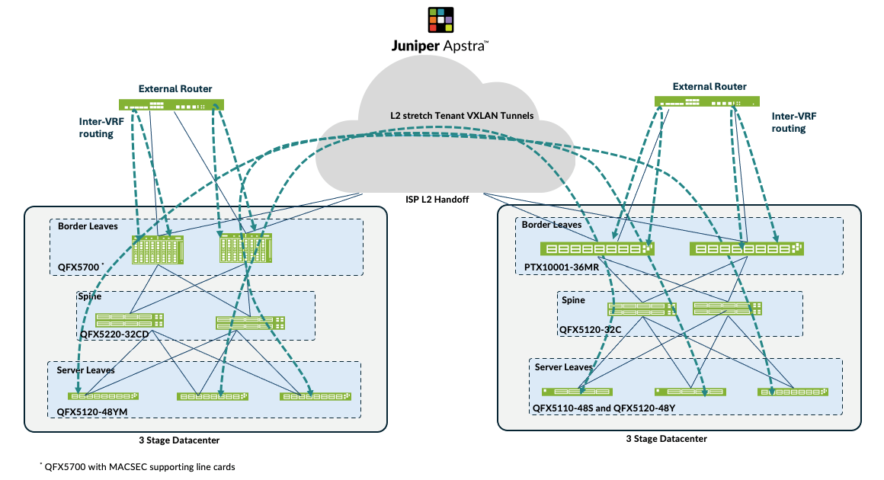
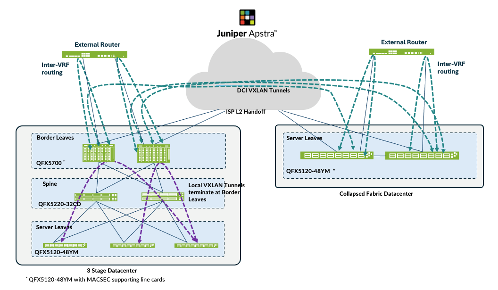
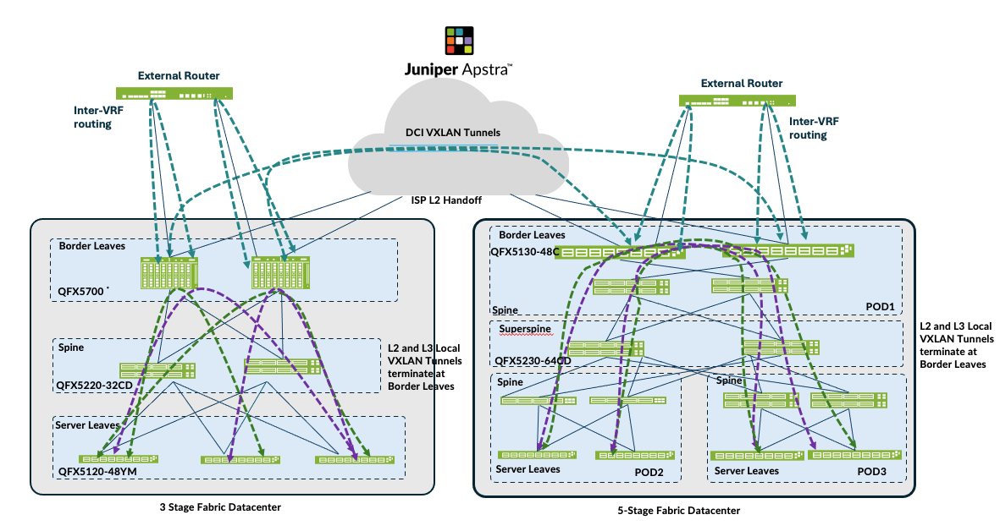

# Solution Overview — EVPN-VXLAN Data Center Interconnect (DCI)

> **JVD-DCI-MULTISITE-01-01** · Juniper Validated Design Extension (JVDE) · data center interconnect
> Source: *JVD Solution Overview: Datacenter Interconnect Design with Juniper Apstra* (juniper.net, V1.0/250315).
> Companion docs: [design-guide.md](design-guide.md) · [test-report-brief.md](test-report-brief.md) · [datasheet.md](datasheet.md)

## Executive summary

Data center operators must deliver and maintain a reliable network infrastructure while managing complexity and meeting scalability needs. Data centers host increasingly varied workloads with a growing diversity of networking requirements, and meeting those needs with bespoke designs introduces a unique troubleshooting burden on networking teams.

The **Data Center Interconnect (DCI) Design with Juniper Apstra** is a Juniper Validated Design Extension (JVDE) that provides organizations with methods to reliably interconnect multiple data centers built with Juniper hardware and deployed using the **3-Stage Data Center Design**, **5-Stage EVPN-VXLAN Data Center**, and **Collapsed Data Center Fabric** JVDs.

## Solution overview

The DCI design is an EVPN-VXLAN based design focused on interconnecting data centers built with Juniper Apstra on an **Edge-Routed Bridging (ERB)** foundation. It covers three interconnect techniques:

- **Over-the-Top (OTT)** — VXLAN tunnels are formed across **all** leaf devices spanning the two data centers. Because the number of tunnels grows with the VXLAN/VNI and tenant count, OTT is best suited to smaller data centers that are not prone to change.

  
  *Figure 1. Over-the-Top (OTT) design.*

- **Type 2 Seamless Stitching** — only a **subset** of VLAN/VNIs are selectively stretched between data centers. VXLAN tunnels are not formed automatically each time a new leaf is added (as with OTT), which improves scale performance and simplifies the Layer 2 extension configuration.

  
  *Figure 2. Type 2 seamless stitching.*

- **Type 2 and Type 5 Seamless Stitching** — an extension of Type 2 seamless stitching in which the **Layer 3 context** is also stretched across data centers. The 3-stage and 5-stage data centers are used to form this DCI design.

  
  *Figure 3. Type 2 and Type 5 seamless stitching.*

The OTT and Type 2 seamless stitching designs also include **MACSEC encryption** between border-leaf switch gateways, to encrypt traffic between data centers.

Juniper Apstra automation and network management fully support this design. As with all Juniper data center JVDs, the solution follows best practices as determined by Juniper's subject matter experts, and is the result of extensive consultation and testing to balance capability, performance, and cost efficiency for scalable data center deployments.

## Benefits

- **Repeatability** — prescriptive designs where all JVD customers benefit from lessons learned in worldwide deployments.
- **Reliability** — integrated best-practice designs tested with real-world traffic and described with measured results.
- **Velocity** — streamlined deployment with step-by-step guidance, automation, and prebuilt integrations.
- **Scale-appropriate** — selective L2/L3 VXLAN stretching lets operators match the interconnect technique to the size and change rate of each data center.
- **Security** — MACSEC encryption between border gateways protects inter-data-center traffic.

## Solution components

| Component | Software / version |
|-----------|--------------------|
| Juniper Apstra | 5.0.0-64 |
| Junos OS / Junos OS Evolved | 23.4R2-S4 |

The DCI JVDE builds on an ERB-based network architecture with spine, leaf, and border-leaf switches in a high-availability configuration. All hardware components and software versions are tested extensively with both simulated and real-world traffic.

## About Juniper Validated Designs

JVDs represent a cross-functional collaboration between Juniper's top subject matter experts, including product teams, solutions architects, support, development, and testing. A **JVDE (JVD Extension)** builds upon an existing JVD data center fabric to meet the requirements of a specific use case — here, interconnecting data centers — as a prescriptive, well-characterized building block that deploys quickly, simply, and reliably.

## Sources

- *JVD Solution Overview: Datacenter Interconnect Design with Juniper Apstra* — JVD-DCI-MULTISITE-01-01 (juniper.net Validated Designs).
- Companion: [design-guide.md](design-guide.md), [test-report-brief.md](test-report-brief.md), [datasheet.md](datasheet.md).
