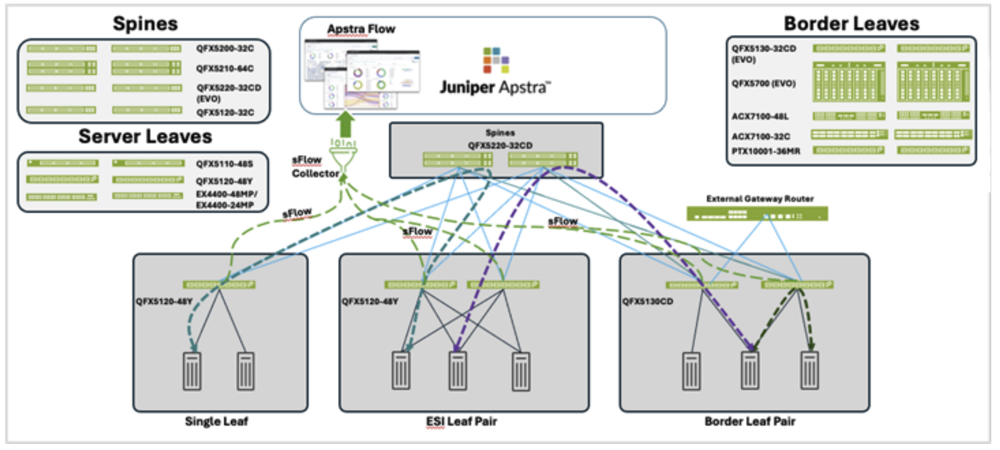

# EVPN-VXLAN Data Center sFlow with Juniper Apstra

Validated configurations for the Juniper Validated Design *"EVPN-VXLAN Data Center sFlow with Juniper Apstra."* This JVD extends the [3-stage data center design](../3stage_dc/) by adding sFlow telemetry export to **Juniper Apstra Flow**, providing real-time, packet-sampled visibility into traffic flowing through the EVPN-VXLAN fabric.

* JVD landing page: <https://www.juniper.net/documentation/us/en/software/jvd/jvd-sflow/jvd-evpn-vxlan-datacenter-sflow.pdf>

sFlow is enabled on every fabric switch via Apstra configlets. Each switch exports sampled packet headers and interface statistics over UDP to the Apstra Flow collector, which decodes the data and visualizes it through OpenSearch dashboards. The collector is reached over a dedicated revenue/WAN port (not the management interface), with the route advertised into the fabric by the default Apstra underlay policy.

## Hardware

This JVD takes a **swap-matrix approach** — for each role in a 3-stage ERB fabric, the same sFlow configuration was iteratively tested with several different platform models swapped into the rack. The configurations in this folder reflect those iterations: there is one config file per platform-per-role combination that was actually captured during testing.

| Role | Validated Platforms (configs included) | Software |
|---|---|---|
| Spine pair | **QFX5220-32CD** *(EVO)*, **QFX5220-128C** *(EVO)* | Junos OS Evolved 23.4R2-S5 |
| Server leaf 1 (single) | **QFX5120-48Y** | Junos OS 23.4R2-S5 |
| Server leaf 2/3 (ESI pair) | **QFX5120-48YM**, **QFX5110-48S**, **ACX7100-48L** *(EVO)* | Junos OS / Junos OS Evolved 23.4R2-S5 |
| Border leaf pair | **QFX5120-32C**, **QFX5700** *(EVO)*, **PTX10001-36MR** *(EVO)* | Junos OS / Junos OS Evolved 23.4R2-S5 |
| Apstra Flow collector | Juniper Apstra Flow (single-node VM) | Apstra 6.0.0-189, Apstra Flow 6.0.0 |

The JVD documentation also lists **QFX5120-48Y-8C**, **QFX5120-48YM-8C**, **ACX7100-32C**, and **MX304** (external gateway) as validated platforms; configurations for those platforms are not included in this folder. The JVD has also been re-validated against Junos OS / Junos OS Evolved 24.2R2 and 24.4R2 — the configs here were captured against 23.4R2-S5.

## Configurations

All configurations are in **set / display-set** format under `configuration/set/`.

| File | Role |
|---|---|
| [`spine1_qfx5220-32cd.set`](configuration/set/spine1_qfx5220-32cd.set) | Spine 1 (QFX5220-32CD variant) |
| [`spine2_qfx5220-32cd.set`](configuration/set/spine2_qfx5220-32cd.set) | Spine 2 (QFX5220-32CD variant) |
| [`spine1_qfx5220-128c.set`](configuration/set/spine1_qfx5220-128c.set) | Spine 1 (QFX5220-128C variant) |
| [`spine2_qfx5220-128c.set`](configuration/set/spine2_qfx5220-128c.set) | Spine 2 (QFX5220-128C variant) |
| [`server-leaf1_qfx5120-48y.set`](configuration/set/server-leaf1_qfx5120-48y.set) | Single server leaf |
| [`server-leaf2_qfx5120-48ym.set`](configuration/set/server-leaf2_qfx5120-48ym.set) | ESI server leaf 2 (QFX5120-48YM variant) |
| [`server-leaf3_qfx5120-48ym.set`](configuration/set/server-leaf3_qfx5120-48ym.set) | ESI server leaf 3 (QFX5120-48YM variant) |
| [`server-leaf2_qfx5110-48s.set`](configuration/set/server-leaf2_qfx5110-48s.set) | ESI server leaf 2 (QFX5110-48S variant) |
| [`server-leaf3_qfx5110-48s.set`](configuration/set/server-leaf3_qfx5110-48s.set) | ESI server leaf 3 (QFX5110-48S variant) |
| [`server-leaf2_acx7100-48l.set`](configuration/set/server-leaf2_acx7100-48l.set) | ESI server leaf 2 (ACX7100-48L variant) |
| [`server-leaf3_acx7100-48l.set`](configuration/set/server-leaf3_acx7100-48l.set) | ESI server leaf 3 (ACX7100-48L variant) |
| [`borderleaf1_qfx5120-32c.set`](configuration/set/borderleaf1_qfx5120-32c.set) | Border leaf 1 (QFX5120-32C variant) |
| [`borderleaf2_qfx5120-32c.set`](configuration/set/borderleaf2_qfx5120-32c.set) | Border leaf 2 (QFX5120-32C variant) |
| [`borderleaf1_qfx5700.set`](configuration/set/borderleaf1_qfx5700.set) | Border leaf 1 (QFX5700 variant) |
| [`borderleaf2_qfx5700.set`](configuration/set/borderleaf2_qfx5700.set) | Border leaf 2 (QFX5700 variant) |
| [`borderleaf1_ptx10001-36mr.set`](configuration/set/borderleaf1_ptx10001-36mr.set) | Border leaf 1 (PTX10001-36MR variant) |
| [`borderleaf2_ptx10001-36mr.set`](configuration/set/borderleaf2_ptx10001-36mr.set) | Border leaf 2 (PTX10001-36MR variant) |
