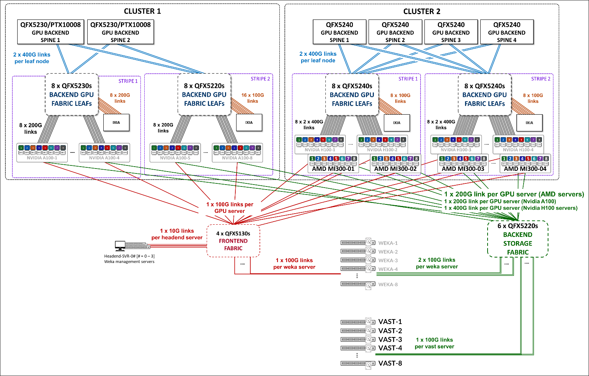

# AI/ML Data Center — Juniper Validated Designs

This folder collects validated configurations for **AI/ML data center fabrics** built on Juniper QFX-series switches.
The Juniper Validated Design (JVD) program publishes the matching test reports and design narratives at:

<https://www.juniper.net/documentation/validated-designs/us/en/data-center/>

## Architecture overview

AI/ML clusters typically use three independent fabrics, each tuned for a different traffic pattern:

| Fabric | Purpose | Traffic profile |
|---|---|---|
| **Backend (GPU)** | Inter-GPU communication for distributed training and inference (RoCEv2 / NCCL collectives) | East-west, lossless, micro-burst sensitive, 400/800 GE |
| **Frontend** | User / application access to the cluster, job orchestration, model serving | Standard north-south DC traffic |
| **Storage** | High-throughput access to training datasets, checkpoints, model artifacts | Bulk east-west, lossless |

A typical Juniper AI cluster uses a **rail-optimized stripe architecture** on the backend fabric so that GPUs in the same position across servers (a *rail*) all home into the same leaf, minimising hops for collective operations.



## What's in this folder

| Subfolder | Fabric | JVD |
|---|---|---|
| [`aiml_multitenancy_backend/`](aiml_multitenancy_backend/) | Backend (GPU) | EVPN/VXLAN GPU Backend Fabric for Multitenancy (GPUaaS) |

Frontend and storage fabric JVDs will be added as separate sibling folders following the same `aiml_<topic>_<fabric>/` naming pattern.

## Repo conventions for this folder

```
aidc/
├── README.md                              ← this file
├── images/                                ← cross-JVD diagrams
└── <jvd>/
    ├── README.md                          ← per-JVD overview, devices, links
    ├── images/                            ← per-JVD diagrams
    └── configuration/conf/                ← Junos hierarchical configs (*.conf)
        └── <role><n>_<platform>.conf     ← e.g. spine1_qfx5240-64od.conf
```

Configuration files use the Junos hierarchical (curly-brace) format, named `<role><n>_<platform>.conf` so they sort by role and self-document the device model.
