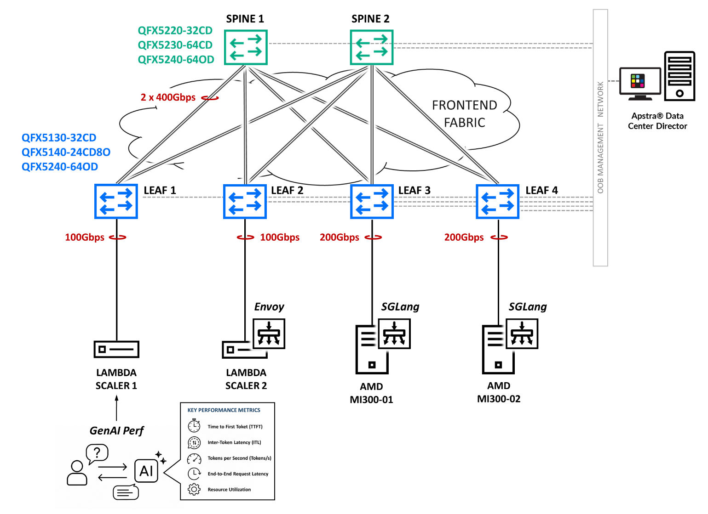

# AI Data Center Frontend Fabric for Inference

> Standards-based Ethernet frontend fabric for AI inference workloads with HPE Juniper QFX switches, Apstra Data Center Director, and AMD Instinct MI300X GPUs.

This JVD validates a production inference frontend fabric connecting inference clients, Envoy load balancers, and AMD MI300X GPU servers over a leaf-spine IP fabric managed by Juniper Apstra. The design demonstrates how a standards-based Ethernet frontend network supports predictable latency, scalable throughput, and operational visibility for production inference environments using SGLang serving framework.

This design complements the [AI/ML Multi-Tenancy Backend Fabric](../aiml_multitenancy_backend/) which validates the GPU-to-GPU backend network for training workloads.

* JVD document: <https://www.juniper.net/documentation/us/en/software/jvd/jvd-ai-dc-inference-apstra-amd/index.html>
* Solution overview: <https://www.juniper.net/documentation/us/en/software/jvd/sol-overview-ai-dc-inference-apstra-amd.pdf>
* Test report: <https://www.juniper.net/documentation/us/en/software/jvd/test-report-ai-dc-inference-apstra-amd.pdf>

## Hardware

The JVD validates multiple QFX platform options per role. The configurations included in this repository were captured using the platforms listed below; see the JVD document for the full validated platform matrix.

| Juniper Product | Role | Hostnames | Software |
|---|---|---|---|
| **QFX5220-32CD** | Frontend spine | `spine1`, `spine2` | Junos OS Evolved 25.2X100-D20.6-EVO |
| **QFX5130-32CD** | Frontend leaf | `leaf1`, `leaf2`, `leaf3`, `leaf4` | Junos OS Evolved 23.4R2-S5.4-EVO |

**Additional validated platforms (not included as separate configs):**

| Role | Also validated on |
|---|---|
| Frontend spine | QFX5230-64CD, QFX5240-64OD |
| Frontend leaf | QFX5140-24CD8O, QFX5240-64OD |

## Configurations

| File | Role |
|---|---|
| [`spine1_qfx5220-32cd.conf`](configuration/conf/spine1_qfx5220-32cd.conf) | Frontend spine 1 |
| [`spine2_qfx5220-32cd.conf`](configuration/conf/spine2_qfx5220-32cd.conf) | Frontend spine 2 |
| [`leaf1_qfx5130-32cd.conf`](configuration/conf/leaf1_qfx5130-32cd.conf) | Frontend leaf 1 — client-facing (Lambda Scaler / GenAI-Perf) |
| [`leaf2_qfx5130-32cd.conf`](configuration/conf/leaf2_qfx5130-32cd.conf) | Frontend leaf 2 — client-facing (Envoy load balancer) |
| [`leaf3_qfx5130-32cd.conf`](configuration/conf/leaf3_qfx5130-32cd.conf) | Frontend leaf 3 — GPU-facing (AMD MI300X server 1) |
| [`leaf4_qfx5130-32cd.conf`](configuration/conf/leaf4_qfx5130-32cd.conf) | Frontend leaf 4 — GPU-facing (AMD MI300X server 2) |
