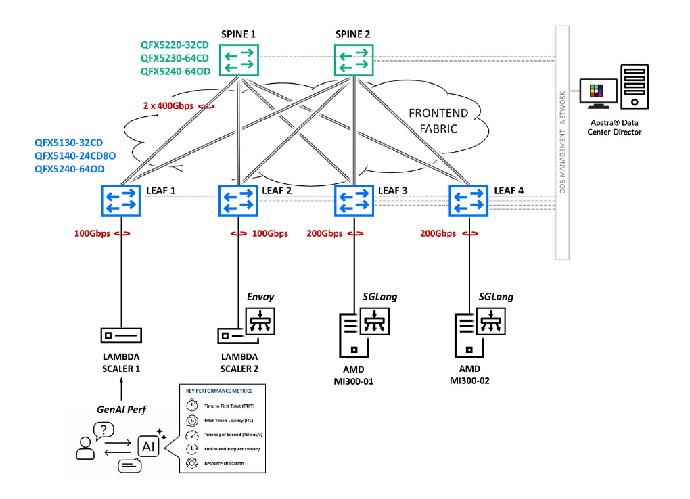
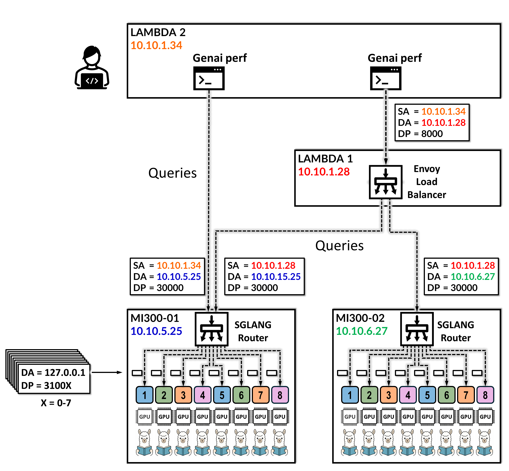

# Design Guide — AI Data Center Frontend Fabric for Inference

> **JVD-AICLUSTERDC-AIMLINF-01-01** · Juniper Validated Design · inference frontend fabric · Published 2026-06-12
> Source: *AI Data Center Frontend Fabric for Inference with HPE Juniper QFX switches, Apstra Data Center Director, and AMD Instinct MI300X GPUs — Juniper Validated Design (JVD)* (juniper.net).
> Companion docs: [solution-overview.md](solution-overview.md) · [test-report-brief.md](test-report-brief.md) · [datasheet.md](datasheet.md)

## About this document

This document describes the design requirements, architecture, implementation approach, and validation methodology for an **AI inference frontend fabric** built with HPE Juniper Networks QFX switches, HPE Juniper Apstra Data Center Director, and AMD Instinct™ MI300X GPU systems. This JVD also introduces the newest **QFX5140-24CD8O** switch as a key frontend leaf node for production AI inference deployments. All validation was conducted in Juniper's **AI Innovation Lab** (Sunnyvale, CA).

As inference deployments transition from experimentation to production, the frontend network becomes increasingly important in enabling reliable communication between inference clients, load balancing services, and GPU-accelerated compute infrastructure. This JVD demonstrates how a standards-based Ethernet frontend fabric can efficiently support AI inference workloads while maintaining predictable performance characteristics.

## Solution requirements

AI inference uses a trained model to generate predictions, responses, classifications, or other outputs from new input data. For Large Language Models (LLMs), inference typically means receiving a user prompt, processing it through a model-serving framework, and returning generated tokens. In production, the user experience is strongly influenced by how quickly the system begins responding, how smoothly tokens are generated, and how consistently the service performs under concurrent load — all of which depend on predictable network connectivity.

### Inference vs. training

Inference differs from model training in both workflow and network behavior. Training generates large volumes of GPU-to-GPU traffic across backend fabrics optimized for distributed communication. Inference, by contrast, is dominated by request/response traffic between clients, applications, API gateways, load balancers, and inference servers. For this reason the frontend fabric is evaluated primarily on predictable latency, scalable bandwidth, resilient connectivity, and operational visibility.

*Table 3 — AI training vs. AI inference traffic:*

| Characteristic | AI training | AI inference |
|----------------|-------------|--------------|
| Primary traffic pattern | GPU-to-GPU communication | Client/API-to-inference-server communication |
| Main fabric focus | GPU backend fabric | Frontend fabric |
| Communication model | Collective operations (all-reduce, all-to-all) | Request/response between clients, load balancers, model-serving endpoints |
| Typical technologies | RoCEv2, backend congestion control, rail optimization, lossless design | IP Ethernet frontend connectivity, request distribution, latency/throughput/observability |
| Performance indicators | Job/training time, collective performance, workload throughput | Time to first response, request latency, token throughput |

*Table 2 — solution requirements:*

| Area | Inference requirement | Frontend fabric impact |
|------|-----------------------|------------------------|
| Latency | Inference services must respond quickly | Predictable forwarding latency; avoid loss, queueing, congestion |
| Throughput | High request concurrency and token rates | Scalable bandwidth between clients, load balancers, servers |
| Request distribution | Services may scale across multiple GPU servers | Support direct endpoints and optional load balancing (Envoy) |
| Availability | Production- and user-facing services | Resilient paths, stable reachability, operational visibility |
| Operational simplicity | Easy to deploy, validate, monitor, scale | Intent-based automation and standardized fabric designs |

This JVD focuses specifically on the **frontend inference path**, where traffic is primarily composed of client requests, optional load balancer distribution, and response delivery. GPU-to-GPU communication, KV-cache traffic, and storage access are out of scope for this design.

## Validated models

*Table 4 — validated models:*

| Model | Role in validation | Expected inference characteristic |
|-------|--------------------|-----------------------------------|
| Llama 3.1 8B | Smaller LLM profile | Lower latency, higher concurrency, smaller memory footprint |
| Llama 3.3 70B | Larger-scale LLM profile | Higher compute and memory requirements |
| Qwen 2.5 72B | Alternative large-model architecture | Model diversity; advanced conversational/reasoning workloads |

Inference performance is validated using AMD Instinct™ MI300X GPU systems and **NVIDIA GenAI-Perf** as the benchmark load generation tool.

## Frontend fabric components

The frontend fabric includes hardware and software for switching, automation, compute, and application load balancing, plus the benchmarking components required to validate AI inference traffic.

*Table 6 — frontend fabric components:*

| Component | Role | Description |
|-----------|------|-------------|
| QFX5130-32CD · QFX5140-24CD8O · QFX5240-64OD | Frontend leaf node | Frontend connectivity for compute devices and client applications |
| QFX5220-32CD · QFX5230-64CD · QFX5240-64OD | Frontend spine node | Spine layer of the 3-stage Clos fabric; redundant high-speed leaf-spine connectivity |
| HPE Juniper Apstra Data Center Director | Intent-based automation | Simplifies fabric deployment and provides operational consistency |
| AMD Instinct MI300X GPU servers (×2) | Inference compute nodes | Each with eight AMD Instinct MI300X GPUs; run SGLang and host GPU-backed model-serving endpoints |
| ConnectX-7 NICs | Frontend NICs on MI300X | 400G frontend connectivity from the MI300X servers to the QFX fabric |
| Lambda scalers (×2) | Client / benchmark / load-balancing hosts | Dual RTX 5000 Ada GPUs and ConnectX-6 frontend NICs |
| Envoy Proxy | Optional load balancer | Scale-out request distribution across multiple MI300X inference servers |
| SGLang | Inference serving framework | Loads and runs validated LLMs on the MI300X systems; one local model instance per GPU |
| SGLang Router | Request routing | Receives inference requests (direct or via Envoy) and distributes them to local GPU-backed workers |
| NVIDIA GenAI-Perf | Inference load generation | Benchmark load generator in the validated lab environment |

The configuration files for these components are available in this repository under [`../configuration/conf/`](../configuration/conf/).

## Frontend fabric topology

The validated frontend fabric follows a **3-stage Clos leaf-spine IP fabric** architecture with a **3:1 subscription factor**. The validated topology includes **4 leaf nodes and 2 spine nodes**.

*Figure 2. AI Inference Frontend Fabric topology.*

- Each frontend leaf connects to both spine nodes using **2 × 400GbE** Ethernet links, providing redundant and scalable connectivity.
- The AMD Instinct MI300X GPU servers connect to **leaf nodes 3 and 4** using 400GbE links with ConnectX-7 NICs.
- The Lambda scaler devices running Envoy Proxy and GenAI-Perf connect to **leaf nodes 1 and 2** using 100GbE links with ConnectX-6 NICs.

HPE Juniper Apstra Data Center Director assigns the fabric IP addressing, autonomous system numbers, and other network parameters, then creates and deploys the configuration to each device. The point-to-point leaf-spine links are assigned **/31** addresses from the **10.0.5.0/24** range. The fabric uses **eBGP** between leaf and spine nodes to provide IP reachability, path redundancy, and equal-cost forwarding across the Clos topology.

> The complete rendered per-device configs live in [`../configuration/conf/`](../configuration/conf/), and the templated building blocks in [`../configuration/snips/`](../configuration/snips/).

## Validated inference flows

Inference traffic enters the frontend fabric from benchmark or client systems and is sent either directly to an inference server or to an Envoy load balancer. Two primary modes are validated:

*Figure 4. GenAI-Perf, Envoy, and SGLang inference traffic flow.*

### Single node inference

GenAI-Perf sends inference requests directly to an SGLang endpoint on a specific MI300X inference server. This mode establishes a single-server baseline and confirms the performance of an individual inference endpoint before introducing external load balancing.

*Table 7 — single node inference summary:*

| Field | Example / purpose |
|-------|-------------------|
| Source | GenAI-Perf client host (e.g. 10.10.1.34) |
| Destination | MI300X inference server (e.g. 10.10.5.25) |
| Destination port | 30000 (SGLang Router service port) |
| Traffic behavior | GenAI-Perf sends requests directly to one inference server |
| Purpose | Single-server baseline and isolated inference endpoint validation |

### Multinode (load balanced) inference

GenAI-Perf sends inference requests to an **Envoy** frontend endpoint rather than directly to an MI300X server. Envoy distributes requests across the available MI300X inference servers running model-serving endpoints. After a request reaches a server, the SGLang Router distributes it to local GPU-backed workers. This represents a production-style deployment where users access a single frontend service endpoint while inference capacity is distributed across multiple servers.

*Table 8 — multinode (load balanced) inference summary:*

| Field | Example / purpose |
|-------|-------------------|
| Source | GenAI-Perf client host (e.g. 10.10.1.34) |
| Frontend endpoint | Envoy load balancer (e.g. 10.10.1.28, port 8000) |
| Backend endpoints | MI300X inference servers running SGLang (e.g. 10.10.5.25 and 10.10.6.27, port 30000) |
| Traffic behavior | GenAI-Perf sends requests to Envoy; Envoy forwards requests to inference servers |
| Purpose | Scale-out inference validation across multiple inference servers |

### SGLang Router and worker behavior

Each AMD Instinct MI300X system runs SGLang in **data-parallel serving mode** — the selected LLM is loaded once per GPU, giving eight local GPU-backed model instances per server. Each server runs one **SGLang Router**, which listens for inference requests on the service port (port 30000 in the test diagram) and forwards each request to a local worker. Each worker hosts one model instance on one GPU, listening on loopback addressing with ports in the 3100X range (X = local worker index). Worker traffic is local to the MI300X server and is **not** frontend fabric traffic — the frontend fabric validation focuses on the client-to-router or Envoy-to-router path.

## Benchmark testing methodology

The methodology uses NVIDIA GenAI-Perf to generate high volumes of inference for each validated model, over both single node and multinode load balanced scenarios. For each run, the following GenAI-Perf parameters were adjusted to optimize each test scenario (primary objective: minimize TTFT):

- **Concurrency** — number of simultaneous inference requests / active request streams.
- **Number of requests** — total requests generated during the run.
- **Input Sequence Length (ISL)** — input tokens submitted per request (prompt length).
- **Output Sequence Length (OSL)** — output tokens generated per response.
- **Warm-up** — initial requests used to prepare the service before collecting final results.

Collected inference performance metrics include Time to First Token (TTFT), Time to First Output (TTFO), Request Latency, Time to Second Token (TTST), Inter-Token Latency (ITL), Output Tokens per Second (TPS), Output Tokens per Second per User, and Request Throughput. Full test results are in [test-report-brief.md](test-report-brief.md).

## Validated hardware and software components

*Table 13 — validated hardware and software:*

| Device / software | Role | Version / release |
|-------------------|------|--------------------|
| QFX devices | Frontend leaf and spine nodes | Junos OS Evolved 25.2X100-D20.4-EVO |
| AMD MI300X server | Inference GPU server | Ubuntu 22.04.5 LTS (6.8.0-111-generic) |
| HPE Juniper Apstra Data Center Director | Fabric automation and operations | 6.1 |
| SGLang | Inference serving framework | 0.4.5 |
| SGLang Router | Request routing across local GPU-backed workers | 0.1.4 |
| Envoy Proxy Service | Load balancing across MI300X inference servers | 1.35.3 |
| NVIDIA GenAI-Perf | Inference benchmark load generator | 0.0.11 |
| Models | Inference workloads | Llama 3.1 8B · Llama 3.3 70B · Qwen 2.5 72B |

> The versions above are the latest validated configuration for this JVD. Different hardware models and software versions may be tested and added to future design recommendations. See juniper.net for the current support matrix.

## Validated optics summary

*Table 14 — validated frontend fabric optics (representative):*

| Component optics | Device role | Peer optics | Peer role |
|------------------|-------------|-------------|-----------|
| QSFP-100GBASE-SR4 (QFX5130-32CD / QFX5140-24CD8O / QFX5240-64OD) | Leaf node | QSFP-100GBASE-SR4 (lambda-scaler) | Envoy / GenAI-Perf client |
| QSFP56-DD-400GBASE-DR4 (leaf) | Leaf node | QSFP56-DD-400GBASE-DR4 (QFX5220-32CD / QFX5230-64CD / QFX5240-64OD) | Spine node |
| OSFP-800G-DR8-2-P (leaf) | Leaf node | QSFP56-DD-400GBASE-DR4 (spine) | Spine node |
| QSFP-400G-DR4-2 (QFX5140-24CD8O) | Leaf node | QSFP-400G-DR4-2 (AMD MI300 ConnectX-7) | GPU server |

See the published JVD document for the full optics matrix.

## Recommendations

- Use **QFX5130-32CD, QFX5140-24CD8O, or QFX5240-64OD** as frontend leaf nodes.
- Use **QFX5220-32CD, QFX5230-64CD, or QFX5240-64OD** as frontend spine nodes.
- Use **HPE Juniper Apstra Data Center Director** to automate deployment and monitor the frontend fabric.
- Implement the minimum recommended software releases: all QFX devices on **Junos OS Evolved 25.2X100-D20.4-EVO**; Apstra Data Center Director **6.1**.
- To replicate the benchmark testing, use SGLang 0.4.5, SGLang Router 0.1.4, Envoy Proxy 1.35.3, NVIDIA GenAI-Perf 0.0.11, and the Llama 3.1 8B, Llama 3.3 70B, and Qwen 2.5 72B models.

## Revision history

| Date | Version | Description |
|------|---------|-------------|
| June 2026 | JVD-AICLUSTERDC-AIMLINF-01-01 | Initial JVD. |

## Sources

- *AI Data Center Frontend Fabric for Inference with HPE Juniper QFX switches, Apstra Data Center Director, and AMD Instinct MI300X GPUs — Juniper Validated Design (JVD)*, JVD-AICLUSTERDC-AIMLINF-01-01, published 2026-06-12 (juniper.net Validated Designs).
- Rendered configs: [`../configuration/conf/`](../configuration/conf/) · Templated snips: [`../configuration/snips/`](../configuration/snips/).
- Companion: [solution-overview.md](solution-overview.md), [test-report-brief.md](test-report-brief.md), [datasheet.md](datasheet.md).
