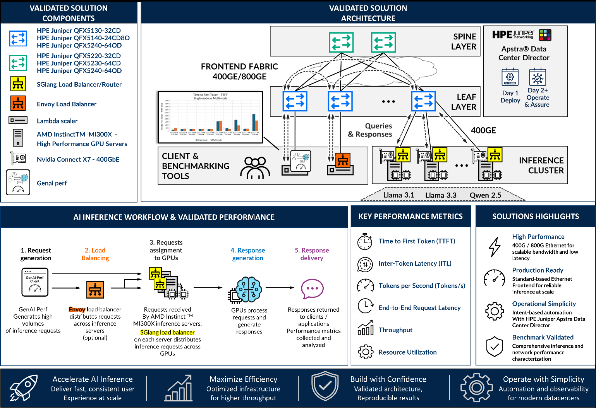

# Solution Overview — AI Data Center Frontend Fabric for Inference

> **JVD-AICLUSTERDC-AIMLINF-01-01** · Juniper Validated Design · inference frontend fabric
> Source: *JVD Solution Overview: AI Data Center Frontend Fabric for Inference with HPE Juniper QFX switches, Apstra Data Center Director, and AMD Instinct MI300X GPUs* (juniper.net, V1).
> Companion docs: [design-guide.md](design-guide.md) · [test-report-brief.md](test-report-brief.md) · [datasheet.md](datasheet.md)

## Executive summary

Modern AI inference environments require predictable latency, scalable throughput, and efficient resource utilization to support high query volumes while maintaining a consistent user experience. As inference deployments transition from experimentation to production, the frontend network becomes increasingly important in enabling reliable communication between inference clients, load balancing services, and GPU-accelerated compute infrastructure.

The AI Inference Network Design with **HPE Juniper QFX switches**, **HPE Juniper Apstra Data Center Director**, and **AMD Instinct™ MI300X GPUs** demonstrates how a standards-based Ethernet frontend fabric can efficiently support AI inference workloads while maintaining predictable performance characteristics. The architecture is designed to provide low latency, scalable bandwidth, and predictable request handling for production inference environments.

This solution provides a benchmark-focused reference architecture for high-performance AI inference and demonstrates how modern Ethernet-based frontend networks can support production inference deployments. It introduces the **HPE Juniper QFX5140-24CD8O** as a frontend fabric leaf platform optimized for production inference deployments.

*Figure 1. AI Inference Network Design with Juniper QFX switches and AMD Instinct™ MI300X GPUs — solution summary.*

## Solution overview

This solution characterizes AI inference performance using AMD Instinct™ MI300X GPU systems, modern inference frameworks, and industry-standard benchmarking tools including **NVIDIA GenAI-Perf**. To characterize performance across multiple inference scenarios, it validates a range of commonly deployed Large Language Models (LLMs) with varying sizes and inference characteristics:

- **Llama 3.1 8B** — smaller models optimized for lower latency and higher request concurrency.
- **Llama 3.3 70B** — larger-scale models with increased compute and memory requirements.
- **Qwen 2.5 72B** — alternative large-model architectures for advanced conversational and reasoning workloads.

By validating multiple models across different parameter sizes, the solution demonstrates frontend fabric behavior under a range of inference conditions, helping customers understand the relationship between model scale, request concurrency, GPU utilization, and network performance.

## Validated fabric

The validated frontend fabric follows a scalable **3-stage Clos Ethernet IP fabric** design with the following leaf and spine devices:

| Validated leaf nodes | Validated spine nodes |
|----------------------|-----------------------|
| HPE Juniper QFX5130-32CD | HPE Juniper QFX5220-32CD |
| HPE Juniper QFX5140-24CD8O | HPE Juniper QFX5230-64CD |
| HPE Juniper QFX5240-64OD | HPE Juniper QFX5240-64OD |

Connectivity between the leaf and spine nodes uses **400GbE and 800GbE** Ethernet links, enabling high-bandwidth communication between inference clients, load balancing services, and GPU inference systems. AMD Instinct™ MI300X GPU servers connect to the fabric using **400GbE** links with ConnectX-7 NICs.

## Benchmark methodology

Benchmark testing evaluates the following inference-serving metrics:

| Metric category | Key metric | Purpose |
|-----------------|------------|---------|
| Responsiveness | Time to First Token (TTFT) | How quickly the system begins returning a response after a request is submitted. |
| Throughput | Output Tokens per Second (TPS) | How efficiently the system generates output tokens. |

The benchmarking methodology uses **NVIDIA GenAI-Perf** to generate a high volume of inference requests toward the AMD Instinct™ MI300X GPU inference servers. Although GenAI-Perf originates from the NVIDIA ecosystem, it is used here as a vendor-neutral inference benchmarking framework, selected for its maturity, feature completeness, and successful operational integration within the validated Juniper lab environment.

Testing included sending inference requests directly to an individual inference server — where the **SGLang Router** distributes the requests to the GPUs on that system — or through an **Envoy** load balancer that distributes requests across multiple inference servers.

## Benefits

- **Qualified deployments** — prescriptive, best-practice blueprints that deploy quickly and reliably.
- **Scalable** — high-bandwidth 400G/800G frontend connectivity that scales beyond the initial design.
- **Predictable user experience** — focuses on latency-sensitive inference metrics that influence user-perceived responsiveness.
- **Standards-based Ethernet** — uses a standards-based IP Ethernet fabric, avoiding dependency on specialized RDMA mechanisms in the validated inference path.
- **Operational simplicity** — HPE Juniper Apstra Data Center Director provides intent-based deployment, validation, and operations.
- **Benchmark reproducibility** — documents benchmark tools, software stack, test matrix, and telemetry for repeatable inference performance validation.

## Sources

- *JVD Solution Overview: AI Data Center Frontend Fabric for Inference with HPE Juniper QFX switches, Apstra Data Center Director, and AMD Instinct MI300X GPUs* — JVD-AICLUSTERDC-AIMLINF-01-01 (juniper.net Validated Designs).
- Companion: [design-guide.md](design-guide.md), [test-report-brief.md](test-report-brief.md), [datasheet.md](datasheet.md).
