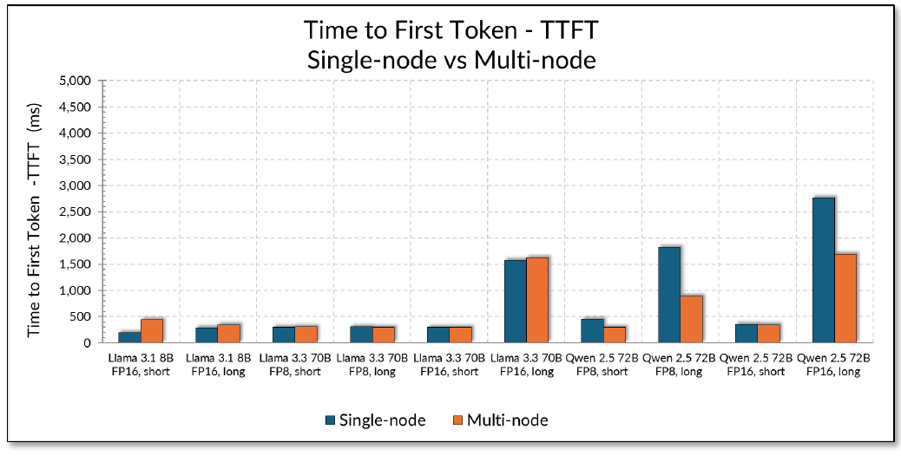
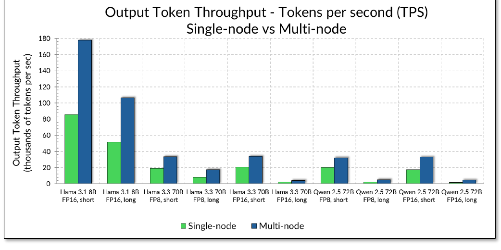

# Test Report Brief — AI Data Center Frontend Fabric for Inference

> **JVD-AICLUSTERDC-AIMLINF-01-01** · Juniper Validated Design · inference frontend fabric
> Source: *JVD Test Report Brief: AI Data Center Frontend Fabric for Inference with HPE Juniper QFX switches, Apstra Data Center Director and AMD Instinct MI300X GPUs* (juniper.net, V1).
> Companion docs: [solution-overview.md](solution-overview.md) · [design-guide.md](design-guide.md) · [datasheet.md](datasheet.md)

## Introduction

This report summarizes the validation testing performed for the AI Data Center Frontend Fabric for Inference solution using HPE Juniper Networks QFX switches, HPE Juniper Apstra Data Center Director, and AMD Instinct MI300X GPU systems. The purpose is to characterize high-performance AI inference behavior across a standards-based frontend IP Ethernet fabric across both single node and multinode inference scenarios. In both scenarios, inference request/response traffic is generated by NVIDIA GenAI-Perf and frontend fabric behavior is observed during benchmark execution.

## Test goals

1. Characterize inference performance across the validated frontend IP fabric.
2. Validate the **QFX5140-24CD8O** as a frontend leaf platform for production AI inference deployments.
3. Measure inference-serving metrics — Time to First Token, Inter-Token Latency, Tokens per Second, End-to-End Request Latency, concurrency, and request success rate.

**Non-goals:** GPU backend fabric validation; storage backend fabric validation; DCQCN/PFC/ECN and fabric load-balancing tuning for frontend inference traffic.

## Test environment

The environment includes HPE Juniper QFX frontend leaf and spine switches, HPE Juniper Apstra Data Center Director for fabric automation, two AMD Instinct MI300X GPU inference servers (ConnectX-7 NICs), two Lambda Scaler systems hosting GenAI-Perf and Envoy, and the SGLang serving framework with SGLang Router. See [design-guide.md](design-guide.md) for the full component table.

## Validated topology and platforms

The validated topology is a **3-stage Clos frontend IP fabric** with **four leaf nodes and two spine nodes**. Each frontend leaf connects to both spines using 2 × 400GbE links; MI300X GPU servers connect to the leaf using 400GbE links with ConnectX-7 NICs; the Lambda Scaler systems connect using 100GbE links with ConnectX-6 NICs. HPE Juniper Apstra Data Center Director creates and deploys the configuration to each device, and the fabric uses eBGP between leaf and spine nodes.

*Table 2 — validated QFX platforms:*

| Validated leaf nodes | Validated spine nodes |
|----------------------|-----------------------|
| HPE Juniper QFX5130-32CD | HPE Juniper QFX5220-32CD |
| HPE Juniper QFX5140-24CD8O | HPE Juniper QFX5230-64CD |
| HPE Juniper QFX5240-64OD | HPE Juniper QFX5240-64OD |

## Validated test scenarios

| Test scenario | Traffic path |
|---------------|--------------|
| Single node (direct path) | GenAI-Perf sends requests directly to the SGLang Router on one AMD MI300X server; the router distributes the load across that server's GPUs. |
| Multinode (Envoy load balanced path) | GenAI-Perf sends requests to an Envoy frontend endpoint; Envoy distributes them across two AMD MI300X servers running SGLang, and each server's SGLang Router distributes across its GPUs. |

## Validated AI models

Ten model / precision / context combinations were evaluated, each tested over both the direct single node path and the multinode Envoy path (20 test cases total).

| Model | Precision | Context |
|-------|-----------|---------|
| Llama 3.1 8B | FP16 | Short, Long |
| Llama 3.3 70B | FP16 | Short, Long |
| Llama 3.3 70B | FP8 | Short, Long |
| Qwen 2.5 72B | FP16 | Short, Long |
| Qwen 2.5 72B | FP8 | Short, Long |

Using different precision (FP8 vs FP16) and context profiles (short vs long) characterizes inference behavior under different workload conditions. Short context ≈ ISL/OSL of 100/100 tokens; long context ≈ ISL 1500 with OSL 200–1200 tokens (RAG-style summarization).

## Inference performance results

*Table 5 — inference performance results summary (20 test cases):*

| ID | Path | Model | TTFT [ms] | Req. latency [ms] | ITL [ms] | Output TPS | Req. throughput [req/s] |
|----|------|-------|-----------|-------------------|----------|------------|-------------------------|
| T1 | Single node | Llama 3.1 8B FP16, short | 190.08 | 3173.36 | 27.43 | 85 721.93 | 776.89 |
| T2 | Multinode | Llama 3.1 8B FP16, short | 442.04 | 3093.96 | 24.37 | 177 829.57 | 1609.84 |
| T3 | Single node | Llama 3.1 8B FP16, long | 286.22 | 5083.30 | 20.95 | 51 727.87 | 224.33 |
| T4 | Multinode | Llama 3.1 8B FP16, long | 347.73 | 5469.77 | 22.47 | 106 404.06 | 463.66 |
| T5 | Single node | Llama 3.3 70B FP8, short | 302.97 | 7834.20 | 66.39 | 19 262.77 | 167.85 |
| T6 | Multinode | Llama 3.3 70B FP8, short | 309.99 | 7508.15 | 63.41 | 33 646.61 | 292.72 |
| T7 | Single node | Llama 3.3 70B FP8, long | 307.94 | 10 805.95 | 45.25 | 8 225.00 | 35.26 |
| T8 | Multinode | Llama 3.3 70B FP8, long | 299.63 | 11 571.46 | 48.51 | 17 350.18 | 74.27 |
| T9 | Single node | Llama 3.3 70B FP16, short | 303.24 | 10 527.16 | 90.54 | 20 851.89 | 182.45 |
| T10 | Multinode | Llama 3.3 70B FP16, short | 296.62 | 8921.99 | 76.26 | 33 846.52 | 295.58 |
| T11 | Single node | Llama 3.3 70B FP16, long | 1581.20 | 11 854.66 | 44.25 | 2 389.38 | 10.25 |
| T12 | Multinode | Llama 3.3 70B FP16, long | 1627.09 | 11 303.53 | 41.67 | 4 163.57 | 17.84 |
| T13 | Single node | Qwen 2.5 72B FP16, short | 355.00 | 10 998.06 | 93.56 | 17 400.53 | 151.32 |
| T14 | Multinode | Qwen 2.5 72B FP16, short | 351.24 | 8342.92 | 70.27 | 33 016.80 | 287.21 |
| T15 | Single node | Qwen 2.5 72B FP16, long | 2767.29 | 13 478.27 | 46.59 | 1 701.57 | 7.34 |
| T16 | Multinode | Qwen 2.5 72B FP16, long | 1694.95 | 11 845.93 | 44.14 | 4 490.07 | 19.17 |
| T17 | Single node | Qwen 2.5 72B FP8, short | 449.90 | 9876.75 | 90.51 | 20 302.38 | 188.83 |
| T18 | Multinode | Qwen 2.5 72B FP8, short | 296.85 | 7619.54 | 70.48 | 32 073.03 | 297.49 |
| T19 | Single node | Qwen 2.5 72B FP8, long | 1821.54 | 9182.83 | 55.77 | 1 862.82 | 10.27 |
| T20 | Multinode | Qwen 2.5 72B FP8, long | 887.67 | 7122.58 | 38.52 | 4 969.92 | 27.11 |

> Note: single node = direct SGLang path using one MI300X server; multinode = Envoy load balanced path using both MI300X servers.

### Results analysis

The validated frontend network supported inference interactions between the GenAI-Perf client, Envoy load balancer, and SGLang inference servers across both scenarios, providing the IP connectivity required for request generation, distribution, response delivery, and metric collection. No frontend-fabric behavior prevented successful benchmark execution or scale-out comparison. The analysis focuses on two primary metrics: **Time to First Token (TTFT)** — the most visible responsiveness metric — and **Output Tokens per Second (TPS)** — the primary serving-capacity metric.

Measured values are generally aligned with expected AMD Instinct MI300X behavior. Short-context workloads produced lower TTFT and higher throughput; larger models and long-context workloads produced higher TTFT and lower throughput due to increased prefill, memory, and compute requirements. Results should be interpreted as **benchmark characterization** rather than universal model-performance limits — the most meaningful comparisons are matched single node/multinode pairs, short vs long context within a model family, and FP16 vs FP8 for comparable scenarios.

### Time to First Token

*Figure 5. Time to First Token by model — single node SGLang vs multinode Envoy.*

Short-context workloads generally delivered the best responsiveness, most completing TTFT in the few-hundred-millisecond range. Long-context tests showed higher TTFT — especially for Llama 3.3 70B and Qwen 2.5 72B — because long-context requests require more input-token (prefill) processing before the first output token. The multinode Envoy path improved TTFT in several larger-model scenarios (e.g. Qwen 2.5 72B FP8 long improved from 1821.54 ms to 887.67 ms), where distributing the workload across two MI300X servers reduced per-server pressure. TTFT did not improve in every multinode scenario because several multinode tests used different concurrency and request counts to evaluate scale-out behavior; TTFT and TPS should be read together.

> TTFT values were measured from the benchmark client within the validated test environment. They do not include WAN, internet, client-to-cloud, security gateway, or application-layer delay present in a production deployment.

### Output token throughput

*Figure 6. Output token throughput by model — single node SGLang vs multinode Envoy.*

Multinode Envoy load balanced inference increased throughput for **every** matched model and context profile, validating the expected scale-out behavior: adding inference nodes behind Envoy increases aggregate output-token capacity. Llama 3.1 8B FP16 delivered the highest throughput (smallest model), scaling from 85 721.93 tok/s single node to 177 829.57 tok/s multinode (~2.07× — near-linear). Short-context tests generally produced higher TPS than long-context. Precision effects were workload-dependent: FP8 improved throughput for some large-model scenarios (e.g. Qwen 2.5 72B short single node improved from 17 400.53 to 20 302.38 tok/s, ~16.7%), but did not universally outperform FP16 — precision should be validated per model and workload.

### Frontend network observations

The validated frontend fabric supported the tested inference traffic paths with successful request generation, distribution, response delivery, and metric collection across both scenarios. This report does not claim a maximum frontend-fabric utilization limit; a formal network-bottleneck analysis would require correlated fabric telemetry (link utilization, errors, drops, retransmissions, queue depth, congestion indicators) during the runs.

## Conclusion

The HPE Juniper QFX-based frontend IP fabric supports high-performance AI inference traffic between NVIDIA GenAI-Perf clients, optional Envoy load balancing, and AMD Instinct MI300X inference servers running SGLang, across both single node and multinode scenarios. The primary conclusion is that the frontend architecture supports **scale-out inference** — adding a second MI300X server behind Envoy increased aggregate output token throughput across every validated model and context profile. The **QFX5140-24CD8O** is validated as a frontend leaf platform for production inference, while HPE Juniper Apstra Data Center Director provides intent-based fabric deployment and operational visibility.

## Appendix — validated software versions

| Software | Role | Version |
|----------|------|---------|
| QFX devices | Frontend leaf and spine nodes | 25.2X100-D20.4-EVO |
| AMD MI300X server | Inference GPU server | Ubuntu 22.04.5 LTS (6.8.0-111-generic) |
| HPE Juniper Apstra Data Center Director | Fabric automation and operations | 6.1 |
| SGLang | Inference serving framework | 0.4.5 |
| SGLang Router | Request routing across local GPU-backed workers | 0.1.4 |
| Envoy Proxy Service | Load balancing across MI300X inference servers | 1.35.3 |
| NVIDIA GenAI-Perf | Inference benchmark load generator | 0.0.11 |
| Models | Inference workloads | Llama 3.1 8B · Llama 3.3 70B · Qwen 2.5 72B |

Representative GenAI-Perf commands, request-parameter definitions, model aliases, the full benchmark scenario matrix (concurrency / request count / ISL / OSL / warm-up per test case), and metric definitions are documented in the published test report appendices.

## Sources

- *JVD Test Report Brief: AI Data Center Frontend Fabric for Inference with HPE Juniper QFX switches, Apstra Data Center Director and AMD Instinct MI300X GPUs* — JVD-AICLUSTERDC-AIMLINF-01-01 (juniper.net Validated Designs).
- Configs: [`../configuration/conf/`](../configuration/conf/) · [`../configuration/snips/`](../configuration/snips/).
- Companion: [solution-overview.md](solution-overview.md), [design-guide.md](design-guide.md), [datasheet.md](datasheet.md).
