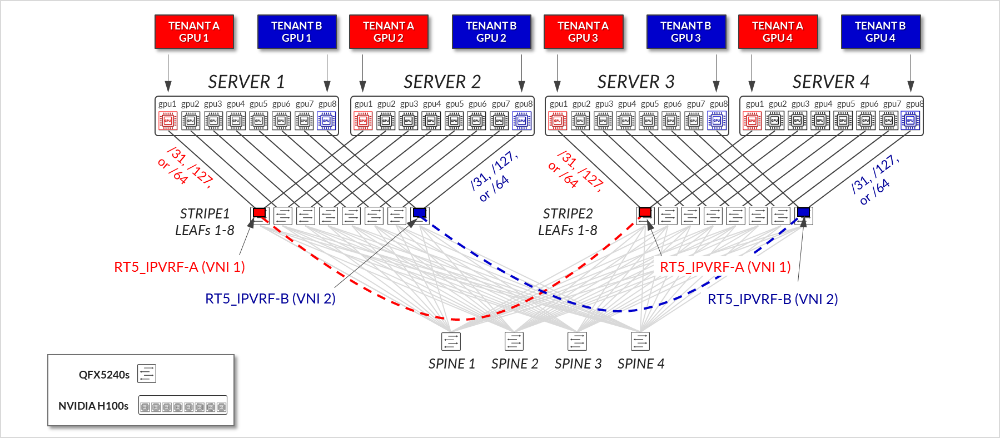

# EVPN/VXLAN GPU Backend Fabric for Multitenancy (GPUaaS)

Validated configurations for the **GPU backend fabric** described in the Juniper Validated Design
*"AI Data Center Multitenancy with EVPN/VXLAN."*

* JVD landing page: <https://www.juniper.net/documentation/us/en/software/jvd/jvd-ai-dc-evpn-multitenancy/index.html>
* Backend fabric design: <https://www.juniper.net/documentation/us/en/software/jvd/jvd-ai-dc-evpn-multitenancy/evpnvxlan_gpu_backend_fabric_gpu_multitenancy.html>

## What this JVD validates

GPU as a Service (GPUaaS) requires that **multiple tenants share the same physical GPU backend fabric** while remaining logically isolated from one another. This JVD validates an EVPN/VXLAN design that delivers that isolation using:

* **EVPN Type-5 (IP-VRF) routes** — one IP-VRF per tenant, mapped to its own L3 VNI
* **Per-tenant VLAN/VNI** on the leaf-to-server links so each GPU lands in its tenant's bridge domain
* **Symmetric IRB** routing on the leaves so inter-rail / inter-stripe GPU traffic stays inside the tenant's IP-VRF end-to-end
* **A Rail-Optimized Stripe topology** so GPUs in the same position across servers home into the same leaf, keeping collective traffic local where possible



## Devices

All devices in this configuration set are **Juniper QFX5240-64OD** (64 × 800 GE, breakable to 128 × 400 GE) running Junos EVO. Each box uses the full 400 GE port range (`et-0/0/0`–`et-0/0/65`).

The published config set is a representative slice of the rail-optimized fabric: **2 stripes × 2 leaves per stripe + 4 spines** (the full lab topology described in the JVD scales to 8 leaves per stripe).

| File | Hostname in config | Role |
|---|---|---|
| [`configuration/conf/spine1_qfx5240-64od.conf`](configuration/conf/spine1_qfx5240-64od.conf) | `spine1` | Backend spine 1 |
| [`configuration/conf/spine2_qfx5240-64od.conf`](configuration/conf/spine2_qfx5240-64od.conf) | `spine2` | Backend spine 2 |
| [`configuration/conf/spine3_qfx5240-64od.conf`](configuration/conf/spine3_qfx5240-64od.conf) | `spine3` | Backend spine 3 |
| [`configuration/conf/spine4_qfx5240-64od.conf`](configuration/conf/spine4_qfx5240-64od.conf) | `spine4` | Backend spine 4 |
| [`configuration/conf/leaf1_qfx5240-64od.conf`](configuration/conf/leaf1_qfx5240-64od.conf) | `GPU-R1-L1` | Stripe 1, leaf 1 |
| [`configuration/conf/leaf2_qfx5240-64od.conf`](configuration/conf/leaf2_qfx5240-64od.conf) | `GPU-R1-L2` | Stripe 1, leaf 2 |
| [`configuration/conf/leaf3_qfx5240-64od.conf`](configuration/conf/leaf3_qfx5240-64od.conf) | `GPU-R2-L1` | Stripe 2, leaf 1 |
| [`configuration/conf/leaf4_qfx5240-64od.conf`](configuration/conf/leaf4_qfx5240-64od.conf) | `GPU-R2-L2` | Stripe 2, leaf 2 |

## Topology and scaling

The rail-optimized stripe building block in this design:

* 8 leaves per stripe (1 leaf per GPU rail; each server has 8 GPUs)
* 4 spines providing inter-stripe connectivity
* All server-to-leaf links are 400 GE; all leaf-to-spine links are 800 GE
* Per-stripe bandwidth at 1:1 subscription on QFX5240-64OD: 25.6 Tbps server-to-leaf, 25.6 Tbps leaf-to-spine

Maximum GPUs supported per stripe by leaf platform:

| Leaf platform | 400 GE ports | Max servers / stripe (1:1) | Max GPUs / stripe (8 GPUs/server) |
|---|---:|---:|---:|
| QFX5220-32CD | 32 | 16 | 128 |
| QFX5230-64CD | 64 | 32 | 256 |
| **QFX5240-64OD** | **128** | **64** | **512** |

See the [backend fabric design page](https://www.juniper.net/documentation/us/en/software/jvd/jvd-ai-dc-evpn-multitenancy/evpnvxlan_gpu_backend_fabric_gpu_multitenancy.html) for the full rail/stripe sizing model and the multi-stripe scaling math.

## Layout

```
aiml_multitenancy_backend/
├── README.md
├── images/
└── configuration/conf/   ← Junos EVO hierarchical configs
```
