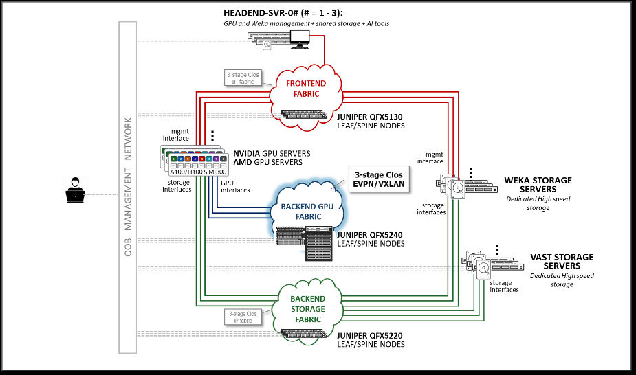
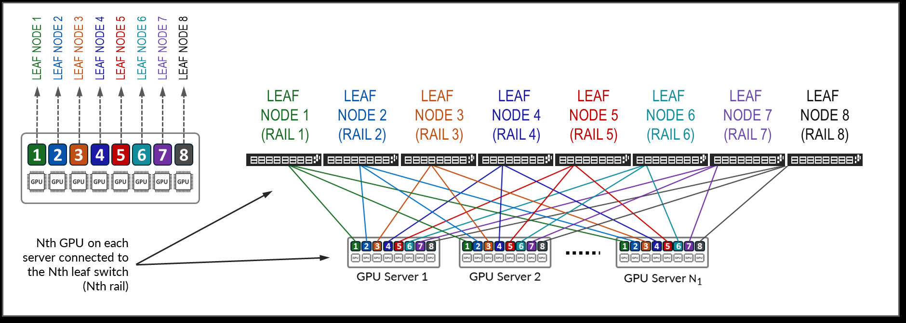

# Design Guide — AI Data Center Multitenancy with EVPN/VXLAN

> **JVD-AICLUSTERDC-EVPNType5-01-04** · Juniper Validated Design · GPU backend fabric (GPUaaS) · Published 2025-10-29
> Source: *AI Data Center Multitenancy with EVPN/VXLAN — Juniper Validated Design (JVD)* (juniper.net, 279 pp).
> Companion docs: [solution-overview.md](solution-overview.md) · [test-report-brief.md](test-report-brief.md) · [datasheet.md](datasheet.md)

## About this document

This document describes the design requirements and implementation of an AI cluster infrastructure that supports **GPU multitenancy in the GPU backend fabric using EVPN/VXLAN**, built on AI-optimized Juniper **QFX5240-series** switches. The validated cluster includes **NVIDIA H100 DGX** and **AMD MI300X** GPU servers and **Vast Storage** systems. All validation was conducted in Juniper's AI Innovation Lab (Sunnyvale, CA), running both customer models and MLCommons MLPerf benchmarks. The design employs a **3-stage Clos IP fabric** with QFX-series leaf and spine nodes and multi-vendor GPU servers and storage.

## Solution benefits

JVDs are prescriptive, fully tested, documented blueprints. Core benefits: **Qualified deployments** (best-practice blueprints), **Scalable** (beyond the initial design, multiple platforms), **Risk mitigation** (right products, software versions, architecture, deployment steps), and **standards-based** (no vendor lock-in across frontend, GPU backend, and storage backend fabrics).

## AI use case and reference design

The AI JVD reference design is a complete end-to-end Ethernet-based AI infrastructure of **three symbiotic fabrics**:

- **Frontend fabric** — the gateway network from the AI tools on the head-end servers to the GPU and storage nodes; lets users initiate/visualize training and inference, and provides an out-of-band path for NVIDIA **NCCL** and AMD **RCCL** collectives.
- **GPU backend fabric** *(this JVD)* — connects the GPU nodes and transfers high-speed data between GPUs during training jobs in a **lossless** manner using **RoCEv2** (RDMA over Converged Ethernet v2).
- **Storage backend fabric** — connects high-availability storage systems and the GPUs that consume training data.

## Solution architecture

### Rail-Optimized Stripe Architecture

A **rail-optimized stripe** architecture maximizes performance with minimal bandwidth contention, latency, and network interference. Two concepts:

- **Rail** — connects GPUs of the same position (order N) across all servers to leaf node N. GPUs on a server are numbered 1–8 by position.
- **Stripe** — a building block of a group of leaf nodes + GPU servers, replicated to scale the cluster. Because a GPU server typically has **8 GPUs**, a stripe typically has **8 leaf nodes (8 rails)**.

The maximum servers per stripe is bounded by the leaf's port count/speed, maintaining a **1:1 subscription** (half the leaf ports face servers, half face spines):

*Table 5 — Max GPUs per stripe (1:1 subscription):*

| Leaf model | 400GE ports | Servers/stripe | GPUs/stripe |
|------------|-------------|----------------|-------------|
| QFX5220-32CD | 32 | 16 | 128 |
| QFX5230-64CD | 64 | 32 | 256 |
| QFX5240-64OD | 128 (64×800GE → 2×400GE) | 64 | 512 |

### Multitenancy models

Tenant separation is implemented at the leaf nodes, slightly differently per model:

- **Server Isolation** — one or more whole servers assigned to a tenant.
- **GPU Isolation** — individual GPUs within a server assigned to different tenants.

### EVPN-VXLAN approaches

Two approaches provide tenant isolation: **pure Type-5** (IP-VRFs only) and **VLAN-aware** (MAC-VRFs + symmetric IRB). This JVD's primary implementation is **pure Type-5** — best for large-scale AI training where jobs span many servers and GPUs communicate directly over IP. Congestion control is **VXLAN-aware DCQCN** across the shared fabric.

## Solution implementation (Type-5 EVPN/VXLAN)

The implementation body (guide pp. 47–183) is a step-by-step build; the **complete rendered per-device configs live in [`../configuration/conf/`](../configuration/conf/)** and the templated building blocks in [`../configuration/snips/`](../configuration/snips/). Summary of the validated implementation:

- **Underlay:** IPv6 link-local (unnumbered) fabric with **eBGP auto-discovery** peering — no per-link addressing.
- **Overlay:** eBGP EVPN with **Type-5 (IP-prefix) routes**, one **IP-VRF per tenant** mapped to its own L3 VNI. IPv6 overlay is primary; **IPv4 overlay is advertised with IPv6 next-hops per RFC 5549** (Appendix A).
- **GPU-server addressing:** **IPv6 SLAAC** (autoconfigured) — the leaf advertises the tenant prefix via IPv6 Router Advertisement; static IPv4/IPv6 are also supported.
- **Forwarding plane:** IP reachability between IP-VRF instances; symmetric routing keeps inter-rail / inter-stripe tenant traffic inside the tenant's IP-VRF end-to-end.
- **Congestion management:** **DCQCN** (PFC + ECN) for a lossless fabric; **DLB** (Dynamic Load Balancing) instead of traditional ECMP.

> **Control-plane variants** (guide appendices): **A** — IPv4 overlay over IPv6 underlay (RFC 5549); **B** — IPv4 overlay over IPv4 underlay; **C** — IPv6 overlay with static addresses over IPv6 underlay; **D** — running NCCL tests with autoconfigured IPv6.

The building blocks — per-tenant Type-5 VRFs, IRB tenant gateways, GPU-server links, eBGP fabric underlay + EVPN overlay, RoCEv2 lossless CoS, DLB flowlet — are captured as reusable templates in the [snip library](../configuration/snips/) and are generatable via the [portal Config Generator](https://juniper.github.io/jvd/portal/#generator) or the [BYOAI assistant](../configuration/snips/byoai/README.md).

## Telemetry and monitoring

The design includes telemetry for the RoCEv2/AI fabric — buffer-monitor, L2-learning telemetry, LLDP, and gRPC streaming (see the guide's Telemetry and Monitoring section and the [snip library](../configuration/snips/) `oam/` + `bootstrap/` categories).

## JVD hardware and software components

*Table 51 — Validated devices and positioning:*

| Fabric | Leaf | Spine |
|--------|------|-------|
| Frontend | QFX5130-32CD | QFX5130-32CD |
| **GPU Backend** | **QFX5240-64OD** | **QFX5240-64CD** |
| Storage Backend | QFX5220-32CD · QFX5230-64CD · QFX5240-64CD | QFX5220-32CD · QFX5230-64CD · QFX5240-64CD |

*Table 52 — Platform recommended release:* QFX5240-64CD GPU-backend leaf **and** spine → **Junos OS Evolved 23.4X100-D31**. (Minimum releases for QFX5220-64CD, QFX5230-64CD, and PTX10008 in the GPU backend are covered in the companion *AI DC Network with Apstra, NVIDIA GPUs, and WEKA Storage* JVD.)

## Validation framework, goals & scope

Testing focused on the **GPU Backend fabric with EVPN/VXLAN and EVPN BGP Type-5 routes**, IPv6 BGP-unnumbered underlay, and both IPv4 (RFC 5549) and IPv6 overlays — validating connectivity between GPU servers and leaves, fabric operations, congestion management, and load balancing for lossless RDMA. See [test-report-brief.md](test-report-brief.md) for platforms, scale, and results.

## Recommendations

- **A minimum of 4 spines per fabric.** Under certain dual-failure + congestion scenarios a 2-spine fabric becomes susceptible to PFC storms (not vendor-unique); deploy 4 spines (as in the QFX5240 cluster) even with different switch models.
- Follow a **rail-optimized fabric** with a **1:1 subscription** and leaf-to-GPU symmetry.
- Implement **DLB** instead of traditional ECMP for optimal load distribution.
- Implement **DCQCN (PFC + ECN)** for a lossless GPU backend (and storage backend as vendor-recommended).
- Configure DCQCN (PFC + ECN) on the servers and set the **NCCL_SOCKET** interface to the management (frontend) interface.
- **Recommended Junos OS release: 23.4X100-D31.6-EVO** for the Juniper QFX5240-64CD.

## Revision history

| Date | Version | Description |
|------|---------|-------------|
| Sep 2025 | JVD-AICLUSTERDC-EVPNType5-01-04 | Replaced VRFs on GPU servers with `rio-prefix` under IPv6 Router Advertisement; moved IPv4 content to Appendix A |
| Aug 2025 | …-01-03 | Added AMD Pollara NIC references and RCCL description in *Tested Optics* |
| Jun 2025 | …-01-02 | New IPv6 SLAAC content for GPU-server addressing; how to run a job using IPv6 |
| May 2025 | …-01-01 | Initial publish |

## Sources

- *AI Data Center Multitenancy with EVPN/VXLAN — Juniper Validated Design (JVD)*, JVD-AICLUSTERDC-EVPNType5-01-04, published 2025-10-29 (juniper.net Validated Designs).
- Rendered configs: [`../configuration/conf/`](../configuration/conf/) · Templated snips: [`../configuration/snips/`](../configuration/snips/).
- Companion: [solution-overview.md](solution-overview.md), [test-report-brief.md](test-report-brief.md), [datasheet.md](datasheet.md).
