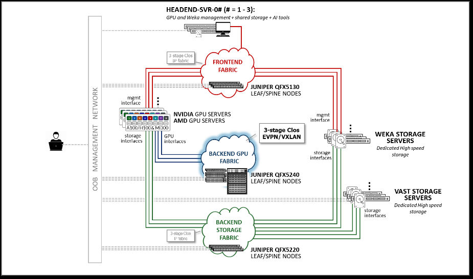
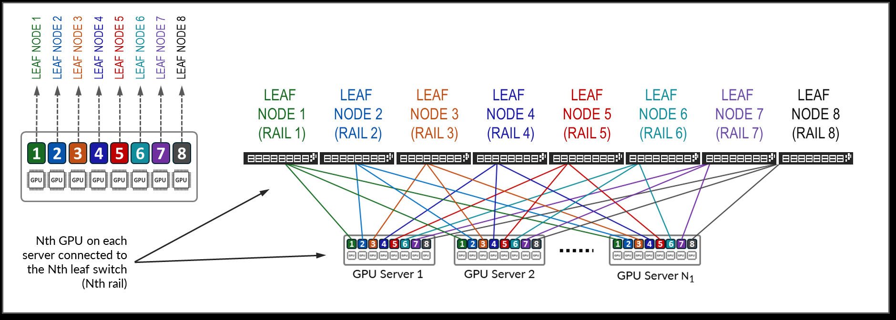

>
> Faithful markdown conversion of the published PDF:
> [AI Data Center EVPN/VXLAN GPU Backend Fabric with GPU Multitenancy — Juniper Validated Design (JVD)](https://www.juniper.net/documentation/us/en/software/jvd/ai-dc-evpn-multitenancy/index.html).
> The PDF on juniper.net is the source of truth. The design narrative and design
> tables are reproduced here in full. The conceptual design diagrams and the
> exhaustive per-device configuration (underlay/overlay, servers/storage, fabric
> devices, telemetry) and Appendices A–D are summarized here and linked out to the
> published PDF and to [`../configuration/conf/`](../configuration/conf/), which
> holds the complete validated configurations.

# AI Data Center EVPN/VXLAN GPU Backend Fabric with GPU Multitenancy — Juniper Validated Design (JVD)

Juniper Networks Validated Designs provide you with a comprehensive, end-to-end
blueprint for deploying Juniper solutions in your network. These designs are
created by Juniper's expert engineers and tested to ensure they meet your
requirements. Using a validated design, you can reduce the risk of costly
mistakes, save time and money, and ensure that your network is optimized for
maximum performance.

## About this Document

This document describes the design requirements and implementation of an AI
cluster infrastructure that includes support for GPU multitenancy in the GPU
backend fabric, using EVPN/VXLAN. This fabric is built based on AI-optimized
Juniper Data Center QFX5240 series switches. The cluster includes Nvidia H100 DGX
as well as AMD MI300X GPU servers, and Vast Storage systems.

All validation tests were conducted in Juniper's AI Innovation Lab in Sunnyvale,
CA, USA. In this open lab, Juniper collaborates closely with customers and
technology partners to develop AI solutions and test deployments for a range of AI
applications and models.

The AI Innovation Lab allows customers to see AI training and inference in action.
Juniper performs these tests running both customer-specific models as well as
those from MLCommons for MLPerf performance benchmarking and comparisons.

## Solution Benefits

Juniper Networks has excelled in building and supporting AI networks following a
scalable, robust, and automated approach suitable for a range of cluster sizes.
Unlike proprietary solutions that lock in enterprises and can stifle AI
innovation, Juniper's standards-based solution assures the fastest innovation,
maximizes design flexibility, and prevents vendor lock-in on the Frontend, GPU
Backend, and Storage Backend AI fabric networks.

The Juniper Validated Design (JVD) for AI describes a structured approach for
deploying high-performance AI training and inference networks that minimize job
completion time and maximize GPU performance. Additionally, it incorporates
industry's best practices, and leverages Juniper's extensive expertise in building
high-performance data center networks.

The design employs a 3-stage Clos IP fabric architecture, utilizing Juniper
QFX-series switches as leaf and spine nodes and multi-vendor GPU servers and
storage devices.

The solution has been extensively tested and thoroughly documented by Juniper
subject matter experts, resulting in a validated design that is easy to follow,
guarantees successful implementation, and simplified management and
troubleshooting tasks. This document provides comprehensive guidance on how to
deploy this solution, with clear descriptions of its components and step by step
instructions to connect and configure them.

### Juniper Validated Design Benefits

JVDs are prescriptive blueprints for building data center fabrics using
repeatable, validated, predictable, and well documented network architecture
solutions with guidelines for a successful deployment. Each solution has been
designed, fully tested, and documented by Juniper Networks experts with all the
necessary implementation details, including hardware components, software
versions, connectivity, and configuration steps.

To become a validated solution (JVD) and be approved for release, a solution must
pass rigorous testing with real-world workloads and applications. All features
must satisfy operational and performance criteria in real-world scenarios. Testing
not only includes validating the design topology and configuration steps, but also
that all products in the JVD work together as expected, thereby mitigating
potential risks while deploying the solution.

The core benefits of JVDs solutions can be summarized as:

- **Qualified Deployments** — Qualified network design blueprints for data center
  fabrics, that follow best practices and meet the requirements of each specific
  use case, and make the solution deployment quicker, simpler, and more reliable.
- **Scalable** — Solutions that can scale beyond the initial design and support the
  adoption of different hardware platforms based on customer requirements.
- **Risk Mitigation** — Prescriptive implementation guidelines guarantee that you
  have the right products, the right software versions, optimal architecture, and
  comprehensive deployment steps.
- **Systematically Verified** — Tested solutions using a suite of automated testing
  tools validate the performance and reliability of all the components.
- **Predictability** — Detailed testing and careful documentation of the solution,
  including the capabilities and limitations of its components, guarantees that the
  solution will operate as expected when implemented according to the JVD
  guidelines.
- **Repeatability** — Unlocked value with repeatable network designs due to the
  prescriptive nature of JVD designs as well as their applicability to common use
  cases in the data center environment. All JVD customers benefit from lessons
  learned through lab testing and real-world deployments.
- **Reliability** — Tested with real traffic, JVD solutions are qualified to operate
  as designed after deployment and with real-world traffic.
- **Accelerated Deployment** — Ease installation with step-by-step guidance
  automation, and prebuilt integrations simplifies and accelerates deployment,
  while reducing risks.
- **Accelerated Decision-Making** — Predefined combination of products, software,
  and architecture removes the need to spend time comparing products, and deciding
  how the network should be built.
- **Best Practice Networks** — Better outcomes for a better experience. Juniper
  Validated Designs have known characteristics and performance profiles to help you
  make informed decisions about your network.

## AI Use Case and Reference Design

The AI JVD Reference Design covers a complete end-to-end ethernet-based AI
infrastructure, which includes the Frontend fabric, GPU Backend fabric and Storage
Backend fabric. These three fabrics have a symbiotic relationship, while each
provides unique functions to support AI training and inference tasks. The use of
Ethernet Networking in AI Fabrics enables our customers to build high-capacity,
easy-to-operate network fabrics that deliver the fastest job completion times,
maximize GPU utilization, and use limited IT resources.

The AI JVD reference design shown in Figure 1 includes:

- **Frontend Fabric:** This fabric is the gateway network to the GPU nodes and
  storage nodes from the AI tools residing in the headend servers. The Frontend GPU
  fabric allows users to interact with the GPU and storage nodes to initiate
  training or inference workloads and to visualize their progress and results, and
  provides an out-of-band path for both NVIDIA Collective Communications Library
  (NCCL) and RCCL (ROCm Communication Collectives Library).
- **GPU Backend Fabric:** This fabric connects the GPU nodes (which perform the
  computation tasks for AI workflows). The GPU Backend fabric transfers high-speed
  information between GPUs during training jobs, in a lossless matter. Traffic
  generated by the GPUs is transferred using RoCEv2 (RDMA over Ethernet v2).
- **Storage Backend Fabric:** This fabric connects the high-availability storage
  systems (which hold the large model training data) and the GPUs (which consume
  this data during training or inference jobs). The Storage Backend fabric transfers
  high volumes of data in a seamless and reliable matter.


*Figure 1: AI JVD Reference Design.*

### Frontend Overview

The AI Frontend encompasses the interface, tools, and methods that enable users to
interact with the AI systems, and the infrastructure that allows these
interactions. The Frontend gives users the ability to initiate training or
inference tasks, and to visualize the results, while hiding the underlying
technical complexities. The key components of the Frontend systems include:

- **Model Scheduling:** Tools and methods for managing scripted AI model jobs,
  commonly based on SLURM (Simple Linux Utility for Resource Management) Workload
  Manager. These tools enable users to send instructions, commands, and queries,
  either through a shell CLI or a graphical web-based interface, to orchestrate
  learning and inference jobs running on the GPUs. In the AI JVD, these tools are
  hosted on the Headend Servers connected to the AI Frontend fabric.
- **Management of AI Systems:** Tools for managing (configuring, monitoring and
  performing maintenance tasks) the AI storage and processing components. Examples
  include SLURM, TensorFlow, PyTorch, and Scikit-learn.
- **Management of Fabric Components:** Mechanisms and workflows designed to help
  users deploy and manage fabric devices, including device onboarding, configuration
  management, and fabric deployment orchestration.
- **Performance Monitoring and Error Analysis:** Telemetry systems tracking key
  performance metrics related to AI models (accuracy, precision, recall, and
  compute/GPU utilization) and providing insight into error rates and failure
  patterns during training and inference.
- **Data Visualization:** Applications and tools that allow users to visually
  comprehend insights generated by AI models and workloads.
- **User Interface:** Routing and switching infrastructure that allows communication
  between the user interface applications and the AI systems executing the jobs,
  including GPUs and storage devices.
- **GPU-to-GPU control:** Communication establishment and information exchange
  including QP GIDs (Global IDs), local and remote buffer addresses, and RDMA keys
  (RKEYs for memory access permissions).

### GPU Backend Overview

The GPU Backend for AI encompasses the devices that execute learning and inference
jobs (the GPU servers where data processing occurs) and the infrastructure that
allows the GPUs to communicate with each other to complete the jobs. The key
components include:

- **AI Systems:** Specialized hardware such as GPUs and TPUs that execute numerous
  calculations concurrently. GPUs are particularly adept at handling AI workloads,
  including the complex matrix multiplications and convolutions required to complete
  learning and inference tasks.
- **AI Software:** Operating systems, libraries, and frameworks essential for
  developing and executing AI models, including **Data Management** (preprocessing
  and transformation of training data) and **Model Management** (evaluation,
  selection, and deployment).
- **GPU Backend Fabric:** Routing and switching infrastructure that allows
  GPU-to-GPU communication for workload distribution, memory sharing, synchronization
  of model parameters, and exchange of results — in most cases providing lossless
  connectivity for GPU-to-GPU traffic.

### Storage Backend Overview

The AI storage backend encompasses the hardware and software components for
storing, retrieving, and managing the vast amounts of data involved in AI
workloads, and the infrastructure that allows the GPUs to communicate with these
storage components. The key aspects include:

- **High-Performance Storage Devices:** Optimized for high I/O throughput, which is
  essential for the intensive data processing requirements of AI tasks such as deep
  learning. These devices must provide **Data Management Capabilities** (efficient
  querying, indexing, and retrieval) and **Scalability** (accommodating growing data
  volumes).
- **Storage Backend Fabric:** Routing and switching infrastructure that provides the
  connectivity between the GPU and storage devices, ensuring data can be efficiently
  transferred between storage and computational resources.

## Solution Architecture

The three fabrics described in the previous section (Frontend, GPU Backend, and
Storage Backend) are interconnected together in the overall AI JVD solution
architecture as shown in Figure 2.

*Figure 2: AI JVD Solution Architecture (see the [published PDF](https://www.juniper.net/documentation/us/en/software/jvd/ai-dc-evpn-multitenancy/index.html)).*

### Frontend Fabric

For details about connecting Nvidia A100 and H100 GPU servers, as well as Weka
Storage devices, to the Frontend Fabric, see the Frontend Fabric section of the AI
Data Center Network with Juniper Apstra, NVIDIA GPUs, and Weka Storage JVD. For
details about connecting AMD MI300x GPU servers to the Frontend Fabric, see the
Frontend Fabric section of the AI Data Center Network with Juniper Apstra, AMD GPUs,
and Vast Storage JVD.

### Storage Backend Fabric

In small clusters, it may be sufficient to use the local storage on each GPU
server, or to aggregate this storage together using open-source or commercial
software. In larger clusters with heavier workloads, an external dedicated storage
system is required to provide dataset staging for ingest, and for cluster
checkpointing during training. Two leading platforms, WEKA and Vast Storage,
provide cutting-edge solutions for shared storage in GPU environments, and have
been tested in the AI lab. For details about connecting these storage devices,
refer to the Storage fabric sections of the respective NVIDIA/WEKA and AMD/Vast AI
Data Center Network JVDs.

### GPU Backend Fabric

The GPU Backend fabric provides the infrastructure for GPUs to communicate with
each other within a cluster, using RDMA over Converged Ethernet (RoCEv2). RoCEv2
enhances data center efficiency, reduces complexity, and optimizes data delivery
across high-speed Ethernet networks.

Packet loss can significantly impact job completion times and therefore should be
avoided. When designing the compute network infrastructure to support RoCEv2 for an
AI cluster, one of the key objectives is to provide a near lossless fabric, while
also achieving maximum throughput, minimal latency, and minimal network
interference for the AI traffic flows. RoCEv2 is more efficient over lossless
networks, resulting in optimum job completion times. The GPU Backend fabric in this
JVD was designed with these goals in mind.

We have built two different Clusters, as shown in Figure 3, which share the
Frontend fabric and Storage Backend fabric but have separate GPU Backend fabrics.
Each cluster is made of two stripes following the Rail Optimized Stripe
Architecture, but includes different switch models as Leaf and Spine nodes, as well
as different GPU server models.

*Figure 3: AI JVD Lab Clusters (see the [published PDF](https://www.juniper.net/documentation/us/en/software/jvd/ai-dc-evpn-multitenancy/index.html)).*

The GPU Backend in **Cluster 1** consists of Juniper QFX5220 and QFX5230 switches as
leaf nodes, and either QFX5230 switches or PTX10008 routers as spine nodes, along
with NVIDIA A100 GPU servers. The GPU backend fabric in this cluster follows a
3-stage Clos IP fabric architecture. The GPU Backend in **Cluster 2** consists of
Juniper QFX5240 switches acting as both leaf and spine nodes, along with AMD MI300X
and NVIDIA H100 GPU servers. This cluster supports either a 3-stage IP fabric
architecture or a 3-stage EVPN/VXLAN fabric architecture. **The EVPN/VXLAN-based
implementation is the focus of this document.**

## Solution Implementation

The Frontend and Storage Backend fabrics are not covered in detail here, as they
remain unchanged and are fully documented in the referenced AI Data Center Network
JVDs (NVIDIA/WEKA and AMD/Vast). The remainder of this document focuses on the GPU
Backend fabric implementation using the EVPN/VXLAN architecture.

## EVPN/VXLAN GPU Backend Fabric — GPU Multitenancy

### GPU Multitenancy (GPU as a Service – GPUaaS)

GPU as a Service (GPUaaS) is a model where GPU compute resources are provided on
demand to users or applications, similar to other utility-style computing services.
Rather than dedicating entire servers or clusters to a single team or purpose,
GPUaaS allows resources to be dynamically allocated based on current workload
requirements. Tenants can request specific numbers of GPUs, often across multiple
servers, and use them for tasks such as AI training, data analytics, or
visualization. The service abstracts the underlying infrastructure, providing users
with a seamless and scalable experience while maintaining secure and efficient
resource isolation.

GPU multitenancy is a resource management approach that allows multiple tenants to
use GPU resources independently within a shared infrastructure. Instead of assigning
all the GPUs in a server to a single tenant, GPU multitenancy enables more flexible
allocation, where one or more GPUs on a server can be reserved for different
tenants. Each tenant operates in a logically isolated environment, with clear
separation of compute resources, network paths, and associated configurations.

Together, GPU multitenancy and GPUaaS enable high efficiency, better resource
utilization, and operational simplicity. While multitenancy handles the secure and
flexible slicing of GPU resources, GPUaaS delivers these slices as consumable
services, scaling compute capacity up or down as needed.

### Types of GPU multitenancy

**Server Isolation:** In a server isolation model, each tenant is allocated one or
more entire servers. All GPUs within those servers are exclusively dedicated to a
single tenant, ensuring full physical and logical separation from other tenants.
This model simplifies resource allocation and minimizes the risk of cross-tenant
interference, making it well suited for workloads that require predictable
performance and strict isolation (Figure 4).

**GPU Isolation:** In a GPU isolation model, individual GPUs within a server are
assigned to different tenants. This allows multiple tenants to securely share the
same physical server, with each tenant accessing only the GPUs allocated to them.
The underlying fabric provides logical separation and guarantees isolation at the
GPU level, enabling greater flexibility and higher utilization of resources (Figure
5).

*Figures 4 and 5: GPU as a Service — Server Isolation and GPU Isolation (see the
[published PDF](https://www.juniper.net/documentation/us/en/software/jvd/ai-dc-evpn-multitenancy/index.html)).*

### GPU Backend Fabric for Multitenancy Architecture

The design of the GPU Backend Fabric for Multitenancy follows a 3-stage Clos,
rail-optimized stripe architecture using EVPN/VXLAN. This approach enables
high-performance communication between GPUs assigned to the same tenant while
ensuring traffic isolation between tenants, for both Server Isolation and GPU
Isolation.

*Figures 6, 7, 8: GPU Backend Fabric Architecture and EVPN/VXLAN connectivity for
Server Isolation and GPU Isolation (see the [published PDF](https://www.juniper.net/documentation/us/en/software/jvd/ai-dc-evpn-multitenancy/index.html)).*

The devices that are part of the GPU Backend fabric in the AI Lab, and the
connections between them, are summarized in Table 1 and Table 2.

#### Table 1: GPU Backend devices per Stripe

| Stripe | GPU Servers | GPU Backend Leaf nodes switch model | GPU Backend Spine nodes switch model |
|--------|-------------|-------------------------------------|--------------------------------------|
| 1 | MI300X x 2 (MI300X-01 & MI300X-02); H100 x 2 (H100-01 & H100-02) | QFX5240-64OD x 8 (gpu-backend-001_leaf#; #=1-8) | QFX5240-64OD x 4 (gpu-backend-spine#; #=1-4) |
| 2 | MI300X x 2 (MI300X-03 & MI300X-04); H100 x 2 (H100-01 & H100-02) | QFX5240-64OD x 8 (gpu-backend-002_leaf#; #=1-8) | |

All the Nvidia H100 and AMD MI300X GPU servers are connected to the GPU backend
fabric using 400GE interfaces.

#### Table 2: GPU Backend connections between servers, leaf nodes and spine nodes

| Stripe | GPU Servers ⇔ GPU Backend Leaf Nodes | GPU Backend Leaf Nodes ⇔ GPU Backend Spine Nodes |
|--------|--------------------------------------|--------------------------------------------------|
| 1 | 8 (GPUs/server) × 1 (400GE server-to-leaf link) × 4 (servers) = 32 × 400GE links | 8 (leaf nodes) × 2 (400GE links per leaf-to-spine) × 4 (spine nodes) = 64 × 400GE links |
| 2 | 8 × 1 × 4 = 32 × 400GE links | 8 × 2 × 4 = 64 × 400GE links |

The speed and number of links between the GPU servers and leaf nodes, and between
the leaf and spine nodes, determines the oversubscription factor. The bandwidth
between the servers and the leaf nodes is 25.6 Tbps (Table 3), while the bandwidth
available between the leaf and spine nodes is 51.2 Tbps (Table 4). This means the
fabric has enough capacity to process all traffic between the GPUs even when this
traffic is 100% inter-stripe, and has extra capacity to accommodate 4 more servers.
With 4 additional servers the subscription factor would be 1:1 (no oversubscription).

#### Table 3: Per stripe Server to Leaf Bandwidth

| Stripe | Number of servers per Stripe | Number of 400 GE server⇔leaf links per server | Server ⇔ Leaf Link Bandwidth [Gbps] | Total Servers ⇔ Leaf Links Bandwidth per stripe [Tbps] |
|--------|------------------------------|------------------------------------------------|-------------------------------------|--------------------------------------------------------|
| 1 | 4 | 8 | 400 Gbps | 4 × 8 × 400 Gbps = 12.8 Tbps |
| 2 | 4 | 8 | 400 Gbps | 4 × 8 × 400 Gbps = 12.8 Tbps |
| **Total Server ⇔ Leaf Bandwidth** | | | | **25.6 Tbps** |

#### Table 4: Per stripe Leaf to Spine Bandwidth

| Stripe | Number of leaf nodes | Number of spine nodes | Number of 800 GE leaf⇔spine links per leaf node | Link Bandwidth [Gbps] | Bandwidth Leaf ⇔ Spine Per Stripe [Tbps] |
|--------|----------------------|-----------------------|-------------------------------------------------|-----------------------|------------------------------------------|
| 1 | 8 | 4 | 1 | 800 Gbps | 8 × 4 × 1 × 800 Gbps = 25.6 Tbps |
| 2 | 8 | 4 | 1 | 800 Gbps | 8 × 4 × 1 × 800 Gbps = 25.6 Tbps |
| **Total Leaf ⇔ Spine Bandwidth** | | | | | **51.2 Tbps** |

### Backend GPU Rail Optimized Stripe Architecture

A Rail Optimized Stripe Architecture provides efficient data transfer between GPUs,
especially during computationally intensive tasks such as AI Large Language Models
(LLM) training workloads. A Rail Optimized topology aims to maximize performance by
providing minimal bandwidth contention, minimal latency, and minimal network
interference.

In a Rail Optimized Stripe Architecture there are two important concepts: **rail**
and **stripe**. The GPUs on a server are numbered 1–8, where the number represents
the GPU's position in the server (Figure 9). A **rail** connects GPUs of the same
order across one of the leaf nodes in the fabric; that is, rail N connects GPUs in
position N in all the servers to leaf node N. A **stripe** refers to a design module
or building block consisting of a group of Leaf nodes and GPU servers (Figure 10).
This module can be replicated to scale up the AI cluster.


*Figure 10: Stripes in a Rail Optimized Architecture (Figures 9, 11–14 — rails,
maximum servers per stripe, and multiple stripes connected via spine nodes — see
the [published PDF](https://www.juniper.net/documentation/us/en/software/jvd/ai-dc-evpn-multitenancy/index.html)).*

The number of leaf nodes in a single stripe, and thus the number of rails, is
always defined by the number of GPUs per server (typically 8). In a rail optimized
architecture, the maximum number of servers supported in a single stripe is limited
by the number and speed of the interfaces supported by the Leaf node switch model,
because the total bandwidth between the GPU servers and leaf nodes must match the
total bandwidth between leaf and spine nodes to maintain a 1:1 subscription ratio.
Assuming all leaf-node interfaces operate at the same speed, half connect to GPU
servers and half to the spines — so the maximum number of servers in a stripe is
half the total interfaces on each leaf node (Table 5).

#### Table 5: Maximum number of GPUs supported per stripe

| Leaf Node QFX switch Model | Maximum number of 400 GE interfaces per switch | Maximum number of servers supported per stripe (1:1 Subscription) | GPUs per server | Maximum number of GPUs supported per stripe |
|----------------------------|-----------------------------------------------:|-------------------------------------------------------------------|----------------:|---------------------------------------------|
| QFX5220-32CD | 32 | 32 ÷ 2 = 16 | 8 | 16 servers × 8 GPUs/server = 128 GPUs |
| QFX5230-64CD | 64 | 64 ÷ 2 = 32 | 8 | 32 servers × 8 GPUs/server = 256 GPUs |
| QFX5240-64OD | 128 | 128 ÷ 2 = 64 | 8 | 64 servers × 8 GPUs/server = 512 GPUs |

> **NOTE:** QFX5240-64OD switches come with 64 × 800GE ports which can break out
> into 2×400GE ports, for a maximum of 128 400GE interfaces as shown in Table 5.

To achieve larger scales, multiple stripes can be implemented, connected using
Spine switches that provide inter-stripe connectivity. For example, to reach 16,000
GPUs with QFX5240-64OD leaf nodes: the maximum servers per stripe N1 = 128 ÷ 2 = 64;
maximum GPUs per stripe = 64 × 8 = 512; required number of stripes N2 = 16000 ÷ 512
≈ 31.25 (rounded up to 32).

#### Table 6: Maximum number of GPUs supported per cluster in the JVD lab

| Cluster | Stripe | Leaf Node QFX model | Maximum number of GPUs supported per stripe |
|---------|--------|---------------------|---------------------------------------------|
| 1 | 1 | QFX5230-64CD | 32 servers × 8 GPUs/server = 256 GPUs |
| 1 | 2 | QFX5220-32CD | 16 servers × 8 GPUs/server = 128 GPUs |
| **Cluster 1 total** | | | **384 GPUs** |
| 2 | 1 | QFX5240-64OD | 64 servers × 8 GPUs/server = 512 GPUs |
| 2 | 2 | QFX5240-64OD | 64 servers × 8 GPUs/server = 512 GPUs |
| **Cluster 2 total** | | | **1024 GPUs** |

### Local Optimization

Optimization in rail-optimized topologies refers to how GPU communication is
managed to minimize congestion and latency while maximizing throughput. A key part
of this strategy is keeping traffic local whenever possible. By ensuring that GPU
communication remains within the same rail, stripe, or even within the same server
when possible, the need to traverse spines or external links is reduced.

Traffic between GPUs on the same servers can be forwarded locally across the
internal Server fabric (server architecture dependent). Traffic between GPUs in
different servers happens across the GPU backend infrastructure, either within the
same rail (intra-rail), or in different rails (inter-rail/inter-stripe). Intra-rail
traffic is processed at the local leaf node; data between GPUs on different rails
needs to be forwarded across the spines.

Most vendors implement local optimization to minimize latency for GPU-to-GPU
traffic. Additionally, a NCCL feature known as **PXN** can be enabled to leverage
internal fabric connectivity between GPUs within a server, where data is first moved
to a GPU on the same rail as the destination, then sent to the destination without
crossing rails. While PXN is a NCCL (NVIDIA Collective Communication Library)
feature, it is also supported by AMD's ROCm Communication Collectives Library. To
enable or disable PXN use the variable `NCCL_PXN_DISABLE`. If the PXN path is not
feasible (workload/service constraints, or PXN disabled), traffic uses RDMA
(off-node NIC-based communication).

*Figures 15–17: Inter-Rail vs. Intra-Rail GPU-GPU communication, and inter-rail
communication between two servers with and without PXN (see the [published PDF](https://www.juniper.net/documentation/us/en/software/jvd/ai-dc-evpn-multitenancy/index.html)).*

### Rail Alignment and Local Optimization Considerations with GPU Multitenancy

When implementing multitenancy in GPU fabrics, additional considerations apply
regarding how GPUs are assigned and how communication between GPUs is handled.

**Server Isolation model:** In the server-isolation model, all GPUs in a server are
dedicated to a single tenant, so direct communication between GPUs within the same
server is both appropriate and desirable. Placing the network interfaces connecting
servers assigned to different tenants into different VRFs on the leaf nodes is
sufficient to keep tenants separated across the network. Local optimization ensures
GPU-to-GPU communication follows the most optimal internal path: GPUs within the
same server communicate using the server's internal mechanisms; GPUs in different
servers but connected to the same stripe communicate across leaf nodes; and GPUs in
servers that connect to different stripes communicate through the spine layer, where
traffic is encapsulated in VXLAN and routed across the EVPN/VXLAN fabric.

> **NOTE:** The examples in this section show possible paths for data between GPUs.
> The actual path depends on the collectives (All-Gather, All-Reduce, All-To-All,
> etc.) and topology algorithm (ring, tree, etc.) selected. When a job runs there
> might be multiple topologies at the same time (e.g. multiple rings) following
> different paths. The actual path can be found in the slurm logs, as in the excerpt
> below.

```console
jnpr@headend-svr-1:/mnt/nfsshare/logs/nccl/H100-RAILS-ALL/06102025_19_35_46$ cat slurm-25432.out | egrep Channel
H100-01:3179628:3180857 [0] NCCL INFO Channel 00/16 :    0  1  2  3  4  5  6  7  8  9 10 11 12 13 14 15
H100-01:3179628:3180857 [0] NCCL INFO Channel 01/16 :    0  3  2  9 15 14 13 12  8 11 10  1  7  6  5  4
...
H100-02:2723777:2725118 [2] NCCL INFO Channel 00/0 : 10[2] -> 11[3] via P2P/IPC
H100-02:2723775:2725119 [0] NCCL INFO Channel 00/0 : 7[7] -> 8[0] [receive] via NET/IBext/0/GDRDMA
H100-02:2723782:2725120 [7] NCCL INFO Channel 00/0 : 15[7] -> 0[0] [send] via NET/IBext/0(8)/GDRDMA
```

Where `X[Y] -> A[B]`: X = source GPU global index, Y = local GPU index (within the
node), A = destination GPU global index, B = local GPU index; `[send]/[receive]` =
direction from the perspective of the process writing the log; `NET/IBext/N` or
`NET/IBext/N(P)`: N = InfiniBand interface index, P = NIC port or peer rank.
**GDRDMA** (GPUDirect RDMA) means data goes directly between GPUs' memory over
RDMA-capable NICs without CPU involvement. **P2P/IPC** is Point-to-Point transport
in NCCL, enabling GPUs to communicate directly without going through the host CPU
or network.

The published PDF details two worked **Server-isolation examples** (Figures 18–28)
and two **GPU-isolation examples** (Figures 29–34) showing, for different tenant
server/GPU assignments, how the resulting logical ring topologies keep traffic
intra-rail (at the leaf) versus crossing the spine (inter-rail/inter-stripe). The
key takeaway: **the assignment of servers/GPUs to a tenant directly influences job
performance** — assignments that keep communication at the leaf level (intra-rail)
avoid spine traversal, additional latency, and potential congestion, whereas
assignments spread across stripes force inter-stripe paths. Two tenants assigned the
same number of GPUs can experience different performance depending on placement.

## EVPN/VXLAN GPU Backend Fabric for Multitenancy — Implementation Options

Implementing GPU multitenancy requires a network architecture that ensures strong
isolation, high throughput, and low latency across the shared infrastructure. This
JVD focuses specifically on the GPU backend fabric, which handles east-west traffic
between GPUs across servers and is subject to the strictest performance and
isolation requirements. EVPN/VXLAN is commonly used as the foundation for scalable
multitenant environments, supporting two main design approaches: **pure Type 5
services with IP-VRFs only**, and **VLAN-aware services with MAC-VRFs and symmetric
IRB**.

The pure Type 5 model follows the BGP EVPN IP Prefix Route specifications in RFC
9136. Traffic forwarding relies entirely on Layer 3 routing, avoiding MAC learning
and simplifying both the control plane and IP address management. The VLAN-aware
model uses Layer 2 overlays to extend bridging and VLAN segmentation across the
fabric. Both approaches use routed underlay designs with VXLAN encapsulation. These
two approaches are summarized in Table 7.

#### Table 7: EVPN/VXLAN models comparison

| Features | Pure RT5 EVPN/VXLAN (Recommended) — GPU-Isolation | Pure RT5 — Server Isolation | VLAN-Aware EVPN/VXLAN (MAC-VRF) — GPU-Isolation | VLAN-Aware — Server Isolation |
|----------|---------------------------------------------------|-----------------------------|-------------------------------------------------|-------------------------------|
| GPU Assignment | One or more (but not all) GPUs per server assigned to multiple Tenants | All GPUs (8) per server assigned to a single Tenant | One or more (but not all) GPUs per server assigned to multiple Tenants | All GPUs (8) per server assigned to a single Tenant |
| VLANs per server⇔Leaf Links | No VLANs | No VLANs | Each link in a different VLAN, assigned a different VNI | Each link in a different VLAN, assigned a different VNI |
| Interface config mode | Access-mode, server links in different RT5_IP-VRF | Access-mode, RT5_IP-VRF | Access-mode, MAC-VRF | Access-mode, MAC-VRF |
| IP addressing per link | /31 IPv4, /127 IPv6, or /64 IPv6 with SLAAC | /31 IPv4, /127 IPv6, or /64 IPv6 with SLAAC | /24 IPv4 or /64 IPv6 | /24 IPv4 or /64 IPv6 |
| VRF/Routing instances per tenant | One RT5_IP-VRF only (no MAC-VRF) | One RT5_IP-VRF only | One RT5_IP-VRF & one MAC-VRF | One RT5_IP-VRF & one MAC-VRF |
| VNI allocation per Tenant | Single VNI per tenant | Single VNI per tenant | 8 × VNIs per tenant | 8 × VNIs per tenant |
| Anycast Gateway | No Anycast Gateway (no IRB) | No Anycast Gateway (no IRB) | 8 × Anycast IP Gateways (8 × IRB) | 8 × Anycast IP Gateways (8 × IRB) |
| ERB Design | No ERB | No ERB | ERB design without ESI_LAG | ERB design without ESI_LAG |
| Underlay BGP | Underlay IPv6 BGP Unnumbered | Underlay IPv6 BGP Unnumbered | Underlay IPv6 BGP Unnumbered | Underlay IPv6 BGP Unnumbered |
| IRB & Routing | Pure RT5 EVPN routing — no IRB | Pure RT5 EVPN routing — no IRB | Symmetric IRB – Type 5 | Symmetric IRB – Type 5 |
| Congestion Control (DCQCN) | Pure Type 5 DCQCN; VXLAN DCQCN | Pure Type 5 DCQCN; VXLAN DCQCN | Type 2 & 5 DCQCN; VXLAN DCQCN | Type 2 & 5 DCQCN; VXLAN DCQCN |

### Pure RT5 EVPN/VXLAN - Server-Level Isolation (Per-Server Multitenancy)

In this design model, each physical server is dedicated entirely to a single
tenant, meaning all GPUs (typically 8 per server) are assigned to one tenant only.
A tenant can span across multiple servers, each fully belonging to that tenant.
Server-to-leaf links are configured as L3 links, in access mode (no VLAN tagging),
and are assigned unique IP addresses (/31 IPv4, /127 or /64 IPv6). The recommended
solution prescribes automatically assigning /64 IPv6 addresses using **SLAAC**
(Stateless Address Autoconfiguration), enabling servers to self-configure their
addresses without manual netplan edits. Each server-facing link is associated with
the same tenant's RT5_IP-VRF routing instance across the leaf nodes within a stripe
(Figure 35). The fabric is configured as a pure EVPN/VXLAN Type 5 with no MAC-VRFs,
IRBs, or anycast gateways. BGP underlay sessions are established using IPv6
link-local addresses with automatic neighbor discovery, while overlay sessions are
established between the IPv6 unicast addresses assigned to the loopback interfaces.
Congestion control uses VXLAN-aware DCQCN.

> **NOTE:** If the overlay is using IPv4 addresses, the underlay needs to be
> configured using RFC 5549 to advertise IPv4 routes with IPv6 next-hops. See
> Appendix A – IPv4 Overlay Over IPv6 Underlay Fabric Implementation.

### Pure RT5 EVPN/VXLAN - GPU-Level Isolation (Per-GPU Multitenancy)

This model introduces finer-grained resource sharing by allowing GPUs within the
same server to be allocated to different tenants. A tenant may receive one or more
GPUs across one or multiple servers, but not all GPUs on any given server unless
explicitly assigned. Despite the increased granularity, server-to-leaf connectivity
remains the same (L3 access-mode links, unique IP addresses, SLAAC /64 IPv6
recommended). Each link in a server is mapped to a different tenant's RT5_IP-VRF
routing instance across the leaf nodes within a stripe (Figure 36). The fabric is
still a pure EVPN/VXLAN Type 5 with no MAC-VRFs, IRBs, or anycast gateways, with the
same IPv6 link-local underlay / IPv6 loopback overlay and VXLAN-aware DCQCN.

### VLAN-Aware EVPN/VXLAN - Server-Level Isolation (Per-Server Multitenancy)

Each physical server is fully dedicated to a single tenant. Server-to-leaf links are
configured as Layer 3 interfaces, each associated with a unique VLAN and VNI, using
SLAAC /64 IPv6 addressing. IP addressing is allocated from larger pools (e.g. /24
IPv4 and /64 IPv6), with each link receiving its own anycast gateway (IRB)
interface, resulting in 8 IRB interfaces per server (Figure 37). This use case
relies on a VLAN-Aware EVPN/VXLAN service, with per-tenant separation using both
MAC-VRFs and IP-VRFs. Each leaf switch hosting a tenant's servers maintains a pair
of VRFs (a MAC-VRF for bridging and an RT5_IP-VRF for routing), following a symmetric
IRB model supporting both EVPN Type 2 and Type 5 routes, with VXLAN-aware DCQCN.

### VLAN-Aware EVPN/VXLAN - GPU-Level Isolation (Per-GPU Multitenancy)

This model enables finer-grained resource sharing by assigning individual GPUs
within a server to different tenants. Server-to-leaf links are configured as Layer 3
interfaces, each associated with a unique VLAN and VNI, with SLAAC /64 IPv6 and each
GPU-facing link receiving its own anycast gateway (IRB) interface — 8 IRB interfaces
per server (Figure 38). As with server-level isolation, this relies on a VLAN-Aware
EVPN/VXLAN service with per-tenant MAC-VRF and IP-VRF separation, symmetric IRB
supporting EVPN Type 2 and Type 5, and VXLAN-aware DCQCN.

### Selecting the Best Approach

In the context of AI workloads such as training, inference, and GPUaaS, the choice
between a pure Type 5 and a VLAN-aware EVPN/VXLAN design can significantly impact
operational efficiency. The **pure Type 5 model** is often better suited for
large-scale AI training environments, where GPU resources are allocated in bulk
(per server or per tenant) and workloads are long running and tightly coupled — its
streamlined IP-based routing, stable addressing, and minimal control-plane overhead
enable predictable performance and simplified automation across thousands of
servers. The **VLAN-aware model** may be more appropriate for GPUaaS platforms,
inference workloads, or multi-purpose environments where tenants run shorter,
independent jobs and require granular isolation, dynamic L2 connectivity, or
per-interface policy enforcement. Ultimately, both models support GPU multitenancy,
but the pure Type 5 design favors scale and simplicity, while the VLAN-aware design
offers flexibility and fine-grained control.

> **NOTE:** This JVD focuses on the Pure RT5 EVPN/VXLAN implementation. The rest of
> the document covers the details for the Pure RT5 EVPN/VXLAN Server-Level Isolation
> and GPU-Level Isolation options.

## EVPN/VXLAN GPU Backend Fabric for Multitenancy — Type 5 EVPN/VXLAN Implementation

### Tenant Separation

Preserving tenant separation requires careful design at two levels: **Fabric Tenant
Separation** (isolation of traffic across the fabric) and **Internal Server
Separation** (isolation of GPU access within each server).

#### Fabric Tenant Separation

Across the fabric, separation is achieved by implementing EVPN/VXLAN pure Type 5,
where the interfaces connecting the GPUs assigned to tenants are mapped to distinct
IP-VRF routing instances on the leaf nodes. This is implemented slightly differently
for the Server Isolation and GPU Isolation models.

- **For Server Isolation:** When a new tenant is onboarded and assigned one or more
  servers, a dedicated IP-VRF routing instance is created for that tenant on each
  leaf node within a stripe, and the interfaces of the assigned servers are added to
  this VRF. Because GPU servers are connected in a rail-optimized topology, at least
  one interface on each leaf node is typically part of the new VRF (Figure 39).
- **For GPU Isolation:** When a new tenant is onboarded and assigned one or more
  GPUs, a dedicated IP-VRF routing instance is created for that tenant but only on
  the leaf nodes with physical connections to the GPUs assigned to that tenant
  (Figure 40). This selective placement ensures that only the required leaf nodes
  participate in each tenant's network, minimizing configuration overhead while
  maintaining strict isolation at the GPU level.

#### Internal Server Separation

Placing interfaces into different VRFs on the switch side is not sufficient for
complete isolation — it is also necessary to isolate the GPUs within the servers.
Disabling local optimization or PXN only prevents a GPU from using another GPU
within the same server as a proxy; additional mechanisms are required for true
separation:

- **Kubernetes-Based Isolation:** Many organizations adopt Kubernetes for GPU
  multitenancy because of its ability to manage shared resources while isolating
  workloads. Features such as namespaces, cgroups, and role-based access control
  (RBAC) provide secure, tenant-aware environments, and Kubernetes integrates with
  vendor GPU operators from NVIDIA and AMD. While robust for production, it is not
  always practical for testing and validation.
- **Isolation with NCCL variables:** In lab setups, multitenancy can be implemented
  without a full Kubernetes stack by manually controlling resource visibility
  through environment variables:
  - `CUDA_VISIBLE_DEVICES` (for NVIDIA servers) and `ROCR_VISIBLE_DEVICES` (for AMD
    servers) restrict each tenant's applications to only their assigned GPUs. When
    set, they mask all other GPUs and re-index the visible GPUs starting from 0 (so
    an assigned GPU4 appears to the application as `cuda:0`). Administrators must
    track the logical-to-physical GPU mapping for accurate monitoring and accounting.
  - `UCX_NET_DEVICES`, `NCCL_SOCKET_IFNAME`, and `NCCL_IB_HCA` control which network
    interface is used for inter-node communication, ensuring traffic remains within
    the tenant's routing instance and only uses the correct NICs.

Figure 41 illustrates a multitenant configuration on GPU server H100-01: a Tenant-1
NCCL job runs on GPU0 (isolated via `CUDA_VISIBLE_DEVICES=GPU0`); because GPUs 0 and
1 share NUMA locality with two NICs, GPU0 must also be restricted to the correct NIC
(e.g. `UCX_NET_DEVICES=gpu0_eth`) so traffic exits on the interface connected to
Tenant-1's VRF rather than another tenant's VRF. Failing to specify the correct NIC
can result in communication failures or cross-tenant traffic leakage.

*Figures 35–41: the four implementation-option connectivity diagrams, tenant
assignment examples, and GPU/NIC isolation for a Tenant-1 NCCL job (see the
[published PDF](https://www.juniper.net/documentation/us/en/software/jvd/ai-dc-evpn-multitenancy/index.html)).*

## Type 5 EVPN/VXLAN GPU Backend Fabric Implementation — Control Plane

The **underlay** serves as the IP transport between VXLAN Tunnel Endpoints (VTEPs),
located at the leaf nodes, and provides IP reachability using EBGP sessions
established between directly connected leaf and spine nodes, exchanging unicast
routes advertising the leaf nodes' loopback interfaces. The **overlay** provides IP
reachability between GPU-facing ethernet segments using multihop EBGP sessions
established between leaf and spine nodes using their loopback addresses, carrying the
information required to encapsulate and forward tenant traffic while maintaining
separation between customers. EBGP is preferred in the overlay because it enforces
loop-free, hop-by-hop forwarding without route reflectors; using unique ASNs per
device aligns with Valley-Free Routing principles.

### Fabric Underlay Control Plane Implementation Options

There are different options to implement the underlay, depending on design goals,
operational preferences, and hardware capabilities: IPv4 addresses (/31) numbered
interfaces; IPv6 addresses (/127) numbered interfaces; or **IPv6 link-local
addresses (unnumbered interfaces)** with BGP neighbor auto-discovery based on IPv6
neighbor discovery (RFC 4861) and IPv4 route advertisement via IPv6 next-hops (RFC
5549) for IPv4 overlays.

#### Table 8: Comparison of Underlay Control Plane Implementation Options

| Implementation Options | IPv4 /31 | IPv6 /127 | IPv6 Link-Local (RFC 4861) — RECOMMENDED |
|------------------------|----------|-----------|------------------------------------------|
| Leaf to Spine Interface Addressing | Statically configured /31 IPv4 addresses | Statically configured routable (non-link-local) /127 IPv6 addresses | Automatically assigned link-local IPv6 (no global addressing needed) |
| BGP Peer Configuration | Explicit neighbor config per interface using IPv4 addresses | Explicit neighbor config per interface using routable IPv6 addresses | No explicit neighbor config required; uses interface-scoped link-local discovery (`fe80::1%et-0/0/0`) |
| Benefits | Simple, widely supported, low config overhead | Avoids IPv4 exhaustion, IPv6-native underlay, aligns with modern fabrics | Zero IP allocation needed, ideal for massive fabrics, minimal IPAM |

The recommended and validated design uses the **IPv6 link-local (unnumbered)
underlay** with an **IPv6 overlay** (loopback-based multihop EBGP). The detailed
control-plane and forwarding-plane configuration — including the IPv6 link-local
underlay, IPv6 overlay, RDMA (RoCEv2) encapsulation over IPv4/IPv6, and VXLAN-aware
DCQCN congestion control — is reproduced in full in the published PDF and in the
validated device configurations.

> **NOTE:** The complete, per-device configuration for the underlay and overlay
> control plane and forwarding plane (Type 5 EVPN/VXLAN with IPv6 SLAAC), the
> servers and storage configuration, the fabric device configurations, and the
> telemetry and monitoring configuration are not reproduced inline here. They are
> reproduced in full in the [published PDF](https://www.juniper.net/documentation/us/en/software/jvd/ai-dc-evpn-multitenancy/index.html)
> and in the validated device configurations under
> [`../configuration/conf/`](../configuration/conf/). Appendices A–D of the
> published PDF cover the alternative fabric implementations (IPv4 overlay over IPv6
> underlay, IPv4 overlay over IPv4 underlay, IPv6 overlay with static addresses over
> IPv6 underlay) and how to run NCCL tests using an autoconfigured IPv6 address.

## JVD Hardware and Software Components

The Juniper products and software versions listed below pertain to the latest
validated configuration for the AI DC use case. As part of an ongoing validation
process, we routinely test different hardware models and software versions and
update the design recommendations accordingly.

### Table 51: Validated Devices and Positioning

| Fabric | Leaf Switches | Spine Switches |
|--------|---------------|----------------|
| Frontend | QFX5130-32CD | QFX5130-32CD |
| GPU Backend | QFX5240-64OD | QFX5240-64CD |
| Storage Backend | QFX5220-32CD, QFX5230-64CD, QFX5240-64CD | QFX5220-32CD, QFX5230-64CD, QFX5240-64CD |

### Table 52: Platform Recommended Release

| Platform | Role | Junos OS Release |
|----------|------|------------------|
| QFX5240-64CD | GPU Backend Leaf | 23.4X100-D31 |
| QFX5240-64CD | GPU Backend Spine | 23.4X100-D31 |

> **NOTE:** For minimum software for QFX5220-64CD, QFX5230-64CD, and PTX10008 in the
> GPU backend fabric, check the Recommendations Section in the AI Data Center Network
> with Juniper Apstra, NVIDIA GPUs, and WEKA Storage JVD.

## JVD Validation Framework

To review the software versions and platforms on which this JVD was validated by
Juniper Networks, see the Validated Platforms and Software section in this document.

> **NOTE:** QFX5220-64CD and QFX5230-64CD acting as leaf nodes, as well as
> QFX5230-64CD and PTX10008 acting as spine nodes, are covered in the AI Data Center
> Network with Juniper Apstra, NVIDIA GPUs, and WEKA Storage JVD. That document also
> covers WEKA storage and NVIDIA GPU servers.

## JVD Validation Goals and Scope

### Tests Objectives

The primary objectives of the JVD testing can be summarized as:

- Qualification of the complete AI fabric design functionality including the
  Frontend, GPU Backend, and Storage Backend fabrics, and connectivity between AMD
  GPUs and Vast Storage.
- Ensuring the design is well-documented and will produce a reliable, predictable
  deployment for the customer.

The qualification objectives included validation of blueprint deployment, device
upgrade, incremental configuration pushes/provisioning, Telemetry/Analytics
checking, failure mode analysis, congestion avoidance and mitigation, and
verification of host, storage, and GPU traffic.

### Tests Scope

- Congestion management with PFC and ECN, including failure scenarios
- End-to-end traffic flow, with Dynamic Load Balancing (DLB)
- System health, ARP, ND, MAC, BGP (route, next-hop), interface traffic counters
- Software operation verification
- IPv6 Stateless Address Auto-configuration (SLAAC)
- Advertising IPv4 Network Layer Reachability Information with an IPv6 Next Hop (RFC 5549)
- BGP IPv6 link-local neighbor autodiscovery

Under these scenarios the following were evaluated/validated: completion of AI job
models within MLCommons Training benchmarks, and traffic recovery after all failure
scenarios.

### Other Features Tested

- Broadcom 97608 THOR2 NICs
- Mellanox Connect-X NICs
- DSCP and CNP configuration on the NICs
- BERT/LLAMA3 test completion times
- Llama2 Inference against existing infrastructure

### Features Not Included

- IPv4 DHCP/DHCP relay for tenants — Might be included in a future version
- IPv6 DHCP/DHCP relay for tenants — Might be included in a future version
- Multihomed — TBD
- Global Load Balancing (GLB) — Will be included in a future JVD
- Storage Multitenancy — TBD
- Inference/Frontend Multitenancy — Will be included in a future JVD
- IPv6 underlay/overlay deployment using Apstra — Will be included in a future version

### Tested Optics

#### Table 54: Frontend Fabric Optics

| Part number | Optics Name | Device Role | Device Model | Interface/NIC type |
|-------------|-------------|-------------|--------------|--------------------|
| 740-085351 | QSFP56-DD-400GBASE-DR4 | spine | QFX5130-32CD | QSFP-DD |
| 740-085351 | QSFP56-DD-400GBASE-DR4 | leaf | QFX5130-32CD | QSFP-DD |
| 740-061405 | QSFP-100GBASE-SR4-T2 | leaf | QFX5130-32CD | QSFP28 |
| 740-046565 | QSFP+-40G-SR4 w/ 4×10G breakout cable | leaf | QFX5130-32CD | QSFP+ |
| AFBR-709SMZ | AVAGO 10GBASE-SR SFP+ 300m | Server | SuperMicro Headend Server | Intel X710 |
| AFBR-89CDDZ | AVAGO 100GbE QSFP28 300m | GPU Server | AMD MI300X / Dell XE96880 | BCM97608 THOR2 |
| AFBR-89CDDZ | AVAGO 100GbE QSFP28 300m | GPU Server | AMD MI300X / SuperMicro AS-8125GS-TNMR2 | ConnectX-7 |

#### Table 55: Backend Storage Fabric Optics

| Part number | Optics Name | Device Role | Device Model | Interface/NIC type |
|-------------|-------------|-------------|--------------|--------------------|
| 740-085351 | QSFP56-DD-400GBASE-DR4 | spine | QFX5220-32CD | QSFP-DD |
| 740-085351 | QSFP56-DD-400GBASE-DR4 | leaf | QFX5220-32CD | QSFP-DD |
| 740-058734 | QSFP-100GBASE-SR4 | leaf | QFX5220-32CD | QSFP28 |
| 720-128730 | QSFP56-DD-2×200GBASE-CR4-CU-2.5M w/ 400G DAC Breakout into 2×200G | leaf | QFX5220-32CD | QSFP-DD |
| 740-061405 | QSFP-100GBASE-SR4 | leaf | QFX5220-32CD | QSFP28 |
| 740-159002 | QSFP56-DD-2×200G-BOAOC-5M | GPU Server | AMD MI300X / Dell XE9680 | BCM97608 THOR2 |
| 740-159002 | QSFP56-DD-2×200G-BOAOC-5M | GPU Server | AMD MI300X / SuperMicro AS-8125GS-TNMR2 | ConnectX-7 |
| 740-061405 | QSFP-100GBASE-SR4 | Storage | Vast Storage CBOX | ConnectX-6 |
| 740-061405 | QSFP-100GBASE-SR4 | Storage | Vast Storage DBOX | ConnectX-6 |

#### Table 56: Backend GPU Fabric Optics

| Part number | Optics Name | Device Role | Device Model | Interface/NIC type |
|-------------|-------------|-------------|--------------|--------------------|
| 740-174933 | OSFP-800G-DR8 | spine | QFX5240-64OD | OSFP800 |
| 740-174933 | OSFP-800G-DR8 | leaf | QFX5240-64OD | OSFP800 |
| 740-085351 | QDD-400G-DR4 | GPU Server | AMD MI300X / Dell XE9680 | BCM97608 THOR2 |
| 740-085351 | QDD-400G-DR4 | GPU Server | AMD MI300X / SuperMicro AS-8125GS-TNMR2 | BCM97608 THOR2 |
| Q112-400G-DR4 | 400G QSFP112 DR4 1310 nm | GPU Server | AMD MI300X / SuperMicro AS-8125GS-TNMR2 | POLLARA 1×400G QSFP112 (AMD Pensando™ Pollara 400 AI NIC) |

> **NOTE:** For optics tested on QFX5220-64CD, QFX5230-64CD, PTX10008, WEKA storage
> and NVIDIA GPU servers, check the AI Data Center Network with Juniper Apstra,
> NVIDIA GPUs, and WEKA Storage JVD Tested Optics section.

## JVD Validation Test Results Summary and Analysis

For a detailed test results report, see the Test Report Brief.

## Recommendations Summary

Follow best practice recommendations:

- A minimum of 4 spines in each fabric is suggested.

  > **NOTE:** Though the design for cluster 1 in this document only includes 2
  > spines, we found that under certain dual failure scenarios, combined with
  > congestion, the fabric becomes susceptible to PFC storms (not vendor-unique). We
  > recommend deploying the solution with 4 spines as described for the QFX5240s
  > fabric (cluster 2) even when using different switch models.

- Follow a rail-optimized fabric and maintain a 1:1 relation with bandwidth
  subscription and Leaf to GPU symmetry.
- Implement Dynamic Load Balancing (DLB) instead of traditional ECMP for optimal load
  distribution.
- Implement DCQCN (PFC and ECN) to ensure a lossless fabric in the GPU Backend
  Fabric, and possibly in the Storage Backend Fabric as required per vendor
  recommendation.
- Configure DCQCN (PFC and ECN) parameters on the servers and change the
  NCCL_SOCKET interface to be the management (frontend) interface.
- The recommended Junos OS release for this JVD is Junos OS Release 23.4X100-D31.6-EVO
  for the Juniper QFX5240-64CD.

The Juniper hardware listed in the JVD Hardware and Software Components section are
the best-suited switch platforms regarding features, performance, and the roles
specified in this JVD.

## Revision History

| Date | Version | Description |
|------|---------|-------------|
| Sep 2025 | JVD-AICLUSTERDC-EVPNType5-01-04 | Replaced the use of VRFs on the GPU servers with rio-prefix under IPv6 router advertisement. Moved IPv4 content to Appendix A. |
| Aug 2025 | JVD-AICLUSTERDC-EVPNType5-01-03 | Added Pollara NIC references and RCCL description in the Tested Optics section. |
| June 2025 | JVD-AICLUSTERDC-EVPNType5-01-02 | New content on IPv6 SLAAC for GPU servers address assignment and how to run a job using IPv6, plus clarified content and improved examples. |
| May 2025 | JVD-AICLUSTERDC-EVPNType5-01-01 | Initial Publish |

## Appendices

The published PDF includes four appendices with alternative fabric implementations
and operational guidance. Their complete per-device configurations are in the
[published PDF](https://www.juniper.net/documentation/us/en/software/jvd/ai-dc-evpn-multitenancy/index.html)
and under [`../configuration/conf/`](../configuration/conf/):

- **Appendix A – IPv4 Overlay Over IPv6 Underlay Fabric Implementation** (uses RFC
  5549 to advertise IPv4 routes with IPv6 next-hops).
- **Appendix B – IPv4 Overlay over IPv4 Underlay Fabric Implementation.**
- **Appendix C – IPv6 Overlay with Static Addresses Over IPv6 Underlay Fabric
  Implementation.**
- **Appendix D – How to Run NCCL Tests Using an Autoconfigured IPv6 Address.**

---

## Sources

- Published document: [AI Data Center EVPN/VXLAN GPU Backend Fabric with GPU Multitenancy JVD](https://www.juniper.net/documentation/us/en/software/jvd/ai-dc-evpn-multitenancy/index.html)
- Companion docs: [`solution-overview.md`](solution-overview.md), [`test-report-brief.md`](test-report-brief.md), [`datasheet.md`](datasheet.md)
- Configs: [`../configuration/conf/`](../configuration/conf/)
