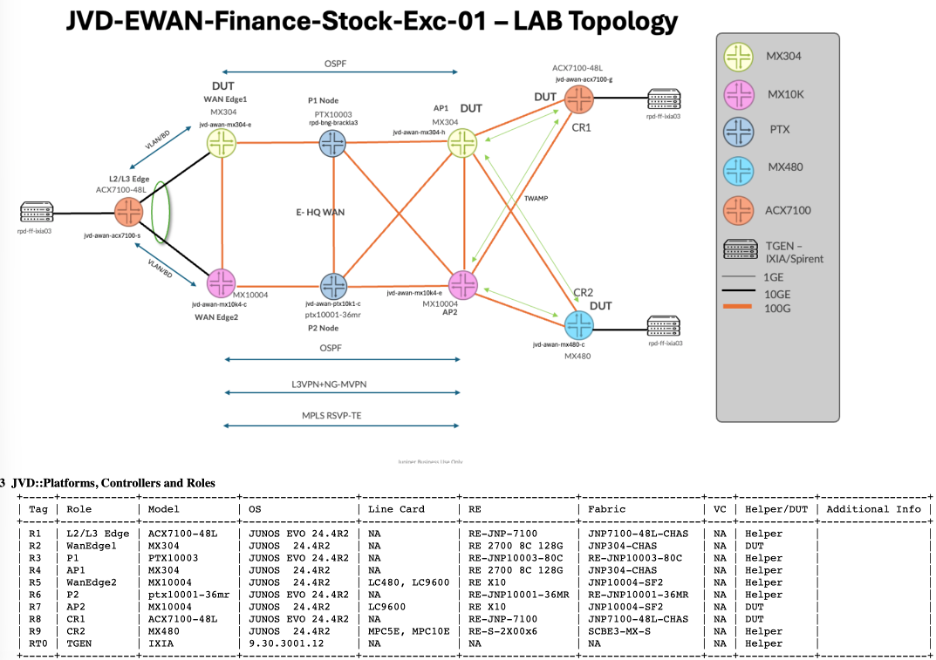
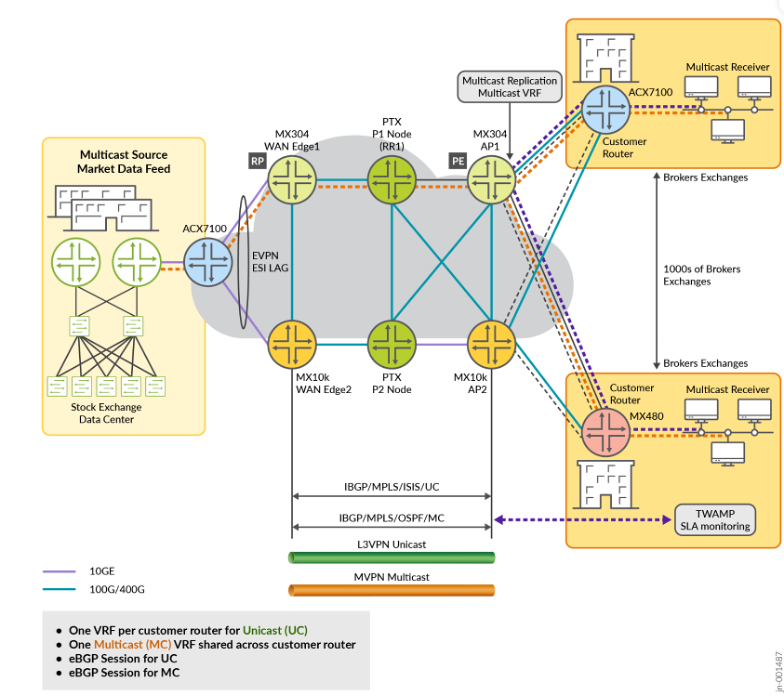

# Enterprise WAN for Finance and Stock Exchange

> **Juniper Validated Design (JVD)** for building and deploying Juniper solutions in **financial trading** and **stock exchange** environments.  
> **Version:** v0.1

This JVD uses **Juniper ACX Series**, **MX Series**, and **PTX Series** platforms. In financial trading and stock exchange environments, network design is centered on handling **heavy multicast traffic** with **ultra-low latency**, **resiliency**, and **end-to-end reliable delivery** of packets. Because these environments rely heavily on optimization for distributing market data feeds, making **efficient and fast multicast replication** a key design element.

---

## Contents

- [Enterprise WAN for Finance and Stock Exchange](#enterprise-wan-for-finance-and-stock-exchange)
  - [Contents](#contents)
  - [Solution Highlights](#solution-highlights)
  - [Test Coverage \& Validation](#test-coverage-validation)
  - [Validated Platforms](#validated-platforms)
  - [Documentation](#documentation)

---

## Solution Highlights

- **Efficient market data distribution**
  - Real-time multicast distribution of quotes, trades, and order book updates for fairness and synchronized decision-making.

- **Deterministic, ultra-low latency WAN**
  - Zero packet loss, no packet reordering, and microsecond-level latency targets for trade execution.

- **Multicast-centric architecture**
  - NG-MVPN in **SPT-only** mode with BGP signaling (**Type-5 / Type-7** routes) for efficient multicast delivery.

- **High availability & redundancy**
  - EVPN-based **Active/Standby** redundancy for critical financial data.
  - **MPLS Fast Reroute (FRR)** and **BGP failover** for resiliency.

- **Optimized transport**
  - **MPLS with RSVP-TE** for traffic engineering and deterministic paths.
  - **OSPF** for dynamic routing in the underlying topology.

- **QoS & traffic prioritization**
  - **Class of Service (CoS)** with strict-high priority for multicast traffic.
  - **Multifield classifiers** for granular traffic management.

- **Performance monitoring**
  - **TWAMP** for SLA monitoring.
  - Continuous monitoring for integrity and performance of multicast delivery.

---

## Test Coverage Validation

The JVD includes **59+ tests** across **4 high-level scenarios**, validating:

- **Control plane & data plane resiliency**
  - Protocol and traffic convergence validation before and after critical events.

- **Multicast & EVPN service validation**
  - NG-MVPN (inclusive mode) and PIM for multicast distribution.

- **Access resiliency**
  - EVPN services over VLANs with **ESI-LAG** in **active–standby** mode for dual-homing.

- **WAN core underlay and overlay**
  - OSPF, iBGP, eBGP, MPLS, and RSVP-TE for deterministic paths and fast reroute.

- **Strict priority multicast streams**
  - Validated across multiple VLANs with mixed unicast/multicast traffic.

---

## Validated Platforms

Validated on platforms including:

- **ACX7100-48L**
- **MX480**
- **MX304**
- **MX10004**
- **MX10008**

---

## Documentation

| Document | Link |
|---|---|
| JVD Document | [jvd-ewan-finance-01-01](https://www.juniper.net/documentation/us/en/software/jvd/jvd-ewan-finance-01-01/index.html) |
| Solution Overview (PDF) | [sol-overview-jvd-ewan-finance-01-01.pdf](https://www.juniper.net/documentation/us/en/software/jvd/sol-overview-jvd-ewan-finance-01-01.pdf) |
| Test Report Brief | [test-report-brief-jvd-ewan-finance-01-01](https://www.juniper.net/documentation/us/en/software/jvd/test-report-brief-jvd-ewan-finance-01-01.p…) |

---
