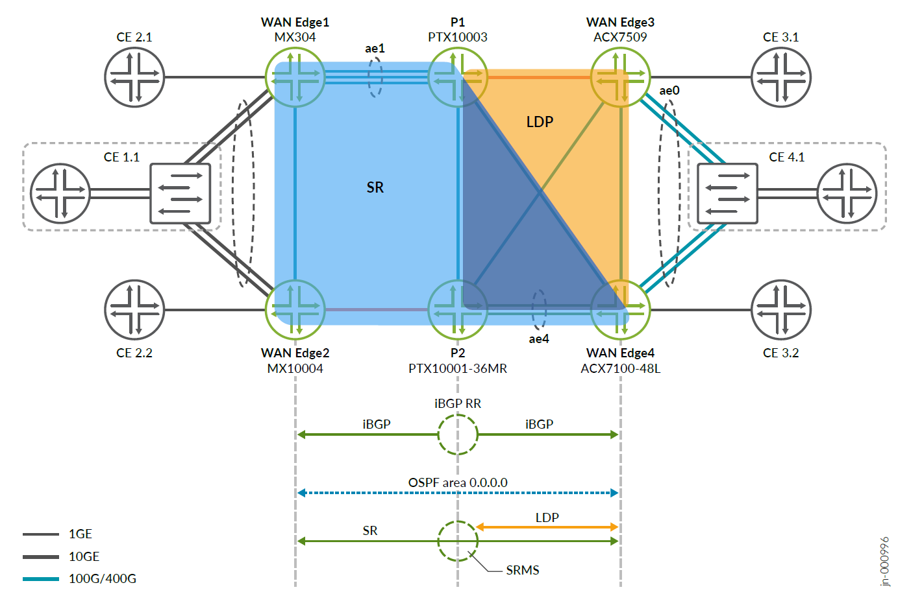
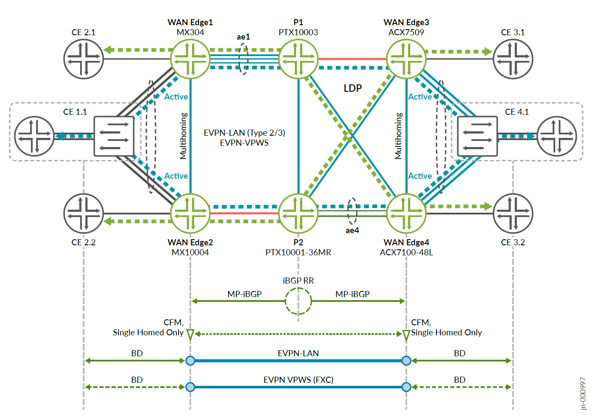
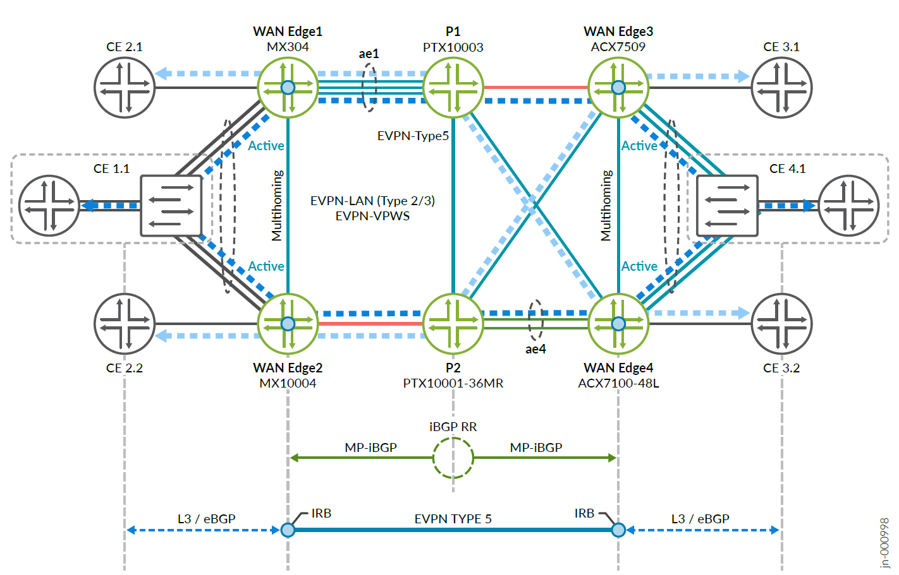

# Enterprise WAN Advanced Core and Edge Services

Validated configurations for the **Enterprise WAN Advanced Core and Edge
Services** Juniper Validated Design. This JVD demonstrates an MPLS-based
enterprise WAN backbone that delivers EVPN-VPWS, EVPN Type-5 (IP-VRF),
and EVPN ELAN services at scale — connecting campus, headquarters, cloud,
colocation, and data center sites through a common core with MACsec
encryption between WAN segments.

* JVD document: <https://www.juniper.net/documentation/us/en/software/jvd/jvd-ewan-adv-core-edge-svc-01/index.html>
* Solution overview: <https://www.juniper.net/documentation/us/en/software/jvd/sol-overview-ewan-adv-core-edge-svc-01.pdf>
* Test report: <https://www.juniper.net/documentation/us/en/software/jvd/test-report-brief-ewan-adv-core-edge-svc-01.pdf>

The design validates advanced service scale on the WAN edge — each edge
router carries approximately 1,500 EVPN-VPWS instances, 1,200+ EVPN /
MAC-VRF instances, and 350 IP-VRF instances — along with Ethernet OAM
(802.1ag CFM) for per-service SLA monitoring with two-way delay and
synthetic loss measurement.

## Solution architecture

The topology consists of four WAN Edge routers, two core P routers that
double as iBGP route reflectors, and L2/L3 edge devices at each customer
site. The core runs a dual-plane MPLS transport with Segment Routing on
the SR-capable domain and LDP on the legacy domain, stitched via SRMS.

**Transport underlay** — OSPF area 0 provides reachability across the
core. Segment Routing and LDP coexist via SR Mapping Server (SRMS),
allowing the MX304 (SR-only) and ACX7509/ACX7100-48L (LDP) domains to
interoperate. iBGP route reflectors (P1/P2) distribute service routes.

**L2 overlay services** — EVPN-VPWS (Flexible Cross-Connect) and
EVPN-LAN (Type 2/3) provide point-to-point and multipoint L2 services
across the WAN. CEs are multihomed Active/Active to WAN edge pairs.
Ethernet OAM CFM runs end-to-end on single-homed services for SLA
assurance.

**L3 overlay services** — EVPN Type-5 IP-prefix routes carry L3 VPN
services across the core, terminating at IRB interfaces on the WAN edge.
CE-facing links run L3/eBGP for customer route exchange.

## Hardware

| Juniper Product | Role | Software |
|---|---|---|
| **MX304** | WAN Edge 1 | Junos OS 23.4R2 |
| **MX10004** | WAN Edge 2 | Junos OS 23.4R2 |
| **ACX7509** | WAN Edge 3 | Junos OS Evolved 23.4R2 |
| **ACX7100-48L** | WAN Edge 4 | Junos OS Evolved 23.4R2 |
| **PTX10003-80C** | Core / P1 (Route Reflector) | Junos OS Evolved 23.4R2 |
| **PTX10001-36MR** | Core / P2 (Route Reflector) | Junos OS Evolved 23.4R2 |
| **ACX7100-48L** | L2/L3 Edge 1 | Junos OS Evolved 23.4R2 |
| **MX480** | L2/L3 Edge 2 | Junos OS 23.4R2 |

This JVD is regressively validated across multiple Junos and Junos OS
Evolved releases. For the complete list of validated software versions,
see
[Validated Platforms](https://www.juniper.net/documentation/us/en/software/jvd/jvd-ewan-adv-core-edge-svc-01/validated-platforms.html).

## Configurations

| File | Role |
|---|---|
| [`ce1_acx7100-48l.conf`](configuration/conf/ce1_acx7100-48l.conf) | L2/L3 Edge 1 (ACX7100-48L) |
| [`ce4_mx480.conf`](configuration/conf/ce4_mx480.conf) | L2/L3 Edge 2 (MX480) |
| [`p1_ptx10003.conf`](configuration/conf/p1_ptx10003.conf) | Core / P1 — Route Reflector (PTX10003-80C) |
| [`p2_ptx10001-36mr.conf`](configuration/conf/p2_ptx10001-36mr.conf) | Core / P2 — Route Reflector (PTX10001-36MR) |
| [`wanedge1_mx304.conf`](configuration/conf/wanedge1_mx304.conf) | WAN Edge 1 (MX304) |
| [`wanedge2_mx10004.conf`](configuration/conf/wanedge2_mx10004.conf) | WAN Edge 2 (MX10004) |
| [`wanedge3_acx7509.conf`](configuration/conf/wanedge3_acx7509.conf) | WAN Edge 3 (ACX7509) |
| [`wanedge4_acx7100-48l.conf`](configuration/conf/wanedge4_acx7100-48l.conf) | WAN Edge 4 (ACX7100-48L) |

