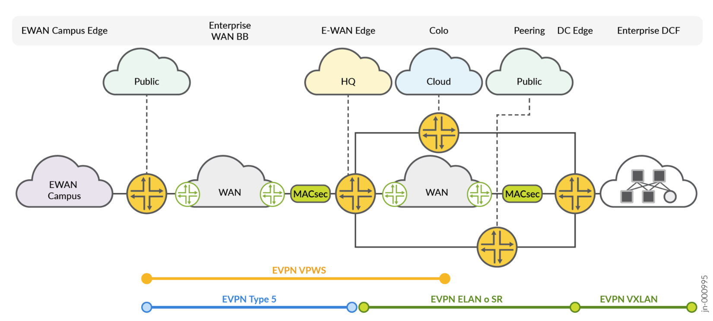
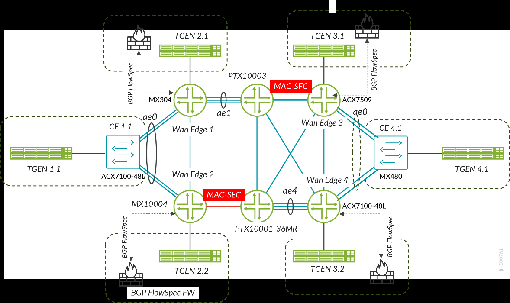

> Faithful markdown conversion of the published PDF:
> [Enterprise WAN Advanced Core and Edge Services — Juniper Validated Design (JVD)](https://www.juniper.net/documentation/us/en/software/jvd/jvd-ewan-adv-core-edge-svc-01/index.html).
> The PDF on juniper.net is the source of truth. Exhaustive scale and convergence
> tables are condensed to summaries; see the published document for full results.

# Enterprise WAN Advanced Core and Edge Services — Juniper Validated Design

## About this Document

This document explains a Juniper Validated Design (JVD) for an enterprise WAN (EWAN) advanced core and edge services network with an MPLS-based backbone. It focuses on validating EVPN, EVPN-VPWS services with a mix of MPLS and SR underlay transport used in the context of a private enterprise WAN. It explains the design and testing methodologies, summarizes key results, and provides implementation recommendations for the validated design.

### Table 1: Summary of Solution Platforms

| Solution | Platforms |
|----------|-----------|
| EWAN Edge | MX304 Universal Edge Router, MX10004 Universal Edge Router, ACX7100-48L Universal Metro Router, ACX7509 Universal Metro Router |
| EWAN Core | PTX10003-80C, PTX10001-36MR |

## Solution Benefits

In the age of AI and Cloud Services, a private enterprise WAN remains an essential component of enterprise IT infrastructure. EWAN connects multiple sites within an organization — universities, utilities, hospitals, banks, railways — enabling end-to-end data communication between campus and branch offices, data centers, and remote sites. Enterprises typically use a combination of private and public networks (leased lines, MPLS, legacy and advanced VPNs, and the Internet) to connect to their headquarter network.

This JVD provides a validated solution for a unified and secure enterprise WAN Edge and Core infrastructure, based on five critical functional aspects:

- **Connectivity** — network infrastructure connecting geographically dispersed locations
- **Scalability** — accommodates organizational growth; new sites easily added
- **Performance** — CoS mechanisms prioritize data traffic for critical applications
- **Security** — encryption, authentication, access controls protect sensitive data
- **Reliability** — redundancy and failover mechanisms ensure high availability

Through multiple evolutionary cycles, EWAN complexity increases over time and often exceeds that of tier-2/tier-3 service providers. Two protocols — **EVPN** and **Segment Routing (SR)** — reduce network complexity, sufficient to: enable L2 and L3 VPN connectivity; provide built-in high availability; improve network stability; and facilitate seamless stitching between campus and data center deployments.

This JVD validates migration scenarios from legacy L2/L3 services to advanced VPN services based on an EVPN and SR underlay infrastructure. It considers cases where SR and MPLS LDP transports are used simultaneously in different parts of the network and showcases interoperability between the two. EVPN over MPLS is used as a universal method to enable L2/L3 multipoint-to-multipoint and L2 point-to-point circuits, replacing traditional L3VPN, L2VPN, Martini L2 circuits, and VPLS offerings.

The solution provides advanced **hierarchical CoS (HQoS)** to prioritize or guarantee bandwidth for specific applications or corporate VPN services. Network security uses embedded **MACsec** across MX, PTX, and ACX platforms at the core and edge. **Static ACLs** (stateless firewall filters) control network flows; **BGP FlowSpec** enables edge routers to dynamically install filters for specific flows to block malicious attacks (e.g. ICMP floods) and redirect suspicious flows to security-screening complexes.

## Use Case and Reference Architecture


*Figure 2. Typical Enterprise Network with EVPN as Unified Service Protocol.*

A typical enterprise WAN interconnects users in campus and branch segments, enabling L2/L3 connectivity over EVPN-MPLS / EVPN-VPWS services to reach enterprise applications in a private data center or public cloud (AWS, GCP, Azure). EVPN-MPLS, EVPN-VPWS, and EVPN Type-5 routes are the primary connections used to connect branches and campuses to the central headquarters. At the edge, hierarchical CoS prioritizes high-priority application/VLAN traffic. DDoS protection (BGP FlowSpec) blocks ICMP flood attacks; unicast RPF guards against spoofed source addresses.

The core/backbone network is built using **SR-based MPLS transport**, and also covers migration scenarios where part of the network runs LDP while the other uses SR. The latest Juniper ACX and MX platforms support port speeds from 1G/10G/100G at the edge to 400G in the core. PTX series routers act as the backbone and as BGP route reflectors.

## Validation Framework


*Figure 3. Enterprise WAN-Edge and Core JVD Validation Topology.*

Four WAN edge routers are configured as PE routers of the MPLS WAN network, connected to traffic generators (T-GENs) emulating L2/L3 CE nodes of enterprise campus, branch, public cloud, or data center gateway. To validate dual-homed connectivity to the campus (CE1.1) and data center gateway (CE4.1), a helper router (ACX7100-48L or MX480) is configured as an L2-mode switch. Links P1-to-WANEdge3 and P2-to-WANEdge2 are configured with **MACsec** consistently across all test cases. To validate DDoS protection, traffic generators TGEN 3.1 and TGEN 2.2 act as security devices, establishing BGP FlowSpec sessions with WANEdge2 (MX10004) and WANEdge3 (ACX7509) and installing dynamic stateless firewall policies.

## Test Objectives

The goal is to validate that the **MX304, MX10004, ACX7100-48L, and ACX7509** devices meet enterprise WAN edge requirements, and that the **PTX10003 and PTX10001-36MR** devices meet enterprise core requirements. Focus areas:

- MPLS LDP with OSPF and TI-LFA
- Segment Routing (SR) with OSPF and TI-LFA
- EVPN-VPWS, EVPN-FXC, and EVPN-ELAN over SR-MPLS transport
- TI-LFA redundancy over SR
- HQoS with different traffic profiles
- BGP FlowSpec and unicast RPF as DDoS protection
- Network resiliency, traffic restoration, and convergence time for MX304, ACX7100-48L, ACX7509 against link/node failure across all traffic types
- Network stability at scale for each VPN service type under normal and stress conditions
- DUT consistency against negative stress (daemon enable/disable, add/delete config)

## Test Non-Goals

- Use of SRTE / SRv6
- Migrations from VPLS to EVPN-MPLS
- HQoS on AE interface on Junos OS (PR 50676 / 24.1R1)
- EVPN-VPWS multihoming with single-active
- EVPN-VPWS FXC multihoming with single-active
- BGP FlowSpec match conditions not supported on ACX7000: Flow Label, Port (workaround: duplicate terms with source/destination port), Packet Length, IPv6 Fragment, Prefix-Offset
- Any flavor of multicast traffic
- Dynamic routing between CE and WAN-Edge devices

## Solution and Validation Key Parameters

### Table 2: Key Scale and Performance Indices (per WAN Edge)

Each WAN Edge (MX304, MX10004, ACX7509, ACX7100-48L) carries the same target scale:

| Service / Feature | Scale per WAN Edge |
|-------------------|--------------------|
| Total EVPN Instances | 2,700 |
| VLANs / BD | ~3,520–3,620 |
| EVPN-VPWS Active/Active Multihoming | 700 |
| EVPN-VPWS Single-homing | 300 |
| EVPN-VPWS with FXC Multihoming | 500 |
| EVPN-ELAN SH VLAN-based (Type 2 & 3) | 175 |
| EVPN-ELAN SH VLAN-based (Type 5) | 175 |
| EVPN-ELAN SH VLAN-bundle (Type 2 & 3) | 350 |
| EVPN-ELAN MH VLAN-based (Type 2 & 3) | 100 |
| EVPN-ELAN MH VLAN-based (Type 5) | 150 |
| EVPN-ELAN MH VLAN-bundle (Type 2 & 3) | 250 |
| CFM sessions @140ms (SH services only) | 175 |
| MAC Addresses | 5.4K |
| ARP records (EVPN Type-5 only) | 1,150 |
| FlowSpec rules (filters) | 10 |
| Static FBF rules | 10 |
| uRPF strict/loose policies | 100 |

## Key Feature List

- **EVPN-VPWS** — single-homed + active/active multihomed
- **EVPN-ELAN** — single-homed + active/active multihomed
- **EVPN Type-5** (L3 connectivity) — single-homed + active/active multihomed
- **HQoS** at the IFD level (ACX7K only)
- **LDP** for label distribution with OSPF
- **Segment Routing (SR)** with OSPF
- **LDP/SR interworking** — SR Mapping Server (SRMS) on P-routers only
- **Loop-Free Alternate (LFA)** fast reroute
- **iBGP** between PE and route reflector (RR)
- Fast failover / detection: LFA/FRR, ECMP, BFD
- **OAM** and continuity detection (BFD, CFM)
- **VLANs (802.1Q)**, **Link Aggregation (LAG)**

## Solution Architecture

### Underlay Layer


*Figure 4. Enterprise WAN-Edge and Core Underlay MPLS Transport Layer.*

The transport MPLS underlay includes **SR-OSPF, SR-LDP mapping, and TI-LFA**. The route reflector uses **iBGP**. **BFD-triggered FRR** offers quick, reliable failover. **BGP Prefix-Independent Convergence (PIC) Edge** is enabled on all routing nodes (`routing-options protect core`), providing active-backup protection for the global routing instance. **BGP Multipath with allow-protection** (`protocols bgp multipath allow-protection`) provides ECMP with N+1 backup protection.

### Overlay Services Layer


*Figure 5. Enterprise WAN-Edge and Core EVPN LAN/VPWS Services.*

The overlay comprises three service types. **L2 services** include EVPN-ELAN and EVPN-VPWS with or without Flexible Cross-Connect (FXC), supporting single-homed and multihomed CE-to-WAN-Edge connectivity. The **CFM protocol** monitors service continuity between WAN Edge nodes per VPN instance (used with all single-homed point-to-point EVPN-VPWS services).

**L3 services** replace traditional L3VPN with **EVPN Type-5** routes, where every WAN Edge EVPN instance is configured with an **IRB interface** acting as a default gateway. For static routing deployments, adjacent WAN Edge pairs are configured with **IP Virtual Gateway** functions, enabling dual-homing and replacing VRRP in L3VPN scenarios. Dynamic routing (eBGP or IGP between CE and WAN Edge) is outside the validation scope.

Representative IP Virtual Gateway + EVPN Type-5 config (MX304, Junos):

```junos
interfaces {
    irb {
        unit 1851 {
            virtual-gateway-accept-data;
            family inet {
                address 172.21.1.1/24 {
                    virtual-gateway-address 172.21.1.3;
                }
            }
            virtual-gateway-v4-mac 00:66:66:66:66:01;
        }
    }
}
routing-instances {
    emh_group_400_1851 {
        instance-type evpn;
        protocols { evpn { no-normalization; encapsulation mpls; default-gateway do-not-advertise; } }
        vlan-id none;
        routing-interface irb.1851;
        interface ae0.1851;
        route-distinguisher 22.22.22.22:1851;
        vrf-target target:60525:1851;
    }
}
```

The ACX7509 (Junos OS Evolved) equivalent uses `instance-type mac-vrf` with `service-type vlan-based`. Full multi-device configs: [`../configuration/conf/`](../configuration/conf/) and the [snip library](../configuration/snips/).

### Security Layer


*Figure 7. Enterprise WAN-Edge and Core — Network Security Layer.*

The security layer is **MACsec + DDoS protection**. DDoS protection allows security systems to communicate with WAN Edge nodes via **BGP FlowSpec (RFC 8955)**, dynamically installing routing policies into the global routing table. Juniper routers integrate with third-party DDoS systems like Corero and Netscout (formerly Arbor). Validation focuses on consistent FlowSpec behavior across MX and ACX (Junos / Junos OS Evolved). **MACsec** provides L2 encryption on core links between WAN Edge and P nodes. A stateless firewall filter (accept / policer / reject actions) is validated on the MX304 DUT.

## Results Summary and Analysis

A total of **132 test cases** are executed and passed successfully. Test scenarios validate baseline features (EVPN, EVPN-MPLS, HQoS, BGP FlowSpec, unicast RPF) on WAN Edge nodes, and SR / MPLS / iBGP / route-reflector functions on core devices, including scaled scenarios with negative triggers (FPC/PIC reloads, process restarts, instance deactivate/activate).

### Table 3: Network Convergence Timers (worst-case, milliseconds)

> Condensed. See the published guide for the full per-event table.

| Event | EVPN-VPWS | EVPN-VPWS FXC | EVPN-ELAN VLAN-based | EVPN-ELAN VLAN-bundled | EVPN Type-5 |
|-------|-----------|---------------|----------------------|------------------------|-------------|
| WANEdge1–P1 link disable | 5 | 10 | 34 | 30 | 16 |
| WANEdge3–P1 link disable | 45 | 130 | 104 | 95 | 5 |
| WANEdge4–P1 link disable | 28 | 26 | 56 | 27 | 15 |
| WANEdge4–P2 link disable | 121 | 115 | 130 | 120 | 35 |
| WANEdge1 failure | 535 | 121 | 1,821 | 2,113 | 3,123 |
| WANEdge3 failure | 1,470 | 1,470 | 1,561 | 2,351 | 3,370 |
| WANEdge4 failure | 600 | 600 | 1,226 | 3,993 | 586 |

Core-facing link failures (WAN Edge → P) restore in **~60 ms average** thanks to LFA local protection. WAN Edge **node** failures show higher convergence (global convergence path) — measured with 2,700 EVPN services per node, higher than most mid-range enterprise WANs where convergence is expected to be lower.

## Recommendations

The MX304, MX10004, ACX7100-48L, and ACX7509 platforms offer a comprehensive feature set supporting enterprise migration from legacy services to advanced EVPN-based L2 and L3 services, and support a migration path from LDP-based transport toward segment routing. The platforms provide a uniform, secure WAN infrastructure supporting single-homed and multihomed CE-to-WAN-Edge connectivity for all service types, with CFM service-continuity monitoring and LFA-based fast failover. Security mechanisms (BGP FlowSpec, unicast RPF, MACsec) serve as building blocks for comprehensive enterprise network architectures.

> The JVD was qualified on **Junos OS Release 23.4R2** and **Junos OS Evolved Release 23.4R2** (P routers on 23.4R2.2-EVO). See the [test report brief](test-report-brief.md) for the validated platform + software table.

---

## Sources

- Published document: [EWAN Advanced Core Edge JVD](https://www.juniper.net/documentation/us/en/software/jvd/jvd-ewan-adv-core-edge-svc-01/index.html)
- Companion docs: [`solution-overview.md`](solution-overview.md), [`test-report-brief.md`](test-report-brief.md), [`datasheet.md`](datasheet.md)
- Configs: [`../configuration/conf/`](../configuration/conf/) · Snip library: [`../configuration/snips/`](../configuration/snips/)
