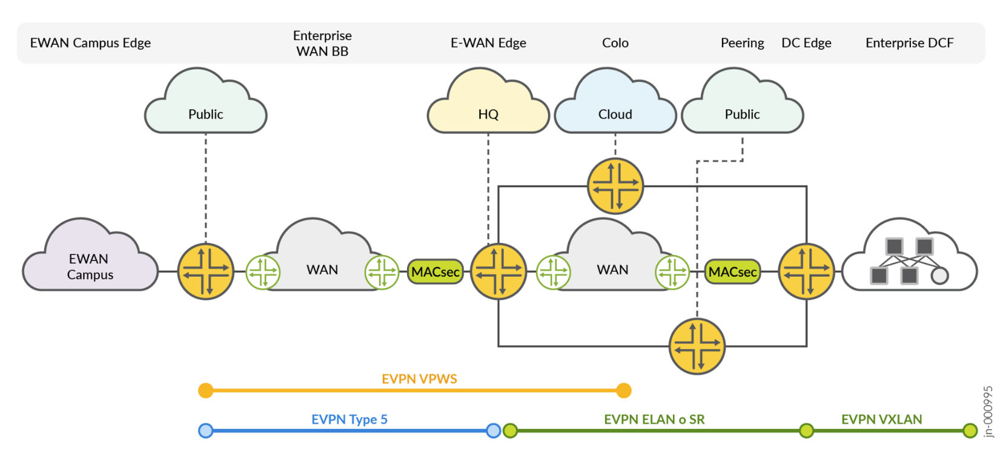
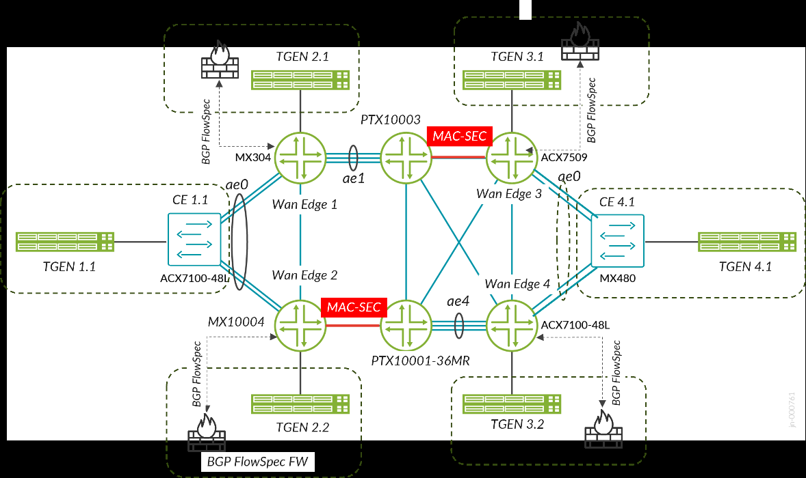
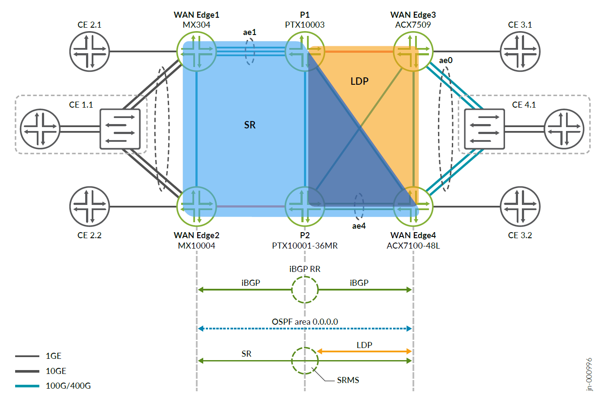
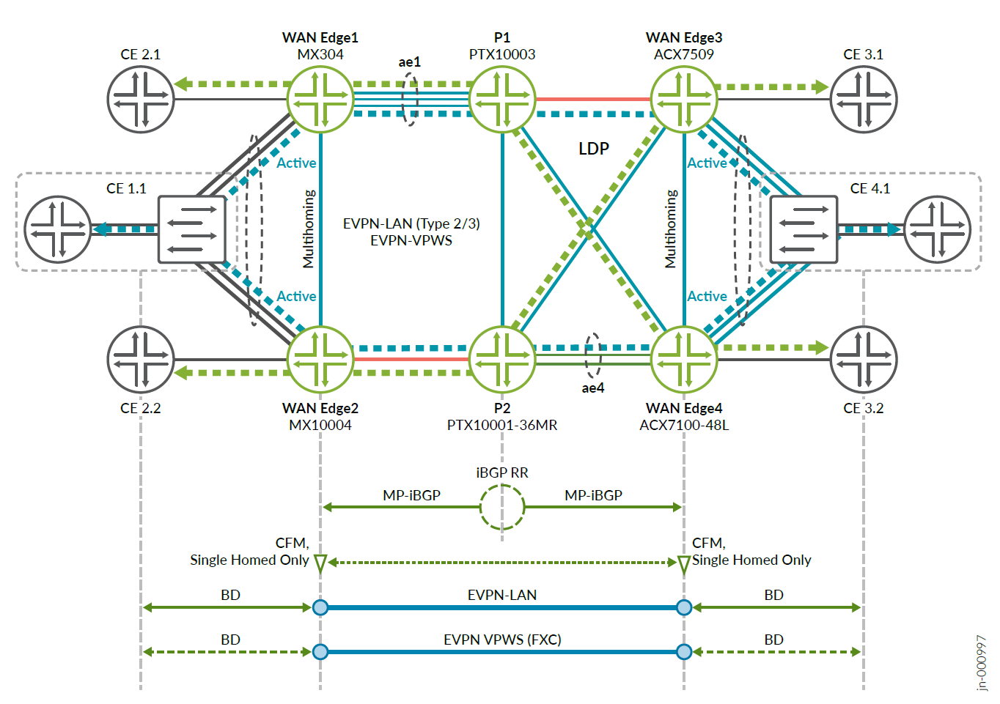
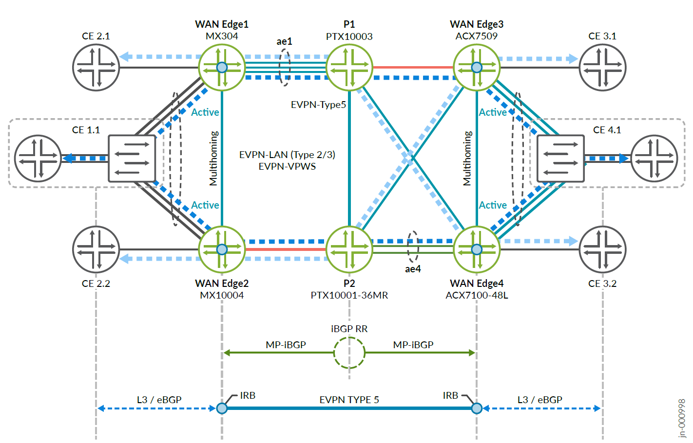

>
> Faithful markdown conversion of the published Juniper Validated Design
> **Enterprise WAN — Advanced Core and Edge Services — JVD**
> (`ewan-adv-core-edge-svc-01`). The PDF on juniper.net is the source of truth.
> The design narrative and validation framework are reproduced in full, with the
> architecture, topology, and layer diagrams inlined from the repository
> `images/` folder where a verified image exists (otherwise the figure is
> referred out to the published PDF). The complete device configurations are in
> [`../configuration/conf`](../configuration/conf).

# Enterprise WAN — Advanced Core and Edge Services — Design Guide

Juniper Networks Validated Designs provide you with a comprehensive, end-to-end
blueprint for deploying Juniper solutions in your network. These designs are
created by Juniper's expert engineers and tested to ensure they meet your
requirements. Using a validated design, you can reduce the risk of costly
mistakes, save time and money, and ensure that your network is optimized for
maximum performance.

## Table of Contents

- [About this Document](#about-this-document)
- [Solution Benefits](#solution-benefits)
- [Use Case and Reference Architecture](#use-case-and-reference-architecture)
- [Validation Framework](#validation-framework)
- [Supported Platforms and Positioning](#supported-platforms-and-positioning)
- [Test Objectives](#test-objectives)
- [Solution and Validation Key Parameters](#solution-and-validation-key-parameters)
- [Key Feature List](#key-feature-list)
- [Solution Architecture](#solution-architecture)
- [Results Summary and Analysis](#results-summary-and-analysis)
- [Recommendations](#recommendations)

## About this Document

This document explains a Juniper Validated Design (JVD) for an enterprise WAN (EWAN) advanced core and edge services network with an MPLS-based backbone. It focuses on validating EVPN, EVPN-VPWS services with a mix of MPLS and SR underlay transport used in the context of a private enterprise WAN. We explain the design and testing methodologies, summarize key results, and provide implementation recommendations for the validated design.

The summary of the solution platforms is as follows:


### Table 1: Summary of Solutions Platforms

| Solution | EWAN Edge | EWAN Core |
|---|---|---|
| Enterprise WAN Edge and Core | MX304 Universal Edge Router; MX10004 Universal Edge Router; ACX7100-48L Universal Metro Router; ACX7509 Universal Metro Router | PTX10003-160C; PTX10001-36MR |


## Solution Benefits

In the age of AI and Cloud Services, a private enterprise WAN remains an essential component of enterprise IT infrastructure. A big enterprise network can include multiple campus and branch locations.

EWAN connects multiple sites within an organization such as universities, utilities, hospitals, banks, and railways. It enables end-to-end data communication and information transfer between different locations, such as campus and branch offices, data centers, and remote sites.

EWANs are designed to provide secure and reliable connectivity across diverse locations, allowing access to centralized resources, sharing data, and collaborating effectively. Enterprises typically utilize a combination of private and public networks, including leased lines, Multiprotocol Label Switching (MPLS), legacy and advanced Virtual Private Networks (VPNs), and the Internet to connect to their headquarter network.


*Figure 1: Typical Enterprise Network — see the [published PDF](https://www.juniper.net/documentation/us/en/software/jvd/ewan-advanced-core-edge/index.html).*

This JVD provides a validated solution for a unified and secure enterprise WAN Edge and Core infrastructure, which is based on the following five critical functional aspects:

- Connectivity: Enterprise WANs establish a network infrastructure to connect geographically
dispersed locations, enabling seamless communication and resource sharing.

- Scalability: Enterprise WANs is designed to accommodate the growth and expansion of an
organization, allowing new sites to be easily added to the network.

- Performance: WANs prioritize data traffic and apply Class of Service (CoS) mechanisms to ensure
efficient utilization of network resources and optimize performance for critical applications.

- Security: Enterprise WANs implement various security measures, such as encryption, authentication,
and access controls, to protect sensitive data transmitted across the network.

- Reliability: Enterprise WANs implement redundant, and failover mechanisms are implemented to
ensure high availability and minimize downtime in case of network failures.

Through multiple evolutionary cycles, the complexity of EWAN networks increases over time and often exceeds the complexity of certain tier 2 or tier 3 service providers. To simplify network operations and reduce associated costs, IT departments are actively seeking network simplification methods such as migrating to new, advanced protocols. Two protocols—Ethernet virtual private network (EVPN) and Segment Routing (SR)—generally allow for the reduction of the network complexity. These two protocols are sufficient to:

- Enable Layer 2 and Layer 3 VPN connectivity,

- Enable a new level of reliability with built-in high availability mechanisms,

- Improve network stability, and

- Facilitate seamless stitching between campus and data center deployments.

EVPN and SR also often leverage EVPN VXLAN protocols.

In this JVD, network designs are validated that cover migration scenarios from legacy L2/L3 services to advanced VPN services based on an EVPN and SR underlay infrastructure. This JVD takes into consideration cases where SR and MPLS Label Distribution Protocol (LDP) transports are used simultaneously in different parts of the network and showcases the interoperability between the two protocols. Essentially, EVPN over MPLS is used as a universal method to enable L2 and Layer 3 multipoint-to-multipoint and L2 point-to-point circuits, which replaces a range of traditionally used L3VPN, L2VPN, Martini L2 circuits, and Virtual Private LAN service (VPLS) offerings.

On top of the network transport and service infrastructure, the solution provides advanced class-of- service (CoS) capabilities through hierarchical CoS to prioritize or guarantee bandwidth for specific applications or corporate VPN services across the network transport and service infrastructure.

Ensuring network security and data integrity is crucial for this solution. Network security encompasses a wide range of techniques that safeguard against various threats, typically requiring a dedicated framework of both hardware and software. However, can the network routing gears enhance the security of the WAN infrastructure and safeguard the transfer of information, beyond the application of access lists and securing management access to its components? The presented solution provides a positive response to the aforementioned question, emphasizing the utilization of the latest Juniper Networks products, which feature embedded MACsec functionality. This technology can be seamlessly enabled across the portfolio between MX, PTX, ACX platforms at the core and edge of the enterprise WAN.

Static ACLs (stateless firewall filters in Junos OS terminology) are essential mechanisms that can efficiently control network flows and prevent malicious attacks. Enterprises can enhance network

stability under attack by activating DDoS protection at the edge routers. Through this solution, edge routers communicate with peripheral security devices using BGP flowspec protocol, dynamically installing filters for specific source/destination port/IP-address flows into the routers to block malicious attacks, such as ICMP flood attacks. Suspicious flows can also be redirected towards advanced traffic screening network security complexes enabled by this solution.


## Use Case and Reference Architecture

Figure 2 on page 4 depicts a typical enterprise WAN with edge and backbone/core network infrastructure interconnecting enterprise users in campus and branch segments, enabling L2/L3 connectivity over an EVPN-MPLS/EVPN-VPWS service enabling access to different enterprise-specific applications running in an enterprise private data center or in a public cloud network provider such as AWS, GCP or Azure and so on.




*Figure 2: Typical Enterprise Network with EVPN as Unified Service Protocol.*

EVPN-MPLS, EVPN-VPWS, and EVPN with Type 5 routes serve as the primary connections used by enterprises to connect the branch offices and campuses with the central headquarters network. At the edge, hierarchical CoS is employed to prioritize high-priority application/VLAN traffic over others, effectively ensuring optimal usage of network resources.

To secure the headquarter network edge devices connected to the internet, DDoS protection mechanisms, such as BGP FlowSpec, are enabled to block ICMP flood attacks. Unicast reverse-path forwarding (unicast RPF) is also activated on the interfaces to safeguard against attacks originating from unexpected source addresses.

The core/backbone network is built using segment-routing (SR) based MPLS transport. It also covers the migration scenarios where part of the network runs LDP, while the other part utilizes SR.

The latest Juniper ACX and MX platforms are introduced to support various port speeds, ranging from 1G/10G/100G in the edge/access WAN segment to 400G for the core/transport networks. This solution provides a broad range of network platforms, including MX-routers built on Juniper Networks custom silicon (Trio chip sets), and compact ACX pizza box routers based on Broadcom ASICs. The selection of a specific platform largely depends on several factors such as: platform size, power consumption, port density, feature richness, future feature capacity, and key logical scale indexes. This solution aims to validate all mentioned platforms as part of the coherent solution for the enterprise WAN with a given subset of requirements.

This JVD outlines the preferred choice of ACX and MX series routers as enterprise WAN edge devices, while PTX series routers act as the backbone of the enterprise WAN and as BGP route reflectors in the network.


## Validation Framework

The diagram in Figure 3 on page 6 explains the connectivity for the EWAN JVD topology and includes the router models shown in Validated Platforms and Software. Four WAN edge routers are configured as PE routers of the MPLS WAN network and connected to traffic generators—T-GENs—emulating L2/L3 CE-nodes of the enterprise campus and branch, public cloud segments, or data center gateway. To validate dual-homed connectivity to the campus (CE1.1) and the data center gateway (CE4.1), a helper router (ACX7100-48L or MX480) is configured as an L2 mode switch, which is used for most of the test cases.

Links P1-to-Wan Edge 3 and P2-to-Wan Edge 2 are configured with MACsec consistently throughout all test cases.

To Validate DDoS protection functionality, traffic generators TGEN 3.1 and TGEN 2.2 are configured as security devices. These devices established BGP flowspec sessions with respective edge nodes and are installing dynamic stateless firewall policies into the edge routers Wan Edge 2 (MX10004) and Wan Edge 3 (ACX7509).




*Figure 3: Enterprise WAN-Edge and Core JVD Validation Topology.*


## Supported Platforms and Positioning

To review the software versions and platforms on which this JVD was validated by Juniper Networks, see the Validated Platforms and Software section in this document.


## Test Objectives

Juniper Validated Designs (JVD) are a cross-functional collaboration between Juniper solution architects and test teams to develop coherent multidimensional solutions for domain-specific use cases. The JVD team comprises technical leaders in the industry with a wealth of experience supporting complex customer use cases. The scenarios selected for validation are based on industry standards to solve critical business needs with practical network and solution designs.

The key goals of the JVD initiative include:

- Test iterative multidimensional use cases.

- Optimize best practices and address solution gaps.

- Validate overall solution integrity and resilience.

- Support configuration and design guidance.

- Deliver practical, validated, and deployable solutions.

A reference architecture is selected after consultation with Juniper Networks global theaters and a deep analysis of customer use cases. The design concepts that are deployed use best practices and leverage relevant technologies to deliver the solution scope. Key performance indicators (KPIs) are identified as part of an extensive test plan that focuses on functionality, performance integrity, and service delivery.

Once the physical infrastructure required to support the validation is built, the design is sanity-checked and optimized. Our test teams conduct a series of rigorous validations to prove solution viability, capturing, and recording results. Throughout the validation process, our engineers engage with software developers to quickly address any issues found.

The goal of this JVD is to validate that the MX304, MX10004, ACX7100-48L and ACX7509 devices can meet the requirements of enterprise WAN edge deployments and that the PTX10003 and PTX10001-36MR devices can meet the network requirements of the enterprise core. PTX-systems perform an additional function of a x`. These devices under test are validated with the scale mentioned in the scaling section of this document.

The focus of the validation efforts:

- Using MPLS LDP with OSPF and TI-LFA.

- Using segment routing (SR) with OSPF and TI-LFA.

- Assessing VPN services, including EVPN-VPWS, EVPN-FXC, and EVPN-ELAN for consistency and
resiliency over SR-MPLS transport architecture.

- Evaluating TI-LFA redundancy mechanisms over SR.

- Testing HQOS with different traffic profiles.

- Using BGP flowspec and unicast RPF as DDoS protection mechanisms.

- Validating network resiliency, traffic restoration, and measured convergence time for MX304 (WAN
Edge 1), ACX7100-48L (WAN EDGE 4), and ACX7509 (WAN EDGE 3) against adjacent link/node failure across all traffic types.

- Assessing network stability for major traffic flows at scale with each VPN service type during normal
and stress conditions.

- Evaluating the consistency and resiliency of the device under test (DUT) against negative stress
conditions (enable/disable control and data plane daemons, add/delete configurations, and so on.).

- Identifying any product limitations, anomalies, and open PRs exposed during validation stages.

The testing process focuses on these areas to ensure security, stability and efficiency of the network solutions being developed. The validation stages are designed to identify and resolve any potential issues and to improve the overall performance of the network system.


### Test Non-Goals

Non-goals include elements that logically belong in the JVD but are excluded for various reasons, like being outside of the validation scope or because of feature or product limitations, and so on.

- Use of SRTE/SRv6

- Migrations from VPLS to EVPN-MPLS

- Support for HQoS on AE Interface on Junos OS (50676/24.1R1)

- Support for EVPN VPWS multihoming with single-active

- Support for EVPN VPWS FXC multihoming with single-active

- Support for BGP flowspec —the following match conditions are not validated due to missing support
on ACX7000 series:

- Flow Label

- Port (Workaround - Duplicate the terms with source/destination port)

- Packet Length

- IPv6 Fragment

- Prefix-Offset

- Support for any flavor of multicast traffic

- Support for dynamic routing between CE and WAN-Edge devices

Please contact your Juniper Networks representative for the complete test report with a comprehensive list of test cases used with this JVD.


## Solution and Validation Key Parameters

This section provides key solutions and validation parameters.


### Table 2: Key Scale and Performance Indices

| Services or Features Scale | WAN Edge1 (MX304) | WAN Edge2 (MX10004) | WAN Edge3 (ACX7509) | WAN Edge4 (ACX7100-48L) |
|---|---|---|---|---|
| Total EVPN Instances | 2700 | 2700 | 2700 | 2700 |
| VLANS/BD | 3520 | 3620 | 3520 | 3620 |
| EVPN-VPWS Active/Active (A/A) Multi-homing (MH) | 700 | 700 | 700 | 700 |
| EVPN-VPWS Single-homing (SH) | 300 | 300 | 300 | 300 |
| EVPN-VPWS with Flexible Cross Connect (FXC) MH | 500 | 500 | 500 | 500 |
| EVPN-ELAN SH VLAN-based Type 2 & 3 | 175 | 175 | 175 | 175 |
| EVPN-ELAN SH VLAN-based Type 5 | 175 | 175 | 175 | 175 |
| EVPN-ELAN SH VLAN-bundle Type 2 & 3 | 350 | 350 | 350 | 350 |
| EVPN-ELAN MH VLAN-based Type 2 & 3 | 100 | 100 | 100 | 100 |
| EVPN-ELAN MH VLAN-based Type 5 | 150 | 150 | 150 | 150 |
| EVPN-ELAN MH VLAN-bundle Type 2 & 3 | 250 | 250 | 250 | 250 |
| CFM sessions @140ms (SH Services only) | 175 | 175 | 175 | 175 |
| MAC Addresses | 5.4K | 5.4K | 5.4K | 5.4K |
| ARP records (EVPN Type 5 only) | 1150 | 1150 | 1150 | 1150 |
| flowspec Rules (filters) | 10 | 10 | 10 | 10 |
| Static Filter Based Forwarding (FBF) Rules | 10 | 10 | 10 | 10 |
| uRPF-strict/loose polices | 100 | 100 | 100 | 100 |


## Key Feature List

The supported key features include:

- EVPN-VPWS services

- Single homed connections

- Active/active multihomed connections

- EVPN ELAN

- Single homed connections

- Active/active multihomed connections

- EVPN Type-5 (Layer 3 connectivity)

- Single homed connections

- Active/active multihomed connections

- HQOS at the IFD Level (ACX7K only)

- LDP for label distribution with OSPF

- Segment routing (SR) with OSPF

- Interworking between LDP and SR: SR mapping server (SRMS) on P-routers only

- Loop-free alternate (LFA) fast reroute

- Internal BGP (IBGP) between provider edge (PE) and route reflector (RR) node

- Fast failover and detection mechanism

- LFA/FRR

- ECMP

- OAM and continuity detection and detection mechanism

- BFD

- OAM

- VLANs (802.1Q)

- Link aggregation (LAG)


> **NOTE:** Contact your Juniper Networks representative for test results reports.


## Solution Architecture

The solution for advanced enterprise WAN services illustrates the network modernization journey from a legacy MPLS service to an advanced architecture with SR as an underlay and EVPN protocols utilized for any type—L2, point-to-point, multipoint-to-multipoint, unicast—of connection between enterprise campuses, branches, and data center locations. A crucial aspect of the overall solution is to enable flexibility to support heterogeneous architectures within the same validated design. The following sections outline details about architectural and design decisions for:

- The underlay layer

- The overlay service layer

- The security layer


### Underlay Layer

The transport layer of the enterprise WAN network is designed using various protocols and technologies. The transport MPLS underlay layer includes SR-OSPF, SR-LDP mapping, and TI-LFA technologies. The route reflector (RR) uses iBGP, which ensures efficient and optimal use of network resources. Additionally, BFD-triggered FRR offers quick and reliable failover in the event of unexpected outages or disruptions. The BGP Prefix-Independent Convergence (PIC) Edge is enabled on all routing nodes with “routing-options protect core” configuration stanza and provides an active-backup protection for traffic flows of the global routing-instance. Moreover, BGP Multipath technology with allow-protection option (“protocols BGP multipath allow-protection” in the router configuration) enhances network resiliency by providing ECMP with N+1 backup protection, further ensuring efficient and reliable operation of the transport layer. Overall, the transport layer in the enterprise WAN network is designed to facilitate secure and efficient transfer of data across the network while ensuring optimal utilization of network resources and providing reliable failover mechanisms.




*Figure 4: Enterprise WAN-Edge and Core Underlay MPLS Transport Layer.*


### Overlay Services Layer

The overlay services layer in the enterprise WAN network comprises three distinct service types. The first is the L2 services, including EVPN LAN and EVPN-VPWS with or without flexible cross connect (FXC). The proposed architecture facilitates the deployment of both single homed and multihomed customer edge (CE) to WAN Edge connectivity for all service types. To ensure service continuity monitoring and control functionality, the connectivity fault management (CFM) protocol can be used alongside the embedded EVPN control plane, to monitor service continuity between WAN Edge nodes per VPN instance.




*Figure 5: Enterprise WAN-Edge and Core EVPN LAN/VPWS Services.*

Overall, the overlay services layer design in the Enterprise WAN network allows for a flexible, reliable, and efficient transfer of data, while ensuring easy access and connectivity management across all service types. The architecture supports various CE to WAN-Edge connectivity scenarios and enables effective monitoring and control of service continuity using the CFM protocol, ensuring optimal network performance. In the suggested network architecture, CFM is used in conjunction with all single homed point-to-point EVPN-VPWS services.

Figure 6 on page 15 outlines some details of the network services architecture proposed for establishing Layer 3 connectivity over the WAN between CE nodes and the enterprise network.


*Figure 6: Enterprise WAN-Edge and Core EVPN Type 5 Services — see the [published PDF](https://www.juniper.net/documentation/us/en/software/jvd/ewan-advanced-core-edge/index.html).*

The traditionally used Layer 3 VPN service for Layer 3 connectivity across WAN infrastructure is replaced in this solution with EVPN type 5 service routes where every WAN Edge node EVPN instance is additionally configured with an integrated routing and bridging (IRB) interface acting as a default gateway for the WAN Edge. Dynamic routing requirements (outside the scope of validation) necessitate the use of an eBGP or IGP protocol to exchange routes between the branch CE routers and adjacent WAN Edge nodes, providing dynamic routing capabilities. For static routing deployments, adjacent pairs of WAN Edge routers are configured with IP Virtual Gateway functions, enabling dual homing for these deployments and replaces VRRP in the scenarios with an L3VPN.

The following snippets show sample configurations used for the IP Virtual Gateway on an MX (Junos OS) router and an ACX (Junos OS Evolved) router.

Configuration example of the IP Virtual Gateway     Configuration example of the IP Virtual Gateway function with EVPN Type 5 routes and IRB on an MX   function with EVPN Type 5 routes and IRB on an ACX series router (WAN Edge 1, MX304 in the test bed    series router (WAN Edge 3, ACX7509 in the test bed topology of the JVD)                                topology of the JVD)

interfaces {                                            interfaces { irb {                                                   irb { 172.21.1.3;                                             172.23.1.3; }                                                      } }                                                       } routing-instances {                                     routing-instances { emh_group_400_1851 {                                    emh_group_400_1851 { }                                                                   vlan-id 1851; }                                                                       interface ae0.1851;

Thus, the EVPN protocol serves as a unified mechanism to enable all types of connectivity L2 or L3, point-to-point or multipoint, single/dual homed—over enterprise WAN infrastructure.


### Security Layer

The security layer is represented by MACsec and DDoS protection.

The DDoS protection function allows other network security systems to communicate with the WAN Edge nodes using the BGP flow specification (as outlined in RFC-8955) enabling the installation of routing policies into the global routing table of the routing node dynamically. For example, Juniper Networks routers can be integrated as part of the DDoS solution with third-party systems like Corero and Netscout (formerly Arbor).




*Figure 7: Enterprise WAN-Edge and Core – Network Security Layer.*

During the validation effort, the focus is on ensuring that the DDoS function can consistently be used across different flavors of the MX and ACX routers using Junos OS and Junos OS Evolved network operating systems. We don’t go into the specifics of a particular integration in this validation process, but instead focus on ensuring that the DDoS function is integrated accurately and consistently.

The security layer also includes MACsec, providing L2 encryption for traffic traversing the WAN between the CE and WAN Edge nodes. This encryption ensures that the data is protected and secured, preventing unauthorized access.

To demonstrate the effectiveness of the security layer, a simple stateless firewall filter is installed into the MX304 DUT, illustrating the ability of the solution to protect against potential security breaches and other security-related issues. Overall, the security layer is designed to provide a secure, resilient, and scalable solution, ensuring safety and integrity of the data transiting through the WAN infrastructure.

The following snippet shows that the filters are installed with an accept action. The “policer” and “reject” actions are validated as well.


```console
  egress@jvd-awan-mx304-e# show routing-options | display set
… truncated … set routing-options flow route source_ip match source 172.16.1.2/32 set routing-options flow route source_ip then accept set routing-options flow route dest_ip match destination 172.17.2.2/32 set routing-options flow route dest_ip then accept set routing-options flow route proto_tcp_source_port_match match protocol tcp set routing-options flow route proto_tcp_source_port_match match source-port 65071 set routing-options flow route proto_tcp_source_port_match then accept set routing-options flow route proto_tcp_dest_port_match match protocol tcp set routing-options flow route proto_tcp_dest_port_match match destination-port 80 set routing-options flow route proto_tcp_dest_port_match then accept set routing-options flow route descp_match match dscp 10 set routing-options flow route descp_match match source 172.21.1.2/32 set routing-options flow route descp_match then accept set routing-options flow route icmp_match match protocol icmp set routing-options flow route icmp_match match source 172.22.1.2/32 set routing-options flow route icmp_match match icmp-code 1 set routing-options flow route icmp_match match icmp-type 8 set routing-options flow route icmp_match then accept


MACsec is used in this topology to encrypt and guarantee data integrity on core links between WAN Edge and P nodes in the topology.


```


## Results Summary and Analysis

This section contains the KPIs used as solution validation targets. Validated KPIs are multidimensional and reflect our observations in customer networks or reasonably represent the solution capabilities. These numbers do not indicate the maximum scale and performance of individual tested devices. For unidimensional data on individual SKUs, contact your Juniper Networks representative.

The Juniper JVD team continuously strives to enhance solution capabilities. Consequently, solution KPIs might change without prior notice. Always refer to the latest JVD test report for up-to-date solution KPIs. For the latest comprehensive test report, contact your Juniper Networks representative.

Test scenarios include validation of baseline features such as EVPN, EVPN-MPLS, HQoS, BGP flowspec, and unicast RPF on WAN Edge nodes. The functions of SR, MPLS, iBGP and route reflectors are validated on core devices. The test scenarios also covered scaled scenarios with various negative triggers such as FPC/PIC reloads, process restarts, and deactivate/activate of instances.

The JVD topology generates a reasonable multi-vector scale of different features as mentioned below in the tables. The scale reference in "Solution and Validation Key Parameters" on page 8 characterizes primary multidimensional KPIs represented in the validated profile. A total of 132 test cases are executed and passed successfully.

Traffic convergence is one of the most critical considerations in a network design. This JVD validates the traffic convergence in different scenarios, such as link/node failure and member-link failures. Table 3 on page 20 given below includes the JVD results, within the specified latency budgets. Figure 8 on page 19 illustrates the failure scenarios covered by the JVD. The table summarizes measured network convergence timers.


> **NOTE:** The worst-case scenarios are reported in the table.


*Figure 8: Enterprise WAN-Edge and Core – Validated Failure Scenarios — see the [published PDF](https://www.juniper.net/documentation/us/en/software/jvd/ewan-advanced-core-edge/index.html).*


### Table 3: Network Convergence Timers

Metro Fabric Intra-AS convergence (milliseconds):

| Event | EVPN-VPWS, ms | EVPN-VPWS FXC, ms | EVPN-ELAN VLAN-Based, ms | EVPN-ELAN VLAN-Bundled, ms | EVPN Type5, ms |
|---|---|---|---|---|---|
| WAN Edge1-P1 link disable | 5 | 10 | 34 | 30 | 16 |
| WAN Edge3-P1 link disable | 45 | 130 | 104 | 95 | 5 |
| WAN Edge4-P1 link disable | 28 | 26 | 56 | 27 | 15 |
| WAN Edge4-P2 link disable | 121 | 115 | 130 | 120 | 35 |
| WAN Edge1 Failure | 535 | 121 | 1821 | 2113 | 3123 |
| WAN Edge3 Failure | 1470 | 1470 | 1561 | 2351 | 3370 |
| WAN Edge4 Failure | 600 | 600 | 1226 | 39931 | 586 |


> **NOTE:** The test case is initiated when all EVPN services traffic flows stuck with WAN Edge 4 node.

Convergence time measurements show that when core-facing links (WAN Edge to P nodes) fail, quick restoration times of an average of ~60ms were observed. This is due to a local protection mechanism (such as LFA) having been implemented, ensuring quick restoration. However, in the event of a WAN Edge node failure scenario, significantly higher convergence times were observed as the global convergence process came into play. Note that the observed convergence time depends on the service scale as the validation is conducted with a total of 2700 EVPN services configured at every node. This figure sits on the higher side compared to most mid-range enterprise-class WAN networks, where we expect the convergence time to be much lower. Overall, these measurements demonstrate the effectiveness of the local protection mechanism and the impact of service scale on global convergence timelines in ensuring network stability and minimizing the impact of outages.


> **NOTE:** Contact your Juniper Networks representative for more details on network convergence performance.


## Recommendations

In conclusion, the MX304, MX10004, ACX7100-48L, and ACX7509 platforms offer a comprehensive feature set, capable of supporting the given JVD requirements for the enterprise migration from legacy services to advanced EVPN-based L2 and L3 services. Furthermore, these platforms are designed to support you in a migration path from an LDP-based transport and core network towards a segment routing-based network. Junos OS Release 24.2R2 and Junos OS Evolved Release 24.2R2 are used during the design validation process, which ensures that all test cases are optimized and supported with the latest software features and updates.

The validation tests demonstrate that these platforms provide a uniform and secure WAN infrastructure that supports various CE to WAN Edge connectivity scenarios. The proposed architecture allows the deployment of both single homed and multihomed CE to WAN Edge connectivity for all service types, with the option to monitor service continuity using the CFM protocol. In addition, the platforms can facilitate quick and reliable failover, leveraging local protection mechanisms such as LFA. Finally, technologies and practical solutions covered in this JVD—including network security mechanisms such as BGP flowspec, and unicast RPF —can serve as building blocks for designing and implementing more comprehensive and multidimensional network architectures to support enterprise needs. Overall, the aforementioned MX and ACX platforms can provide a unified, scalable, and secure WAN infrastructure for enterprises WAN.


## Sources

- Published JVD PDF: [Enterprise WAN — Advanced Core and Edge Services — JVD](https://www.juniper.net/documentation/us/en/software/jvd/ewan-advanced-core-edge/index.html)
- Device configurations: [`../configuration/conf`](../configuration/conf)
- Solution overview: [solution-overview.md](solution-overview.md)
- Test report brief: [test-report-brief.md](test-report-brief.md)
