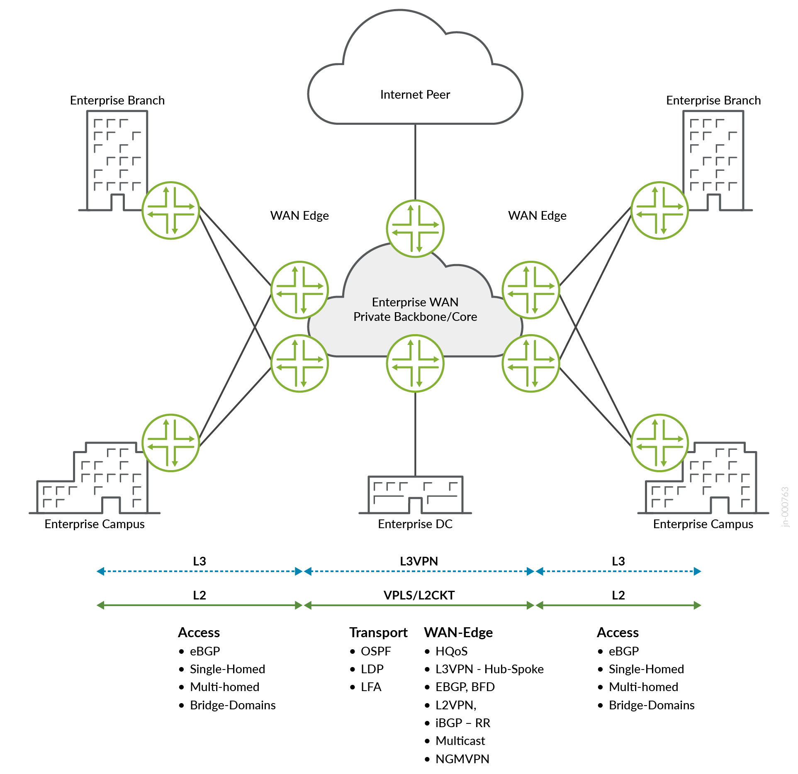

# Enterprise WAN Core and Edge

> MPLS-based enterprise WAN backbone delivering VPLS, L2 Circuit, L3VPN, and NGMVPN services across campus, branch, and data center locations with Juniper MX, ACX, and PTX platforms.

Validated configurations for the **Enterprise WAN Core and Edge** Juniper
Validated Design. This JVD validates a reliable network design that enables
campus and branch locations to connect to the private enterprise data center
and the Internet over an MPLS WAN core. WAN edge routers in the remote
locations use MPLS tunnels to connect to the enterprise data center WAN
edge router at the enterprise headquarters network, delivering VPLS, L2
Circuit, and L3VPN services with QoS and sub-50 ms convergence.

* JVD document: <https://www.juniper.net/documentation/us/en/software/jvd/jvd-ewan-core-edge-01/index.html>
* Solution overview: <https://www.juniper.net/documentation/us/en/software/jvd/sol-overview-ewan-core-edge-01.pdf>
* Test report: <https://www.juniper.net/documentation/us/en/software/jvd/testreportbrief-ewan-core-edge-01.pdf>

## Highlights

- VPLS, L2 Circuit, and L3VPN overlay services for multi-site connectivity
- MPLS/LDP transport with OSPF IGP and dual-core route reflectors
- LFA node-link-protection with BFD for sub-50 ms link-failure convergence
- Hierarchical QoS (HQoS) at IFD/IFL/queue levels
- NGMVPN with S-PMSI for multicast video (surveillance/monitoring)
- ECMP and LAG for load balancing and link redundancy

## Solution architecture

The topology consists of four WAN Edge routers (PE), two core P routers
that double as iBGP route reflectors, and L2/L3 edge devices (CE) at
each customer site. The core runs a dual-plane MPLS transport with LDP
for label distribution and OSPF area 0 for IGP reachability.

**Transport underlay** — OSPF area 0 provides reachability across the
core. LDP distributes MPLS labels. LFA with node-link-protection on
every OSPF interface provides sub-50 ms reroute on link failure. BFD
at 10 ms intervals detects failures rapidly. ECMP load-balances traffic
across equal-cost paths.

**L2 overlay services** — VPLS (BGP signaled) provides multi-point L2
connectivity across the WAN. L2 Circuit (CCC encapsulation over MPLS)
provides point-to-point L2 transport. CE devices are single-homed or
multihomed to WAN edge pairs.

**L3 overlay services** — L3VPN with iBGP inet-vpn carries L3 routing
between sites in both native (many-to-many) and hub-spoke deployment
models. VRRP (Active/Standby) provides gateway redundancy.

**Multicast** — NGMVPN with LDP-based S-PMSI tunnels transports
multicast video (surveillance cameras). Native PIM multicast and IGMPv2
snooping at the edge.

## Hardware

| Juniper Product | Role | Software |
|---|---|---|
| **MX304** | WAN Edge 1 | Junos OS |
| **MX10008** | WAN Edge 2 | Junos OS |
| **ACX7509** | WAN Edge 3 | Junos OS Evolved |
| **ACX7100-48L** | WAN Edge 4 | Junos OS Evolved |
| **PTX10003-80C** | Core / P1 (Route Reflector) | Junos OS Evolved |
| **PTX10001-36MR** | Core / P2 (Route Reflector) | Junos OS Evolved |
| **ACX7100-48L** | L2/L3 Edge 1 (CE) | Junos OS Evolved |
| **MX480** | L2/L3 Edge 2 (CE) | Junos OS |

This JVD is regressively validated across multiple Junos and Junos OS
Evolved releases. For the complete list of validated software versions,
see
[Validated Platforms](https://www.juniper.net/documentation/us/en/software/jvd/jvd-ewan-core-edge-01/validated-platforms.html).

## Configurations

| File | Role |
|---|---|
| [`wanedge1_mx304.conf`](configuration/conf/wanedge1_mx304.conf) | WAN Edge 1 (MX304) |
| [`wanedge2_mx10008.conf`](configuration/conf/wanedge2_mx10008.conf) | WAN Edge 2 (MX10008) |
| [`wanedge3_acx7509.conf`](configuration/conf/wanedge3_acx7509.conf) | WAN Edge 3 (ACX7509) |
| [`wanedge4_acx7100-48l.conf`](configuration/conf/wanedge4_acx7100-48l.conf) | WAN Edge 4 (ACX7100-48L) |
| [`p1_ptx10003.conf`](configuration/conf/p1_ptx10003.conf) | Core / P1 — Route Reflector (PTX10003-80C) |
| [`p2_ptx10001-36mr.conf`](configuration/conf/p2_ptx10001-36mr.conf) | Core / P2 — Route Reflector (PTX10001-36MR) |
| [`ce1_acx7100-48l.conf`](configuration/conf/ce1_acx7100-48l.conf) | L2/L3 Edge 1 (ACX7100-48L) |
| [`ce2_mx480.conf`](configuration/conf/ce2_mx480.conf) | L2/L3 Edge 2 (MX480) |