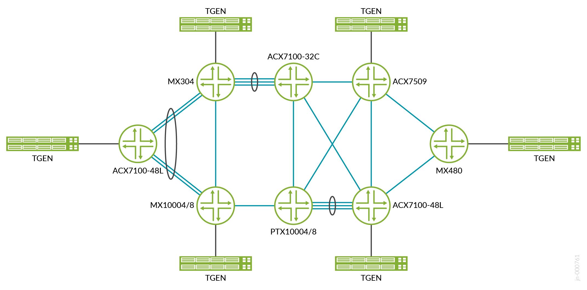

# Configuration Snippets (snips)

This `snips/` directory contains **focused, templated configuration excerpts**
extracted from the validated device configurations in [`../conf/`](../conf/).
Each file isolates one construct — an L3VPN, VPLS or NG-MVPN routing instance, a
Layer 2 circuit, an interface or unit form, a policy, an OSPF/LDP/MPLS or BGP
form — so it can be read, compared and adapted without reading a
hundred-thousand-line WAN edge configuration. Every body is measured against the
source: the `Count:` header is the number of exact source instances the template
reproduces on each device.

## Topology



Device tokens in snippet headers are the file names in `../conf/`:
`wanedge1_mx304`, `wanedge2_mx10008`, `wanedge3_acx7509`, `wanedge4_acx7100-48l`
(WAN edge PEs), `p1_ptx10003`, `p2_ptx10001-36mr` (core P routers and route
reflectors) and `ce1_acx7100-48l`, `ce2_mx480` (L2/L3 edge CEs).

## Layout

```
snips/
  junos/        ← Junos OS forms (MX304, MX10008 WAN edges; MX480 CE)
  evo/          ← Junos Evolved forms (ACX7509, ACX7100-48L, PTX10003, PTX10001-36MR)
```

207 snippet files: 105 Junos, 102 EVO; 42 constructs have
byte-identical Junos and EVO forms registered as OS-scoped mirrors in
[`_snip-library.json`](_snip-library.json).

| Sub-folder | What's in it |
|---|---|
| `routing-instances/l3vpn/` | L3VPN VRFs: VRRP many-to-many, hub-and-spoke spoke and hub forms, NG-MVPN VRFs with LDP point-to-multipoint provider tunnels. |
| `routing-instances/vpls/` | BGP-VPLS virtual switches (Junos bridge-domain and EVO VLAN forms). |
| `interfaces/` | Port, aggregate and LAG-member forms; VLAN bridge, cross-connect, routed and VRRP units; core links; loopbacks. |
| `protocols/` | Per-device OSPF area 0, LDP and MPLS forms; OSPF LFA options; iBGP overlay (WAN edge and route-reflector forms); CE eBGP groups; Layer 2 circuits and local switching; PIM; L2 learning; RSVP and LLDP. |
| `policy-options/` | Hub-and-spoke import/export policies and their route-target communities, load-balancing and redistribution policies. |
| `bridge-domains/`, `vlans/` | CE bridge domains (Junos) and VLANs (EVO). |
| `class-of-service/` | Eight-class classifiers, forwarding classes, EXP rewrite rule, unit classifier binding. |
| `chassis/`, `forwarding-options/`, `routing-options/`, `groups/` | Line-card port speeds, aggregated device count, enhanced-IP mode, hash keys, router identity, forwarding-table load balancing, graceful restart, configuration groups. |

## Snippet headers

Every snippet starts with a C-style header whose fields follow the repository
snippet contract:

- **`Seen on:`** — every validated device whose configuration reproduces this
  exact template, split by OS. Shared applicability is not a peer relationship.
- **`Count:`** — distinct source instances of the template per device and in
  total, generated from [`_bindings.json`](_bindings.json); never hand-edited.
- **`Variant group:`** — the WAN-edge and route-reflector BGP overlay forms
  publish `ewan-core-edge-bgp-overlay` with the address families they carry;
  L3VPN and VPLS instances require it with
  `variant:ewan-core-edge-bgp-overlay families=inet-vpn` or `families=l2vpn`.
- **`Pair with:`** — directed, required same-device dependencies: the snippet
  that defines a named object this one uses (a unit, policy, community or
  classifier). A reference that several forms can satisfy is not listed.

## Templated values — `$VAR` placeholders

Deployment-specific values (loopbacks, RD/RT subfields, instance names,
attachment units, VLANs, VRRP addresses and priorities, multicast groups and
sources, neighbor addresses) appear as `$VAR` placeholders. Names that other
configuration refers to by one fixed spelling and design constants are left
literal; the per-device OSPF, LDP and MPLS forms of the WAN edges reproduce their
interface lists as configured. Each header lists the placeholders it uses with
example values from a validated device; the full glossary is
[`_variables.md`](_variables.md).

## Source examples

[`_bindings.md`](_bindings.md) summarises, and [`_bindings.json`](_bindings.json)
records in full, the exact source instances and variable bindings each template
reproduces. Example values in headers are illustrative; the bindings are the
evidence.

## Scope

Snippets reproduce the active configuration of the eight design devices.
Deactivated statements and `traceoptions` are not modelled; each one is
recorded with its source location in `_source-exclusions.json`, as are the
wanedge2 MACsec and GRE test configuration, which is not part of the validated
design, and the p1/p2 route-reflector BGP configuration, whose peers are not
devices of this JVD.

### Known limitations of the published configurations

- **Hierarchical QoS.** Interface-level HQoS is part of the validated design
  (design guide, test report), but the published configurations carry no active
  HQoS: the wanedge3 `class-of-service` hierarchy is deactivated and wanedge1
  has no schedulers or traffic-control profiles. No HQoS snippet is offered.
  HQoS on interface sets and on AE, VPLS, L3VPN and L2CKT is not part of the design.
- **NG-MVPN.** The VRF snippets are exact, but the access units of the wanedge3
  and wanedge4 multicast VRFs are not in the published configurations, and the
  WAN-edge sessions to the route reflectors carry no MVPN BGP family. The access
  interfaces and MVPN signaling must be supplied.
- **Route reflectors and RP.** The WAN edges peer with route reflectors
  192.168.0.11 and 192.168.0.17, which no published device carries. The WAN
  edges use 192.168.0.17 as the native-multicast RP; p1 is configured as RP 1.1.1.8.
- **Dependencies.** Some interfaces and loopbacks referenced by the configurations
  are not defined in them, so same-device dependencies are not fully declared.
  Snippets are building blocks, not complete device configurations.
- **Underlay.** OSPF, LDP and MPLS on the WAN edges differ per device and are
  published per device. The device configurations under [`../conf/`](../conf/)
  are the as-captured reference, including the gaps above.

## Topic index

Totals are source instances across all devices; OS mirrors are listed once per
OS.

| Topic | What it shows |
|---|---|
| `junos/bridge-domains/bridge-domain-2-interfaces.conf` | Bridge domain with two units (94) |
| `junos/bridge-domains/bridge-domain-vlan-2-interfaces.conf` | VLAN bridge domain with two units (3,488) |
| `junos/bridge-domains/bridge-domain-vlan-5-interfaces.conf` | VLAN bridge domain with five units (512) |
| `junos/bridge-domains/bridge-domain-vlan.conf` | VLAN bridge domain without units (1) |
| `evo/chassis/aggregated-devices-ethernet.conf` | Aggregated Ethernet device count (5) |
| `junos/chassis/aggregated-devices-ethernet.conf` | Aggregated Ethernet device count (3) |
| `evo/chassis/fpc-acx7100-48l-4x100g.conf` | ACX7100-48L port 51 channelized into four 100G sub-ports (1) |
| `junos/chassis/fpc-mx10008-1g-10g-ports.conf` | MX10008 line card port speeds for 1G and 10G ports, powered on (1) |
| `junos/chassis/fpc-mx10008-2x400g-4x10g.conf` | MX10008 line card with two 400G ports and a 4x10G breakout (1) |
| `junos/chassis/fpc-mx10008-pic5-pic-mode-100g.conf` | MX10008 line card with PIC 5 in 100G mode, powered on (1) |
| `junos/chassis/fpc-mx304-4x100g-2x4x10g.conf` | MX304 line card port speeds with four 100G ports and two 4x10G breakouts (1) |
| `junos/chassis/fpc-mx480-4x10g-3x100g-4x100g.conf` | MX480 line card port speeds with 10G and 100G breakouts (1) |
| `junos/chassis/fpc-power-off.conf` | Powered-off line card slot (2) |
| `evo/chassis/fpc-ptx10003-port-speeds.conf` | PTX10003 line card port speeds with 40G, 25G and 10G channelization (1) |
| `evo/chassis/network-services-enhanced-ip.conf` | Enhanced-IP network services mode (4) |
| `junos/chassis/network-services-enhanced-ip.conf` | Enhanced-IP network services mode (2) |
| `junos/class-of-service/classifiers/cl-dscp-ieee8021p-8class.conf` | DSCP and IEEE 802.1p classifiers for an eight-class model (1) |
| `evo/class-of-service/classifiers/cl-exp-8class.conf` | MPLS EXP classifier for an eight-class model (1) |
| `evo/class-of-service/forwarding-classes/fc-8queue-model.conf` | Eight forwarding classes mapped to eight queues (1) |
| `junos/class-of-service/forwarding-classes/fc-8queue-model.conf` | Eight forwarding classes mapped to eight queues (1) |
| `junos/class-of-service/interfaces/ifl-ieee8021p-classifier.conf` | Unit with the IEEE 802.1p classifier (1) |
| `evo/class-of-service/rewrite-rules/rr-exp-8class.conf` | MPLS EXP rewrite rule for an eight-class model (1) |
| `junos/class-of-service/rewrite-rules/rr-exp-8class.conf` | MPLS EXP rewrite rule for an eight-class model (1) |
| `junos/class-of-service/schedulers/sch-abc-ecn.conf` | Scheduler abc with explicit congestion notification (1) |
| `junos/firewall/filter-vrrp-discard.conf` | Firewall filter vrrp discarding VRRP and AH packets sent to 224.0.0.18 (1) |
| `evo/forwarding-options/enhanced-hash-key-mpls-no-payload.conf` | Enhanced hash key for MPLS without payload hashing (1) |
| `junos/forwarding-options/enhanced-hash-key-mpls-no-payload.conf` | Enhanced hash key for MPLS without payload hashing (1) |
| `junos/forwarding-options/hash-key-inet-layer-3-4.conf` | Hash key on IPv4 layer 3 and layer 4 fields (1) |
| `evo/forwarding-options/hash-key-mpls-all-labels.conf` | Hash key on IPv4/IPv6 layer 3-4, all MPLS labels with IP payload, and Ethernet MACs (1) |
| `junos/forwarding-options/hash-key-mpls-three-labels-multiservice.conf` | Hash key on the top three MPLS labels and Ethernet MACs (1) |
| `evo/forwarding-options/hash-key-mpls-three-labels.conf` | Hash key on the top three MPLS labels (1) |
| `evo/forwarding-options/hash-key-seed-inet-mpls-multiservice.conf` | Hash key with a hash seed on IPv4 layer 3-4, all MPLS labels and Ethernet MACs (1) |
| `evo/forwarding-options/hash-key-seed-mpls-payload-multiservice.conf` | Hash key with a hash seed on all MPLS labels with IP payload and Ethernet MACs (1) |
| `evo/forwarding-options/load-balance-label-capability.conf` | Load-balance label capability (1) |
| `junos/forwarding-options/load-balance-label-capability.conf` | Load-balance label capability (1) |
| `evo/groups/apply-global-two.conf` | Two configuration groups applied at the top level (1) |
| `evo/groups/gr-zr-wavelength.conf` | Configuration group setting the optics wavelength on five ports (1) |
| `evo/interfaces/ifd-ae-description-lacp-fast.conf` | Described aggregated Ethernet bundle with active fast LACP (1) |
| `junos/interfaces/ifd-ae-description-lacp-fast.conf` | Described aggregated Ethernet bundle with active fast LACP (1) |
| `evo/interfaces/ifd-ae-description-link-speed-mixed-lacp-fast.conf` | Described mixed-speed aggregated Ethernet bundle with active fast LACP (2) |
| `evo/interfaces/ifd-ae-disable-flexible-lacp-fast-system-id.conf` | Disabled flexible-services aggregated Ethernet bundle with fast LACP and a fixed system ID (1) |
| `junos/interfaces/ifd-ae-disable-flexible-lacp-fast-system-id.conf` | Disabled flexible-services aggregated Ethernet bundle with fast LACP and a fixed system ID (1) |
| `evo/interfaces/ifd-ae-flexible-lacp-fast-system-id.conf` | Flexible-services aggregated Ethernet bundle with fast LACP and a fixed system ID (1) |
| `junos/interfaces/ifd-ae-flexible-lacp-fast-system-id.conf` | Flexible-services aggregated Ethernet bundle with fast LACP and a fixed system ID (1) |
| `junos/interfaces/ifd-ae-flexible-lacp-fast.conf` | Flexible-services aggregated Ethernet bundle with active fast LACP (1) |
| `evo/interfaces/ifd-ae-flexible-lacp.conf` | Flexible-services aggregated Ethernet bundle with active LACP (1) |
| `evo/interfaces/ifd-breakout-100g.conf` | Port channelized into 100G sub-ports (1) |
| `evo/interfaces/ifd-description-100g.conf` | Described 100G port (5) |
| `evo/interfaces/ifd-description.conf` | Interface description (6) |
| `junos/interfaces/ifd-description.conf` | Interface description (3) |
| `evo/interfaces/ifd-disable.conf` | Administratively disabled port (2) |
| `junos/interfaces/ifd-disable.conf` | Administratively disabled port (3) |
| `junos/interfaces/ifd-flexible-ethernet-services-description-speed-10g.conf` | Described 10G port with flexible VLAN tagging and flexible Ethernet services (1) |
| `evo/interfaces/ifd-flexible-ethernet-services-description.conf` | Described port with flexible VLAN tagging and flexible Ethernet services (7) |
| `junos/interfaces/ifd-flexible-ethernet-services-description.conf` | Described port with flexible VLAN tagging and flexible Ethernet services (7) |
| `junos/interfaces/ifd-flexible-ethernet-services-speed-10g.conf` | 10G port with flexible VLAN tagging and flexible Ethernet services (1) |
| `evo/interfaces/ifd-flexible-ethernet-services.conf` | Port with flexible VLAN tagging and flexible Ethernet services (3) |
| `junos/interfaces/ifd-flexible-ethernet-services.conf` | Port with flexible VLAN tagging and flexible Ethernet services (1) |
| `evo/interfaces/ifd-hierarchical-scheduler-flexible-ethernet-services.conf` | Hierarchical-scheduler port with flexible VLAN tagging and flexible Ethernet services (1) |
| `evo/interfaces/ifd-lag-member-ether-100g.conf` | 100G aggregated Ethernet member link through ether-options (2) |
| `evo/interfaces/ifd-lag-member-ether.conf` | Aggregated Ethernet member link through ether-options (2) |
| `junos/interfaces/ifd-lag-member-gigether-10g.conf` | 10G aggregated Ethernet member link through gigether-options (1) |
| `evo/interfaces/ifd-lag-member-gigether-description-100g.conf` | Described 100G aggregated Ethernet member link through gigether-options (3) |
| `evo/interfaces/ifd-lag-member-gigether-description.conf` | Described aggregated Ethernet member link through gigether-options (2) |
| `evo/interfaces/ifd-lag-member-gigether.conf` | Aggregated Ethernet member link through gigether-options (3) |
| `junos/interfaces/ifd-lag-member-gigether.conf` | Aggregated Ethernet member link through gigether-options (6) |
| `evo/interfaces/ifd-speed-100g.conf` | 100G port speed (4) |
| `junos/interfaces/ifd-speed-10g.conf` | 10G port speed (34) |
| `junos/interfaces/ifd-speed-1g.conf` | 1G port speed (1) |
| `evo/interfaces/ifd-unused.conf` | Port marked unused (1) |
| `evo/interfaces/ifl-core-inet-mpls.conf` | Core-facing point-to-point link with IPv4 and MPLS families (22) |
| `junos/interfaces/ifl-core-inet-mpls.conf` | Core-facing point-to-point link with IPv4 and MPLS families (4) |
| `junos/interfaces/ifl-loopback-inet-primary-iso-inet6-primary.conf` | Primary IPv4 and IPv6 loopback addresses with an ISO address (1) |
| `evo/interfaces/ifl-loopback-inet-primary.conf` | Primary IPv4 loopback address (2) |
| `junos/interfaces/ifl-loopback-inet-primary.conf` | Primary IPv4 loopback address (1) |
| `junos/interfaces/ifl-loopback-inet-two-addresses.conf` | Loopback unit with two IPv4 addresses (1) |
| `evo/interfaces/ifl-loopback-inet.conf` | Loopback unit with one IPv4 address (201) |
| `junos/interfaces/ifl-loopback-inet.conf` | Loopback unit with one IPv4 address (200) |
| `evo/interfaces/ifl-loopback-mpls.conf` | MPLS family on the primary loopback unit (1) |
| `evo/interfaces/ifl-vlan-bridge.conf` | VLAN-tagged bridge unit (6,538) |
| `junos/interfaces/ifl-vlan-bridge.conf` | VLAN-tagged bridge unit (10,725) |
| `evo/interfaces/ifl-vlan-ccc-family-ccc.conf` | VLAN-tagged circuit cross-connect unit with family ccc (7,999) |
| `junos/interfaces/ifl-vlan-ccc-family-ccc.conf` | VLAN-tagged circuit cross-connect unit with family ccc (3,000) |
| `evo/interfaces/ifl-vlan-ccc.conf` | VLAN-tagged circuit cross-connect unit (8,001) |
| `junos/interfaces/ifl-vlan-ccc.conf` | VLAN-tagged circuit cross-connect unit (5,000) |
| `junos/interfaces/ifl-vlan-inet-mpls.conf` | VLAN-tagged IPv4 unit with MPLS (1) |
| `evo/interfaces/ifl-vlan-inet-vrrp-accept-data.conf` | VLAN-tagged IPv4 unit with a VRRP group that accepts data (1,023) |
| `junos/interfaces/ifl-vlan-inet-vrrp-accept-data.conf` | VLAN-tagged IPv4 unit with a VRRP group that accepts data (1,024) |
| `evo/interfaces/ifl-vlan-inet-vrrp-preempt-accept-data.conf` | VLAN-tagged IPv4 unit with a preempting VRRP group that accepts data (1) |
| `evo/interfaces/ifl-vlan-inet.conf` | VLAN-tagged IPv4 unit (3,136) |
| `junos/interfaces/ifl-vlan-inet.conf` | VLAN-tagged IPv4 unit (5,331) |
| `evo/policy-options/community/cm-instance-target.conf` | Route-target community named after its hub-and-spoke instance (2,002) |
| `junos/policy-options/community/cm-instance-target.conf` | Route-target community named after its hub-and-spoke instance (4,004) |
| `evo/policy-options/policy-statement/per-packet-load-balance-accept.conf` | Per-packet load-balancing policy with an explicit accept (3) |
| `junos/policy-options/policy-statement/per-packet-load-balance-accept.conf` | Per-packet load-balancing policy with an explicit accept (2) |
| `evo/policy-options/policy-statement/per-packet-load-balance.conf` | Per-packet load-balancing policy (2) |
| `junos/policy-options/policy-statement/per-packet-load-balance.conf` | Per-packet load-balancing policy (3) |
| `evo/policy-options/policy-statement/ps-bgp-to-ospf.conf` | Policy bgp-to-ospf accepting BGP routes (2) |
| `junos/policy-options/policy-statement/ps-bgp-to-ospf.conf` | Policy bgp-to-ospf accepting BGP routes (2) |
| `junos/policy-options/policy-statement/ps-default-route.conf` | Policy accepting the static default route and rejecting the rest (1) |
| `evo/policy-options/policy-statement/ps-el.conf` | Policy EL accepting routes that match prefix-list el-pe1, with a no-insert-el term (1) |
| `junos/policy-options/policy-statement/ps-el.conf` | Policy EL accepting routes that match prefix-list el-pe3, with a no-insert-el term (1) |
| `junos/policy-options/policy-statement/ps-export-connected.conf` | Policy EXPORT_CONNECTED accepting BGP routes (1) |
| `junos/policy-options/policy-statement/ps-hub-spoke-export-bgp-direct.conf` | Hub-and-spoke VRF export policy tagging BGP and direct routes (2,001) |
| `evo/policy-options/policy-statement/ps-hub-spoke-export-bgp.conf` | Hub-and-spoke VRF export policy tagging BGP routes (1,001) |
| `junos/policy-options/policy-statement/ps-hub-spoke-export-direct-bgp.conf` | Hub-and-spoke VRF export policy tagging direct and BGP routes (1) |
| `evo/policy-options/policy-statement/ps-hub-spoke-import.conf` | Hub-and-spoke VRF import policy matching the instance community (1,001) |
| `junos/policy-options/policy-statement/ps-hub-spoke-import.conf` | Hub-and-spoke VRF import policy matching the instance community (2,002) |
| `evo/policy-options/policy-statement/ps-next-hop-self.conf` | Policy next-hop-self setting next-hop self and accepting (2) |
| `evo/policy-options/policy-statement/ps-nhs.conf` | Policy nhs setting next-hop self (2) |
| `evo/policy-options/policy-statement/ps-null.conf` | Reject-all policy named null (2) |
| `junos/policy-options/policy-statement/ps-pplb-accept.conf` | Accept-all policy named pplb (1) |
| `evo/policy-options/policy-statement/ps-redistribute-vpn.conf` | Policy accepting BGP routes and rejecting the rest (2) |
| `evo/policy-options/policy-statement/ps-send-ospf.conf` | Policy accepting OSPF routes (4) |
| `junos/policy-options/policy-statement/ps-send-ospf.conf` | Policy accepting OSPF routes (2) |
| `evo/policy-options/policy-statement/ps-send-static.conf` | Policy send-static accepting static routes (2) |
| `junos/policy-options/policy-statement/ps-send-static.conf` | Policy send-static accepting static routes (1) |
| `evo/policy-options/prefix-list/pl-el-pe1.conf` | Prefix-list el-pe1 with one host route (1) |
| `junos/policy-options/prefix-list/pl-el-pe3.conf` | Prefix-list el-pe3 with one host route (1) |
| `evo/protocols/bgp-advertise-peer-as-graceful-restart.conf` | BGP advertise-peer-as with graceful restart (1) |
| `evo/protocols/bgp-advertise-peer-as-local-as-graceful-restart.conf` | BGP advertise-peer-as with a local AS and graceful restart (1) |
| `junos/protocols/bgp-advertise-peer-as-local-as-graceful-restart.conf` | BGP advertise-peer-as with a local AS and graceful restart (1) |
| `junos/protocols/bgp-advertise-peer-as.conf` | BGP advertise-peer-as (1) |
| `evo/protocols/bgp-group-bgp-mcast-1-wanedge3.conf` | iBGP group bgp_mcast_1 with inet, inet-vpn and inet-mvpn families and three neighbors (1) |
| `junos/protocols/bgp-group-ebgp-export-connected.conf` | External BGP group exporting through the EXPORT_CONNECTED policy (1,000) |
| `junos/protocols/bgp-group-ebgp-export-default.conf` | External BGP group exporting through the default policy (1,000) |
| `evo/protocols/bgp-overlay-pe-labeled-unicast.conf` | WAN-edge iBGP overlay with labeled unicast, L3VPN, VPLS and route-target families (1) |
| `junos/protocols/bgp-overlay-pe-labeled-unicast.conf` | WAN-edge iBGP overlay with labeled unicast, L3VPN, VPLS and route-target families (1) |
| `evo/protocols/bgp-overlay-pe-local-as.conf` | WAN-edge iBGP overlay with L3VPN, VPLS and route-target families and a group local AS (1) |
| `junos/protocols/bgp-overlay-pe.conf` | WAN-edge iBGP overlay with L3VPN, VPLS and route-target families (1) |
| `junos/protocols/l2-learning-global-mac-limit-statistics.conf` | Global MAC limit and MAC statistics (1) |
| `evo/protocols/l2-learning-global-mac-limit.conf` | Global MAC table limit of 700,000 entries (2) |
| `evo/protocols/l2circuit-ethernet-vlan-control-word.conf` | LDP-signalled Layer 2 circuit with control word and Ethernet VLAN encapsulation (9,000) |
| `junos/protocols/l2circuit-hsb-control-word.conf` | Hot-standby Layer 2 circuit with control word (4) |
| `junos/protocols/l2circuit-hsb-ethernet-vlan-control-word.conf` | Hot-standby Layer 2 circuit with control word and Ethernet VLAN encapsulation (4,491) |
| `junos/protocols/l2circuit-hsb-ethernet-vlan.conf` | Hot-standby Layer 2 circuit with Ethernet VLAN encapsulation (1) |
| `junos/protocols/l2circuit-hsb-ignore-mismatch.conf` | Hot-standby Layer 2 circuit ignoring encapsulation and MTU mismatches (1) |
| `junos/protocols/l2circuit-hsb-ignore-mtu-mismatch.conf` | Hot-standby Layer 2 circuit ignoring MTU mismatches (1) |
| `junos/protocols/l2circuit-hsb.conf` | Hot-standby Layer 2 circuit (2) |
| `junos/protocols/l2circuit-local-switching-ethernet-vlan-ignore-mismatch.conf` | Local-switching cross-connect with ethernet-vlan encapsulation ignoring encapsulation and MTU mismatch (1) |
| `evo/protocols/l2circuit-local-switching.conf` | Locally switched Layer 2 circuit between two units (2,500) |
| `junos/protocols/l2circuit-local-switching.conf` | Locally switched Layer 2 circuit between two units (1,000) |
| `evo/protocols/ldp-auto-targeted-3-core-loopback-p2mp.conf` | LDP with automatic targeted sessions on three core links and the loopback, and point-to-multipoint LSPs (1) |
| `junos/protocols/ldp-auto-targeted-3-core-loopback-p2mp.conf` | LDP with automatic targeted sessions on three core links and the loopback, and point-to-multipoint LSPs (1) |
| `evo/protocols/ldp-auto-targeted-4-core-loopback.conf` | LDP with automatic targeted sessions on four core links and the loopback (1) |
| `evo/protocols/ldp-auto-targeted-8-core-loopback-p2mp.conf` | LDP with automatic targeted sessions on eight core links and the loopback, with point-to-multipoint LSPs (1) |
| `evo/protocols/ldp-interface-3-core-loopback.conf` | LDP on three core links and the loopback (1) |
| `junos/protocols/ldp-wanedge1.conf` | LDP with automatic targeted sessions on the core links and loopback and point-to-multipoint LSPs (1) |
| `evo/protocols/ldp-wanedge4.conf` | LDP with automatic targeted sessions on named links, all interfaces and the loopback, with point-to-multipoint LSPs (1) |
| `junos/protocols/lldp-interface-all.conf` | LLDP on all interfaces (1) |
| `evo/protocols/mpls-interface-4-core.conf` | MPLS on four core links (2) |
| `evo/protocols/mpls-interface-8-core.conf` | MPLS on eight core links (1) |
| `junos/protocols/mpls-interface-all.conf` | MPLS on all interfaces (1) |
| `junos/protocols/mpls-wanedge1.conf` | MPLS on the core links with two entropy-label LSPs (1) |
| `junos/protocols/mpls-wanedge2.conf` | MPLS on the core links with one LSP (1) |
| `evo/protocols/mpls-wanedge3.conf` | MPLS on the core links and loopback with one entropy-label LSP (1) |
| `evo/protocols/mpls-wanedge4.conf` | MPLS on the core links with one LSP (1) |
| `evo/protocols/ospf-area0-ce1.conf` | OSPF area 0 with four protected core links and 100 ms BFD (1) |
| `evo/protocols/ospf-area0-p1.conf` | OSPF area 0 with eight protected core links and 10 ms BFD (1) |
| `evo/protocols/ospf-area0-p2.conf` | OSPF area 0 with four protected core links and 10 ms BFD (1) |
| `junos/protocols/ospf-area0-wanedge1.conf` | OSPF area 0 with one protected core bundle and plain access-unit interfaces (1) |
| `junos/protocols/ospf-area0-wanedge2.conf` | OSPF area 0 with one protected core link and plain access-unit interfaces (1) |
| `evo/protocols/ospf-area0-wanedge3.conf` | OSPF area 0 with three protected core links and plain access-unit interfaces (1) |
| `evo/protocols/ospf-area0-wanedge4.conf` | OSPF area 0 with protected core links and two access units (1) |
| `evo/protocols/ospf-backup-spf-options-traffic-engineering.conf` | OSPF remote LFA backup options with traffic engineering (5) |
| `junos/protocols/ospf-backup-spf-options-traffic-engineering.conf` | OSPF remote LFA backup options with traffic engineering (2) |
| `evo/protocols/pim-interface-sparse.conf` | PIM sparse-mode interface (33) |
| `junos/protocols/pim-interface-sparse.conf` | PIM sparse-mode interface (28) |
| `evo/protocols/pim-rp-local.conf` | Local PIM rendezvous point on the router loopback (1) |
| `evo/protocols/pim-rp-static-interface.conf` | Static PIM rendezvous point with one PIM interface in the default mode (1) |
| `junos/protocols/pim-rp-static-interface.conf` | Static PIM rendezvous point with one PIM interface in the default mode (1) |
| `junos/protocols/rsvp-interface-all.conf` | RSVP on all interfaces (1) |
| `junos/routing-instances/l3vpn/ri-l3vpn-ebgp-as-override-vrf-policy.conf` | L3VPN VRF with an eBGP CE session using as-override and explicit import/export policies (2,000) |
| `evo/routing-instances/l3vpn/ri-l3vpn-ebgp-export-vrf-policy.conf` | L3VPN VRF with an exporting eBGP CE session and explicit import/export policies (1,000) |
| `evo/routing-instances/l3vpn/ri-l3vpn-ebgp-router-id-vrf-target.conf` | L3VPN VRF with an eBGP CE session, a VRF router ID and a route target (1,024) |
| `junos/routing-instances/l3vpn/ri-l3vpn-ebgp-router-id-vrf-target.conf` | L3VPN VRF with an eBGP CE session, a VRF router ID and a route target (1,024) |
| `evo/routing-instances/l3vpn/ri-l3vpn-ebgp-vrf-policy.conf` | L3VPN VRF with an eBGP CE session and explicit import/export policies (1,000) |
| `evo/routing-instances/l3vpn/ri-l3vpn-mvpn-ibgp-rp-local-vpn-mcast-1.conf` | NG-MVPN VRF vpn-mcast_1 with a VRF iBGP session acting as PIM RP (1) |
| `junos/routing-instances/l3vpn/ri-l3vpn-mvpn-ibgp-rp-static-vpn-mcast-1.conf` | NG-MVPN VRF vpn-mcast_1 with a VRF iBGP session and a static PIM RP (1) |
| `evo/routing-instances/l3vpn/ri-l3vpn-mvpn-rp-local.conf` | NG-MVPN VRF acting as PIM RP for its group over LDP point-to-multipoint tunnels (99) |
| `evo/routing-instances/l3vpn/ri-l3vpn-mvpn-rp-static-group-range-null-register.conf` | NG-MVPN VRF with a static PIM RP, a local group range and null-register processing over LDP point-to-multipoint tunnels (99) |
| `junos/routing-instances/l3vpn/ri-l3vpn-mvpn-rp-static-group-range.conf` | NG-MVPN VRF with a static PIM RP and a local group range over LDP point-to-multipoint tunnels (198) |
| `evo/routing-instances/l3vpn/ri-l3vpn-mvpn-rp-static-null-register-vpn-mcast-1.conf` | NG-MVPN VRF vpn-mcast_1 with a static PIM RP and null-register processing (1) |
| `junos/routing-instances/l3vpn/ri-l3vpn-mvpn-rp-static-vpn-mcast-1.conf` | NG-MVPN VRF vpn-mcast_1 with a static PIM RP (1) |
| `junos/routing-instances/ri-bgp-group-inet-any-wanedge2.conf` | Routing instance l3vpn_bg_5485 with only a BGP group for family inet any (1) |
| `junos/routing-instances/vpls/ri-vpls-virtual-switch-bridge-domain-flow-label.conf` | BGP-VPLS virtual switch with flow labels and one VLAN bridge domain (1) |
| `junos/routing-instances/vpls/ri-vpls-virtual-switch-bridge-domain-interface.conf` | BGP-VPLS virtual switch with one VLAN bridge domain and its attachment unit also listed at instance level (2) |
| `junos/routing-instances/vpls/ri-vpls-virtual-switch-bridge-domain.conf` | BGP-VPLS virtual switch with one VLAN bridge domain (997) |
| `evo/routing-instances/vpls/ri-vpls-virtual-switch-vlans-flow-label.conf` | BGP-VPLS virtual switch with flow labels and one VLAN (1) |
| `evo/routing-instances/vpls/ri-vpls-virtual-switch-vlans.conf` | BGP-VPLS virtual switch with one VLAN (1,999) |
| `junos/routing-options/autonomous-system-loops.conf` | Autonomous system number allowing it twice in an AS path (1) |
| `evo/routing-options/autonomous-system.conf` | Autonomous system number (4) |
| `junos/routing-options/autonomous-system.conf` | Autonomous system number (2) |
| `evo/routing-options/forwarding-table-chained-composite-l3vpn.conf` | Chained composite next hops for L3VPN ingress (1) |
| `junos/routing-options/forwarding-table-chained-composite-l3vpn.conf` | Chained composite next hops for L3VPN ingress (1) |
| `junos/routing-options/forwarding-table-load-balance-pplb.conf` | Forwarding-table export of two load-balance policies (1) |
| `evo/routing-options/forwarding-table-pplb-load-balance-ecmp-fast-reroute.conf` | Forwarding-table load balancing through two policies with ECMP fast reroute (1) |
| `evo/routing-options/forwarding-table-pplb.conf` | Forwarding-table per-packet load balancing (2) |
| `junos/routing-options/forwarding-table-pplb.conf` | Forwarding-table per-packet load balancing (1) |
| `evo/routing-options/graceful-restart.conf` | Graceful restart (2) |
| `junos/routing-options/graceful-restart.conf` | Graceful restart (1) |
| `evo/routing-options/router-id.conf` | Router ID (4) |
| `junos/routing-options/router-id.conf` | Router ID (2) |
| `junos/routing-options/static-default-discard.conf` | Static default route to discard (1) |
| `evo/vlans/vlan-2-interfaces.conf` | VLAN with two units (1,501) |
| `evo/vlans/vlan-3-interfaces.conf` | VLAN with three units (1) |
| `evo/vlans/vlan-4-interfaces.conf` | VLAN with four units (511) |
