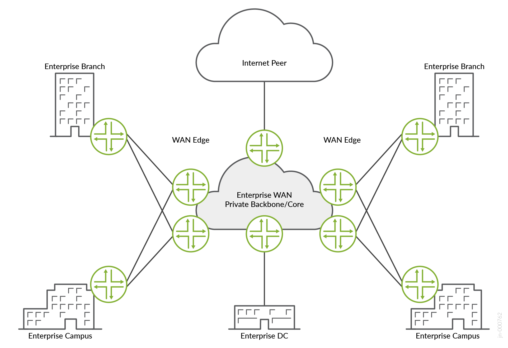

# Enterprise WAN Core and Edge — Juniper Validated Design

Published: 2025-05-28

## About this Document

This document explains a Juniper Validated Design for an enterprise WAN edge and core network with an MPLS-based backbone. It focuses on validating Layer 2 and Layer 3 VPN services, VRRP, NGMVPN, and VPN deployment models. We explain the design and testing methodologies, summarize key results, and provide implementation recommendations for the validated design.

### Solution Platforms Summary

| Role | Platforms |
|------|-----------|
| CE (L2/L3 Edge) | ACX7100-48L Universal Metro Router, MX480 Universal Edge Router |
| WAN Edge | MX304 Universal Edge Router, ACX7100-48L Universal Metro Router, ACX7509 Universal Metro Router |
| Provider (P) Router | PTX10003-160C, PTX10008 |

## Use Case and Reference Architecture

A big enterprise network can include multiple campus and branch locations. These remote locations connect to the enterprise WAN (EWAN) private backbone/core network to access various business-critical applications and to communicate with each other. The remote campus and branch locations use L2/L3 VPN services to communicate with each other. The remote users also connect to public cloud providers to access applications such as Office365 and Microsoft Teams. Enterprises such as educational institutions or hospitals have multiple surveillance cameras installed that stream multicast video to one or more remote monitoring centers. The EWAN backbone or core network, which interconnects the different campus and branch networks must be resilient and reliable.

The remote campus and branch locations use L2/L3 VPN services to access the business-critical applications running in the enterprise private data center, and to communicate with each other. The remote users can also connect to public cloud providers and access applications such as Office365 and Microsoft Teams. The connection to the enterprise data center network that runs the business-critical applications must be resilient and reliable. This document validates multiple connection models that EWAN administrators can use. This document also validates a scenario where enterprises such as educational institutions or hospitals have multiple surveillance cameras installed that stream multicast video to one or more remote monitoring centers. The multicast traffic is transported inside of NGMVPN tunnels.

Remote campus and branch networks can connect to the headquarters network using Virtual Private LAN services (VPLS), Layer 2 Circuits (L2CKT), or L3VPN services. The VPN connections can use a hub-spoke design, where traffic from the campus and branch networks passes through a central HQ device that acts as a hub. The VPN connections can be single-homed, or multihomed to avoid single points of failure. The WAN edge devices use QoS to control bandwidth and WAN traffic is transported using MPLS.

## Solution Design and Architecture

This validated design focuses on validating a reliable network design that enables the campus and branch locations to connect to the private enterprise data center and the Internet. The WAN edge routers in the remote locations use MPLS tunnels to connect to the enterprise data center WAN edge router at the enterprise headquarters network. An MPLS WAN core network enables redundant high-performance delivery of the centralized services running in the headquarters data center and provides access to the Internet. The VPLS, L2CKT, and L3VPN services are popular L2/L3 VPN connection methods that enterprises use for the MPLS overlay. The enterprise WAN uses OSPF as the IGP, and LDP for MPLS label distribution. Since the WAN transport network must be resilient and robust, MPLS-related high availability protocols such as LFA, Bi-Directional Forwarding Detection (BFD), and Equal Cost Multi-Path (ECMP) are used.

The building blocks of this validated design include:

- L2VPN Services
- BGP-VPLS, L2Circuit
- Multihomed Single-Active and Single-Homed
- L3VPN Services with VRRP (Active/Standby)
- L3VPN many-to-many and Hub-Spoke deployment
- HQOS at the IFD Level
- Native multicast
- LDP for label distribution
- Loop Free Alternate (LFA) Fast Reroute
- Internal BGP (IBGP) between Provider Edge (PE) and Route-Reflector (RR) node
- NG-MVPN with S-PMSI
- Fast failover and detection mechanism (LFA/FRR, BFD, OAM)
- ECMP

## Solution and Validation Key Parameters

### Key Feature List

The supported key features include:

- Single-homed VPLS, L2CKT and L3VPN Service with fast reroute (FRR) features enabled in the MPLS domain
- VRRP
- OSPF as IGP in the core
- Route-Reflection session with all the PEs
- LDP
- MPLS-based transport network
- LFA (link/node), Route Reflection
- IPv4
- LACP
- Aggregated Ethernet (AE) Bundles
- Bi-directional Forwarding and Detection (BFD)
- ECMP
- VLAN (802.1Q)

### Test Bed Diagram

The test bed topology emulates the following network segments:

- Campus and branch WAN edge
- Enterprise data center WAN edge
- Enterprise WAN backbone

### Solution Validation Goals

This report validates that the ACX7100-48L, ACX7509 and MX304 platforms can terminate L2 or L3 VPN connections from campus and branch locations. HQoS is enabled to validate the service levels. Multicast traffic is generated to validate the surveillance monitoring use case. The provider multicast service interface (PMSI) can set up the end-to-end provider tunnels.

Validated scenarios include:

- VPLS, L2CKT and L3VPN services with unicast and BUM traffic
- HQoS at IFD, IFL, and queue levels
- Multicast delivery
- NGMVPN with LDP
- L3VPN native and hub/spoke models
- L3VPN with VRRP
- Single-homed VPLS services

#### Cumulative Traffic Flows Used During Validation

| Traffic Stream | Packet Size | Rate |
|----------------|-------------|------|
| VPLS with BUM Traffic from WAN edge to remote WAN Edge and TGEN | 512 Bytes | 100 Mbps |
| L2CKT Traffic from WAN edge to remote WAN Edge and TGEN | 1024 Bytes | 400 Mbps |
| L3VPN Traffic for hub and spoke scenario | 512 Bytes | 50 Mbps |
| L3VPN Traffic for many-to-many with VRRP scenario | 512 Bytes | 100 Mbps |
| Native Multicast Traffic | 512 Bytes | 50 Mbps |
| Multicast Traffic from Source WAN Edge to remote PE and TGEN | 512 Bytes | 50 Mbps |

The primary test goals include:

- Validate end-to-end service delivery
- Validate single-homed VPLS and L2CKT
- Validate L3VPN single-active scenarios with VRRP
- Validate LDP-based MPLS transport
- Capture failure and convergence metrics
- Capture CPU and memory utilization
- Identify and document product limitations and anomalies
- Validate network performance and convergence time under failure conditions:
  - Link failures on the WAN edge device
  - Link failures on core devices
  - Node failures
  - VRRP Active/Standby switchovers
  - Process restarts (RPD, DCD, CHASSISD, MGD, deactivate/activate configuration knobs)

### Solution Validation Non-Goals

The protocols and technologies that are not tested include:

- VPLS multihoming
- VPLS IRB and unnumbered interface
- HQoS on interface sets
- HQoS on AE, VPLS, L3VPN, L2CKT
- NGMVPN with RSVP
- EVPN-MPLS Segment Routing
- Management and Automation
- Telemetry

## Results Summary and Analysis

This JVD successfully passes all validation test cases. All scalability and performance metrics are within the anticipated limits. The ACX7100-48L, ACX7509 and MX304 platforms running Junos OS Release 22.3R1-S1 satisfy the requirements to deliver robust edge and core services.

### Scale Summary on WAN Edge and Core

| WAN Edge Feature | Scale |
|------------------|-------|
| VPLS Instance scale | 1,000 |
| L2CKT | 4,000 |
| L3VPN w/ VRRP (1 Group) | 1,000 |
| L3VPN (Hub & Spoke) | 1,000 |
| Switching instances | 1,000 |
| VLANs/bridge domains/VNIs | 7,000+ |
| MAC addresses | 50,000 (50/inst) |
| ARP entries | 50,000 |
| eBGP sessions | 2,000 |
| VRF instances | 2,000 |
| Multicast (*,G)/(S,G) | 10,300 |
| Multicast S,G | 10,300 |
| IGMPv2 snooping | 10,300 |
| HQOS | 100 |
| NGMVPN Instance | 100 |
| IGP (OSPF) | 50K |

This JVD validates traffic convergence using scenarios such as link and node failure in the MPLS transport and data center networks. The observed traffic restoration time for this JVD was less than 80 ms.

## Recommendations

ACX7100-48L, ACX7509, and MX304 platforms support deterministic and efficient mechanisms for end-to-end service delivery. These platforms best suit WAN-Edge and lean-edge deployments. They provide flexible feature sets that meet customer requirements.

This validated design uses Junos OS Release 22.3R1-S1 as a minimum recommended version.

While the reference design of this JVD is for the WAN edge and core infrastructure, the technologies and practical solutions that are discussed can be leveraged as building blocks from which additional designs might evolve that support multidimensional network architectures.
