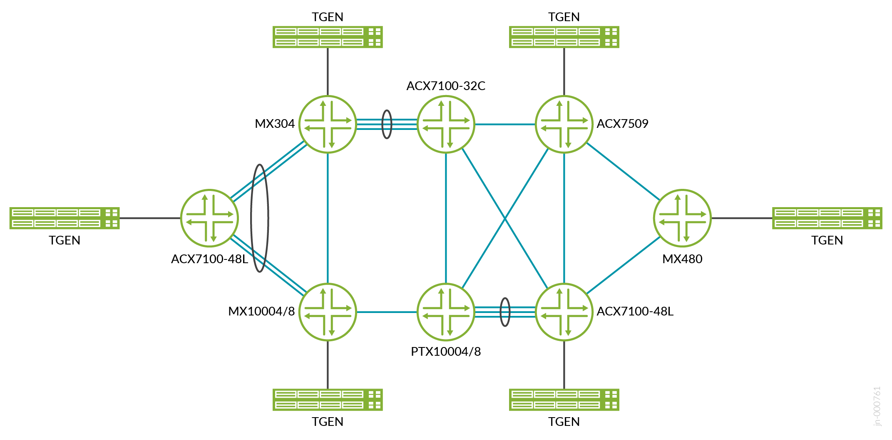

# JVD Test Report Brief: Enterprise WAN Core and Edge

## Introduction

This test report brief contains qualification test report data for the Enterprise WAN Core and Edge Juniper Validated Design (JVD). These tests validate the ACX7100, ACX7509 and MX304 as EWAN Edge devices and PTX10008 and PTX10003-160C as core network devices. Various services such as VPLS/L2VPN, L2CKT and L3VPN in native and hub-and-spoke deployment models have been covered along with HCoS profiles for traffic prioritization for voice, video, and data. Multicast and NGMVPN services have been used to cover the scenario of having multiple CCTV cameras as receivers.

## Test Topology

## Platforms Tested

| Role | Platform | OS |
|------|----------|-----|
| L2/L3 Edge | ACX7100-48L | Junos OS Evolved 23.2R2 |
| L2/L3 Edge | MX480 | Junos OS 23.2R2 |
| WAN Edge | MX304 | Junos OS 23.2R2 |
| WAN Edge | MX10004/MX10008 | Junos OS 23.2R2 |
| WAN Edge | ACX7100-48L | Junos OS Evolved 23.2R2 |
| WAN Edge | ACX7509 | Junos OS Evolved 23.2R2 |
| P Router | ACX7100-32C | Junos OS Evolved 23.2R2 |
| P Router | PTX10004/PTX10008 | Junos OS 23.2R2 |

## Version Qualification History

This JVD has been qualified in Junos OS 23.2R2 and Junos OS Evolved 23.2R2.

## Scale and Performance Data

Validated KPIs are multi-dimensional and reflect observations in customer networks or reasonably represent solution capabilities. These numbers do not indicate the maximum scale and performance of individual tested devices.

| WAN Edge Feature | Scale |
|------------------|-------|
| VPLS Instance scale | 1,000 |
| L2CKT | 4,000 |
| L3VPN w/ VRRP (1 Group) | 512 |
| L3VPN (Hub & Spoke) | 1,000 |
| Switching instances | 1,000 |
| VLANs/bridge domains/VNIs | 7,000+ |
| MAC addresses | 50,000 (50/inst) |
| ARP entries | 50,000 |
| eBGP sessions | 2,000 |
| VRF instances | 2,000 |
| Multicast (*,G)/(S,G) | 10,300 |
| Multicast S,G | 10,300 |
| IGMPv2 snooping | 10,300 |
| HQOS | 94 IFLs Port/IFD |
| NGMVPN Instance Scale | 100 with 10,000 (*,G)/(S,G) |

## Traffic Profiles

| Stream Block | Load | Packet Size |
|--------------|------|-------------|
| VPLS UC L2/L3 Edge1 to L2/L3 Edge2 bidirectional | 85 Mbps | 512 |
| VPLS MC L2/L3 Edge1 to L2/L3 Edge2 bidirectional | 10 Mbps | 1024 |
| VPLS BC L2/L3 Edge1 to L2/L3 Edge2 bidirectional | 10 Mbps | 1024 |
| L2circuit L2/L3 Edge1 to L2/L3 Edge2 | 215 Mbps | 512 |
| L2circuit WANEdge1 to WANEdge3/WANEdge4 | 130 Mbps | 512 |
| L2circuit MC WANEdge1 to WANEdge3/WANEdge4 | 10 Mbps | 1024 |
| L2circuit BC WANEdge1 to WANEdge3/WANEdge4 | 10 Mbps | 1024 |
| L2circuit MC L2/L3 Edge1 to L2/L3 Edge2 | 10 Mbps | 1024 |
| L2circuit BC L2/L3 Edge1 to L2/L3 Edge2 | 10 Mbps | 1024 |
| L3VPN Hub spoke WANEdge1 WANEdge3 L2/L3 Edge2 WANEdge2 bidirectional | 10 Mbps | 512 |
| VRRP L2/L3 Edge1 to L2/L3 Edge2 bidirectional | 50 Mbps | 512 |
| HQOS WANEdge1 WANEdge3 bidirectional | 43 Mbps | 512 |
| NGMVPN WANEdge3 WANEdge1 and WANEdge4 WANEdge2 | 43 Mbps | 512 |
| Native multicast WANEdge3 WANEdge1 and WANEdge4 WANEdge2 | 43 Mbps | 512 |

## Convergence Results

| Scenario | Convergence Time |
|----------|-----------------|
| L3VPN (Hub and Spoke) — Link failure (P1 Node Link Towards WANEdge3) | 35.28 ms |
| VPLS — Link failure (P1 Node Link Towards WANEdge3) | 35.63 ms |
| L3VPN (VRRP) — Link failure (P1 Node Link Towards WANEdge3) | 31.12 ms |
| L2CKT — Link failure (P1 Node Link Towards WANEdge3) | 26.39 ms |
| L3VPN (Hub and Spoke) — Link failure (WANEdge3 Node Link Towards P1) | 38.16 ms |
| VPLS — Link failure (WANEdge3 Node Link Towards P1) | 39.78 ms |
| L3VPN (VRRP) — Link failure (WANEdge3 Node Link Towards P1) | 33.18 ms |
| L2CKT — Link failure (WANEdge3 Node Link Towards P1) | 28.92 ms |
| L3VPN (VRRP) — Node failure (WANEdge3) | 2,014 ms |
| VPLS — Node failure (WANEdge4) | 2,114 ms |
| L2CKT — Node failure (WANEdge4) | 1,694 ms |
| VPLS — Link failure (WANEdge4 ae port) | 1.4 ms |
| L2CKT — Link failure (WANEdge4 ae port) | 3.5 ms |
| L3VPN (Hub and Spoke) — Link failure (WANEdge4 ae port) | 1.87 ms |
| L3VPN (VRRP) — Link failure (WANEdge4 ae port) | 1.92 ms |
| VPLS — Link failure (WANEdge1 ae port) | 1.5 ms |
| L2CKT — Link failure (WANEdge1 ae port) | 1.5 ms |
| L3VPN (Hub and Spoke) — Link failure (WANEdge1 ae port) | 0 ms |
| L3VPN (VRRP) — Link failure (WANEdge1 ae port) | 0.58 ms |

## High Level Features Tested

- Q-in-Q to separate traffic from different customers throughout the service provider network
- PIM-based multicast traffic distribution
- LACP to combine multiple interfaces to form a single logical interface and to load balance the traffic
- ECMP to load balance traffic over multiple paths with equal metrics
- Multicast VPN (MVPN) to transparently interconnect private networks across the network backbone of a service provider
- IGMP Snooping and IGMPv2
- Quality of Service (QoS) functional mechanisms for congestion management and avoidance
- CCC Encapsulation configured over CE facing PE router interfaces to carry Layer 2 circuits over an MPLS network
- L3VPN, VPLS, and L2 Circuit
- MPLS and LDP to forward traffic based on labels
- Graceful Restart
- Bridge Domains
- OSPF as IGP
- IBGP and EBGP
- BFD for fast failure detection and convergence

## Event Testing

- Restart of critical Junos OS or Junos OS Evolved processes
- Device reboot
- Interface up/down
- Deletion or configuration of various configuration stanzas
- Clearing protocol sessions
