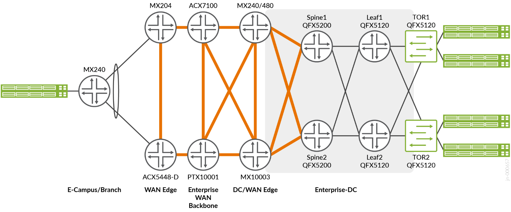

# Enterprise Data Center Edge

> Seamless interconnect of EVPN-MPLS WAN services with EVPN-VXLAN data center fabrics at the data center edge.

Validated configurations for the **Enterprise Data Center Edge** Juniper
Validated Design. This JVD demonstrates how enterprise data center edge
routers stitch EVPN-VXLAN tunnels from the data center fabric into
EVPN-MPLS services across the WAN, so that data centers — and campus and
branch locations — interconnect over a common MPLS backbone without
re-encapsulating traffic through logical tunnel interfaces.

* JVD document: <https://www.juniper.net/documentation/us/en/software/jvd/jvd-ewan-evpn-gw-01-01/index.html>
* Solution overview: <https://www.juniper.net/documentation/us/en/software/jvd/sol-overview-ewan-evpn-gw-01-01.pdf>
* Test report: <https://www.juniper.net/documentation/us/en/software/jvd/testreportbrief-ewan-evpn-gw-01-01.pdf>

The WAN side runs OSPF with LDP label distribution, iBGP for EVPN
signalling with the data center edge routers acting as route reflectors,
EVPN-MPLS with all-active ESI multihoming toward the fabric, and LFA /
remote LFA for resiliency. The data center side is an EVPN-VXLAN overlay on
an eBGP underlay. The data center edge routers (MX480 and MX10003) perform
the EVPN-VXLAN to EVPN-MPLS handoff for VLAN-based, VLAN-bundle and
VLAN-aware services, with
the WAN edge routers (MX204 and ACX5448) terminating the remote campus and
branch attachments.

## Validated scale

Scale validated in the [test report](documentation/test-report-brief.md), per
device role. The configurations in this repository carry this scale.

| Feature | DC edge (MX10003 / MX480) | Leaf (QFX5120) | WAN edge (MX204) | WAN edge (ACX5448) |
|---|---:|---:|---:|---:|
| VLANs | 3,503 | 3,503 | 2,152 | 3,453 |
| MAC addresses | 41,000 | 34,000 | 34,000 | 41,900 |
| ARP entries | 40,900 | 900 | — | — |
| Switching instances | 1,500 | 1,500 | — | — |
| Bridge domains | 2,217 | 2,217 | 1,460 | 757 |
| VNIs | 2,217 | 2,217 | — | — |
| VTEPs | 4,503 | 1,506 | — | — |
| ESIs | 48 | 48 | — | — |
| IRB (CRB model) | 2,153 | — | — | — |
| IRB (ERB model) | 50 | 50 | — | — |
| IGP (OSPF) routes | 50K | 50K | 50K | 50K |
| BFD sessions | 3 @ 100 ms | 4 @ 100 ms | 5 @ 100 ms | 5 @ 100 ms |

## Hardware

| Juniper Product | Role | Hostnames | Software |
|---|---|---|---|
| **MX480** | Data center edge (EVPN-VXLAN to EVPN-MPLS gateway, EVPN route reflector) | `dc-edge1` | Junos OS 21.4R2 |
| **MX10003** | Data center edge (EVPN-VXLAN to EVPN-MPLS gateway, EVPN route reflector) | `dc-edge2` | Junos OS 21.4R2 |
| **MX204** | WAN edge (campus / branch PE) | `wan-edge1` | Junos OS 21.4R2 |
| **ACX5448-M** | WAN edge (campus / branch PE) | `wan-edge2` | Junos OS 21.4R2 |
| **ACX7100-48L** | Provider (P) router | `p1` | Junos OS Evolved 21.4R2 |
| **PTX10001-36MR** | Provider (P) router | `p2` | Junos OS Evolved 21.4R2 |
| **QFX5200** | Data center spine | `spine1`, `spine2` | Junos OS 21.4R2 |
| **QFX5120-48T** | Data center leaf | `leaf1`, `leaf2` | Junos OS 21.4R2 |
| **EX4200-48T** | Data center top-of-rack access | `tor1`, `tor2` | Junos OS 15.1R7 |

These configurations were captured during the initial validation on the
releases shown. The published design documents the subsequent validation on
Junos OS and Junos OS Evolved 23.2R2, with the WAN edge on ACX5448-D, the P
role on PTX10003-80C and the top-of-rack role on QFX5120.

## Configurations

| File | Role |
|---|---|
| [`dc-edge1_mx480.conf`](configuration/conf/dc-edge1_mx480.conf) | Data center edge 1 — EVPN-VXLAN / EVPN-MPLS gateway and route reflector |
| [`dc-edge2_mx10003.conf`](configuration/conf/dc-edge2_mx10003.conf) | Data center edge 2 — EVPN-VXLAN / EVPN-MPLS gateway and route reflector |
| [`wan-edge1_mx204.conf`](configuration/conf/wan-edge1_mx204.conf) | WAN edge 1 — campus / branch PE |
| [`wan-edge2_acx5448-m.conf`](configuration/conf/wan-edge2_acx5448-m.conf) | WAN edge 2 — campus / branch PE |
| [`p1_acx7100-48l.conf`](configuration/conf/p1_acx7100-48l.conf) | Provider router 1 and EVPN route reflector |
| [`p2_ptx10001-36mr.conf`](configuration/conf/p2_ptx10001-36mr.conf) | Provider router 2 |
| [`spine1_qfx5200.conf`](configuration/conf/spine1_qfx5200.conf) | Data center spine 1 |
| [`spine2_qfx5200.conf`](configuration/conf/spine2_qfx5200.conf) | Data center spine 2 |
| [`leaf1_qfx5120-48t.conf`](configuration/conf/leaf1_qfx5120-48t.conf) | Data center leaf 1 — EVPN-VXLAN VTEP |
| [`leaf2_qfx5120-48t.conf`](configuration/conf/leaf2_qfx5120-48t.conf) | Data center leaf 2 — EVPN-VXLAN VTEP |
| [`tor1_ex4200-48t.conf`](configuration/conf/tor1_ex4200-48t.conf) | Top-of-rack access switch 1 |
| [`tor2_ex4200-48t.conf`](configuration/conf/tor2_ex4200-48t.conf) | Top-of-rack access switch 2 |

## Documentation

* [Solution overview](documentation/solution-overview.md)
* [Design guide](documentation/design-guide.md)
* [Test report brief](documentation/test-report-brief.md)
