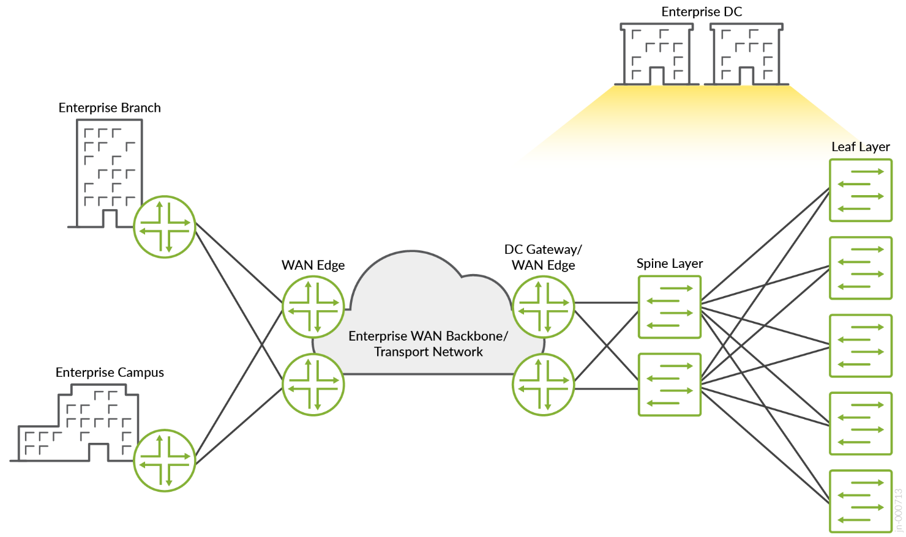
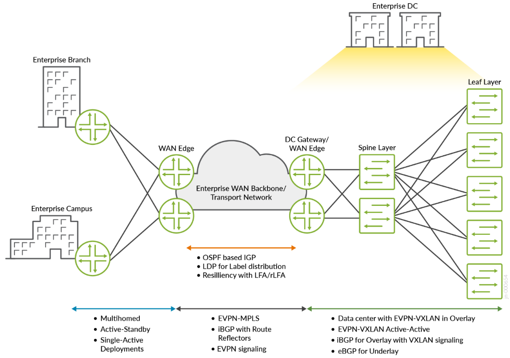
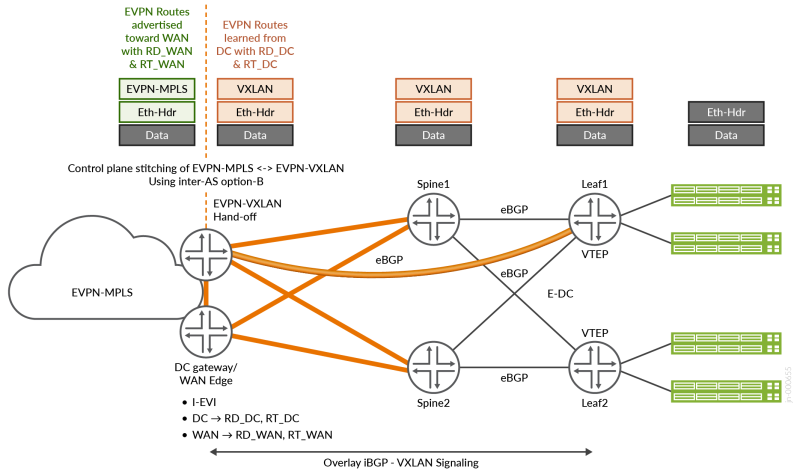

> Complete Markdown conversion of [jvd-ewan-evpn-gw-01-01.pdf](https://www.juniper.net/documentation/us/en/software/jvd/jvd-ewan-evpn-gw-01-01.pdf). No content is summarized. The source PDF is authoritative.

<!-- Source PDF page 1 -->

# Enterprise Data Center Edge—Juniper Validated Design (JVD)

Published 2025-06-05

<!-- Source PDF page 2 -->

**ii**

## Table of Contents

[About this Document | 1](#about-this-document) [Use Case and Reference Architecture | 1](#use-case-and-reference-architecture) [Solution Design and Architecture | 3](#solution-design-and-architecture) [Solution and Validation Key Parameters | 8](#solution-and-validation-key-parameters) [Results Summary and Analysis | 12](#results-summary-and-analysis) [Recommendations | 14](#recommendations)

<!-- Source PDF page 3 -->

**1**

## Enterprise Data Center Edge—Juniper Validated Design (JVD)
Juniper Networks Validated Designs provide customers with a comprehensive, end-to-end blueprint for
deploying Juniper solutions in their network. These designs are created by Juniper's expert engineers

and tested to ensure they meet the customer’s requirements. Using a validated design, customers can
reduce the risk of costly mistakes, save time and money, and ensure that their network is optimized for maximum performance.

## About this Document
This document explains a Juniper Validated Design (JVD) for seamless interconnect between data
centers, or between data centers and campus and branch locations over an MPLS-based WAN. It
validates the seamless interconnect of Ethernet VPN Multiprotocol Label Switching (EVPN-MPLS) with
Ethernet VPN-Virtual Extensible LAN (EVPN-VXLAN). We outline the design and testing methodologies,
summarize the key results, and provide implementation recommendations.

The Juniper Networks devices used in this JVD includes:

| Solution | Data Center Edge | WAN Edge | Provider (P) — Router Role | Enterprise Private —Data Center | TOR Devices |
| --- | --- | --- | --- | --- | --- |
| Enterprise DC Edge | MX10003 Universal Router<br>MX480 Universal Router | MX204 Universal Router<br>ACX5448-D Universal Metro Router | PTX10003-80-C along with ACX7100-48L | QFX5200 Switch (Spine)<br>QFX5120 Switch (Leaf) | QFX5120 Switch |

## Use Case and Reference Architecture
Modern enterprises have business-critical applications running in multiple private and public data

centers. They use WANs to connect their data centers and provide access to users in remote campus

<!-- Source PDF page 4 -->

**2**

and branch locations. Figure 1 on page 2 depicts a typical large-scale enterprise network. The enterprise owns and operates a private data center.

**Figure 1: Typical Enterprise Network**



The enterprise data center uses EVPN-VXLAN as an overlay protocol and a spine and leaf architecture.

This JVD terminates the VXLAN tunnels on the data center edge/gateway devices. Remote campus and
branch locations access the data center resources over the WAN using L2 EVPN-MPLS connections.
EVPN-MPLS has become the dominant technology for enabling connectivity between enterprise campus and branch offices. It replaces the legacy VPLS interconnect model.

The advantages of an EVPN-MPLS-based architecture include:

- Multihoming

- Rapid convergence

- Active/active or active/standby attachment points

- BGP-based MAC learning

The data center edge/gateway devices process all network traffic that enters and exits the data center.

They connect the enterprise data center to the WAN and interconnect the EVPN-VXLAN tunnels in the data center with the EVPN-MPLS tunnels in the WAN. Juniper Networks MX Series routers running
Junos OS Release 21.4R1 or earlier provide interconnection services using logical tunnel interfaces. This

<!-- Source PDF page 5 -->

**3**

solution has some performance limitations because two separate forwarding tables are used, and packets are processed twice by the packet forwarding engine (PFE). Newer Junos OS releases use a
single forwarding table and do not require data plane packet recirculation.

## Solution Design and Architecture
**IN THIS SECTION**

Packet Flow **| 4** Figure 1 on page 2 shows a typical enterprise network with a private data center. Remember that the data center uses a spine and leaf architecture. Leaf devices connect servers to the network. The spine
layer provides connectivity to other leaf devices and the data center edge/gateway devices that connect the data center to the WAN. External BGP (EBGP) is the EVPN-VXLAN signaling protocol within the
data center. In the WAN, EVPN-MPLS services connect remote campus and branch offices to the data
center. Seamless interconnecting of these two services happens on the data center edge/gateway devices.

The building blocks for this JVD architecture (see Figure 2 on page 4) include:

- OSPF routing

- LDP for label distribution

- Internal BGP (iBGP) between PE and Route-Reflector (RR) node for EVPN signalling

 - EVPN-MPLS

- Multihomed Single-Active and Single-Homed

 - Resiliency with Loop-Free Alternates (LFA)/Remote LFA (rLFA)

Enterprise data center technologies include:

 - EVPN-VXLAN overlay

 - EBGP underlay

[The data center reference design is explained in the Data Center EVPN VXLAN Fabric Architecture](https://www.juniper.net/documentation/us/en/software/nce/sg-005-data-center-fabric/index.html) [Guide.](https://www.juniper.net/documentation/us/en/software/nce/sg-005-data-center-fabric/index.html)

<!-- Source PDF page 6 -->

**4**

**Figure 2: Enterprise WAN Data Center-Edge Design**



### Packet Flow
Outbound traffic originating from the private enterprise data center server is encapsulated in unicast

Layer 2 Ethernet frames and forwarded to a leaf device. The leaf device encapsulates the packet inside
of an EVPN-VXLAN header and the packet is forwarded through the data center network until reaching an edge/gateway device. The edge/gateway devices are capable of both EVPN-VXLAN and EVPN-MPLS encapsulation. The edge/gateway device removes the VXLAN header, performs a forwarding lookup, encapsulates the packet in an EVPN-MPLS header, and forwards the packet on the WAN. The packets
traverse the nodes in the enterprise WAN backbone where MPLS push, pop, and swap operations are performed. When an EVPN-MPLS encapsulated packet reaches the remote WAN edge device, the EVPN-MPLS header is stripped, and the original Ethernet frame is forwarded into the remote L2 domain.

See Figure 3 on page 5.

<!-- Source PDF page 7 -->

**5**

**Figure 3: Data Center Gateway EVPN-VXLAN Packet Flow and Handoff**



The control plane on the data center edge/gateway devices maintain a single MAC Forwarding
Information Base (FIB) for both the data center and WAN networks. This FIB enables the device to interconnect the EVPN tunnels in the data center and the WAN.

This Junos OS configuration snippet enables these capabilities on a data center gateway device. For
complete configuration, contact your Juniper Networks representative.

```junos
ERB_InterConnect_VAware_Instance1 {
    instance-type virtual-switch;
    protocols {
        evpn {
            encapsulation vxlan;
            default-gateway no-gateway-community;
            extended-vni-list [ 3500 3501 ];
            interconnect {
                vrf-target target:3500:3500;
                route-distinguisher 1.1.1.6:3500;
                esi {
                    00:35:45:55:65:75:85:95:05:25;
                    all-active;
                }
                interconnected-vlan-list [ 3500 3501 ];
                encapsulation mpls;
            }
            vni-options {
                vni 3500 {
                    vrf-target target:3:3500;
                }
                vni 3501 {
                    vrf-target target:3:3501;
                }
            }
        }
    }
    vtep-source-interface lo0.0;
    bridge-domains {
        BD3500 {
            vlan-id 3500;
            routing-interface irb.3500;
            vxlan {
                vni 3500;
            }
        }
        BD3501 {
            vlan-id 3501;
            routing-interface irb.3501;
            vxlan {
                vni 3501;
            }
        }
    }
    route-distinguisher 10.10.10.6:5036;
    vrf-target target:100:36;
}
```

Inbound data center traffic arrives at an edge/gateway device EVPN-MPLS encapsulated. The edge/

gateway device removes the EVPN-MPLS header and performs a forwarding lookup to determine the
next-hop EVPN-VXLAN tunnel. The traffic is EVPN-VXLAN encapsulated and forwarded to an
application endpoint. Figure 4 on page 7 depicts the end-to-end packet flow in the network.

<!-- Source PDF page 9 -->

**7**

**Figure 4: Packet Flow**


In summary, the packet flow from EVPN-VXLAN to EVPN-MPLS is described by the following process:

1. Leaf nodes encapsulate Ethernet frames into EVPN-VXLAN packets.

2. EVPN-VXLAN encapsulated packets are routed through the data center network to an edge/gateway

device.

3. The EVPN-VXLAN header is removed.

4. Ethernet frames are encapsulated in EVPN-MPLS.

5. WAN MPLS-based forwarding occurs.

6. Remote WAN edge device removes the EVPN-MPLS header.

7. Original Ethernet frame is forwarded to the destination host.

<!-- Source PDF page 10 -->

**8**

## Solution and Validation Key Parameters
**IN THIS SECTION**

Supported Platforms and Positioning **| 8**

Feature List **| 8**

Test Bed Diagram **| 9**

Solution Validation Goals **| 10**

Solution Validation Non-Goals **| 11**

This section outlines solution key parameters and validation objectives for this JVD.

### Supported Platforms and Positioning
To review the software versions and platforms on which this JVD was validated by Juniper Networks,
[see the Validated Platforms and Software section in this document.](https://www.juniper.net/documentation/us/en/software/jvd/jvd-ewan-evpn-gw-01-01/validated-platforms.html)

### Feature List
The supported features include:

 - Single-homed EVPN-MPLS Service with fast reroute (FRR) features enabled in the MPLS domain

 - EBGP for the underlay and IBGP as the overlay protocol for EVPN-VXLAN within the enterprise data

center

 - EVPN Modes:

  - VLAN based

  - VLAN bundle

  - VLAN aware bundle

 - OSPF

<!-- Source PDF page 11 -->

**9**

- LDP

- MPLS based transport network

- LFA (link/node)

- Route Reflection

- IPv4

- IPv6

- LACP

- AE

- ECMP

- VLAN (802.1Q)

**NOTE:** Contact your Juniper Networks representative for test results reports.

### Test Bed Diagram
Figure 5 on page 10 shows the test bed topology that is used to validate this design. The topology

emulates the following network segments:

- Enterprise data center

- Enterprise data center WAN edge device

- Campus/branch WAN edge device

- Enterprise WAN

The validated design topology includes the routers and switches shown in No Link Title.

<!-- Source PDF page 12 -->

**10**

**Figure 5: Enterprise Data Center-Edge JVD Topology**


**NOTE:** Contact your Juniper Networks representative for test results reports.

### Solution Validation Goals
The goal is to validate that the MX480 and MX10003 Universal Routing platforms can interconnect

EVPN-MPLS and EVPN-VXLAN services.

Data center and WAN scaling information are available in Table 1 and Table 2 of the Results Summary
and Analysis section.

**Table 1: Cumulative Traffic Flows Used During Validation**

| Traffic Stream | Packet Size (Bytes) | Rate |
| --- | --- | --- |
| EVPN VLAN based from WAN edge to devices connected to TOR | 512 Bytes | 600 Mbps |
| EVPN VLAN bundle from WAN edge to devices connected to TOR | 512 Bytes | 600 Mbps |
| EVPN VLAN aware from WAN edge to devices connected to TOR | 512 Bytes | 600 Mbps |

Here are the primary test goals for this JVD:

- Validate all three EVPN service models:

<!-- Source PDF page 13 -->

**11**

 - VLAN-based

 - VLAN bundle

 - VLAN aware bundle

- Validate all active multihoming scenarios within the data center.

- Validate single-homed scenarios on the WAN edge devices.

- Validate LDP based transport

- Capture failure and convergence scenarios at scale.

- Capture CPU and memory utilization.

- Identify and document product limitations and anomalies.

- Validate network performance and convergence times under these failure conditions:

 - Link failures on the WAN edge device

 - Link failures on the data center spine and leaf devices

 - Node failures

 - Process restarts–RPD, DCD, CHASSISD, and so on

- Deactivate/activate configuration options

**NOTE:** Contact your Juniper Networks representative for the services and feature scaling
information.

### Solution Validation Non-Goals
Protocols and technologies that are not included in this design include:

- Non-Collapsed Assisted Replication (AR) support. AR is configured on QFX spines. No AR support
exists on MX Series Universal Routing Platforms for collapsed AR mode.

- An active-active WAN edge configuration.

- Underlay protocols in transport/core networks other than those specified in the solution validation

goals.

<!-- Source PDF page 14 -->

**12**

- Overlay service validation other than what is specified in the solution validation goals section.

- EVPN-VXLAN to EVPN-VXLAN stitching or EVPN-VXLAN to VPLS stitching is not validated.

- Management and automation using Juniper Apstra.

## Results Summary and Analysis
**IN THIS SECTION**

MX480/MX10003 Functions and Performance **| 12**

### MX480/MX10003 Functions and Performance
This JVD successfully passes all validation test cases. Both scale and performance parameters are within
the anticipated thresholds. The validated design topology generates a reasonable multi-vector scale of
different features.

The MX480 and MX10003 routers running Junos OS Release 23.2R2 or later satisfy the requirements
for delivering data center edge capabilities. Both platforms are purpose-built to perform data center
edge functions. The MX204 router can also perform the remote WAN edge role.

**Table 2: Scale Summary for WAN Edge Devices**

| Feature | WAN Edge—ACX5448-D | WAN Edge—MX204 |
| --- | --- | --- |
| VLANs | 3453 | 2152 |
| MAC | 41900 | 34000 |
| EVPN-MPLS | 744 | 756 |
| Bridge Domains | 757 | 1460 |
| IGP (OSPF) | 50K | 50K |

<!-- Source PDF page 15 -->

**13**

**Table 2: Scale Summary for WAN Edge Devices (Continued)**

| Feature | WAN Edge—ACX5448-D | WAN Edge—MX204 |
| --- | --- | --- |
| BFD | 5@100 ms | 5@100 ms |

**Table 3: Scale Summary for Data Center Devices**

| Feature | Data Center Edge—MX10003/MX480 | Leaf—QFX5120 |
| --- | --- | --- |
| VLANs | 3503 | 3503 |
| MAC | 41000 | 34000 |
| ARP | 40900 | 900 |
| Switching Instance | 1500 | 1500 |
| Bridge Domains | 2217 | 2217 |
| VNI | 2217 | 2217 |
| VTEP | 4503 | 1506 |
| ESI | 48 | 48 |
| IRB (CRB Model) | 2153 | NA |
| IRB (ERB Model) | 50 | 50 |
| IGP (OSPF) | 50K | 50K |

Traffic convergence is an important consideration in any network design. This JVD validates traffic

convergence using common failure scenarios like link or node failure in the MPLS transport and data
center networks. The network design described in this document provides traffic restoration times less

than 80ms.

**Table 4: Convergence**

| Convergence Scenarios | Time (ms) |
| --- | --- |
| EVPN-MPLS convergence with WAN edge to P1 link failure | ~71 |

<!-- Source PDF page 16 -->

**14**

**Table 4: Convergence (Continued)**

| Convergence Scenarios | Time (ms) |
| --- | --- |
| EVPN-MPLS convergence with P1 node failure | 44 |
| EVPN-MPLS convergence with P1 node to DC1 link failure | 14 |
| EVPN-MPLS convergence with DC1 node failure | 44 |

**NOTE:** Contact your Juniper Networks representative for performance details.

## Recommendations
The MX480 and MX10003 platforms support efficient and deterministic mechanisms that enable EVPN-VXLAN and EVPN-MPLS services to interconnect without performance loss. These platforms are well

suited for network deployments that require edge services.

Junos OS Release 23.2R2 is the minimum recommended software version.

While this JVD focuses on the data center edge infrastructure, these technologies and solutions can be
used as building blocks from which additional designs and solutions can evolve.

Juniper Networks, the Juniper Networks logo, Juniper, and Junos are registered trademarks of Juniper

Networks, Inc. in the United States and other countries. All other trademarks, service marks, registered
marks, or registered service marks are the property of their respective owners. Juniper Networks assumes

no responsibility for any inaccuracies in this document. Juniper Networks reserves the right to change,
modify, transfer, or otherwise revise this publication without notice. Copyright © 2025 Juniper Networks,

Inc. All rights reserved.

## Sources

- Published PDF: [jvd-ewan-evpn-gw-01-01.pdf](https://www.juniper.net/documentation/us/en/software/jvd/jvd-ewan-evpn-gw-01-01.pdf)
- Companion documents: [solution-overview.md](solution-overview.md), [test-report-brief.md](test-report-brief.md)
