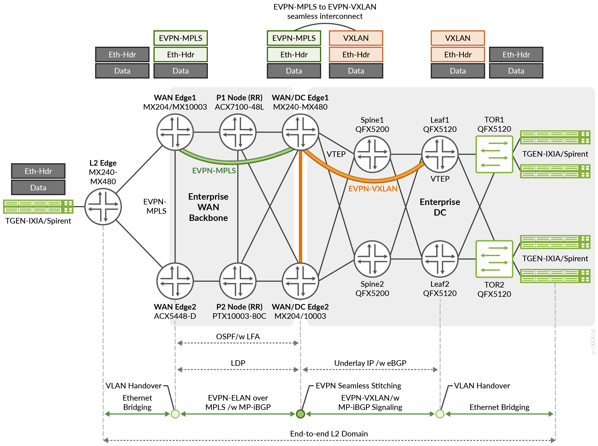

> Complete Markdown conversion of [testreportbrief-ewan-evpn-gw-01-01.pdf](https://www.juniper.net/documentation/us/en/software/jvd/testreportbrief-ewan-evpn-gw-01-01.pdf). No content is summarized. The source PDF is authoritative.

<!-- Source PDF page 1 -->

## Juniper® Validated Design
# JVD Test Report Brief: Enterprise Data Center Edge
## Introduction
Modern enterprises have business-critical applications running in multiple private and public data centers. They use WANs to connect

their data centers and provide access to users in remote campus and branch locations. The enterprise data center uses Ethernet VPN-Virtual Extensible LAN (EVPN-VXLAN) as an overlay protocol and a spine and leaf architecture. Remote campus and branch locations
access the data center resources over the WAN using Layer 2 Ethernet VPN Multiprotocol Label Switching (EVPN-MPLS) connections.
EVPN-MPLS has become the dominant technology for enabling connectivity between enterprise campus and branch offices. It replaces
the legacy virtual private LAN service (VPLS) interconnect model. This validated design focuses on the seamless interconnect of EVPN-VXLAN tunnels running in a data center and MPLS EVPN tunnels running in the WAN. This JVD proposes seamless stitching of two segments without performance impact using an MX router acting as a datacenter gateway. This JVD proposes terminating the VXLAN
tunnels on the data center edge/gateway devices.

The advantages of an EVPN-MPLS-based WAN architecture include:

- Multihoming

- Rapid convergence

- Active/active or active/standby attachment points

- BGP-based MAC learning

<!-- Source PDF page 2 -->

## Test Topology

*Figure 1: EVPN-MPLS to EVPN-VXLAN*

## Platforms Tested
Table 1: Platforms Tested

| Role | Platform | OS |
| --- | --- | --- |
| Data Center Edge | MX480 and MX10003 | Junos OS 23.2R2 |
| WAN Edge | MX204 and ACX5448-D | Junos OS 23.2R2 |
| P Router | PTX10003-80C and ACX7100-48L | Junos OS Evolved 23.2R2 |
| Data Center Spine | QFX5200 | Junos OS 23.2R2 |
| Data Center Leaf | QFX5120 | Junos OS 23.2R2 |
| Data Center Top of Rack | QFX5120 | Junos OS 23.2R2 |

## Version Qualification History
This JVD has been qualified in Junos OS Release 23.2R2.

<!-- Source PDF page 3 -->

## Scale and Performance Data
This document might contain key performance indexes (KPIs) used in solution validation. Validated KPIs are multi-dimensional and

reflect our observations in customer networks or reasonably represent solution capabilities. These numbers do not indicate the maximum scale and performance of individual tested devices. For uni-dimensional data on individual SKUs, contact your Juniper Networks representatives.

The Juniper JVD team continuously strives to enhance solution capabilities. Consequently, solution KPIs might change without prior notice. Always refer to the latest JVD test report for up-to-date solution KPIs. For the latest comprehensive test report, contact your Juniper Networks representative.

**Scale Summary on WAN Edge**

| Feature | ACX5448-D | MX204 |
| --- | --- | --- |
| VLANS | 3453 | 2152 |
| MAC 41900 34000 | 41900 | 34000 |
| Bridge Domains | 757 | 1460 |
| IGP(OSPF) | 50K | 50K |
| BFD | 5@100 ms | 5@100 ms |
| VLANS | 3453 | 2152 |

**Scale Summary on DC Edge**

| Feature | DC Edge MX10003/MX480 | Leaf QFX5120 |
| --- | --- | --- |
| VLANS | 3503 | 3503 |
| MAC | 41000 | 34000 |
| ARP | 40900 | 900 |
| Switching Instance | 1500 | 1500 |
| Bridge Domains | 2217 | 2217 |
| VNI | 2217 | 2217 |
| VTEP | 4503 | 1506 |
| ESI | 48 | 48 |
| IRB (CRB Model) | 2153 | NA |
| IRB (ERB Model) | 50 | 50 |
| IGP(OSPF) | 50K | 50K |
| BFD | 3@100 ms | 4@100 ms |

<!-- Source PDF page 4 -->

## Traffic Profiles
**Scale Summary on WAN Edge**

| Bidirectional Traffic Stream details | Packet Size | Port Rate |
| --- | --- | --- |
| EVPN_VLAN_Based_WANEdge1_to_Leaf1 / Leaf2 | 512 | 200 Mbps |
| EVPN_VLAN_Based_Leaf1 / Leaf2_to_WANEdge1 | 512 | 200 Mbps |
| EVPN VLAN_Bundle_WANEdge1_to_Leaf1 / Leaf2 | 512 | 200 Mbps |
| EVPN_VLAN_Bundle Leaf1 / Leaf2_to_WANEdge1 | 512 | 200 Mbps |
| EVPN_VLAN_Aware_WANEdge1_to_Leaf1 / Leaf2 | 512 | 200 Mbps |
| EVPN_VLAN_Aware_Leaf1 / Leaf2_to_WANEdge1 | 512 | 200 Mbps |
| EVPN_VLAN_Based_WANEdge2_to_Leaf1 / Leaf2 | 512 | 200 Mbps |
| EVPN_VLAN_Based_Leaf1 / Leaf2_to_WANEdge2 | 512 | 200 Mbps |
| EVPN_VLAN_Bundle_WANEdge2_to_Leaf1 / Leaf2 | 512 | 200 Mbps |
| EVPN_VLAN_Bundle_Leaf1 / Leaf2_to_WANEdge2 | 512 | 200 Mbps |

| Convergence Scenarios | Convergence Time |
| --- | --- |
| EVPN-MPLS traffic convergence with WANEdge1 to P1-Node Link failure | ~71 |
| EVPN-MPLS traffic convergence with WANEdge1-Node to P1-Node Link failure | ~71 |
| EVPN-MPLS traffic convergence with MPLS CORE P1 node failure | 44 |
| EVPN-MPLS traffic convergence with P1-Node to DC1 Link failure | 14 |
| EVPN-MPLS traffic convergence with P1-Node to DC1 Link failure | 44 |
| EVPN-MPLS traffic convergence with WANEdge1 to P1-Node Link failure | ~71 |

## High Level Features Tested
- Enterprise Data Center running eBGP underlay and iBGP overlay protocol.

- EVPN-VXLAN Layer 2 connectivity to deliver application traffic to end users.

- Enterprise WAN backbone running OSPF as IGP with LFA for link and node protection.

- LDP for label distribution and iBGP for EVPN signalling.

- Seamless interconnect of EVPN-VXLAN to EVPN-MPLS without logical tunnel interfaces.

- Active multihoming within the data center.

- Single-homed WAN Edge.

- BFD for rapid failure detection and convergence.

- Three EVPN-MPLS/EVPN-VXLAN service models:

  - VLAN-based

  - VLAN bundle

  - VLAN-aware bundle

<!-- Source PDF page 5 -->

## Event Testing
- Restart of critical Junos OS processes.

- Device reboot.

- Interface up/down.

- Deletion or configuration of various configuration stanzas.

- Clearing protocol sessions.

Send feedback to: design-center-comments@juniper.net V1.0/240322/testreportbrief-ewan-evpn-gw-01-01

## Sources

- Published PDF: [testreportbrief-ewan-evpn-gw-01-01.pdf](https://www.juniper.net/documentation/us/en/software/jvd/testreportbrief-ewan-evpn-gw-01-01.pdf)
- Companion documents: [solution-overview.md](solution-overview.md), [design-guide.md](design-guide.md)
