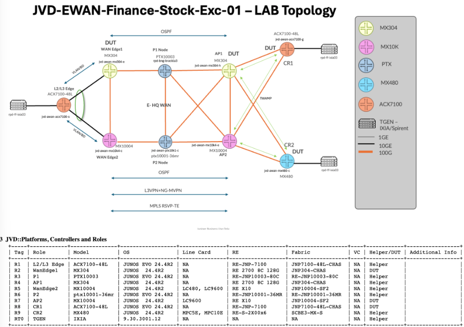

# Configuration Snippets (snips)

This `snips/` directory contains **focused, templated configuration excerpts**
extracted from the validated device configurations in [`../conf/`](../conf/).
Each file isolates one construct — an NG-MVPN VRF, an EVPN virtual switch, a
customer-router virtual router, an interface form, an OSPF, RSVP, MPLS or BGP
form, a class-of-service object — so it can be read, compared and adapted without
reading a full device configuration. Every body is measured against the source:
the `Count:` header is the number of exact source instances the template
reproduces on each device.

## Topology



Device tokens in snippet headers are the file names in `../conf/`:
`wanedge1_mx304`, `wanedge2_mx10004` (WAN edges: multicast source side,
anycast RP, EVPN single-active ESI), `ap1_mx304`, `ap2_mx10004` (access points,
far-end PEs), `p1_ptx10003-80c`, `p2_ptx10001-36mr` (provider core),
`cr1_acx7100-48l`, `cr2_mx480` (customer routers) and `l2-l3_edge_acx7100`
(Layer 2/3 edge toward the stock-exchange server).

## Layout

```
snips/
  junos/        ← Junos OS forms (MX304, MX10004, MX480)
  evo/          ← Junos Evolved forms (PTX10003, PTX10001-36MR, ACX7100)
```

| Sub-folder | What's in it |
|---|---|
| `routing-instances/l3vpn/` | NG-MVPN VRFs (WAN-edge sender site, access-point receiver) and the L3VPN order-entry VRFs. |
| `routing-instances/evpn-elan/` | The EVPN-MPLS virtual switch with its single-active ESI attachment and IRB. |
| `routing-instances/virtual-router/` | Customer-router virtual routers (eBGP to both access points, PIM sparse mode, OSPF). |
| `interfaces/` | Core links, PE-CE VLAN units, the ESI-LAG and its members, IRB units, loopbacks and port forms. |
| `protocols/` | OSPF area 0 and its TE / post-convergence-LFA options, RSVP, MPLS with RSVP-TE and P2MP LSP templates, the iBGP full mesh, LLDP, LACP. |
| `class-of-service/` | The four-class model: EXP classifier and rewrite, forwarding classes, scheduler map, schedulers and their interface applications. |
| `policy-options/policy-statement/` | Protocol redistribution and MED-steering policies. |
| `firewall/` | Interface-specific filters that classify market-data and order traffic. |
| `services/` | TWAMP server (access points) and client (customer routers) test plans. |
| `chassis/`, `routing-options/`, `forwarding-options/`, `vlans/` | FPC port and tunnel-services profiles, router identity, multicast rate limits, Layer 2 edge VLANs. |

## Snippet headers

Every snippet starts with a C-style header whose fields follow the repository
snippet contract:

- **`Seen on:`** — every validated device whose configuration reproduces this
  exact template, split by OS. Shared applicability is not a peer relationship.
- **`Count:`** — distinct source instances of the template per device and in
  total, generated from [`_bindings.json`](_bindings.json); never hand-edited.
- **`Pair with:`** — directed, required same-device dependencies: the snippet
  that defines a named object this one uses (a policy, filter, classifier,
  scheduler map, interface unit or the EVPN virtual switch that owns an IRB), and
  the iBGP mesh a VPN instance runs over. A reference that several forms can
  satisfy is not listed; the dependency projection in
  [`_composition.json`](_composition.json) records it with every eligible form.
- **`Peers with:`** — verified configured cross-device relationships (iBGP
  sessions of the full mesh, the shared single-active Ethernet segment of the two
  WAN edges). Snippets without the field have no verified relationship;
  [`_peers.json`](_peers.json) records why.

## Templated values — `$VAR` placeholders

Deployment-specific values (loopbacks, RD/RT tails, instance names, attachment
units, PE-CE addresses, RP addresses and group ranges, ESIs, LSP names) appear as
`$VAR` placeholders. Names that other configuration refers to by a fixed literal
and JVD-wide constants are left literal. Each header lists the placeholders it
uses with example values from a validated device; the full glossary is
[`_variables.md`](_variables.md).

## Source examples

[`_bindings.md`](_bindings.md) summarises, and [`_bindings.json`](_bindings.json)
records in full, the exact source instances and variable bindings each template
reproduces. Example values in headers are illustrative; the bindings are the
evidence.

## Scope

Every active source statement on the nine design devices is reproduced by a
snippet, except diagnostic `traceoptions`: the MVPN `traceoptions` blocks of the
ten sender VRFs on each WAN edge are excluded by policy and recorded per instance
in `_source-exclusions.json`. The design has no deactivated configuration.
Source details reproduced exactly as validated:

- cr2 defines `PS-send-ospf` twice, once matching BGP routes and once matching
  OSPF routes; both stanzas are represented.
- On ap2 the OSPF area names `et-0/3/3.0` (the link to p2) while MPLS and RSVP
  name `et-3/3/0.0`, a unit with ISO and MPLS but no address.
- One ap1 NG-MVPN VRF lists its loopback second in OSPF and PIM; it has its own
  form.
- On wanedge1 the VRF loopback unit 10 carries only the anycast RP address.
- EVPN virtual switches 21–23 name their bridge domain `BD_EVPN_GROUP1`.
- The TWAMP forms are the complete deployed test plans of each device.

## Topic index

Totals are source instances across all devices; OS mirrors are listed once per
OS.

| Topic | What it shows |
|---|---|
| `evo/chassis/aggregated-devices-ethernet.conf` | Aggregated-Ethernet device count (4) |
| `evo/chassis/dump-on-panic.conf` | Core dump on kernel panic (4) |
| `evo/chassis/fpc-ptx10003-5x100g-1x40g.conf` | PTX10003 FPC with five 100G ports and one 40G port (1) |
| `evo/chassis/fpc-ptx10003-6x100g-1x40g-3x4x10g.conf` | PTX10003 FPC with six 100G ports, one 40G port and three 4x10G ports (1) |
| `evo/chassis/network-services-enhanced-ip.conf` | Enhanced-IP network services mode (1) |
| `evo/class-of-service/classifiers/cl-exp-4class.conf` | EXP classifier for the four-class model (2) |
| `evo/class-of-service/forwarding-classes/fc-4queue-model.conf` | CoS forwarding classes (four-queue model) (2) |
| `evo/class-of-service/interfaces/ifd-scheduler-map.conf` | Interface scheduler-map application (8) |
| `evo/class-of-service/interfaces/ifl-exp-classifier-rewrite.conf` | Per-unit EXP classifier and rewrite application (8) |
| `evo/class-of-service/rewrite-rules/rr-exp-4class.conf` | EXP rewrite rule for the four-class model (2) |
| `evo/class-of-service/scheduler-maps/sm-4class-mapping.conf` | Scheduler map for the four-class model (2) |
| `evo/class-of-service/schedulers/sc-4class-priority.conf` | Priority-only schedulers for the four-class model (2) |
| `evo/interfaces/ifd-ae-description-flexible-mtu-lacp.conf` | Described LACP aggregate with flexible VLAN tagging, MTU 1522 and flexible Ethernet services (1) |
| `evo/interfaces/ifd-breakout-10g.conf` | Port channelised into 10G sub-ports (2) |
| `evo/interfaces/ifd-description-100g.conf` | Described 100G interface device (4) |
| `evo/interfaces/ifd-description-flexible-speed-100g.conf` | Described 100G port with flexible VLAN tagging and flexible Ethernet services (2) |
| `evo/interfaces/ifd-description-flexible-speed-10g-mtu.conf` | Described 10G port with flexible VLAN tagging, MTU 1522 and flexible Ethernet services (1) |
| `evo/interfaces/ifd-description.conf` | Physical interface description (4) |
| `evo/interfaces/ifd-flexible-ethernet-services-description.conf` | Physical port with a description, flexible VLAN tagging and flexible Ethernet services (1) |
| `evo/interfaces/ifd-lag-member-ether-description-speed-10g.conf` | Described 10G member link of an aggregated-Ethernet bundle (1) |
| `evo/interfaces/ifd-lag-member-ether-description.conf` | Described member link of an aggregated-Ethernet bundle (1) |
| `evo/interfaces/ifd-speed-100g.conf` | Interface device at 100G (16) |
| `evo/interfaces/ifd-speed-10g.conf` | Interface device at 10G (1) |
| `evo/interfaces/ifd-speed-40g.conf` | Interface device at 40G (1) |
| `evo/interfaces/ifl-core-inet-iso-mpls.conf` | Core logical interface with IPv4, ISO and MPLS (8) |
| `evo/interfaces/ifl-description-vlan-inet.conf` | Described tagged routed unit with an IPv4 address (1) |
| `evo/interfaces/ifl-loopback-localhost-127-64-mgmt-iso-inet6.conf` | Loopback with two localhost and management IPv4 addresses, ISO and IPv6 (1) |
| `evo/interfaces/ifl-loopback-primary-localhost-127-64-mgmt-iso-inet6.conf` | Loopback with primary, two localhost and management IPv4 addresses, ISO and IPv6 (3) |
| `evo/interfaces/ifl-vlan-bridge.conf` | Single-VLAN Layer 2 unit with vlan-bridge encapsulation (26) |
| `evo/interfaces/ifl-vlan-inet.conf` | Tagged routed unit with an IPv4 address (VLAN sub-interface) (40) |
| `evo/policy-options/policy-statement/ps-accept-bgp.conf` | Policy accepting BGP routes (3) |
| `evo/policy-options/policy-statement/ps-accept-direct.conf` | Policy accepting directly connected routes (3) |
| `evo/policy-options/policy-statement/ps-accept-ospf.conf` | Policy accepting OSPF routes (3) |
| `evo/policy-options/policy-statement/ps-default-longer-metric-30.conf` | Policy setting metric 30 on every IPv4 route (1) |
| `evo/policy-options/policy-statement/ps-route-filter-exact-metric-10.conf` | Policy setting metric 10 on one exact prefix (1) |
| `evo/protocols/bgp-ibgp-full-mesh-5.conf` | iBGP group with five loopback neighbors for IPv4, L3VPN, EVPN and NG-MVPN (2) |
| `evo/protocols/lldp-interface-all.conf` | LLDP on all interfaces (4) |
| `evo/protocols/mpls-interface-4-core-loopback.conf` | MPLS on four core interfaces and the loopback (2) |
| `evo/protocols/ospf-area0-bfd-4-core.conf` | OSPF area 0 with four BFD core interfaces and a passive loopback (1) |
| `evo/protocols/ospf-area0-node-link-protection-bfd-4-core.conf` | OSPF area 0 with four node-link-protected BFD core interfaces and a passive loopback (1) |
| `evo/protocols/ospf-traffic-engineering.conf` | OSPF traffic-engineering extensions (2) |
| `evo/protocols/rsvp-interface-loopback-4-core.conf` | RSVP on the loopback and four core interfaces (2) |
| `evo/routing-instances/virtual-router/ri-virtual-router-ebgp-ibgp-pim-static-rp.conf` | Virtual router with eBGP to two access points, an iBGP host session and PIM sparse mode with a static RP (10) |
| `evo/routing-instances/virtual-router/ri-virtual-router-ebgp-ibgp.conf` | Virtual router with eBGP to two access points and an iBGP host session (3) |
| `evo/routing-instances/virtual-router/ri-virtual-router-ospf-2-intf.conf` | Virtual router running OSPF area 0 on two interfaces (1) |
| `evo/routing-options/autonomous-system.conf` | Autonomous system number (3) |
| `evo/routing-options/router-id.conf` | Router ID (4) |
| `evo/services/monitoring-twamp-client-cr1.conf` | TWAMP client with 26 control connections across the virtual routers (1) |
| `evo/vlans/vlan-two-interfaces.conf` | VLAN with two member interfaces (13) |
| `junos/chassis/aggregated-devices-ethernet.conf` | Aggregated-Ethernet device count (5) |
| `junos/chassis/dump-on-panic.conf` | Core dump on kernel panic (5) |
| `junos/chassis/fpc-mx10004-3x100g.conf` | MX10004 FPC with three 100G ports on PICs 0 and 3 (1) |
| `junos/chassis/fpc-mx10004-tunnel-100g-13x100g-5x4x10g.conf` | MX10004 FPC with 100G tunnel services, thirteen 100G ports and five 4x10G ports across six PICs (1) |
| `junos/chassis/fpc-mx304-tunnel-10g-11x100g-1x4x10g.conf` | MX304 FPC with 10G tunnel services, eleven 100G ports and one 4x10G port (1) |
| `junos/chassis/fpc-mx304-tunnel-10g-6x100g-3x4x10g.conf` | MX304 FPC with 10G tunnel services, six 100G ports and three 4x10G ports (1) |
| `junos/chassis/fpc-tunnel-services-10g.conf` | 10G tunnel services on a PIC (4) |
| `junos/chassis/network-services-enhanced-ip.conf` | Enhanced-IP network services mode (4) |
| `junos/class-of-service/classifiers/cl-exp-4class.conf` | EXP classifier for the four-class model (3) |
| `junos/class-of-service/forwarding-classes/fc-4queue-model.conf` | CoS forwarding classes (four-queue model) (3) |
| `junos/class-of-service/interfaces/ifd-description-scheduler-map.conf` | Interface scheduler-map application with a description (1) |
| `junos/class-of-service/interfaces/ifd-scheduler-map.conf` | Interface scheduler-map application (10) |
| `junos/class-of-service/interfaces/ifl-exp-classifier-rewrite.conf` | Per-unit EXP classifier and rewrite application (7) |
| `junos/class-of-service/rewrite-rules/rr-exp-4class.conf` | EXP rewrite rule for the four-class model (3) |
| `junos/class-of-service/scheduler-maps/sm-4class-mapping.conf` | Scheduler map for the four-class model (3) |
| `junos/class-of-service/schedulers/sc-4class-rates.conf` | Schedulers with transmit and shaping rates for the four-class model (3) |
| `junos/firewall/filter-mfc-filter-low-latency-class-count.conf` | Interface-specific filter classifying a multicast group range into FC-LLQ with a counter (1) |
| `junos/firewall/filter-mfc-filter-low-latency-class.conf` | Interface-specific filter classifying a multicast group range into FC-LLQ (1) |
| `junos/firewall/filter-mfc-filter1-fc-high.conf` | Interface-specific filter classifying two destination hosts into FC-HIGH (2) |
| `junos/firewall/filter-mfc-filter2-best-effort.conf` | Interface-specific filter classifying two destination hosts into BEST-EFFORT (2) |
| `junos/firewall/filter-mfc-filter3-control.conf` | Interface-specific filter classifying two destination hosts into CONTROL (2) |
| `junos/forwarding-options/multicast-resolve-rate-mismatch-rate.conf` | Multicast resolve and RPF-mismatch rate limits (2) |
| `junos/forwarding-options/multicast-resolve-rate.conf` | Multicast resolve rate limit (2) |
| `junos/interfaces/ifd-ae-description-flexible-mtu-esi-single-active-lacp.conf` | Described single-active ESI-LAG with flexible VLAN tagging, MTU 1522, per-ESI DF election and LACP (1) |
| `junos/interfaces/ifd-ae-flexible-mtu-esi-single-active-lacp.conf` | Single-active ESI-LAG with flexible VLAN tagging, MTU 1522, per-ESI DF election and LACP (1) |
| `junos/interfaces/ifd-description.conf` | Physical interface description (9) |
| `junos/interfaces/ifd-flexible-ethernet-services-description.conf` | Physical port with a description, flexible VLAN tagging and flexible Ethernet services (7) |
| `junos/interfaces/ifd-lag-member-gigether-description.conf` | Described member link of an aggregated-Ethernet bundle (gigether-options) (2) |
| `junos/interfaces/ifl-core-description-inet-iso-mpls.conf` | Described core logical interface with IPv4, ISO and MPLS (1) |
| `junos/interfaces/ifl-core-inet-iso-mpls.conf` | Core logical interface with IPv4, ISO and MPLS (9) |
| `junos/interfaces/ifl-core-iso-mpls.conf` | Logical interface with ISO and MPLS families (1) |
| `junos/interfaces/ifl-irb-filter-mac.conf` | IRB unit with an IPv4 address, an input filter and a static MAC (26) |
| `junos/interfaces/ifl-loopback-anycast-inet.conf` | VRF loopback unit with an anycast IPv4 address and a node address (19) |
| `junos/interfaces/ifl-loopback-inet.conf` | VRF loopback unit with one IPv4 address (21) |
| `junos/interfaces/ifl-loopback-primary-localhost-mgmt-iso-inet6.conf` | Loopback with primary, localhost and management IPv4 addresses, ISO and IPv6 (4) |
| `junos/interfaces/ifl-loopback-primary-preferred.conf` | Loopback with one primary, preferred IPv4 address (1) |
| `junos/interfaces/ifl-vlan-bridge-esi-single-active.conf` | Single-VLAN vlan-bridge unit with a single-active per-unit ESI and DF preference (26) |
| `junos/interfaces/ifl-vlan-inet.conf` | Tagged routed unit with an IPv4 address (VLAN sub-interface) (92) |
| `junos/policy-options/policy-statement/ps-accept-bgp.conf` | Policy accepting BGP routes (5) |
| `junos/policy-options/policy-statement/ps-accept-direct.conf` | Policy accepting directly connected routes (5) |
| `junos/policy-options/policy-statement/ps-accept-ospf.conf` | Policy accepting OSPF routes (5) |
| `junos/policy-options/policy-statement/ps-default-longer-metric-30.conf` | Policy setting metric 30 on every IPv4 route (1) |
| `junos/policy-options/policy-statement/ps-route-filter-exact-metric-10.conf` | Policy setting metric 10 on one exact prefix (1) |
| `junos/protocols/bgp-ibgp-full-mesh-5.conf` | iBGP group with five loopback neighbors for IPv4, L3VPN, EVPN and NG-MVPN (4) |
| `junos/protocols/lacp-ppm-inline.conf` | LACP periodic packet management in line (1) |
| `junos/protocols/lldp-interface-all.conf` | LLDP on all interfaces (5) |
| `junos/protocols/mpls-3-lsp-loopback-3-core.conf` | MPLS with three RSVP-TE LSPs on the loopback and three core interfaces (1) |
| `junos/protocols/mpls-explicit-null-p2mp-template-3-lsp-3-core.conf` | MPLS with explicit null, a P2MP LSP template, three RSVP-TE LSPs and three core interfaces (1) |
| `junos/protocols/mpls-p2mp-template-3-lsp-2-core.conf` | MPLS with a P2MP LSP template, three RSVP-TE LSPs and two core interfaces (2) |
| `junos/protocols/ospf-area0-bfd-post-convergence-lfa-2-core.conf` | OSPF area 0 with a passive loopback and two BFD core interfaces with node-protecting post-convergence LFA (2) |
| `junos/protocols/ospf-area0-node-link-protection-bfd-3-core-default-intf.conf` | OSPF area 0 with three node-link-protected BFD core interfaces, a passive loopback and one default interface (1) |
| `junos/protocols/ospf-area0-node-link-protection-bfd-3-core.conf` | OSPF area 0 with three node-link-protected BFD core interfaces and a passive loopback (1) |
| `junos/protocols/ospf-te-spring-post-convergence-lfa.conf` | OSPF traffic engineering with source packet routing and post-convergence LFA (2) |
| `junos/protocols/ospf-traffic-engineering.conf` | OSPF traffic-engineering extensions (2) |
| `junos/protocols/rsvp-interface-loopback-2-core.conf` | RSVP on the loopback and two core interfaces (2) |
| `junos/protocols/rsvp-interface-loopback-3-core.conf` | RSVP on the loopback and three core interfaces (2) |
| `junos/routing-instances/evpn-elan/ri-evpn-virtual-switch-irb.conf` | EVPN-MPLS virtual switch with one bridge domain, an attachment unit and an IRB (26) |
| `junos/routing-instances/l3vpn/ri-l3vpn-ebgp-2-ce.conf` | L3VPN VRF with eBGP sessions to two customer routers (6) |
| `junos/routing-instances/l3vpn/ri-l3vpn-ebgp-irb.conf` | L3VPN VRF with one eBGP CE session on an IRB interface (6) |
| `junos/routing-instances/l3vpn/ri-mvpn-spt-only-receiver-2-ce-loopback-second.conf` | NG-MVPN VRF in SPT-only mode with eBGP, OSPF and PIM toward two customer routers (loopback listed second) (1) |
| `junos/routing-instances/l3vpn/ri-mvpn-spt-only-receiver-2-ce.conf` | NG-MVPN VRF in SPT-only mode with eBGP, OSPF and PIM toward two customer routers (19) |
| `junos/routing-instances/l3vpn/ri-mvpn-spt-only-sender-hot-root-standby.conf` | NG-MVPN sender-site VRF in SPT-only mode with hot-root standby and a local RP (20) |
| `junos/routing-instances/virtual-router/ri-virtual-router-ebgp-ibgp-pim-static-rp-pim-last-intf-first.conf` | Virtual router with eBGP to two access points, an iBGP host session and PIM sparse mode with a static RP (instance interface list led by the last PIM interface) (10) |
| `junos/routing-instances/virtual-router/ri-virtual-router-ebgp-ibgp.conf` | Virtual router with eBGP to two access points and an iBGP host session (3) |
| `junos/routing-options/autonomous-system.conf` | Autonomous system number (5) |
| `junos/routing-options/router-id.conf` | Router ID (5) |
| `junos/services/rpm-twamp-client-cr2.conf` | TWAMP client with 26 managed control connections across the virtual routers (1) |
| `junos/services/rpm-twamp-server-ap1.conf` | TWAMP server for 13 routing instances with client lists in 10.101.48.0/24 and 10.101.49.0/24 (1) |
| `junos/services/rpm-twamp-server-ap2.conf` | TWAMP server for 13 routing instances with client lists in 10.101.78.0/24 and 10.101.79.0/24 (1) |

## Pairing with documentation

Read these snippets alongside the published
[Enterprise WAN for Finance & Stock Exchange JVD](https://www.juniper.net/documentation/us/en/software/jvd/jvd-ewan-finance-01-01/)
and the [documentation corpus](../../documentation/) in this repository.
