> Faithful markdown conversion of the published PDF:
> **JVD Design Guide: Enterprise WAN for Finance and Stock Exchange**
> (`JVD-EWAN-FINANCE-01-01`). The PDF on juniper.net is the source of truth.
> Exhaustive per-device configurations are linked to
> [`../configuration/conf/`](../configuration/conf/) rather than reproduced here.

# JVD Design Guide: Enterprise WAN for Finance & Stock Exchange

## Overview

Multicast traffic is fundamental to stock exchange networks — used for the
efficient, simultaneous distribution of real-time market data (quotes,
trades, order-book updates) to many trading participants. This ensures
fairness, since all clients receive the same data at nearly the same time.
Because multicast typically uses UDP (no retransmission), packet loss must be
minimized through a reliable, lossless network design. In the stock exchange,
two identical multicast feeds — primary and secondary, over separate
multicast groups and often diverse network paths — are sent to brokerage
clients, whose feed handlers check packet sequence numbers to recover any
loss from the alternate feed.

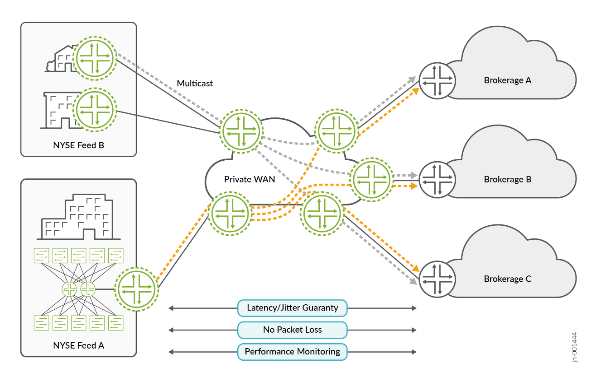
*Figure 1. Overview of the finance and stock exchange network.*

**Next-Generation Multicast VPN (NG-MVPN)** uses MPLS as its transport data
plane, delivering a scalable, resilient, bandwidth-efficient approach for
multicast distribution over MPLS backbones — replicating streams closer to
the subscriber edge, reducing core load while ensuring predictable delivery.

A securities transaction combines unicast and multicast:

> **Transaction:** unicast (sell) → multicast (advertise) → unicast (buy) → updated multicast (sold)

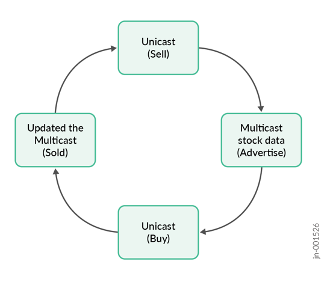
*Figure 2. Securities transaction — unicast order flow, multicast advertisement.*

In this JVD the ACX7100-48L Cloud Metro Router acts as a CPE device, and the
MX480, MX304, MX10004, and MX10008 function as PE devices, introducing 100G
access-segment support.

## Solution Benefits

Stock exchange networks are among the most latency-sensitive environments.
Key requirements:

- **Low latency** — lowest possible latency between trading endpoints.
- **Deterministic packet delivery** — consistent forwarding paths; ECMP/load-balancing variability minimized to avoid reordering and unpredictable delay.
- **Zero packet loss** — lossless Ethernet (e.g. PFC, ECN).
- **No packet reordering** — critical for multicast market data and transactional traffic.
- **High availability & redundancy** — redundant paths/devices; sub-second, ideally hitless failover.
- **Security & segmentation** — strict isolation between tenants, trading firms, and services.
- **Scalability & performance monitoring** — real-time telemetry for jitter, delay, and drops.
- **Platform uniformity** — consistent hardware/software to minimize hashing/queuing behavioral differences.

The reference architecture (from APAC and EMEA stock-exchange engagements) is
categorized into three layers:

- **WAN Edges** [Rendezvous Point] — First Hop Router from the multicast source
- **Access Points** [Far-End PEs]
- **Access layer** [Customer Routers]

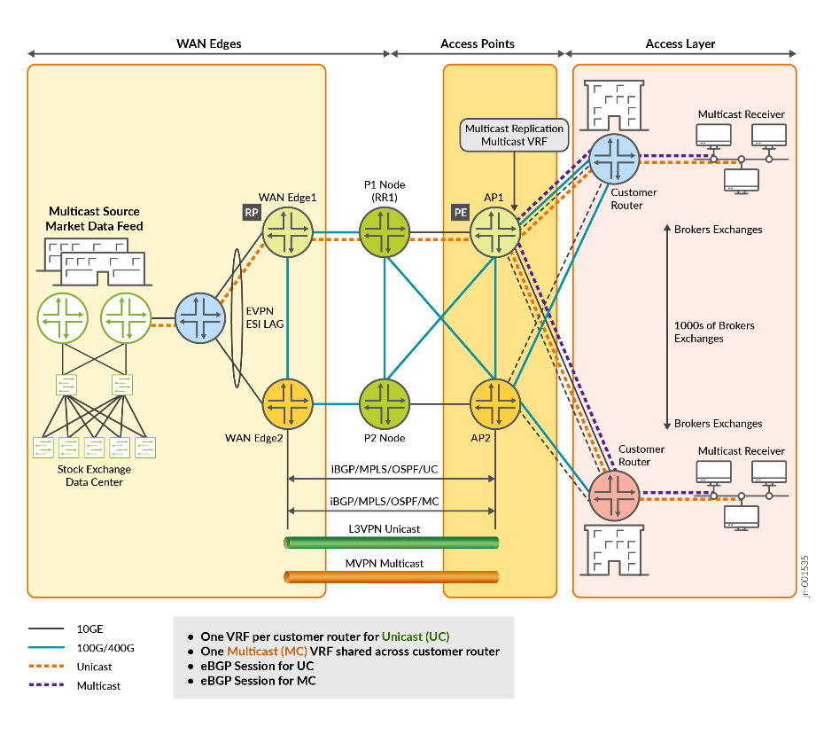
*Figure 3. Three layers of the finance and stock exchange architecture.*

## Solution Architecture

The architecture supports latency-sensitive, deterministic, ultra-fast trade
execution. **EVPN with L3VPN-NGMVPN** handles multicast at scale. The stock
exchange server connects to the WAN edges through an L2 switch that bridges
into the SP core (PEs in the Access Point role), which connects to the
Customer Routers (CRs). The CRs act as default gateways for the end-user PCs
running the finance/stock-exchange application.

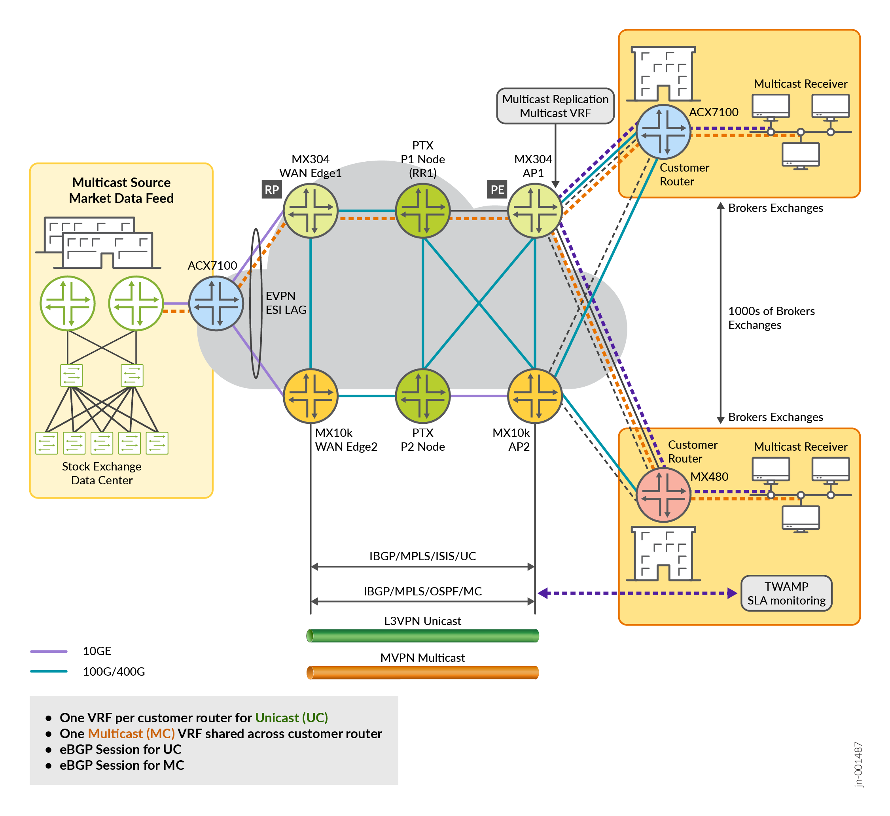
*Figure 4. Architecture of the stock exchange and finance WAN network.*

### NG-MVPN with MPLS and RSVP-TE

Next-Generation MVPN, leveraging MPLS as a data plane, transports multicast
market data efficiently over MPLS backbones:

- NG-MVPN distributes multicast traffic.
- MPLS provides a label-switched network with dedicated, predictable paths.
- **RSVP-TE** reserves network resources in advance — ensuring consistent
  performance and precise control over bandwidth and path.

### Rendezvous Point (RP) Redundancy

Rather than binding the RP to a physical ESI-LAG interface, it is placed on a
**loopback address** advertised by both PE devices in the dual-homed pair, so
the RP stays reachable regardless of which PE is active. Juniper leverages an
**Anycast RP** model — both PEs configured with the same RP address — and, in
some EVPN deployments, relies on the EVPN control plane to propagate state.

*Figure 5. Rendezvous Point (RP) in the WAN topology.*

**Anycast RP** with PIM-SM configures multiple routers with the same loopback
RP address; RPs exchange source information so receivers can join streams
regardless of which physical RP they reach — removing the single point of
failure, balancing load, and providing seamless failover, fully
standards-based.

### EVPN with Single-Active Multihoming

EVPN acts as an intelligent traffic-management system that can instantly
reroute traffic. The **Single-Active** ESI model ensures immediate failover:
one path actively forwards while a standby path is ready to take over
instantaneously. Single-Active is more predictive for packet forwarding and
mitigates reordering — active/active is avoided because reordering and
inconsistent latency are unacceptable here.

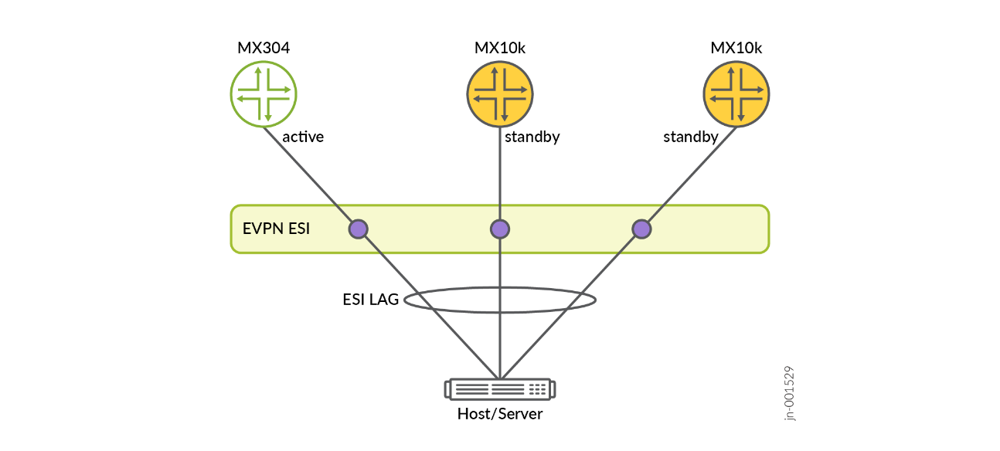
*Figure 6. EVPN ESI-LAG in a multihoming environment.*

EVPN benefits in this solution: efficient MAC management (prevents flapping,
consistent learning, MAC mobility), improved convergence (millisecond
failover, predictable recovery), and protocol flexibility (MPLS/IP transport,
vendor-neutral, gradual evolution).

### Layer 3 VPN

L3VPN provides connectivity from a brokerage customer to the stock-exchange
server to place buy/sell orders. Buy/sell happens with unicast; updates and
current prices are sent as multicast. EVPN instances carry all L2 traffic;
with IRB, L3 traffic is steered to L3VPNs for unicast and multicast.

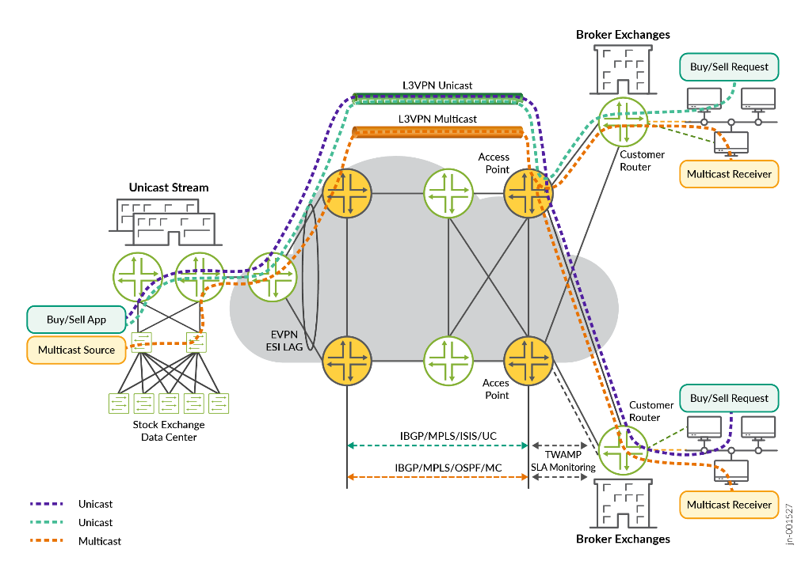
*Figure 7. Unicast and multicast traffic flow.*

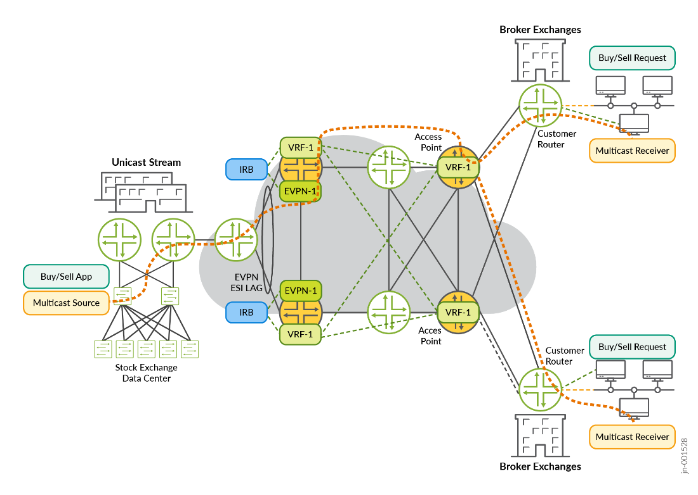
*Figure 8. L3VPN and EVPN instance — EVPN for L2, IRB steering to L3VPN.*

### TWAMP SLA Monitoring

Two-Way Active Measurement Protocol (TWAMP) measures latency, packet loss,
and jitter in real time and alerts on degradation. It uses two protocols:

- **TWAMP-Control** — initiates/starts/ends test sessions (Control-Client ↔ Server).
- **TWAMP-Test** — exchanges test packets (Session-Sender ↔ Session-Reflector).

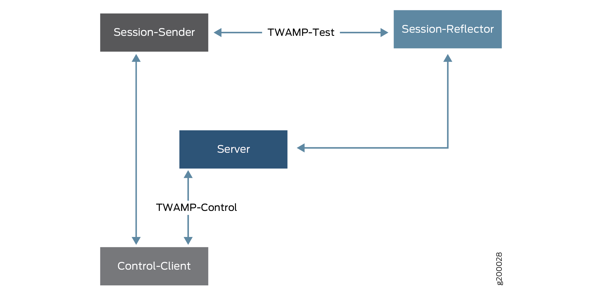
*Figure 9. The four elements of TWAMP.*

The **TWAMP client** houses the Control-Client and Session-Sender; the
**TWAMP server** houses the Session-Reflector and Server. In this JVD, TWAMP
runs between the Access Points and the Customer Routers to assure
millisecond-sensitive performance.

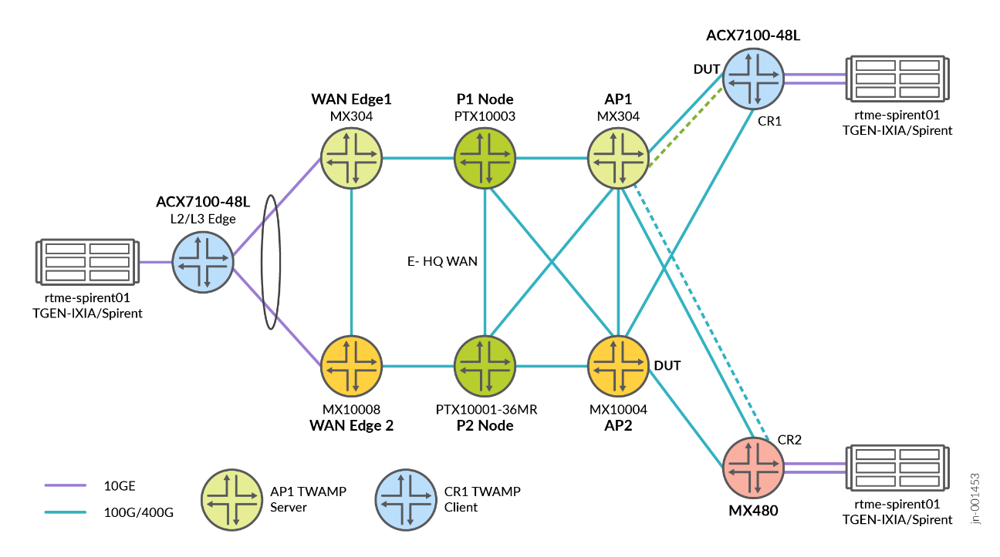
*Figure 10. TWAMP server and clients on the access side of the WAN.*

### Class of Service with Multifield Classifiers

The CoS framework classifies, prioritizes, and manages traffic per
application/service requirement. The **multifield (MF) classifier** examines
multiple header fields (source/destination IP, TCP/UDP ports, protocol, VLAN
tags, ingress interface) for granular classification. The CoS pipeline is:

> Classifier → Rewrite → Scheduler → Drop Profile → Queuing → Transmission

Mission-critical traffic (trading transactions, multicast market data) gets
strict-high priority; less critical traffic is allocated lower bandwidth.

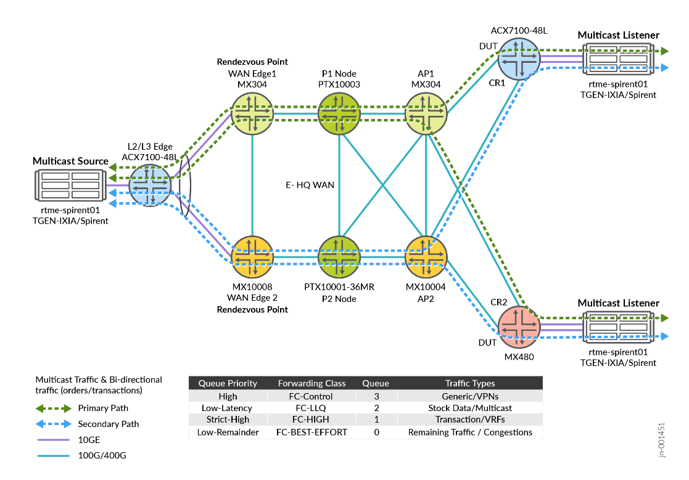
*Figure 11. Class of Service in the network architecture.*

## Solution Application

The solution uses EVPN for Active/Standby redundancy and NG-MVPN in SPT-only
mode over MPLS IP-VPN with RSVP-TE for optimized transport; PIM Sparse Mode
with a Static RP keeps the design simple. OSPF is the underlay routing
protocol. TWAMP provides SLA monitoring between Access Points and Customer
Routers. CoS multifield classifiers give multicast strict-high priority.

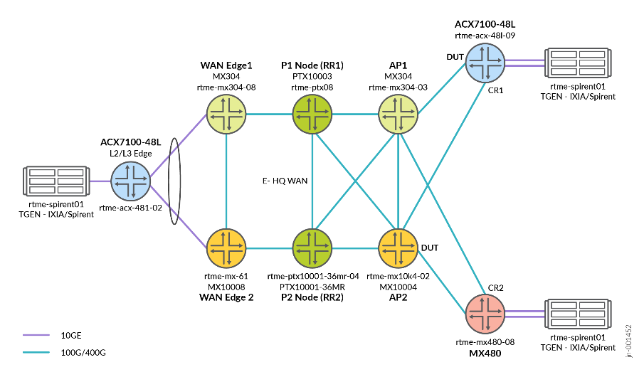
*Figure 12. EVPN network topology.*

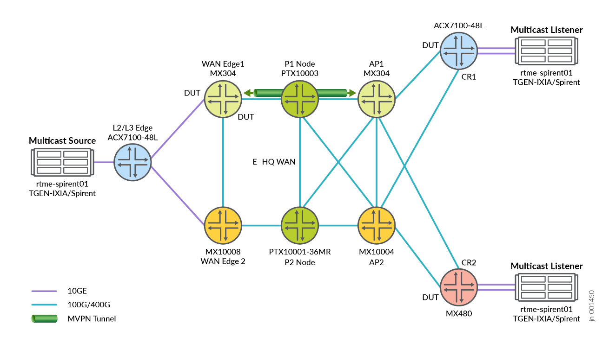
*Figure 13. NG-MVPN in this solution.*

## Network Deployment Model

The lab topology connects the platforms across the WAN Edge, Access Point,
Provider, and Customer Router roles. Full per-device configurations for every
role are published in this JVD's repository — see
[`../configuration/conf/`](../configuration/conf/) (per-device `.conf`
files) and the templated
[`../configuration/snips/`](../configuration/snips/) snip library rather than
reproducing them here.

## Validation Framework

The validation topology exercises Juniper platforms in access, core, and WAN
edge roles.

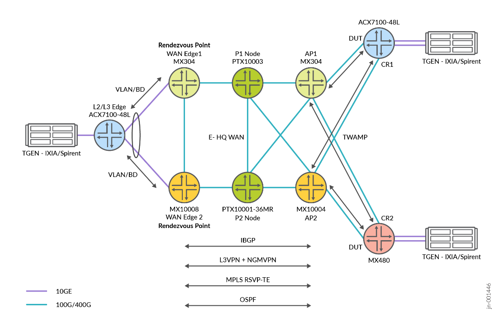
*Figure 14. Network topology used for validation.*

- **DUT platforms:** MX304, MX10008, MX10004, ACX7100-48L, MX480
- **Helper platforms:** MX480, PTX10003, PTX10001-36MR
- **Release:** Junos OS Release 24.4R2, Junos OS Evolved Release 24.4R2

**Test objectives** — validate that MX304, ACX7100-48L, MX480, and MX10008
support the performance, scalability, and resiliency requirements of stock
exchange / financial deployments from the WAN-edge perspective; the PTX10003
and PTX10001-36MR are evaluated for core routing (high-throughput forwarding,
sub-millisecond convergence, low-latency transport) and also serve as route
reflectors. DUTs undergo stress and performance testing against the traffic
profiles in the Scaling section (route scale, multicast group handling, BGP
session density, convergence under failure/recovery).

### Table 2: Scaling Requirements

| WAN Edge feature | Scale (per instance) |
|------------------|:--------------------:|
| L3VPN / EVPN instance scale | 10 |
| Multicast groups | 1000 |
| NG-MVPN instances | 10 |
| VLAN | ~10 |
| IFL scale | ~10 (overall) |
| OSPF route scale | 50K |
| RSVP LSP scale | 10 |
| Outgoing interface list | 10 |

## Convergence and Redundancy

**Single-Active EVPN for redundancy at the data center.** Two separate,
identical market-data feeds ("Feed A" / "Feed B") are transported over
different source and multicast groups, ensuring physical and node path
diversity across isolated control and data planes for maximum resiliency.

**Validated convergence at the Access Point.** Link-flap and node-reboot test
cases at the Far-End PEs show minimal packet loss.

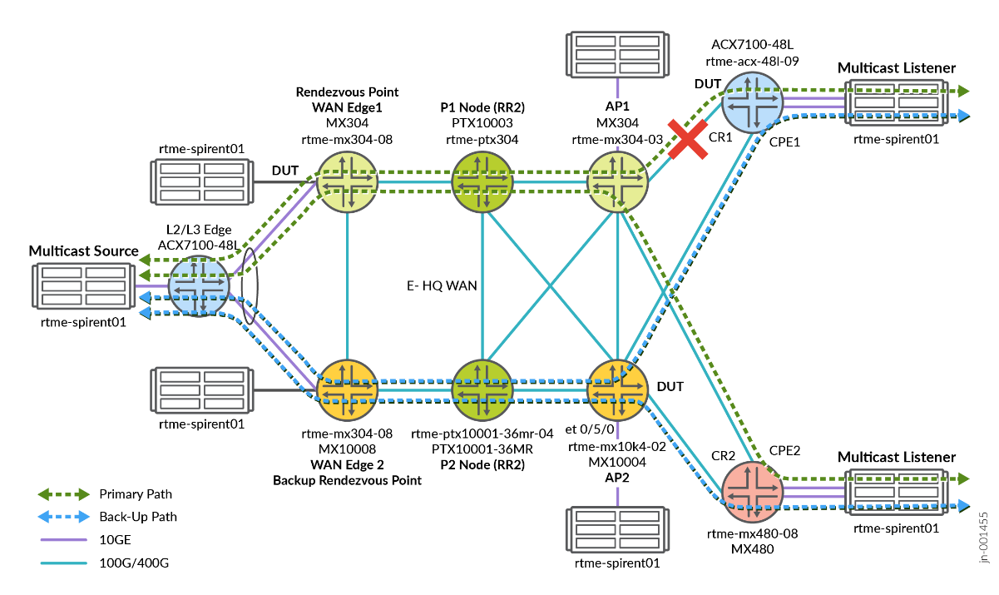
*Figure 15. Network convergence in the finance and stock WAN.*

### Recommendations

The MX304, MX10008, MX10004, ACX7100-48L, and MX480 platforms deliver the
feature set and flexibility required for finance/stock-exchange networks —
low latency, deterministic forwarding, high throughput. Support for EVPN,
MPLS, NG-MVPN, advanced QoS, and ESI-LAG ensures service continuity and
sub-second failover. **Juniper recommends deploying NG-MVPN for multicast
traffic** to meet strict finance/stock-exchange WAN requirements. Built on
Junos OS Release 24.4R2, the design is verified for interoperability,
scalability, and service assurance across all listed platforms — multicast
market-data delivery, L3VPN segmentation, TWAMP-based latency measurement,
and LLQ / strict-high QoS prioritization.

## Revision History

| Date | Version | Description |
|------|---------|-------------|
| November 2025 | EWAN-Finance-Stock-01-01 | Initial publish |

---

## Sources

- Published PDF: **JVD Design Guide: Enterprise WAN for Finance and Stock Exchange** (`JVD-EWAN-FINANCE-01-01`), on [juniper.net Validated Designs](https://www.juniper.net/documentation/us/en/software/jvd/jvd-ewan-finance-01-01/)
- Companion docs: [`solution-overview.md`](solution-overview.md), [`test-report-brief.md`](test-report-brief.md), [`datasheet.md`](datasheet.md)
- Configs: [`../configuration/conf/`](../configuration/conf/) · Snip library: [`../configuration/snips/`](../configuration/snips/)
