>
> Faithful markdown conversion of the published Juniper Validated Design
> **Enterprise WAN for Finance and Stock Exchange — JVD**
> (`EWAN-Finance-Stock-01-01`, published November 2025). The PDF on juniper.net
> is the source of truth. The design narrative and validation framework are
> reproduced in full, with the architecture, topology, and flow diagrams inlined
> from the repository `images/` folder. Representative device configuration is
> illustrated where the source guide includes it; the complete device
> configurations are in [`../configuration/conf`](../configuration/conf).

# Enterprise WAN for Finance and Stock Exchange — Design Guide

Juniper Networks Validated Designs provide you with a comprehensive, end-to-end
blueprint for deploying Juniper solutions in your network. These designs are
created by Juniper's expert engineers and tested to ensure they meet your
requirements. Using a validated design, you can reduce the risk of costly
mistakes, save time and money, and ensure that your network is optimized for
maximum performance.

## Table of Contents

- [About this Document](#about-this-document)
- [Overview](#overview)
- [Solution Benefits](#solution-benefits)
- [Solution Architecture](#solution-architecture)
- [Solution Application](#solution-application)
- [Network Deployment Model](#network-deployment-model)
- [Validation Framework](#validation-framework)
- [Test Objectives](#test-objectives)
- [Convergence and Redundancy](#convergence-and-redundancy)
- [Revision History](#revision-history)

## About this Document

This document presents a Juniper Validated Design (JVD) for building and deploying Juniper products in the Finance and stock exchange environment. This JVD is using the Juniper ACX Series, MX Series, and PTX Series platforms. In financial trading and stock exchange environments, network design is centered on handling heavy multicast traffic with low latency, resiliency, and end-to-end reliable delivery of packets, because they rely heavily on optimization for distributing market data feeds, making efficient and fast multicast replication a key design element.


## Overview

Multicast traffic is fundamental to stock exchange networks, primarily used for the efficient and simultaneous distribution of real-time market data such as quotes, trades, and order book updates to a large number of trading participants. This ensures fairness, as all clients receive the same data at nearly the same time, supporting synchronized decision-making and competitive parity. Given the extremely high volume and velocity of market data, multicast traffic provides a scalable solution by avoiding an overhead of duplicate data streams for each recipient, unlike unicast traffic. However, as multicast typically uses UDP, which lacks retransmission, packet loss must be minimized through a reliable and lossless network design. Figure 1 on page 2 illustrates an overview of the finance and stock exchange network. In the stock exchange, typically two identical multicast data feeds are sent to brokerage clients. This is commonly referred to as the primary and secondary feeds over separate multicast groups and often across diverse network paths. Brokerage clients subscribe to both feeds simultaneously, with their feed handlers continuously checking packet sequence numbers to detect and correct any loss. If a packet is missing from one stream, it can be instantly recovered from the alternate feed, ensuring no data gaps in trading applications.


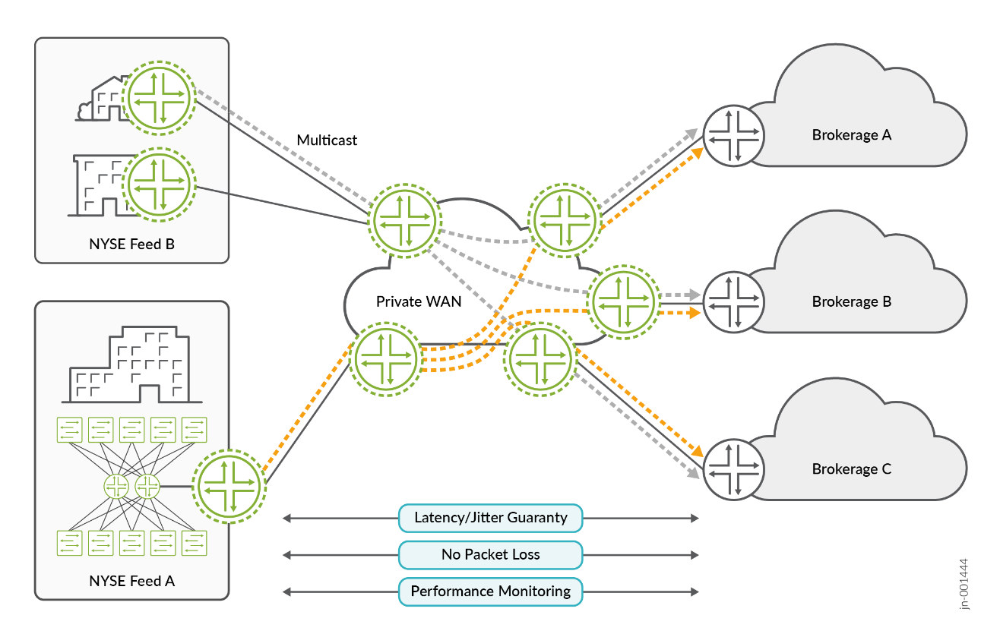

*Figure 1: Overview Finance and Stock Exchange Network.*

Low latency and jitter are critical requirements for finance and stock exchange networks. Protocols such as Internet Group Management Protocol (IGMP) and Protocol-Independent Multicast (PIM) handle multicast group membership and route traffic efficiently. IGMP snooping and hardware-based multicast replication ensure high performance and minimal network strain traffic. Next-Generation Multicast VPN (NG-MVPN), which utilizes MPLS as its transport data plane and delivers a more scalable, resilient, and bandwidth-efficient approach for multicast distribution over MPLS backbones. This model enables market exchanges and data providers to replicate multicast streams closer to the subscriber edge, reducing the burden on the network core while ensuring predictable and reliable delivery of real-time multicast. Strict quality of service (QoS) policies prioritizes multicast traffic, and access control mechanisms prevent unauthorized access to sensitive data streams. Continuous monitoring helps ensure the integrity and performance of multicast delivery, making it a cornerstone of modern stock exchange infrastructure.

In stock exchange market when the participant wants to buy or sell on an exchange, they send a unicast traffic towards the exchange's servers. The participants do not communicate directly and there is a firewall policy that prevents the participants from communicating with each other (in another words, the participants can only send packets between the exchange's servers). Exchange is basically like an auction where participants post things they want to sell on the exchange for a certain price (this is unicast), then the exchange advertises it (this is multicast), and if someone wants to buy it, they tell the exchange that they want to buy it (this is unicast). Then the exchange advertises that the item is sold (this is multicast).

Transaction part: unicast (sell) --> multicast (advertise ) --> unicast (buy ) ---> updated multicast (sold).


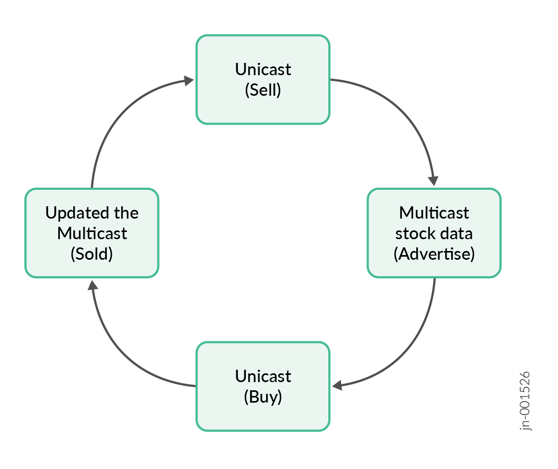

*Figure 2: Securities Transaction.*

In this JVD, the next generation of ACX Series and MX Series platforms introduces support for the 100G access segment. The Juniper Networks ACX7100-48L Cloud Metro Router acts as a CPE device, and the MX480, the MX304, the MX10004, and the MX10008 function as PE devices.


## Solution Benefits

Stock exchange networks are among the most latency-sensitive and performance-critical environments. The network must meet stringent requirements to ensure fair, deterministic, and ultra-fast trade execution. Key requirements include:

- Low Latency:

- The stock exchange network must support the lowest possible latency between trading endpoints
to maintain competitiveness and avoid arbitrage disadvantages.

- Deterministic Packet Delivery:

- Consistent packet forwarding paths are essential. Variability in path selection, such as through
ECMP or load balancing, must be minimized or tightly controlled to avoid unpredictable delays and packet reordering.

- Zero Packet Loss:

- Loss of packets is unacceptable, as it can result in missed trades or inaccurate data. Lossless
Ethernet configurations (e.g., Priority Flow Control and Explicit Congestion Notification) are often used.

- No Packet Reordering:

- Packets must arrive in order, particularly for multicast market data and transactional traffic.
Reordering can cause trade mismatches or force retransmissions, adding latency.

- High Availability and Redundancy:

- The network must offer continuous uptime through redundant paths, devices, and failover
mechanisms. Failovers should be sub-second and ideally hitless.

- Security and Segmentation:

- The network must provide strict isolation between tenants, trading firms, and services, with
robust access control and monitoring.

- Scalability and Performance Monitoring:
- As trading volume grows, the infrastructure must be scaled without performance degradation.
Real-time telemetry and analytics are needed to monitor jitter, delay, and packet drops.

- Platform Uniformity:

- Using consistent hardware and software platforms helps minimize behavioral differences. For
example, in hashing or queuing issues like packet reordering or jitter are reduced.

By implementing advanced networking technologies, EWAN Stock Exchange creates a robust, intelligent network infrastructure capable of handling the most demanding financial transaction environments.

Enterprise WAN of Financial and Stock Exchange JVD considers the following customer reference architectures from engagements with individual customers, account teams, and SE leads. Under consideration includes the infrastructure selection, architecture design implementation and/or concepts, transport underlays, service overlays, and overall solution goals. Customer use cases are strictly confidential!

- APAC Stock Exchange

- EMEA Stock Exchange

The data center network of EWAN Stock Exchange is built on the reference model below ( Figure 3 on page 5 ) which is categorized into three layers, namely:

- WAN Edges [Rendezvous Point] First Hop Router from Multicast Source.

- Access Point [Far End PEs]

- Access layer [Customer Routers]


*Figure 3: Three Layers of Finance and Stock Exchange Architecture.*

In this JVD, the next generation of ACX and MX platforms is introduced to support the 100G access segment. The ACX7100-48L serves as the Customer Router (CR1), while the MX480 functions as Customer Router (CR2). The MX304 platforms act as Provider Edge (PE) devices positioned at WAN Edge 1 and Access Point 1 (AP1). Additionally, the MX10004 is deployed in the Provider Edge (WAN Edge 2) role, and the MX10008 serves as a Provider Edge (PE) representing the Access Point 2 (AP2) function.

For detailed topology and device placement, see Figure 4 on page 7 , which illustrates the specific roles and interconnections of these platforms within the 100G access and transport architecture.


## Solution Architecture

The architecture is designed to support latency-sensitive, deterministic, and ultra-fast trade execution. In this architecture, EVPN with L3VPN-NGMVPN is implemented to handle multicast at scale and to meet the performance requirements of the finance and stock exchange WAN network. We build the topology of this WAN network as shown in Figure 4, the stock exchange server is connected to the WAN edges through an L2 switch. This L2 switch acts as a bridge to connect the core SP network that has been designated for Pes role as Access Points ( APs ) and has a connection with the Customer Router (CR) . The CR is further connected to the Multicast Subscribers / Listeners / Interested Receivers. For more information, see Figure 4 on page 7 . These CRs are acting as a default gateway to the end- user Personal Computers (PCs) from where users access the finance and Stock exchange application for selling and buying orders.


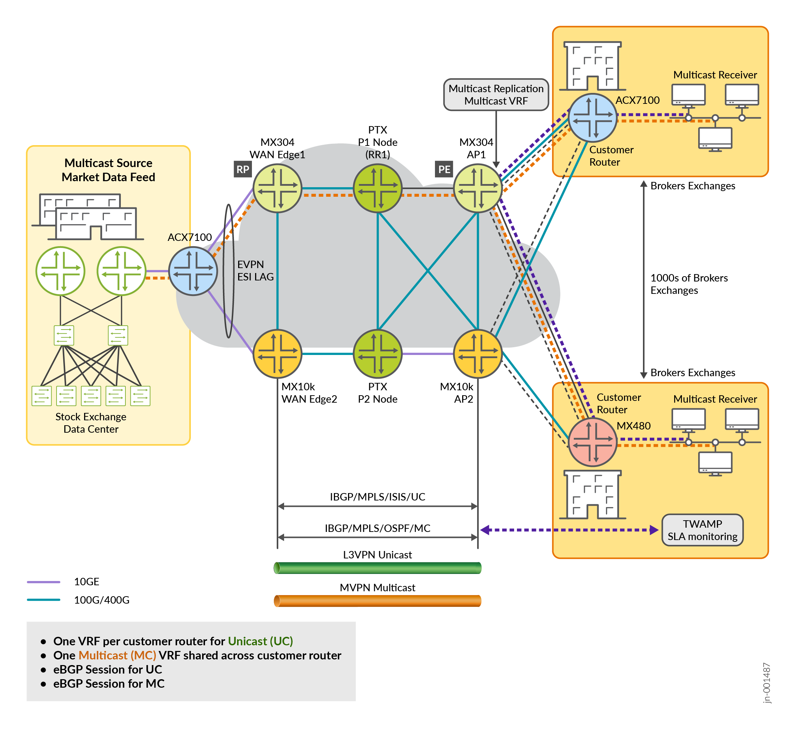

*Figure 4: Architecture of Stock Exchange and Finance WAN Network.*

This JVD for the Enterprise WAN of the stock exchange network has the following major components:


### Next-Generation Multicast VPN (NGMVPN) with MPLS and RSVP-TE

Traditional multicast mechanisms struggle with operational complexity and scalability when serving thousands of flows across geographically dispersed sites. Next-Generation MVPN, leveraging MPLS as a data plane, provides a more efficient, scalable, and resilient way to transport multicast market data over MPLS backbones. It enables exchanges to replicate multicast streams closer to the client edge, reducing core bandwidth consumption while ensuring deterministic delivery. Following the significant roles of NG-MVPN in this solution:

- NGMVPN distributes multicast traffic

- MPLS provides a label-switched network, creating dedicated and predictable paths

- Resource Reservation Protocol - Traffic Engineering (RSVP-TE) acts as a traffic transport enabler to
reserve network resources in advance:

- Ensures consistent performance for critical applications

- Allows precise control over bandwidth and network path


### Rendezvous Point (RP) Redundancy

The implementation of a Rendezvous Point (RP) in an environment with ESI-LAG is designed to ensure redundancy and seamless multicast delivery. Instead of binding the RP to a physical ESI-LAG interface, it is always placed on a loopback address, which both PE devices in the dual-homed pair advertise into the routing domain. This allows the RP to remain consistently reachable regardless of which PE is active. For high availability and load balancing, Juniper typically leverages an Anycast RP model, where both PEs are configured with the same RP address and in some cases EVPN deployments, rely on the EVPN control plane to propagate state.


*Figure 5: Rendezvous Point (RP) in the WAN topology.*


### ANYCAST Rendezvous Point (RP)

On Juniper Networks Devices, Anycast RP is implemented to provide redundancy and load sharing in multicast environments using PIM-SM. Instead of relying on a single Rendezvous Point (RP), multiple routers are configured with the same loopback IP address, which serves as the Anycast RP address for the domain. Each router in the PIM domain is then pointed to this common address as its RP. To ensure all RPs are aware of active multicast sources, the RPs exchange source information so that receivers can join streams regardless of which physical RP they reach. This design removes the single point of failure associated with a traditional RP, balances multicast load across multiple routers, and provides seamless failover if one RP goes down, all while remaining fully standards-based and interoperable with other vendors.


### EVPN (Ethernet Virtual Private Network) with Single-Active

Imagine the stock exchange network as a critical highway system for financial transactions. EVPN acts as an intelligent traffic management system that can instantly reroute the traffic if one route is blocked.

In this implementation:

- The Single-Active state of ESI model ensures immediate failover

- One network path remains actively processing traffic

- A standby path is constantly ready to take over instantaneously

The Single-Active solution is more predictive for packet forwarding in this solution. One should avoid using active/active solutions for predictive packet forwarding and mitigate packet re-ordering. Reordering and consistent latency are the factors that lead to not using active-active solutions. The application-level redundancy helps to achieve high performance of the network.

If the primary network path experiences an interruption (like a hardware failure), the standby path becomes active instantaneously, ensuring uninterrupted network connectivity for critical financial transactions.


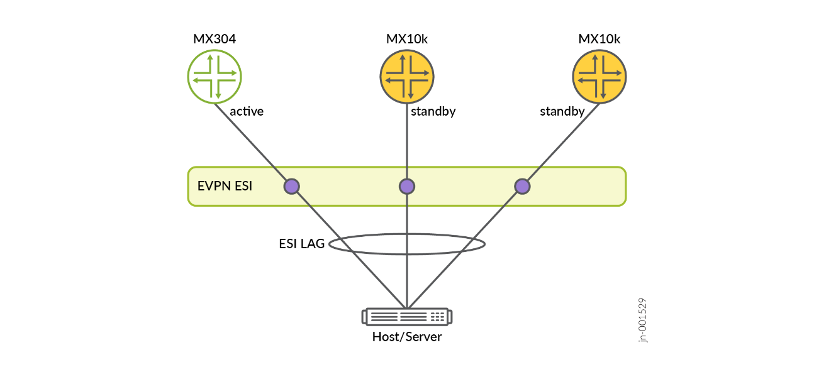

*Figure 6: EVPN ESI LAG in Multi-homing environment.*

Following are some of the benefits of using EVPN in this solution.

EVPN Efficient MAC Address Management

- Prevents MAC address flapping

- Provides consistent MAC address learning across network devices

- Supports large-scale network environments

- Enables efficient handling of MAC address mobility

EVPN Improved Convergence Times - In critical environments like financial trading or emergency communications, convergence times can be lifesaving as it has:

- Extremely fast failover times (milliseconds)

- Minimal network disruption during topology changes

- Predictable and consistent recovery behavior

- Reduction in potential service interruptions

EVPN Protocol Flexibility

- Supports multiple underlying transport mechanisms

- Works with MPLS, IP, and other transport protocols

- Provides vendor-neutral implementation options

- Enables gradual network evolution

- Supports mixed-vendor network environments


### Layer 3 Virtual Private Network

Layer 3 Virtual Private Network (L3VPN) in this solution provides connectivity from a brokerage customer to the stock exchange server to place orders like buying and selling the securities including stock, options, bonds, and so on. As mentioned earlier, in stock exchanges the stock transaction can view as below where buy and sell happen with unicast traffic and updates and current stock prices sent as multicast traffic.

Stock Transaction: unicast (sell) 🡪 multicast (advertise ) 🡪 unicast (buy ) 🡪 updated multicast (sold)

Figure 7 on page 11 shows traffic flow of unicast and multicast traffic designed into this solution. Figure 8 on page 12 provides a more detailed view of the finance and Stock Exchange Data Center side, where EVPN instances are used for all L2 traffic. With IRB, this layer-3 traffic is then steered to L3VPNs for unicast and Multicast.


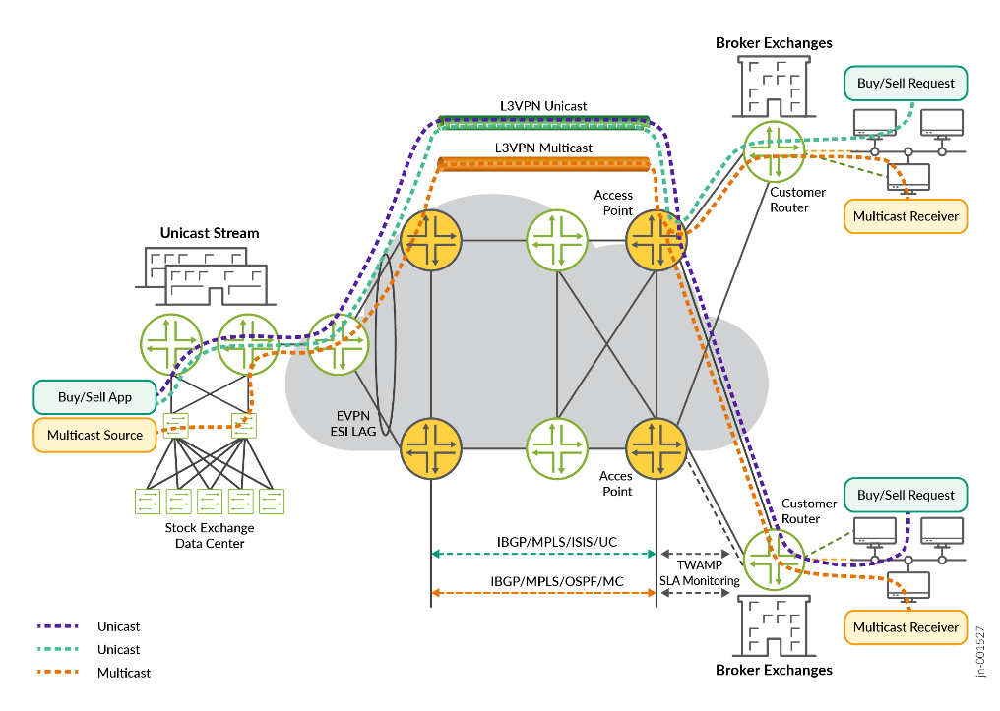

*Figure 7: Unicast and Multicast Traffic Flow.*


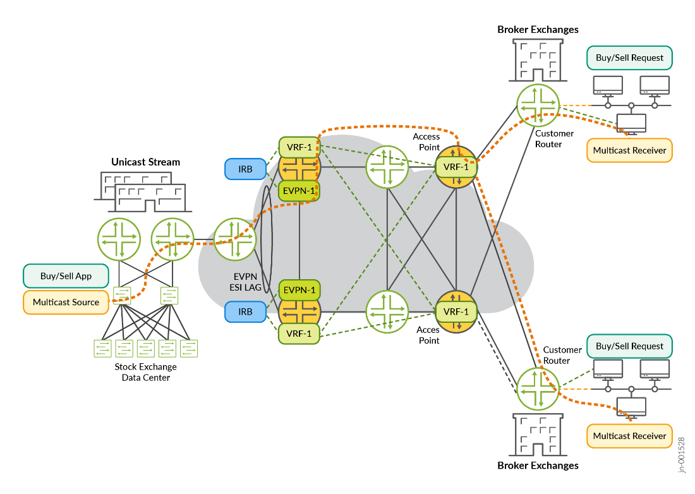

*Figure 8: L3VPN and EVPN Instance.*


### Two-Way Active Measurement Protocol (TWAMP) SLA Monitoring

TWAMP SLA monitoring is like a network health inspector constantly checking every critical network path. It:

- Measures network performance in real-time

- Tracks metrics such as:

- Latency

- Packet loss

- Jitter

- Sends immediate alerts for performance degradation

Usually, TWAMP operates between interfaces on two devices playing specific roles. TWAMP is often used to check Service Level Agreement (SLA) compliance, and the TWAMP feature is often presented in that context. TWAMP uses two related protocols, running between several defined elements:

- TWAMP-Control—Initiates, starts, and ends test sessions. The TWAMP-Control protocol runs
between a Control-Client element and a Server element.

- TWAMP-Test—Exchanges test packets between two TWAMP elements. The TWAMP-Test protocol
runs between a Session-Sender element and a Session-Reflector element.

Figure 9 on page 13 shows four elements as follows:


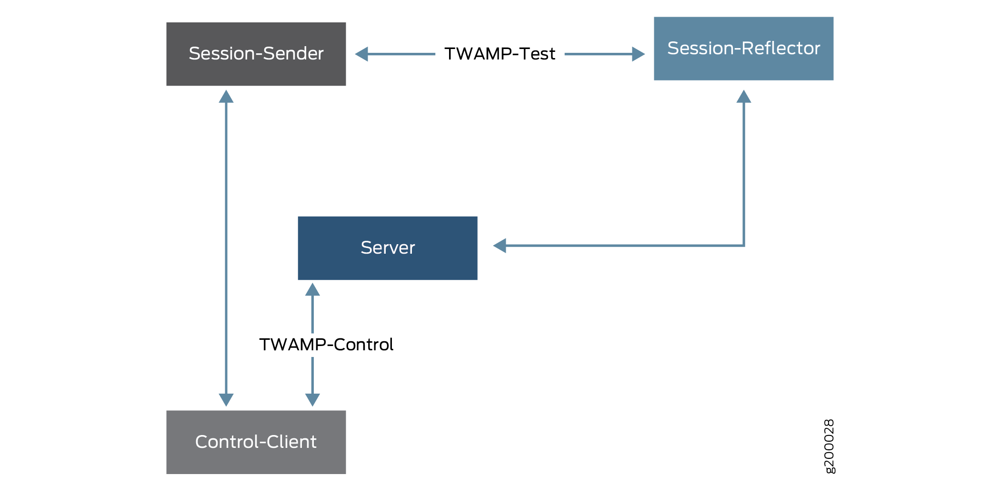

*Figure 9: Four Elements of TWAMP.*

The TWAMP client-server architecture is implemented as follows:

TWAMP client

- Control-Client sets up, starts and stops the TWAMP test sessions.

- Session-Sender creates TWAMP test packets that are sent to the Session-Reflector in the TWAMP
server.

TWAMP server

- Session-Reflector sends back a measurement packet when a test packet is received but does not
maintain a record of such information.

- Server manages one or more sessions with the TWAMP client and listens for control messages on a
TCP port.

Figure 10 on page 14 shows packaging of these elements into TWAMP client and TWAMP server processes.


*Figure 10: Architecture of Stock Exchange and Finance WAN Network.*

Stock Exchange Significance: Ensures that trading platforms maintain highest possible performance standards, critical for millisecond-sensitive financial transactions.


### Class of Service with Multifield Classifiers

Class of Service (CoS) framework provides a powerful mechanism to classify, prioritize, and manage network traffic based on application or service requirements. It ensures predictable performance during congestion by categorizing packets into multiple forwarding classes and queues, each governed by defined scheduling and drop policies. Within this framework, the multifield (MF) classifier plays a crucial role by enabling granular classification decisions that go beyond simple DSCP or EXP bit inspection. Instead, it examines multiple packet header fields such as source and destination IP addresses, TCP/UDP ports, protocol types, VLAN tags, or ingress interfaces, hence Juniper routers accurately identify traffic patterns and assign them to appropriate forwarding classes.

For example, the MF classifier can recognize real-time traffic like voice and video streams based on UDP port ranges and classify them into high-priority queues such as expedited-forwarding or assured- forwarding, while default data flows are directed to best-effort classes. Once packets are classified, they are processed through schedulers, shapers, and drop profiles that determine transmission priority and bandwidth allocation per queue. This ensures that delay-sensitive traffic, such as VoIP or video conferencing, receives strict priority treatment, while data or research traffic is handled fairly using weighted queuing.

The multifield classifier is the most granular and flexible classification mechanism in Junos OS class of service. Unlike simple code-point classifiers (based only on DSCP or EXP bits), an MF classifier examines multiple fields in the packet header simultaneously.

Class of Service (CoS) in Junos OS is designed to manage and prioritize network traffic, ensuring predictable performance even during congestion. It provides differentiated handling of packets based on user-defined policies aligning with business-critical priorities such as real-time applications, voice/video, or control-plane traffic.

The CoS process typically follows this logical sequence:

Classifier → Rewrite → Scheduler → Drop Profile → Queuing → Transmission

Class of Service in Junos OS performs the following functions:

- Identifies and prioritizes network traffic based on multiple parameters:

- Source IP address

- Destination IP address

- Protocol type

- Application type

- Ensures mission-critical traffic (like trading transactions) gets highest priority

- Allocates lower bandwidth to less critical traffic


## Solution Application

The proposed solution incorporates Enterprise WAN Finance Architecture, which utilizes Ethernet Virtual Private Network (EVPN) technology to enable Active/Standby redundancy. This setup ensures high availability and resilience for critical financial data transmission. Additionally, the architecture implements Next Generation Multicast Virtual Private Network (NGMVPN) in the SPT-only mode to efficiently manage multicast traffic across Multi-Protocol Label Switching (MPLS) IP Virtual Private Network (VPN), utilizing Resource Reservation Protocol-Traffic Engineering (RSVP-TE) for optimized transport. To keep the design simple, PIM Sparse Mode is used with a Static RP.

In the underlying network topology, Open Shortest Path First (OSPF) is deployed as a routing protocol, facilitating dynamic routing capabilities among multiple nodes. Furthermore, Two-Way Active Measurement Protocol (TWAMP) is employed for SLA (Service Level Agreement) monitoring, enabling proactive performance assessment between access points and customer routers.

To enhance the traffic management, Class of Service (CoS) is configured with multifield classifiers that prioritizes multicast traffic with a strict-high priority designation, while assigning a lower priority to all remaining services.


## Network Deployment Model


### Lab Topology

Figure 11 on page 17 explains connectivity between the platforms in the Enterprise WAN for Finance and Stock Exchange JVD infrastructure. The fabric topology leverages Primary and Secondary path for multicast traffic with Anycast RP in case of node failure scenarios.


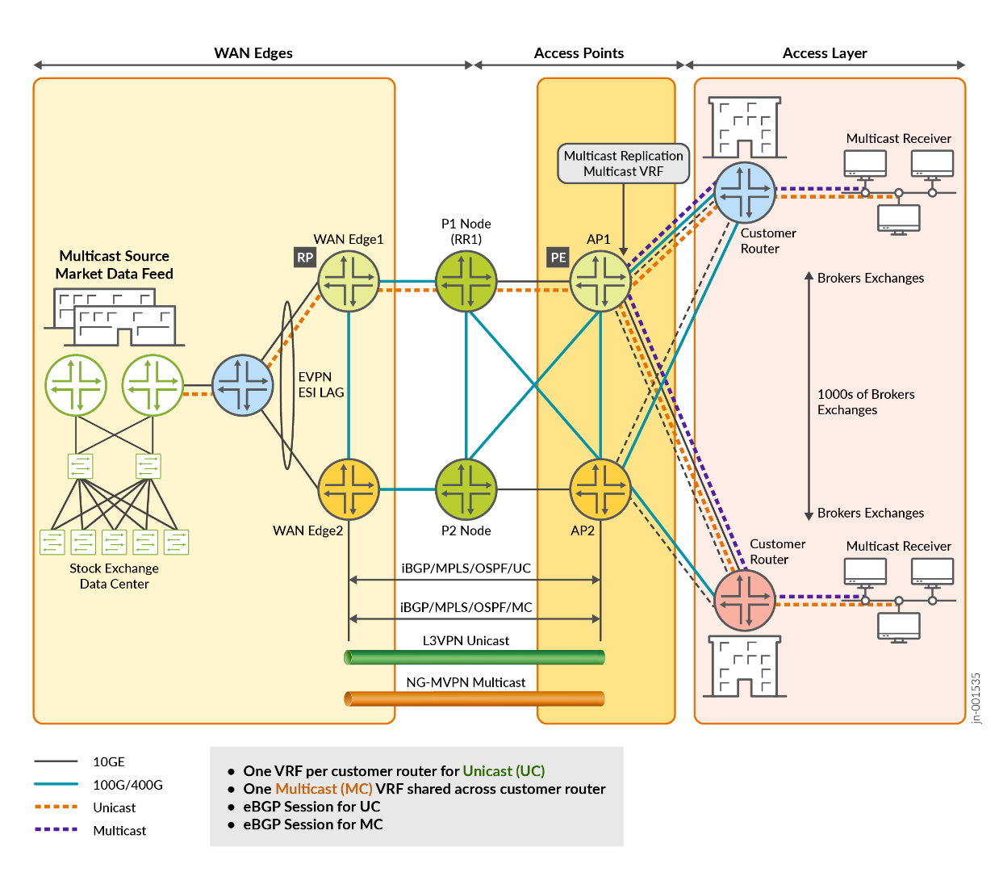

*Figure 11: Network Topology for Finance and Stock Exchange.*


### Platform Positioning

Topology definition includes:

- WANEDGE1: Device (DUT)

- AP1: Device (DUT)

- AP2: Helper Router

- CR1: Customer Router (DUT)

- CR2: Customer Router

- WANEDGE2: Helper Router

- L2/L3 Edge: Helper Router


### Baseline Features

The following are list of the protocols used stock exchange WAN overlay and underlay services:

- NG-MVPN (Type 6 and Type 7)

- PIM V2 with Sparse Mode

- L3VPN

- Bridge-Domain

- MVPN with mode spt-only

- RSVP TE

- OSPF

- IBGP and EBGP

- TWAMP (SLA Monitoring)

- LLQ-COS [Multifield Classifiers]

- ANYCAST RP

- Static RP

Figure 12 on page 19 shows the VPN multicast source is connected to ACX7100, which connects to WAN Edge-1 and WAN Edge-2. From the NG-MVPN signaling perspective, both routers act as Source- PE and at the other end, VPN multicast receivers connected to router AP1 and AP2 act as Receiver-PE. Following are some of the BGP routes used in NG-MVPN:

- Auto-discovery Routes: These routes help in discovering MVPN membership information within and
across autonomous systems.

- Provider Tunnel Routes: These routes are used to advertise provider tunnel details.

- C-Multicast Routes: These routes are used for the exchange of customer multicast routing
information.


*Figure 12: Network Topology for Finance and Stock Exchange.*

In this solution, BGP signaling is enabled with family mcast-vpn configuration to use BGP as the control plane protocol between PEs for MVPNs.

protocols { bgp {

} }

Configuration of multicast VRF at data center of the stock exchange at WANEdge-1.

VRF1 {

} interface irb.1; interface lo0.1; route-distinguisher 64512:51; vrf-target target:64512:2; vrf-table-label; provider-tunnel { } }

In a multicast environment, the Rendezvous Point (RP) is a crucial component for managing multicast traffic, particularly in Protocol Independent Multicast Sparse Mode (PIM-SM). The RP serves as the initial point of contact for multicast sources and receivers.

The configuration of RP in WAN Edge1 and WAN Edge2 is as follows:

The configuration of RP in MVPN protocol is as follows:

mvpn { }

```console
  root@rtme-mx10k4-02# run show mvpn instance VRF10


MVPN instance: Legend for neighbor state (St) A-    Preferred upstream neighbor for inter-AS


Legend for provider tunnel S-    Selective provider tunnel F-    Flood NH forwarding NH M-    Multicast Composite NH C-    Cloned NH


Legend for c-multicast routes properties (St) DS -- derived from (*, c-g)          RM -- remote VPN route I -- Inactive Family : INET


Instance : VRF10 MVPN Mode : SPT-ONLY Sender-Based RPF: Disabled. Reason: Not enabled by configuration. Hot Root Standby: Disabled. Reason: Not enabled by configuration. Provider tunnel: I-P-tnl:RSVP-TE P2MP:7.7.7.7, 44721,7.7.7.7 Neighbor                      Inclusive Provider Tunnel                             Label-In St              Segment 5.5.5.5                       RSVP-TE P2MP:5.5.5.5, 17207,5.5.5.5                        1065 9.9.9.9                       RSVP-TE P2MP:9.9.9.9, 32163,9.9.9.9                        1065


C-mcast IPv4 (S:G)            Provider Tunnel                                        Label-In St    FwdNh    Segment 0.0.0.0/0:225.0.36.0/32       Primary unbound 172.168.102.2/32:225.0.36.0/32 RSVP-TE P2MP:9.9.9.9, 32163,9.9.9.9 1065           M-0x0


Optimum Replication

Multicast tunnels are either ingress replication tunnels or Point to MultiPoint (P2MP) tunnels. The solution supports optimum replication for both Intra-subnet and Inter-subnet IP multicast traffic.


```


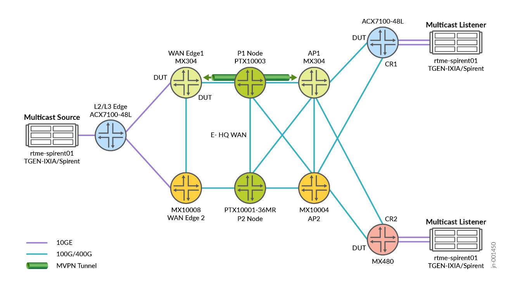

*Figure 13: NG-MVPN in this Solution.*

Ethernet VPN (EVPN) connects dispersed customer sites using a Layer 2 virtual bridge. In Figure 13 on page 23 , EVPN with Single-Active solution is enabled with Designated Forwarder (DF) and Non- Designated Forwarders (non-DF) PE’s. This solution supports all EVPN service interfaces listed in Section 6 of [RFC7432]:

- VLAN-based service interface

- VLAN-bundle service interface

- VLAN-aware bundle service interface

In this JVD solution is used VLAN-based service interface model. EVPN ESI simplifies complex network designs by:

- Reducing network complexity and eliminating multiple redundancy protocols

- Providing a unified approach to multi-homing

- Minimizing configuration overhead

- Enabling centralized management of network segments

ae0 {

} } unit 1 { description "Connection to PE1_to_CE1_for_CR1_1"; encapsulation vlan-bridge; vlan-id 10; esi { } } unit 2 { description "Connection to PE1_to_CE1_for_CR1_2"; encapsulation vlan-bridge; vlan-id 11; esi { } } unit 3 { … } unit 4 { } unit 5 { …} unit 6 { …} unit 7 { …}

unit 8 { …} unit 9 { …}

unit 10 { encapsulation vlan-bridge; vlan-id 19; esi { } } unit 20 { vlan-id 20; family inet { } } unit 21 { encapsulation vlan-bridge; vlan-id 21; esi { } } unit 22 { encapsulation vlan-bridge; vlan-id 22; esi {

} } unit 23 { } unit 50 { } }


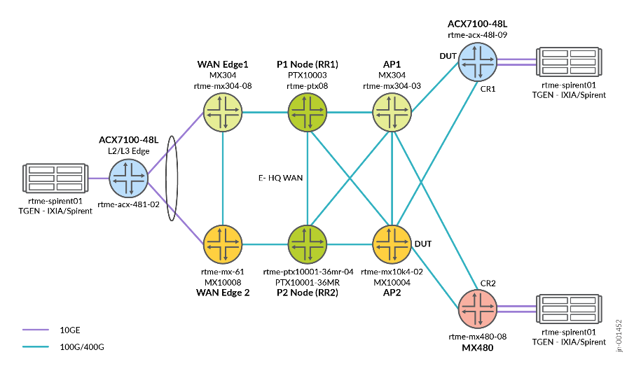

*Figure 14: EVPN Network Topology.*


### L3 VPN Configuration

In Next-Generation Multicast VPNs (NG-MVPNs), the underlying Layer 3 VPN (L3VPN) model provides the foundational unicast infrastructure and core network, onto which NG-MVPN builds the capability to transport multicast traffic efficiently. NG-MVPN extends the familiar MPLS L3VPN service by unifying the control plane for both unicast and multicast using BGP, reducing the complexity and improving scalability compared to older MVPN architectures. Figure x shows the traffic flow from the customer to the stock exchange data center and vice versa. There are separate VRFs from unicast and Multicast services.


*Figure 15: Connecting EVPN and VRF for Multicast and Unicast Traffic — see the [published PDF](https://www.juniper.net/documentation/us/en/software/jvd/ewan-finance/index.html).*

Following is the L3 VPN configuration for multicast traffic.

VRF10 {

mvpn-mode { } route-target { } sender-based-rpf; hot-root-standby { } } ospf { area 0.0.0.0 { } export bgp-to-ospf; } pim { traceoptions { } join-prune-timeout 420; rp { } interface lo0.10; interface irb.10; }

}

Here is the configuration for L3 VPNS for unicast traffic

VRF21 { }


### Class of Service

In Juniper router, we support multiple levels of transmission priority, which in order of increasing priority are low, low-medium, low-high, medium-low, medium-high, high, strict-high, and low-latency. This allows the software to service higher-priority queues before lower-priority queues. Which transmission priority levels that are supported can vary depending on the platform and software release. LLQ enables delay-sensitive data to have preferential treatment over other traffic. A low-latency queue has the highest priority over any other priority queues, including strict-high queues, as well as a low delay scheduling profile.

In this solution Class of Service( CoS ) with a multifield classifier applied on multicast and other services use the following queue priorities. CoS is configured with multifield classifiers that prioritize multicast traffic with a low-latency priority designation, while assigning a lower priority to all remaining services.

The following table provides queue priority details:


### Table 1: Queue Priority Details

| Queue Priority | Forwarding Class | Queue | Traffic Types |
|---|---|---|---|
| High | FC-Control | 3 | Generic/VPNs |
| Low-Latency | FC-LLQ | 2 | Stock Data/Multicast |
| Strict-High | FC-HIGH | 1 | Transaction/VRFs |


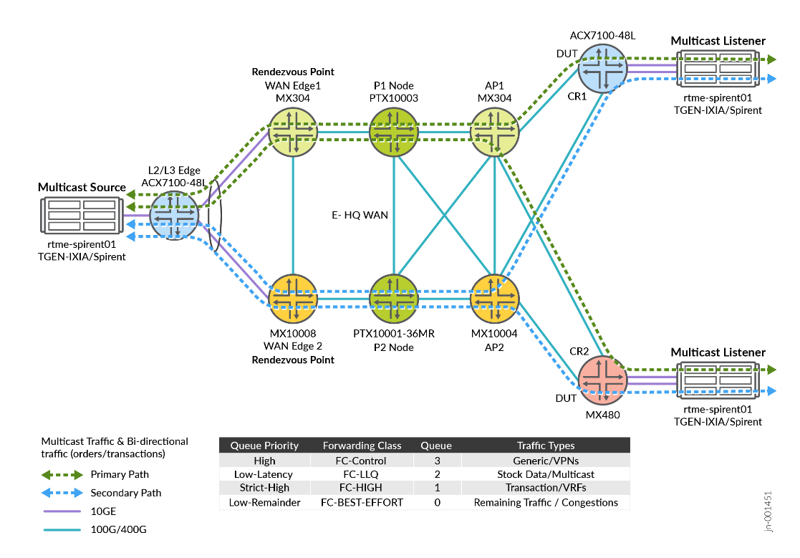

*Figure 16: Class of Service in Network Architecture.*

Following sample COS configuration can be applied on WAN edge-1 and WAN edge-2.

Filter_MF {

filter mfc-filter1 { interface-specific; term stock_exch { } term accept-all-else { } } filter mfc-filter2 { interface-specific; term stock_exch { } term accept-all-else { } } filter mfc-filter3 { interface-specific; term stock_exch {

} } Int_MF { interfaces {

} } COS_MF { class-of-service {

} } forwarding-classes { class FC-HIGH queue-num 1; class BEST-EFFORT queue-num 0; class CONTROL queue-num 3; class FC-LLQ queue-num 2; } interfaces { et-0/0/4 { } xe-0/0/1:1 { } et-0/0/2 { } ae0 { } } rewrite-rules { exp EXP {

} } scheduler-maps { sched-map { } } schedulers { s0 { } s1 { } s2 { } s3 { } }

}

Following sample configuration can be applied on an access point.

class-of-service { classifiers { } forwarding-classes { } routing-instances {

…} …} …} …} …} rewrite-rules {

}

You can define Class of Service in the following roles, which are suitable for this JVD solution.

- Classification:

- Behavior Aggregate classification is based on received code points

- 802.1p, DSCP, and EXP classification is based on received ingress packet headers

- Fixed classification is based on forwarding class mapping

For guaranteed ultra-low end-to-end latency between the Customer Equipment (CE) and the Provider Equipment (PE) as well as for overall Low Latency Quality (LLQ) use cases. For more information, see JVD-5G-FH-COS-02-02 .

Following is the sample configuration for multifield classification.

Filter_MF {

} } filter mfc-filter1 { term stock_exch { } term accept-all-else { } } filter mfc-filter2 { term stock_exch { } term accept-all-else { } } filter mfc-filter3 { term stock_exch {

} } COS_MF { class-of-service {

} et-0/0/0 { } et-0/0/1 { } et-0/0/5 { } } rewrite-rules { exp EXP {

} } Int_MF {

interfaces { …} …} …} …} …} } …} …} …}

…} …} …} …} …} …}

}


### Two-Way Active Measurement Protocol (TWAMP)

TWAMP is an open protocol that measures network performance between two devices in a network. It helps in measuring the network performance between the two devices in a round trip that supports TWAMP implementation and is used to check the Service Level Agreement (SLA) compliance. Figure 17 on page 48 shows implementation of TWAMP between AP and CR nodes.


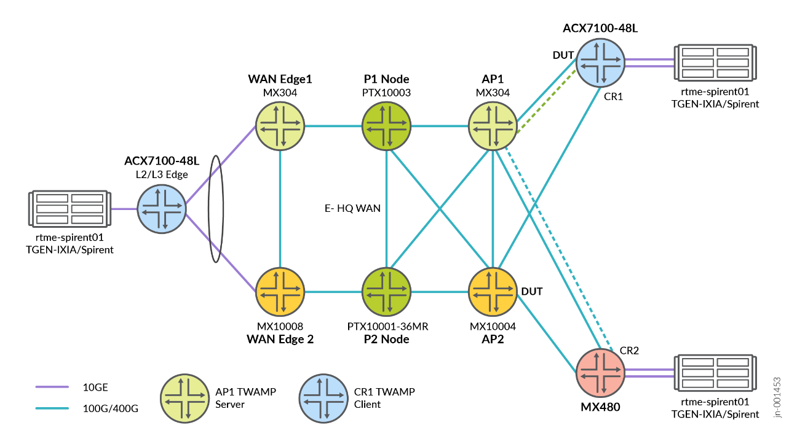

*Figure 17: TWAMP Server and Clients in the Access Side of the WAN Network.*

TWAMP is a sophisticated network performance measurement protocol that evolved from its predecessor, One-Way Active Measurement Protocol (OWAMP). It is like an advanced diagnostic tool for network health.

Following is a sample server-side configuration of AP1, which is acting as the Server in this network topology.

services { rpm {

} }


### Reference Architecture Implications

- Refer Metro Ethernet Business Services for EVPN-VPWS/FXC/EVPN-ELAN and co-existing with
traditional VPN services including multi-site VPLS, Hot-Standby L2Circuit, L2VPN, and L3VPN with DIA.

- Refer Metro as a Service MEF 3.0 for further details on EVPN-VPWS, EVPN-FXC, EVPN-ELAN,
VPLS, L2Circuit, and L2VPN over a color-aware SR-MPLS Inter-AS topology.

- Refer Class of Service in 5G Networks for ultra-low end-to-end latency between the Customer
Equipment (CE) and the Provider Equipment (PE) as well as for overall Low Latency Quality (LLQ) usage nodes.


## Validation Framework

Figure 18 on page 50 depicts the actual topology where different products from Juniper automated solutions groups are used in access, core, and WAN edge roles.


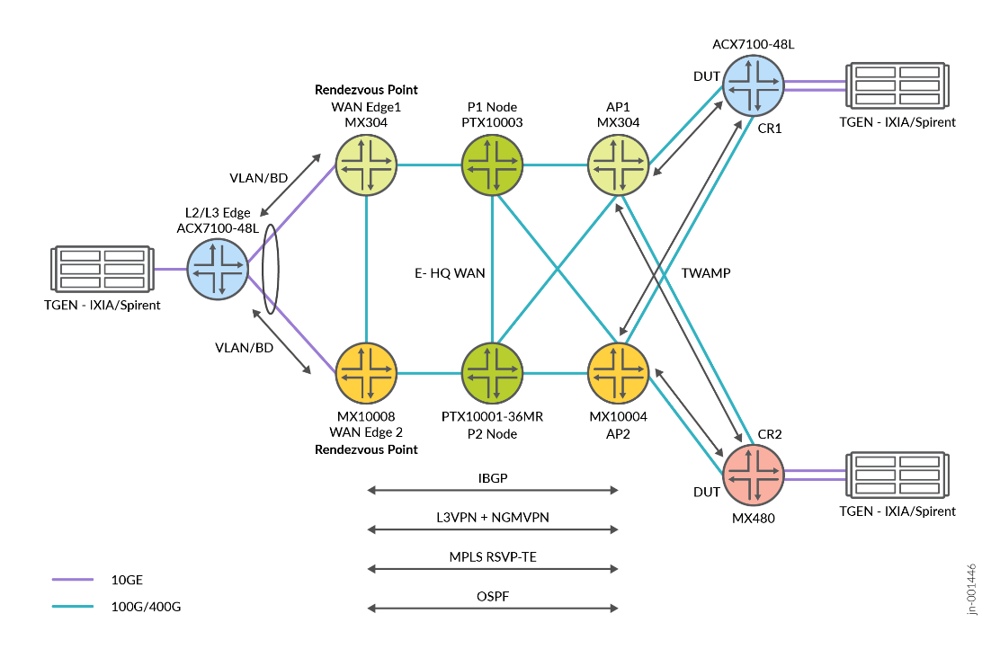

*Figure 18: Network Topology for Validations.*

Topology definitions are as follows:

- CR (Customer Routers ): MX480/ACX7100-48L[L2/L3 Edge]

- WAN Edge: MX304[WAN-Edge1], MX10004[AP2], MX304[AP1], and MX10004[AP2]

- Backbone: PTX10003 and PTX10001-36MR

- Route Reflector: PTX10001-36MR and PTX10003

Platforms / Devices Under Test (DUT)

To review the software versions and platforms on which this JVD was validated by Juniper Networks, see the Validated Platforms and Software section in this document.


## Test Objectives

This validation is conducted to ensure that the MX304, ACX7100-48L, MX480, and MX10008 platforms can support the performance, scalability, and resiliency requirements of stock exchange and financial services deployments, particularly from the WAN Edge perspective. These platforms are expected to handle high-scale, low-latency transaction environments, maintain deterministic performance, and support features such as advanced queuing and traffic engineering.

In the core network domain, the PTX10003 and PTX10001-36MR platforms are evaluated for finance- sector core routing needs such as high-throughput forwarding, sub-millisecond convergence, and low- latency transport. Both of these PTX platforms also serve as route reflectors to optimize control plane distribution and improve routing efficiency across the network.

All devices under test (DUTs) undergo stress and performance testing against the benchmarks and traffic profiles defined in the Scaling section of this document. These tests include evaluating route scales, multicast group handling, BGP session density, and convergence performance under failure and recovery conditions. For more information on platform-specific configurations, hardware specifications, software versions, interface types, and detailed test methodologies, see the Full Test Report [4].


### Solution Validation Requirements

The solution validation helps to:

- Validate end-to-end network architecture and design with EVPN for redundancy and L3VPN-
NGMVPN over RSVP-TE.

- Validate end-to-end traffic with multiple stress conditions for TWAMP and COS parameter
measurements.

- Validate MX304 platform as WAN-EDGE Router

- Validate MX304 platform as Access Point Router

- Validate ACX7100 as Customer Router


### Solution Scaling Requirements


### Table 2: Scaling Requirements

| WAN Edge Feature | Scale (per instance) |
|---|---|
| L3VPN/EVPN Instance scale | 10 |
| Multicast Groups | 1000 |
| NGMVPN Instances | 10 |
| VLAN | ~10 |
| IFL Scale | ~10 (Overall) |
| OSPF Route scale | 50K |
| RSVP LSP Scale | 10 |
| Outgoing interface list | 10 |


## Convergence and Redundancy


### Single-Active EVPN for Redundancy at Data Center

Packet reordering and consistent latency in a stock exchange network are major concerns for deterministic packet delivery. Thus, one should use EVPN Single-Active solution for redundancy at Data Center side. Provides two separate, identical market data feeds, often designated as "Feed A" and "Feed B". These feeds are transported using different source and multicast groups, ensuring physical path diversity and node diversity to create maximum separation and resilience. These redundant feeds

operate on entirely separate infrastructures with isolated control and data planes, providing highest level of resiliency.

Validated Convergence at Access Point

While validating convergence with link flap and node reboot with access point (Far End PE’s) test cases, minimal packet loss is observed.


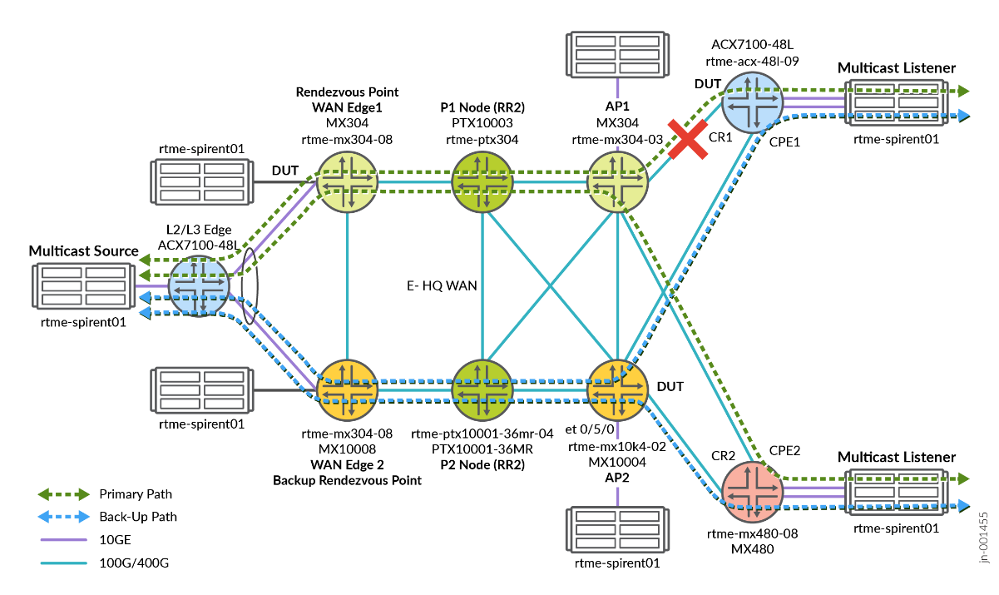

*Figure 19: Network Convergence in Finance and Stock WAN.*


### Recommendations

The MX304, MX10008, MX10004, ACX7100-48L, and MX480 platforms deliver the advanced feature

```console
set and architectural flexibility required to meet the performance, resiliency, and security demands of
enterprise finance and stock exchange networks. These platforms are optimized for low latency, deterministic forwarding, and high-throughput traffic processing, enabling them to handle the most demanding real-time financial transactions with precision and reliability. Their support for EVPN, MPLS, NG-MVPN, advanced QoS, and high-availability features such as ESI-LAG ensures seamless service continuity and sub-second failover across the network.


Juniper recommends deploying NG-MVPN for multicast traffic to meet strict requirements in Finance and stock exchange WAN networks.

This validated design, built on Junos OS Release 24.4R2, has been thoroughly verified for interoperability, scalability, and service assurance across all listed platforms. It demonstrates consistent performance in multicast market data delivery, Layer-3 VPN network segmentations, TWAMP-based latency measurement, and traffic prioritization using LLQ and strict-high QoS class, all essential elements for the stability of financial trading environments.

While this Juniper Validated Design (JVD) primarily focuses on the enterprise edge and core infrastructure, the tested technologies and deployment methodologies provide a modular foundation that can be extended to data center interconnects, private cloud fabrics, and AI-driven automation frameworks. The same design principles can be leveraged to build multi-domain, service-aware, and telemetry-enabled network architectures, ensuring that future expansions maintain consistent performance, operational visibility, and regulatory compliance across global financial networks.


```


## Revision History


### Table 3: Revision History

| Date | Version | Description |
|---|---|---|
| November 2025 | EWAN-Finance-Stock-01-01 | Initial publish |


## Sources

- Published JVD PDF: [Enterprise WAN for Finance and Stock Exchange — JVD](https://www.juniper.net/documentation/us/en/software/jvd/ewan-finance/index.html)
- Device configurations: [`../configuration/conf`](../configuration/conf)
- Solution overview: [solution-overview.md](solution-overview.md)
- Test report brief: [test-report-brief.md](test-report-brief.md)
