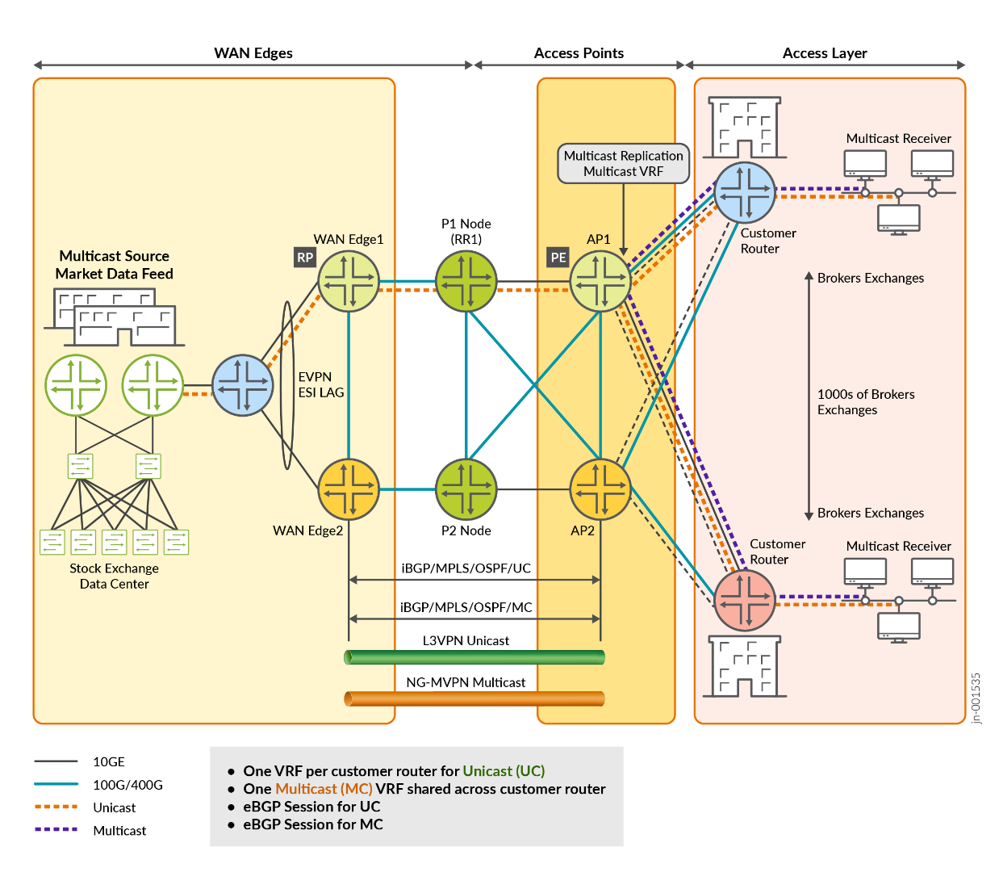

> Faithful markdown conversion of the published PDF:
> **JVD Test Report Brief: Enterprise WAN for Finance and Stock Exchange**
> (`TEST-REPORT-BRIEF-JVD-EWAN-FINANCE-01-01`). The PDF on juniper.net is the
> source of truth. Exhaustive per-case results are condensed to summaries.

# JVD Test Report Brief: Enterprise WAN for Finance & Stock Exchange

## Introduction

This JVD is designed to support latency-sensitive, deterministic, and
ultra-fast trade execution. **EVPN with L3VPN-NGMVPN** is implemented to
handle multicast at scale and meet the performance requirements of the
finance and stock-exchange WAN. IGMP and PIM manage multicast group
membership and route traffic efficiently, and strict QoS policies prioritize
multicast traffic.

Platform roles targeted by this JVD:

- **ACX7100-48L** — L2/L3 Edge Node
- **MX304, MX10008** — WAN Edge Nodes
- **PTX10003, PTX10001-36MR** — Provider (P) Nodes
- **MX304, MX10004** — Access Provider (AP) Nodes
- **ACX7100-48L, MX480** — Customer Routers (CR)

## Test Topology

*Figure 1. Network architecture of the finance and stock exchange WAN (static RP; WanEdge1 and WanEdge2 as RPs).*

### Table 1: Role and DUT Details

| Role | Helper / DUT |
|------|--------------|
| L2/L3 Edge | Helper Router |
| WANEdge1 | DUT (RP) |
| WanEdge2 | Helper Router (RP) |
| P1 | Provider Router — Helper |
| P2 | Provider Router — Helper |
| AP1 | Access Point — DUT |
| AP2 | Access Point — Helper |
| CR1 | Customer Router — DUT |
| CR2 | Customer Router — DUT |

## Platforms Tested

### Table 2: Platforms, Controllers, and Roles

| Tag | Role | Model | OS | Helper/DUT |
|-----|------|-------|----|-----------|
| R1 | L2/L3 Edge | ACX7100-48L | Junos OS Evolved 24.4R2 | Helper |
| R2 | WanEdge1 | MX304 | Junos OS 24.4R2 | DUT |
| R3 | P1 | PTX10003 | Junos OS Evolved 24.4R2 | Helper |
| R4 | AP1 | MX304 | Junos OS 24.4R2 | DUT |
| R5 | WanEdge2 | MX10004 | Junos OS 24.4R2 | Helper |
| R6 | P2 | PTX10001-36MR | Junos OS Evolved 24.4R2 | Helper |
| R7 | AP2 | MX10004 | Junos OS 24.4R2 | Helper |
| R8 | CR1 | ACX7100-48L | Junos OS Evolved 24.4R2 | DUT |
| R9 | CR2 | MX480 | Junos OS 24.4R2 | DUT |
| RT0 | TGEN | IXIA | 9.30.3001.12 | Helper |

For the full platform + software matrix, see the **Validated Platforms and
Software** section of the published JVD document.

## High-Level Features Tested

VLANs · EVPN · ESI-LAG (Active/Standby) · OSPF · iBGP · eBGP · MPLS ·
RSVP-TE · NG-MVPN (Inclusive mode) · SPT-only · PIM.

## Event Testing

Protocol and traffic convergence are validated before and after each event:

- Restart of critical Junos / Junos OS Evolved processes
- Device reboot
- Interface up / down
- Deleting configuration stanzas and evaluating node/network stability
- Clearing protocol sessions to simulate session flap

## Traffic Profiles

Validated with **10 multicast VLANs** (`MVPN_Multicast_Vlan_1..10`), each
carrying multiple streams, plus bidirectional unicast streams per CR (AF /
BE / CTRL classes). Every stream is **40.96 Mbps at 512-byte packets**
(Table 3 in the source).

## Scale and Performance Data

Validated KPIs are multi-dimensional and reflect observations in customer
networks or reasonably represent solution capabilities; they do **not**
indicate the maximum scale of individual devices. See the design guide for
the scaling table. KPIs may change without notice — refer to the latest JVD
test report for up-to-date figures.

## Known Limitations

This JVD was initially qualified on **Junos OS Release 24.4R2** (and Junos OS
Evolved Release 24.4R2). For all supported platforms and OS versions, see the
Validated Platforms and Software section in the published JVD document.

---

## Sources

- Published PDF: **JVD Test Report Brief: Enterprise WAN for Finance and Stock Exchange** (`TEST-REPORT-BRIEF-JVD-EWAN-FINANCE-01-01`), on [juniper.net Validated Designs](https://www.juniper.net/documentation/us/en/software/jvd/jvd-ewan-finance-01-01/)
- Companion docs: [`design-guide.md`](design-guide.md), [`solution-overview.md`](solution-overview.md), [`datasheet.md`](datasheet.md)
- Configs: [`../configuration/conf/`](../configuration/conf/)
