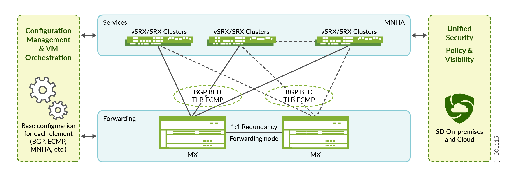

# Scale-Out Stateful Firewall and Source NAT for Enterprise — Design Guide

> Faithful markdown conversion of the published Juniper Validated Design
> **Juniper Scale-Out Stateful Firewall and Source NAT for Enterprise — JVD**
> (`jvd-mse-cgnat-offbox-ent-01-01`, published 2025-05-29). The PDF on
> juniper.net is the source of truth. Exhaustive per-device configurations are
> **linked** to [../configuration/conf](../configuration/conf) rather than
> reproduced in full; representative excerpts are included to illustrate each
> mechanism.
>
> This is the **Enterprise** framing of the shared CSDS ScaleOut architecture.
> The technical architecture, platforms, load-balancing methods, and validated
> topologies are common with the Service Provider (CGNAT) variant; the
> difference is the security service — the Enterprise variant validates
> **Stateful Firewall (SFW)** and **Source NAT (SNAT, NAPT44)**, whereas the
> Service Provider variant validates SFW and Carrier-Grade NAT (CGNAT).

## Table of Contents

- [About this Document](#about-this-document)
- [Solution Benefits](#solution-benefits)
- [Reference Architecture](#reference-architecture)
- [Topologies Tested](#topologies-tested)
- [Validation Framework](#validation-framework)
- [Event Testing](#event-testing)
- [Solution Details](#solution-details)
- [Results Summary and Analysis](#results-summary-and-analysis)
- [Recommendations](#recommendations)
- [Sources](#sources)

## About this Document

This document covers the Juniper Scale-Out Security Services Solution, delivering
a scalable solution for security services that scales on your business needs to
enable security at high speed and high rate without using a large chassis. This
solution can scale from small virtual to large security performance and scaling
needs.

### Table 1: Solution Platforms Summary

| Solution | Forwarding Layer | Service Layer |
|---|---|---|
| Scale-Out Stateful Firewall and Source NAT for Enterprise | MX304 Universal Router (load balancer) | SRX4600, vSRX |

## Solution Benefits

The Juniper Scale-Out Security Services Solution is based on a scalable,
distributed security architecture and design that fully decouples the forwarding
and security services layers. This approach enables an existing Juniper MX Series
Router to act as an intelligent forwarding engine and load balancer with path
redundancy capability. It leverages existing and future SRX Series Firewalls in
standalone or high-availability pairs to extend more capacity and resiliency.


*Figure 1. Juniper Scale-Out general architecture.*

Automation and management for the provisioning and configuration of each element
is possible but not described in this JVD — Junos OS configuration for MX Series
Routers and SRX Series Firewalls is well known for its automation possibilities
(from simple copy/paste to Ansible with Jinja2 templates), and none is imposed
here. Central management with Security Director Cloud or Security Director
on-premises is proposed for managing common security policies and objects on the
SRX/vSRX Series Firewalls, but is not required for using the Scale-Out solution.

### Use Cases

This JVD describes the following Enterprise use cases:

- **Stateful Firewall (SFW)**
- **Stateful Firewall (SFW) and Source NAT (SNAT)**

> **Note:** Both SFW and SNAT are often used together on enterprise Internet
> access.

## Reference Architecture

This JVD covers a combination of network architectures where MX Series Routers
and SRX Series Firewalls are connected in either single or double configurations.
It uses network redundancy mechanisms to provide flow resiliency between the MX
Series Router forwarding layer and the SRX Series Firewall services layer (MNHA,
also called L3 cluster, is explained later). When configuring dual MX Series
Routers with ECMP, a Service Redundancy Daemon (SRD) monitors the failure events
that trigger a failover to the second MX Series Router — this is not needed with
Traffic Load Balancer (TLB). BFD is used to capture a failover mechanism from the
routing point of view when any other failure occurs. SRX MNHA synchronizes
stateful sessions between the two nodes so existing traffic can continue
uninterrupted.


*Figure 2. Validated topologies — the four common CSDS ScaleOut architectures,
combining single or dual MX Series Routers with standalone or MNHA SRX Series
Firewalls, each on a particular load-balancing mechanism (ECMP or TLB).*

There are trade-offs with each architectural choice regarding complexity, high
availability, feature parity, and backward compatibility with earlier Junos OS
releases. In general, complexity increases as more redundancy is added. There are
dependencies on which load-balancing method is used on the MX Series Routers
(ECMP Consistent Hashing or TLB):

- **ECMP CHASH** is simpler to use as it is only routing based; however, it is
  limited in failover capabilities.
- **TLB** is more focused on the services to load balance, offers more redundancy
  capabilities, and can be multiplied with different local groups. It is useful
  when combining different use cases within the same architecture.

### Table 2: Validated Features Combination

| Load-Balancing Method | Junos OS for MX | Number of MX | Security Features | SRX Standalone | SRXs MNHA Cluster |
|---|---|---|---|---|---|
| ECMP with Consistent Hashing | 23.4R2 | Single MX | SFW / SNAT | Yes | No |
| ECMP with Consistent Hashing | 23.4R2 | Dual MX (SRD) | SFW / SNAT | No | Yes |
| Traffic Load Balancer (TLB) with Health Checking | 23.4R2 | Single MX | SFW / SNAT | Yes | Yes |
| Traffic Load Balancer (TLB) with Health Checking | 23.4R2 | Dual MX | SFW / SNAT | Yes | Yes |

> **Note:** The Scale-Out solution uses only standard mechanisms and protocols
> between components — no proprietary protocols. The exception is how load
> balancing is implemented internally (how the MX Series Router handles and
> distributes sessions).

The following networking features are deployed and validated in this JVD:

- Dynamic routing using BGP; dynamic fault detection using BFD
- Load balancing of sessions across multiple SRX Series Firewalls (standalone or HA)
- Load balancing using ECMP Consistent Hashing (CHASH, first appeared in Junos OS Release 13.3R3)
- Load balancing using Traffic Load Balancer on the MX Series Router (TLB, first appeared in Junos OS Release 16.1R6)
- MX Series Router redundancy using SRD between two MX Series Routers with ECMP CHASH
- MX Series Router redundancy using BGP dynamic routing between two MX Series Routers with TLB
- SRX Series Firewalls redundancy using Multi-Node High Availability (MNHA) as Active or Backup with session synchronization
- Dual-stack solution with IPv4 and IPv6
- Stateful Firewall (SFW) validated with simple long-protocol sessions (HTTP, UDP). Applications and Advanced Security features (App ID, IDP, URL filtering and other Layer 7 features) are not used as part of this JVD.
- Source NAT (SNAT) using **NAPT44**

Platforms per JVD: Routing/Load Balancer **MX304** (Junos OS Release 23.4R2);
Security Services **vSRX and SRX4600** (Junos OS Release 23.4R2).

### vSRX Setup and Sizing

This JVD focuses only on the functional aspect of the solution; a powerful server
is not required for hosting the vSRX(s), and vSRX size is not material to the JVD
results. For real-time performance, high-end servers (Dell or HPE with Intel Gold
or AMD 9K CPUs, 256 GB RAM, and ConnectX-6/7 or later interfaces) with large vSRX
sizing (16 vCPU, 32 GB RAM) are proposed.

## Topologies Tested

The topologies tested with MX Series Routers and SRX Series Firewalls combinations
are as follows. The first topology uses three SRX Series Firewalls; the others
double them to three pairs of firewalls.

### Topology 1 — ECMP CHASH — Single MX with Standalone SRXs

This topology is simple and least redundant. Resiliency is provided at the MX
Series Router (redundant RE, PSU, etc.); however, there is no protection against
MX-node failure. There is no backup of the MX Series Router and no session
synchronization between the SRX Series Firewalls. Typical when application
sessions are short-lived and redundancy is handled at the application level.

- **Pros:** Simplicity; scaling with each individual SRX Series Firewall.
- **Cons:** No redundancy.

### Topology 2 — ECMP CHASH — Dual MX with MNHA SRX Pairs

This topology offers redundancy for the MX Series Routers and for each SRX Series
Firewall. The dual MX Series Router uses an SRD mechanism to monitor the physical
elements of the network and/or the MX Series Router itself, and any routing or
system event that may trigger a failover to the other MX Series Router. On the SRX
side, MNHA allows both firewalls to handle and synchronize sessions. This topology
uses SRG0 (active/active); session synchronization ensures the redundant firewall
assumes the sessions previously processed by the other firewall while maintaining
session state.

- **Pros:** Simple redundancy and scaling with each SRX Series Firewall pair.
- **Cons:** Half of the architecture is active at a time.

### Topology 3 — TLB — Single MX with MNHA SRX Pairs

This topology offers redundancy for the SRX Series Firewalls but not for the MX
Series Router (which may still have a second RE installed). MNHA offers session
synchronization within a cluster and helps with any failure scenario.

- **Pros:** Redundancy and scaling with each SRX Series Firewall pair.
- **Cons:** No router redundancy (except using dual RE).

### Topology 4 — TLB — Dual MX with MNHA SRX Pairs

This topology offers redundancy for both the MX Series Routers and SRX Series
Firewalls and takes advantage of having all components used at the same time. Any
failover scenario can be covered. Each SRX Series Firewall is connected to both MX
Series Routers; if a node fails within a cluster, all other SRX pairs can fail
over independently.

- **Pros:** Full redundancy and scaling for MX Series Routers and SRX pairs.
- **Cons:** More interfaces used on the MX Series Router (if directly connected);
  an optional distribution layer can cover more connectivity needs as SRX count
  grows.



*Figure 3. ScaleOut Enterprise Stateful Firewall and Source NAT general
architecture.*

## Validation Framework

### Test Objectives

The test objective is to validate the Scale-Out architecture across the four main
topologies (single or dual MX Series Router with multiple SRX Series Firewalls)
and demonstrate the ability to respond to various use cases while scaling. The two
main load-balancing methods (ECMP CHASH and TLB) are exercised with high
availability of the various components.

### Test Bed Topology

The design follows the four topologies. A minimum of one MX Series Router is
required to test load balancing and standalone SRXs; two MX Series Routers provide
routing redundancy, and SRX Series Firewalls of the same model in MNHA pairs allow
testing of session synchronization and traffic resiliency. Aggregate interfaces
(ae) provide dual attachment of each SRX to the MX Series Router; in the dual-MX
ECMP topology, a virtual link on a specific VLAN carries SRX session
synchronization across the aggregate interfaces. A gateway router brings traffic
to/from the clients and Internet.

### Tested Optics

- **QSFP-100GBASE-SR4** — between MX304 and SRX4600s
- **QSFP28-100G-AOC-3M** — between MX304 and servers hosting vSRXs

The technical validation extends to all hardware-compatible optics; see the
Juniper Hardware Compatibility Tool for SRX4600, MX304, and MX10004.

### Test Goals

Performance and scaling are tested with the goal of showing linearity when adding
SRX Series Firewalls (standalone or MNHA pair). An initial test uses a single SRX
pair to a maximum traffic combination; a second SRX pair is added to demonstrate
that it adds the same capacity. Linearity is inherent because the MX Series Router
is agnostic to the number of sessions — while total traffic stays within MX-PE
throughput limits, each new MNHA pair adds a similar amount of performance to the
scale-out complex.

### Test Non-Goals

Maximum capacity of each SRX Series Firewall or of the full solution is not tested.
As a theoretical illustration from the source: MX304 forwarding capacity is
**3.2 Tbps** with redundant REs or **4.8 Tbps** with a single RE. For a 200 Gbps
per-SRX example, 3.2 Tbps / 200 Gbps ≈ 16 SRX (two line cards) or 4.8 Tbps ≈ 24
SRX (three line cards). Counting available ports (no distribution layer), an MX304
with two line cards (16 × 100GE each) yields ~66 SRX ports, or ~100 SRX ports with
three line cards — all within theoretical limits. There is no preferred hypervisor
specification or vSRX size for feature testing. Automation is used to build and
test the solution but is not documented here.

## Event Testing

Individual failure, failover, and switchover events are exercised across the four
topologies, checking for minimal disturbance to steady traffic.

**SRX Series Firewall failure events:** MX-to-SRX link failures; SRX reboot; SRX
power off; complete MNHA pair power off.

**MX Series Router failure events:** reboot; restart routing process; restart
traffic-dird daemon; restart Network-monitor daemon; restart sdk-process; GRES;
ECMP/TLB next-hop addition/deletion (adding or deleting a scale-out SRX MNHA
pair); SRD-based CLI switchover between MX Series Routers (ECMP).

Traffic recovery is validated after all failure scenarios. UDP traffic generated
using IxNetwork for all failure-related test cases is used to measure failover
convergence time.

### Tested Traffic Profiles

The tested traffic profile is composed of multiple simultaneous flows, applied per
standalone SRX Series Firewall or per SRX MNHA pair (in Active or Backup mode).

#### Table 3: Tested Traffic Profiles

| CPS / MNHA Pair | Throughput / MNHA Pair | Traffic Type | File Size |
|---|---|---|---|
| N/A | 100 Gbps | TCP | 4 k |
| N/A | 100 Gbps | UDP | IMIX |
| 100 K | N/A | TCP | 1 byte |

Packet size uses an Internet mix with an average packet size of ~700 bytes.
Packet size : weight distribution — 64:8, 127:36, 255:11, 511:4, 1024:2, 1518:39.

## Solution Details

### Traffic Path in the SFW Scale-Out Solution

The Scale-Out solution uses BGP as the dynamic routing protocol so all MX Series
Routers and SRX Series Firewalls learn their surrounding networks and, most
importantly, exchange path information for traffic sent from the MX Series Router
across each SRX Series Firewall to the next MX Series Router. Each SRX announces
the routes it learned from the other side with the same network cost, so the load
balancer can distribute across each SRX.

The MX Series Router on the left uses the **TRUST-VR** routing instance to forward
traffic to each SRX; the MX Series Router on the right uses the symmetric
**UNTRUST-VR** to receive traffic from each SRX and forward it toward the target
resources. Each MX Series Router has its own BGP Autonomous System (AS) and peers
with the SRX Series Firewalls on both sides (TRUST and UNTRUST) and with any
gateway router bringing client/server connectivity. Because the routes across
each SRX have equal cost, the load-balancing method distributes flows across them.

For the **SNAT** use case the path is similar to SFW, except the unique NAT pools
are advertised on the right (UNTRUST) MX Series Router so return traffic flows back
to the correct SRX Series Firewall that anchors the session.

### Introduction to SRX Series Firewall Multi-Node High Availability (MNHA)

MNHA addresses high-availability requirements: both the control plane and the data
plane of the participating nodes are active at the same time, providing
inter-chassis resiliency. Nodes may be co-located or geographically separated.
Nodes communicate status over an Inter-Chassis Link (ICL, direct or routed) and
synchronize sessions; they do not share a common configuration (commit-sync keeps
shared elements consistent). MNHA uses one or more Services Redundancy Groups
(SRGs); **SRG0** is always active on both nodes (used natively by scale-out to load
balance across both SRX at once), while **SRG1+** supports Active/Backup with
health checking (SRG2 can add routing information such as BGP AS-path-prepend).

MNHA network modes:

- **Default Gateway / L2 mode** — same L2 segment on each side; both SRX share a
  common IP/MAC per segment.
- **Hybrid mode** — L2 (broadcast domain) + IP on one side, routing on the other.
- **Routing / L3 mode** — used by this JVD: each side uses a different IP address,
  with no common IP subnet even between the SRX nodes; all communication is via
  routing. Ideal for scale-out communication using BGP with the MX Series Router.

### ECMP Consistent Hashing (CHASH) Load Balancing

ECMP allows traffic of the same flow to transmit across multiple equal-cost paths.
To maintain symmetry with stateful security devices, traffic from a subscriber
must always traverse the same SRX in both directions. A subscriber is identified
by source IP in the upstream direction (client to server) and by destination IP
in the downstream direction. MX Series Routers perform symmetric hashing so a
given (sip, dip) tuple hashes the same regardless of direction; the design hashes
only the source IP in one direction and only the destination IP in the reverse.

By default, when a path fails the hashing algorithm recalculates the next hop for
all paths, redistributing all flows. **Consistent load balancing** overrides this
so only flows on inactive links are redistributed — existing active flows remain
undisturbed. Adding a new SRX gracefully moves an equal proportion of flows from
each existing node to the new one (e.g., adding a fifth SRX to four active SRXs
moves ~5% from each existing node, ~20% total). This applies where members of an
ECMP group are external single-hop BGP neighbors.

Representative MX source/destination-hash forwarding-table policy:

```junos
policy-options {
    prefix-list clients_v4 { 192.0.2.0/25; }               /* clients subnet(s) */
    policy-statement pfe_lb_hash {
        term source_hash {
            from { route-filter 0.0.0.0/0 exact; }
            then { load-balance source-ip-only; accept; }   /* 0/0 -> LB per source-ip */
        }
        term dest_hash {
            from { prefix-list-filter clients_v4 exact; }
            then { load-balance destination-ip-only; accept; } /* clients -> LB per dest-ip */
        }
        term ALL-ELSE { then { load-balance per-packet; accept; } }
    }
}
routing-options { forwarding-table { export pfe_lb_hash; } }
```

Representative consistent-hash BGP import policies (applied to the SRX groups):

```junos
policy-options {
    policy-statement pfe_consistent_hash {
        from { route-filter 0.0.0.0/0 exact; }
        then { load-balance consistent-hash; accept; }
    }
    policy-statement pfe_sfw_return_consistent_hash {
        from { prefix-list-filter clients_v4 exact; }
        then { load-balance consistent-hash; accept; }
    }
}
```

For the **SFW** use case, all SRX advertise the default route (0/0) on TRUST and
the client prefix on UNTRUST, both with equal cost; forward flows hash on source
IP, return flows hash on destination IP, preserving the five-tuple and therefore
symmetry. For the **SNAT** use case each SRX is allocated a **unique NAT pool
range** and advertises it on the UNTRUST side, so return traffic follows the
unique NAT-pool route back to the SRX that anchors the flow.

### ECMP CHASH — Dual MX with SRD (Topology 2)

The dual MX pair is configured with SRD redundancy. SRD monitors the links toward
the TRUST/Internet gateway and the MX-to-SRX links; if any fails (or the primary
MX goes down), SRD triggers an automatic switchover to the second MX Series Router.
MX304-1 remains the primary ECMP path and MX304-2 the standby; SRD installs a
signal route on the master, which advertises routes normally while the standby
advertises with AS-path-prepend. Symmetric interface numbering across both MX
routers keeps unilist next-hop ordering identical, so hashing is unaffected after
a switchover. The MX-to-SRX links use a 4 × 100GE AE bundle carrying three VLANs
(TRUST, UNTRUST, and HA management).

### Traffic Load Balancer (TLB)

TLB provides stateless load balancing as an inline PFE service on the MX Series
Router — no per-connection state is created, so there are no scaling limitations
and throughput can approach line rate. For the scale-out solution, the
non-translated **Direct Server Return (L3)** mode is used. The RE health-checks
each SRX (ICMP by default; also HTTP, UDP, TCP) and programs a selector table in
the PFE with a composite next hop of all available SRXs. Filter-based forwarding
pushes client-to-server traffic to the TLB instance (source/destination hash);
server-to-client is routed directly back to the client. On MX304/MX10000, TLB runs
in **routing-engine-mode**.

For the **SNAT** use case (the main difference from SFW), each scaled-out SRX must
have a unique NAT pool range advertised toward the MX UNTRUST direction, so the
unique NAT-pool route returns traffic to the same SRX that anchors the flow.

### Source NAT (SNAT / NAPT44) on the SRX

Each SRX Series Firewall (or MNHA pair) is allocated a unique source NAT pool in
RFC 6598 CGN space (`100.64.0.0/10`) — e.g. `100.64.1.0/24` for SRX1/pair-1,
`100.64.2.0/24` for SRX2/pair-2, and so on. The pool uses **address-pooling
paired**, and the SRX installs a discard route for its pool and advertises it via
eBGP on the UNTRUST side so return traffic is steered back correctly.

Representative SRX source-NAT and security-policy excerpt:

```junos
nat {
    source {
        pool vsrx1_nat_pool {
            address { 100.64.1.0/24; }        /* unique NAT pool per SRX / MNHA pair */
            address-pooling paired;
        }
        rule-set vsrx1_nat_rule-set {
            from zone trust;
            to zone untrust;
            rule vsrx1_nat_rule1 {
                match { source-address 192.0.2.0/25; destination-address 0.0.0.0/0; application any; }
                then { source-nat { pool { vsrx1_nat_pool; } } }
            }
        }
    }
}
policies {
    from-zone trust to-zone untrust {
        policy t2u-permit {
            match { source-address any; destination-address any; application any; }
            then { permit; log { session-close; } }
        }
    }
    default-policy { deny-all; }
}
```

Representative SRX eBGP export (announces 0/0 on TRUST; clients + NAT pool on
UNTRUST):

```junos
policy-options {
    policy-statement trust_export_policy {
        term 1 { from { protocol bgp; route-filter 0.0.0.0/0 exact; } then { next-hop self; accept; } }
        term 2 { then reject; }
    }
    policy-statement untrust_export_policy {
        term 1 { from { protocol bgp; route-filter 192.0.2.0/25 orlonger; } then accept; }
        term 2 { from { protocol static; route-filter 100.64.1.0/24 orlonger; } then accept; }
        term 3 { then reject; }
    }
}
```

BGP peering between the MX Series Router and each SRX uses BFD with
`minimum-interval 300`, `minimum-receive-interval 300`, `multiplier 3`.

> **Note:** These configurations also apply to IPv6.

The excerpts above are illustrative. The complete, per-device configurations for
this JVD (MX304 load balancer, the SRX4600 cluster nodes, and the gateway
emulator) are in [../configuration/conf](../configuration/conf):
[mx1_mx304.conf](../configuration/conf/mx1_mx304.conf),
[srx1a_srx4600.conf](../configuration/conf/srx1a_srx4600.conf),
[srx1b_srx4600.conf](../configuration/conf/srx1b_srx4600.conf),
[srx2a_srx4600.conf](../configuration/conf/srx2a_srx4600.conf),
[srx2b_srx4600.conf](../configuration/conf/srx2b_srx4600.conf), and
[gateway_emulator.conf](../configuration/conf/gateway_emulator.conf) — see
[../README.md](../README.md) for the device/config map.

## Results Summary and Analysis

The JVD shows that scale-out leverages both the MX Series Routers (as a load
balancer with ECMP CHASH and TLB) and the SRX Series Firewalls (as a security
service — Stateful Firewall and Source NAT). Both physical (SRX4600) and virtual
(vSRX) firewalls are used the same way. Simple BGP + BFD integration aids fast
convergence, and adding a new service node is simple and does not disturb the
global service.

- **ECMP CHASH** shows steady restoration times in milliseconds. With ECMP, all
  SRX Series Firewalls must be the same model.
- **TLB** does not require identical devices (e.g. some SRX in an SFW group and
  others in a SNAT group), works with fast restoration timers, and offers more
  deployment flexibility (single or dual MX) and better handling of SRX in MNHA
  clusters. The number of groups is around **2,000 per MX Series Router** and the
  number of SRX members is around **256**.

Layer 7 security features were not exercised, but the even, non-disruptive
distribution across multiple SRXs shows they could easily be added. The scale-out
solution is positioned as an alternative to the monolithic scale-up approach
(chassis SRX or MX-SPC3 service cards on MX240/480/960), and the two can be
combined. Smaller platforms such as the MX304 and SRX4700 enable smaller-footprint
architectures.

## Recommendations

Reference material cited by the JVD: Service Redundancy Daemon (SRD); Equal-Cost
Multipath (ECMP); Load Balancing Using Source or Destination IP Only; ECMP
Consistent Hashing; Traffic Load Balancer (TLB); Junos Symmetrical Load Balancing;
Multi-Node High Availability; Connected Security Distributed Services (CSDS); and
Juniper automation communities — see the published JVD for the full labeled link
list.

## Sources

- Published JVD: *Juniper Scale-Out Stateful Firewall and Source NAT for
  Enterprise — JVD* (`jvd-mse-cgnat-offbox-ent-01-01`, published 2025-05-29),
  juniper.net validated designs.
- Companion docs in this folder:
  [solution-overview-enterprise.md](solution-overview-enterprise.md),
  [test-report-brief-enterprise.md](test-report-brief-enterprise.md),
  [datasheet.md](datasheet.md).
- Service Provider (CGNAT) framing:
  [design-guide-service-provider.md](design-guide-service-provider.md).
- Configurations: [../configuration/conf](../configuration/conf).
- Connected Security Distributed Services (CSDS) deployment guide, juniper.net.
