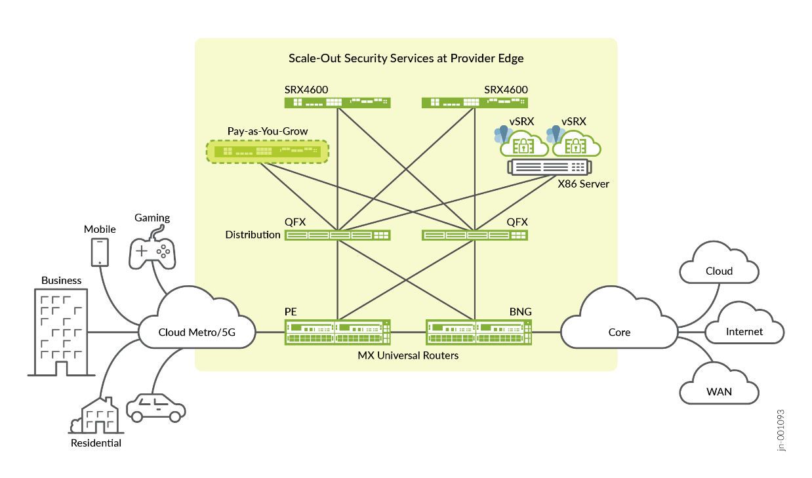

# Scale-Out Stateful Firewall and CGNAT for SP Edge — Design Guide

> Faithful markdown conversion of the published Juniper Validated Design
> **Juniper Scale-Out Stateful Firewall and CGNAT for SP Edge — JVD**
> (`jvd-offbox-cgnat-01-01-sp`, published 2025-05-29). The PDF on juniper.net
> is the source of truth. Exhaustive per-device configurations are **linked** to
> [../configuration/conf](../configuration/conf) rather than reproduced in full;
> representative excerpts are included to illustrate each mechanism.
>
> This is the **Service Provider (CGNAT)** framing of the shared CSDS ScaleOut
> architecture. The technical architecture, platforms, load-balancing methods,
> and validated topologies are common with the Enterprise (Source NAT) variant;
> the two differ mainly in the NAT service (CGNAT/NAPT44 here vs enterprise
> source NAT) and the network segment they front (SP multiservice / broadband
> edge vs enterprise edge).

## Table of Contents

- [About this Document](#about-this-document)
- [Solution Benefits](#solution-benefits)
- [Use Case and Reference Architecture](#use-case-and-reference-architecture)
- [Validation Framework](#validation-framework)
- [Test Objectives](#test-objectives)
- [Solution Architecture](#solution-architecture)
- [Results Summary and Analysis](#results-summary-and-analysis)
- [Recommendations](#recommendations)
- [Documentation](#documentation)
- [Sources](#sources)

## About this Document

This document explains a Juniper Validated Design (JVD) for the Scale-Out Security
Services solution, which you can deploy at the **SP multiservice edge WAN or metro
networks**. It validates the network services complex consisting of MX universal
services routers coupled with Juniper SRX/vSRX Series Firewalls delivering
Carrier-Grade NAT (CGNAT) and stateful firewall (SFW) functions in a variety of
deployment scenarios.

### Table 1: Solution Platforms Summary

| Solution | Forwarding Layer | Service Layer |
|---|---|---|
| Scale-Out Security Services for SP MSE | MX304 Universal Edge Router | SRX4600, vSRX |

## Solution Benefits

The Juniper Scale-Out Security Services solution is a common security services
complex featuring a **Stateful Firewall (SFW)** and **Carrier-Grade Network Address
Translation (CGNAT)** for use in fixed and wireless **Multiservice Edge (MSE)** and
**Broadband Edge (BBE)** deployments for Service Providers and MSOs. The security
complex leverages the scale-out network architecture and automation with tight
integration between routing and security services elements, represented by MX
universal routers and SRX Series Firewalls. This provides the best routing and
security stacks for optimal performance and total cost of ownership. The scale-out
approach offers advantages over scale-up and integrates security engines directly
into the routing nodes, including:

- Highly scalable CGNAT/SFW systems with respect to number of traffic flows and
  IPv4/IPv6 prefixes
- Pay-as-you-grow approach
- Flexibility to handle unpredictable traffic growth
- High availability with sub-second restoration for stateful traffic flows
- Optimal operational preferences for a choice of physical or virtual nodes
- Improved time to market for security services on new platforms
- Flexible placement of security services in the network



*Figure 1. Juniper Scale-Out general architecture — SP stateful firewall + CGNAT.*

This solution is equally applicable to greenfield deployments or as a nested
solution on top of existing MX Series routers in the centralized or distributed
multiservice edge segment of SP networks, allowing flexibility in placement of
services across SP WAN infrastructure. In general the solution includes three
layers — forwarding, security services, and management/control — but this JVD
focuses on the first two:

### Security Services Layer

- CGNAT
- Stateful firewall
- High availability function

### Forwarding Layer

- PE forwarding plane with virtual routing instances ("external" and "internal")
- Load balancing between multiple nodes of the service layer
- High availability function
- May optionally include a distribution forwarding layer

## Use Case and Reference Architecture

The Juniper Off-Box Security Services architecture includes two main functional
blocks: the security services device (a standalone vSRX VNF or SRX4600, or a
redundant pair of the same device), and the MX Series routers as load-balancer
routers providing 100G or 400G interfaces to the servers hosting vSRXs or the
SRX4600s. Both access-side and Internet-side peering are enabled through dedicated
MX Series router ports for high throughput.


*Figure 2. Scale-out solution functional blocks.*

With the Trio 6 MX10004/10008 systems, capacity per slot is up to 9.6 Tbps; with
the compact MX304, up to 4.8 Tbps per system. An MX304 can provide up to 48 × 100G
interfaces; an LC9600 line card in a modular MX10000 up to 96 × 100G ports. To
optimize port usage, an intermediate distribution layer with two (or more)
QFX-series switches can aggregate multiple SRX/vSRX nodes into bundled 400GE links.
vSRX runs as a VNF on KVM or VMware (up to 32 cores, 64 GB memory; virtio or SR-IOV
with smart NICs such as Mellanox ConnectX-6).

For this JVD, an external BGP (eBGP) protocol with BFD provides routing and control
between the network elements while implementing load balancing with two approaches:

- Equal-Cost Multipath (ECMP) load balancing with Consistent Hashing (CHASH)
- RE-based Traffic Load Balancer (TLB) function on the MX Series router

Two routing instances — **Access and Internet** — are used on the MX Series router
to peer with the corresponding network segments of the SP network infrastructure
and the security node. eBGP enables scalable, flexible exchange of routing
information for the access-side and Internet-side routing. Failure detection is
based on BFD with timers as low as 100 ms, enabling fast reconvergence and
automatic adjustment of ECMP load balancing.

> To maintain a higher level of security in future applications like a Managed
> Enterprise Firewall service — where injection of your routes into the security
> layer is not preferred — **static routes with BFD protection** are the preferred
> control and traffic-distribution method.

The access-side traffic is load balanced between service nodes dynamically based on
ECMP with source IPv4/IPv6 CHASH. For CGNAT and SFW on the Internet side, eBGP
routing and BFD failure detection are required, with destination-based IPv4/IPv6
ECMP consistent hashing on the return path. ECMP with CHASH limits the impact
(blast radius) on existing flows when a service node fails or is added — only
affected flows are rehashed and rebalanced. This lets the complex scale to tens of
service nodes, while eBGP on the MX scales beyond Internet tables to millions of
routes.


*Figure 3. Validated topologies (the four common CSDS ScaleOut architectures).*

### Solution Deployment Scenarios

Following the suggested architecture, four deployment scenarios are validated,
combining standalone/dual MX with standalone/MNHA SRX pairs, each on a particular
load-balancing mechanism (ECMP or TLB). On dual MX with ECMP, a Service Redundancy
Daemon (SRD) monitors failure events to trigger a failover to the second MX (this
is not required with TLB). BFD provides a quicker routing failover. When SRX MNHA
provides session synchronization, existing traffic and sessions continue
uninterrupted through a failover.

- **ECMP CHASH** is simple to use and leverages standard protocols and the
  well-known ECMP mechanism — a preferable option for some SP or enterprise
  operations departments, though limited in failover capabilities.
- **TLB** provides services-level load balancing, offers better redundancy, and
  can be multiplied with different local groups — useful when combining different
  use cases on the same architecture, though it may not be backward compatible
  with older Junos OS releases.

### Table 2: Validated Features Combination

| Load-Balancing Method | Junos OS for MX | Number of MX Routers | Security Features | SRX in MNHA Cluster | SRX Standalone |
|---|---|---|---|---|---|
| ECMP with CHASH | 23.4R2 | Single MX | SFW/CGNAT | No | Yes |
| ECMP with CHASH | 23.4R2 | Dual MX (SRD) | SFW/CGNAT | Yes | No |
| Traffic Load Balancer (TLB) | 23.4R2 | Single MX | SFW/CGNAT | Yes | Yes |
| Traffic Load Balancer (TLB) | 23.4R2 | Dual MX with Health Checking | SFW/CGNAT | Yes | Yes |

The scale-out solution uses only standard mechanisms and protocols between the
components; the exception is how load balancing is implemented internally on the MX
Series router. From a networking point of view this solution uses standard
protocols.

#### Deployment Scenario 1 — ECMP CHASH — Single MX with Scaled-Out Standalone SRXs

Simplest and least redundant. Resiliency is provided at the MX (redundant RE, PSU,
etc.), but there is no protection against MX-node failure. Service-node failure is
handled by redistributing flows between the remaining nodes; without session
synchronization between the SRXs, affected flows have a longer restoration time.
**Pros:** simplicity, per-node scaling. **Cons:** no redundancy.

#### Deployment Scenario 2 — ECMP CHASH — Dual MX with Scaled-Out MNHA SRX Pairs

Redundancy at both the MX (redundant pair using SRD to monitor physical, routing,
and system events) and each SRX MNHA pair. On a failure detected by the active MX,
the second MX takes over and all traffic is redirected to it (and to the SRX
connected to that MX, which becomes master of its MNHA pair). MNHA session
synchronization (SRG0 cluster mode) lets either node process existing and new
sessions. **Pros:** simple redundancy and scaling. **Cons:** half the architecture
is active at a time.

#### Deployment Scenario 3 — TLB — Single MX with Scaled-Out MNHA SRX Pairs

Redundancy for the SRX Series Firewalls (MNHA pairs) but not for the MX Series
router (which may use a second RE rather than two chassis). MNHA provides session
synchronization within a cluster. **Pros:** SRX redundancy and scaling. **Cons:**
no router redundancy (except dual RE).

#### Deployment Scenario 4 — TLB — Dual MX with Scaled-Out MNHA SRX Pairs

The most redundant topology for both MX and SRX, using all components at once. MX
routers handle traffic on either router; SRX pairs can run Active/Backup or
Active/Active, augmenting capacity during normal operation. Each SRX connects to
both MX routers, and MNHA pairs can fail over independently. **Pros:** full
redundancy and scaling. **Cons:** more MX interfaces used when directly connected
(an optional distribution layer can cover growing connectivity needs).

## Validation Framework

Two physical topologies are leveraged — standalone and redundant — able to address
all four deployment scenarios. Key elements include a consistent network IP-address
scheme and BGP peering between the MX routers, the external gateway (if any), and
each SRX/vSRX.

### Supported Platforms

To review the software versions and platforms validated by Juniper for this JVD,
see the Validated Platforms and Software section of the published document.
Routing/Load-Balancer role: **MX304** (Junos OS Release 23.4R2). Security-services
role: **SRX4600 and vSRX** (Junos OS Release 23.4R2).

### Tested Optics

- QSFP-100GBASE-SR4: between MX304 and SRX4600s
- QSFP28-100G-AOC-3M: between MX304 and servers hosting vSRXs

Validation extends to all hardware-compatible optics (see the Juniper Hardware
Compatibility Tool for SRX4600, MX304, and MX10004).

### vSRX Setup and Sizing

This JVD focuses on the functional aspect of the solution; server power and vSRX
size are not material to the tested features. For real-world performance, high-end
servers (e.g. Intel Gold or AMD 9K CPUs, 256 GB RAM, ConnectX-6/X7 or later NICs)
with large vSRX sizes (16 vCPU, 32 GB RAM) are proposed.

## Test Objectives

The objective is to validate the scale-out architecture across topologies
(single/dual MX and multiple SRX) using the two main load-balancing methods (ECMP
CHASH and TLB) with high availability, and to demonstrate linear performance and
logical (stateful-flow) scale growth as SRX/vSRX nodes are added. The JVD validates
system behavior under administrative events with a general expectation of no or
little traffic effect:

- Adding a new SRX redistributes traffic evenly with no disruption to other flows.
- Removing an SRX redistributes only the flows associated with that node.
- SRX MNHA failover and return cause no disruption and preserve sessions.
- MX failover (dual MX) causes no disruption.

### Validated Networking Features

- Dynamic routing using BGP; dynamic fault detection using BFD
- Load balancing of sessions across multiple SRX (standalone or HA)
- ECMP CHASH (first appeared in Junos OS Release 13.3R3)
- TLB on the MX Series router (first appeared in Junos OS Release 16.1R6)
- MX redundancy using SRD between two MX routers with ECMP CHASH
- MX redundancy using BGP dynamic routing between two MX routers with TLB
- SRX redundancy using MNHA as Active/Backup with session synchronization
- Dual-stack IPv4 and IPv6
- SFW validated with simple long-lived protocol sessions (HTTP, UDP)
- **CGNAT using NAPT44**

### Test Non-Goals

Maximum scale/performance of individual elements; automated vSRX onboarding;
Security Director; Layer-7 advanced security (AppID, IDP, URL filtering); and the
NAT variants **NAT64, DetNAT, PBA, and DS-Lite** (out of scope for this JVD, which
validates NAPT44). Filter-based-forwarding load balancing is also out of scope.
Automation is used to build and test the solution but is not itself a validation
target.

### Tested Failure Events

**SRX failure events:** MX-to-SRX link failures; SRX reboot; SRX power off;
complete MNHA pair power off. **MX failure events:** reboot MX; restart routing
process; restart the TLB processes (traffic-dird, sdk-process, netmon daemon);
GRES; ECMP/TLB next-hop addition/deletion (adding/removing a scale-out SRX MNHA
pair); SRD-based CLI switchover between MX routers (ECMP). Traffic recovery is
validated after every failure scenario. UDP traffic generated with IxNetwork
measures failover convergence.

### Tested Traffic Profiles

Profiles comprise multiple simultaneous flows for a standalone SRX or an MNHA pair
in Active/Backup mode.

### Table 3: Tested Traffic Profiles per SRX Series Firewall Pair

| CPS / MNHA-Pair | Throughput / MNHA-Pair | Traffic Type | File Size |
|---|---|---|---|
| N/A | 100 Gbps | TCP | 4k |
| N/A | 100 Gbps | UDP | IMIX |
| 100K | N/A | TCP | 1 byte |

Packet size uses an Internet mix with a ~700-byte average — Packet Size:Weight
distribution 64:8, 127:36, 255:11, 511:4, 1024:2, 1518:39.

> **Test Bed Configuration.** Contact your Juniper representative to obtain the full
> archive of the test-bed configuration used for this JVD. The per-device configs
> for this repo (MX304 load balancer, SRX4600 cluster nodes, and the gateway
> emulator) are in [../configuration/conf](../configuration/conf).

## Solution Architecture

### Traffic Path in the SFW and CGNAT Scale-Out Solution

The scale-out solution uses BGP so all MX routers and SRX firewalls learn their
surrounding networks and — most importantly — exchange path information for traffic
that must flow from the MX across each SRX to the next MX. Each SRX announces the
routes it learned from the other side with the same network cost, so the load
balancer can distribute traffic across each SRX. The SRXs sit in a symmetric
sandwich between two routing contexts — whether a single MX with two routing
instances (TRUST_VR / UNTRUST_VR, more typical) or two physical MX nodes.

For the CGNAT use case the flow is very similar to SFW, except each SRX is allocated
a **unique NAT pool** whose prefix is advertised on the Internet (UNTRUST) side so
return traffic flows back to the correct SRX that anchors the NAT session.

### SRX Series Firewalls Multinode High Availability (MNHA)

In MNHA both the control plane and data plane of the participating nodes are active
simultaneously, providing inter-chassis resiliency. Nodes may be co-located or
geographically separated, communicating status over an Inter-Chassis Link (ICL,
direct or routed) and synchronizing sessions and IKE SAs without a shared
configuration. MNHA uses services redundancy groups (SRGs): **SRG0** is always
active on both nodes (used natively by scale-out to load-balance across both SRX at
once); **SRG1+** supports Active/Backup with health checking and can add routing
signals (e.g. BGP `as-path-prepend`) under certain conditions.

MNHA offers three network modes — Default-Gateway/L2, Hybrid (L2+L3), and
**Routing/L3**. This JVD uses **Routing/L3 mode**, where each side of the SRX uses a
different IP address and all communication is via routing — ideal for scale-out
communication over BGP with the MX Series router.

### ECMP Consistent Hashing (CHASH)

ECMP transmits flows of equal cost across multiple paths while maintaining symmetry
for stateful devices: traffic from a subscriber must always reach the same SRX in
both directions. A subscriber is identified by source IP upstream and destination IP
downstream; the MX performs symmetric hashing so the same `(sip, dip)` tuple hashes
identically regardless of direction, but the policy hashes only on source IP in one
direction and destination IP in the reverse. Consistent load balancing redistributes
only flows on inactive links; existing active flows are undisturbed. Adding a new SRX
gracefully moves an equal proportion of flows from each existing node to the new one
(e.g. adding a 5th node to four nodes carrying 25% each moves 5% from each existing
node, ~20% total redistribution).

Representative MX forwarding-table load-balance policy (source-hash forward,
destination-hash return):

```junos
policy-options {
    prefix-list clients_v4 { 192.0.2.0/25; }
    policy-statement pfe_lb_hash {
        term source_hash {
            from { route-filter 0.0.0.0/0 exact; }
            then { load-balance source-ip-only; accept; }
        }
        term dest_hash {
            from { prefix-list-filter clients_v4 exact; }
            then { load-balance destination-ip-only; accept; }
        }
        term ALL-ELSE { then { load-balance per-packet; accept; } }
    }
}
routing-options { forwarding-table { export pfe_lb_hash; } }
```

The consistent-hash behaviour that keeps active flows undisturbed on a next-hop
failure is applied explicitly on the ECMP path via a BGP import policy
(`load-balance consistent-hash`), whereas it is pre-built into the TLB solution. On
the CGNAT side, each SRX installs and advertises its own NAT pool (e.g.
`100.64.0.0/16`, `100.65.0.0/16`, `100.66.0.0/16`, …) so the UNTRUST MX has a unique
return route per SRX.

Representative SRX source-NAT (CGNAT / NAPT44) block with paired address pooling:

```junos
security {
    nat {
        source {
            pool vsrx1_nat_pool {
                address { 100.64.0.0/16; }   ### unique CGN pool per SRX (RFC 6598 space)
                address-pooling paired;
            }
            rule-set vsrx1_nat_rule-set {
                from zone trust;
                to zone untrust;
                rule vsrx1_nat_rule1 {
                    match { source-address 192.0.2.0/25; destination-address 0.0.0.0/0; application any; }
                    then { source-nat { pool { vsrx1_nat_pool; } } }
                }
            }
        }
    }
}
```

### Traffic Load Balancer (TLB)

TLB provides stateless load balancing as an inline PFE service — no per-connection
state, so throughput can approach line rate. For scale-out, the non-translated
**Direct Server Return (L3)** mode is used. The RE health-checks each SRX (ICMP by
default; HTTP/TCP/UDP/SSL also possible) and programs a PFE selector table;
filter-based forwarding pushes client-to-server traffic to the TLB instance while
server-to-client is routed directly back. On MX304/MX10000, TLB runs in
**routing-engine-mode**. For CGNAT, only the trust-side TLB instance is used because
the NAT pools are advertised for the return traffic.

Representative TLB service block:

```junos
services {
    traffic-load-balance {
        routing-engine-mode;                 ### required for MX304/MX10000 RE-based TLB
        instance tlb_sfw_trust {
            interface lo0.0;
            client-vrf TRUST_VR;
            server-vrf TRUST_VR;
            group srx_trust_group {
                real-services [ MNHA_SRX1 MNHA_SRX2 ];
                routing-instance TRUST_VR;
                health-check-interface-subunit 1;
                network-monitoring-profile icmp-profile;
            }
            real-service MNHA_SRX1 { address 10.0.0.1; }
            real-service MNHA_SRX2 { address 10.0.0.2; }
            virtual-service srx_trust_vs {
                mode direct-server-return;
                address 0.0.0.0;
                routing-instance srx_mnha_group_tlb-trust_fi;
                group srx_trust_group;
                load-balance-method { hash { hash-key { source-ip; } } }
            }
        }
        network-monitoring {
            profile icmp-profile { icmp; probe-interval 2; failure-retries 3; recovery-retries 5; }
        }
    }
}
```

For dual-MX topologies both routers must compute the same hash value; symmetric
enhanced-hash-key was added in Junos OS Release 24.2 (hidden before):

```junos
forwarding-options { enhanced-hash-key { symmetric; } }
```

Representative MX routing-instance/eBGP peering (with BFD), the SRX
TRUST/UNTRUST export policies, and the SRD mastership event-options for dual-MX
ECMP are shown in the published guide. The complete per-device configurations for
this JVD (MX304 load balancer `mx1_mx304`, the SRX4600 cluster nodes
`srx1a`/`srx1b`/`srx2a`/`srx2b`, and the `gateway_emulator`) are in
[../configuration/conf](../configuration/conf) — see [../README.md](../README.md)
for the device/config map.

> **Note:** These sample configurations also apply to IPv6.

## Results Summary and Analysis

This JVD shows that scale-out leverages essential functions on both the MX Series
router (load balancer via ECMP CHASH and TLB) and the SRX Series Firewalls
(security service), with simple BGP/BFD integration for fast convergence. Adding new
service nodes scales performance and capacity without disturbing the global service.
Both physical (SRX4600) and virtual (vSRX) firewalls work the same way.

- **Performance/Scale.** Maximum performance is out of scope, but linearity is
  demonstrated: a single SRX MNHA pair baselines at ~100 Gbps, and a second pair
  adds the same capacity (the MX is agnostic to session count within its PFE
  throughput). As a worked example at 200 Gbps per pair, an MX304 with two line
  cards (3.2 Tbps, redundant REs) supports ~16 SRX and with three line cards
  (4.8 Tbps, single RE) ~24 SRX; port count is 16 × 100GE per line card.
- **Load Balancing.** ECMP CHASH shows steady millisecond restoration; TLB shows
  restoration timers with more deployment flexibility (single or dual MX) and better
  MNHA handling.
- **Security Services.** This JVD focuses on stateful firewall and CGNAT (not
  higher-layer security). With ECMP all SRX must be the same model; with TLB, TLB
  groups allow mixed usage (e.g. an SFW group and a CGNAT group) — around **2,000
  groups per MX** and **~256 SRX members** per configuration.
- **Carrier-Grade NAT.** Logging can be a key factor (some jurisdictions require
  logging IP/NAT attribution). A scalable syslog environment can run on both the MX
  and SRX at PFE level. Deterministic NAT or PBA (Port Block Allocation) reduce
  per-session logging; per-policy `log session-init/update/close` and `category nat`
  in the security log stream record real vs NATed addresses/ports.
- **Scale-Out vs Chassis.** The solution is an alternative to the monolithic
  scale-up approach (chassis SRX or MX-SPC3 on MX960/480), and can also complement
  it. Compact MX304 and SRX4700 enable a smaller-footprint architecture.
- **Management and Automation.** Configuration automation is not a validation
  target but is used to build/test the solution (NETCONF, Ansible, Terraform,
  Python/PyEZ). Security Director (on-prem or Cloud) delivers common security
  configuration and visibility.
- **Routing.** BGP peering with appropriate BFD timers between MX and SRX, with
  per-router/per-security redundancy, maintains steady traffic while allowing simple
  addition of new capacity.

## Recommendations

The published guide references: Service Redundancy Daemon (SRD); Equal-Cost
Multipath (ECMP); Load Balancing Using Source or Destination IP Only; ECMP CHASH
(Consistent Load Balancing for ECMP Groups); Traffic Load Balancing (TLB); Junos
Symmetrical Load Balancing; Multinode High Availability (MNHA); Connected Security
Distributed Services (CSDS); and ECMP Consistent Hashing with Stateful Traffic Flow.

## Documentation

Additional resources referenced by the published JVD include SRD, ECMP, Load
Balancing Using Source/Destination IP Only, ECMP Consistent Hashing, TLB, Junos OS
Symmetrical Load Balancing, MNHA, and Connected Security Distributed Services
(CSDS).

## Sources

- Published JVD: *Juniper Scale-Out Stateful Firewall and CGNAT for SP Edge — JVD*
  (`jvd-offbox-cgnat-01-01-sp`, 2025-05-29), juniper.net validated designs.
- Companion docs in this folder:
  [solution-overview-service-provider.md](solution-overview-service-provider.md),
  [test-report-brief-service-provider.md](test-report-brief-service-provider.md),
  [datasheet.md](datasheet.md).
- Configurations: [../configuration/conf](../configuration/conf).
- Connected Security Distributed Services (CSDS) deployment guide, juniper.net.
