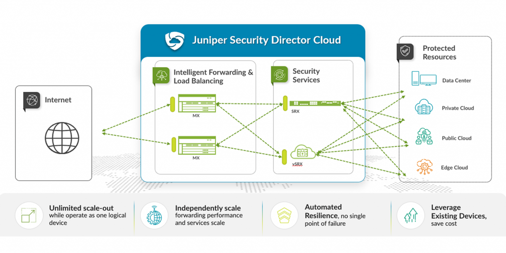
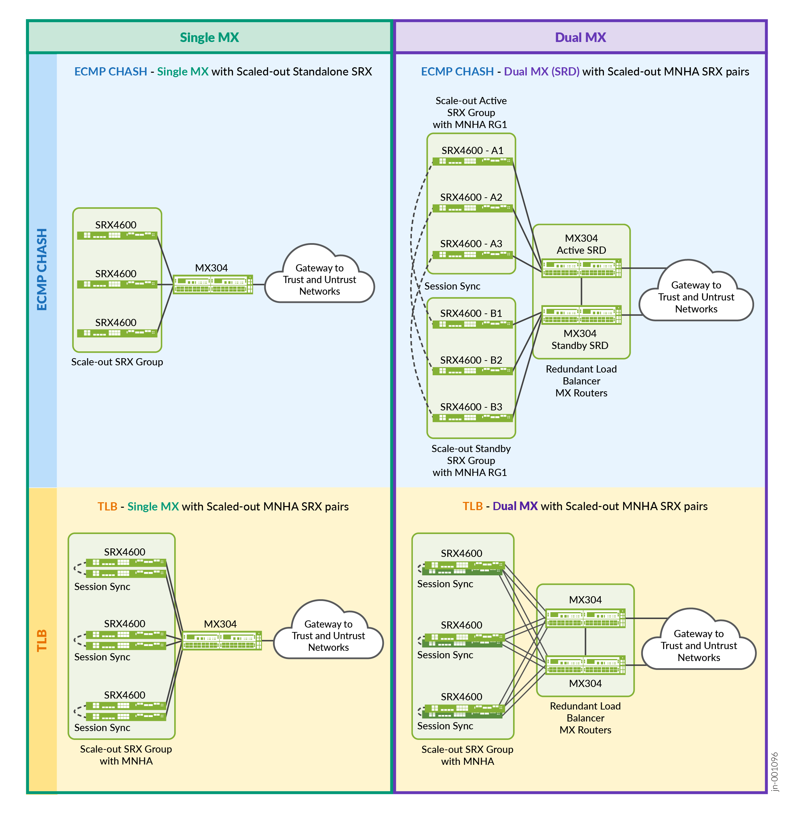

# Scale-Out IPsec Solution for Enterprises — Design Guide

> Faithful markdown conversion of the published Juniper Validated Design
> **Scale-Out IPsec Solution for Enterprises — JVD** (`MSE-SCALEOUT-IPSEC-ENT-01-01`,
> published 2025-05-26). The PDF on juniper.net is the source of truth.
> Exhaustive per-device configurations are **linked** to
> [../configuration/conf](../configuration/conf) rather than reproduced in full;
> representative excerpts are included to illustrate each mechanism.
>
> This is the **Enterprise** framing of the shared CSDS ScaleOut architecture.
> The technical architecture, platforms, load-balancing methods, and validated
> topologies are common with the Mobile Service Provider variant; see
> [design-guide-mobile-sp.md](design-guide-mobile-sp.md) for the MSP framing.

## Table of Contents

- [About this Document](#about-this-document)
- [Solution Benefits](#solution-benefits)
- [Use Case and Reference Architecture](#use-case-and-reference-architecture)
- [Supported Platforms and Positioning](#supported-platforms-and-positioning)
- [Test Objectives](#test-objectives)
- [Solution Architecture](#solution-architecture)
- [Results Summary and Analysis](#results-summary-and-analysis)
- [Additional Resources](#additional-resources)

## About this Document

This document covers the Juniper Scale-Out Security Services Solution, delivering
a scalable solution for security services that scales on your business needs to
enable security at high speed and high rate without using a very large chassis.
The solution scales easily from small virtual to large security performance and
scaling needs.

### Table 1: Solution Platforms Summary

| Solution | Forwarding Layer | Service Layer |
|---|---|---|
| Scale-Out Security Services for Enterprises | MX304 Universal Edge Router | SRX4600, vSRX |

## Solution Benefits

The Juniper Scale-Out Security Services Solution is a scalable IPsec Security
Gateway (IPSEC) for use in central offices or data centres in enterprises or
managed security providers. The security complex leverages the scale-out network
architecture and automation with tight integration between routing and security
services elements, represented by MX universal routers and SRX Series Firewalls.
This provides the best routing and security stacks of both worlds for optimal
performance and total cost of ownership. The scale-out approach offers advantages
over scale-up or integrating security engines directly into the routing domain,
including:

- Highly scalable IPsec systems with respect to number of tunnels and IPv4/IPv6 prefixes
- Pay-as-you-grow approach
- Flexibility to handle unpredictable traffic growth
- High availability with sub-second restoration for IPsec Security Associations
- Optimal operational preferences for a choice of physical or virtual nodes
- Improved time to market for security services on new platforms
- Flexible placement for security services in the network



*Figure 1. Juniper Scale-Out general architecture.*

This solution is equally applicable for greenfield deployments or as a nested
solution on top of existing MX Series Routers in centralized or distributed
networks, allowing flexibility in placement of services across enterprise and
data center infrastructure.

The Scale-Out Security Services Solution provides a scale-out model for enabling
high-capacity IPsec Gateway services combining Juniper MX Series modular and
compact routers with Juniper vSRX and SRX4600 security products (Virtual Network
Functions or Appliances). Generally, a solution includes three layers: security
services layer, forwarding layer, and management and control layer. This JVD
focuses on the first two layers only.

### Security Services Layer

- IPsec security services (terminating IPsec from branch / data centers / MSS / users)
- Stateful firewall (the SRX Series Firewall handles all traffic in a stateful way, even within IPsec)
- High availability function (using Multinode High Availability, MNHA)

### Forwarding Layer

- Router forwarding plane with virtual routing instances ("external" and "internal")
- Load balancing between multiple nodes of the security service layer
- High availability function
- May optionally include a distribution forwarding layer

## Use Case and Reference Architecture

This JVD is part of a series of JVDs using the same scale-out principle. It covers
the **enterprise** use case for the IPsec Security Gateway.

The Juniper Scale-Out Security Services architecture includes two main functional
blocks:

- The security services device — a standalone vSRX virtual network function or
  SRX4600 Firewall, or a redundant pair of the same device.
- The MX Series Routers as load-balancer routers, providing 100G or 400G
  interfaces to the vSRX servers or the SRX4600s that form the services complex.
  Both access-side and Internet-side peering are enabled through dedicated MX
  Series Router ports for high throughput.


*Figure 2. Scale-out solution functional blocks.*

With the Trio 6 MX10004/10008 systems, capacity per slot is up to 9.6 Tbps, and
with the compact MX304, capacity per system is up to 4.8 Tbps. An MX304 can
provide up to 48 × 100G interfaces; an LC9600 line card in a modular MX10000 up to
96 × 100G ports. To optimize port usage, an intermediate distribution layer with
two (or more) QFX Series switches can aggregate multiple SRX/vSRX nodes into
bundled 400GE links on the MX Series Router. SRX4600 offers 400 Gbps throughput
(up to 4 × 100GE) in a 1RU appliance. vSRX is a VNF running on KVM or VMware, with
flexible compute allocation (up to 32 cores, 64 GB memory), and can use virtio or
SR-IOV with smart NICs (such as Mellanox ConnectX-6) with hardware acceleration
for IKE and IPsec (AES-NI for DH and RSA algorithms).

An external BGP (eBGP) protocol with BFD provides routing and control between
network elements, while load balancing is implemented with one of two approaches:

- Equal-Cost Multipath (ECMP) load balancing with Consistent Hashing (CHASH)
- RE-based Traffic Load Balancer (TLB) function on MX Series Routers

Two routing instances — Internet and Internal — are used on the MX Series Router
to peer with the corresponding network segments and the security nodes. BFD failure
detection uses timers as low as 100 ms. Source-based IPv4/IPv6 ECMP CHASH is used
on the Internet side with the IPsec services. ECMP CHASH limits the impact on
existing flows when a service node fails or is added — only impacted flows are
rehashed and rebalanced — minimizing the blast radius of a single node failure.

### Solution Deployment Scenarios

Figure 3 shows the three main topologies covered in this JVD, combining
standalone/dual MX Series Router with standalone/MNHA SRX Series Firewalls, each
on a particular load-balancing mechanism (ECMP or TLB). It uses three SRX Series
Firewalls for the first topology and doubles them to three pairs for the others.



*Figure 3. Validated topologies (the four common CSDS ScaleOut architectures).*

- **ECMP CHASH** is simpler to use, leverages standard protocols and the well-known
  ECMP mechanism — a preferable option for some enterprise operations departments,
  though somewhat limited in failover capabilities.
- **TLB** is the latest load-balancing capability, leverages services-level load
  balancing, offers better redundancy, and can be multiplied with different local
  groups — useful when combining different use cases on the same architecture,
  though it may not be backward compatible with older Junos OS releases.

### Table 2: Validated Features Combination

| Load-Balancing Method | Junos OS Release for MX | Number of MX | Security Features | SRX Standalone | SRXs MNHA Cluster |
|---|---|---|---|---|---|
| ECMP with Consistent Hashing | 23.4R2 | Single MX | IPSEC | Yes | No |
| Traffic Load Balancer (TLB) with Health Checking | 23.4R2 | Single MX | IPSEC | Yes | Yes |
| Traffic Load Balancer (TLB) with Health Checking | 23.4R2 | Dual MX | IPSEC | Yes | Yes |

> **Note:** The Scale-Out solution uses only standard mechanisms and protocols
> between components — no proprietary protocols. The exception is how load
> balancing is implemented internally on the MX Series Router.

Networking features deployed and validated in this JVD:

- Dynamic routing using BGP; dynamic fault detection using BFD
- Load balancing of sessions across multiple SRX Series Firewalls (standalone or HA)
- Load balancing using ECMP CHASH (first appeared in Junos OS Release 13.3R3)
- Load balancing using TLB on the MX Series Router (first appeared in Junos OS Release 16.1R6)
- MX Series Router redundancy between two MX Series Routers with TLB (including dynamic routing)
- SRX Series Firewalls redundancy using MNHA as Active/Backup with session synchronization
- Dual-stack IPv4 and IPv6 (for outer IPsec and inner tunnelled traffic)
- IPsec (auto VPN, responder-only mode); AES-256-GCM for IPsec encryption
- Stateful firewall (SFW) inherently used for traffic inside the IPsec tunnels

Platforms per JVD: Routing/Load Balancer **MX304** (Junos OS Release 23.4R2);
Security Services **vSRX and SRX4600** (Junos OS Release 23.4R2).

#### Deployment Scenario 1 — ECMP CHASH — Single MX with Scaled-Out Standalone SRX Firewalls

The simplest but least redundant topology. Resiliency is provided at MX hardware
level (redundant RE, PSU). There is no protection against MX failure. Service-node
failure is handled by redistributing flows between remaining nodes, but without
session synchronization the affected flows must re-establish (longer restoration).

- **Pros:** Simplicity; scaling with each individual SRX Series Firewall.
- **Cons:** No redundancy.

#### Deployment Scenario 2 — TLB — Single MX with Multiple SRX MNHA Pairs

Offers redundancy for the SRX Series Firewalls but not the MX Series Router. All
SRX Series Firewalls are in MNHA pairs for session synchronization and failover.

- **Pros:** Redundancy and scaling with each SRX pair.
- **Cons:** No router redundancy (except dual RE).

#### Deployment Scenario 3 — TLB — Dual MX with Multiple SRX MNHA Pairs

The most redundant topology, for both MX Series Routers and SRX Series Firewalls,
using all components simultaneously. Any failover is covered by BGP route
announcement and BFD-accelerated detection. SRX Series Firewalls run in
Active/Backup or Active/Active; each SRX connects to both MX Series Routers.

- **Pros:** Full redundancy and scaling for MX and SRX pairs.
- **Cons:** More interfaces used on the MX (if directly connected); an optional
  distribution layer covers larger connectivity needs.

## Supported Platforms and Positioning

### Test Optics

- QSFP-100GBASE-SR4: between MX304 and SRX4600s
- QSFP28-100G-AOC-3M: between MX304 and servers hosting vSRXs

The technical validation extends to all hardware-compatible optics; see the
Juniper Hardware Compatibility Tool for SRX4600, MX304, and MX10004.

### vSRX Setup and Sizing

This JVD focuses on the functional aspect; server power and vSRX size are not
material to the tested features. For real-world performance, high-end servers
(Intel Gold or AMD 9K CPUs, 256 GB RAM, ConnectX-6/7 interfaces) with large vSRX
sizes (16 vCPU, 32 GB RAM) are proposed.

## Test Objectives

The test objective is to validate the Scale-Out architecture across the various
topologies (single/dual MX Series Routers and multiple SRX Series Firewalls) and
demonstrate the ability to respond to various use cases while scaling. The two
main load-balancing methods (ECMP CHASH and TLB) are exercised with high
availability of the various components.

### Test Goals

Validate system behavior under the following administrative events, with a general
expectation of little or no effect on traffic:

- Adding a new SRX Series Firewall to the service layer (minor redistribution)
- Removing an SRX Series Firewall (redistribution only for its associated flows)
- SRX failover to its peer (MNHA) and return to normal — no disruption; sessions
  and IPsec SAs preserved
- MX Series Router failover (dual MX) — no disruption expected

### Test Non-Goals

- Maximum scale/performance of individual network elements
- Automated onboarding of the vSRX; Security Director Cloud or on-prem
- Application and Advanced Security features (App ID, IDP, URL filtering, other L7)
- IKE/IPsec negotiation using protocols other than AES-GCM, or initiator mode
- IKE using PKI (not used here; works the same way)

### Event Testing

**SRX Series Firewalls failure events:** MX-to-SRX link failures; SRX reboot; SRX
power off; complete MNHA pair power off; IKE/IPsec failures.

**MX Series Router failure events:** reboot; restart routing process; restart
traffic-dird daemon; restart Network-monitor daemon; restart sdk-process; GRES;
ECMP/TLB next-hop addition/deletion; SRD-based CLI switchover between MX (ECMP).

Traffic recovery is validated after all failure scenarios. UDP traffic is
generated using IXnetwork for all failure-related test cases to measure failover
convergence time.

### Tested Traffic Profiles

#### Table 3: Tested Traffic Profiles Per SRX (or MNHA Pair)

| Tunnel Count / MNHA Pair | Packet Size | Traffic Type | Throughput | Platform |
|---|---|---|---|---|
| 1000 | SECGW-IMIX | UDP | 40 Gbps | SRX4600 |
| 1000 | SECGW-IMIX | UDP | 40 Gbps | vSRX (CPU/vSRX ≈ 90%) |

Packet size uses a security-gateway Internet mix, ~700-byte average. Packet size:
weight distribution — 64:8, 127:36, 255:11, 511:4, 1024:2, 1518:39. The lab used
end-to-end MTU 9000 to prevent fragmentation.

## Solution Architecture

### Traffic Path in the IPsec Scale-Out Solution

The scale-out solution uses BGP as the dynamic routing protocol so all MX Series
Routers and SRX Series Firewalls learn from surrounding networks and exchange path
information for traffic sent from the MX Series Router across each SRX Series
Firewall to the next MX Series Router. Each SRX announces its own IKE/IPsec
termination gateway to its BGP peers with the same network cost, so the load
balancer can distribute across each SRX. The MX on the left uses the UNTRUST-VR
routing instance (IPsec side); the MX on the right uses TRUST-VR (clear-text side).
Return traffic uses the unique inner IP address (Auto Route Injection, ARI) so it
reaches the correct SRX that holds the IPsec Security Association.

> **Note:** In the diagrams and config examples, the "publicly" announced IKE
> gateway address is `172.16.1.1/32` (RFC 1918 space, for demonstration). Other
> `10.0.0.0/8` addresses are private per the same RFC.

### Introduction to SRX Series Firewalls Multinode High Availability (MNHA)

MNHA addresses high-availability requirements: both control and data planes of the
participating nodes are active at the same time, providing inter-chassis
resiliency. Nodes may be co-located or geographically separated. Nodes communicate
status over an Inter-Chassis Link (ICL, direct or routed) and synchronize sessions
and IKE SAs; they do not share a common configuration (commit-sync keeps shared
elements consistent). MNHA uses one or more services redundancy groups (SRGs);
SRG0 is always active on both nodes (used natively by scale-out to load balance
across both SRX at once), while SRG1+ supports Active/Backup with health checking.

MNHA network modes:

- **Default Gateway / L2 mode** — same L2 segment on each side; both SRX share a
  common IP/MAC per segment.
- **Hybrid mode** — L2 (broadcast domain) + IP on one side, routing on the other.
- **Routing / L3 mode** — used by this JVD: each side uses a different IP address,
  all communication via routing. Ideal for scale-out communication using BGP with
  the MX Series Router.

### ECMP Consistent Hashing (CHASH) Load Balancing

ECMP allows traffic of the same flow to be transmitted across multiple equal-cost
paths. To maintain symmetry with stateful security devices, traffic from a
subscriber must always traverse the same SRX in both directions. MX Series Routers
perform symmetric hashing on a source IP (upstream) / destination IP (downstream)
basis. Consistent load balancing overrides the default behavior so only flows on
inactive links are redistributed; existing active flows remain undisturbed. Adding
a new SRX moves an equal proportion of flows from each existing node to the new
one, minimizing impact.

Representative MX source-hash policy on the UNTRUST side (to the shared IKE gateway
unicast address):

```junos
policy-options {
    prefix-list ipsec_sites_v4 { 172.16.255.0/24; }        /* source IPsec remote sites */
    prefix-list IPsecGW_v4 { 172.16.1.1/32; }              /* same target IKE gateway on each SRX */
    policy-statement pfe_lb_hash {
        term source_hash {
            from { prefix-list-filter IPsecGW_v4 exact; }
            then { load-balance source-ip-only; accept; }
        }
        term ALL-ELSE { then { load-balance per-packet; accept; } }
    }
}
routing-options { forwarding-table { export pfe_lb_hash; } }
```

Representative consistent-hash import policy toward the SRX group:

```junos
policy-options {
    policy-statement pfe_consistent_hash {
        from { prefix-list-filter IPsecGW_v4 exact; }
        then { load-balance consistent-hash; accept; }
    }
}
```

### Traffic Load Balancer (TLB)

TLB provides stateless load balancing as an inline PFE service on the MX Series
Router. For the scale-out solution, the non-translated Direct Server Return (L3)
mode is used. The RE health-checks each SRX (ICMP by default; also HTTP/TCP/custom)
and programs a selector table in the PFE. Filter-based forwarding pushes
client-to-server traffic to the TLB instance; server-to-client is routed directly
back to the client. On MX304/MX10000, TLB runs in **routing-engine-mode**.

Representative TLB service block (with the IPsec service):

```junos
services {
    traffic-load-balance {
        routing-engine-mode;                       /* required on MX304/MX10K */
        instance ipsec_lb {
            interface lo0.0;
            client-vrf UNTRUST_VR;
            server-vrf UNTRUST_VR;
            group mnha_srx_group {
                real-services [ MNHA_SRX1 MNHA_SRX2 ];
                routing-instance UNTRUST_VR;
                health-check-interface-subunit 0;
                network-monitoring-profile icmp-profile;
            }
            real-service MNHA_SRX1 { address 172.16.0.101; }
            real-service MNHA_SRX2 { address 172.16.0.102; }
            virtual-service srx_untrust_vs {
                mode direct-server-return;
                address 172.16.1.1;
                routing-instance srx-tproxy-fi;
                group mnha_srx_group;
                load-balance-method { hash { hash-key { source-ip; } } }
            }
        }
        network-monitoring {
            profile icmp-profile { icmp; probe-interval 1; failure-retries 5; recovery-retries 1; }
        }
    }
}
```

Representative SRX IKE/IPsec (responder-only auto-VPN, AES-256-GCM):

```junos
security {
    ike {
        proposal IKE_PROP {
            authentication-method pre-shared-keys;
            dh-group group2; authentication-algorithm sha1;
            encryption-algorithm aes-256-cbc; lifetime-seconds 3600;
        }
        gateway avpn_ike_gw {
            ike-policy IKE_POLICY;
            dynamic { hostname .juniper.net; ike-user-type group-ike-id; }
            dead-peer-detection { probe-idle-tunnel; interval 10; threshold 3; }
            external-interface lo0.0; local-address 172.16.1.1; version v2-only;
        }
    }
    ipsec {
        proposal IPSEC_PROP { protocol esp; encryption-algorithm aes-256-gcm; lifetime-seconds 3600; }
        vpn avpn_ipsec_vpn {
            bind-interface st0.0;
            ike { gateway avpn_ike_gw; ipsec-policy IPSEC_POLICY; }
            traffic-selector ts { local-ip 0.0.0.0/0; remote-ip 0.0.0.0/0; }
        }
        anti-replay-window-size 512;
    }
}
```

### Common Configuration

For dual MX topologies, both routers must compute the same hash value:

```junos
forwarding-options { enhanced-hash-key { symmetric; } }
```

> **Note:** These configurations also apply to IPv6.

The excerpts above are illustrative. The complete, per-device configurations for
this JVD (MX304 load balancer, MX304 IPsec initiator gateway, and the SRX4600
cluster nodes) are in
[../configuration/conf](../configuration/conf) — see
[../README.md](../README.md) for the device/config map.

## Results Summary and Analysis

The JVD shows that scale-out leverages both the MX Series Routers (as a load
balancer with ECMP CHASH and TLB) and the SRX Series Firewalls (as an IPsec
security service). Both physical (SRX4600) and virtual (vSRX) firewalls are used
the same way. Simple BGP + BFD integration provides fast convergence. Adding a new
service node is simple and does not disturb the global service.

- **ECMP CHASH** shows steady restoration (milliseconds). With ECMP, all SRX must
  be the same model.
- **TLB** does not require identical devices, supports around 2,000 groups per MX
  and around 256 SRX members, works with fast restoration timers, and offers more
  deployment flexibility (single or dual MX) and better handling of SRX in MNHA
  clusters.

SRX Series Firewalls are used as terminating (not initiating) gateways for all
IPsec VPNs from remote entities — a single, simple IKE/IPsec entry serves all SRX
in the group, which is what makes scaling out practical. SRX always performs
stateful firewalling in addition to IPsec.

## Additional Resources

- Service Redundancy Daemon (SRD); Equal-Cost Multipath (ECMP); Load Balancing
  Using Source or Destination IP Only; ECMP Consistent Hashing; Traffic Load
  Balancing (TLB); Junos OS Symmetrical Load Balancing; Multinode High
  Availability; IKE and IPsec VPN Overview; Connected Security Distributed
  Services (CSDS) — see the published JVD for the full labeled link list.

## Sources

- Published JVD: *Scale-Out IPsec Solution for Enterprises — JVD*
  (`MSE-SCALEOUT-IPSEC-ENT-01-01`, 2025-05-26), juniper.net validated designs.
- Companion docs in this folder: [solution-overview-enterprise.md](solution-overview-enterprise.md),
  [test-report-brief-enterprise.md](test-report-brief-enterprise.md),
  [datasheet.md](datasheet.md).
- Mobile SP framing: [design-guide-mobile-sp.md](design-guide-mobile-sp.md).
- Configurations: [../configuration/conf](../configuration/conf).
- Connected Security Distributed Services (CSDS) deployment guide, juniper.net.
